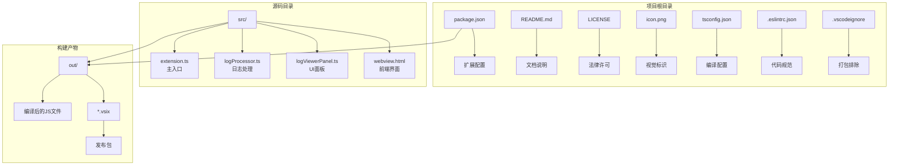
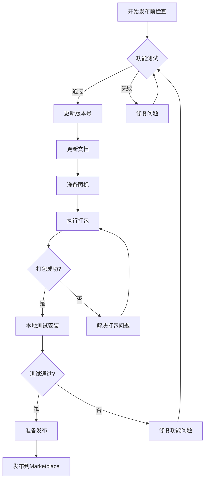
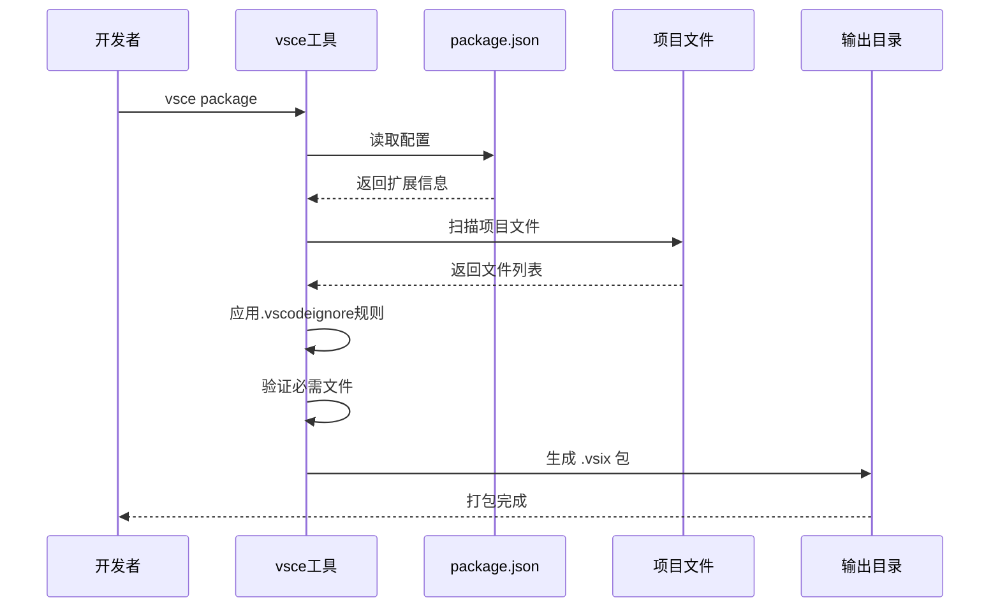
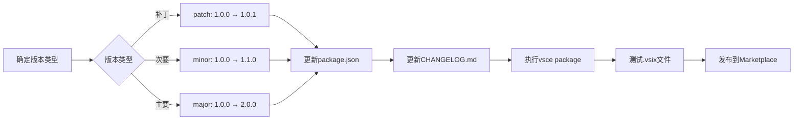
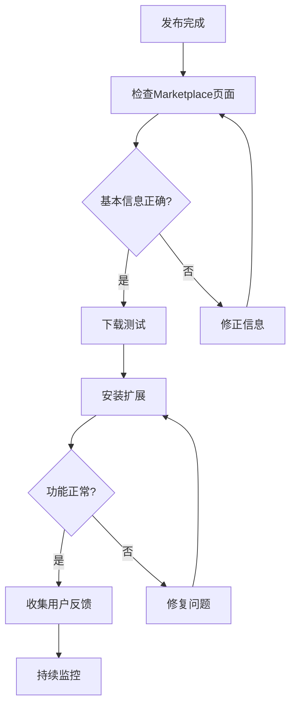

# VSCode扩展发布指南

<cite>
**本文档中引用的文件**
- [PUBLISH_GUIDE.md](file://PUBLISH_GUIDE.md)
- [package.json](file://package.json)
- [README.md](file://README.md)
- [LICENSE](file://LICENSE)
- [tsconfig.json](file://tsconfig.json)
- [.eslintrc.json](file://.eslintrc.json)
- [.vscodeignore](file://.vscodeignore)
- [icon.png](file://icon.png)
</cite>

## 目录
1. [简介](#简介)
2. [发布前准备工作](#发布前准备工作)
3. [项目结构概览](#项目结构概览)
4. [发布前检查清单](#发布前检查清单)
5. [打包流程详解](#打包流程详解)
6. [版本管理与更新](#版本管理与更新)
7. [发布方式对比](#发布方式对比)
8. [发布后验证](#发布后验证)
9. [常见问题与解决方案](#常见问题与解决方案)
10. [最佳实践建议](#最佳实践建议)
11. [相关链接](#相关链接)

## 简介

本指南基于实际的VSCode扩展项目，提供了从开发完成到正式发布的完整流程。该扩展是一个专业的日志文件查看工具，支持大文件处理、智能搜索、过滤和分析功能。

## 发布前准备工作

### 环境要求
- Node.js >= 18.0.0
- VSCode >= 1.75.0
- TypeScript >= 5.0.0

### 必需文件检查
确保以下文件存在于项目根目录：
- `package.json` - 扩展配置文件
- `README.md` - 功能说明文档
- `LICENSE` - 许可证文件
- `icon.png` - 扩展图标（128x128像素）
- `tsconfig.json` - TypeScript编译配置
- `.eslintrc.json` - 代码质量配置

**节来源**
- [package.json](file://package.json#L1-L94)
- [README.md](file://README.md#L1-L286)
- [LICENSE](file://LICENSE#L1-L22)
- [icon.png](file://icon.png)

## 项目结构概览



**图表来源**
- [package.json](file://package.json#L1-L94)
- [tsconfig.json](file://tsconfig.json#L1-L19)
- [README.md](file://README.md#L181-L195)

## 发布前检查清单

### 核心配置检查

#### 1. package.json配置
- **更新publisher字段**：将`"publisher": "wake"`修改为你的VSCode Marketplace发布者ID
- **更新repository.url**：确保Git仓库地址正确
- **版本号管理**：确认当前版本号准确无误
- **图标路径**：验证`"icon": "icon.png"`路径正确

#### 2. 文档完整性
- **README.md**：包含清晰的功能说明、使用截图和示例
- **许可证**：已添加MIT许可证或其他合适的开源协议

#### 3. 资源文件
- **图标文件**：128x128像素PNG格式，建议256x256像素
- **截图和演示**：在README中添加功能截图或GIF演示

### 功能验证清单



**图表来源**
- [PUBLISH_GUIDE.md](file://PUBLISH_GUIDE.md#L1-L10)

**节来源**
- [PUBLISH_GUIDE.md](file://PUBLISH_GUIDE.md#L1-L10)
- [package.json](file://package.json#L2-L8)

## 打包流程详解

### 第一步：环境准备和编译

```bash
# 安装所有依赖
npm install

# 编译TypeScript代码
npm run compile
```

### 第二步：安装vsce工具

```bash
# 全局安装vsce（VSCode扩展打包工具）
npm install -g @vscode/vsce
```

### 第三步：生成.vsix文件

```bash
# 生成 .vsix 文件
vsce package
```

这将在项目根目录生成类似`big-log-viewer-1.0.0.vsix`的文件。

### 打包过程详解



**图表来源**
- [PUBLISH_GUIDE.md](file://PUBLISH_GUIDE.md#L14-L36)
- [package.json](file://package.json#L79-L80)

**节来源**
- [PUBLISH_GUIDE.md](file://PUBLISH_GUIDE.md#L14-L36)
- [package.json](file://package.json#L79-L80)

## 版本管理与更新

### 版本号更新方式

#### 方法一：手动修改package.json
```json
{
  "version": "1.0.1"  // 修改这里
}
```

#### 方法二：使用vsce命令自动更新
```bash
# 补丁版本（1.0.0 → 1.0.1）
vsce publish patch

# 次要版本（1.0.0 → 1.1.0）
vsce publish minor

# 主要版本（1.0.0 → 2.0.0）
vsce publish major
```

### 更新说明维护

在`CHANGELOG.md`中记录每次更新的重要变更：

```markdown
# 变更日志

## v1.0.1 - 2024-01-15
### 新增
- 支持更多日志时间格式识别
- 添加暗色主题适配

### 修复
- 修复大文件加载时的内存泄漏问题
- 优化搜索性能，提升响应速度

### 优化
- 改进虚拟滚动算法，提升滚动流畅度
- 优化UI交互体验
```

### 版本发布流程



**图表来源**
- [PUBLISH_GUIDE.md](file://PUBLISH_GUIDE.md#L87-L108)

**节来源**
- [PUBLISH_GUIDE.md](file://PUBLISH_GUIDE.md#L87-L113)
- [package.json](file://package.json#L5)

## 发布方式对比

### 方式一：使用vsce命令行发布

#### 1. 创建发布者账号
- 访问 https://marketplace.visualstudio.com/manage
- 使用Microsoft账号登录
- 创建发布者（Publisher）

#### 2. 获取Personal Access Token (PAT)
- 访问 https://dev.azure.com
- 进入 User Settings → Personal Access Tokens
- 创建新Token，权限选择 `Marketplace` → `Manage`
- 保存Token（只显示一次！）

#### 3. 登录vsce
```bash
vsce login <your-publisher-name>
# 输入刚才获取的PAT
```

#### 4. 发布扩展
```bash
vsce publish
```

### 方式二：手动上传

#### 1. 访问VSCode Marketplace管理页面
- https://marketplace.visualstudio.com/manage

#### 2. 创建新扩展
- 点击 `New Extension` → `Visual Studio Code`

#### 3. 上传.vsix文件
- 选择之前生成的`.vsix`文件
- 填写扩展信息
- 提交审核

### 发布方式对比表

| 特性 | 命令行发布 | 手动上传 |
|------|------------|----------|
| **自动化程度** | 高 | 低 |
| **错误处理** | 自动化 | 手动 |
| **版本控制** | 依赖vsce命令 | 手动管理 |
| **适用场景** | 生产环境 | 小规模测试 |
| **学习成本** | 中等 | 低 |
| **网络要求** | 需要稳定连接 | 需要稳定连接 |

**节来源**
- [PUBLISH_GUIDE.md](file://PUBLISH_GUIDE.md#L53-L84)

## 发布后验证

### 验证步骤清单

1. **Marketplace页面检查**
   - 扩展名称显示正确
   - 描述信息完整
   - 图标正常显示
   - 分类标签准确

2. **功能测试**
   - 在VSCode中搜索你的扩展
   - 安装并测试核心功能
   - 验证所有命令可用性

3. **用户体验评估**
   - 检查安装过程是否顺畅
   - 验证首次使用引导
   - 测试扩展卸载功能

### 验证流程图



**图表来源**
- [PUBLISH_GUIDE.md](file://PUBLISH_GUIDE.md#L114-L119)

**节来源**
- [PUBLISH_GUIDE.md](file://PUBLISH_GUIDE.md#L114-L119)

## 常见问题与解决方案

### 打包相关问题

#### Q: 打包时报错 "no README"
**A:** 确保项目根目录有`README.md`文件

#### Q: 打包时报错 "no LICENSE"
**A:** 在`package.json`添加`"license": "MIT"`或创建LICENSE文件

#### Q: 图标不显示
**A:** 检查`package.json`中的`icon`路径是否正确

#### Q: 扩展安装后无法激活
**A:** 检查`activationEvents`配置是否正确

### 发布相关问题

#### Q: 扩展名称（name）必须唯一
**A:** 
- 检查名称是否已被占用：https://marketplace.visualstudio.com
- 修改`package.json`中的`name`字段
- 确保名称符合命名规范

#### Q: 发布者名称（publisher）要求
**A:** 
- 必须先在Marketplace创建发布者账号
- 只能包含字母、数字和连字符

#### Q: 图标格式和尺寸要求
**A:** 
- 格式：PNG
- 尺寸：至少128x128像素
- 建议：256x256像素，背景透明

### 团队内部分享

如果不想公开发布，只想分享给团队：

#### 1. 通过.vsix文件分享
```bash
vsce package
```
将生成的`.vsix`文件发给团队成员，让他们手动安装。

#### 2. 通过Git仓库
- 团队成员clone仓库
- 执行 `npm install && npm run compile`
- 按F5在开发模式下使用

**节来源**
- [PUBLISH_GUIDE.md](file://PUBLISH_GUIDE.md#L160-L180)

## 最佳实践建议

### 发布前最佳实践

1. **功能完整性验证**
   - 确保所有功能正常工作
   - 进行边界条件测试
   - 验证错误处理机制

2. **文档质量保证**
   - README.md包含清晰的功能说明
   - 添加使用截图或GIF演示
   - 写明安装和使用方法

3. **图标设计规范**
   - 128x128像素起始尺寸
   - PNG格式，支持透明背景
   - 设计简洁，突出功能特色

4. **版本管理策略**
   - 遵循语义化版本控制（SemVer）
   - 明确区分补丁、次要和主要版本
   - 维护详细的CHANGELOG.md

### 发布后维护建议

1. **用户反馈收集**
   - 关注Marketplace评论
   - 及时响应用户问题
   - 根据反馈改进功能

2. **定期更新**
   - 修复发现的bug
   - 添加新功能特性
   - 保持与VSCode版本兼容

3. **性能监控**
   - 监控扩展性能指标
   - 优化内存使用
   - 提升响应速度

## 相关链接

### 官方文档
- VSCode扩展开发文档: https://code.visualstudio.com/api
- VSCode Marketplace: https://marketplace.visualstudio.com
- vsce工具文档: https://github.com/microsoft/vscode-vsce
- 扩展发布指南: https://code.visualstudio.com/api/working-with-extensions/publishing-extension

### 开发工具
- Node.js官方下载: https://nodejs.org/
- VSCode官方下载: https://code.visualstudio.com/
- TypeScript官方文档: https://www.typescriptlang.org/

### 社区资源
- GitHub仓库: https://github.com/uwakeme/large_log_check
- 问题反馈: https://github.com/uwakeme/large_log_check/issues
- VSCode市场: https://marketplace.visualstudio.com/

**节来源**
- [PUBLISH_GUIDE.md](file://PUBLISH_GUIDE.md#L174-L180)