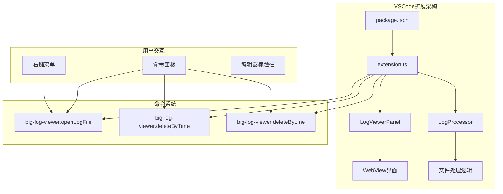
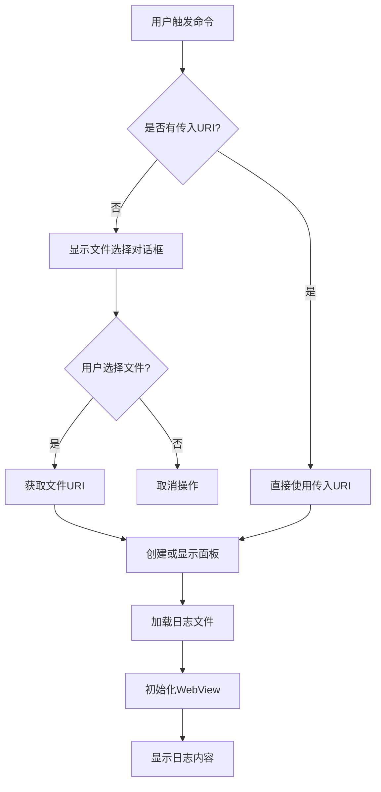
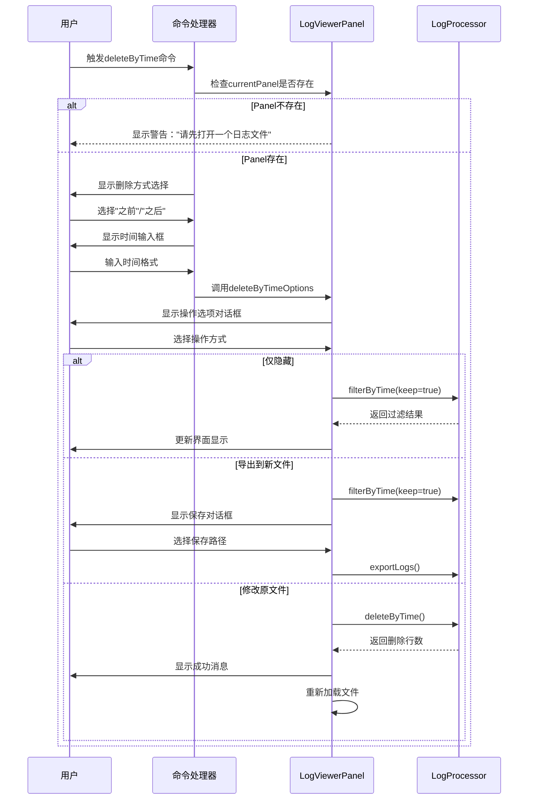
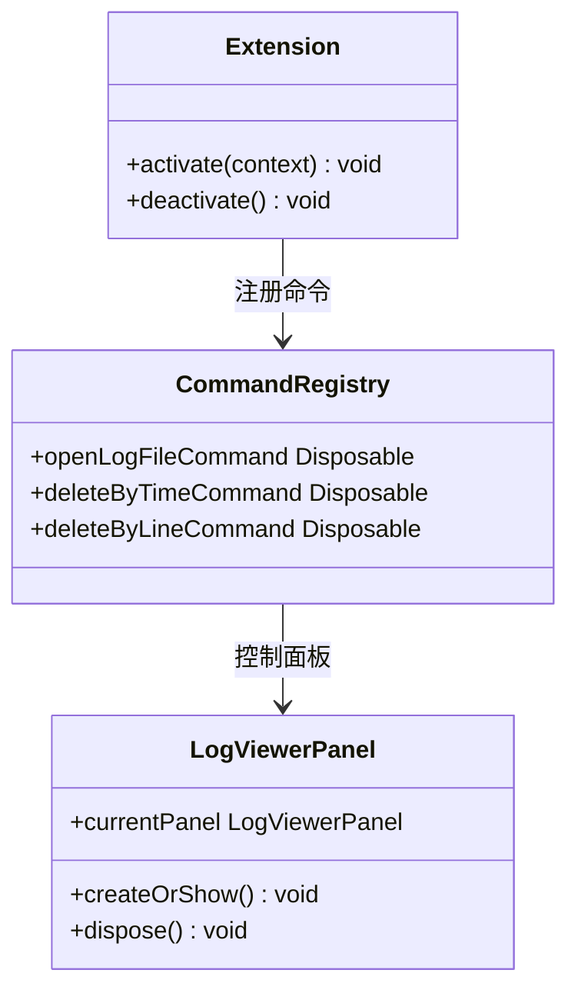
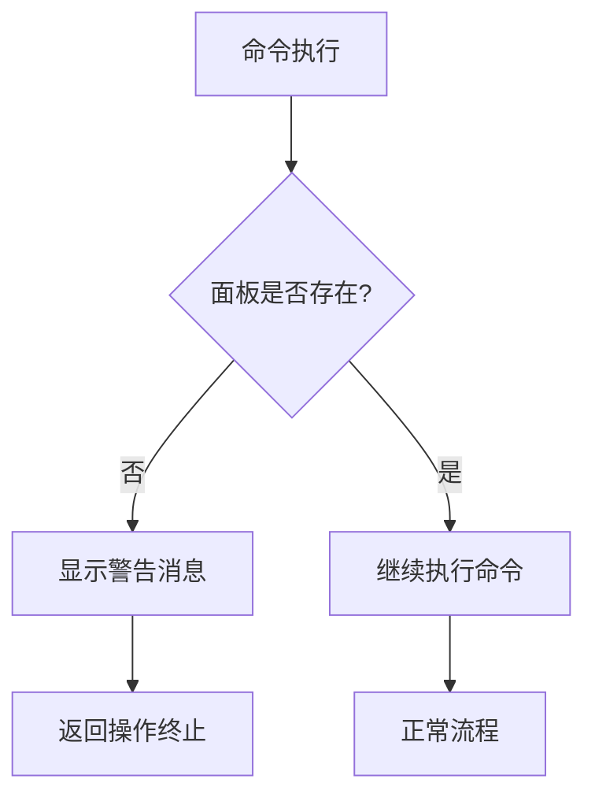

# VSCode命令接口

<cite>
**本文档中引用的文件**
- [extension.ts](file://src/extension.ts)
- [logViewerPanel.ts](file://src/logViewerPanel.ts)
- [logProcessor.ts](file://src/logProcessor.ts)
- [package.json](file://package.json)
- [README.md](file://README.md)
</cite>

## 目录
1. [简介](#简介)
2. [项目架构概览](#项目架构概览)
3. [核心命令详解](#核心命令详解)
4. [命令注册机制](#命令注册机制)
5. [用户交互流程](#用户交互流程)
6. [错误处理机制](#错误处理机制)
7. [参数验证逻辑](#参数验证逻辑)
8. [实际使用示例](#实际使用示例)
9. [最佳实践建议](#最佳实践建议)

## 简介

大日志文件查看器是一个专业的VSCode扩展，专门用于处理大型日志文件（支持几十MB甚至GB级别的文件）。该扩展提供了三个核心命令API，通过VSCode的命令系统与用户进行交互，实现日志文件的打开、按时间删除和按行数删除功能。

## 项目架构概览

该扩展采用模块化架构设计，主要包含以下核心组件：



**图表来源**
- [extension.ts](file://src/extension.ts#L4-L116)
- [logViewerPanel.ts](file://src/logViewerPanel.ts#L6-L510)

**章节来源**
- [extension.ts](file://src/extension.ts#L1-L116)
- [logViewerPanel.ts](file://src/logViewerPanel.ts#L1-L510)

## 核心命令详解

### 1. 打开日志文件命令 - `big-log-viewer.openLogFile`

#### 命令功能
该命令负责打开日志文件并在VSCode中创建日志查看器面板。

#### 触发条件
- 用户右键点击日志文件（.log或.txt扩展名）
- 用户在命令面板中输入"打开大日志文件"
- 用户点击编辑器标题栏中的打开按钮

#### 执行流程



**图表来源**
- [extension.ts](file://src/extension.ts#L8-L32)

#### 参数说明
- `uri` (可选): 文件系统路径的URI对象，允许外部调用直接指定文件

#### 与LogViewerPanel的交互
命令通过调用`LogViewerPanel.createOrShow()`方法与面板建立连接，该方法负责：
- 检查是否已有面板实例
- 创建新的WebView面板
- 加载指定的日志文件
- 初始化面板状态

**章节来源**
- [extension.ts](file://src/extension.ts#L8-L32)
- [logViewerPanel.ts](file://src/logViewerPanel.ts#L14-L40)

### 2. 按时间删除命令 - `big-log-viewer.deleteByTime`

#### 命令功能
允许用户根据时间戳删除日志文件的部分内容，支持删除指定时间之前或之后的日志。

#### 触发条件
- 用户在已打开的日志文件中点击"按时间删除"按钮
- 用户在命令面板中输入"按时间删除日志"

#### 执行流程



**图表来源**
- [extension.ts](file://src/extension.ts#L35-L71)
- [logViewerPanel.ts](file://src/logViewerPanel.ts#L180-L228)

#### 用户交互逻辑
1. **删除方式选择**: 用户可以选择删除"指定时间之前"或"指定时间之后"的日志
2. **时间格式输入**: 支持多种时间格式，包括`YYYY-MM-DD HH:mm:ss`和`YYYY-MM-DD`
3. **操作确认**: 提供三种操作方式的安全确认机制

**章节来源**
- [extension.ts](file://src/extension.ts#L35-L71)
- [logViewerPanel.ts](file://src/logViewerPanel.ts#L180-L228)

### 3. 按行数删除命令 - `big-log-viewer.deleteByLine`

#### 命令功能
允许用户根据行号删除日志文件的部分内容，支持删除指定行之前或之后的日志。

#### 触发条件
- 用户在已打开的日志文件中点击"按行数删除"按钮
- 用户在命令面板中输入"按行数删除日志"

#### 执行流程

```mermaid
flowchart TD
A[用户触发deleteByLine命令] --> B{面板是否打开?}
B --> |否| C[显示警告："请先打开一个日志文件"]
B --> |是| D[显示删除方式选择]
D --> E{用户选择?}
E --> |取消| F[结束操作]
E --> |选择| G[显示行号输入框]
G --> H{输入有效?}
H --> |否| I[显示验证错误]
H --> |是| J[调用deleteByLineOptions]
J --> K[显示操作选项对话框]
K --> L{用户选择操作}
L --> |仅隐藏| M[filterByLineNumber]
L --> |导出到新文件| N[filterByLineNumber + exportLogs]
L --> |修改原文件| O[deleteByLine]
M --> P[更新界面显示]
N --> Q[保存到新文件]
O --> R[重新加载文件]
```

**图表来源**
- [extension.ts](file://src/extension.ts#L74-L110)
- [logViewerPanel.ts](file://src/logViewerPanel.ts#L230-L278)

#### 用户交互逻辑
1. **删除方式选择**: 用户可以选择删除"指定行之前"或"指定行之后"的日志
2. **行号输入**: 支持从1开始的有效行号输入
3. **操作确认**: 提供三种操作方式的安全确认机制

**章节来源**
- [extension.ts](file://src/extension.ts#L74-L110)
- [logViewerPanel.ts](file://src/logViewerPanel.ts#L230-L278)

## 命令注册机制

### 注册方式

所有命令通过`vscode.commands.registerCommand()`方法注册，该方法返回一个Disposable对象，用于管理命令的生命周期。



**图表来源**
- [extension.ts](file://src/extension.ts#L4-L116)

### 命令订阅管理

注册的命令通过`context.subscriptions.push()`方法进行管理，确保在扩展卸载时正确清理资源。

**章节来源**
- [extension.ts](file://src/extension.ts#L112)

## 用户交互流程

### 右键菜单触发

扩展在VSCode的文件资源管理器上下文菜单中添加了"打开大日志文件"选项，当用户右键点击日志文件时可用。

#### 触发条件
- 文件扩展名为`.log`或`.txt`
- 文件存在于本地文件系统中

#### 实现细节
通过`package.json`中的菜单贡献配置实现：
- `explorer/context`菜单项
- `resourceExtname`条件判断
- `navigation`分组组织

### 命令面板输入

用户可以通过命令面板访问所有三个核心命令：

#### 访问方式
1. 按 `Ctrl+Shift+P` (Windows/Linux) 或 `Cmd+Shift+P` (Mac)
2. 输入命令名称或部分描述
3. 从列表中选择对应的命令

#### 命令映射
- "打开大日志文件" → `big-log-viewer.openLogFile`
- "按时间删除日志" → `big-log-viewer.deleteByTime`
- "按行数删除日志" → `big-log-viewer.deleteByLine`

**章节来源**
- [package.json](file://package.json#L49-L67)
- [README.md](file://README.md#L62-L65)

## 错误处理机制

### 未打开文件警告

对于需要面板存在的命令（`deleteByTime`和`deleteByLine`），系统提供明确的错误提示：



**图表来源**
- [extension.ts](file://src/extension.ts#L36-L40)
- [extension.ts](file://src/extension.ts#L75-L79)

### 文件选择错误处理

对于`openLogFile`命令，系统处理以下错误情况：
- 用户取消文件选择对话框
- 选择的文件不存在或无法访问
- 文件格式不符合要求

### 时间格式验证

系统对时间输入进行严格验证，确保：
- 时间格式符合预期模式
- 时间值能够被正确解析
- 提供清晰的错误提示信息

**章节来源**
- [extension.ts](file://src/extension.ts#L56-L65)
- [extension.ts](file://src/extension.ts#L95-L104)

## 参数验证逻辑

### 时间格式验证

#### 支持的时间格式
- `YYYY-MM-DD HH:mm:ss` (推荐格式)
- `YYYY-MM-DD` (简化格式)
- `YYYY/MM/DD HH:mm:ss` (斜杠分隔)
- `DD-MM-YYYY HH:mm:ss` (日期在前)
- ISO 8601格式（带T分隔符）

#### 验证规则
```mermaid
flowchart TD
A[时间输入] --> B{输入为空?}
B --> |是| C[返回错误："时间不能为空"]
B --> |否| D{格式匹配?}
D --> |否| E[返回错误："时间格式不正确"]
D --> |是| F[尝试解析时间]
F --> G{解析成功?}
G --> |否| H[返回解析错误]
G --> |是| I[验证通过]
```

**图表来源**
- [extension.ts](file://src/extension.ts#L56-L65)

### 行号输入验证

#### 验证规则
- 输入不能为空
- 必须是数字字符串
- 数值必须大于0
- 最终转换为整数类型

#### 错误提示
- "行号不能为空"
- "请输入有效的行号（大于0的整数）"

**章节来源**
- [extension.ts](file://src/extension.ts#L95-L104)

## 实际使用示例

### 示例1：通过右键菜单打开日志文件

**使用场景**: 用户在文件资源管理器中发现了一个大型日志文件，想要快速查看其内容。

**操作步骤**:
1. 在文件资源管理器中找到目标日志文件
2. 右键点击文件
3. 选择"打开大日志文件"菜单项
4. VSCode自动创建日志查看器面板
5. 系统开始加载日志文件内容

### 示例2：按时间删除日志

**使用场景**: 用户需要清理超过一个月的旧日志，但又想保留最近的日志。

**操作步骤**:
1. 打开目标日志文件
2. 点击工具栏中的"按时间删除"按钮
3. 选择"删除指定时间之前的日志"
4. 输入时间：`2024-01-01 00:00:00`
5. 选择操作方式：仅隐藏（不修改文件）
6. 系统显示过滤后的日志，保留2024年1月1日之后的日志

### 示例3：按行数删除日志

**使用场景**: 用户发现日志文件中有大量重复的启动日志，想要删除这些重复内容。

**操作步骤**:
1. 打开日志文件
2. 使用搜索功能定位到重复日志的起始行
3. 点击"按行数删除"按钮
4. 选择"删除指定行之前的日志"
5. 输入行号：`1000`
6. 选择操作方式：导出到新文件
7. 选择保存路径，生成新的日志文件

### 示例4：通过命令面板访问功能

**使用场景**: 用户习惯使用键盘快捷键，希望通过命令面板快速访问功能。

**操作步骤**:
1. 按 `Ctrl+Shift+P` 打开命令面板
2. 输入"打开大日志文件"并选择
3. 从文件系统中选择目标日志文件
4. 使用命令面板访问删除功能
5. 通过键盘快速完成操作

**章节来源**
- [README.md](file://README.md#L62-L65)
- [README.md](file://README.md#L125-L132)

## 最佳实践建议

### 性能优化建议

1. **大文件处理**: 对于超过5万行的日志文件，系统采用分页加载策略，先加载前10000行以提升响应速度
2. **内存管理**: 使用流式读取技术，避免一次性加载整个文件到内存
3. **异步操作**: 所有耗时操作都采用异步处理，保持UI响应性

### 安全操作建议

1. **备份提醒**: 在执行删除操作前，强烈建议用户先备份重要日志文件
2. **操作确认**: 所有修改原文件的操作都需要二次确认
3. **操作方式选择**: 提供多种操作方式，让用户选择最安全的处理方式

### 用户体验优化

1. **实时反馈**: 操作过程中提供清晰的状态指示和进度信息
2. **错误处理**: 提供详细的错误信息和解决建议
3. **格式提示**: 输入框提供清晰的格式要求和示例

### 开发维护建议

1. **模块化设计**: 核心功能分离到不同的模块中，便于维护和扩展
2. **类型安全**: 使用TypeScript确保代码的类型安全性
3. **错误边界**: 在关键操作点设置错误边界，防止程序崩溃

**章节来源**
- [logViewerPanel.ts](file://src/logViewerPanel.ts#L118-L147)
- [README.md](file://README.md#L133-L134)