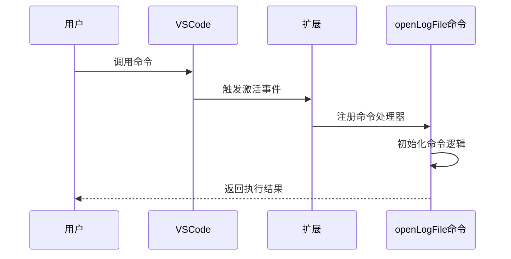
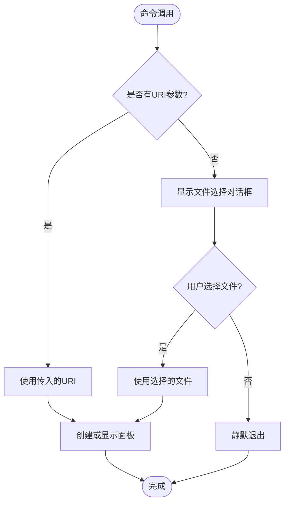
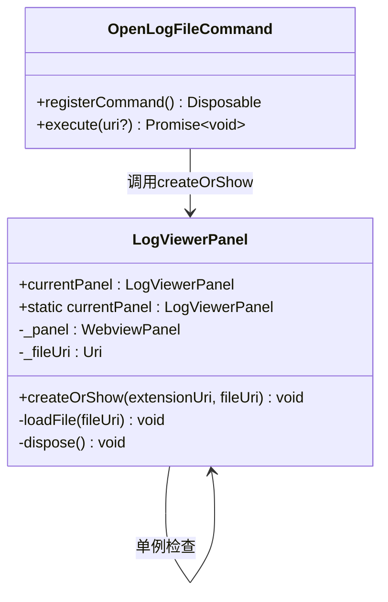
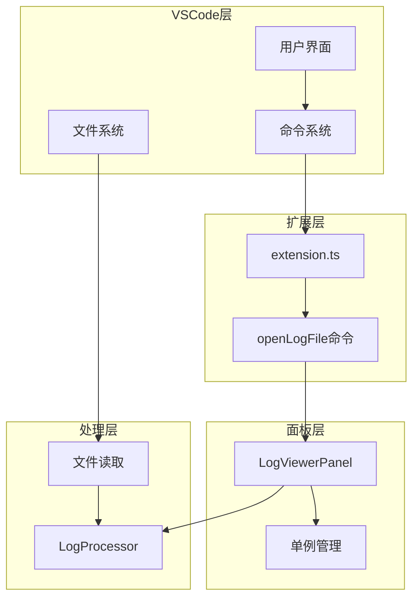

# big-log-viewer.openLogFile 命令详细API文档

<cite>
**本文档引用的文件**
- [package.json](file://package.json)
- [src/extension.ts](file://src/extension.ts)
- [src/logViewerPanel.ts](file://src/logViewerPanel.ts)
- [README.md](file://README.md)
</cite>

## 目录
1. [简介](#简介)
2. [命令注册与激活](#命令注册与激活)
3. [触发方式](#触发方式)
4. [核心功能实现](#核心功能实现)
5. [错误处理机制](#错误处理机制)
6. [单例模式交互](#单例模式交互)
7. [使用示例](#使用示例)
8. [架构设计](#架构设计)
9. [最佳实践](#最佳实践)

## 简介

`big-log-viewer.openLogFile` 是大日志文件查看器扩展的核心命令，作为扩展激活后的第一个入口点。该命令提供了灵活的文件打开方式，支持直接传入文件URI或通过用户交互选择文件，是整个日志查看功能的基础入口。

## 命令注册与激活

### 激活事件配置

该命令通过 `onCommand:big-log-viewer.openLogFile` 激活事件注册，这意味着只有当用户首次调用该命令时，扩展才会被激活。

**图表来源**
- [package.json](file://package.json#L29-L30)
- [src/extension.ts](file://src/extension.ts#L4-L32)

### 命令注册代码结构

命令注册采用异步处理模式，支持可选的文件URI参数：

**章节来源**
- [src/extension.ts](file://src/extension.ts#L7-L32)

## 触发方式

### 1. 右键菜单调用

通过VSCode资源管理器上下文菜单触发，支持 `.log` 和 `.txt` 文件类型。

**触发条件：**
- 文件扩展名为 `.log` 或 `.txt`
- 在资源管理器中右键点击文件
- 选择「打开大日志文件」菜单项

**菜单配置：**
- 菜单位置：`explorer/context`
- 条件表达式：`resourceExtname == .log || resourceExtname == .txt`
- 分组：`navigation`

### 2. 命令面板输入

通过快捷键 `Ctrl+Shift+P` (Mac: `Cmd+Shift+P`) 调用，输入命令名称触发。

**触发步骤：**
1. 按下快捷键组合
2. 在命令面板中输入「打开大日志文件」
3. 选择对应的命令选项

**章节来源**
- [package.json](file://package.json#L52-L67)
- [README.md](file://README.md#L60-L64)

## 核心功能实现

### 参数处理逻辑

命令接受可选的 `uri` 参数，根据参数是否存在决定不同的处理流程：

**图表来源**
- [src/extension.ts](file://src/extension.ts#L8-L31)

### 文件选择对话框配置

当未传入文件URI时，系统会显示文件选择对话框：

**过滤器配置：**
- 日志文件：`.log`, `.txt` 扩展名
- 所有文件：`*` 通配符
- 对话框标题：「选择要打开的日志文件」

**对话框属性：**
- 单选模式：`canSelectMany: false`
- 仅文件选择：`canSelectFolders: false`
- 文件选择：`canSelectFiles: true`

### 面板创建与显示

无论通过哪种方式获取文件URI，最终都会调用 `LogViewerPanel.createOrShow` 方法：

**章节来源**
- [src/extension.ts](file://src/extension.ts#L13-L26)
- [src/extension.ts](file://src/extension.ts#L30)

## 错误处理机制

### 用户取消选择的静默退出

当用户在文件选择对话框中取消操作时，系统会进行以下处理：

1. **检查返回值**：验证 `showOpenDialog` 的返回值
2. **空数组判断**：确认用户确实选择了文件
3. **静默退出**：不显示任何错误信息，直接返回

### 文件加载失败处理

虽然主要的错误处理在 `LogViewerPanel` 类中实现，但命令层面也进行了基本的验证：

**验证逻辑：**
- 确保 `fileUri` 存在
- 传递给面板创建函数前的最终检查

**章节来源**
- [src/extension.ts](file://src/extension.ts#L24-L26)

## 单例模式交互

### LogViewerPanel单例管理

该命令与 `LogViewerPanel` 类采用单例模式交互，确保同一时间仅存在一个日志查看实例：

**图表来源**
- [src/logViewerPanel.ts](file://src/logViewerPanel.ts#L6-L8)
- [src/logViewerPanel.ts](file://src/logViewerPanel.ts#L13-L38)

### 单例检查逻辑

`createOrShow` 方法实现了完整的单例检查和管理：

**检查流程：**
1. **当前实例检查**：检查 `LogViewerPanel.currentPanel` 是否存在
2. **面板显示**：如果存在，显示现有面板并加载新文件
3. **新实例创建**：如果不存在，创建新的面板实例

**章节来源**
- [src/logViewerPanel.ts](file://src/logViewerPanel.ts#L18-L38)

## 使用示例

### 示例1：右键菜单调用

**触发场景：**
- 在VSCode资源管理器中右键点击 `.log` 文件
- 选择「打开大日志文件」菜单项

**执行流程：**
1. VSCode检测文件扩展名
2. 自动调用 `big-log-viewer.openLogFile` 命令
3. 传入文件URI参数
4. 显示日志查看面板

### 示例2：命令面板调用

**触发场景：**
- 按下 `Ctrl+Shift+P` (Mac: `Cmd+Shift+P`)
- 输入「打开大日志文件」
- 选择命令选项

**执行流程：**
1. 显示文件选择对话框
2. 用户选择目标日志文件
3. 传入选定的文件URI
4. 创建日志查看面板

### 示例3：直接文件参数调用

**触发场景：**
- 通过其他VSCode扩展或脚本调用
- 直接传入文件URI参数

**执行流程：**
1. 命令接收文件URI参数
2. 直接调用面板创建方法
3. 显示日志查看面板

**章节来源**
- [README.md](file://README.md#L60-L64)

## 架构设计

### 整体架构概览

该命令的设计体现了清晰的职责分离和模块化架构：

**图表来源**
- [src/extension.ts](file://src/extension.ts#L1-L3)
- [src/logViewerPanel.ts](file://src/logViewerPanel.ts#L1-L5)

### 模块间依赖关系

**依赖层次：**
1. **VSCode API层**：提供基础的文件操作和UI交互
2. **扩展入口层**：命令注册和参数处理
3. **面板管理层**：单例模式和面板生命周期
4. **处理逻辑层**：文件读取和日志解析

**章节来源**
- [src/extension.ts](file://src/extension.ts#L1-L3)
- [src/logViewerPanel.ts](file://src/logViewerPanel.ts#L1-L5)

## 最佳实践

### 命令设计原则

1. **单一职责**：专注于文件打开功能
2. **用户友好**：提供多种触发方式
3. **错误容忍**：优雅处理用户取消操作
4. **资源管理**：通过单例模式控制面板数量

### 性能优化建议

1. **延迟加载**：仅在需要时创建面板实例
2. **内存管理**：及时释放不再使用的面板资源
3. **异步处理**：文件选择和面板创建采用异步模式
4. **缓存策略**：复用现有面板实例

### 错误处理最佳实践

1. **静默退出**：用户取消操作时不显示错误信息
2. **渐进式验证**：在每个关键步骤进行参数验证
3. **资源清理**：确保异常情况下资源得到正确释放
4. **用户体验**：提供清晰的操作反馈

**章节来源**
- [src/extension.ts](file://src/extension.ts#L11-L31)
- [src/logViewerPanel.ts](file://src/logViewerPanel.ts#L18-L38)