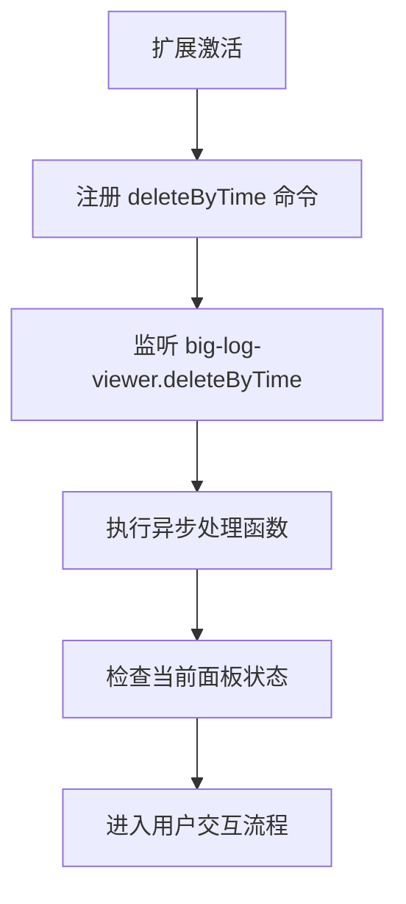
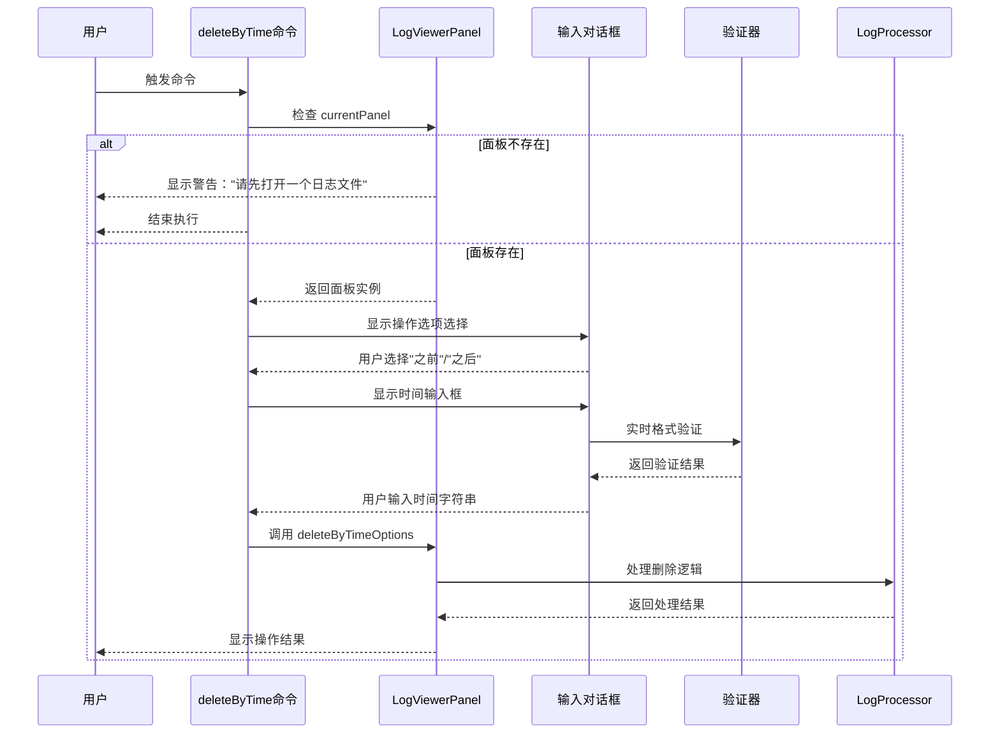
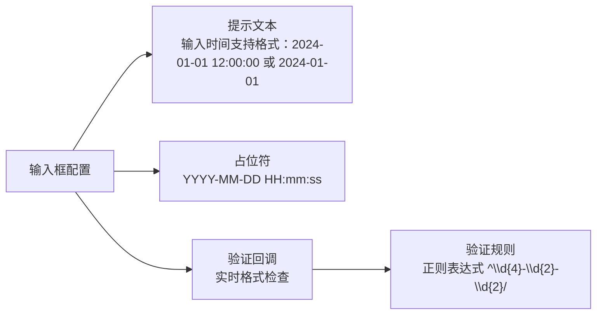
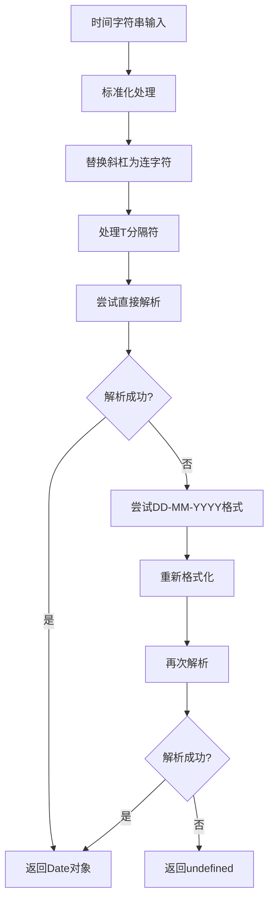
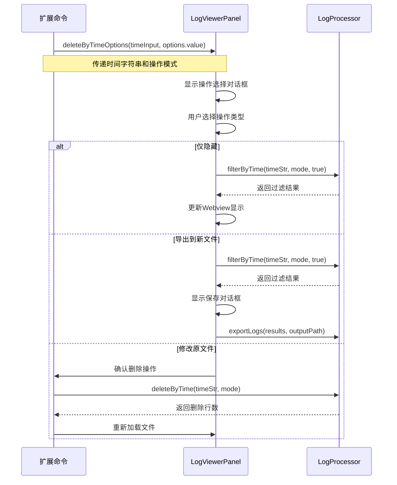
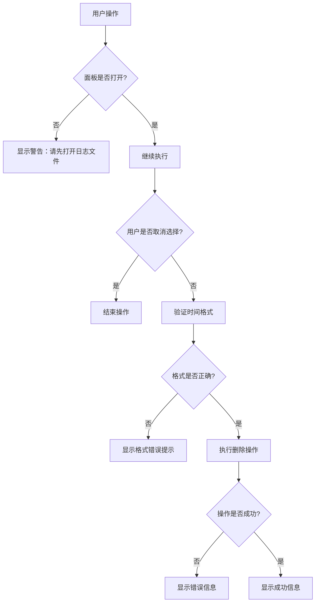
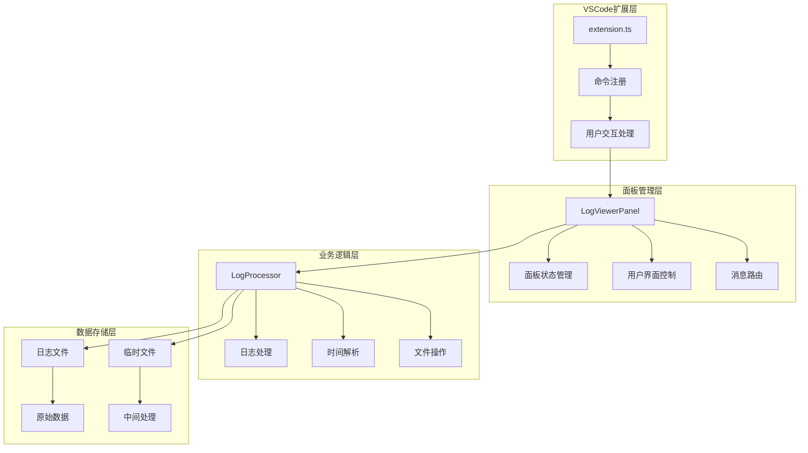

# big-log-viewer.deleteByTime 命令详细API文档

<cite>
**本文档中引用的文件**
- [extension.ts](file://src/extension.ts)
- [logViewerPanel.ts](file://src/logViewerPanel.ts)
- [logProcessor.ts](file://src/logProcessor.ts)
- [package.json](file://package.json)
</cite>

## 目录
1. [简介](#简介)
2. [命令注册与激活](#命令注册与激活)
3. [核心执行流程](#核心执行流程)
4. [用户交互界面](#用户交互界面)
5. [时间格式验证机制](#时间格式验证机制)
6. [面板通信机制](#面板通信机制)
7. [错误处理与反馈](#错误处理与反馈)
8. [完整使用示例](#完整使用示例)
9. [技术架构分析](#技术架构分析)
10. [最佳实践建议](#最佳实践建议)

## 简介

`big-log-viewer.deleteByTime` 是 VSCode 扩展大日志文件查看器中的核心功能命令，允许用户基于时间条件删除日志文件中的特定部分。该命令通过严格的用户交互流程确保操作的安全性和准确性，同时提供了灵活的操作选项。

## 命令注册与激活

### 命令注册位置

该命令在扩展激活函数中通过 `vscode.commands.registerCommand` 方法注册：



**图表来源**
- [extension.ts](file://src/extension.ts#L34-L71)

### 命令配置信息

根据 `package.json` 配置，该命令具有以下特征：
- **命令标识符**: `big-log-viewer.deleteByTime`
- **显示标题**: "按时间删除日志"
- **分类**: "日志查看器"
- **激活事件**: 通过命令调用自动激活

**节来源**
- [extension.ts](file://src/extension.ts#L34-L71)
- [package.json](file://package.json#L42-L44)

## 核心执行流程

### 主要处理步骤



**图表来源**
- [extension.ts](file://src/extension.ts#L35-L70)
- [logViewerPanel.ts](file://src/logViewerPanel.ts#L180-L228)

### 流程详细说明

1. **面板状态检查** (`line 36-39`)
   - 通过 `LogViewerPanel.currentPanel` 获取当前活动面板实例
   - 如果面板不存在，显示警告消息并终止执行

2. **操作方式选择** (`line 42-47`)
   - 使用 `vscode.window.showQuickPick` 提供两个操作选项
   - 选项包括"删除指定时间之前的日志"和"删除指定时间之后的日志"

3. **时间输入处理** (`line 53-66`)
   - 显示输入框，提示用户支持的格式
   - 实现即时验证回调函数进行格式校验

**节来源**
- [extension.ts](file://src/extension.ts#L35-L70)

## 用户交互界面

### 操作选项对话框

用户通过快速选择对话框选择删除操作方式：

| 选项 | 值 | 描述 |
|------|-----|------|
| 删除指定时间之前的日志 | `before` | 保留指定时间及之后的日志 |
| 删除指定时间之后的日志 | `after` | 保留指定时间之前的日志 |

### 时间输入对话框配置



**图表来源**
- [extension.ts](file://src/extension.ts#L53-L66)

### 验证反馈机制

系统实现了多层次的验证反馈机制：

1. **即时验证** (`line 56-65`)
   - 输入过程中的实时格式检查
   - 提供即时的错误提示反馈

2. **确认对话框** (`line 182-188`)
   - 操作前的二次确认
   - 提供三种操作模式选择

**节来源**
- [extension.ts](file://src/extension.ts#L42-L66)
- [logViewerPanel.ts](file://src/logViewerPanel.ts#L182-L228)

## 时间格式验证机制

### 正则表达式验证逻辑

系统使用简化的正则表达式进行时间格式验证：

```typescript
// 验证逻辑路径
if (!/^\d{4}-\d{2}-\d{2}/.test(value)) {
    return '时间格式不正确';
}
```

### 支持的时间格式

| 格式示例 | 描述 | 验证规则 |
|----------|------|----------|
| `2024-01-01 12:00:00` | 完整日期时间 | YYYY-MM-DD HH:mm:ss |
| `2024-01-01` | 仅日期 | YYYY-MM-DD |
| `2024/01/01 12:00:00` | 斜杠分隔 | YYYY/MM/DD HH:mm:ss |
| `2024-01-01T12:00:00` | ISO 8601格式 | YYYY-MM-DDTHH:mm:ss |

### 高级时间解析机制

虽然前端验证使用简化正则，但后端处理器具备更强大的时间解析能力：



**图表来源**
- [logProcessor.ts](file://src/logProcessor.ts#L776-L805)

**节来源**
- [extension.ts](file://src/extension.ts#L61-L63)
- [logProcessor.ts](file://src/logProcessor.ts#L776-L805)

## 面板通信机制

### 命令到面板的数据传递



**图表来源**
- [extension.ts](file://src/extension.ts#L68-L70)
- [logViewerPanel.ts](file://src/logViewerPanel.ts#L180-L228)

### Webview消息通信

扩展还支持通过Webview直接发送消息：

```typescript
// Webview消息格式
{
    command: 'deleteByTime',
    timeStr: timeString,
    mode: operationMode
}
```

**节来源**
- [extension.ts](file://src/extension.ts#L68-L70)
- [logViewerPanel.ts](file://src/logViewerPanel.ts#L78-L80)

## 错误处理与反馈

### 多层次错误处理



**图表来源**
- [extension.ts](file://src/extension.ts#L37-L40)
- [logViewerPanel.ts](file://src/logViewerPanel.ts#L280-L298)

### 错误类型与处理策略

| 错误类型 | 处理方式 | 用户反馈 |
|----------|----------|----------|
| 面板未打开 | 显示警告消息 | "请先打开一个日志文件" |
| 用户取消操作 | 终止执行 | 无额外提示 |
| 时间格式错误 | 即时验证反馈 | "时间格式不正确" |
| 操作执行失败 | 显示错误信息 | 具体错误描述 |
| 文件操作失败 | 显示错误信息 | "操作失败: [错误详情]" |

**节来源**
- [extension.ts](file://src/extension.ts#L37-L40)
- [logViewerPanel.ts](file://src/logViewerPanel.ts#L280-L298)

## 完整使用示例

### 示例1：删除指定时间之前的所有日志

**用户交互流程**：
1. 用户点击"按时间删除日志"命令
2. 系统检查到已打开的日志文件
3. 用户选择"删除指定时间之前的日志"
4. 用户输入时间：`2024-01-01 12:00:00`
5. 系统验证时间格式正确
6. 用户选择操作模式：修改原文件
7. 系统确认删除操作
8. 系统执行删除并重新加载文件
9. 显示结果：`成功删除 1234 行日志`

### 示例2：导出指定时间之后的日志

**用户交互流程**：
1. 用户触发删除命令
2. 选择"删除指定时间之后的日志"
3. 输入时间：`2024-01-01`
4. 选择操作模式：导出到新文件
5. 系统显示保存对话框
6. 用户选择保存路径
7. 系统导出日志到新文件
8. 显示结果：`成功导出 567 行日志到: /path/to/new.log`

### 示例3：错误输入处理

**用户交互流程**：
1. 用户输入无效时间：`abc-def-ghi`
2. 系统立即显示错误提示："时间格式不正确"
3. 用户修正输入：`2024-01-01 12:00:00`
4. 系统验证通过，继续后续操作

## 技术架构分析

### 整体架构设计



**图表来源**
- [extension.ts](file://src/extension.ts#L1-L116)
- [logViewerPanel.ts](file://src/logViewerPanel.ts#L1-L510)
- [logProcessor.ts](file://src/logProcessor.ts#L1-L807)

### 关键设计模式

1. **命令模式** (`extension.ts`)
   - 将用户操作封装为可执行的命令
   - 支持撤销和重做机制

2. **观察者模式** (`logViewerPanel.ts`)
   - 通过事件监听处理用户交互
   - 实现组件间的松耦合通信

3. **策略模式** (`logProcessor.ts`)
   - 不同的操作模式采用不同策略
   - 支持多种时间格式解析

**节来源**
- [extension.ts](file://src/extension.ts#L34-L71)
- [logViewerPanel.ts](file://src/logViewerPanel.ts#L48-L100)
- [logProcessor.ts](file://src/logProcessor.ts#L30-L807)

## 最佳实践建议

### 用户体验优化

1. **渐进式披露**
   - 从简单操作开始，逐步引导复杂操作
   - 提供清晰的错误提示和解决方案

2. **安全第一**
   - 对于修改原文件的操作提供双重确认
   - 提供"仅隐藏"的安全预览选项

3. **性能考虑**
   - 大文件采用流式处理避免内存溢出
   - 支持进度反馈和中断机制

### 开发维护建议

1. **错误边界处理**
   - 在每个关键步骤添加错误捕获
   - 提供有意义的错误信息

2. **测试覆盖**
   - 验证各种时间格式的解析能力
   - 测试边界情况和异常场景

3. **文档维护**
   - 保持API文档与实现同步
   - 提供详细的使用示例

### 安全性考虑

1. **输入验证**
   - 严格验证用户输入的时间格式
   - 防止恶意文件操作

2. **权限控制**
   - 确保只有授权用户可以执行删除操作
   - 提供操作审计日志

3. **数据保护**
   - 对于重要操作提供备份机制
   - 避免意外数据丢失

**节来源**
- [extension.ts](file://src/extension.ts#L34-L71)
- [logViewerPanel.ts](file://src/logViewerPanel.ts#L180-L228)
- [logProcessor.ts](file://src/logProcessor.ts#L336-L408)