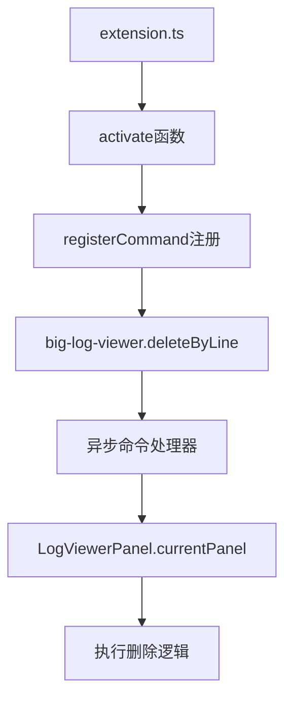
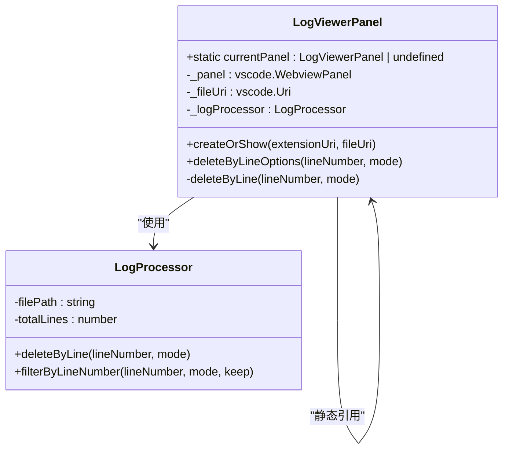
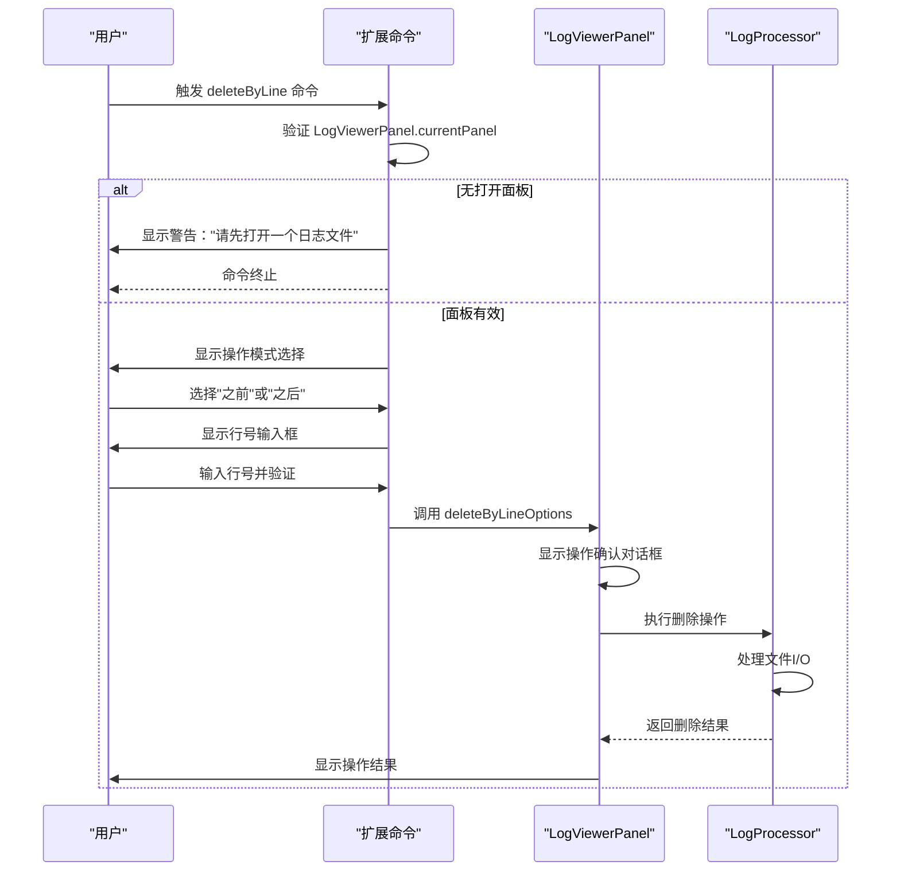
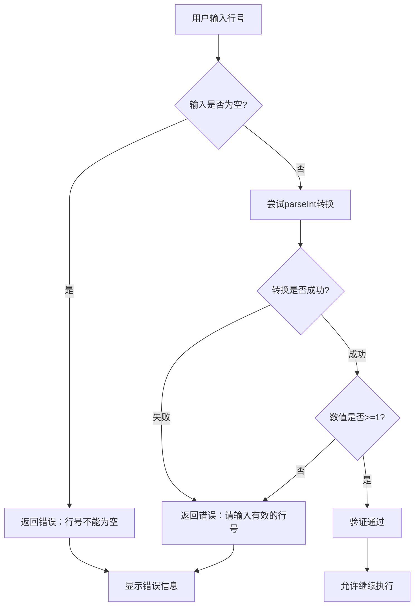
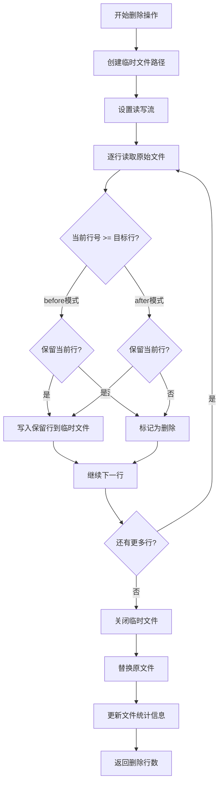
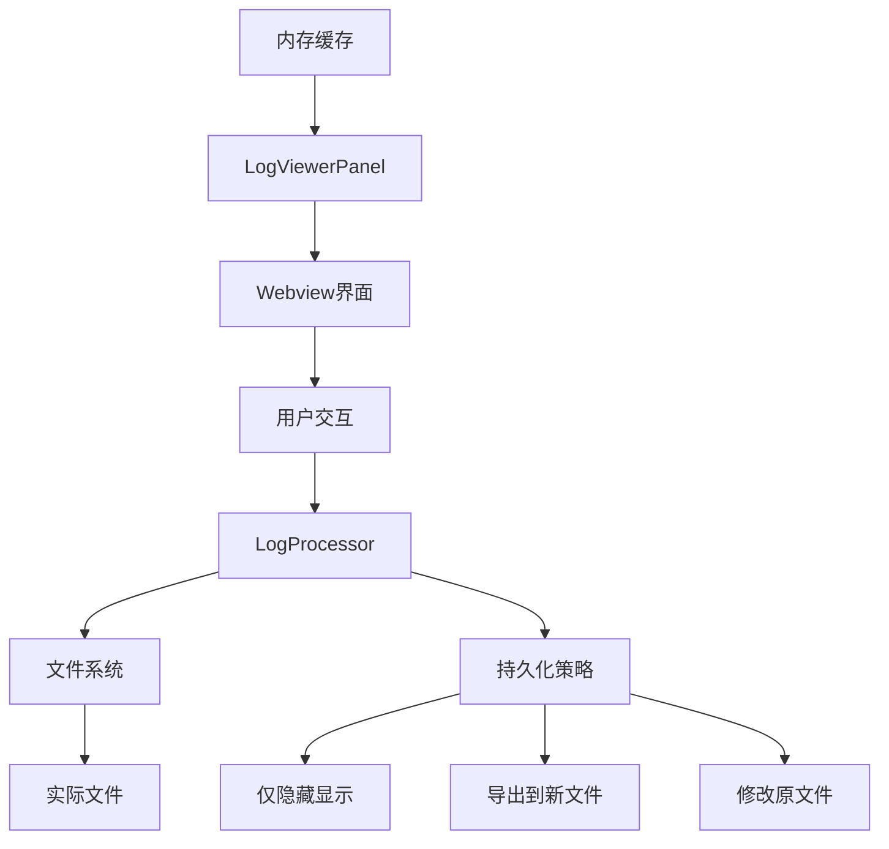
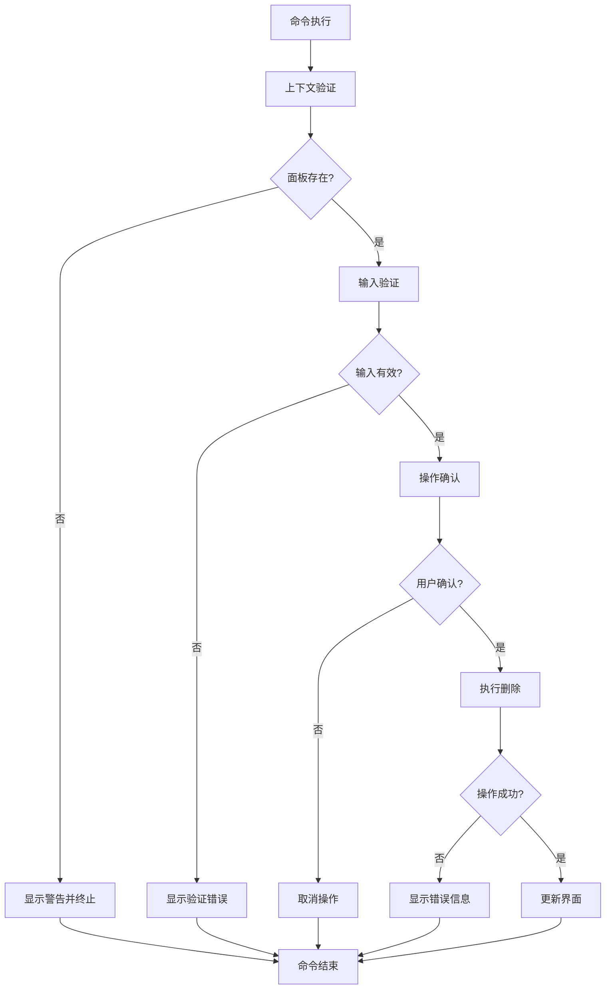

# big-log-viewer.deleteByLine 命令详细API文档

<cite>
**本文档中引用的文件**
- [extension.ts](file://src/extension.ts)
- [logViewerPanel.ts](file://src/logViewerPanel.ts)
- [logProcessor.ts](file://src/logProcessor.ts)
- [package.json](file://package.json)
- [webview.html](file://src/webview.html)
</cite>

## 目录
1. [简介](#简介)
2. [命令注册机制](#命令注册机制)
3. [执行上下文](#执行上下文)
4. [命令执行流程](#命令执行流程)
5. [输入验证机制](#输入验证机制)
6. [核心功能实现](#核心功能实现)
7. [使用场景示例](#使用场景示例)
8. [与日志文件持久化策略的关系](#与日志文件持久化策略的关系)
9. [错误处理与安全机制](#错误处理与安全机制)
10. [最佳实践建议](#最佳实践建议)

## 简介

`big-log-viewer.deleteByLine` 是 VS Code 扩展 "大日志文件查看器" 中的一个核心命令，专门用于按行号删除日志文件中的部分内容。该命令提供了灵活的日志管理功能，允许用户精确控制日志文件的大小和内容，特别适用于清理调试日志、移除过期日志或优化日志存储空间。

## 命令注册机制

### 命令定义与激活

该命令通过 VS Code 的命令系统进行注册，位于扩展的入口文件中：

**图表来源**
- [extension.ts](file://src/extension.ts#L73-L110)

### 命令贡献配置

在 `package.json` 中，该命令被明确声明为扩展的功能之一：

| 配置项 | 值 | 说明 |
|--------|-----|------|
| 命令标识 | `big-log-viewer.deleteByLine` | 唯一的命令标识符 |
| 显示标题 | "按行数删除日志" | 在VS Code命令面板中显示的名称 |
| 类别 | "日志查看器" | 命令所属的功能分类 |
| 激活事件 | 自动激活 | 无需特定触发条件即可使用 |

**章节来源**
- [package.json](file://package.json#L46-L49)
- [extension.ts](file://src/extension.ts#L73-L110)

## 执行上下文

### LogViewerPanel.currentPanel 依赖性

该命令的核心依赖是 `LogViewerPanel.currentPanel` 静态属性，这是整个日志查看器系统的关键组件：

**图表来源**
- [logViewerPanel.ts](file://src/logViewerPanel.ts#L6-L13)
- [logViewerPanel.ts](file://src/logViewerPanel.ts#L230-L278)

### 上下文验证机制

命令执行前会进行严格的上下文验证：

1. **面板存在性检查**：确认当前有打开的日志文件
2. **面板状态检查**：验证 LogViewerPanel 实例的有效性
3. **文件状态检查**：确保相关文件资源可用

**章节来源**
- [extension.ts](file://src/extension.ts#L75-L80)

## 命令执行流程

### 完整执行序列

**图表来源**
- [extension.ts](file://src/extension.ts#L73-L110)
- [logViewerPanel.ts](file://src/logViewerPanel.ts#L230-L278)

### 详细步骤分解

1. **初始化阶段**
   - 检查 `LogViewerPanel.currentPanel` 是否存在
   - 如果不存在，显示警告信息并终止执行

2. **模式选择阶段**
   - 使用 `vscode.window.showQuickPick` 提供两种操作模式：
     - "删除指定行之前的日志"
     - "删除指定行之后的日志"
   - 用户必须选择其中一个选项才能继续

3. **输入处理阶段**
   - 调用 `vscode.window.showInputBox` 获取目标行号
   - 实现严格的输入验证机制
   - 支持实时验证反馈

4. **执行阶段**
   - 将解析后的行号和操作模式传递给面板
   - 面板显示操作确认对话框
   - 最终执行删除操作并更新界面

**章节来源**
- [extension.ts](file://src/extension.ts#L73-L110)

## 输入验证机制

### validateInput 函数实现

输入验证是确保命令安全性和正确性的关键环节：

**图表来源**
- [extension.ts](file://src/extension.ts#L95-L104)

### 验证规则详解

| 验证项目 | 规则描述 | 错误提示 | 安全考虑 |
|----------|----------|----------|----------|
| 非空检查 | 检查输入是否为空字符串 | "行号不能为空" | 防止用户提交空值 |
| 数字转换 | 使用 parseInt 转换为数字 | "请输入有效的行号（大于0的整数）" | 防止非数字输入 |
| 数值范围 | 确保转换后的数值 >= 1 | 同上 | 避免无效行号（行号从1开始计数） |
| 类型安全 | 检查 isNaN 和数值有效性 | 同上 | 确保输入是有效的正整数 |

### 安全处理机制

1. **严格的数据类型转换**：使用 `parseInt` 进行显式的类型转换
2. **边界值检查**：确保行号至少为1（日志文件的第一行）
3. **实时反馈**：验证失败时立即向用户提供清晰的错误信息
4. **输入拦截**：阻止无效输入继续执行后续流程

**章节来源**
- [extension.ts](file://src/extension.ts#L95-L104)

## 核心功能实现

### 删除操作类型

该命令支持两种基本的删除操作模式：

| 操作模式 | 描述 | 影响范围 | 应用场景 |
|----------|------|----------|----------|
| "before" | 删除指定行之前的日志 | 第1行到目标行-1 | 清理早期调试日志 |
| "after" | 删除指定行之后的日志 | 目标行+1到最后 | 移除最新的错误日志 |

### LogProcessor.deleteByLine 方法

底层的删除操作由 `LogProcessor` 类的 `deleteByLine` 方法实现：

**图表来源**
- [logProcessor.ts](file://src/logProcessor.ts#L414-L474)

### 文件处理策略

1. **临时文件机制**：创建 `.tmp` 临时文件进行安全操作
2. **原子性操作**：确保文件替换的原子性，避免数据丢失
3. **错误恢复**：操作失败时自动清理临时文件
4. **统计更新**：操作完成后更新文件行数统计

**章节来源**
- [logProcessor.ts](file://src/logProcessor.ts#L414-L474)

## 使用场景示例

### 典型应用场景

#### 场景1：清理前N行调试日志

**使用场景**：开发过程中产生的大量调试信息需要定期清理

**操作步骤**：
1. 打开包含调试日志的文件
2. 执行 `big-log-viewer.deleteByLine` 命令
3. 选择 "删除指定行之前的日志"
4. 输入行号（如1000）
5. 选择操作方式（推荐"仅隐藏"）

**预期效果**：保留最近的1000行日志，移除早期的调试信息

#### 场景2：删除尾部错误日志

**使用场景**：生产环境中出现的错误日志需要及时清理

**操作步骤**：
1. 打开生产日志文件
2. 执行 `big-log-viewer.deleteByLine` 命令
3. 选择 "删除指定行之后的日志"
4. 输入行号（如文件总行数-500）
5. 选择操作方式（推荐"导出到新文件"）

**预期效果**：保留最新的500行日志，将旧的错误日志保存到新文件

#### 场景3：分段处理大型日志文件

**使用场景**：超大型日志文件需要分段处理

**操作步骤**：
1. 打开大型日志文件
2. 执行 `big-log-viewer.deleteByLine` 命令
3. 选择适当的删除模式
4. 根据文件大小合理设置行号
5. 选择"修改原文件"进行永久删除

**预期效果**：将大型文件分割成更易管理的小文件

### 实际案例分析

#### 案例1：Spring Boot应用日志清理

对于典型的Spring Boot应用，日志文件可能包含以下结构：
- 前1000行：应用启动和初始化信息
- 中间部分：业务逻辑日志
- 后续部分：异常和错误日志

**推荐操作**：
- 使用 "删除指定行之前的日志" 清理启动信息
- 使用 "删除指定行之后的日志" 保留最新错误

#### 案例2：Apache服务器访问日志

对于HTTP服务器日志，通常需要：
- 保留最近的访问记录用于监控
- 清理历史访问记录节省存储空间

**推荐操作**：
- 基于时间戳计算行号
- 使用适当的删除模式

**章节来源**
- [logViewerPanel.ts](file://src/logViewerPanel.ts#L230-L278)

## 与日志文件持久化策略的关系

### 数据持久化层次

**图表来源**
- [logViewerPanel.ts](file://src/logViewerPanel.ts#L230-L278)

### 持久化选项对比

| 操作方式 | 数据持久化 | 安全性 | 性能 | 适用场景 |
|----------|------------|--------|------|----------|
| 仅隐藏（不修改文件） | 内存中过滤显示 | 最高 | 最快 | 日志分析、临时清理 |
| 导出到新文件 | 新文件保存 | 高 | 中等 | 备份、归档、长期保存 |
| 修改原文件（危险） | 原文件直接修改 | 最低 | 最快 | 生产环境清理 |

### 数据安全考虑

1. **备份保护**：导出功能确保原始数据不会丢失
2. **确认机制**：修改原文件前需要二次确认
3. **原子操作**：使用临时文件确保操作的原子性
4. **错误恢复**：操作失败时自动回滚

**章节来源**
- [logViewerPanel.ts](file://src/logViewerPanel.ts#L230-L278)

## 错误处理与安全机制

### 多层错误处理

**图表来源**
- [extension.ts](file://src/extension.ts#L73-L110)
- [logViewerPanel.ts](file://src/logViewerPanel.ts#L230-L278)

### 安全防护措施

1. **双重确认机制**
   - 操作前显示详细的操作说明
   - 修改原文件前要求二次确认

2. **输入验证**
   - 严格的行号验证
   - 防止无效输入导致的错误

3. **权限检查**
   - 确保文件可读写权限
   - 处理文件锁定情况

4. **资源管理**
   - 及时释放文件句柄
   - 防止内存泄漏

**章节来源**
- [logViewerPanel.ts](file://src/logViewerPanel.ts#L230-L278)

## 最佳实践建议

### 使用前准备

1. **文件备份**：在执行删除操作前，建议先导出完整的日志文件
2. **行号确认**：使用 `big-log-viewer.jumpToLine` 命令精确定位目标行
3. **操作测试**：先使用"仅隐藏"模式验证操作效果

### 性能优化建议

1. **大文件处理**：对于超大文件，建议分段删除而非一次性操作
2. **内存管理**：定期重启VS Code以释放内存资源
3. **网络文件**：谨慎处理网络共享文件的删除操作

### 安全操作指南

1. **重要文件保护**：生产环境的重要日志文件应避免直接修改
2. **批量操作**：对于大量相似操作，考虑编写自动化脚本
3. **版本控制**：对关键日志文件实施版本控制策略

### 故障排除

1. **文件锁定**：如果操作失败，检查文件是否被其他程序占用
2. **权限问题**：确保有足够的文件写入权限
3. **磁盘空间**：确认有足够的磁盘空间进行文件操作

**章节来源**
- [logViewerPanel.ts](file://src/logViewerPanel.ts#L230-L278)