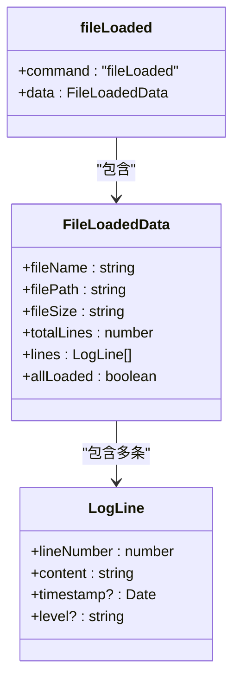
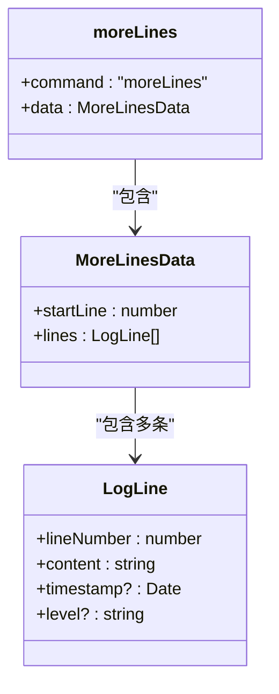
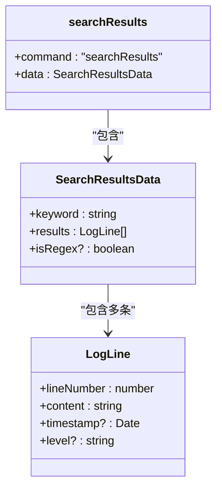
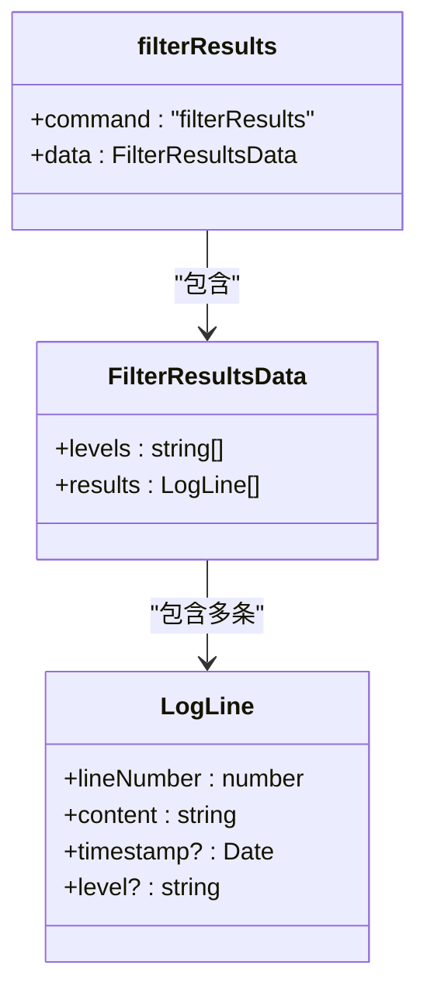
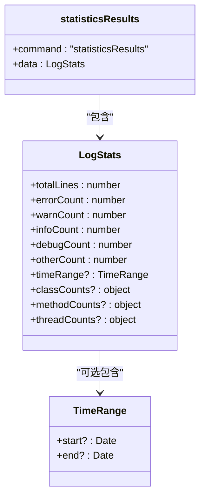
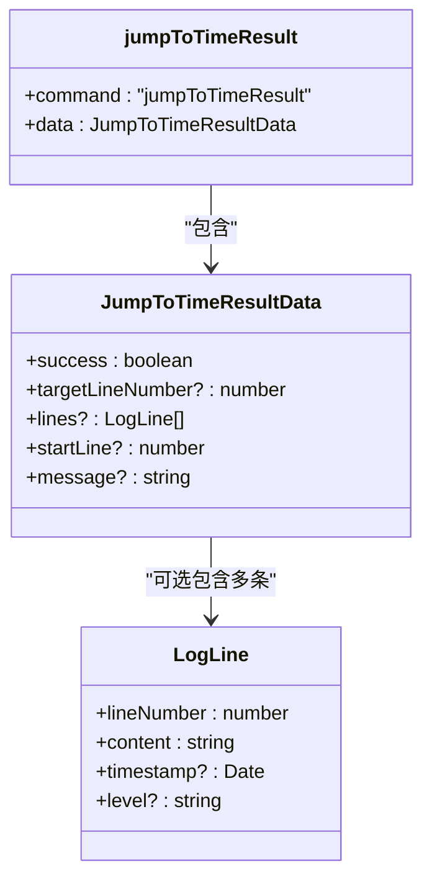
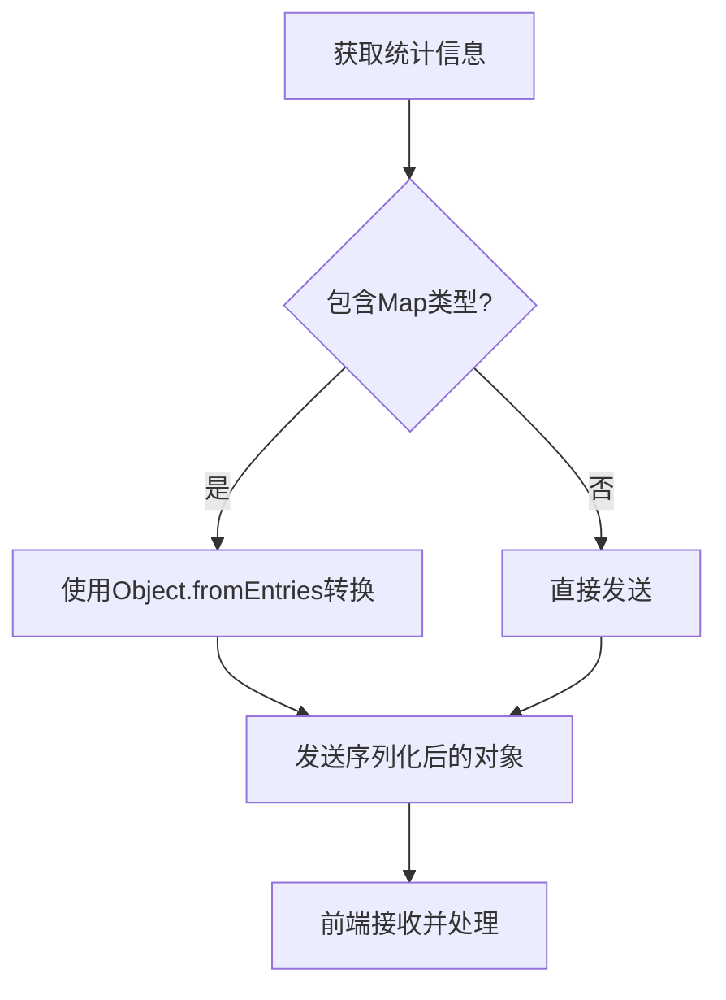
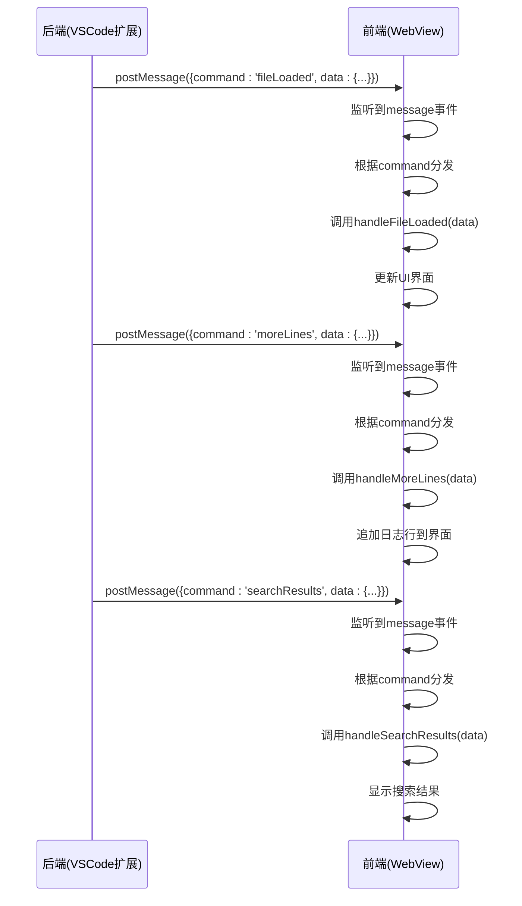
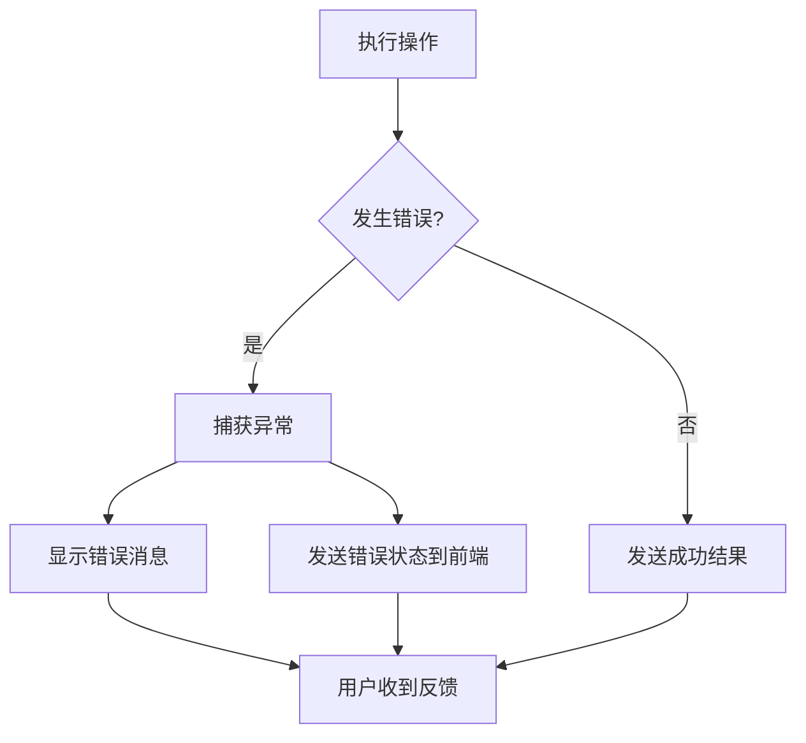
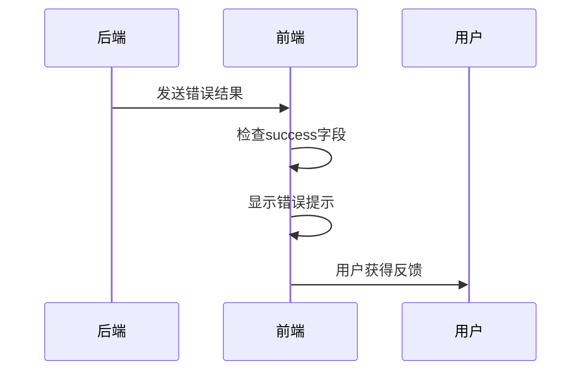

# WebView响应消息

<cite>
**本文档引用的文件**   
- [extension.ts](file://src\extension.ts)
- [logViewerPanel.ts](file://src\logViewerPanel.ts)
- [logProcessor.ts](file://src\logProcessor.ts)
- [webview.html](file://src\webview.html)
</cite>

## 目录
1. [介绍](#介绍)
2. [响应消息结构](#响应消息结构)
3. [消息序列化处理](#消息序列化处理)
4. [前端接收处理逻辑](#前端接收处理逻辑)
5. [错误状态处理](#错误状态处理)

## 介绍
本项目是一个VSCode扩展，用于查看和分析大型日志文件。扩展通过WebView界面与用户交互，后端（VSCode扩展）向前端（WebView）发送各种响应消息，以更新界面状态、返回查询结果和处理用户操作。这些消息通过`postMessage`机制发送，包含不同的命令和数据结构。

**Section sources**
- [logViewerPanel.ts](file://src\logViewerPanel.ts#L1-L509)
- [webview.html](file://src\webview.html#L1-L4178)

## 响应消息结构
后端向前端发送的响应消息遵循统一的结构：包含一个`command`字段标识消息类型，以及一个`data`字段包含具体的数据。以下是主要的响应消息类型及其结构：

### fileLoaded消息
当文件加载完成时，后端发送`fileLoaded`消息，通知前端文件已准备好。

**Diagram sources**
- [logViewerPanel.ts](file://src\logViewerPanel.ts#L132-L142)

### moreLines消息
当需要加载更多日志行时，后端发送`moreLines`消息，返回额外的日志数据。

**Diagram sources**
- [logViewerPanel.ts](file://src\logViewerPanel.ts#L153-L159)

### searchResults消息
当执行搜索操作后，后端发送`searchResults`消息，返回搜索结果。

**Diagram sources**
- [logViewerPanel.ts](file://src\logViewerPanel.ts#L168-L174)
- [logViewerPanel.ts](file://src\logViewerPanel.ts#L453-L460)

### filterResults消息
当执行过滤操作后，后端发送`filterResults`消息，返回过滤结果。

**Diagram sources**
- [logViewerPanel.ts](file://src\logViewerPanel.ts#L198-L204)
- [logViewerPanel.ts](file://src\logViewerPanel.ts#L417-L423)

### statisticsResults消息
当请求统计信息时，后端发送`statisticsResults`消息，返回详细的日志统计。

**Diagram sources**
- [logViewerPanel.ts](file://src\logViewerPanel.ts#L441-L444)
- [logProcessor.ts](file://src\logProcessor.ts#L11-L28)

### jumpToTimeResult消息
当执行时间跳转操作时，后端发送`jumpToTimeResult`消息，返回跳转结果。

**Diagram sources**
- [logViewerPanel.ts](file://src\logViewerPanel.ts#L331-L339)
- [logViewerPanel.ts](file://src\logViewerPanel.ts#L343-L349)

## 消息序列化处理
由于WebView的`postMessage`机制不支持直接传输`Map`等复杂对象，后端在发送包含`Map`类型的数据时需要进行序列化处理。

### Map类型转换
在`getStatistics`方法中，`LogStats`接口定义了`classCounts`、`methodCounts`和`threadCounts`为`Map`类型，但在发送前需要转换为普通对象。

**Diagram sources**
- [logViewerPanel.ts](file://src\logViewerPanel.ts#L433-L439)

**Section sources**
- [logViewerPanel.ts](file://src\logViewerPanel.ts#L429-L448)
- [logProcessor.ts](file://src\logProcessor.ts#L566-L645)

## 前端接收处理逻辑
前端通过监听`message`事件来接收后端发送的消息，并根据`command`字段分发到不同的处理函数。

**Diagram sources**
- [webview.html](file://src\webview.html#L1189-L1214)
- [webview.html](file://src\webview.html#L1217-L1241)

**Section sources**
- [webview.html](file://src\webview.html#L1180-L1399)

## 错误状态处理
系统在处理各种操作时都包含了完善的错误处理机制，确保用户能够获得清晰的反馈。

### 后端错误处理
后端在处理文件操作、搜索、过滤等操作时，使用try-catch捕获异常，并通过VSCode的API显示错误信息。

**Diagram sources**
- [logViewerPanel.ts](file://src\logViewerPanel.ts#L145-L147)
- [logViewerPanel.ts](file://src\logViewerPanel.ts#L160-L163)

### 前端错误处理
前端在接收到错误状态时，会显示相应的提示信息，帮助用户理解问题所在。

**Diagram sources**
- [logViewerPanel.ts](file://src\logViewerPanel.ts#L343-L349)
- [webview.html](file://src\webview.html#L1277-L1282)

**Section sources**
- [logViewerPanel.ts](file://src\logViewerPanel.ts#L320-L360)
- [webview.html](file://src\webview.html#L1265-L1283)