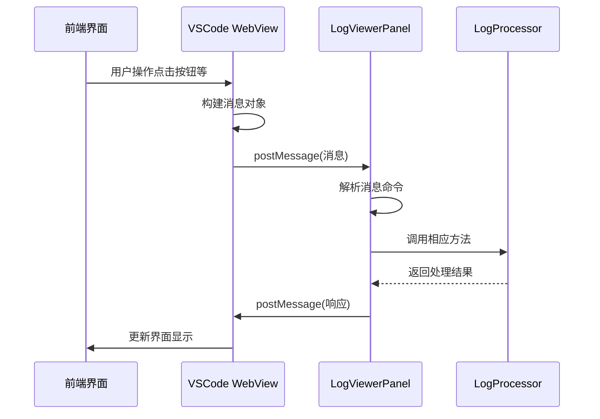
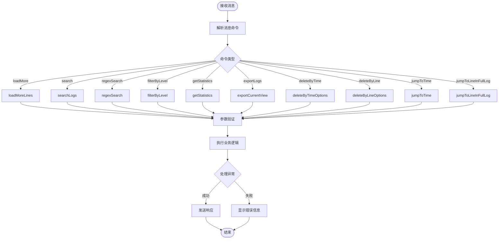

# WebView请求消息详细文档

<cite>
**本文档引用的文件**
- [src/extension.ts](file://src/extension.ts)
- [src/logViewerPanel.ts](file://src/logViewerPanel.ts)
- [src/logProcessor.ts](file://src/logProcessor.ts)
- [src/webview.html](file://src/webview.html)
- [package.json](file://package.json)
</cite>

## 目录
1. [概述](#概述)
2. [消息架构](#消息架构)
3. [核心请求消息](#核心请求消息)
4. [消息处理流程](#消息处理流程)
5. [错误处理机制](#错误处理机制)
6. [性能优化策略](#性能优化策略)
7. [最佳实践](#最佳实践)

## 概述

大日志文件查看器扩展通过WebView与VSCode主进程之间的双向通信机制，实现了高效的日志处理功能。前端WebView通过`postMessage`向后端发送各种请求消息，后端LogViewerPanel接收并处理这些消息，调用LogProcessor服务执行具体操作，然后将结果通过`postMessage`返回给前端。

## 消息架构

### 前端到后端消息结构

所有从前端发送到后端的消息都遵循统一的结构：

```typescript
{
    command: string,        // 消息类型标识符
    [key: string]: any      // 动态参数对象
}
```

### 后端到前端消息结构

后端返回给前端的消息同样遵循统一结构：

```typescript
{
    command: string,        // 响应命令类型
    data: any              // 响应数据
}
```

## 核心请求消息

### 1. loadMore - 虚拟滚动加载更多行

**触发场景**: 用户滚动到日志容器底部，需要加载更多日志行

**消息结构**:
```typescript
{
    command: 'loadMore',
    startLine: number,      // 起始行号
    count: number          // 要加载的行数
}
```

**参数验证**:
- `startLine`: 必须 ≥ 0，表示从哪一行开始加载
- `count`: 必须 > 0，表示要加载多少行

**处理逻辑**:
- 调用LogProcessor的`readLines(startLine, count)`方法
- 返回格式化的日志行数据
- 支持大数据文件的分段加载

**错误处理**:
- 文件读取失败时显示错误信息
- 越界访问时自动截断

**节源**
- [src/logViewerPanel.ts](file://src/logViewerPanel.ts#L150-L162)

### 2. search - 关键词搜索

**触发场景**: 用户在搜索框输入关键词并点击搜索按钮

**消息结构**:
```typescript
{
    command: 'search',
    keyword: string,        // 搜索关键词
    reverse: boolean       // 是否反向搜索
}
```

**参数验证**:
- `keyword`: 必须非空字符串
- `reverse`: 可选布尔值，默认false

**处理逻辑**:
- 调用LogProcessor的`search(keyword, reverse)`方法
- 支持大小写不敏感搜索
- 反向搜索返回匹配结果的逆序列表

**错误处理**:
- 空关键词时显示警告
- 搜索过程中断时优雅降级

**节源**
- [src/logViewerPanel.ts](file://src/logViewerPanel.ts#L165-L177)

### 3. regexSearch - 正则表达式搜索

**触发场景**: 用户启用正则模式并输入正则表达式

**消息结构**:
```typescript
{
    command: 'regexSearch',
    pattern: string,        // 正则表达式模式
    flags: string,         // 正则标志（如'i', 'g'等）
    reverse: boolean       // 是否反向搜索
}
```

**参数验证**:
- `pattern`: 必须是有效的正则表达式
- `flags`: 可选，支持标准正则标志
- `reverse`: 可选布尔值

**处理逻辑**:
- 验证正则表达式有效性
- 调用LogProcessor的`regexSearch(pattern, flags, reverse)`
- 支持复杂模式匹配

**错误处理**:
- 无效正则表达式时抛出异常
- 搜索超时时机中断

**节源**
- [src/logViewerPanel.ts](file://src/logViewerPanel.ts#L450-L463)

### 4. refresh - 刷新当前文件

**触发场景**: 用户点击刷新按钮或清除所有过滤条件

**消息结构**:
```typescript
{
    command: 'refresh'
}
```

**处理逻辑**:
- 重新加载原始日志文件
- 清除所有搜索和过滤状态
- 重置分页和导航状态

**错误处理**:
- 文件不存在时显示错误
- 文件权限问题时提示用户

**节源**
- [src/logViewerPanel.ts](file://src/logViewerPanel.ts#L165-L177)

### 5. filterByLevel - 按日志级别过滤

**触发场景**: 用户勾选或取消勾选日志级别复选框

**消息结构**:
```typescript
{
    command: 'filterByLevel',
    levels: string[]        // 包含的级别数组：['ERROR', 'WARN', 'INFO', 'DEBUG']
}
```

**参数验证**:
- `levels`: 必须是非空数组
- 支持多个级别的组合过滤

**处理逻辑**:
- 调用LogProcessor的`filterByLevel(levels)`方法
- 支持级别优先级排序
- 实时过滤显示匹配的日志行

**错误处理**:
- 空级别数组时显示警告
- 过滤结果为空时提供友好的提示

**节源**
- [src/logViewerPanel.ts](file://src/logViewerPanel.ts#L409-L426)

### 6. getStatistics - 获取日志统计信息

**触发场景**: 用户点击统计按钮查看日志统计

**消息结构**:
```typescript
{
    command: 'getStatistics'
}
```

**处理逻辑**:
- 调用LogProcessor的`getStatistics()`方法
- 计算各类统计指标
- 返回序列化后的统计数据

**返回数据结构**:
```typescript
{
    totalLines: number,
    errorCount: number,
    warnCount: number,
    infoCount: number,
    debugCount: number,
    otherCount: number,
    timeRange: {
        start?: Date,
        end?: Date
    },
    classCounts: Map<string, number>,
    methodCounts: Map<string, number>,
    threadCounts: Map<string, number>
}
```

**节源**
- [src/logViewerPanel.ts](file://src/logViewerPanel.ts#L429-L447)

### 7. exportLogs - 导出当前视图日志

**触发场景**: 用户点击导出按钮

**消息结构**:
```typescript
{
    command: 'exportLogs',
    lines: LogLine[]        // 要导出的日志行数组
}
```

**处理逻辑**:
- 显示保存对话框让用户选择导出路径
- 调用LogProcessor的`exportLogs(lines, outputPath)`方法
- 支持多种文件格式

**错误处理**:
- 文件写入失败时显示错误
- 路径无效时提示用户重新选择

**节源**
- [src/logViewerPanel.ts](file://src/logViewerPanel.ts#L466-L482)

### 8. deleteByTime - 按时间删除日志

**触发场景**: 用户选择按时间删除日志

**消息结构**:
```typescript
{
    command: 'deleteByTime',
    timeStr: string,        // 时间字符串
    mode: string           // 删除模式：'before' 或 'after'
}
```

**参数验证**:
- `timeStr`: 必须是有效的时间格式
- `mode`: 必须是'before'或'after'

**处理逻辑**:
- 显示操作确认对话框
- 调用LogProcessor的`deleteByTime(timeStr, mode)`方法
- 支持三种操作模式：隐藏、导出、修改原文件

**错误处理**:
- 时间格式无效时提示用户
- 文件修改失败时回滚操作

**节源**
- [src/logViewerPanel.ts](file://src/logViewerPanel.ts#L180-L227)

### 9. deleteByLine - 按行数删除日志

**触发场景**: 用户选择按行数删除日志

**消息结构**:
```typescript
{
    command: 'deleteByLine',
    lineNumber: number,     // 行号
    mode: string           // 删除模式：'before' 或 'after'
}
```

**参数验证**:
- `lineNumber`: 必须 > 0
- `mode`: 必须是'before'或'after'

**处理逻辑**:
- 显示操作确认对话框
- 调用LogProcessor的`deleteByLine(lineNumber, mode)`方法
- 支持三种操作模式

**错误处理**:
- 行号超出范围时提示用户
- 文件修改失败时回滚操作

**节源**
- [src/logViewerPanel.ts](file://src/logViewerPanel.ts#L230-L277)

### 10. jumpToTime - 跳转到指定时间点

**触发场景**: 用户在时间线面板点击或使用定位功能

**消息结构**:
```typescript
{
    command: 'jumpToTime',
    timeStr: string        // 时间字符串
}
```

**处理逻辑**:
- 调用LogProcessor的`findLineByTime(timeStr)`方法
- 找到最接近的时间点
- 加载该行及其周围的日志（默认1000行）

**返回结果**:
```typescript
{
    success: boolean,
    targetLineNumber?: number,
    lines?: LogLine[],
    startLine?: number,
    message?: string
}
```

**节源**
- [src/logViewerPanel.ts](file://src/logViewerPanel.ts#L320-L359)

### 11. jumpToLineInFullLog - 跳转到完整日志的指定行

**触发场景**: 用户从搜索结果或其他地方跳转到特定行

**消息结构**:
```typescript
{
    command: 'jumpToLineInFullLog',
    lineNumber: number     // 目标行号
}
```

**处理逻辑**:
- 重新加载完整日志文件
- 跳转到指定行并显示周围内容
- 支持大文件的智能加载策略

**节源**
- [src/logViewerPanel.ts](file://src/logViewerPanel.ts#L363-L406)

## 消息处理流程

### 前端消息发送流程



**图表源**
- [src/logViewerPanel.ts](file://src/logViewerPanel.ts#L54-L98)
- [src/webview.html](file://src/webview.html#L1189-L1214)

### 后端消息处理流程



**图表源**
- [src/logViewerPanel.ts](file://src/logViewerPanel.ts#L56-L98)

## 错误处理机制

### 1. 参数验证错误

**前端验证**:
- 关键字搜索前验证关键词非空
- 行号输入时验证数字格式和范围
- 时间格式验证支持多种格式

**后端验证**:
- 接收消息时验证必需参数存在
- 调用业务方法前验证参数有效性
- 文件操作前检查文件权限

### 2. 异常处理策略

**同步异常**:
```typescript
try {
    // 业务逻辑处理
} catch (error) {
    vscode.window.showErrorMessage(`操作失败: ${error}`);
    // 发送错误响应给前端
}
```

**异步异常**:
- Promise链式调用中的错误捕获
- 流式读取过程中的异常处理
- 文件I/O操作的错误恢复

### 3. 用户反馈机制

**错误提示**:
- VSCode通知窗口显示错误信息
- 前端界面显示具体的错误原因
- 提供友好的解决建议

**节源**
- [src/logViewerPanel.ts](file://src/logViewerPanel.ts#L161-L177)
- [src/logViewerPanel.ts](file://src/logViewerPanel.ts#L425-L426)

## 性能优化策略

### 1. 虚拟滚动优化

**大数据文件处理**:
- 小于5万行：一次性加载所有数据
- 大于5万行：首次加载前10000行，后续按需加载
- 支持100万+行的大文件处理

**内存管理**:
- 及时清理不需要的数据
- 使用WeakMap减少内存泄漏风险
- 分页加载避免内存溢出

### 2. 搜索性能优化

**索引策略**:
- 时间戳预处理加速时间范围查询
- 日志级别缓存减少重复解析
- 正则表达式编译缓存

**并发处理**:
- 异步文件读取避免阻塞主线程
- Web Worker处理复杂的日志解析
- 分批处理大量数据

### 3. 网络和I/O优化

**文件读取优化**:
- 使用readline逐行读取避免内存占用
- 流式处理支持超大文件
- 缓存机制减少重复读取

**节源**
- [src/logViewerPanel.ts](file://src/logViewerPanel.ts#L107-L147)
- [src/logProcessor.ts](file://src/logProcessor.ts#L60-L84)

## 最佳实践

### 1. 消息设计原则

**单一职责**:
- 每个消息命令只负责一个明确的功能
- 避免复合操作的消息设计
- 保持消息结构的简洁性

**一致性**:
- 统一的消息格式和命名规范
- 一致的错误处理机制
- 标准化的响应结构

**扩展性**:
- 预留参数扩展空间
- 支持未来功能的平滑升级
- 向后兼容的设计考虑

### 2. 错误处理最佳实践

**预防性编程**:
- 输入参数的全面验证
- 边界条件的充分考虑
- 异常情况的提前规划

**用户体验**:
- 友好的错误提示信息
- 渐进式披露错误详情
- 提供解决方案建议

### 3. 性能监控

**关键指标**:
- 消息处理延迟
- 内存使用情况
- 文件读取速度
- 搜索响应时间

**监控方法**:
- 控制台日志记录
- 性能计时器使用
- 内存快照分析
- 用户体验反馈

**节源**
- [src/logViewerPanel.ts](file://src/logViewerPanel.ts#L411-L416)
- [src/logViewerPanel.ts](file://src/logViewerPanel.ts#L430-L447)

## 结论

大日志文件查看器的WebView请求消息系统通过精心设计的通信协议，实现了高效、稳定的日志处理功能。该系统具备以下特点：

1. **模块化设计**: 每个消息命令都有明确的职责和处理逻辑
2. **健壮性**: 完善的错误处理和用户反馈机制
3. **性能优化**: 针对大数据文件的专门优化策略
4. **用户体验**: 直观的操作界面和及时的反馈信息

这套消息系统为VSCode扩展开发提供了优秀的参考范例，展示了如何在受限的WebView环境中实现复杂的功能需求。