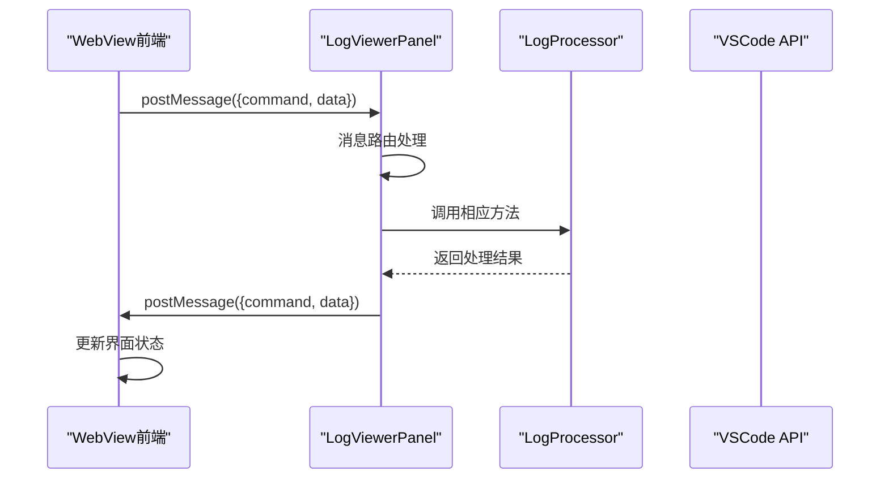

# WebView通信消息API文档

<cite>
**本文档引用的文件**
- [src/extension.ts](file://src/extension.ts)
- [src/logViewerPanel.ts](file://src/logViewerPanel.ts)
- [src/logProcessor.ts](file://src/logProcessor.ts)
- [src/webview.html](file://src/webview.html)
- [package.json](file://package.json)
</cite>

## 目录
1. [简介](#简介)
2. [消息通信架构](#消息通信架构)
3. [前端到后端的消息](#前端到后端的消息)
4. [后端到前端的消息](#后端到前端的消息)
5. [安全考虑](#安全考虑)
6. [错误处理机制](#错误处理机制)
7. [消息格式规范](#消息格式规范)
8. [最佳实践](#最佳实践)

## 简介

本文档详细描述了VSCode扩展中WebView与后端TypeScript代码之间的消息通信机制。该系统实现了双向通信，允许前端界面与后端日志处理器进行高效的数据交换和功能调用。

## 消息通信架构



**图表来源**
- [src/logViewerPanel.ts](file://src/logViewerPanel.ts#L54-L98)
- [src/webview.html](file://src/webview.html#L1189-L1214)

**章节来源**
- [src/logViewerPanel.ts](file://src/logViewerPanel.ts#L54-L98)
- [src/webview.html](file://src/webview.html#L1189-L1214)

## 前端到后端的消息

### 文件操作相关消息

#### loadMore（加载更多行）
- **用途**: 请求加载指定起始位置和数量的日志行
- **参数格式**: `{ command: 'loadMore', startLine: number, count: number }`
- **触发场景**: 虚拟滚动时需要加载更多数据
- **实现位置**: [src/webview.html](file://src/webview.html#L1903-L1937)

#### search（关键词搜索）
- **用途**: 在日志中搜索包含特定关键词的内容
- **参数格式**: `{ command: 'search', keyword: string, reverse: boolean }`
- **功能特性**: 支持反向搜索
- **实现位置**: [src/webview.html](file://src/webview.html#L1903-L1937)

#### regexSearch（正则搜索）
- **用途**: 使用正则表达式进行高级搜索
- **参数格式**: `{ command: 'regexSearch', pattern: string, flags: string, reverse: boolean }`
- **默认标志**: `'gi'`（全局、忽略大小写）
- **实现位置**: [src/webview.html](file://src/webview.html#L1903-L1937)

#### refresh（刷新文件）
- **用途**: 重新加载当前打开的日志文件
- **参数格式**: `{ command: 'refresh' }`
- **实现位置**: [src/webview.html](file://src/webview.html#L1903-L1937)

### 过滤和统计相关消息

#### filterByLevel（按级别过滤）
- **用途**: 根据日志级别（ERROR/WARN/INFO/DEBUG）过滤日志
- **参数格式**: `{ command: 'filterByLevel', levels: string[] }`
- **支持级别**: ERROR, WARN, INFO, DEBUG
- **实现位置**: [src/webview.html](file://src/webview.html#L1939-L2008)

#### getStatistics（获取统计）
- **用途**: 获取日志文件的统计信息
- **参数格式**: `{ command: 'getStatistics' }`
- **返回数据**: 包含各类别计数、时间范围、类名统计等
- **实现位置**: [src/webview.html](file://src/webview.html#L2011-L2015)

### 导出和删除相关消息

#### exportLogs（导出日志）
- **用途**: 导出当前视图中的日志行到文件
- **参数格式**: `{ command: 'exportLogs', lines: LogLine[] }`
- **实现位置**: [src/webview.html](file://src/webview.html#L1903-L1937)

#### deleteByTime（按时间删除）
- **用途**: 删除指定时间之前或之后的日志
- **参数格式**: `{ command: 'deleteByTime', timeStr: string, mode: string }`
- **模式选项**: 'before'（之前）、'after'（之后）
- **实现位置**: [src/webview.html](file://src/webview.html#L1903-L1937)

#### deleteByLine（按行数删除）
- **用途**: 删除指定行之前或之后的日志
- **参数格式**: `{ command: 'deleteByLine', lineNumber: number, mode: string }`
- **模式选项**: 'before'（之前）、'after'（之后）
- **实现位置**: [src/webview.html](file://src/webview.html#L1903-L1937)

### 跳转相关消息

#### jumpToTime（跳转到指定时间）
- **用途**: 定位到指定时间的日志行
- **参数格式**: `{ command: 'jumpToTime', timeStr: string }`
- **实现位置**: [src/webview.html](file://src/webview.html#L1903-L1937)

#### jumpToLineInFullLog（跳转到指定行）
- **用途**: 跳转到完整日志中的指定行
- **参数格式**: `{ command: 'jumpToLineInFullLog', lineNumber: number }`
- **实现位置**: [src/webview.html](file://src/webview.html#L1903-L1937)

### 辅助消息

#### showMessage（显示消息）
- **用途**: 向用户显示警告或信息消息
- **参数格式**: `{ command: 'showMessage', type: string, message: string }`
- **类型选项**: 'warning'、'info'
- **实现位置**: [src/webview.html](file://src/webview.html#L1903-L1937)

**章节来源**
- [src/webview.html](file://src/webview.html#L1903-L1937)
- [src/webview.html](file://src/webview.html#L2011-L2015)

## 后端到前端的消息

### 文件加载相关消息

#### fileLoaded（文件加载完成）
- **用途**: 通知前端文件加载完成，提供初始数据
- **数据格式**: 
```typescript
{
  command: 'fileLoaded',
  data: {
    fileName: string,
    filePath: string,
    fileSize: string,
    totalLines: number,
    lines: LogLine[],
    allLoaded: boolean
  }
}
```
- **触发时机**: 文件首次加载或刷新时
- **实现位置**: [src/logViewerPanel.ts](file://src/logViewerPanel.ts#L132-L142)

#### moreLines（更多行数据）
- **用途**: 提供额外加载的日志行数据
- **数据格式**:
```typescript
{
  command: 'moreLines',
  data: {
    startLine: number,
    lines: LogLine[]
  }
}
```
- **用途**: 支持虚拟滚动的分页加载
- **实现位置**: [src/logViewerPanel.ts](file://src/logViewerPanel.ts#L152-L159)

### 搜索和过滤相关消息

#### searchResults（搜索结果）
- **用途**: 返回搜索操作的结果
- **数据格式**:
```typescript
{
  command: 'searchResults',
  data: {
    keyword: string,
    results: LogLine[],
    isRegex?: boolean
  }
}
```
- **适用场景**: 关键词搜索和正则搜索
- **实现位置**: [src/logViewerPanel.ts](file://src/logViewerPanel.ts#L168-L174)

#### filterResults（过滤结果）
- **用途**: 返回过滤操作的结果
- **数据格式**:
```typescript
{
  command: 'filterResults',
  data: {
    levels: string[],
    results: LogLine[]
  }
}
```
- **用途**: 日志级别过滤后的结果展示
- **实现位置**: [src/logViewerPanel.ts](file://src/logViewerPanel.ts#L417-L423)

### 统计相关消息

#### statisticsResults（统计结果）
- **用途**: 返回日志文件的统计信息
- **数据格式**:
```typescript
{
  command: 'statisticsResults',
  data: LogStats
}
```
- **统计内容**: 各级别计数、时间范围、类名统计、方法名统计、线程统计
- **实现位置**: [src/logViewerPanel.ts](file://src/logViewerPanel.ts#L441-L444)

### 跳转相关消息

#### jumpToTimeResult（跳转时间结果）
- **用途**: 返回时间跳转操作的结果
- **数据格式**:
```typescript
{
  command: 'jumpToTimeResult',
  data: {
    success: boolean,
    targetLineNumber?: number,
    lines?: LogLine[],
    startLine?: number,
    message?: string
  }
}
```
- **成功情况**: 包含目标行号和周围日志
- **失败情况**: 包含错误消息
- **实现位置**: [src/logViewerPanel.ts](file://src/logViewerPanel.ts#L331-L339)

#### jumpToLineInFullLogResult（跳转行结果）
- **用途**: 返回完整日志跳转的结果
- **数据格式**: 与`fileLoaded`相同
- **实现位置**: [src/logViewerPanel.ts](file://src/logViewerPanel.ts#L390-L401)

**章节来源**
- [src/logViewerPanel.ts](file://src/logViewerPanel.ts#L132-L142)
- [src/logViewerPanel.ts](file://src/logViewerPanel.ts#L152-L159)
- [src/logViewerPanel.ts](file://src/logViewerPanel.ts#L168-L174)
- [src/logViewerPanel.ts](file://src/logViewerPanel.ts#L417-L423)
- [src/logViewerPanel.ts](file://src/logViewerPanel.ts#L441-L444)
- [src/logViewerPanel.ts](file://src/logViewerPanel.ts#L331-L339)
- [src/logViewerPanel.ts](file://src/logViewerPanel.ts#L390-L401)

## 安全考虑

### 输入验证

1. **时间格式验证**
   - 后端对时间字符串进行严格解析
   - 支持多种时间格式：`YYYY-MM-DD HH:mm:ss`、`YYYY/MM/DD HH:mm:ss`等
   - 实现位置：[src/logProcessor.ts](file://src/logProcessor.ts#L776-L807)

2. **行号验证**
   - 前端对行号输入进行范围检查
   - 后端验证行号有效性
   - 实现位置：[src/extension.ts](file://src/extension.ts#L95-L102)

3. **正则表达式验证**
   - 前端对正则表达式语法进行基本验证
   - 后端捕获并处理编译错误
   - 实现位置：[src/logProcessor.ts](file://src/logProcessor.ts#L709-L714)

### 权限控制

1. **文件访问限制**
   - WebView只能访问扩展提供的资源
   - 通过`localResourceRoots`配置限制访问范围
   - 实现位置：[src/logViewerPanel.ts](file://src/logViewerPanel.ts#L35-L36)

2. **危险操作确认**
   - 删除操作需要用户二次确认
   - 实现位置：[src/logViewerPanel.ts](file://src/logViewerPanel.ts#L280-L289)

### 数据传输安全

1. **消息格式标准化**
   - 所有消息都包含`command`字段
   - 参数严格遵循预定义格式
   - 实现位置：[src/logViewerPanel.ts](file://src/logViewerPanel.ts#L56-L98)

2. **错误信息处理**
   - 敏感信息不会直接暴露给前端
   - 错误信息经过处理后传递
   - 实现位置：[src/logViewerPanel.ts](file://src/logViewerPanel.ts#L145-L147)

**章节来源**
- [src/logProcessor.ts](file://src/logProcessor.ts#L776-L807)
- [src/extension.ts](file://src/extension.ts#L95-L102)
- [src/logProcessor.ts](file://src/logProcessor.ts#L709-L714)
- [src/logViewerPanel.ts](file://src/logViewerPanel.ts#L35-L36)
- [src/logViewerPanel.ts](file://src/logViewerPanel.ts#L280-L289)

## 错误处理机制

### 前端错误处理

1. **消息发送失败**
   - 检查VSCode API可用性
   - 提供友好的错误提示
   - 实现位置：[src/webview.html](file://src/webview.html#L1903-L1937)

2. **数据解析错误**
   - 对接收到的数据进行格式验证
   - 提供默认值或错误状态
   - 实现位置：[src/webview.html](file://src/webview.html#L1190-L1214)

### 后端错误处理

1. **文件操作错误**
   - 文件读取失败时显示错误消息
   - 实现位置：[src/logViewerPanel.ts](file://src/logViewerPanel.ts#L145-L147)

2. **搜索和过滤错误**
   - 捕获并处理异常
   - 显示用户友好的错误信息
   - 实现位置：[src/logViewerPanel.ts](file://src/logViewerPanel.ts#L175-L177)

3. **正则表达式错误**
   - 捕获正则编译错误
   - 提供错误提示
   - 实现位置：[src/logViewerPanel.ts](file://src/logViewerPanel.ts#L462-L463)

### 错误恢复机制

1. **自动重试**
   - 对于临时性错误提供重试机制
   - 实现位置：[src/logViewerPanel.ts](file://src/logViewerPanel.ts#L160-L162)

2. **降级处理**
   - 当高级功能不可用时提供基础功能
   - 实现位置：[src/logViewerPanel.ts](file://src/logViewerPanel.ts#L120-L128)

**章节来源**
- [src/webview.html](file://src/webview.html#L1903-L1937)
- [src/webview.html](file://src/webview.html#L1190-L1214)
- [src/logViewerPanel.ts](file://src/logViewerPanel.ts#L145-L147)
- [src/logViewerPanel.ts](file://src/logViewerPanel.ts#L175-L177)
- [src/logViewerPanel.ts](file://src/logViewerPanel.ts#L462-L463)
- [src/logViewerPanel.ts](file://src/logViewerPanel.ts#L160-L162)
- [src/logViewerPanel.ts](file://src/logViewerPanel.ts#L120-L128)

## 消息格式规范

### 基本消息结构

所有消息都遵循以下基本格式：

```typescript
interface Message {
  command: string;
  data?: any;
}
```

### 响应消息结构

```typescript
interface ResponseMessage {
  command: string;
  data: any;
  error?: string;
}
```

### 数据类型定义

#### LogLine 接口
```typescript
interface LogLine {
  lineNumber: number;
  content: string;
  timestamp?: Date;
  level?: string;
}
```

#### LogStats 接口
```typescript
interface LogStats {
  totalLines: number;
  errorCount: number;
  warnCount: number;
  infoCount: number;
  debugCount: number;
  otherCount: number;
  timeRange?: {
    start?: Date;
    end?: Date;
  };
  classCounts?: Map<string, number>;
  methodCounts?: Map<string, number>;
  threadCounts?: Map<string, number>;
}
```

### 消息路由表

| 前端命令 | 后端处理 | 返回消息 | 描述 |
|---------|---------|---------|------|
| `loadMore` | `loadMoreLines` | `moreLines` | 加载更多日志行 |
| `search` | `searchLogs` | `searchResults` | 关键词搜索 |
| `regexSearch` | `regexSearch` | `searchResults` | 正则搜索 |
| `refresh` | `loadFile` | `fileLoaded` | 刷新文件 |
| `filterByLevel` | `filterByLevel` | `filterResults` | 按级别过滤 |
| `getStatistics` | `getStatistics` | `statisticsResults` | 获取统计 |
| `exportLogs` | `exportCurrentView` | - | 导出日志 |
| `deleteByTime` | `deleteByTimeOptions` | `filterResults` | 按时间删除 |
| `deleteByLine` | `deleteByLineOptions` | `filterResults` | 按行删除 |
| `jumpToTime` | `jumpToTime` | `jumpToTimeResult` | 跳转到时间 |
| `jumpToLineInFullLog` | `jumpToLineInFullLog` | `jumpToLineInFullLogResult` | 跳转到行 |

**章节来源**
- [src/logViewerPanel.ts](file://src/logViewerPanel.ts#L56-L98)
- [src/webview.html](file://src/webview.html#L1190-L1214)
- [src/logProcessor.ts](file://src/logProcessor.ts#L4-L28)

## 最佳实践

### 性能优化

1. **分页加载**
   - 大文件采用分页加载策略
   - 默认加载前10000行
   - 实现位置：[src/logViewerPanel.ts](file://src/logViewerPanel.ts#L120-L128)

2. **虚拟滚动**
   - 只渲染可见区域的日志行
   - 动态加载更多内容
   - 实现位置：[src/webview.html](file://src/webview.html#L1313-L1422)

3. **智能缓存**
   - 缓存搜索和过滤结果
   - 避免重复计算
   - 实现位置：[src/webview.html](file://src/webview.html#L1166-L1178)

### 用户体验

1. **加载状态指示**
   - 显示加载动画和进度
   - 提供用户反馈
   - 实现位置：[src/webview.html](file://src/webview.html#L1238-L1240)

2. **错误提示**
   - 友好的错误信息
   - 操作指导
   - 实现位置：[src/logViewerPanel.ts](file://src/logViewerPanel.ts#L145-L147)

3. **撤销机制**
   - 对于危险操作提供撤销选项
   - 实现位置：[src/logViewerPanel.ts](file://src/logViewerPanel.ts#L280-L289)

### 代码维护

1. **消息格式验证**
   - 使用TypeScript接口定义消息格式
   - 提供编译时类型检查
   - 实现位置：[src/logProcessor.ts](file://src/logProcessor.ts#L4-L28)

2. **错误边界处理**
   - 所有异步操作都包含错误处理
   - 实现位置：[src/logViewerPanel.ts](file://src/logViewerPanel.ts#L145-L147)

3. **日志记录**
   - 关键操作添加日志记录
   - 便于调试和问题追踪
   - 实现位置：[src/logViewerPanel.ts](file://src/logViewerPanel.ts#L411-L416)

**章节来源**
- [src/logViewerPanel.ts](file://src/logViewerPanel.ts#L120-L128)
- [src/webview.html](file://src/webview.html#L1313-L1422)
- [src/webview.html](file://src/webview.html#L1166-L1178)
- [src/logViewerPanel.ts](file://src/logViewerPanel.ts#L145-L147)
- [src/logViewerPanel.ts](file://src/logViewerPanel.ts#L411-L416)