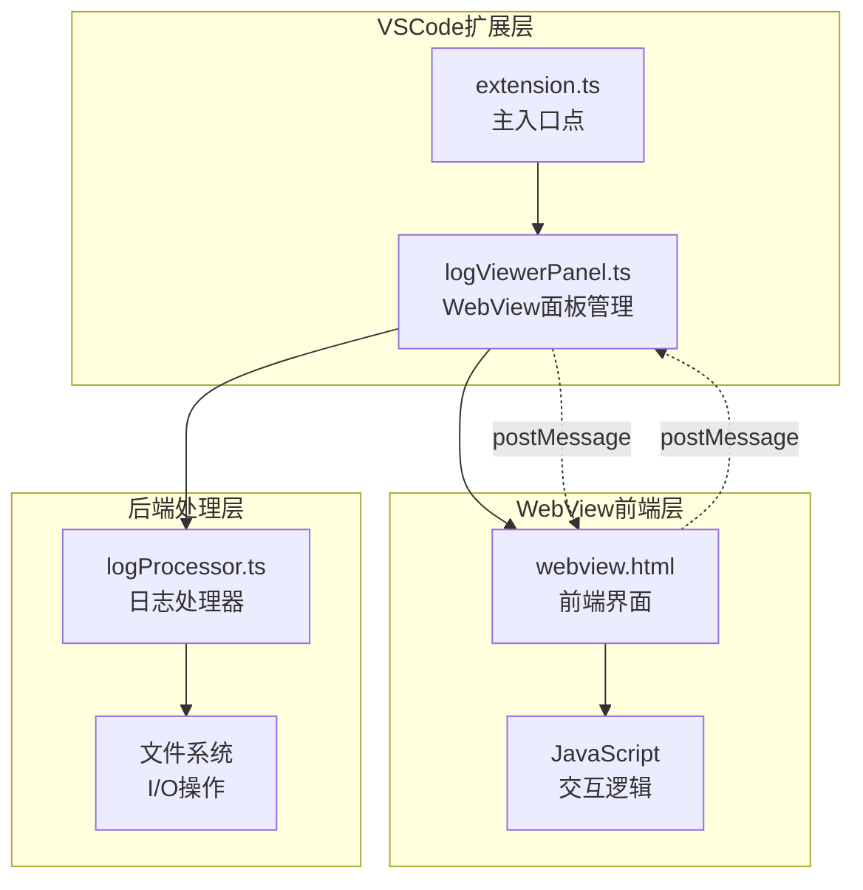
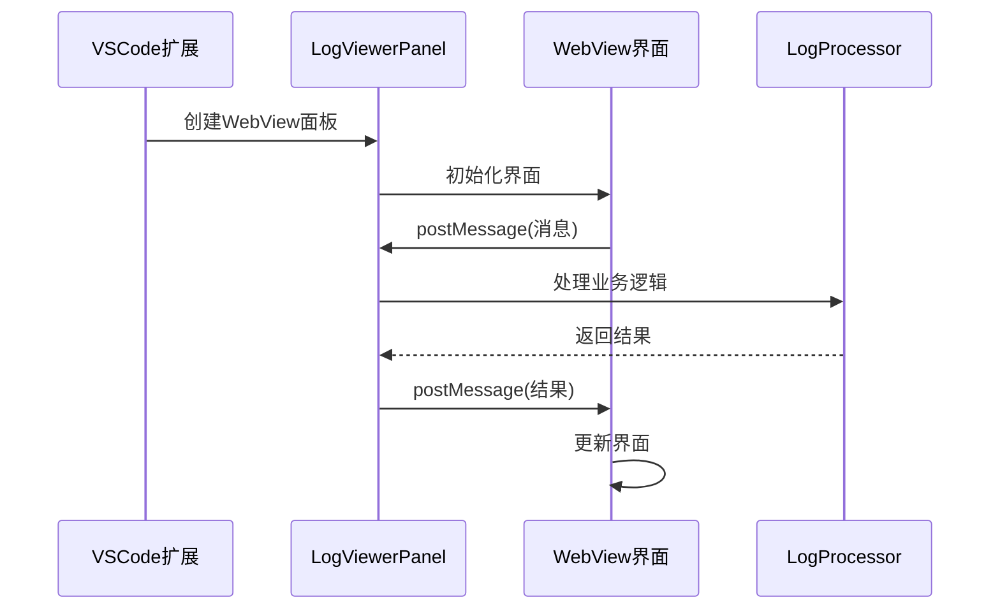
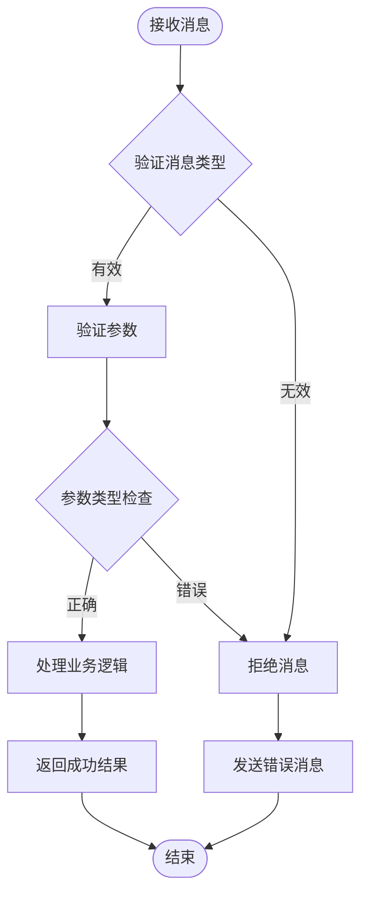
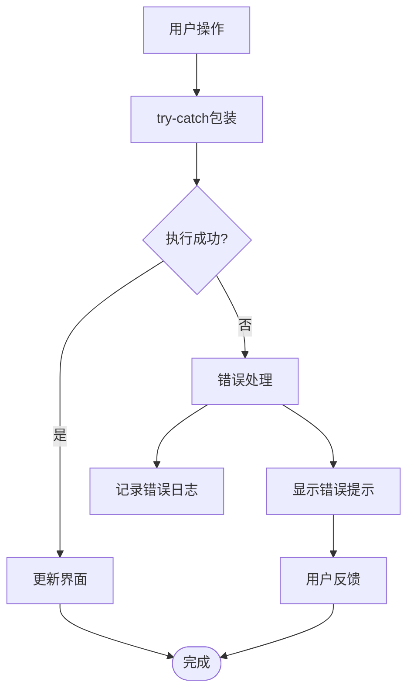
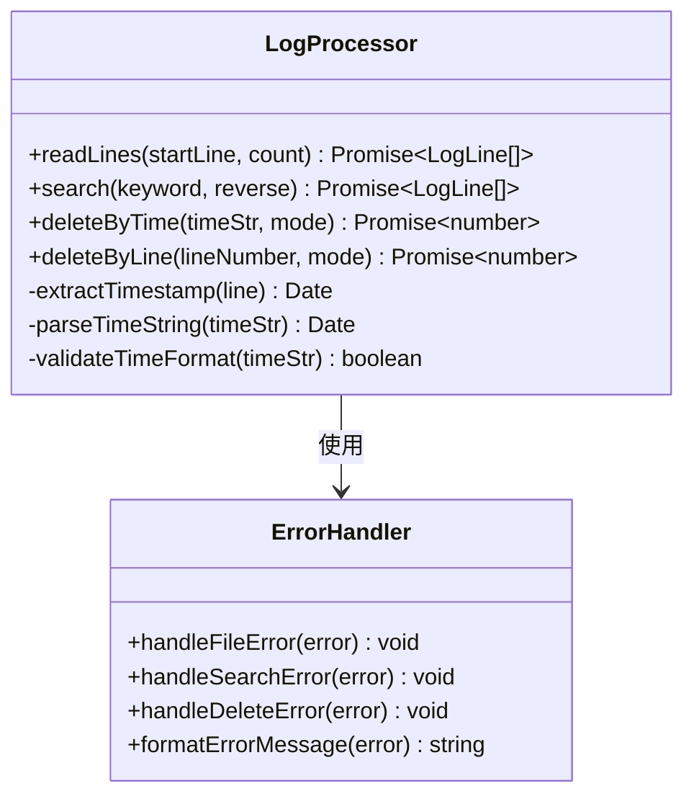

# WebView消息通信安全性和错误处理机制

<cite>
**本文档引用的文件**
- [src/extension.ts](file://src/extension.ts)
- [src/logViewerPanel.ts](file://src/logViewerPanel.ts)
- [src/webview.html](file://src/webview.html)
- [src/logProcessor.ts](file://src/logProcessor.ts)
- [package.json](file://package.json)
</cite>

## 目录
1. [简介](#简介)
2. [项目架构概述](#项目架构概述)
3. [消息通信机制](#消息通信机制)
4. [安全性设计](#安全性设计)
5. [错误处理机制](#错误处理机制)
6. [具体实现分析](#具体实现分析)
7. [最佳实践建议](#最佳实践建议)
8. [总结](#总结)

## 简介

本项目是一个Visual Studio Code扩展，提供了大日志文件查看和处理功能。系统采用VSCode的WebView技术构建了一个专业的日志分析界面，支持虚拟滚动、智能搜索、时间过滤、级别过滤、折叠重复日志等多种高级功能。本文档详细分析了系统的消息通信安全性和错误处理机制，为开发者提供安全可靠的开发指导。

## 项目架构概述

该项目采用典型的VSCode扩展架构，包含以下核心组件：



**图表来源**
- [src/extension.ts](file://src/extension.ts#L1-L116)
- [src/logViewerPanel.ts](file://src/logViewerPanel.ts#L1-L510)
- [src/webview.html](file://src/webview.html#L1-L800)

**章节来源**
- [src/extension.ts](file://src/extension.ts#L1-L116)
- [src/logViewerPanel.ts](file://src/logViewerPanel.ts#L1-L510)

## 消息通信机制

### VSCode的postMessage机制

系统使用VSCode提供的安全消息传递机制，通过`postMessage`方法在扩展和WebView之间建立通信桥梁：



**图表来源**
- [src/logViewerPanel.ts](file://src/logViewerPanel.ts#L54-L98)
- [src/webview.html](file://src/webview.html#L1237-L1262)

### 消息类型和处理流程

系统支持多种消息类型的处理，每种消息都有明确的处理流程：

| 消息类型 | 功能描述 | 参数验证 | 错误处理 |
|---------|---------|---------|---------|
| `loadMore` | 加载更多日志行 | startLine, count | 文件读取异常 |
| `search` | 关键词搜索 | keyword, reverse | 搜索失败 |
| `filterByLevel` | 按级别过滤 | levels数组 | 过滤条件无效 |
| `deleteByTime` | 按时间删除 | timeStr, mode | 删除确认 |
| `deleteByLine` | 按行数删除 | lineNumber, mode | 行号验证 |
| `regexSearch` | 正则搜索 | pattern, flags, reverse | 正则表达式错误 |
| `exportLogs` | 导出日志 | lines数组 | 文件写入失败 |

**章节来源**
- [src/logViewerPanel.ts](file://src/logViewerPanel.ts#L56-L98)

## 安全性设计

### XSS防护机制

系统通过VSCode的WebView安全沙箱环境运行，天然具备XSS防护能力：

1. **内容安全策略(CSP)**：VSCode自动应用严格的安全策略
2. **同源策略**：确保只有可信的扩展可以访问WebView
3. **参数验证**：所有传入参数都经过严格验证

### 输入验证和类型检查

系统实现了多层次的输入验证机制：



**图表来源**
- [src/logViewerPanel.ts](file://src/logViewerPanel.ts#L56-L98)

### 敏感操作的安全处理

对于涉及文件修改的敏感操作，系统实施了多重安全措施：

1. **二次确认机制**：删除操作必须经过用户确认
2. **操作分类**：提供不同的操作选项（隐藏、导出、修改）
3. **危险标识**：明确标识可能造成数据丢失的操作

**章节来源**
- [src/logViewerPanel.ts](file://src/logViewerPanel.ts#L180-L278)

## 错误处理机制

### 前端错误处理

前端实现了完善的错误捕获和用户友好的错误提示系统：



**图表来源**
- [src/webview.html](file://src/webview.html#L1237-L1262)

### 后端错误处理

后端实现了全面的异常捕获和错误消息发送机制：

| 错误类型 | 处理方式 | 错误消息格式 | 用户提示 |
|---------|---------|-------------|---------|
| 文件读取失败 | try-catch | `加载文件失败: ${error}` | vscode.window.showErrorMessage |
| 搜索异常 | try-catch | `搜索失败: ${error}` | vscode.window.showErrorMessage |
| 删除失败 | try-catch | `操作失败: ${error}` | vscode.window.showErrorMessage |
| 正则表达式错误 | 特殊处理 | `无效的正则表达式` | vscode.window.showErrorMessage |
| 时间解析错误 | 参数验证 | `无法解析时间格式` | 用户输入验证 |

**章节来源**
- [src/logViewerPanel.ts](file://src/logViewerPanel.ts#L107-L482)

### 文件读写异常处理

系统对文件操作进行了全面的异常处理：



**图表来源**
- [src/logProcessor.ts](file://src/logProcessor.ts#L1-L807)

### 大文件处理超时机制

对于大文件处理，系统实现了智能的加载策略和超时保护：

1. **文件大小检测**：根据文件大小决定加载策略
2. **分批加载**：大数据文件采用分批加载方式
3. **进度提示**：实时显示加载进度和状态
4. **内存管理**：及时释放不需要的数据

**章节来源**
- [src/logViewerPanel.ts](file://src/logViewerPanel.ts#L107-L162)

## 具体实现分析

### 消息处理的安全性实现

系统在消息处理过程中实现了多层安全保障：

```javascript
// 示例：安全的消息处理模式
this._panel.webview.onDidReceiveMessage(async message => {
    try {
        // 1. 消息类型验证
        if (!message.command || typeof message.command !== 'string') {
            throw new Error('无效的消息类型');
        }
        
        // 2. 参数验证
        switch (message.command) {
            case 'loadMore':
                validateLoadMoreParams(message);
                break;
            case 'search':
                validateSearchParams(message);
                break;
            // ... 其他命令验证
        }
        
        // 3. 业务逻辑处理
        await this.processMessage(message);
        
    } catch (error) {
        // 4. 统一错误处理
        this.handleError(message.command, error);
    }
});
```

### 错误消息格式标准化

系统采用了统一的错误消息格式，便于前端展示和用户理解：

```javascript
// 错误消息格式示例
{
    command: 'errorMessage',
    data: {
        operation: 'deleteByTime',
        error: '无法解析时间格式',
        timestamp: new Date().toISOString(),
        severity: 'warning'
    }
}
```

**章节来源**
- [src/logViewerPanel.ts](file://src/logViewerPanel.ts#L56-L98)

### 用户友好的错误提示

系统提供了多层次的用户错误提示机制：

1. **即时反馈**：操作过程中的状态提示
2. **错误通知**：操作失败时的详细说明
3. **帮助信息**：提供问题解决建议
4. **日志记录**：后台记录详细的错误信息

**章节来源**
- [src/webview.html](file://src/webview.html#L1237-L1262)

## 最佳实践建议

### 消息通信安全最佳实践

1. **严格的消息类型验证**：确保只处理预期的消息类型
2. **参数完整性检查**：验证所有必需参数的存在性和有效性
3. **输入数据净化**：对用户输入进行适当的清理和验证
4. **权限控制**：限制敏感操作的执行权限

### 错误处理最佳实践

1. **分层错误处理**：在不同层次实现相应的错误处理
2. **错误信息本地化**：提供用户友好的错误描述
3. **错误恢复机制**：在可能的情况下提供错误恢复选项
4. **日志记录**：详细记录错误信息用于调试和监控

### 性能优化建议

1. **异步处理**：使用Promise和async/await处理耗时操作
2. **资源管理**：及时释放不再使用的资源
3. **缓存策略**：合理使用缓存减少重复计算
4. **分页加载**：大数据集采用分页或虚拟滚动

## 总结

本项目在WebView消息通信安全性和错误处理方面实现了全面而细致的设计。通过VSCode的postMessage机制，系统建立了安全可靠的消息传递通道；通过多层次的输入验证和类型检查，有效防范了潜在的安全威胁；通过完善的错误处理机制，确保了系统的稳定性和用户体验。

系统的主要安全特性包括：
- 基于VSCode安全框架的消息通信
- 严格的输入验证和参数检查
- 敏感操作的二次确认机制
- 完善的错误处理和用户提示

这些设计不仅保证了系统的安全性，也为用户提供了良好的使用体验。对于类似的VSCode扩展开发，这些实践经验具有重要的参考价值。