# 搜索与过滤功能

<cite>
**本文档引用的文件**
- [extension.ts](file://src/extension.ts)
- [logProcessor.ts](file://src/logProcessor.ts)
- [logViewerPanel.ts](file://src/logViewerPanel.ts)
- [webview.html](file://src/webview.html)
- [README.md](file://README.md)
</cite>

## 目录
1. [简介](#简介)
2. [系统架构概览](#系统架构概览)
3. [基础搜索功能](#基础搜索功能)
4. [正则表达式搜索](#正则表达式搜索)
5. [时间过滤功能](#时间过滤功能)
6. [日志级别过滤](#日志级别过滤)
7. [调用链路分析](#调用链路分析)
8. [性能优化策略](#性能优化策略)
9. [错误处理机制](#错误处理机制)
10. [总结](#总结)

## 简介

大型日志文件查看器是一个专业的VSCode扩展，专门用于处理几十MB甚至GB级别的日志文件。该系统提供了强大的搜索、过滤、分析和管理功能，通过前后端分离的架构设计，实现了高性能的日志处理能力。

核心搜索与过滤功能包括：
- **基础关键词搜索**：支持不区分大小写的实时搜索
- **正则表达式搜索**：支持完整的JavaScript正则表达式语法
- **时间范围过滤**：按时间段精确筛选日志
- **日志级别过滤**：按ERROR、WARN、INFO、DEBUG等级别分类
- **高级组合搜索**：多条件组合的复杂查询

## 系统架构概览

系统采用三层架构设计，从前端UI到后端处理形成完整的处理链路：

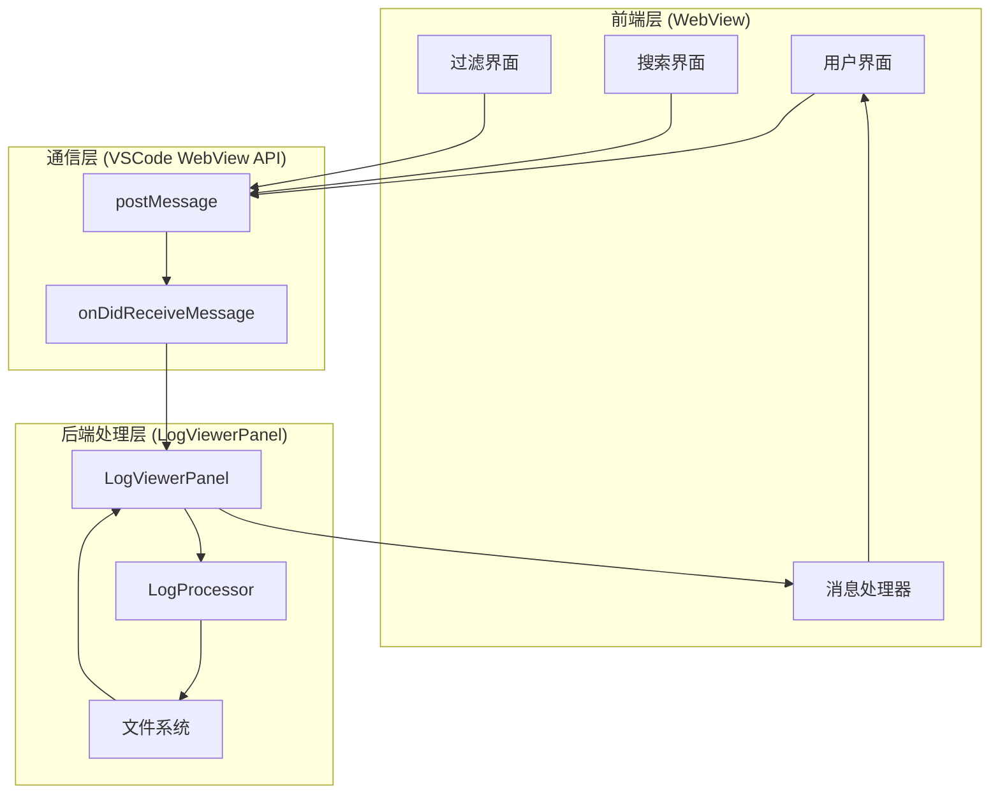

**图表来源**
- [logViewerPanel.ts](file://src/logViewerPanel.ts#L54-L98)
- [webview.html](file://src/webview.html#L1902-L1937)

## 基础搜索功能

### 不区分大小写的匹配机制

基础搜索功能通过简单的关键词匹配实现，支持不区分大小写的实时搜索：

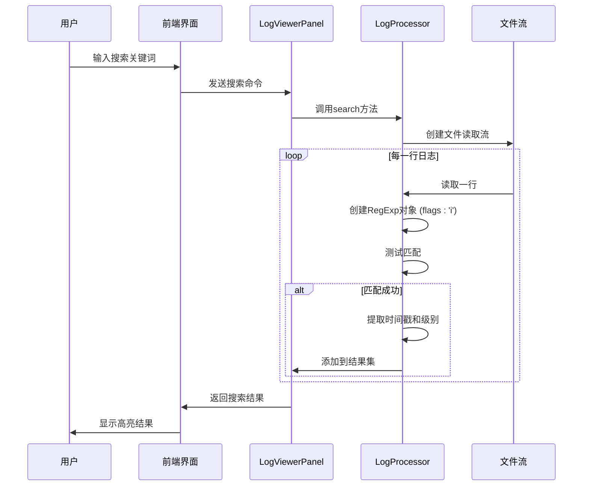

**图表来源**
- [logViewerPanel.ts](file://src/logViewerPanel.ts#L165-L177)
- [logProcessor.ts](file://src/logProcessor.ts#L135-L172)

### 关键实现细节

1. **正则表达式构建**：使用`new RegExp(keyword, 'i')`创建不区分大小写的搜索模式
2. **流式处理**：通过Node.js的readline模块逐行读取文件，避免内存溢出
3. **实时响应**：搜索过程完全异步，不会阻塞UI线程
4. **结果缓存**：搜索结果存储在内存中，支持快速展示

**章节来源**
- [logProcessor.ts](file://src/logProcessor.ts#L135-L172)

## 正则表达式搜索

### flags参数支持与错误捕获

正则表达式搜索功能提供了完整的JavaScript正则表达式支持，包括各种flags参数：

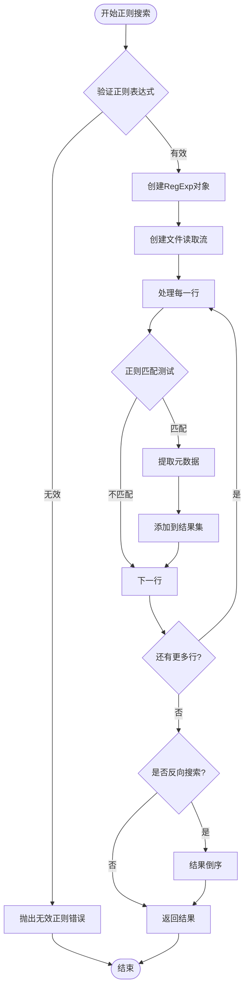

**图表来源**
- [logProcessor.ts](file://src/logProcessor.ts#L704-L748)

### 支持的flags参数

| Flags | 功能描述 | 使用场景 |
|-------|----------|----------|
| i | 忽略大小写 | 模糊匹配关键词 |
| g | 全局匹配 | 查找所有匹配项 |
| m | 多行模式 | ^和$匹配行首尾 |
| u | Unicode模式 | 支持Unicode字符 |
| y | 粘连模式 | 从lastIndex开始匹配 |

### 错误处理机制

1. **语法验证**：在创建RegExp对象时捕获语法错误
2. **异常传播**：将错误信息通过Promise.reject传播到前端
3. **用户提示**：前端显示"无效的正则表达式"错误信息
4. **降级处理**：遇到错误时停止搜索，返回错误状态

**章节来源**
- [logProcessor.ts](file://src/logProcessor.ts#L704-L748)

## 时间过滤功能

### 时间解析逻辑

时间过滤功能支持多种时间格式的解析和处理：

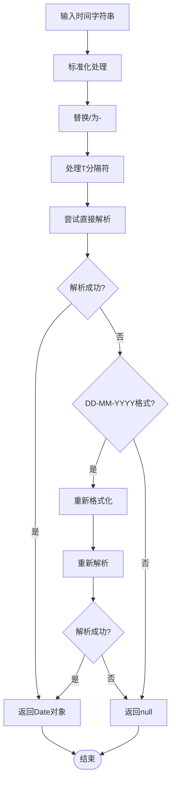

**图表来源**
- [logProcessor.ts](file://src/logProcessor.ts#L776-L804)

### 支持的时间格式

| 格式 | 示例 | 解析方式 |
|------|------|----------|
| YYYY-MM-DD HH:mm:ss | 2024-01-01 12:00:00 | 直接解析 |
| YYYY/MM/DD HH:mm:ss | 2024/01/01 12:00:00 | 标准化后解析 |
| [YYYY-MM-DD HH:mm:ss] | [2024-01-01 12:00:00] | 提取后解析 |
| DD-MM-YYYY HH:mm:ss | 01-01-2024 12:00:00 | 重新格式化后解析 |
| ISO 8601 | 2024-01-01T12:00:00 | T替换为空格后解析 |

### 时间范围过滤的布尔逻辑

时间过滤的核心逻辑通过`keep`参数控制保留或删除行为：

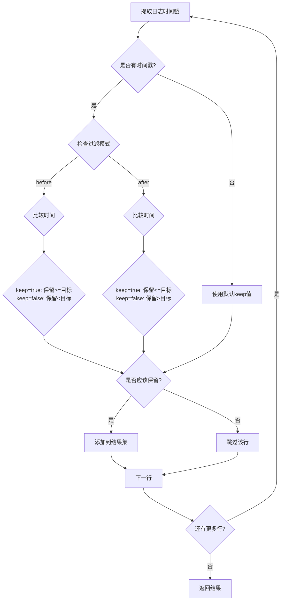

**图表来源**
- [logProcessor.ts](file://src/logProcessor.ts#L178-L230)

**章节来源**
- [logProcessor.ts](file://src/logProcessor.ts#L178-L230)
- [logProcessor.ts](file://src/logProcessor.ts#L776-L804)

## 日志级别过滤

### Set数据结构优化

日志级别过滤功能使用Set数据结构显著提升了多级别过滤的性能：

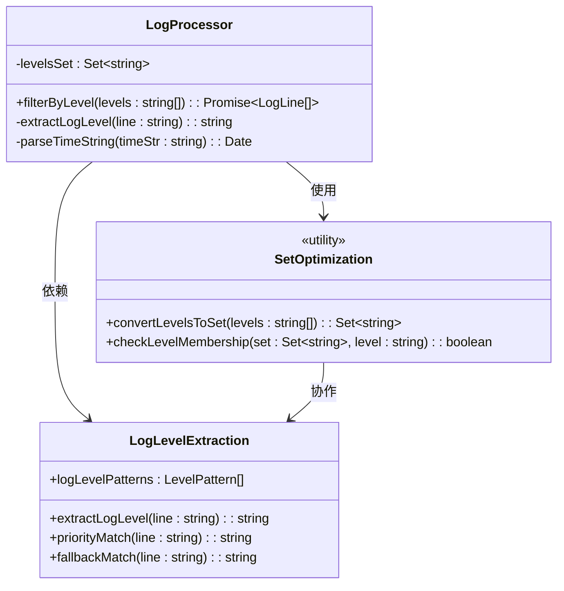

**图表来源**
- [logProcessor.ts](file://src/logProcessor.ts#L650-L698)
- [logProcessor.ts](file://src/logProcessor.ts#L48-L54)

### 多级别过滤性能优化

1. **Set转换**：将输入的级别数组转换为Set对象，O(1)时间复杂度的成员检查
2. **预处理**：所有级别名称统一转换为大写，避免运行时大小写转换
3. **早期退出**：匹配成功后立即添加到结果集，减少不必要的处理

### 日志级别正则模式

系统维护了一个优先级列表的日志级别正则模式：

| 优先级 | 级别 | 正则模式 | 匹配示例 |
|--------|------|----------|----------|
| 1 | ERROR | ERROR\|FATAL\|SEVERE | ERROR: 系统崩溃 |
| 2 | WARN | WARN\|WARNING | WARN: 配置过期 |
| 3 | INFO | INFO\|INFORMATION | INFO: 服务启动 |
| 4 | DEBUG | DEBUG\|TRACE\|VERBOSE | DEBUG: SQL查询 |

### 级别提取的优先级机制

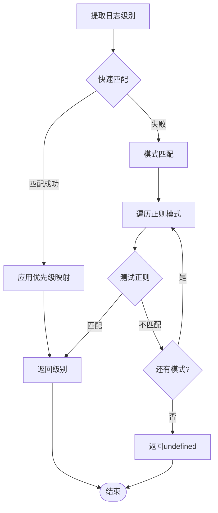

**图表来源**
- [logProcessor.ts](file://src/logProcessor.ts#L542-L560)

**章节来源**
- [logProcessor.ts](file://src/logProcessor.ts#L650-L698)
- [logProcessor.ts](file://src/logProcessor.ts#L48-L54)
- [logProcessor.ts](file://src/logProcessor.ts#L542-L560)

## 调用链路分析

### 完整的搜索流程

从用户输入到最终结果显示的完整调用链路：

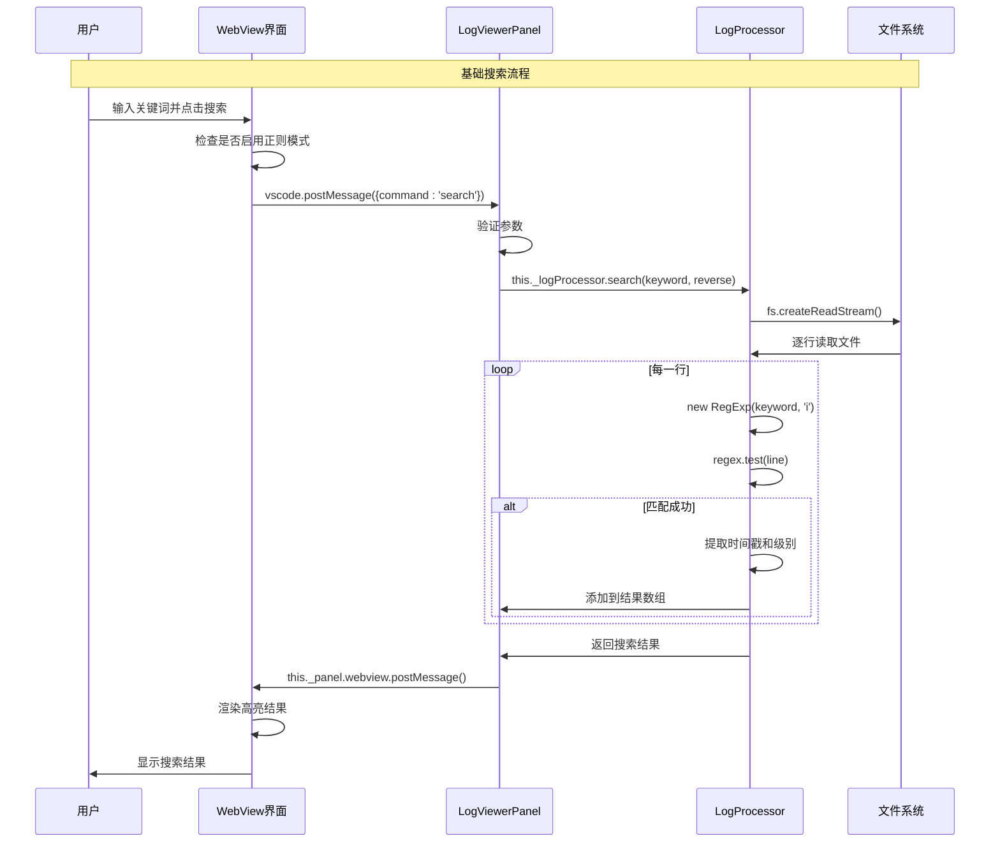

**图表来源**
- [webview.html](file://src/webview.html#L1902-L1937)
- [logViewerPanel.ts](file://src/logViewerPanel.ts#L165-L177)

### 正则搜索的特殊流程

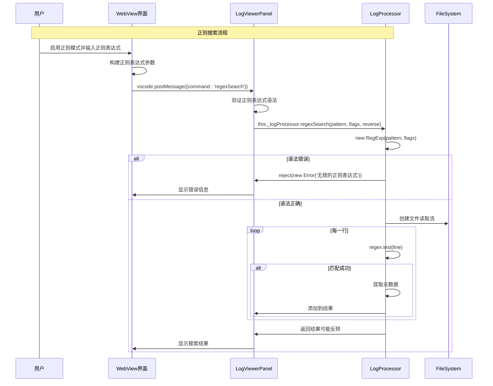

**图表来源**
- [logViewerPanel.ts](file://src/logViewerPanel.ts#L450-L463)
- [logProcessor.ts](file://src/logProcessor.ts#L704-L748)

### 时间过滤的完整流程

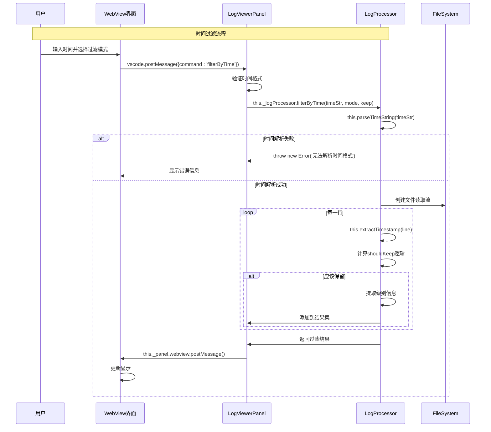

**图表来源**
- [logViewerPanel.ts](file://src/logViewerPanel.ts#L410-L426)
- [logProcessor.ts](file://src/logProcessor.ts#L178-L230)

**章节来源**
- [webview.html](file://src/webview.html#L1902-L1937)
- [logViewerPanel.ts](file://src/logViewerPanel.ts#L165-L177)
- [logViewerPanel.ts](file://src/logViewerPanel.ts#L450-L463)
- [logViewerPanel.ts](file://src/logViewerPanel.ts#L410-L426)

## 性能优化策略

### 流式处理优化

1. **内存效率**：使用Node.js的readline模块逐行读取，避免一次性加载大文件
2. **异步处理**：所有文件操作都是异步的，不会阻塞主线程
3. **及时释放**：处理完成后立即关闭文件流，释放系统资源

### 搜索算法优化

1. **早期终止**：搜索过程中发现足够结果时可以提前终止
2. **缓存机制**：搜索结果在内存中缓存，支持快速重新展示
3. **批量处理**：将多个操作合并为批量处理，减少I/O次数

### 前端渲染优化

1. **虚拟滚动**：只渲染可见区域的日志行，支持无限滚动
2. **增量更新**：只更新变化的部分，减少DOM操作
3. **防抖处理**：搜索输入时使用防抖机制，避免频繁触发

## 错误处理机制

### 多层次错误处理

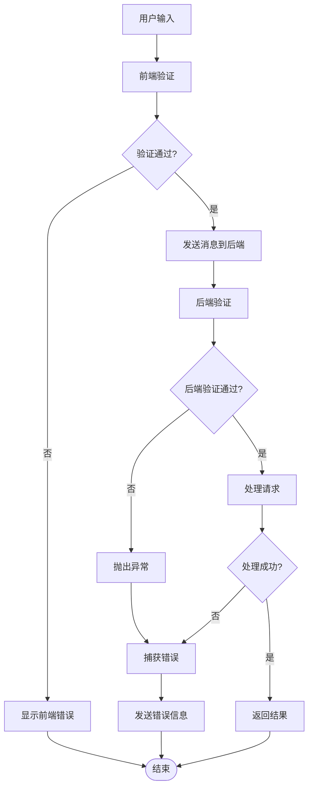

### 错误类型与处理

| 错误类型 | 触发条件 | 处理方式 | 用户提示 |
|----------|----------|----------|----------|
| 无效正则表达式 | RegExp构造函数抛出异常 | 捕获异常并返回错误信息 | "无效的正则表达式" |
| 时间格式错误 | parseTimeString返回undefined | 抛出Error("无法解析时间格式") | "时间格式不正确" |
| 文件读取错误 | 文件不存在或权限不足 | 捕获FS错误 | "文件读取失败" |
| 内存不足 | 处理超大文件时 | 流式处理避免内存溢出 | "内存不足，建议分批处理" |

**章节来源**
- [logProcessor.ts](file://src/logProcessor.ts#L710-L714)
- [logProcessor.ts](file://src/logProcessor.ts#L179-L181)

## 总结

大型日志文件查看器的搜索与过滤功能通过精心设计的架构和优化策略，实现了高性能的日志处理能力：

### 核心优势

1. **高性能处理**：流式读取和异步处理支持GB级别文件
2. **灵活搜索**：支持基础关键词和复杂正则表达式搜索
3. **精确过滤**：多维度的时间、级别、内容过滤
4. **用户友好**：直观的界面和实时的响应反馈
5. **稳定可靠**：完善的错误处理和降级机制

### 技术亮点

- **Set数据结构优化**：提升多级别过滤性能
- **正则表达式flags支持**：完整的JavaScript正则表达式功能
- **多种时间格式解析**：兼容主流日志时间格式
- **前后端分离架构**：清晰的职责划分和通信机制
- **流式处理模式**：避免内存溢出的大文件处理

该系统为开发者提供了强大而易用的日志分析工具，大大提高了日志处理的效率和准确性，是现代软件开发中不可或缺的调试和分析助手。