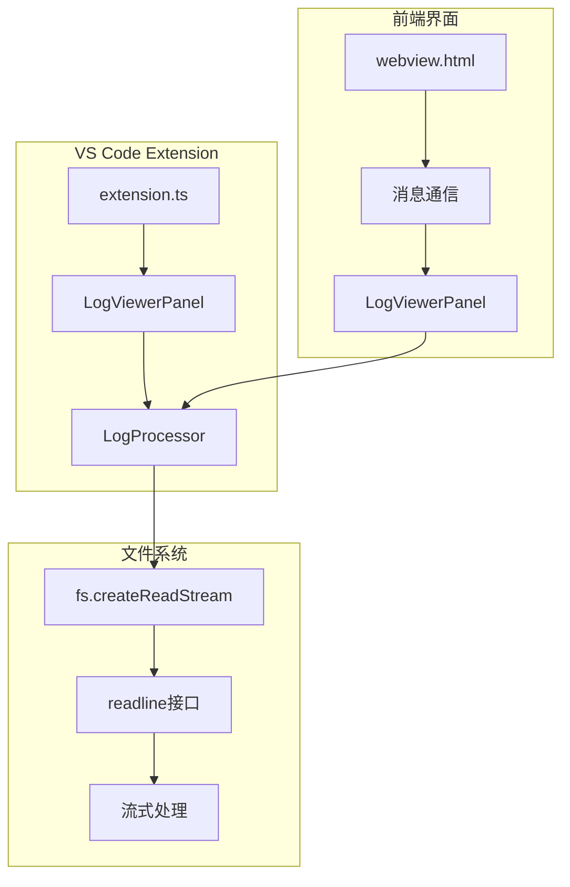
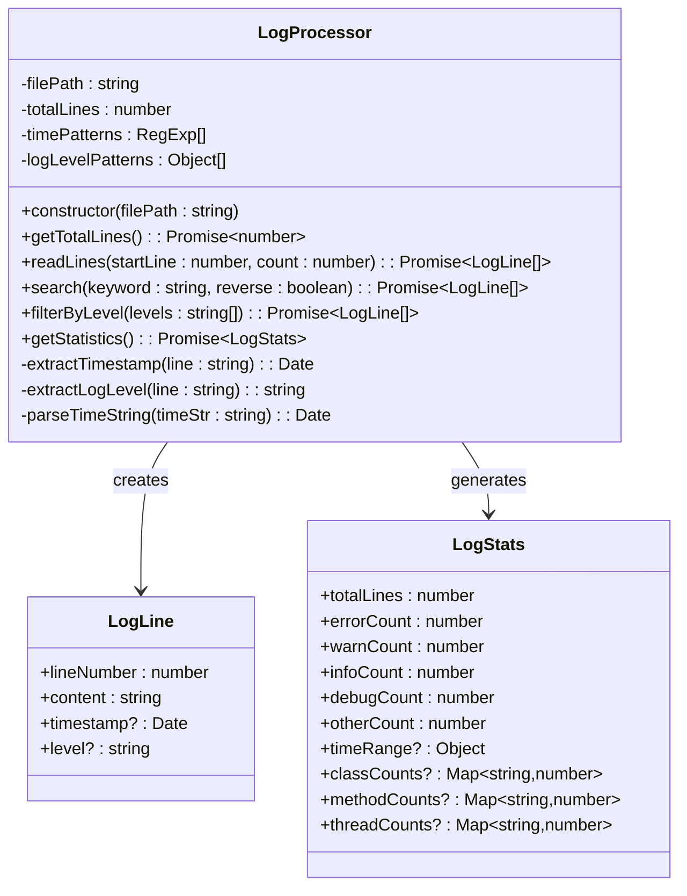
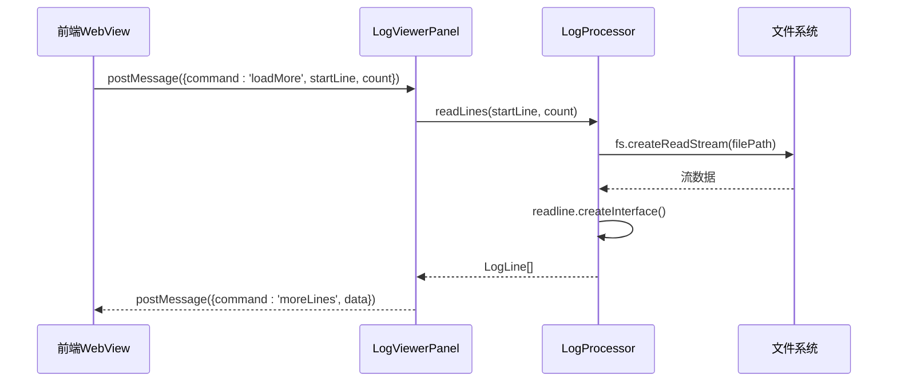
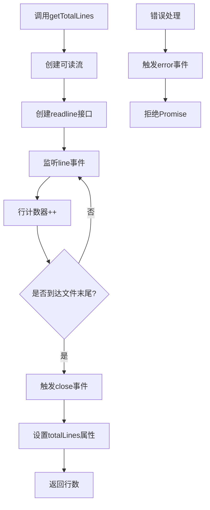
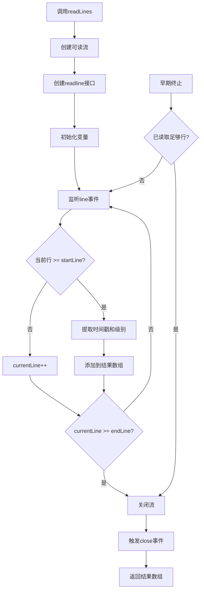
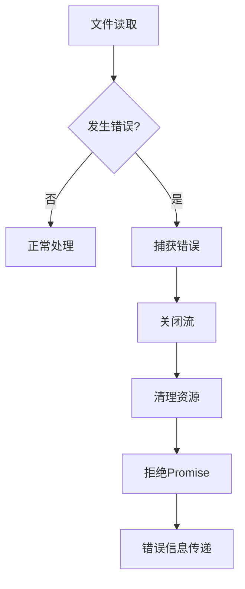
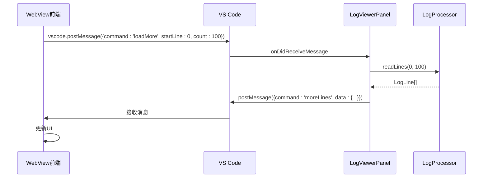
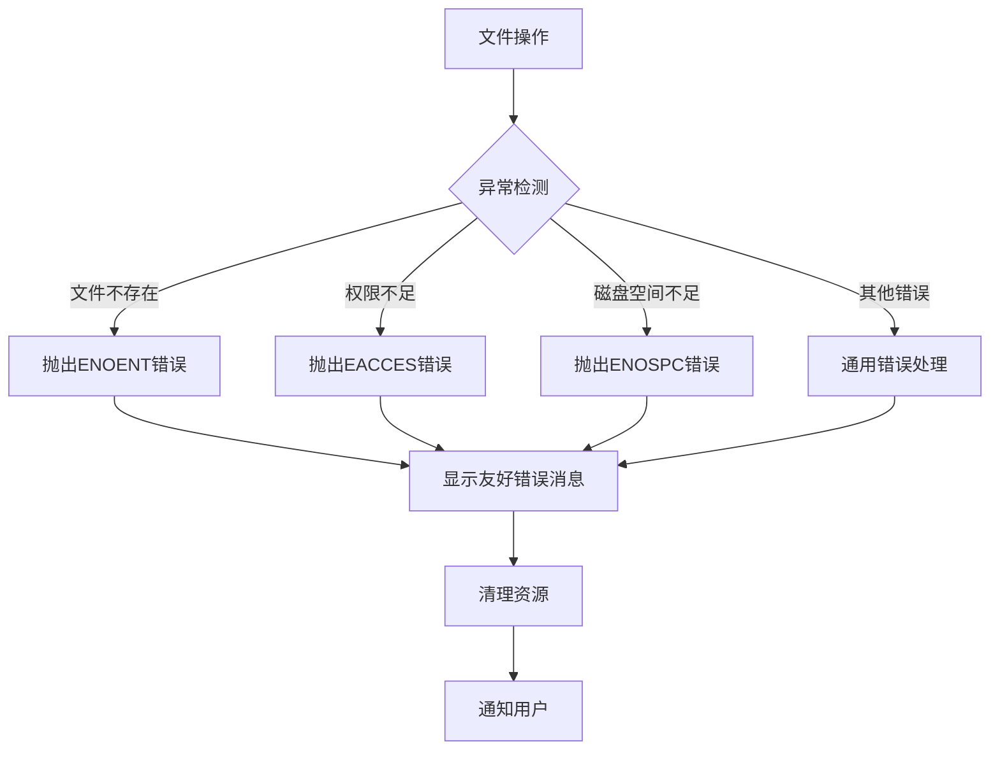
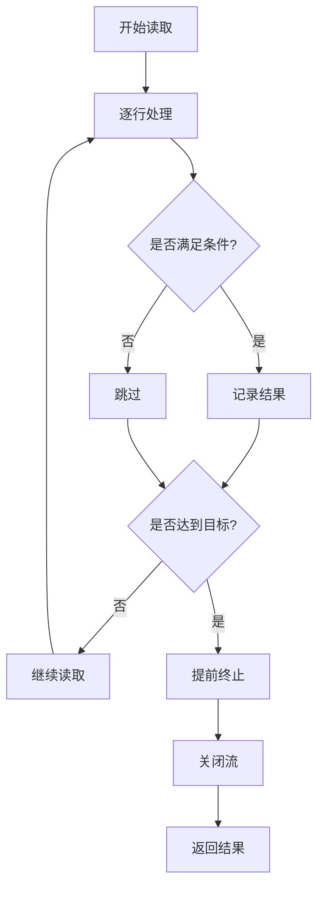

# 文件读取功能详细文档

<cite>
**本文档引用的文件**
- [logProcessor.ts](file://src/logProcessor.ts)
- [logViewerPanel.ts](file://src/logViewerPanel.ts)
- [extension.ts](file://src/extension.ts)
- [webview.html](file://src/webview.html)
- [package.json](file://package.json)
</cite>

## 目录
1. [简介](#简介)
2. [项目架构概览](#项目架构概览)
3. [核心组件分析](#核心组件分析)
4. [文件读取功能详解](#文件读取功能详解)
5. [前端WebView通信机制](#前端webview通信机制)
6. [错误处理与安全验证](#错误处理与安全验证)
7. [性能优化策略](#性能优化策略)
8. [使用示例](#使用示例)
9. [总结](#总结)

## 简介

本文档详细介绍了VS Code扩展"大日志文件查看器"中的文件读取功能。该系统采用流式处理技术，通过Node.js的`fs.createReadStream`和`readline`接口实现高效的大文件读取，避免内存溢出问题。核心功能包括`getTotalLines`和`readLines`两个公共方法，支持懒加载策略和早期终止优化。

## 项目架构概览

该项目采用分层架构设计，主要包含以下组件：



**图表来源**
- [extension.ts](file://src/extension.ts#L1-L116)
- [logViewerPanel.ts](file://src/logViewerPanel.ts#L1-L510)
- [logProcessor.ts](file://src/logProcessor.ts#L1-L807)

## 核心组件分析

### LogProcessor类

`LogProcessor`是文件读取功能的核心类，负责处理所有与文件读取相关的操作。



**图表来源**
- [logProcessor.ts](file://src/logProcessor.ts#L30-L807)

**章节来源**
- [logProcessor.ts](file://src/logProcessor.ts#L30-L807)

### LogViewerPanel类

`LogViewerPanel`管理VS Code WebView面板，处理前端与后端之间的消息通信。



**图表来源**
- [logViewerPanel.ts](file://src/logViewerPanel.ts#L54-L98)
- [logProcessor.ts](file://src/logProcessor.ts#L90-L129)

**章节来源**
- [logViewerPanel.ts](file://src/logViewerPanel.ts#L54-L98)

## 文件读取功能详解

### getTotalLines方法实现机制

`getTotalLines`方法用于获取文件的总行数，采用流式处理避免内存占用。

#### 实现原理



**图表来源**
- [logProcessor.ts](file://src/logProcessor.ts#L63-L84)

#### 关键特性

1. **流式处理**: 使用`fs.createReadStream`创建流式读取
2. **事件驱动**: 基于`readline`的事件模型
3. **内存效率**: 不需要将整个文件加载到内存
4. **异步操作**: 返回Promise，支持async/await语法

**章节来源**
- [logProcessor.ts](file://src/logProcessor.ts#L63-L84)

### readLines方法实现机制

`readLines`方法实现了高效的懒加载策略，支持指定起始行和行数范围读取。

#### 核心算法流程



**图表来源**
- [logProcessor.ts](file://src/logProcessor.ts#L90-L129)

#### 懒加载策略详解

1. **startLine参数**: 指定开始读取的行号（从0开始）
2. **count参数**: 指定要读取的行数
3. **early termination**: 当读取到所需行数时立即关闭流
4. **内存优化**: 只缓存当前批次的数据

#### 性能优化特性

- **流控制**: 使用`rl.close()`和`stream.destroy()`及时释放资源
- **条件判断**: 只在需要时才读取特定范围的行
- **资源管理**: 自动清理流连接，防止内存泄漏

**章节来源**
- [logProcessor.ts](file://src/logProcessor.ts#L90-L129)

### 错误处理机制

系统实现了完善的错误处理机制：



**图表来源**
- [logProcessor.ts](file://src/logProcessor.ts#L81-L83)
- [logProcessor.ts](file://src/logProcessor.ts#L125-L128)

**章节来源**
- [logProcessor.ts](file://src/logProcessor.ts#L81-L83)
- [logProcessor.ts](file://src/logProcessor.ts#L125-L128)

## 前端WebView通信机制

### 消息通信架构

前端WebView通过VS Code提供的`vscode.postMessage` API与后端通信：



**图表来源**
- [webview.html](file://src/webview.html#L1276-L1281)
- [logViewerPanel.ts](file://src/logViewerPanel.ts#L54-L98)

### 主要消息类型

| 消息命令 | 参数 | 功能描述 |
|---------|------|----------|
| `loadMore` | startLine, count | 加载更多日志行 |
| `search` | keyword, reverse | 按关键字搜索 |
| `regexSearch` | pattern, flags, reverse | 正则表达式搜索 |
| `filterByLevel` | levels | 按日志级别过滤 |
| `getStatistics` | - | 获取统计信息 |
| `refresh` | - | 刷新文件内容 |
| `jumpToTime` | timeStr | 跳转到指定时间 |
| `jumpToLineInFullLog` | lineNumber | 跳转到完整日志的指定行 |

**章节来源**
- [logViewerPanel.ts](file://src/logViewerPanel.ts#L56-L98)

### 前端JavaScript实现

前端JavaScript通过事件监听和消息发送实现与后端的交互：

```javascript
// 搜索功能示例
function search() {
    const keyword = document.getElementById('searchInput').value;
    const isRegex = document.getElementById('regexMode').checked;
    
    if (isRegex) {
        vscode.postMessage({
            command: 'regexSearch',
            pattern: keyword,
            flags: 'gi',
            reverse: isReverse
        });
    } else {
        vscode.postMessage({
            command: 'search',
            keyword: keyword,
            reverse: isReverse
        });
    }
}
```

**章节来源**
- [webview.html](file://src/webview.html#L1903-L1937)

## 错误处理与安全验证

### 文件路径安全验证

虽然代码中没有显式的路径验证逻辑，但系统通过以下方式确保安全性：

1. **VS Code URI验证**: 使用`vscode.Uri`对象处理文件路径
2. **相对路径限制**: 通过`fileUri.fsPath`获取绝对路径
3. **权限检查**: 依赖VS Code的沙箱环境

### 异常处理策略



**图表来源**
- [logViewerPanel.ts](file://src/logViewerPanel.ts#L145-L147)
- [logViewerPanel.ts](file://src/logViewerPanel.ts#L160-L162)

### 错误恢复机制

系统实现了多层次的错误恢复：

1. **前端错误提示**: 使用`vscode.window.showErrorMessage`
2. **状态重置**: 在错误发生时重置相关状态
3. **资源清理**: 确保流和资源被正确释放

**章节来源**
- [logViewerPanel.ts](file://src/logViewerPanel.ts#L145-L147)
- [logViewerPanel.ts](file://src/logViewerPanel.ts#L160-L162)

## 性能优化策略

### 内存管理优化

1. **流式处理**: 避免将整个文件加载到内存
2. **及时释放**: 使用`destroy()`方法释放流资源
3. **批量处理**: 控制每次读取的行数

### 早期终止优化



**图表来源**
- [logProcessor.ts](file://src/logProcessor.ts#L115-L119)

### 大文件处理策略

系统根据文件大小自动调整加载策略：

```javascript
// 大文件处理逻辑
if (totalLines <= 50000) {
    // 小文件：一次性加载所有数据
    initialLines = await this._logProcessor.readLines(0, totalLines);
} else {
    // 大文件：先加载前10000行
    initialLines = await this._logProcessor.readLines(0, 10000);
}
```

**章节来源**
- [logViewerPanel.ts](file://src/logViewerPanel.ts#L118-L128)

## 使用示例

### 基本文件读取

```typescript
// 创建LogProcessor实例
const processor = new LogProcessor('/path/to/logfile.log');

// 获取总行数
const totalLines = await processor.getTotalLines();
console.log(`文件总行数: ${totalLines}`);

// 读取特定范围的行
const lines = await processor.readLines(1000, 50);
lines.forEach(line => {
    console.log(`${line.lineNumber}: ${line.content}`);
});
```

### 前端调用示例

```javascript
// 前端JavaScript调用后端方法
function loadMoreLines(startLine, count) {
    vscode.postMessage({
        command: 'loadMore',
        startLine: startLine,
        count: count
    });
}

// 搜索日志
function searchLogs(keyword) {
    vscode.postMessage({
        command: 'search',
        keyword: keyword,
        reverse: false
    });
}
```

### 错误处理示例

```typescript
try {
    const lines = await processor.readLines(0, 1000);
    // 处理成功结果
} catch (error) {
    console.error('读取文件失败:', error.message);
    // 显示错误信息给用户
    vscode.window.showErrorMessage(`无法读取日志文件: ${error.message}`);
}
```

## 总结

本文档详细介绍了VS Code扩展"大日志文件查看器"中的文件读取功能。该系统通过以下关键技术实现了高效的大文件处理：

1. **流式处理**: 使用Node.js的`fs.createReadStream`和`readline`接口，避免内存溢出
2. **懒加载策略**: 支持指定范围的行读取，提高响应速度
3. **早期终止**: 当满足条件时立即停止读取，优化性能
4. **消息通信**: 通过VS Code的WebView API实现前后端通信
5. **错误处理**: 完善的异常处理和资源清理机制
6. **性能优化**: 根据文件大小自动调整加载策略

这套文件读取功能特别适用于处理大型日志文件，能够有效应对内存限制和性能挑战，为用户提供流畅的日志查看体验。