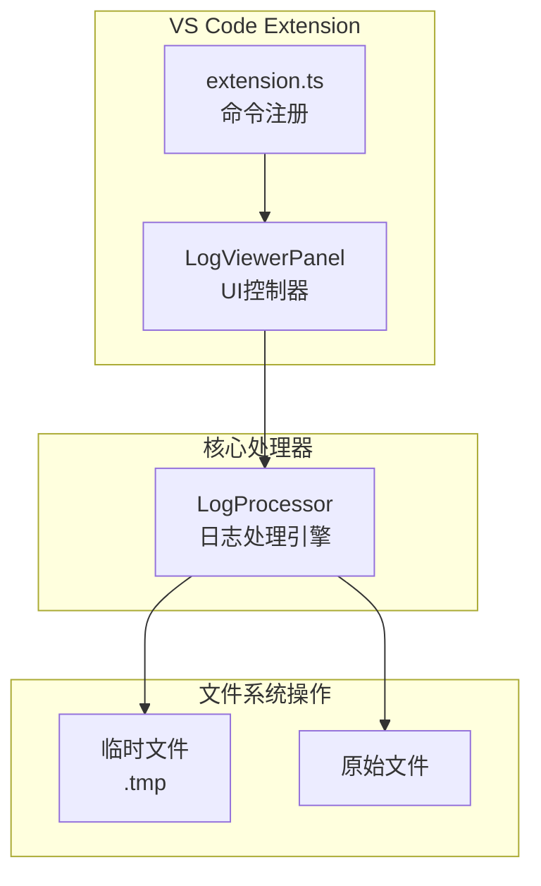
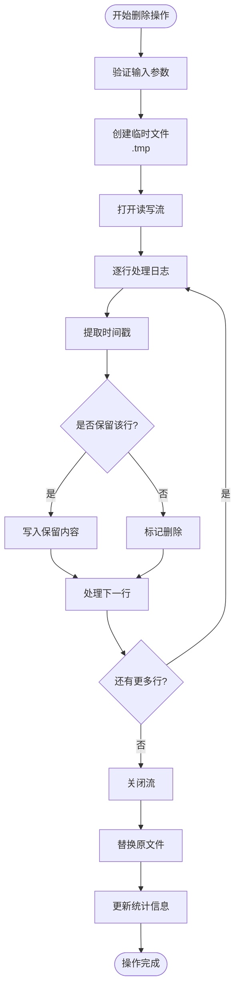
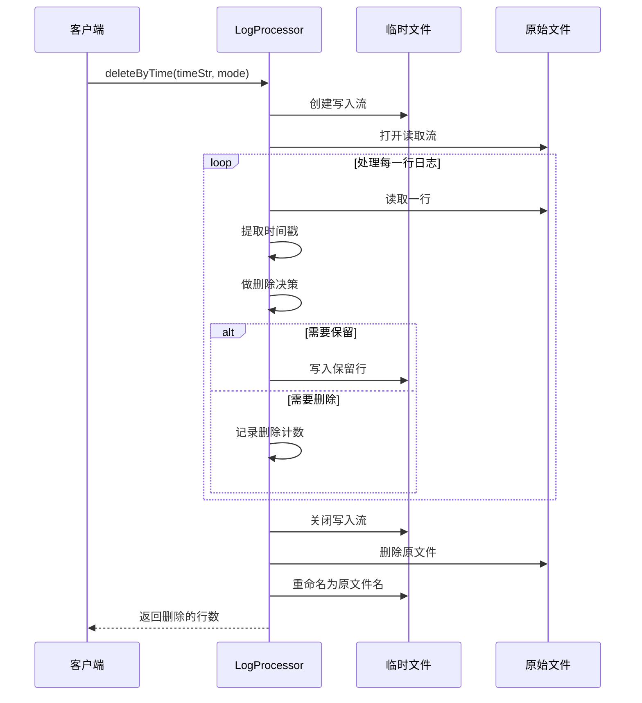
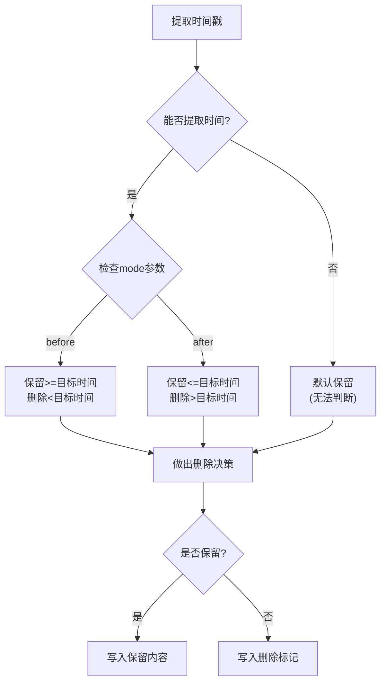
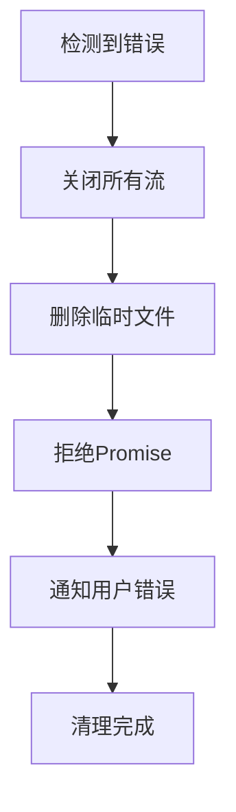

# 日志删除操作

<cite>
**本文档中引用的文件**
- [logProcessor.ts](file://src/logProcessor.ts)
- [logViewerPanel.ts](file://src/logViewerPanel.ts)
- [extension.ts](file://src/extension.ts)
- [webview.html](file://src/webview.html)
</cite>

## 目录
1. [简介](#简介)
2. [项目架构概览](#项目架构概览)
3. [核心删除方法分析](#核心删除方法分析)
4. [原子性操作机制](#原子性操作机制)
5. [临时文件安全机制](#临时文件安全机制)
6. [文件替换流程详解](#文件替换流程详解)
7. [计数器同步更新机制](#计数器同步更新机制)
8. [mode参数语义差异](#mode参数语义差异)
9. [时间戳提取与删除决策](#时间戳提取与删除决策)
10. [异常处理策略](#异常处理策略)
11. [用户界面交互](#用户界面交互)
12. [性能考虑](#性能考虑)
13. [故障排除指南](#故障排除指南)
14. [总结](#总结)

## 简介

本项目是一个Visual Studio Code扩展，专门用于处理大型日志文件。其中最核心的功能之一是安全地删除日志文件中的特定时间段或行号范围内的日志记录。该项目实现了两种主要的删除方法：`deleteByTime`（按时间删除）和`deleteByLine`（按行号删除），都采用了原子性操作和数据安全机制来确保文件完整性。

## 项目架构概览

项目采用模块化架构设计，主要包含以下核心组件：



**图表来源**
- [extension.ts](file://src/extension.ts#L1-L116)
- [logViewerPanel.ts](file://src/logViewerPanel.ts#L1-L510)
- [logProcessor.ts](file://src/logProcessor.ts#L1-L807)

**章节来源**
- [extension.ts](file://src/extension.ts#L1-L116)
- [logViewerPanel.ts](file://src/logViewerPanel.ts#L1-L510)
- [logProcessor.ts](file://src/logProcessor.ts#L1-L807)

## 核心删除方法分析

项目提供了两个主要的日志删除方法，每个方法都针对不同的删除场景进行了优化：

### deleteByTime 方法

`deleteByTime`方法允许用户根据时间戳删除日志文件中的特定时间段内容。该方法支持两种删除模式：
- `'before'`：删除指定时间之前的所有日志
- `'after'`：删除指定时间之后的所有日志

### deleteByLine 方法

`deleteByLine`方法允许用户根据行号删除日志文件中的特定行范围。同样支持两种模式：
- `'before'`：删除指定行之前的所有日志
- `'after'`：删除指定行之后的所有日志



**图表来源**
- [logProcessor.ts](file://src/logProcessor.ts#L339-L408)
- [logProcessor.ts](file://src/logProcessor.ts#L414-L474)

**章节来源**
- [logProcessor.ts](file://src/logProcessor.ts#L339-L408)
- [logProcessor.ts](file://src/logProcessor.ts#L414-L474)

## 原子性操作机制

为了确保删除操作的原子性，项目采用了严格的事务处理模式：

### Promise-based事务管理

所有删除操作都封装在Promise中，确保操作要么完全成功，要么完全失败：

```typescript
// 删除操作的Promise包装
async deleteByTime(timeStr: string, mode: string): Promise<number> {
    return new Promise((resolve, reject) => {
        // 实际的删除逻辑
    });
}
```

### 流控制保证

通过精确控制流的生命周期，确保在任何情况下都不会出现部分写入的情况：

1. **顺序执行**：读取、写入、替换三个阶段严格按顺序执行
2. **错误传播**：任何阶段的错误都会立即终止整个操作
3. **资源清理**：确保所有打开的文件句柄都被正确关闭

**章节来源**
- [logProcessor.ts](file://src/logProcessor.ts#L339-L408)
- [logProcessor.ts](file://src/logProcessor.ts#L414-L474)

## 临时文件安全机制

项目的核心安全机制基于临时文件的使用，这种设计确保了即使在操作过程中发生意外情况，原始文件也不会被破坏。

### 临时文件命名策略

临时文件采用标准的`.tmp`扩展名，这是Unix/Linux系统中的通用临时文件标识：

```typescript
const tempFilePath = `${this.filePath}.tmp`;
```

### 写入过程的安全保证

在写入过程中，系统采用以下安全措施：

1. **逐行写入**：每次只写入一行，减少内存占用和潜在的缓冲区溢出风险
2. **即时刷新**：每写入一行就立即刷新到磁盘
3. **错误检测**：实时监控写入错误，一旦发现立即停止操作



**图表来源**
- [logProcessor.ts](file://src/logProcessor.ts#L346-L408)
- [logProcessor.ts](file://src/logProcessor.ts#L416-L474)

**章节来源**
- [logProcessor.ts](file://src/logProcessor.ts#L346-L408)
- [logProcessor.ts](file://src/logProcessor.ts#L416-L474)

## 文件替换流程详解

文件替换是整个删除操作中最关键的步骤，必须确保原子性和一致性。

### writeStream写入保留内容

在写入阶段，系统会：
1. **逐行读取**：使用readline接口逐行读取原始文件
2. **时间戳提取**：对每一行调用`extractTimestamp`方法提取时间信息
3. **条件判断**：根据mode参数和时间戳决定是否保留该行
4. **写入操作**：将需要保留的内容写入临时文件

### close原流

在所有行处理完成后，系统会：
1. **关闭读取流**：释放原始文件的读取权限
2. **等待写入完成**：确保所有数据都已写入临时文件
3. **验证写入状态**：检查写入过程中是否有错误发生

### 删除原文件

删除原文件采用安全的异步删除模式：

```typescript
fs.unlink(this.filePath, (err) => {
    if (err) {
        reject(err);
        return;
    }
    // 继续下一步操作
});
```

### 重命名临时文件

最后一步是将临时文件重命名为原始文件名：

```typescript
fs.rename(tempFilePath, this.filePath, (err) => {
    if (err) {
        reject(err);
        return;
    }
    // 更新内部状态
    this.totalLines = keptCount;
    resolve(deletedCount);
});
```

**章节来源**
- [logProcessor.ts](file://src/logProcessor.ts#L385-L398)
- [logProcessor.ts](file://src/logProcessor.ts#L451-L462)

## 计数器同步更新机制

项目实现了精确的计数器同步机制，确保删除操作的统计准确性。

### deletedCount计数器

`deletedCount`变量跟踪被删除的行数：

```typescript
let deletedCount = 0;
// 在删除逻辑中
deletedCount++;
```

### keptCount计数器

`keptCount`变量跟踪被保留的行数：

```typescript
let keptCount = 0;
// 在保留逻辑中
keptCount++;
```

### totalLines状态维护

删除操作完成后，系统会更新内部的`totalLines`属性：

```typescript
this.totalLines = keptCount;
```

这种设计确保了：
1. **实时准确性**：每次操作后立即更新状态
2. **一致性保证**：删除的行数加上保留的行数等于原始总行数
3. **状态同步**：前端和后端保持一致的状态

**章节来源**
- [logProcessor.ts](file://src/logProcessor.ts#L354-L356)
- [logProcessor.ts](file://src/logProcessor.ts#L396)

## mode参数语义差异

`mode`参数在两种删除方法中具有不同的语义含义，但都遵循一致的设计原则。

### deleteByTime中的mode参数

在按时间删除中，`mode`参数控制删除的时间范围：

- `'before'`：删除指定时间之前的所有日志
- `'after'`：删除指定时间之后的所有日志

```typescript
if (mode === 'before') {
    // 保留指定时间及之后的日志
    shouldKeep = timestamp >= targetTime;
} else {
    // 保留指定时间之前的日志
    shouldKeep = timestamp <= targetTime;
}
```

### deleteByLine中的mode参数

在按行号删除中，`mode`参数控制删除的行范围：

- `'before'`：删除指定行之前的所有日志
- `'after'`：删除指定行之后的所有日志

```typescript
if (mode === 'before') {
    // 保留指定行及之后的日志
    shouldKeep = currentLine >= lineNumber;
} else {
    // 保留指定行之前的日志
    shouldKeep = currentLine <= lineNumber;
}
```

### 语义一致性设计

尽管两种方法的`mode`参数在具体含义上不同，但它们都遵循相同的逻辑模式：
- `true`值表示保留
- `false`值表示删除
- 通过`keep`参数控制最终行为

**章节来源**
- [logProcessor.ts](file://src/logProcessor.ts#L365-L371)
- [logProcessor.ts](file://src/logProcessor.ts#L432-L438)

## 时间戳提取与删除决策

时间戳提取是`deleteByTime`方法的核心功能，直接影响删除决策的准确性。

### extractTimestamp方法

系统使用多种时间戳模式来确保兼容性：

```typescript
private extractTimestamp(line: string): Date | undefined {
    for (const pattern of this.timePatterns) {
        const match = line.match(pattern);
        if (match) {
            const timeStr = match[1];
            const date = this.parseTimeString(timeStr);
            if (date) {
                return date;
            }
        }
    }
    return undefined;
}
```

### 支持的时间格式

系统支持多种常见的时间格式：
- `YYYY-MM-DD HH:MM:SS`
- `YYYY/MM/DD HH:MM:SS`
- `[YYYY-MM-DD HH:MM:SS]`
- `DD-MM-YYYY HH:MM:SS`
- `YYYY-MM-DDTHH:MM:SS`

### 删除决策逻辑

时间戳提取的结果直接影响删除决策：



**图表来源**
- [logProcessor.ts](file://src/logProcessor.ts#L478-L492)
- [logProcessor.ts](file://src/logProcessor.ts#L358-L379)

**章节来源**
- [logProcessor.ts](file://src/logProcessor.ts#L478-L492)
- [logProcessor.ts](file://src/logProcessor.ts#L358-L379)

## 异常处理策略

项目实现了完善的异常处理机制，确保在各种错误情况下都能保持数据安全。

### 流错误处理

当读取或写入流发生错误时，系统会执行以下清理操作：

```typescript
rl.on('error', (error) => {
    writeStream.end();
    fs.unlink(tempFilePath, () => {});
    reject(error);
});
```

### 自动清理机制

系统在以下情况下自动清理临时文件：

1. **读取错误**：当读取原始文件时发生错误
2. **写入错误**：当写入临时文件时发生错误
3. **替换失败**：当删除或重命名原文件时发生错误

### 错误恢复策略



**图表来源**
- [logProcessor.ts](file://src/logProcessor.ts#L403-L407)
- [logProcessor.ts](file://src/logProcessor.ts#L469-L473)

### fs.unlink的使用

系统使用`fs.unlink`来安全地删除临时文件：

```typescript
fs.unlink(tempFilePath, () => {});
```

这种异步删除方式不会阻塞主进程，同时确保临时文件最终会被清理。

**章节来源**
- [logProcessor.ts](file://src/logProcessor.ts#L403-L407)
- [logProcessor.ts](file://src/logProcessor.ts#L469-L473)

## 用户界面交互

项目提供了直观的用户界面来引导用户完成删除操作。

### VS Code命令界面

用户可以通过VS Code的命令面板访问删除功能：

```typescript
// 注册删除命令
let deleteByTimeCommand = vscode.commands.registerCommand('big-log-viewer.deleteByTime', async () => {
    // 显示时间选择对话框
    const timeInput = await vscode.window.showInputBox({
        prompt: '输入时间（支持格式：2024-01-01 12:00:00 或 2024-01-01）',
        validateInput: (value) => {
            if (!/^\d{4}-\d{2}-\d{2}/.test(value)) {
                return '时间格式不正确';
            }
            return null;
        }
    });
});
```

### Webview交互界面

前端提供了更丰富的交互体验：

```javascript
function confirmDeleteByTime() {
    const timeStr = document.getElementById('deleteTimeInput').value.trim();
    const mode = document.getElementById('deleteTimeMode').value;
    
    if (!timeStr) {
        alert('请输入时间！');
        return;
    }
    
    vscode.postMessage({
        command: 'deleteByTime',
        timeStr: timeStr,
        mode: mode
    });
}
```

### 操作确认机制

系统实现了多层确认机制：

1. **时间格式验证**：前端和后端双重验证时间格式
2. **操作类型选择**：让用户选择删除方式（隐藏/导出/修改）
3. **最终确认**：在执行危险操作前再次确认

**章节来源**
- [extension.ts](file://src/extension.ts#L35-L70)
- [webview.html](file://src/webview.html#L3018-L3039)
- [logViewerPanel.ts](file://src/logViewerPanel.ts#L180-L228)

## 性能考虑

项目在设计时充分考虑了性能优化，特别是在处理大型日志文件时。

### 流式处理

所有删除操作都采用流式处理，避免将整个文件加载到内存中：

```typescript
const readStream = fs.createReadStream(this.filePath);
const rl = readline.createInterface({
    input: readStream,
    crlfDelay: Infinity
});
```

### 分页加载策略

对于大型文件，系统采用分页加载策略：

```typescript
if (totalLines <= 50000) {
    // 小于5万行，一次性加载所有数据
    initialLines = await this._logProcessor.readLines(0, totalLines);
} else {
    // 大于5万行，先加载前10000行
    initialLines = await this._logProcessor.readLines(0, 10000);
}
```

### 内存管理

- **逐行处理**：每次只处理一行，最小化内存占用
- **及时释放**：处理完一行后立即释放相关资源
- **流控制**：合理控制并发读写操作的数量

## 故障排除指南

### 常见问题及解决方案

#### 1. 时间格式解析失败

**症状**：无法解析时间字符串
**原因**：时间格式不符合预期
**解决方案**：
- 确保使用支持的格式（YYYY-MM-DD HH:MM:SS）
- 检查日期有效性
- 验证时区设置

#### 2. 文件权限错误

**症状**：无法删除或重命名文件
**原因**：文件权限不足或文件被其他程序占用
**解决方案**：
- 检查文件权限设置
- 确保没有其他程序访问该文件
- 以管理员权限运行VS Code

#### 3. 磁盘空间不足

**症状**：临时文件创建失败
**解决方案**：
- 清理磁盘空间
- 检查临时目录权限
- 减少同时处理的文件数量

#### 4. 大型文件处理缓慢

**症状**：删除操作耗时过长
**解决方案**：
- 考虑分批处理
- 增加系统内存
- 使用SSD存储

### 调试技巧

1. **启用详细日志**：在开发模式下查看详细的处理日志
2. **监控文件大小**：观察临时文件的增长情况
3. **检查网络连接**：确保文件系统访问正常
4. **验证时间戳**：确认时间戳提取的准确性

## 总结

本项目实现了一套完整且安全的日志删除系统，具有以下特点：

### 核心优势

1. **数据安全性**：通过临时文件机制确保原始文件不被破坏
2. **原子性操作**：采用Promise和流控制确保操作的完整性
3. **用户友好性**：提供直观的界面和多重确认机制
4. **性能优化**：采用流式处理和分页加载策略
5. **错误处理**：完善的异常处理和自动清理机制

### 技术亮点

- **时间戳智能提取**：支持多种时间格式，提高兼容性
- **灵活的删除模式**：支持按时间和行号进行精确删除
- **状态同步机制**：确保内部状态与实际文件保持一致
- **跨平台兼容**：在不同操作系统上都能正常工作

### 应用价值

该系统特别适用于：
- **日志文件管理**：清理过期的日志记录
- **性能优化**：减少大型日志文件的存储空间
- **合规要求**：满足数据保留期限的法律要求
- **开发调试**：快速定位和处理特定时间段的问题

通过这些精心设计的功能和机制，项目为用户提供了安全、可靠且高效的日志删除解决方案。