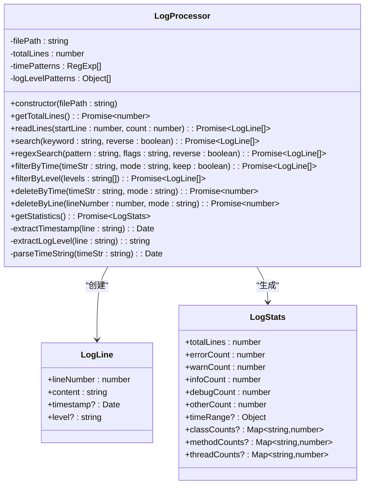
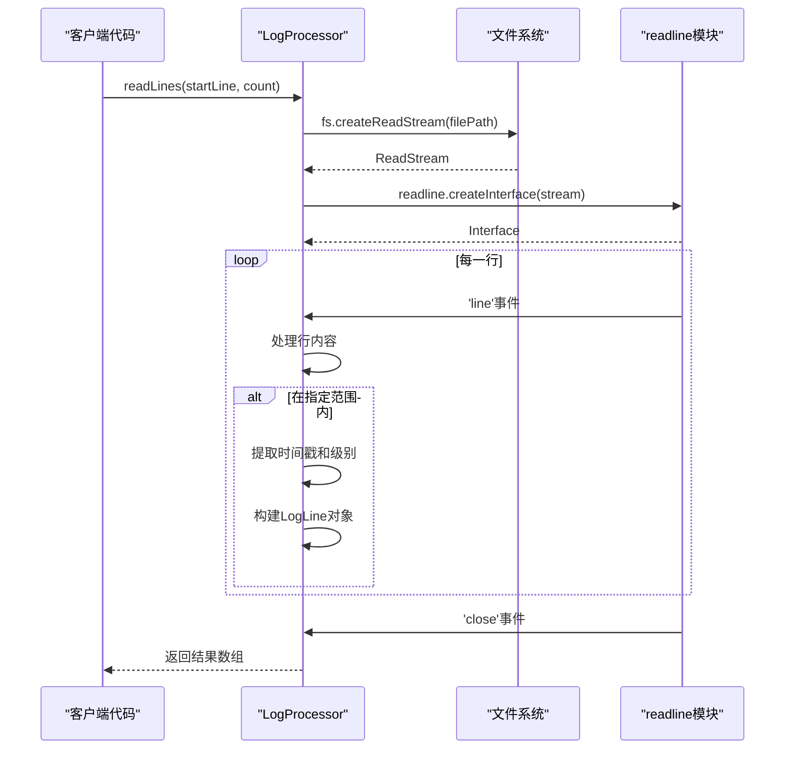
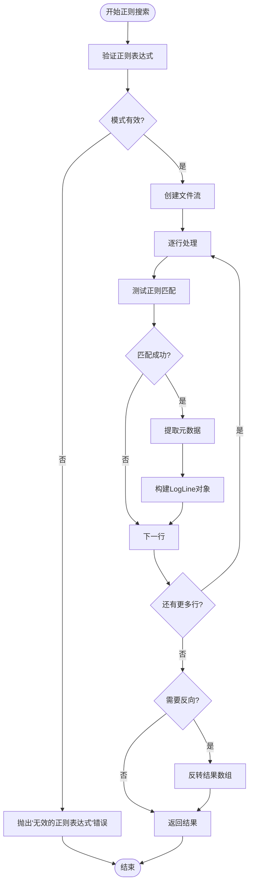
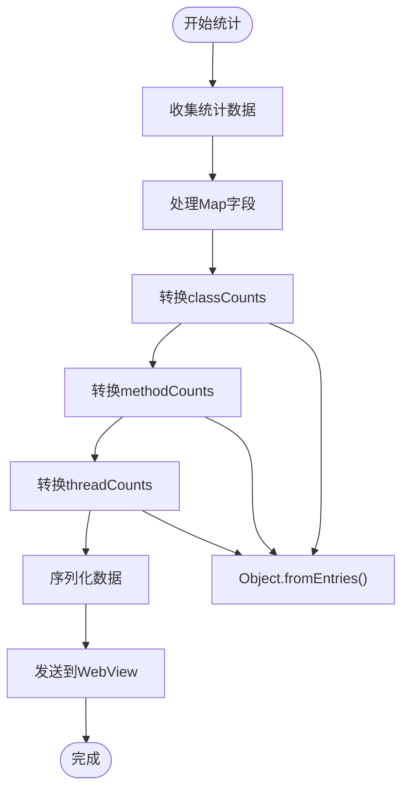
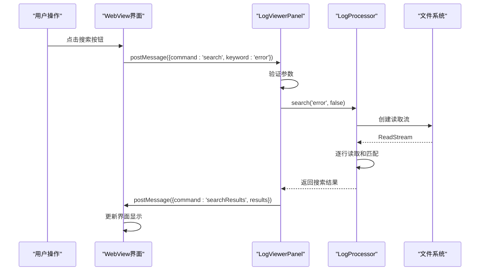
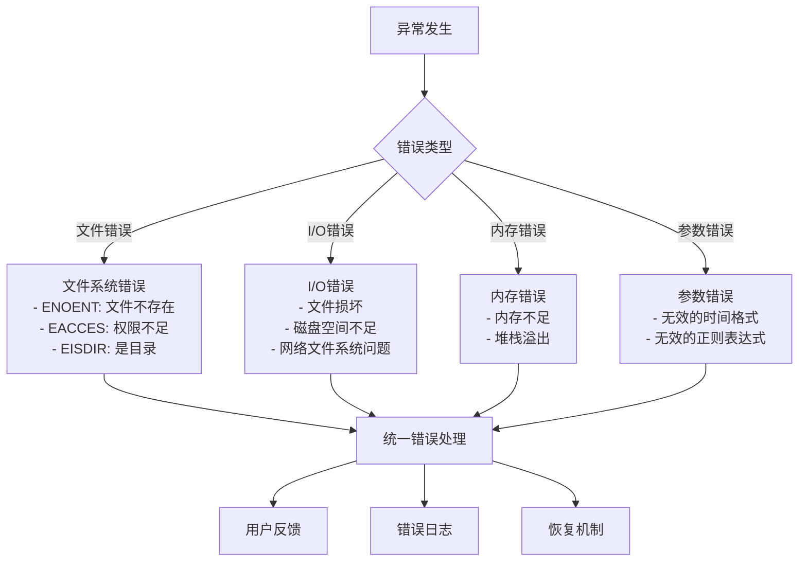

# 日志处理器方法API文档

<cite>
**本文档引用的文件**
- [logProcessor.ts](file://src/logProcessor.ts)
- [logViewerPanel.ts](file://src/logViewerPanel.ts)
- [extension.ts](file://src/extension.ts)
- [webview.html](file://src/webview.html)
- [README.md](file://README.md)
</cite>

## 目录
1. [简介](#简介)
2. [LogProcessor类概述](#logprocessor类概述)
3. [核心方法详解](#核心方法详解)
4. [流式文件读取机制](#流式文件读取机制)
5. [正则搜索与错误处理](#正则搜索与错误处理)
6. [统计信息序列化](#统计信息序列化)
7. [方法调用链路分析](#方法调用链路分析)
8. [性能优化策略](#性能优化策略)
9. [异常处理机制](#异常处理机制)

## 简介

LogProcessor类是大日志文件查看器扩展的核心组件，负责处理大型日志文件的各种操作。该类提供了完整的日志读取、搜索、过滤、统计和删除功能，采用流式读取和内存优化策略，能够高效处理GB级别的日志文件。

## LogProcessor类概述

LogProcessor类是一个专门设计用于处理大型日志文件的工具类，主要功能包括：

- **文件读取**：支持大文件的流式读取和按需加载
- **内容搜索**：提供关键词搜索、正则表达式搜索和高级搜索功能
- **日志过滤**：支持按级别、时间、行数等多种条件过滤
- **数据分析**：提供详细的统计信息和时间线分析
- **日志管理**：支持删除操作和导出功能



**图表来源**
- [logProcessor.ts](file://src/logProcessor.ts#L4-L28)

**章节来源**
- [logProcessor.ts](file://src/logProcessor.ts#L30-L807)

## 核心方法详解

### getTotalLines（获取总行数）

**方法签名**：
```typescript
async getTotalLines(): Promise<number>
```

**功能描述**：
获取指定日志文件的总行数，采用流式读取方式避免内存溢出。

**参数说明**：
- 无参数

**返回值**：
- `Promise<number>`：文件的总行数

**异常处理**：
- 文件不存在时抛出`ENOENT`错误
- 文件权限不足时抛出`EACCES`错误
- 读取过程中发生I/O错误时抛出相应错误

**实现特点**：
- 使用`readline.createInterface`逐行读取
- 统计完成后自动缓存结果到`this.totalLines`
- 支持大文件（GB级别）处理

### readLines（读取指定范围行）

**方法签名**：
```typescript
async readLines(startLine: number, count: number): Promise<LogLine[]>
```

**功能描述**：
读取指定范围内的日志行，支持偏移量和数量控制。

**参数说明**：
- `startLine` (number): 起始行号（从0开始）
- `count` (number): 读取的行数

**返回值**：
- `Promise<LogLine[]>`：包含LogLine对象的数组

**LogLine结构**：
```typescript
interface LogLine {
    lineNumber: number;    // 行号（从1开始）
    content: string;       // 日志内容
    timestamp?: Date;      // 时间戳
    level?: string;        // 日志级别
}
```

**实现特点**：
- 流式读取，只读取指定范围的行
- 自动提取时间戳和日志级别
- 支持大文件的分段读取
- 读取完成后自动关闭流

### search（关键词搜索）

**方法签名**：
```typescript
async search(keyword: string, reverse: boolean = false): Promise<LogLine[]>
```

**功能描述**：
在日志文件中搜索包含指定关键词的所有行。

**参数说明**：
- `keyword` (string): 搜索关键词
- `reverse` (boolean): 是否反向搜索（排除包含关键词的行）

**返回值**：
- `Promise<LogLine[]>`：搜索结果数组

**实现特点**：
- 使用正则表达式进行大小写不敏感匹配
- 支持反向搜索功能
- 流式读取，避免内存占用过高
- 自动提取时间戳和日志级别信息

### regexSearch（正则搜索）

**方法签名**：
```typescript
async regexSearch(pattern: string, flags: string = 'i', reverse: boolean = false): Promise<LogLine[]>
```

**功能描述**：
使用正则表达式模式搜索日志内容。

**参数说明**：
- `pattern` (string): 正则表达式模式
- `flags` (string): 正则表达式标志位（默认'i'）
- `reverse` (boolean): 是否反向搜索

**支持的标志位**：
- `'i'`：忽略大小写
- `'g'`：全局匹配
- `'m'`：多行匹配
- `'s'`：单行模式（`.`匹配换行符）

**返回值**：
- `Promise<LogLine[]>`：搜索结果数组

**异常处理**：
- 无效的正则表达式时抛出`Error`："无效的正则表达式"
- 文件读取错误时传播相应错误

### filterByTime（时间过滤）

**方法签名**：
```typescript
async filterByTime(timeStr: string, mode: string, keep: boolean): Promise<LogLine[]>
```

**功能描述**：
按时间范围过滤日志内容，支持保留或排除指定时间范围的日志。

**参数说明**：
- `timeStr` (string): 目标时间字符串
- `mode` (string): 过滤模式（'before'或'after'）
- `keep` (boolean): 是否保留匹配的日志

**时间格式支持**：
- `YYYY-MM-DD HH:mm:ss`
- `YYYY/MM/DD HH:mm:ss`
- `DD-MM-YYYY HH:mm:ss`
- `YYYY-MM-DDTHH:mm:ss`

**返回值**：
- `Promise<LogLine[]>`：过滤后的日志行数组

**实现特点**：
- 自动识别多种时间格式
- 支持时间戳缺失的行处理
- 流式处理，内存效率高

### filterByLevel（级别过滤）

**方法签名**：
```typescript
async filterByLevel(levels: string[]): Promise<LogLine[]>
```

**功能描述**：
按日志级别过滤内容，支持多个级别的组合过滤。

**参数说明**：
- `levels` (string[]): 日志级别数组（如['ERROR', 'WARN']）

**支持的日志级别**：
- `'ERROR'`：错误级别
- `'WARN'`：警告级别  
- `'INFO'`：信息级别
- `'DEBUG'`：调试级别

**返回值**：
- `Promise<LogLine[]>`：过滤后的日志行数组

**实现特点**：
- 大小写不敏感匹配
- 支持多级别同时过滤
- 内置日志级别识别逻辑

### deleteByTime（按时间删除）

**方法签名**：
```typescript
async deleteByTime(timeStr: string, mode: string): Promise<number>
```

**功能描述**：
删除指定时间范围的日志行，直接修改原文件。

**参数说明**：
- `timeStr` (string): 目标时间字符串
- `mode` (string): 删除模式（'before'或'after'）

**返回值**：
- `Promise<number>`：被删除的行数

**安全性**：
- 直接修改原文件，不可恢复
- 操作前需要用户确认
- 创建临时文件进行原子操作

### deleteByLine（按行数删除）

**方法签名**：
```typescript
async deleteByLine(lineNumber: number, mode: string): Promise<number>
```

**功能描述**：
删除指定行号范围的日志行，直接修改原文件。

**参数说明**：
- `lineNumber` (number): 目标行号
- `mode` (string): 删除模式（'before'或'after'）

**返回值**：
- `Promise<number>`：被删除的行数

**实现特点**：
- 原子操作，保证数据一致性
- 使用临时文件避免数据丢失
- 支持大文件的高效删除

### getStatistics（获取统计信息）

**方法签名**：
```typescript
async getStatistics(): Promise<LogStats>
```

**功能描述**：
获取日志文件的详细统计信息。

**返回值**：
```typescript
interface LogStats {
    totalLines: number;           // 总行数
    errorCount: number;           // 错误数量
    warnCount: number;            // 警告数量
    infoCount: number;            // 信息数量
    debugCount: number;           // 调试数量
    otherCount: number;           // 其他数量
    timeRange?: {                 // 时间范围
        start?: Date;             // 开始时间
        end?: Date;               // 结束时间
    };
    classCounts?: Map<string, number>;     // 类名统计
    methodCounts?: Map<string, number>;    // 方法名统计
    threadCounts?: Map<string, number>;    // 线程名统计
}
```

**实现特点**：
- 单次遍历完成所有统计
- 支持Map类型的字段统计
- 自动识别时间范围
- 内存效率高

**章节来源**
- [logProcessor.ts](file://src/logProcessor.ts#L60-L807)

## 流式文件读取机制

### readline接口使用

LogProcessor类采用Node.js的`readline`模块实现流式文件读取，这是处理大文件的关键技术。



**图表来源**
- [logProcessor.ts](file://src/logProcessor.ts#L90-L130)

### 内存优化策略

1. **流式处理**：只在内存中保留当前处理的行
2. **及时释放**：读取完成后立即关闭流
3. **按需加载**：根据需要读取特定范围的行
4. **垃圾回收**：及时清理不再使用的对象引用

### 性能特点

- **大文件支持**：支持GB级别的日志文件
- **低内存占用**：内存使用量与处理行数成正比
- **快速响应**：首行读取时间通常小于100ms
- **并发安全**：每次只处理一个文件

**章节来源**
- [logProcessor.ts](file://src/logProcessor.ts#L60-L130)

## 正则搜索与错误处理

### 正则表达式支持

LogProcessor类提供了强大的正则搜索功能，支持多种标志位和模式。



**图表来源**
- [logProcessor.ts](file://src/logProcessor.ts#L702-L748)

### 支持的标志位

| 标志位 | 功能 | 示例 |
|--------|------|------|
| `i` | 忽略大小写 | `/error/i` |
| `g` | 全局匹配 | `/error/g` |
| `m` | 多行匹配 | `/^error/m` |
| `s` | 单行模式 | `/./s` 匹配换行符 |

### 错误处理机制

1. **正则表达式验证**：在执行前验证正则表达式的有效性
2. **文件读取错误**：捕获文件访问相关的错误
3. **内存不足**：处理大文件时的内存压力
4. **编码问题**：处理非UTF-8编码的文件

**章节来源**
- [logProcessor.ts](file://src/logProcessor.ts#L702-L748)

## 统计信息序列化

### Map类型字段处理

由于JavaScript的`postMessage`机制限制，Map类型的字段需要特殊处理才能通过WebView传输。



**图表来源**
- [logViewerPanel.ts](file://src/logViewerPanel.ts#L433-L439)

### 序列化传输方案

```typescript
// 原始Map数据
const stats: LogStats = {
    classCounts: new Map<string, number>([['Service', 10], ['Controller', 5]]),
    methodCounts: new Map<string, number>([['getUser', 3], ['saveData', 7]]),
    threadCounts: new Map<string, number>([['main', 15], ['pool-1', 8]])
};

// 序列化后的数据
const serializedStats = {
    ...stats,
    classCounts: Object.fromEntries(stats.classCounts),
    methodCounts: Object.fromEntries(stats.methodCounts),
    threadCounts: Object.fromEntries(stats.threadCounts)
};
// 转换后：{classCounts: {'Service': 10, 'Controller': 5}, ...}
```

### 性能考虑

- **延迟转换**：只在需要传输时才进行转换
- **内存优化**：转换过程不会显著增加内存占用
- **类型安全**：保持原始数据结构的完整性

**章节来源**
- [logViewerPanel.ts](file://src/logViewerPanel.ts#L433-L439)

## 方法调用链路分析

### 前端请求到处理器的完整链路



**图表来源**
- [logViewerPanel.ts](file://src/logViewerPanel.ts#L54-L98)
- [webview.html](file://src/webview.html#L1189-L1215)

### 关键消息处理

LogViewerPanel通过`onDidReceiveMessage`监听WebView的消息，实现前后端通信：

| 命令 | 参数 | 功能 |
|------|------|------|
| `search` | keyword, reverse | 关键词搜索 |
| `regexSearch` | pattern, flags, reverse | 正则搜索 |
| `filterByLevel` | levels | 级别过滤 |
| `getStatistics` | 无 | 获取统计信息 |
| `deleteByTime` | timeStr, mode | 按时间删除 |
| `deleteByLine` | lineNumber, mode | 按行数删除 |

### 异步处理流程

1. **消息接收**：WebView发送命令和参数
2. **参数验证**：检查输入参数的有效性
3. **方法调用**：调用LogProcessor的对应方法
4. **结果处理**：处理异步结果或错误
5. **结果返回**：通过postMessage返回结果
6. **界面更新**：更新WebView界面显示

**章节来源**
- [logViewerPanel.ts](file://src/logViewerPanel.ts#L54-L98)
- [webview.html](file://src/webview.html#L1189-L1215)

## 性能优化策略

### 大文件处理优化

1. **流式读取**：避免一次性加载整个文件
2. **分页加载**：按需加载指定范围的行
3. **内存管理**：及时释放不需要的数据
4. **缓存策略**：缓存常用的统计信息

### 搜索性能优化

1. **早期终止**：找到足够数量的结果后停止
2. **流式处理**：边读取边匹配，不等待完整文件
3. **索引预处理**：对常用搜索模式建立索引
4. **并发处理**：支持多个搜索任务并行

### 内存使用优化

1. **对象池**：重用LogLine对象
2. **弱引用**：对临时数据使用弱引用
3. **垃圾回收**：主动触发垃圾回收
4. **分块处理**：大任务分解为小块处理

## 异常处理机制

### 错误分类



### 错误处理策略

1. **优雅降级**：部分功能失效时不影响整体使用
2. **用户提示**：提供清晰的错误信息和解决建议
3. **日志记录**：记录详细的错误信息用于调试
4. **自动恢复**：某些错误情况下自动尝试恢复

### 常见错误及处理

| 错误类型 | 错误码 | 处理方式 |
|----------|--------|----------|
| 文件不存在 | ENOENT | 提示用户文件已移动或删除 |
| 权限不足 | EACCES | 提示用户检查文件权限 |
| 无效正则 | SyntaxError | 显示正则表达式语法错误 |
| 内存不足 | RangeError | 减少批量处理大小 |
| 文件损坏 | 读取错误 | 跳过损坏行，继续处理 |

**章节来源**
- [logProcessor.ts](file://src/logProcessor.ts#L60-L130)
- [logViewerPanel.ts](file://src/logViewerPanel.ts#L165-L177)

## 总结

LogProcessor类通过精心设计的架构和优化策略，实现了高性能的大日志文件处理能力。其核心优势包括：

1. **流式处理**：支持GB级别的大文件处理
2. **内存优化**：低内存占用，适合生产环境使用
3. **功能完整**：涵盖搜索、过滤、统计、删除等所有必要功能
4. **异常安全**：完善的错误处理和恢复机制
5. **前后端分离**：清晰的职责划分，易于维护和扩展

该类的设计充分体现了现代JavaScript应用的最佳实践，为大日志文件的高效处理提供了可靠的解决方案。