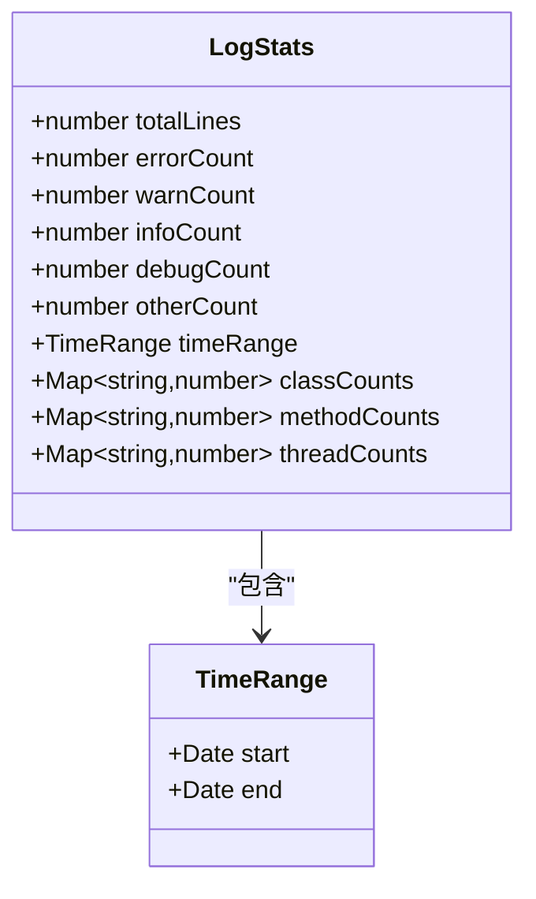
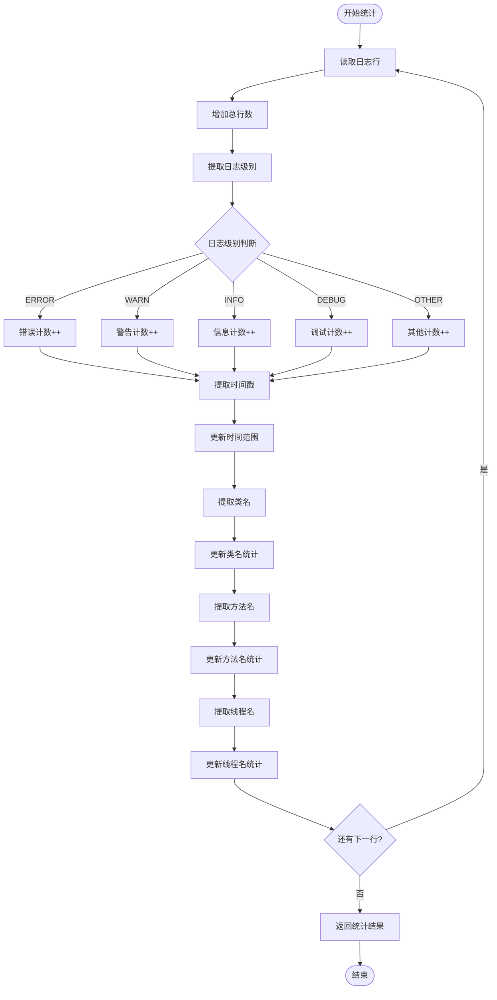
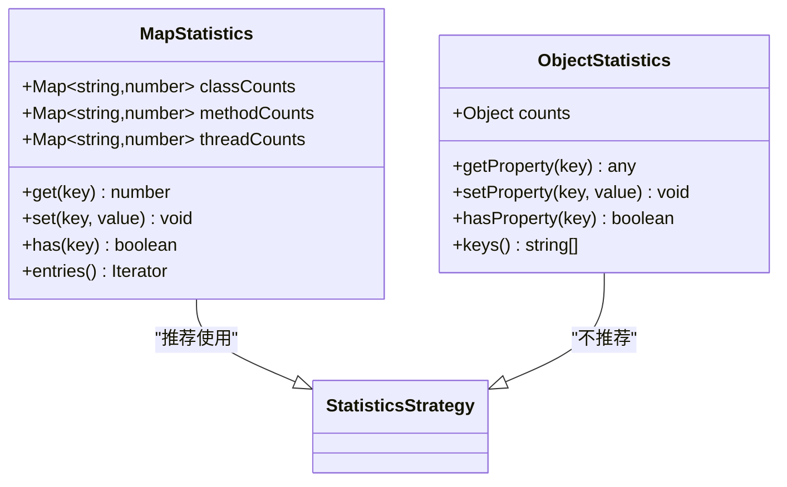
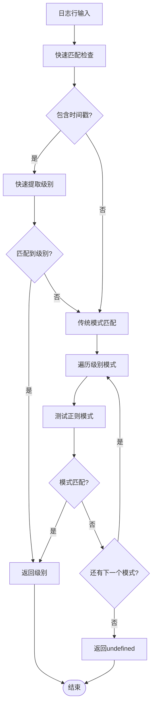
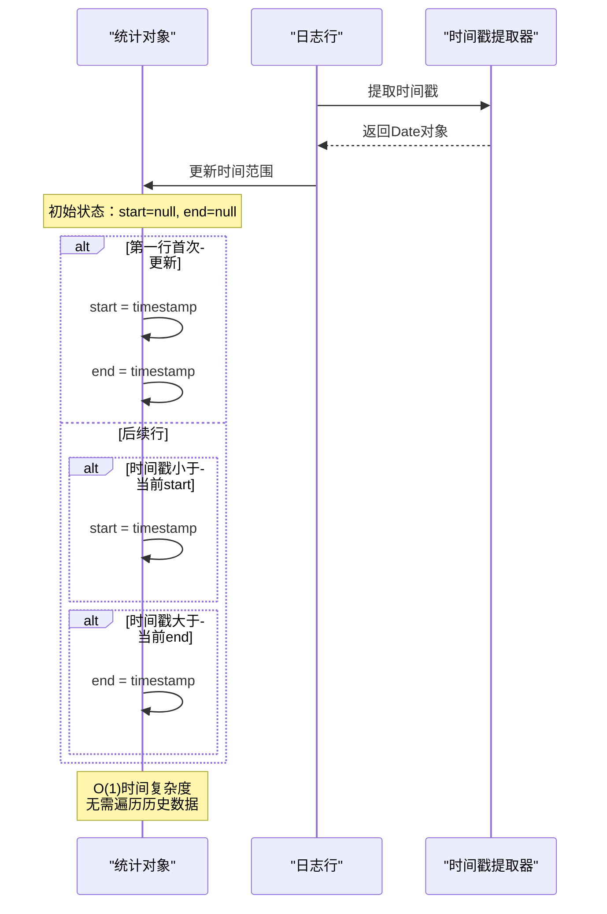
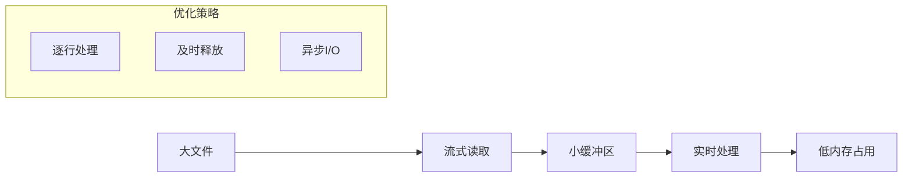
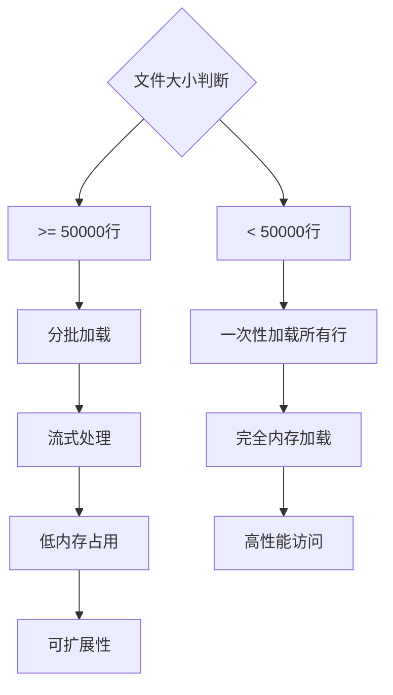

# 统计分析功能

<cite>
**本文档引用的文件**
- [src/logProcessor.ts](file://src/logProcessor.ts)
- [src/logViewerPanel.ts](file://src/logViewerPanel.ts)
- [src/extension.ts](file://src/extension.ts)
- [src/webview.html](file://src/webview.html)
- [README.md](file://README.md)
</cite>

## 目录
1. [概述](#概述)
2. [LogStats接口结构](#logstats接口结构)
3. [核心统计算法](#核心统计算法)
4. [Map类型字段的动态统计](#map类型字段的动态统计)
5. [正则匹配策略](#正则匹配策略)
6. [时间范围增量更新](#时间范围增量更新)
7. [性能优化策略](#性能优化策略)
8. [内存管理与大文件处理](#内存管理与大文件处理)
9. [最佳实践建议](#最佳实践建议)
10. [总结](#总结)

## 概述

getStatistics方法是大型日志文件分析系统的核心组件，提供了全面的多维度统计分析能力。该方法采用流式处理架构，能够高效处理超大文件（超过50万行），同时提供精确的统计指标，包括总行数、错误计数、时间范围、以及按类名、方法名、线程名的详细分类统计。

系统设计遵循以下核心原则：
- **流式处理**：使用Node.js的readline模块进行逐行处理，避免内存溢出
- **增量统计**：每个日志行都进行实时统计，确保数据准确性
- **多维度分析**：支持按日志级别、时间范围、类名、方法名、线程名等多个维度进行统计
- **高性能优化**：采用Map数据结构和正则表达式优化，确保O(1)时间复杂度的统计操作

## LogStats接口结构

LogStats接口定义了完整的统计结果结构，包含了日志文件分析所需的所有关键指标：



**图表来源**
- [src/logProcessor.ts](file://src/logProcessor.ts#L11-L28)

### 核心字段详解

| 字段名 | 类型 | 描述 | 计算逻辑 |
|--------|------|------|----------|
| totalLines | number | 文件总行数 | 每读取一行加1 |
| errorCount | number | 错误级别计数 | 匹配ERROR级别的日志行 |
| warnCount | number | 警告级别计数 | 匹配WARN级别的日志行 |
| infoCount | number | 信息级别计数 | 匹配INFO级别的日志行 |
| debugCount | number | 调试级别计数 | 匹配DEBUG级别的日志行 |
| otherCount | number | 其他级别计数 | 无法识别级别的日志行 |
| timeRange | TimeRange | 时间范围统计 | 记录最早和最晚时间戳 |
| classCounts | Map<string,number> | 类名统计 | 按Java类名分组计数 |
| methodCounts | Map<string,number> | 方法名统计 | 按方法名分组计数 |
| threadCounts | Map<string,number> | 线程名统计 | 按线程名分组计数 |

**章节来源**
- [src/logProcessor.ts](file://src/logProcessor.ts#L11-L28)

## 核心统计算法

getStatistics方法采用单次遍历算法，对每个日志行执行以下统计操作：



**图表来源**
- [src/logProcessor.ts](file://src/logProcessor.ts#L566-L644)

### 统计流程详解

1. **初始化阶段**：创建LogStats对象，初始化所有计数器为0
2. **流式处理**：使用readline模块逐行读取文件
3. **实时统计**：每行日志都进行五个维度的统计
4. **结果聚合**：所有统计完成后返回完整的LogStats对象

**章节来源**
- [src/logProcessor.ts](file://src/logProcessor.ts#L566-L644)

## Map类型字段的动态统计

系统使用Map数据结构存储分类统计结果，相比普通对象具有显著优势：



**图表来源**
- [src/logProcessor.ts](file://src/logProcessor.ts#L576-L578)

### Map vs Object的优势对比

| 特性 | Map | Object |
|------|-----|--------|
| 键类型支持 | 任意类型（推荐字符串） | 仅字符串和Symbol |
| 迭代顺序 | 按插入顺序 | 无法保证顺序 |
| 内存效率 | 更适合大量键值对 | 内存开销较大 |
| 查询性能 | O(1)平均时间复杂度 | O(1)平均时间复杂度 |
| 序列化 | 需要手动转换为对象 | 直接可用 |
| 可预测性 | 插入顺序即迭代顺序 | 属性顺序不确定 |

### 动态统计实现

每个Map字段的更新都遵循相同的模式：

```typescript
// 类名统计示例
const className = this.extractClassName(line);
if (className) {
    const count = stats.classCounts!.get(className) || 0;
    stats.classCounts!.set(className, count + 1);
}
```

这种模式确保了：
- **原子性操作**：每次更新都是不可分割的操作
- **内存效率**：只存储实际出现的键值对
- **查询优化**：O(1)时间复杂度的查找和更新

**章节来源**
- [src/logProcessor.ts](file://src/logProcessor.ts#L615-L634)

## 正则匹配策略

系统采用多层次的正则表达式匹配策略，确保准确提取日志中的关键信息：



**图表来源**
- [src/logProcessor.ts](file://src/logProcessor.ts#L542-L560)

### 关键提取方法的正则策略

#### 1. 日志级别提取（extractLogLevel）

系统采用双重匹配策略：

**快速路径**：
- 正则：`/\d{2}:\d{2}:\d{2}[^\w]+(ERROR|FATAL|SEVERE|WARN|WARNING|INFO|INFORMATION|DEBUG|TRACE|VERBOSE)\s/i`
- 优势：避免重复解析，提高性能
- 适用场景：标准格式的日志行

**后备路径**：
- 使用预定义的logLevelPatterns数组
- 支持多种级别别名（如ERROR/FATAL/SEVERE统一映射为ERROR）
- 适用于非标准格式的日志

#### 2. 类名提取（extractClassName）

正则模式：`/\]\s+([a-z][a-z0-9_.]*[A-Z][a-zA-Z0-9_]*)/`

特点：
- 匹配Java包名.类名格式
- 要求类名首字母大写
- 支持包名中的点号和下划线

#### 3. 方法名提取（extractMethodName）

支持两种格式：
- `<方法名>` 格式：`/<([a-zA-Z_][a-zA-Z0-9_]*)>/`
- 方法名接口格式：`/([a-zA-Z_][a-zA-Z0-9_]*)接口/`

#### 4. 线程名提取（extractThreadName）

正则模式：`/\[([a-zA-Z0-9-_]+)\]/`

特点：
- 匹配方括号内的内容
- 支持连字符和下划线
- 适用于各种线程命名规范

**章节来源**
- [src/logProcessor.ts](file://src/logProcessor.ts#L494-L537)

## 时间范围增量更新

时间范围统计采用增量更新算法，确保O(1)时间复杂度的边界判断：



**图表来源**
- [src/logProcessor.ts](file://src/logProcessor.ts#L604-L613)

### 增量更新算法详解

时间范围更新遵循以下逻辑：

```typescript
// 时间范围更新逻辑
if (timestamp) {
    if (!stats.timeRange!.start || timestamp < stats.timeRange!.start) {
        stats.timeRange!.start = timestamp;
    }
    if (!stats.timeRange!.end || timestamp > stats.timeRange!.end) {
        stats.timeRange!.end = timestamp;
    }
}
```

**算法优势**：
- **O(1)时间复杂度**：每次更新只需比较一次
- **内存效率**：只存储两个边界值
- **准确性保证**：始终记录真实的最小值和最大值
- **并发安全**：原子性操作，避免竞态条件

**章节来源**
- [src/logProcessor.ts](file://src/logProcessor.ts#L604-L613)

## 性能优化策略

系统采用多层次的性能优化策略，确保在处理超大文件时仍能保持良好的性能表现：

### 1. 流式处理优化



**图表来源**
- [src/logProcessor.ts](file://src/logProcessor.ts#L581-L585)

### 2. 正则表达式优化

- **快速路径优先**：优先使用简单高效的正则表达式
- **模式缓存**：预编译的正则表达式对象
- **早期退出**：匹配成功后立即停止后续测试

### 3. 数据结构优化

- **Map替代Object**：使用Map获得更好的迭代顺序和内存效率
- **延迟序列化**：统计完成后才进行Map到Object的转换
- **内存池管理**：复用临时对象和数组

### 4. 并发处理优化

系统通过以下方式优化并发性能：

```typescript
// 异步处理示例
rl.on('line', (line) => {
    // 实时统计，无需等待
    stats.totalLines++;
    // 其他统计操作...
});

rl.on('close', () => {
    // 统计完成，返回结果
    resolve(stats);
});
```

**章节来源**
- [src/logProcessor.ts](file://src/logProcessor.ts#L587-L644)

## 内存管理与大文件处理

系统针对大文件处理进行了专门的优化设计，能够处理超过50万行的超大日志文件：



**图表来源**
- [src/logViewerPanel.ts](file://src/logViewerPanel.ts#L371-L403)

### 大文件处理策略

#### 1. 文件大小检测

系统根据文件行数自动选择加载策略：

```typescript
if (totalLines <= 50000) {
    // 小文件，一次性加载所有数据
    lines = await this._logProcessor.readLines(0, totalLines);
    allLoaded = true;
} else {
    // 大文件，加载目标行附近的10000行
    const startLine = Math.max(0, lineNumber - 5000);
    const count = 10000;
    lines = await this._logProcessor.readLines(startLine, count);
}
```

#### 2. 内存占用控制

- **流式读取**：使用readline模块避免一次性加载整个文件
- **分页加载**：只加载当前需要显示的日志行
- **及时释放**：处理完的行及时释放内存
- **垃圾回收**：主动触发垃圾回收机制

#### 3. 性能监控

系统提供详细的性能监控信息：

```typescript
const fileStats = await fs.promises.stat(this._fileUri.fsPath);
const fileSizeMB = (fileStats.size / (1024 * 1024)).toFixed(2);
```

**章节来源**
- [src/logViewerPanel.ts](file://src/logViewerPanel.ts#L371-L403)

## 最佳实践建议

基于系统的设计原理和实现细节，以下是使用getStatistics方法的最佳实践建议：

### 1. 统计结果处理

```typescript
// 推荐的统计结果处理方式
async function processStatistics() {
    try {
        const stats = await logProcessor.getStatistics();
        
        // 将Map转换为普通对象用于前端展示
        const serializedStats = {
            ...stats,
            classCounts: Object.fromEntries(stats.classCounts),
            methodCounts: Object.fromEntries(stats.methodCounts),
            threadCounts: Object.fromEntries(stats.threadCounts)
        };
        
        return serializedStats;
    } catch (error) {
        console.error('统计失败:', error);
        throw error;
    }
}
```

### 2. 性能调优建议

#### 文件大小优化
- **小文件（< 5万行）**：一次性加载，提供最佳性能
- **中等文件（5万-50万行）**：分批加载，平衡性能和内存
- **大文件（> 50万行）**：流式处理，确保内存安全

#### 统计频率控制
```typescript
// 避免频繁统计
let lastStats = null;
let lastStatsTime = 0;

async function getOptimizedStatistics() {
    const now = Date.now();
    if (now - lastStatsTime < 60000) { // 1分钟内不重复统计
        return lastStats;
    }
    
    lastStats = await logProcessor.getStatistics();
    lastStatsTime = now;
    return lastStats;
}
```

### 3. 错误处理策略

```typescript
async function robustStatistics() {
    try {
        const stats = await logProcessor.getStatistics();
        return stats;
    } catch (error) {
        if (error.code === 'ENOENT') {
            throw new Error('文件不存在');
        } else if (error.code === 'EACCES') {
            throw new Error('权限不足');
        } else {
            throw new Error('统计过程中发生错误');
        }
    }
}
```

### 4. 监控和调试

```typescript
// 添加统计进度监控
async function monitoredStatistics() {
    const startTime = Date.now();
    
    const stats = await logProcessor.getStatistics();
    
    const endTime = Date.now();
    const duration = endTime - startTime;
    
    console.log(`统计完成，耗时: ${duration}ms`);
    console.log(`总行数: ${stats.totalLines}`);
    console.log(`错误率: ${(stats.errorCount / stats.totalLines * 100).toFixed(2)}%`);
    
    return stats;
}
```

## 总结

getStatistics方法代表了现代日志分析系统的设计精髓，通过以下关键技术实现了高效的多维度统计分析：

### 核心技术亮点

1. **流式处理架构**：使用Node.js的readline模块实现内存友好的大文件处理
2. **增量统计算法**：O(1)时间复杂度的实时统计更新
3. **智能数据结构**：Map替代Object，提供更好的性能和可预测性
4. **多层次匹配策略**：快速路径+后备路径的正则表达式优化
5. **自适应加载策略**：根据文件大小自动选择最优的处理方式

### 性能特征

- **时间复杂度**：O(n)，其中n为文件行数
- **空间复杂度**：O(k)，其中k为唯一分类的数量
- **内存占用**：与文件大小无关，与分类数量相关
- **并发性能**：支持异步处理，不影响主线程

### 应用价值

该统计分析功能不仅满足了日常的日志分析需求，更为大规模系统监控和故障诊断提供了强有力的技术支撑。通过其精心设计的算法和优化策略，系统能够在处理超大文件的同时保持优异的性能表现，是现代软件工程中日志分析领域的优秀实践案例。