# 创建或显示面板

<cite>
**本文档中引用的文件**
- [src/logViewerPanel.ts](file://src/logViewerPanel.ts)
- [src/extension.ts](file://src/extension.ts)
- [package.json](file://package.json)
- [README.md](file://README.md)
- [src/logProcessor.ts](file://src/logProcessor.ts)
</cite>

## 目录
1. [简介](#简介)
2. [方法概述](#方法概述)
3. [单例模式实现](#单例模式实现)
4. [参数详解](#参数详解)
5. [视图列决策机制](#视图列决策机制)
6. [面板显示逻辑](#面板显示逻辑)
7. [文件加载机制](#文件加载机制)
8. [调用场景分析](#调用场景分析)
9. [错误处理机制](#错误处理机制)
10. [性能考虑](#性能考虑)
11. [与其他组件的集成](#与其他组件的集成)
12. [最佳实践建议](#最佳实践建议)

## 简介

`LogViewerPanel.createOrShow` 方法是大日志文件查看器扩展的核心入口点，负责管理日志查看器面板的生命周期。该方法实现了严格的单例模式，确保同一时间只能存在一个日志查看器面板实例，同时提供了灵活的文件加载和视图列控制机制。

## 方法概述

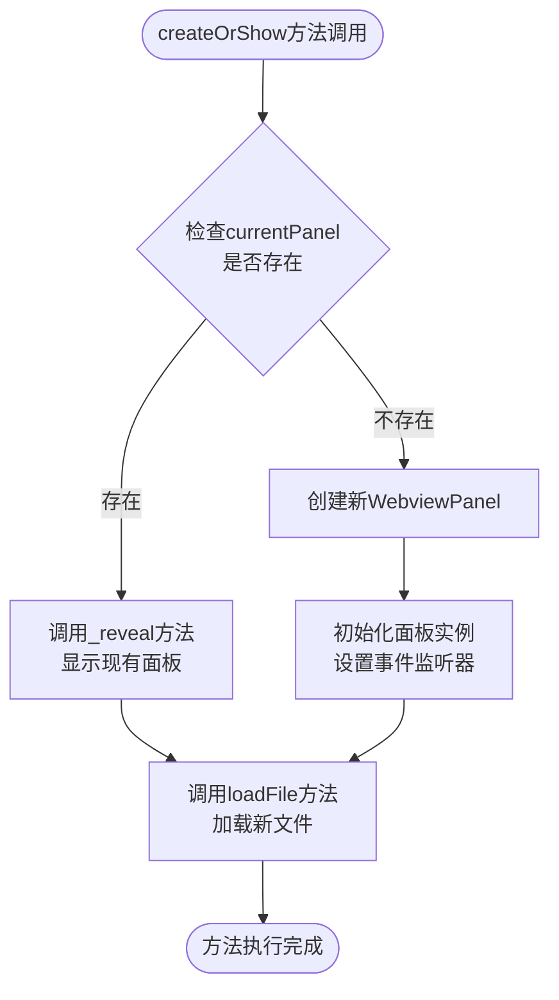

**图表来源**
- [src/logViewerPanel.ts](file://src/logViewerPanel.ts#L14-L38)

**节来源**
- [src/logViewerPanel.ts](file://src/logViewerPanel.ts#L14-L38)

## 单例模式实现

### 核心实现原理

`LogViewerPanel` 类通过静态属性 `currentPanel` 实现单例模式管理：

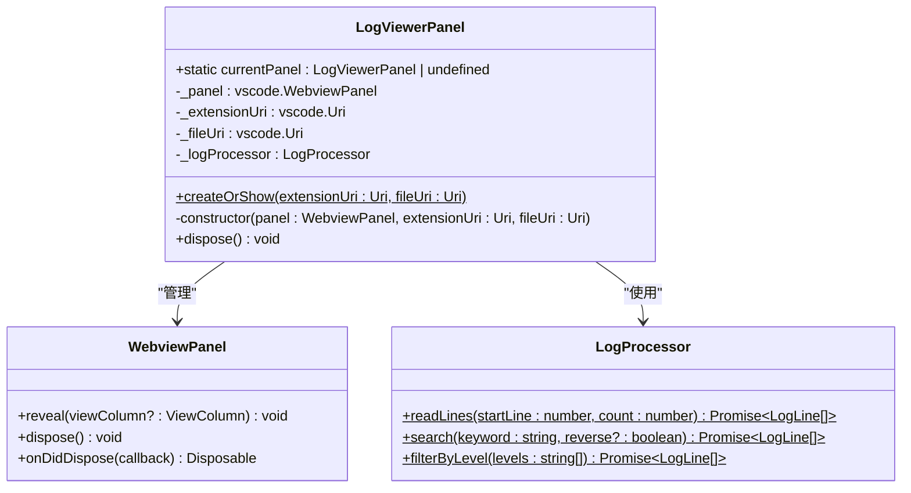

**图表来源**
- [src/logViewerPanel.ts](file://src/logViewerPanel.ts#L7-L12)
- [src/logViewerPanel.ts](file://src/logViewerPanel.ts#L41-L50)

### 单例状态管理

单例模式的关键特性：
- **唯一实例保证**：通过 `currentPanel` 静态属性确保全局唯一
- **自动清理机制**：面板关闭时自动设置 `currentPanel = undefined`
- **状态同步**：所有操作都基于当前活跃的面板实例

**节来源**
- [src/logViewerPanel.ts](file://src/logViewerPanel.ts#L7-L12)
- [src/logViewerPanel.ts](file://src/logViewerPanel.ts#L497-L508)

## 参数详解

### extensionUri 参数

| 属性 | 类型 | 描述 | 用途 |
|------|------|------|------|
| **类型** | `vscode.Uri` | 扩展的根目录URI | 用于定位本地资源文件 |
| **来源** | `context.extensionUri` | VSCode扩展上下文提供的URI | 确保资源路径的正确解析 |
| **作用** | 资源根目录 | 作为WebView的本地资源根目录 | 允许加载HTML、CSS、JS等静态文件 |
| **示例值** | `file:///c:/Users/User/.vscode/extensions/big-log-viewer-1.0.1/` | 本地文件系统路径 | 用于构建资源访问URL |

#### extensionUri 的关键作用

1. **资源定位**：确保WebView能够正确加载扩展内的静态资源
2. **安全性**：通过 `localResourceRoots` 限制资源访问范围
3. **跨平台兼容**：统一处理不同操作系统的文件路径格式

### fileUri 参数

| 属性 | 类型 | 描述 | 用途 |
|------|------|------|------|
| **类型** | `vscode.Uri` | 日志文件的URI | 指定要加载的日志文件路径 |
| **来源** | 用户选择或命令参数 | 通过文件对话框或命令调用传入 | 支持本地文件和远程文件（如果VSCode支持） |
| **作用** | 文件标识 | 唯一标识要处理的日志文件 | 用于LogProcessor实例化和文件操作 |
| **验证** | VSCode URI对象 | 自动进行路径验证和规范化 | 确保文件路径的有效性和安全性 |

#### fileUri 的处理流程

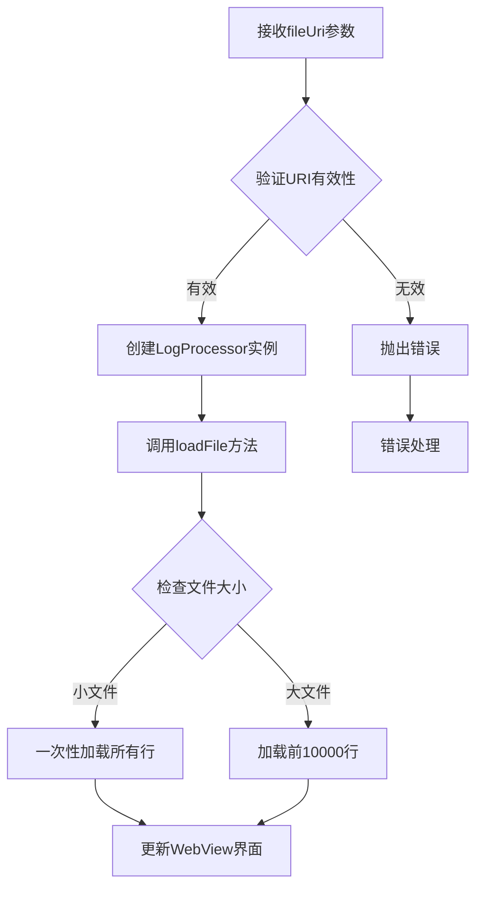

**图表来源**
- [src/logViewerPanel.ts](file://src/logViewerPanel.ts#L107-L147)
- [src/logViewerPanel.ts](file://src/logViewerPanel.ts#L149-L162)

**节来源**
- [src/logViewerPanel.ts](file://src/logViewerPanel.ts#L14-L38)

## 视图列决策机制

### 视图列选择逻辑

`createOrShow` 方法通过智能的视图列决策机制确保用户体验的一致性：

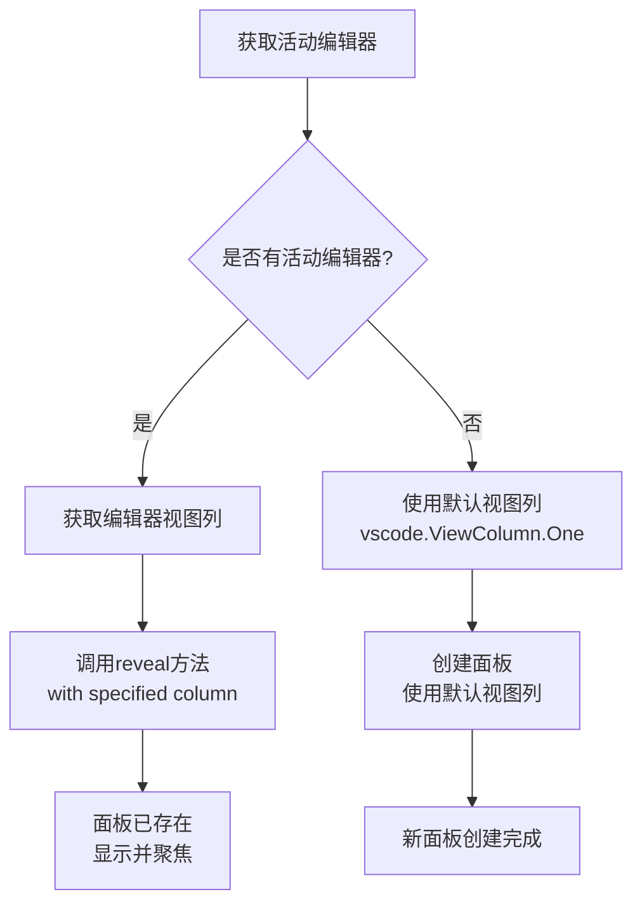

**图表来源**
- [src/logViewerPanel.ts](file://src/logViewerPanel.ts#L15-L16)
- [src/logViewerPanel.ts](file://src/logViewerPanel.ts#L29-L30)

### 视图列常量说明

| 视图列常量 | 数值 | 描述 | 使用场景 |
|------------|------|------|----------|
| `vscode.ViewColumn.One` | 1 | 主视图列（左侧） | 默认位置，新面板创建时使用 |
| `vscode.ViewColumn.Two` | 2 | 第二视图列（中间） | 当前编辑器在第一列时使用 |
| `vscode.ViewColumn.Three` | 3 | 第三视图列（右侧） | 当前编辑器在第二列时使用 |
| `undefined` | - | 自动选择 | 当没有活动编辑器时使用 |

### 决策算法实现

视图列决策遵循以下优先级：

1. **最高优先级**：当前活动编辑器的视图列
2. **次级优先级**：保持与当前编辑器相同的布局
3. **最低优先级**：默认使用第一视图列

**节来源**
- [src/logViewerPanel.ts](file://src/logViewerPanel.ts#L15-L16)
- [src/logViewerPanel.ts](file://src/logViewerPanel.ts#L29-L30)

## 面板显示逻辑

### 存在面板的处理流程

当 `currentPanel` 已存在时，方法执行以下步骤：

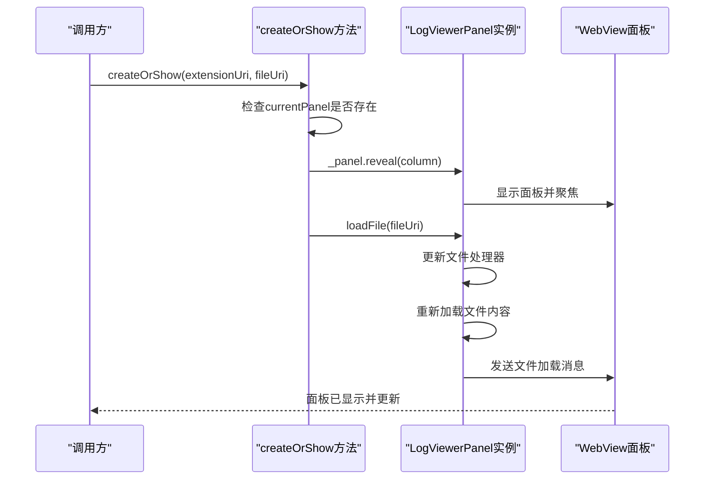

**图表来源**
- [src/logViewerPanel.ts](file://src/logViewerPanel.ts#L19-L23)

### 面板创建流程

当没有现有面板时，方法创建新的WebviewPanel：

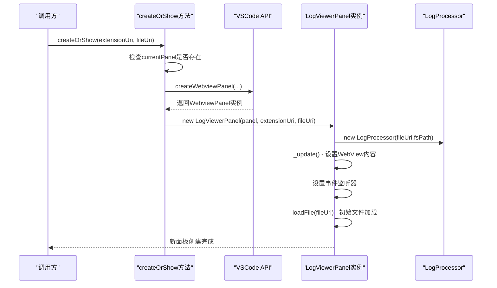

**图表来源**
- [src/logViewerPanel.ts](file://src/logViewerPanel.ts#L26-L38)

**节来源**
- [src/logViewerPanel.ts](file://src/logViewerPanel.ts#L19-L38)

## 文件加载机制

### loadFile 方法详解

`loadFile` 方法负责处理文件加载的复杂逻辑，包括文件大小检测、加载策略选择和错误处理：

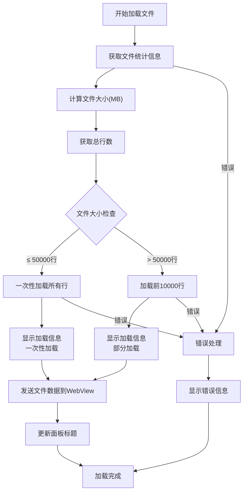

**图表来源**
- [src/logViewerPanel.ts](file://src/logViewerPanel.ts#L107-L147)

### 加载策略对比

| 文件大小 | 行数阈值 | 加载策略 | 内存占用 | 加载速度 | 用户体验 |
|----------|----------|----------|----------|----------|----------|
| **小文件** | ≤ 50,000 行 | 一次性加载 | 高（全部内容） | 快 | 完整预览 |
| **大文件** | > 50,000 行 | 分批加载 | 中（当前页+缓冲） | 中等 | 渐进式加载 |

### 错误处理层次

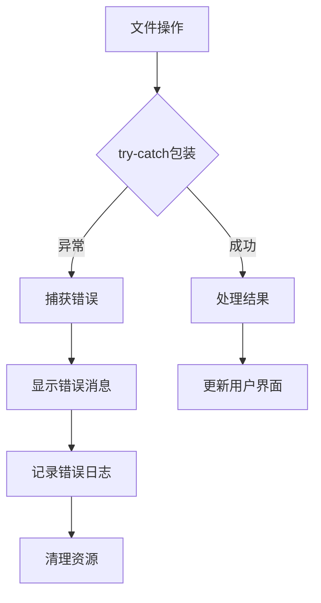

**图表来源**
- [src/logViewerPanel.ts](file://src/logViewerPanel.ts#L145-L147)

**节来源**
- [src/logViewerPanel.ts](file://src/logViewerPanel.ts#L107-L147)

## 调用场景分析

### 命令面板调用场景

从命令面板调用时的典型流程：

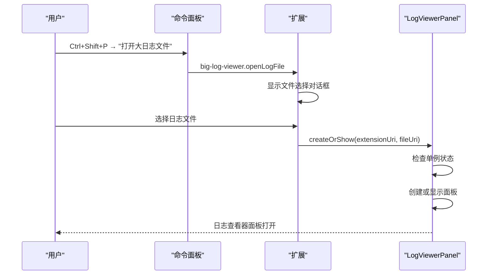

**图表来源**
- [src/extension.ts](file://src/extension.ts#L8-L30)

### 右键菜单调用场景

从文件资源管理器右键菜单调用：

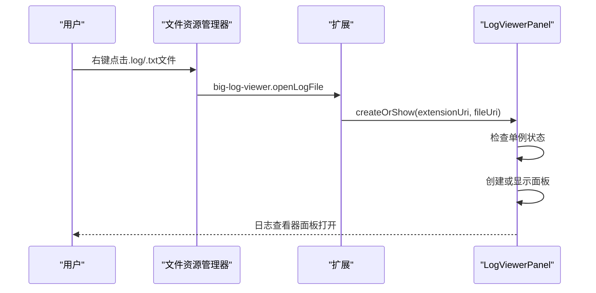

**图表来源**
- [package.json](file://package.json#L53-L65)

### 面板内文件切换场景

当面板已存在时切换文件：

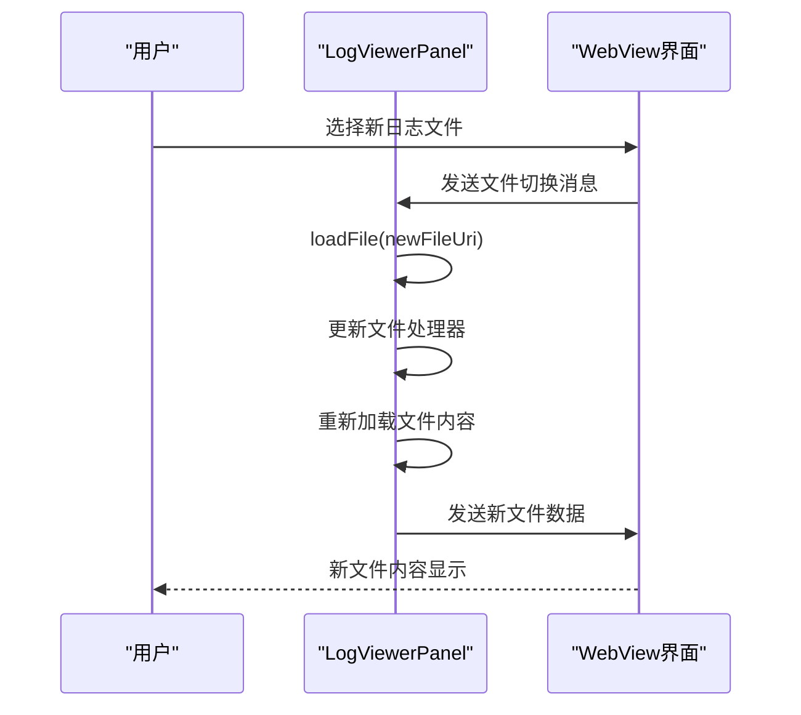

**图表来源**
- [src/logViewerPanel.ts](file://src/logViewerPanel.ts#L21-L22)

**节来源**
- [src/extension.ts](file://src/extension.ts#L8-L30)
- [package.json](file://package.json#L53-L65)

## 错误处理机制

### 多层次错误处理

`createOrShow` 方法实现了全面的错误处理机制：

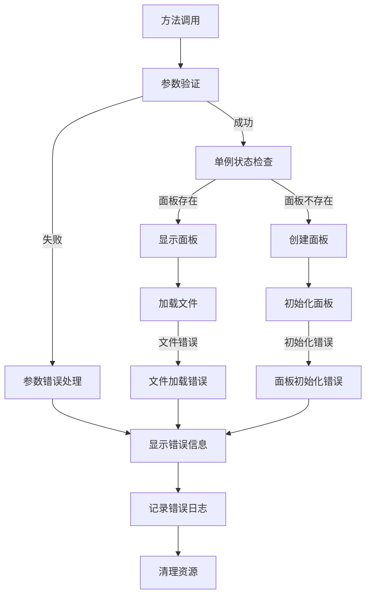

**图表来源**
- [src/logViewerPanel.ts](file://src/logViewerPanel.ts#L14-L38)

### 错误类型分类

| 错误类型 | 触发条件 | 处理方式 | 用户反馈 |
|----------|----------|----------|----------|
| **参数错误** | extensionUri 或 fileUri 无效 | 立即返回，不执行任何操作 | VSCode 内置验证 |
| **文件访问错误** | 文件不存在或权限不足 | 显示错误消息，停止加载 | `vscode.window.showErrorMessage()` |
| **面板创建失败** | VSCode API 调用失败 | 显示错误消息，清理状态 | `vscode.window.showErrorMessage()` |
| **内存不足** | 大文件加载时内存不足 | 降级到分批加载策略 | 自动调整加载策略 |

### 错误恢复机制

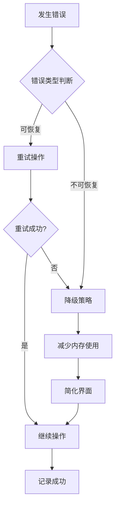

**节来源**
- [src/logViewerPanel.ts](file://src/logViewerPanel.ts#L145-L147)

## 性能考虑

### 避免重复创建的策略

`createOrShow` 方法通过单例模式和智能判断避免不必要的面板创建：

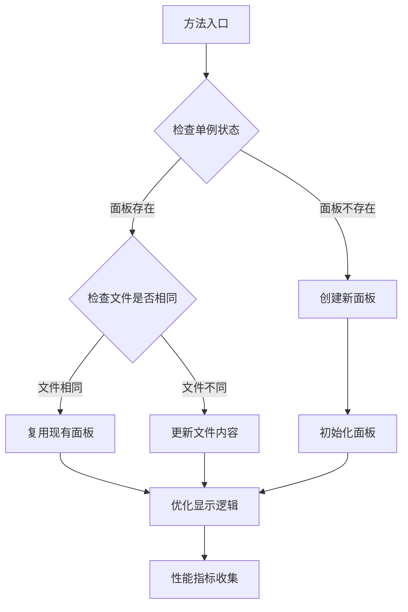

**图表来源**
- [src/logViewerPanel.ts](file://src/logViewerPanel.ts#L19-L23)

### 内存优化策略

| 优化策略 | 实现方式 | 效果 | 适用场景 |
|----------|----------|------|----------|
| **延迟初始化** | 面板创建时不立即加载文件 | 减少启动时间 | 大文件场景 |
| **分批加载** | 大文件只加载前10000行 | 控制内存使用 | >50000行文件 |
| **资源清理** | 面板关闭时清理所有资源 | 防止内存泄漏 | 所有场景 |
| **事件监听器管理** | 使用Disposable模式管理监听器 | 避免内存泄漏 | 所有场景 |

### 性能监控指标

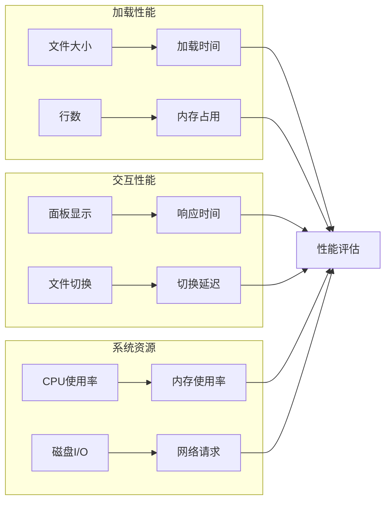

**节来源**
- [src/logViewerPanel.ts](file://src/logViewerPanel.ts#L107-L147)

## 与其他组件的集成

### 与 extension.ts 的集成

`createOrShow` 方法与扩展主入口紧密集成：

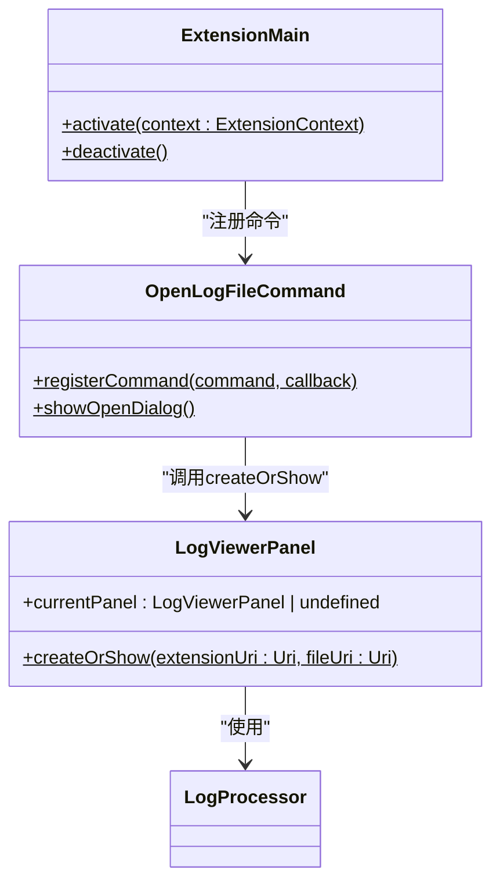

**图表来源**
- [src/extension.ts](file://src/extension.ts#L4-L32)
- [src/logViewerPanel.ts](file://src/logViewerPanel.ts#L14-L38)

### 与 LogProcessor 的协作

`createOrShow` 方法与 `LogProcessor` 协作处理文件操作：

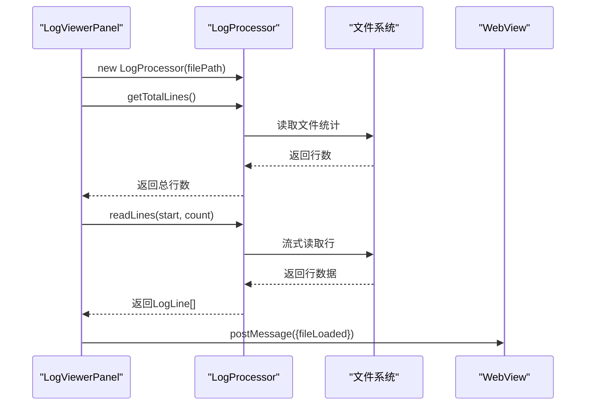

**图表来源**
- [src/logViewerPanel.ts](file://src/logViewerPanel.ts#L45-L46)
- [src/logViewerPanel.ts](file://src/logViewerPanel.ts#L107-L147)

### 与 VSCode API 的集成

方法充分利用VSCode扩展API的功能：

| VSCode API | 用途 | 实现细节 |
|------------|------|----------|
| `vscode.window.createWebviewPanel` | 创建Webview面板 | 支持脚本启用和资源根目录 |
| `vscode.window.activeTextEditor` | 获取活动编辑器 | 用于视图列决策 |
| `vscode.window.showOpenDialog` | 文件选择对话框 | 用户选择日志文件 |
| `vscode.window.showInformationMessage` | 信息提示 | 用户操作反馈 |
| `vscode.window.showErrorMessage` | 错误提示 | 错误处理反馈 |

**节来源**
- [src/extension.ts](file://src/extension.ts#L4-L32)
- [src/logViewerPanel.ts](file://src/logViewerPanel.ts#L14-L38)

## 最佳实践建议

### 调用时机建议

1. **延迟调用**：在确认文件路径有效后再调用
2. **错误预防**：在调用前验证文件URI的有效性
3. **用户体验**：提供适当的加载指示器

### 参数验证建议

```typescript
// 推荐的参数验证模式
function safeCreateOrShow(extensionUri: vscode.Uri, fileUri: vscode.Uri) {
    if (!extensionUri || !fileUri) {
        vscode.window.showErrorMessage('参数无效');
        return;
    }
    
    if (!fileUri.fsPath.endsWith('.log') && !fileUri.fsPath.endsWith('.txt')) {
        vscode.window.showErrorMessage('请选择日志文件(.log或.txt)');
        return;
    }
    
    LogViewerPanel.createOrShow(extensionUri, fileUri);
}
```

### 错误处理最佳实践

1. **渐进式错误处理**：从最外层开始，逐步细化
2. **用户友好的错误信息**：避免技术术语，提供解决建议
3. **日志记录**：记录详细的错误信息用于调试
4. **优雅降级**：在错误情况下提供替代方案

### 性能优化建议

1. **文件大小检测**：根据文件大小选择合适的加载策略
2. **内存监控**：监控内存使用情况，及时释放不需要的资源
3. **异步操作**：所有耗时操作都应使用异步模式
4. **缓存策略**：对频繁访问的数据实施缓存机制

### 单元测试建议

```typescript
describe('LogViewerPanel.createOrShow', () => {
    it('应该创建新面板', () => {
        const mockUri = vscode.Uri.file('/test/path.log');
        LogViewerPanel.createOrShow(mockExtensionUri, mockUri);
        
        expect(LogViewerPanel.currentPanel).toBeDefined();
        expect(LogViewerPanel.currentPanel?._fileUri).toEqual(mockUri);
    });
    
    it('应该复用现有面板', () => {
        const initialPanel = LogViewerPanel.currentPanel;
        const newUri = vscode.Uri.file('/new/path.log');
        
        LogViewerPanel.createOrShow(mockExtensionUri, newUri);
        
        expect(LogViewerPanel.currentPanel).toBe(initialPanel);
        expect(LogViewerPanel.currentPanel?._fileUri).toEqual(newUri);
    });
});
```

**节来源**
- [src/logViewerPanel.ts](file://src/logViewerPanel.ts#L14-L38)
- [src/extension.ts](file://src/extension.ts#L8-L30)