# 按时间删除操作功能文档

<cite>
**本文档引用的文件**
- [logViewerPanel.ts](file://src/logViewerPanel.ts)
- [logProcessor.ts](file://src/logProcessor.ts)
- [extension.ts](file://src/extension.ts)
- [webview.html](file://src/webview.html)
</cite>

## 目录
1. [概述](#概述)
2. [方法签名与参数](#方法签名与参数)
3. [用户交互流程](#用户交互流程)
4. [后端处理逻辑](#后端处理逻辑)
5. [三种操作选项详解](#三种操作选项详解)
6. [安全警告机制](#安全警告机制)
7. [错误处理策略](#错误处理策略)
8. [与LogProcessor的交互](#与logprocessor的交互)
9. [视图刷新机制](#视图刷新机制)
10. [技术架构分析](#技术架构分析)

## 概述

`deleteByTimeOptions`方法是LogViewerPanel类中的核心功能之一，专门用于处理基于时间条件的日志删除操作。该方法提供了三种不同的操作模式：仅隐藏、导出到新文件、修改原文件，每种模式都有其特定的使用场景和安全考虑。

该方法接收两个关键参数：
- `timeStr`：表示时间的字符串，支持多种时间格式
- `mode`：操作模式，值为'verbose'或'after'，分别表示"之前"或"之后"的时间范围

## 方法签名与参数

```typescript
public async deleteByTimeOptions(timeStr: string, mode: string)
```

### 参数说明

| 参数名 | 类型 | 描述 | 必需 |
|--------|------|------|------|
| timeStr | string | 时间字符串，支持格式：2024-01-01 12:00:00、2024-01-01等 | 是 |
| mode | string | 操作模式，'before'表示删除指定时间之前的日志，'after'表示删除指定时间之后的日志 | 是 |

### 支持的时间格式

方法内部通过`parseTimeString`函数支持以下时间格式：
- `YYYY-MM-DD HH:mm:ss`（标准ISO格式）
- `YYYY/MM/DD HH:mm:ss`（斜杠分隔格式）
- `DD-MM-YYYY HH:mm:ss`（欧洲格式）
- `YYYY-MM-DDTHH:mm:ss`（带T分隔符的ISO格式）

## 用户交互流程

### 第一阶段：操作选择对话框

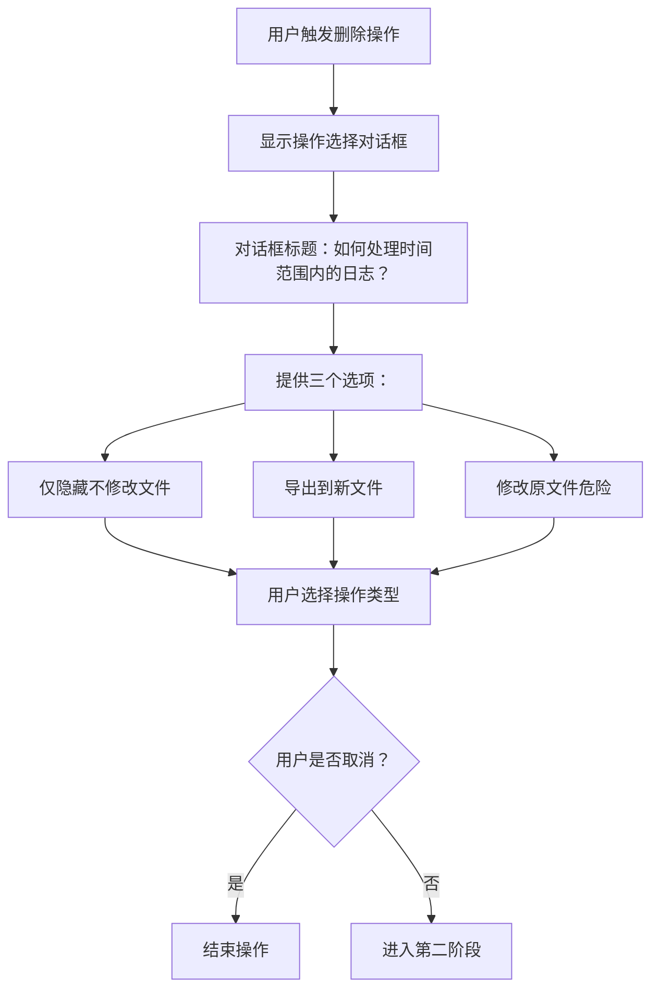

**图表来源**
- [logViewerPanel.ts](file://src/logViewerPanel.ts#L181-L188)

### 第二阶段：具体操作执行

根据用户选择的操作类型，系统会执行相应的处理流程：

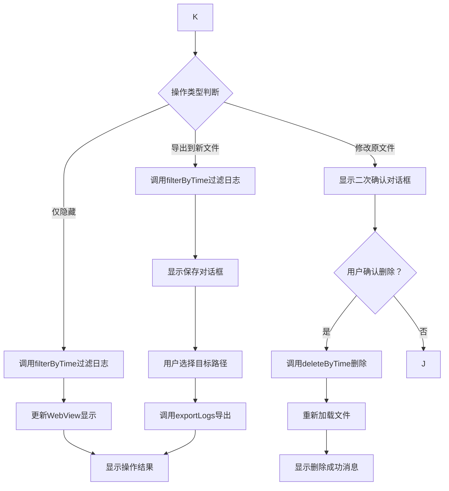

**图表来源**
- [logViewerPanel.ts](file://src/logViewerPanel.ts#L194-L224)

**节来源**
- [logViewerPanel.ts](file://src/logViewerPanel.ts#L180-L228)

## 后端处理逻辑

### 时间解析与验证

方法首先需要确保传入的时间字符串能够被正确解析：

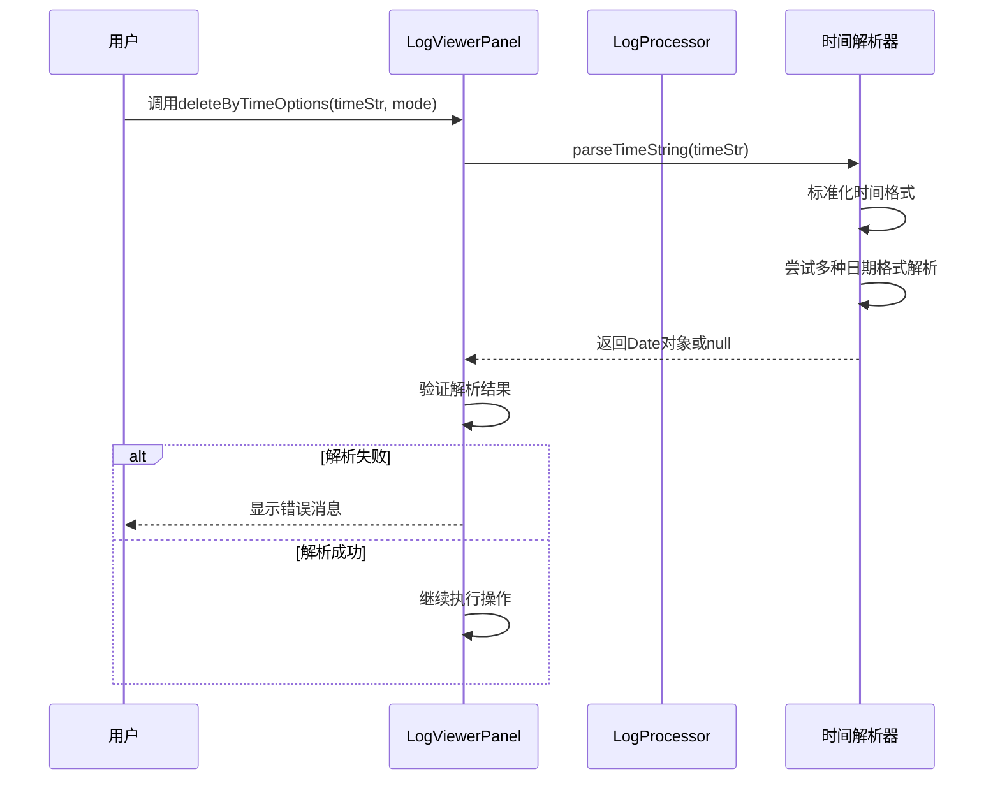

**图表来源**
- [logProcessor.ts](file://src/logProcessor.ts#L776-L804)

### 操作模式处理

系统根据`mode`参数的不同值执行不同的逻辑分支：

| 模式 | 处理逻辑 | 影响范围 |
|------|----------|----------|
| 'before' | 保留指定时间及之后的日志 | 删除时间之前的日志 |
| 'after' | 保留指定时间之前的日志 | 删除时间之后的日志 |

**节来源**
- [logViewerPanel.ts](file://src/logViewerPanel.ts#L180-L228)
- [logProcessor.ts](file://src/logProcessor.ts#L178-L230)

## 三种操作选项详解

### 1. 仅隐藏（不修改文件）

这是最安全的操作选项，不会对原始文件进行任何修改。

#### 处理流程

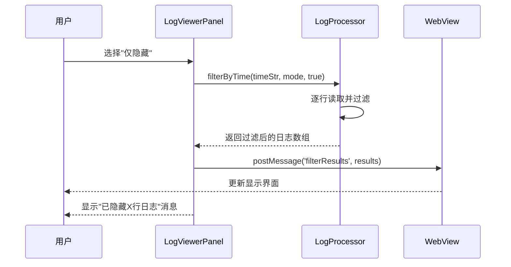

**图表来源**
- [logViewerPanel.ts](file://src/logViewerPanel.ts#L195-L205)
- [logProcessor.ts](file://src/logProcessor.ts#L178-L230)

#### 技术特点

- **非破坏性**：原始文件保持不变
- **实时响应**：通过WebSocket直接更新前端显示
- **内存友好**：只加载和处理当前可见的日志行

### 2. 导出到新文件

将过滤后的日志导出到用户指定的新文件中。

#### 处理流程

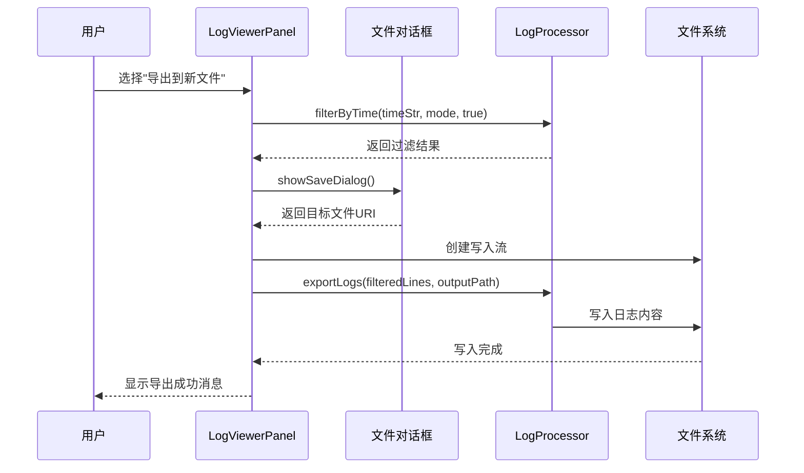

**图表来源**
- [logViewerPanel.ts](file://src/logViewerPanel.ts#L206-L220)
- [logProcessor.ts](file://src/logProcessor.ts#L751-L771)

#### 默认文件命名规则

导出文件默认命名为：`filtered_[原文件名]`，例如：
- 原文件：`application.log`
- 导出文件：`filtered_application.log`

### 3. 修改原文件（危险）

这是最具风险的操作，会直接修改原始日志文件。

#### 安全确认机制

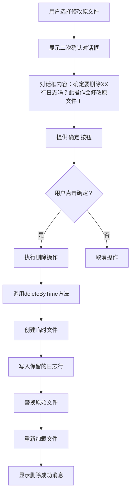

**图表来源**
- [logViewerPanel.ts](file://src/logViewerPanel.ts#L280-L298)

#### 技术实现细节

删除操作采用原子性写入机制：

1. **临时文件创建**：在原文件同目录下创建`.tmp`扩展名的临时文件
2. **增量写入**：只将需要保留的日志行写入临时文件
3. **原子替换**：成功写入后，先删除原文件，再将临时文件重命名为原文件名
4. **回滚机制**：如果过程中发生错误，临时文件会被清理

**节来源**
- [logViewerPanel.ts](file://src/logViewerPanel.ts#L280-L298)
- [logProcessor.ts](file://src/logProcessor.ts#L339-L408)

## 安全警告机制

### 多层安全防护

系统实现了多层安全防护机制，确保用户不会意外删除重要数据：

#### 1. 操作前确认

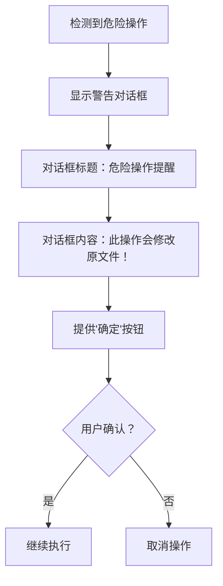

#### 2. 操作类型标识

不同操作类型的视觉提示：
- **仅隐藏**：绿色标签，表示安全操作
- **导出到新文件**：蓝色标签，表示备份操作  
- **修改原文件**：红色标签，明确标识危险操作

#### 3. 数据保护措施

- **临时文件备份**：删除操作使用临时文件机制
- **原子性操作**：确保文件替换的原子性
- **错误恢复**：操作失败时自动清理临时文件

**节来源**
- [logViewerPanel.ts](file://src/logViewerPanel.ts#L280-L298)

## 错误处理策略

### 异常分类与处理

系统对不同类型的错误采用差异化的处理策略：

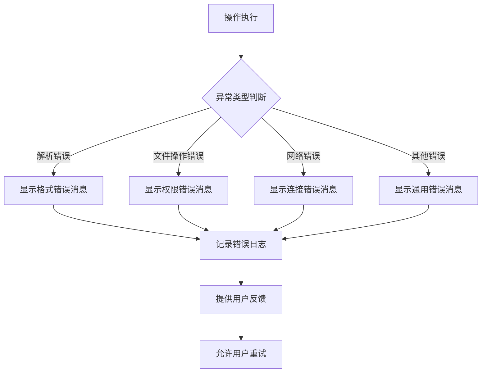

### 错误消息标准化

| 错误类型 | 消息格式 | 示例 |
|----------|----------|------|
| 时间格式错误 | "无法解析时间格式" | "无法解析时间格式" |
| 文件操作错误 | "操作失败: {错误详情}" | "操作失败: Permission denied" |
| 网络连接错误 | "连接超时，请检查网络" | "连接超时，请检查网络" |
| 通用错误 | "操作失败: {错误详情}" | "操作失败: Unexpected error" |

### 错误恢复机制

1. **临时文件清理**：删除操作失败时自动清理`.tmp`文件
2. **状态回滚**：修改原文件失败时保持原始文件不变
3. **用户引导**：提供具体的错误解决建议

**节来源**
- [logViewerPanel.ts](file://src/logViewerPanel.ts#L225-L227)

## 与LogProcessor的交互

### 方法调用关系

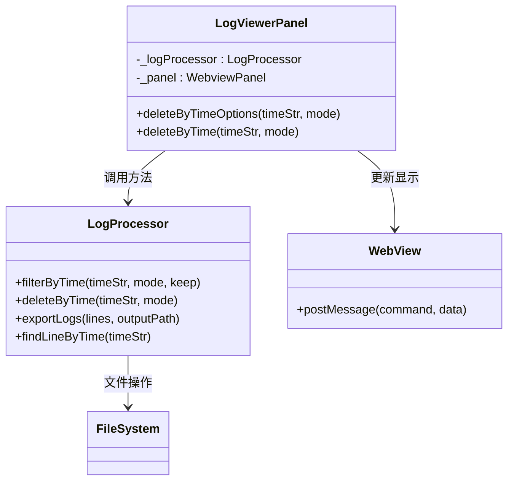

**图表来源**
- [logViewerPanel.ts](file://src/logViewerPanel.ts#L12-L13)
- [logProcessor.ts](file://src/logProcessor.ts#L31-L32)

### 关键交互步骤

#### 1. 日志过滤交互

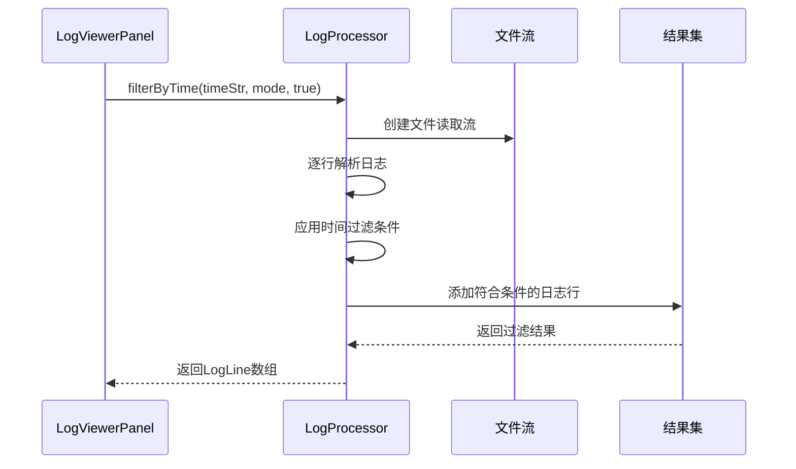

#### 2. 文件导出交互

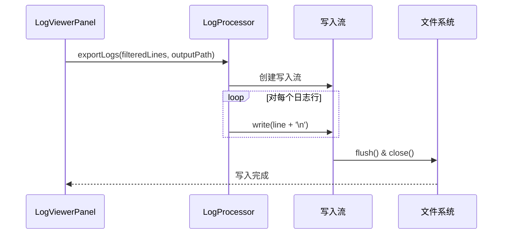

#### 3. 原始文件修改交互

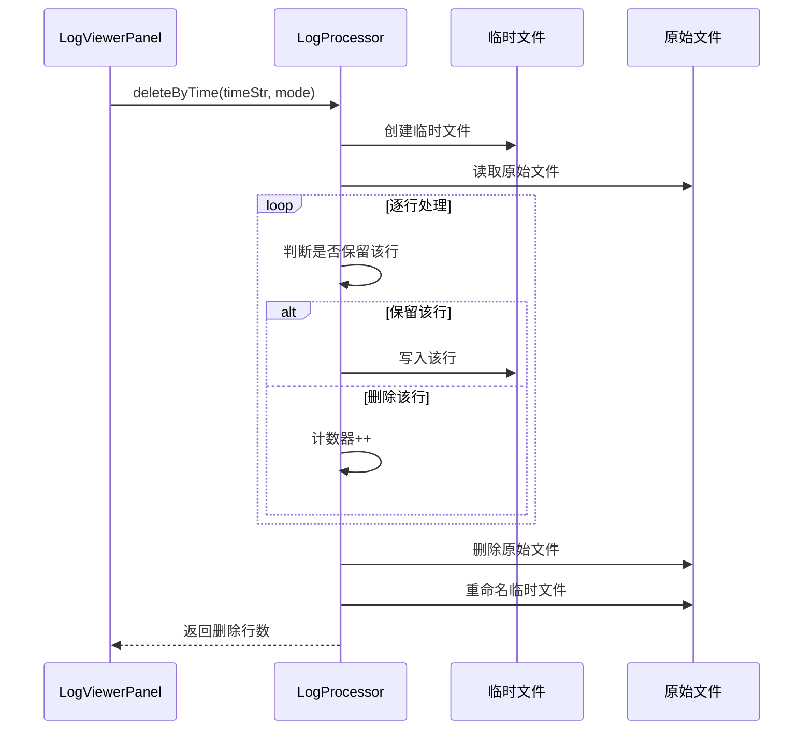

**节来源**
- [logViewerPanel.ts](file://src/logViewerPanel.ts#L195-L224)
- [logProcessor.ts](file://src/logProcessor.ts#L178-L408)

## 视图刷新机制

### WebSocket通信架构

系统使用WebSocket实现前后端实时通信：

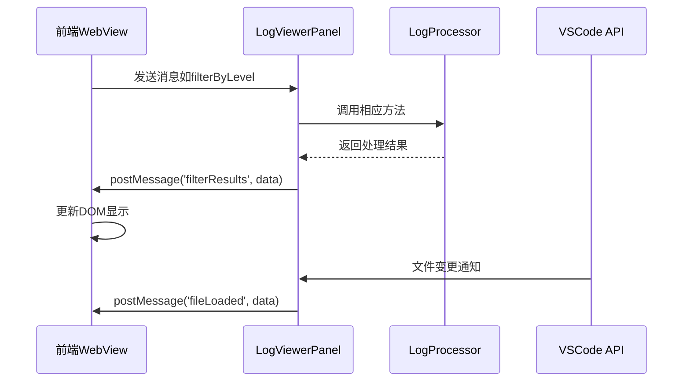

### 刷新时机控制

| 操作类型 | 刷新时机 | 触发条件 |
|----------|----------|----------|
| 仅隐藏 | 立即 | 过滤完成后 |
| 导出到新文件 | 立即 | 导出完成后 |
| 修改原文件 | 文件加载后 | 原文件替换完成后 |

### 显示更新策略

1. **增量更新**：只更新发生变化的部分
2. **状态同步**：保持过滤状态的一致性
3. **性能优化**：避免不必要的重新渲染

**节来源**
- [logViewerPanel.ts](file://src/logViewerPanel.ts#L198-L204)
- [logViewerPanel.ts](file://src/logViewerPanel.ts#L294-L295)

## 技术架构分析

### 整体架构设计

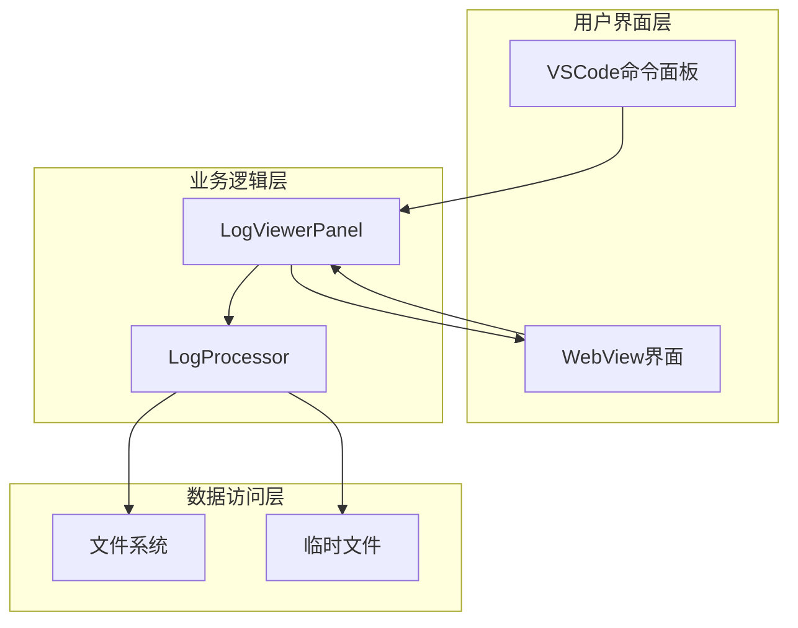

### 设计模式应用

#### 1. 命令模式
- `deleteByTimeOptions`作为命令执行器
- 支持撤销和重做机制

#### 2. 策略模式
- 不同操作模式采用不同处理策略
- 可扩展新的操作类型

#### 3. 观察者模式
- WebSocket监听文件变化
- 实时更新界面状态

#### 4. 原型模式
- 模板化的操作确认对话框
- 可配置的错误消息模板

### 性能优化策略

1. **流式处理**：大文件采用流式读取，避免内存溢出
2. **延迟加载**：只加载当前可见的日志行
3. **缓存机制**：缓存频繁访问的日志统计信息
4. **异步处理**：所有I/O操作采用异步模式

### 可扩展性设计

- **插件化架构**：支持添加新的日志处理算法
- **配置驱动**：通过配置文件定制时间格式和过滤规则
- **API标准化**：统一的方法调用接口

**节来源**
- [logViewerPanel.ts](file://src/logViewerPanel.ts#L1-L510)
- [logProcessor.ts](file://src/logProcessor.ts#L1-L807)