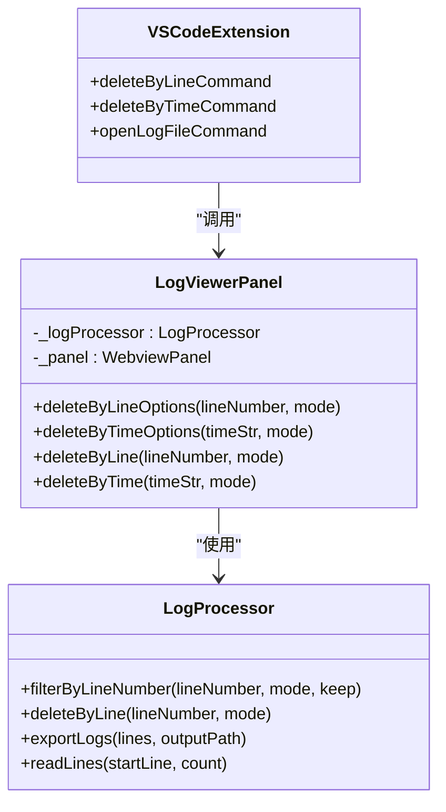
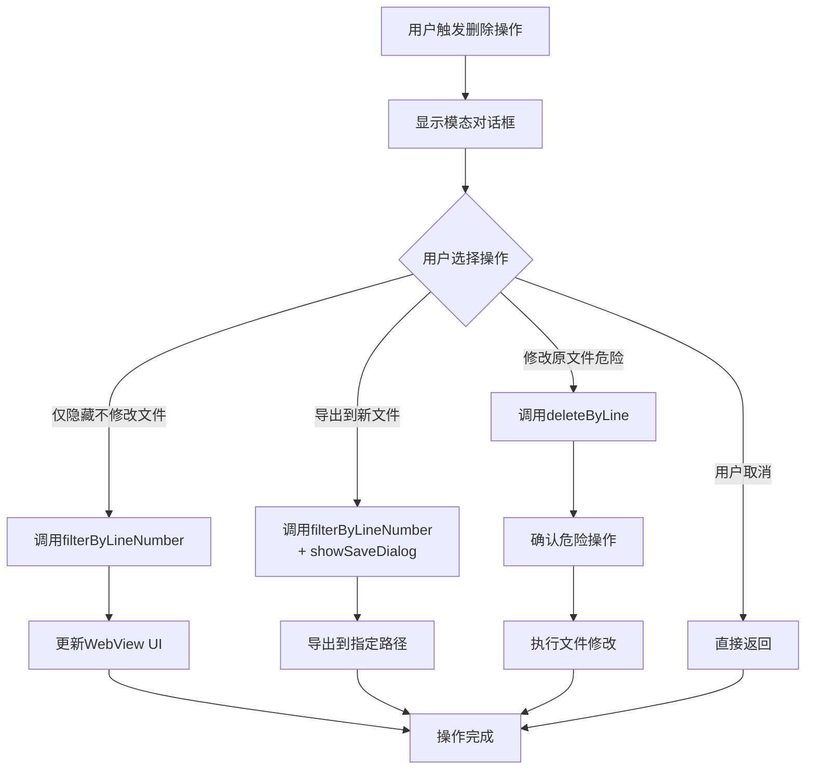
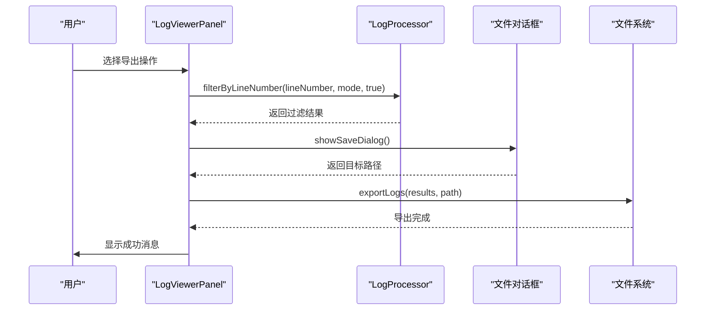
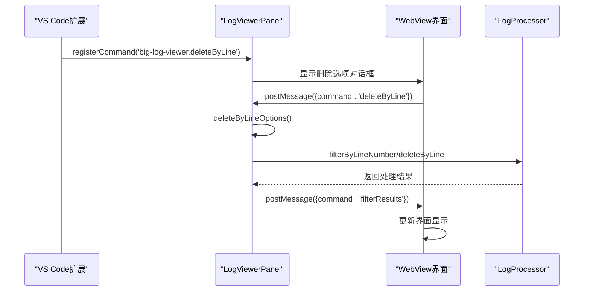
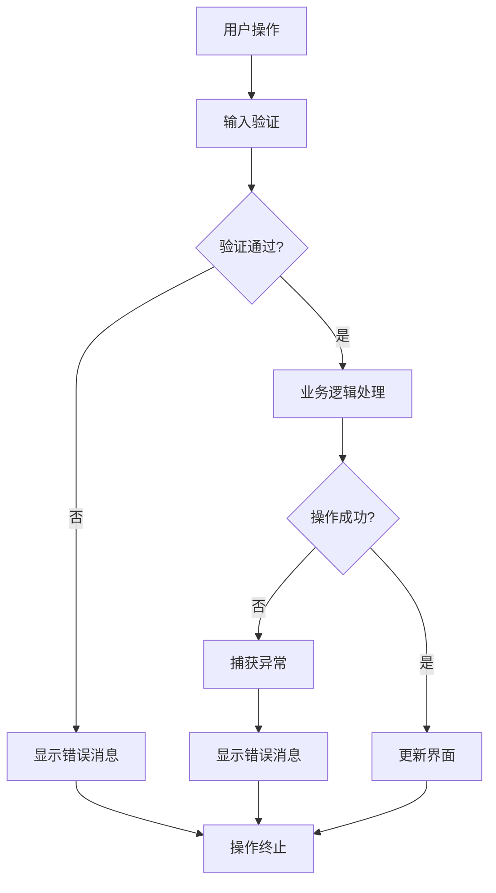

# 按行号删除操作技术说明

<cite>
**本文档引用的文件**
- [logViewerPanel.ts](file://src/logViewerPanel.ts)
- [logProcessor.ts](file://src/logProcessor.ts)
- [extension.ts](file://src/extension.ts)
- [webview.html](file://src/webview.html)
</cite>

## 目录
1. [概述](#概述)
2. [方法架构设计](#方法架构设计)
3. [核心实现分析](#核心实现分析)
4. [消息通信机制](#消息通信机制)
5. [性能优化策略](#性能优化策略)
6. [异常处理机制](#异常处理机制)
7. [与日志文件结构的关系](#与日志文件结构的关系)
8. [最佳实践建议](#最佳实践建议)

## 概述

`deleteByLineOptions`方法是VS Code扩展中用于按行号删除日志文件内容的核心功能。该方法与`deleteByTimeOptions`形成对称设计，提供了三种不同的操作模式：仅隐藏、导出到新文件和修改原文件。方法接收目标行号（lineNumber）和处理模式（mode: 'before'/'after'），并通过模态对话框引导用户选择具体的操作方式。

该功能的设计体现了现代日志处理工具的安全性和灵活性，确保用户在进行危险操作时有充分的确认和备份选项。

## 方法架构设计

### 对称设计原则

`deleteByLineOptions`方法与`deleteByTimeOptions`在架构上保持高度对称，这种设计遵循了以下原则：



**图表来源**
- [logViewerPanel.ts](file://src/logViewerPanel.ts#L230-L278)
- [logProcessor.ts](file://src/logProcessor.ts#L291-L474)

### 方法签名设计

```typescript
public async deleteByLineOptions(lineNumber: number, mode: string)
```

该方法采用异步设计，支持：
- **目标行号验证**：确保行号的有效性（大于0）
- **模式参数**：支持'before'和'after'两种处理模式
- **用户交互**：通过模态对话框提供三种操作选择

**章节来源**
- [logViewerPanel.ts](file://src/logViewerPanel.ts#L230-L278)

## 核心实现分析

### 用户交互层

方法首先通过VS Code的警告消息框向用户展示操作选项：



**图表来源**
- [logViewerPanel.ts](file://src/logViewerPanel.ts#L231-L278)

### 过滤显示实现

当用户选择"仅隐藏（不修改文件）"时，方法调用`filterByLineNumber`进行内存过滤：

```typescript
// 仅隐藏操作的具体实现
const results = await this._logProcessor.filterByLineNumber(lineNumber, mode, true);
this._panel.webview.postMessage({
    command: 'filterResults',
    data: {
        levels: [],
        results: results
    }
});
```

该实现的特点包括：
- **内存过滤**：不修改原始文件，仅在内存中过滤显示
- **实时反馈**：立即更新WebView界面
- **用户体验**：提供即时的视觉反馈

**章节来源**
- [logViewerPanel.ts](file://src/logViewerPanel.ts#L245-L256)

### 导出功能实现

选择"导出到新文件"时，系统执行以下流程：



**图表来源**
- [logViewerPanel.ts](file://src/logViewerPanel.ts#L257-L270)

### 危险操作确认

对于"修改原文件（危险）"选项，系统实现了双重确认机制：

```typescript
private async deleteByLine(lineNumber: number, mode: string) {
    const result = await vscode.window.showWarningMessage(
        `确定要删除第${lineNumber}行${mode === 'before' ? '之前' : '之后'}的日志吗？此操作会修改原文件！`,
        { modal: true },
        '确定'
    );
    
    if (result !== '确定') {
        return;
    }
    
    // 执行删除操作...
}
```

这种设计确保用户在进行不可逆操作前有充分的思考时间。

**章节来源**
- [logViewerPanel.ts](file://src/logViewerPanel.ts#L300-L318)

## 消息通信机制

### WebView与后端通信

系统通过VS Code的Webview API实现前后端通信：



**图表来源**
- [logViewerPanel.ts](file://src/logViewerPanel.ts#L54-L97)
- [extension.ts](file://src/extension.ts#L74-L110)

### 异步消息处理

后端通过`onDidReceiveMessage`监听来自WebView的消息：

```typescript
this._panel.webview.onDidReceiveMessage(
    async message => {
        switch (message.command) {
            case 'deleteByLine':
                await this.deleteByLineOptions(message.lineNumber, message.mode);
                break;
            // ... 其他命令处理
        }
    }
);
```

这种设计确保了系统的响应性和可扩展性。

**章节来源**
- [logViewerPanel.ts](file://src/logViewerPanel.ts#L54-L97)

## 性能优化策略

### 大文件场景处理

针对大文件场景，系统采用了多种优化策略：

#### 1. 分页加载机制

```typescript
// 文件大小判断和加载策略
let initialLines;
if (totalLines <= 50000) {
    // 小于5万行，一次性加载所有数据
    initialLines = await this._logProcessor.readLines(0, totalLines);
} else {
    // 大于5万行，先加载前10000行
    initialLines = await this._logProcessor.readLines(0, 10000);
}
```

#### 2. 流式处理

`filterByLineNumber`方法采用流式处理，避免内存溢出：

```typescript
async filterByLineNumber(lineNumber: number, mode: string, keep: boolean): Promise<LogLine[]> {
    return new Promise((resolve, reject) => {
        const results: LogLine[] = [];
        let currentLine = 0;
        
        const stream = fs.createReadStream(this.filePath);
        const rl = readline.createInterface({
            input: stream,
            crlfDelay: Infinity
        });
        
        // 流式读取和处理
        rl.on('line', (line) => {
            currentLine++;
            // 根据行号条件过滤
            if (shouldKeep) {
                results.push({ lineNumber: currentLine, content: line, ... });
            }
        });
    });
}
```

#### 3. 智能缓存策略

系统根据文件大小动态调整缓存策略，确保在不同规模文件上的性能表现。

**章节来源**
- [logViewerPanel.ts](file://src/logViewerPanel.ts#L119-L142)
- [logProcessor.ts](file://src/logProcessor.ts#L291-L334)

### 内存管理优化

#### 1. 及时释放资源

```typescript
rl.on('line', (line) => {
    // 处理完一行后立即处理
    if (shouldKeep) {
        results.push({ lineNumber: currentLine, content: line, ... });
    }
    
    // 如果已经读取了足够的行，关闭流
    if (currentLine >= endLine) {
        rl.close();
        stream.destroy();
    }
});
```

#### 2. 避免大数据结构累积

过滤操作只保留符合条件的行，避免累积大量中间数据。

**章节来源**
- [logProcessor.ts](file://src/logProcessor.ts#L302-L324)

## 异常处理机制

### 多层次异常处理

系统在多个层面实现了异常处理：



**图表来源**
- [logViewerPanel.ts](file://src/logViewerPanel.ts#L244-L277)

### 具体异常处理实现

#### 1. 输入验证异常

```typescript
validateInput: (value) => {
    if (!value) {
        return '行号不能为空';
    }
    const num = parseInt(value);
    if (isNaN(num) || num < 1) {
        return '请输入有效的行号（大于0的整数）';
    }
    return null;
}
```

#### 2. 文件操作异常

```typescript
try {
    const deletedLines = await this._logProcessor.deleteByLine(lineNumber, mode);
    vscode.window.showInformationMessage(`成功删除 ${deletedLines} 行日志`);
    await this.loadFile(this._fileUri);
} catch (error) {
    vscode.window.showErrorMessage(`删除失败: ${error}`);
}
```

#### 3. 网络和I/O异常

```typescript
rl.on('error', (error) => {
    writeStream.end();
    fs.unlink(tempFilePath, () => {});
    reject(error);
});
```

**章节来源**
- [extension.ts](file://src/extension.ts#L95-L104)
- [logViewerPanel.ts](file://src/logViewerPanel.ts#L275-L277)
- [logProcessor.ts](file://src/logProcessor.ts#L469-L473)

## 与日志文件结构的关系

### 行号定位准确性

`deleteByLineOptions`方法依赖于准确的行号定位机制：

#### 1. 行号提取机制

```typescript
rl.on('line', (line) => {
    currentLine++;
    // 行号从1开始计数
    if (shouldKeep) {
        results.push({
            lineNumber: currentLine,  // 当前行号
            content: line,
            timestamp: this.extractTimestamp(line),
            level: this.extractLogLevel(line)
        });
    }
});
```

#### 2. 日志格式兼容性

方法能够处理多种日志格式，包括：
- 标准的时间戳格式
- 不同的分隔符（空格、制表符等）
- 各种日志级别标识

#### 3. 边界情况处理

```typescript
// 处理边界情况
if (mode === 'before') {
    // keep=true: 保留指定行及之后的日志
    shouldKeep = keep ? (currentLine >= lineNumber) : (currentLine < lineNumber);
} else {
    // keep=true: 保留指定行之前的日志
    shouldKeep = keep ? (currentLine <= lineNumber) : (currentLine > lineNumber);
}
```

**章节来源**
- [logProcessor.ts](file://src/logProcessor.ts#L302-L312)

### 文件完整性保障

#### 1. 临时文件机制

对于修改原文件的操作，系统使用临时文件机制确保数据安全：

```typescript
const tempFilePath = `${this.filePath}.tmp`;
const writeStream = fs.createWriteStream(tempFilePath);
// 写入处理后的数据
writeStream.end();
writeStream.on('finish', () => {
    // 替换原文件
    fs.unlink(this.filePath, (err) => {
        if (err) {
            reject(err);
            return;
        }
        fs.rename(tempFilePath, this.filePath, (err) => {
            if (err) {
                reject(err);
                return;
            }
            this.totalLines = keptCount;
            resolve(deletedLines);
        });
    });
});
```

#### 2. 原子性操作保证

通过原子性的文件替换操作，确保在意外中断情况下不会损坏原始文件。

**章节来源**
- [logProcessor.ts](file://src/logProcessor.ts#L416-L466)

## 最佳实践建议

### 使用场景推荐

#### 1. 开发调试阶段
- **推荐操作**："仅隐藏（不修改文件）"
- **原因**：不影响原始日志，便于反复调试

#### 2. 生产环境清理
- **推荐操作**："导出到新文件"
- **原因**：保留原始日志的同时获得清理后的版本

#### 3. 快速清理
- **推荐操作**："修改原文件（危险）"
- **前提**：已有完整备份

### 性能优化建议

#### 1. 大文件处理
- 对于超过5万行的文件，建议使用"导出到新文件"而非"修改原文件"
- 避免在生产环境中直接修改大文件

#### 2. 频繁操作
- 如果需要频繁进行行号删除操作，建议先将文件分割成较小的块
- 使用"仅隐藏"功能进行预览，确认后再进行实际删除

### 安全注意事项

#### 1. 数据备份
- 在执行"修改原文件"操作前，务必确保有完整的文件备份
- 建议使用版本控制系统管理重要日志文件

#### 2. 权限检查
- 确保对目标日志文件具有读写权限
- 在网络文件系统中操作时注意并发访问问题

#### 3. 操作确认
- 始终使用双重确认机制进行危险操作
- 在团队协作环境中，建议进行操作前的沟通确认

### 错误恢复策略

#### 1. 操作失败处理
- 如果删除操作失败，系统会显示详细的错误信息
- 建议记录错误日志以便后续分析

#### 2. 文件损坏恢复
- 如果文件被意外修改导致损坏，可以尝试从备份恢复
- 使用文本编辑器的撤销功能（如果适用）

#### 3. 数据完整性验证
- 操作完成后，建议验证剩余日志的完整性
- 检查关键时间点的日志连续性

通过遵循这些最佳实践，用户可以安全、高效地使用`deleteByLineOptions`功能，同时最大限度地降低数据丢失的风险。