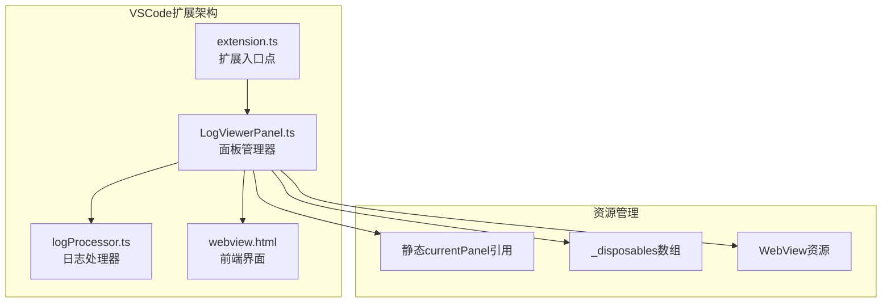
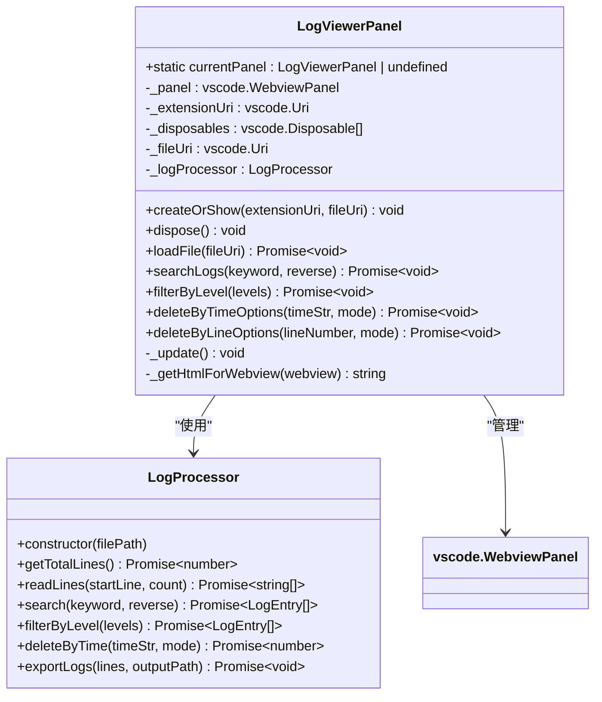
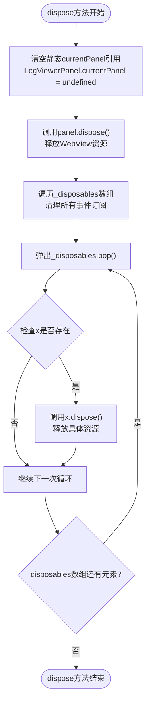
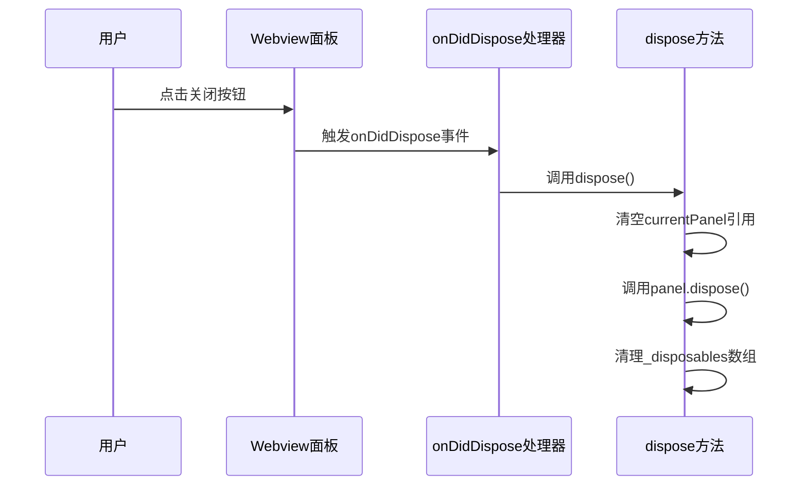

# LogViewerPanel.dispose方法详细技术文档

<cite>
**本文档中引用的文件**
- [logViewerPanel.ts](file://src/logViewerPanel.ts)
- [extension.ts](file://src/extension.ts)
- [package.json](file://package.json)
- [README.md](file://README.md)
</cite>

## 目录
1. [简介](#简介)
2. [项目架构概览](#项目架构概览)
3. [LogViewerPanel类结构分析](#logviewerpanel类结构分析)
4. [dispose方法核心实现](#dispose方法核心实现)
5. [资源清理机制详解](#资源清理机制详解)
6. [典型触发场景](#典型触发场景)
7. [_disposables数组中的资源类型](#disposables数组中的资源类型)
8. [内存泄漏防护机制](#内存泄漏防护机制)
9. [最佳实践与性能考虑](#最佳实践与性能考虑)
10. [总结](#总结)

## 简介

LogViewerPanel.dispose方法是VSCode扩展中负责资源清理的核心方法，专门用于释放LogViewerPanel实例占用的各种资源。该方法通过三个关键步骤确保完全的资源回收：清除静态currentPanel引用、调用panel.dispose()释放WebView资源、以及遍历_disposables数组清理所有事件订阅和资源监听器。

## 项目架构概览

该项目是一个专业的VSCode扩展，用于处理大型日志文件。其核心架构包含以下主要组件：



**图表来源**
- [logViewerPanel.ts](file://src/logViewerPanel.ts#L6-L10)
- [extension.ts](file://src/extension.ts#L1-L116)

**章节来源**
- [logViewerPanel.ts](file://src/logViewerPanel.ts#L1-L510)
- [extension.ts](file://src/extension.ts#L1-L116)

## LogViewerPanel类结构分析

LogViewerPanel类采用单例模式设计，通过静态currentPanel属性维护全局唯一实例：



**图表来源**
- [logViewerPanel.ts](file://src/logViewerPanel.ts#L6-L13)
- [logViewerPanel.ts](file://src/logViewerPanel.ts#L41-L105)

**章节来源**
- [logViewerPanel.ts](file://src/logViewerPanel.ts#L6-L13)
- [logViewerPanel.ts](file://src/logViewerPanel.ts#L41-L105)

## dispose方法核心实现

dispose方法位于LogViewerPanel类的末尾，采用简洁而有效的三步清理策略：



**图表来源**
- [logViewerPanel.ts](file://src/logViewerPanel.ts#L497-L507)

**章节来源**
- [logViewerPanel.ts](file://src/logViewerPanel.ts#L497-L507)

## 资源清理机制详解

### 第一步：清空静态currentPanel引用

```typescript
// 清除单例持有的引用
LogViewerPanel.currentPanel = undefined;
```

这一步至关重要，因为它：
- **打破单例持有**：防止其他代码意外访问已销毁的面板实例
- **内存释放**：允许垃圾回收器回收面板实例及其关联的所有资源
- **状态一致性**：确保系统状态反映面板已被正确销毁的事实

### 第二步：调用panel.dispose()

```typescript
// 释放WebView面板资源
this._panel.dispose();
```

这一步的作用包括：
- **WebView销毁**：关闭底层的Webview面板，释放相关UI资源
- **事件链断开**：自动断开与VSCode编辑器环境的连接
- **内存回收**：释放面板占用的内存空间

### 第三步：遍历_disposables数组清理所有事件订阅

```typescript
while (this._disposables.length) {
    const x = this._disposables.pop();
    if (x) {
        x.dispose();
    }
}
```

这种清理策略的优势：
- **批量处理**：一次性清理所有注册的资源
- **安全性检查**：确保只有有效对象才被清理
- **顺序执行**：按照注册顺序逆序释放资源

**章节来源**
- [logViewerPanel.ts](file://src/logViewerPanel.ts#L497-L507)

## 典型触发场景

dispose方法在以下场景中会被自动触发：

### 场景1：用户手动关闭面板

当用户点击面板右上角的关闭按钮时，VSCode会自动触发onDidDispose事件，从而调用dispose方法。



**图表来源**
- [logViewerPanel.ts](file://src/logViewerPanel.ts#L50-L51)

### 场景2：扩展卸载

当VSCode扩展被卸载或禁用时，VSCode会自动清理所有相关的面板资源，触发dispose方法。

### 场景3：程序化关闭

通过LogViewerPanel.createOrShow方法的逻辑，当面板已经存在时，会调用现有实例的dispose方法：

```typescript
// 如果已经有面板打开，则显示它并重新加载文件
if (LogViewerPanel.currentPanel) {
    LogViewerPanel.currentPanel._panel.reveal(column);
    LogViewerPanel.currentPanel.loadFile(fileUri);
    return;
}
```

**章节来源**
- [logViewerPanel.ts](file://src/logViewerPanel.ts#L19-L23)

## _disposables数组中的资源类型

_disposables数组包含了LogViewerPanel实例注册的所有可清理资源，主要包括以下类型：

### 1. 事件监听器

```typescript
// 面板关闭事件监听
this._panel.onDidDispose(() => this.dispose(), null, this._disposables);

// WebView消息接收监听
this._panel.webview.onDidReceiveMessage(
    async message => {
        // 消息处理逻辑
    },
    null,
    this._disposables
);
```

这些监听器包括：
- **面板生命周期事件**：onDidDispose、onDidChangeViewState
- **用户交互事件**：onDidChangeSelection、onDidChangeVisibleRanges
- **WebView通信事件**：onDidReceiveMessage

### 2. 定时器和异步操作

```typescript
// 可能注册的定时器资源
const timer = setInterval(() => {
    // 定期任务
}, 1000);
this._disposables.push(vscode.Disposable.from(timer));
```

### 3. 文件系统监听器

```typescript
// 文件变化监听
const watcher = vscode.workspace.createFileSystemWatcher(filePattern);
this._disposables.push(watcher);
```

### 4. 自定义资源

```typescript
// 自定义Disposable资源
const customResource = {
    dispose: () => {
        // 自定义清理逻辑
    }
};
this._disposables.push(customResource);
```

**章节来源**
- [logViewerPanel.ts](file://src/logViewerPanel.ts#L50-L101)

## 内存泄漏防护机制

dispose方法实现了多层次的内存泄漏防护：

### 防护层次1：引用断开

```typescript
// 第一层防护：断开所有引用
LogViewerPanel.currentPanel = undefined;
```

这防止了：
- **循环引用**：避免面板实例与其子组件之间的循环引用
- **意外访问**：防止后续代码意外访问已销毁的对象

### 防护层次2：资源释放

```typescript
// 第二层防护：释放核心资源
this._panel.dispose();
```

这确保了：
- **UI资源**：释放面板占用的图形界面资源
- **系统资源**：关闭底层的WebView进程
- **内存占用**：立即释放面板相关的内存

### 防护层次3：事件清理

```typescript
// 第三层防护：清理所有事件订阅
while (this._disposables.length) {
    const x = this._disposables.pop();
    if (x) {
        x.dispose();
    }
}
```

这提供了：
- **事件泄漏防护**：防止事件处理器持续运行
- **回调函数清理**：移除所有待处理的回调函数
- **订阅关系断开**：确保不再接收任何后续事件

**章节来源**
- [logViewerPanel.ts](file://src/logViewerPanel.ts#L497-L507)

## 最佳实践与性能考虑

### 1. 及时调用dispose

```typescript
// 推荐：在适当时机主动调用
if (LogViewerPanel.currentPanel) {
    LogViewerPanel.currentPanel.dispose();
}

// 避免：等待垃圾回收自动处理
// （虽然最终会被回收，但延迟可能导致资源占用）
```

### 2. 正确处理异步操作

```typescript
// 确保异步操作完成后再调用dispose
async function safeDispose(panel: LogViewerPanel) {
    // 等待正在进行的操作完成
    await panel.waitForPendingOperations();
    panel.dispose();
}
```

### 3. 资源优先级管理

```typescript
// 重要资源优先清理
this._disposables.unshift(primaryResource); // 重要资源放在前面
this._disposables.push(secondaryResource);  // 次要资源放在后面
```

### 4. 错误处理

```typescript
public dispose() {
    try {
        // 主要清理逻辑
        this.cleanupPrimaryResources();
    } catch (error) {
        console.error('Primary cleanup failed:', error);
    }
    
    try {
        // 备用清理逻辑
        this.fallbackCleanup();
    } catch (error) {
        console.error('Fallback cleanup failed:', error);
    }
}
```

### 5. 性能监控

```typescript
public dispose() {
    const startTime = performance.now();
    
    // 执行清理
    super.dispose();
    
    const endTime = performance.now();
    console.log(`Dispose completed in ${endTime - startTime}ms`);
}
```

**章节来源**
- [logViewerPanel.ts](file://src/logViewerPanel.ts#L497-L507)

## 总结

LogViewerPanel.dispose方法是VSCode扩展资源管理的关键组件，通过三个精心设计的步骤实现了全面的资源清理：

1. **静态引用清理**：确保单例模式的正确性，防止内存泄漏
2. **核心资源释放**：彻底释放WebView面板及其相关资源
3. **事件订阅清理**：清理所有事件监听器和异步操作

这种设计不仅保证了资源的及时回收，还为扩展的稳定性和性能提供了坚实保障。正确实现dispose方法对于构建高质量的VSCode扩展至关重要，它直接影响着用户体验和系统资源的合理利用。

通过遵循本文档中的最佳实践和设计原则，开发者可以确保他们的扩展在各种使用场景下都能表现出色，同时避免常见的内存泄漏和性能问题。