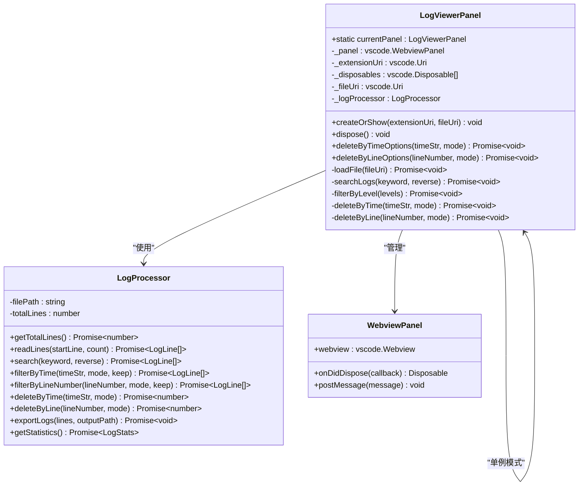
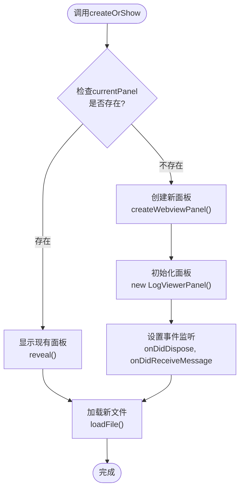
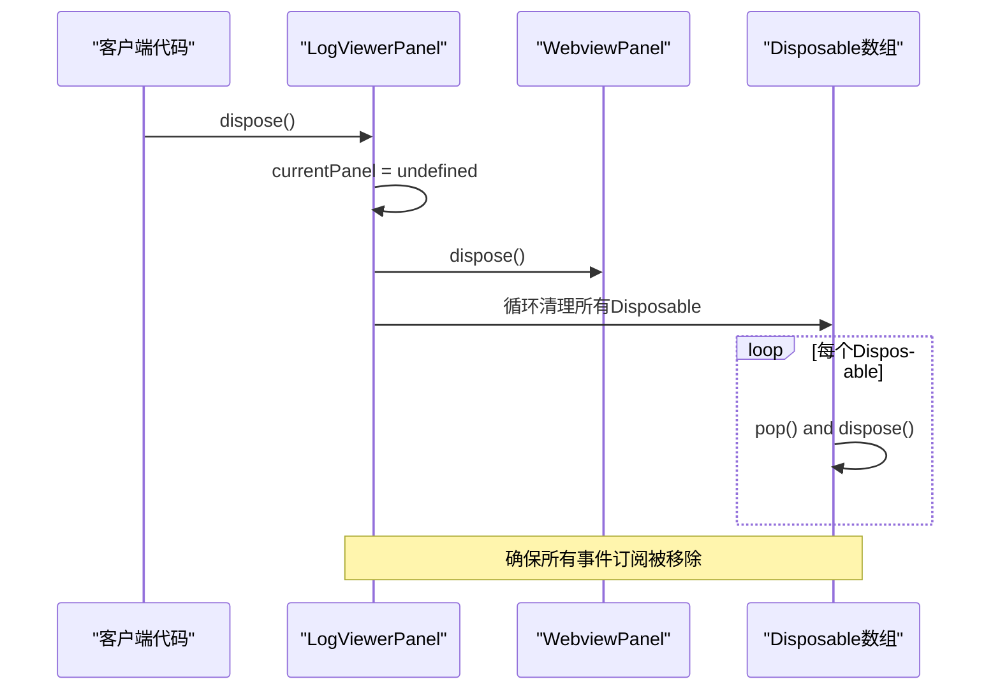
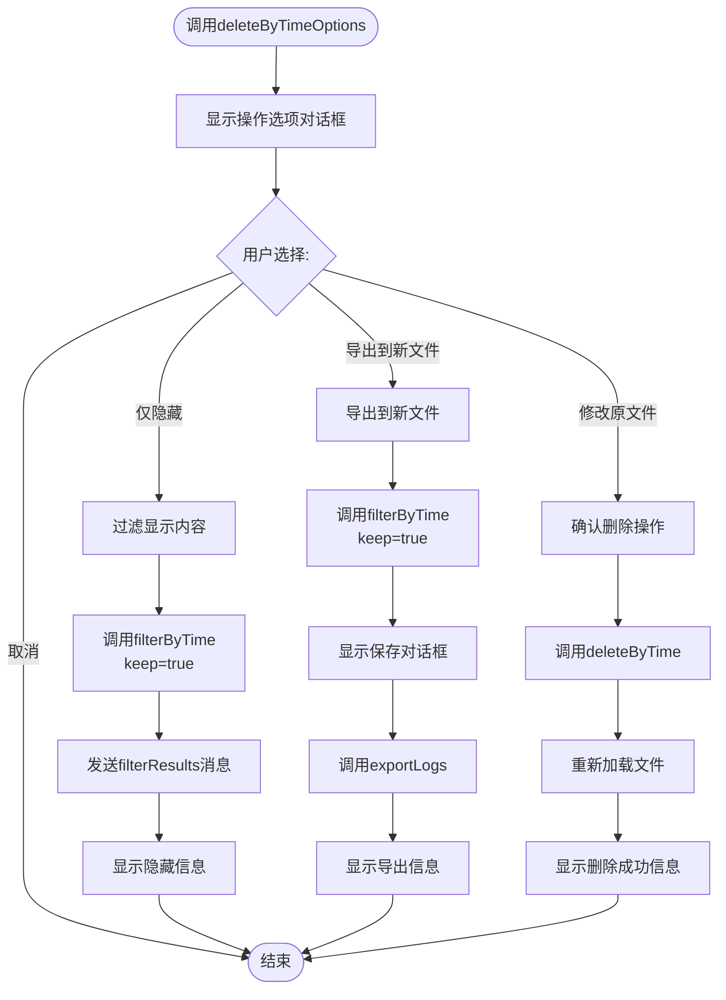
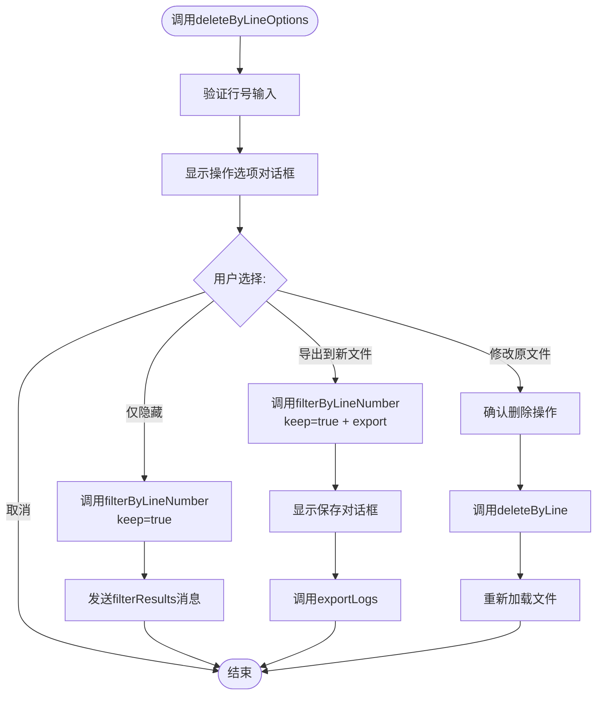
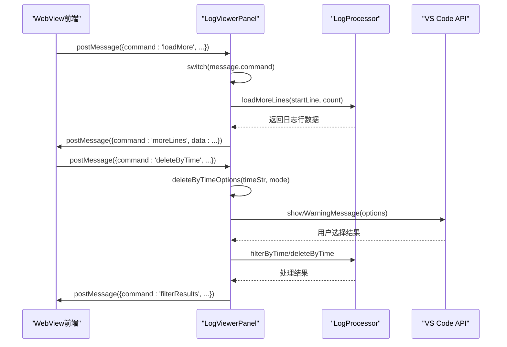
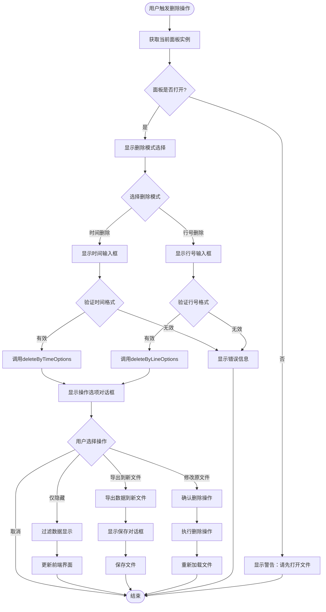

# LogViewerPanel类公共方法API文档

<cite>
**本文档引用的文件**
- [logViewerPanel.ts](file://src/logViewerPanel.ts)
- [logProcessor.ts](file://src/logProcessor.ts)
- [extension.ts](file://src/extension.ts)
- [webview.html](file://src/webview.html)
</cite>

## 目录
1. [简介](#简介)
2. [类架构概览](#类架构概览)
3. [核心方法详解](#核心方法详解)
4. [消息通信机制](#消息通信机制)
5. [用户交互流程](#用户交互流程)
6. [性能考虑](#性能考虑)
7. [故障排除指南](#故障排除指南)
8. [总结](#总结)

## 简介

LogViewerPanel类是VS Code扩展中的核心组件，负责管理日志文件的可视化展示和交互功能。该类采用单例模式设计，提供完整的日志查看、搜索、过滤和删除功能。本文档重点分析其公共方法API，特别是createOrShow、dispose、deleteByTimeOptions和deleteByLineOptions等核心方法。

## 类架构概览

LogViewerPanel类采用了现代VS Code扩展开发的最佳实践，集成了WebView技术来提供丰富的用户界面。



**图表来源**
- [logViewerPanel.ts](file://src/logViewerPanel.ts#L6-L13)
- [logProcessor.ts](file://src/logProcessor.ts#L30-L35)

**章节来源**
- [logViewerPanel.ts](file://src/logViewerPanel.ts#L1-L510)

## 核心方法详解

### createOrShow方法

createOrShow方法实现了LogViewerPanel的单例模式管理，确保同一时间只有一个面板实例存在。

#### 方法签名
```typescript
public static createOrShow(extensionUri: vscode.Uri, fileUri: vscode.Uri)
```

#### 单例模式实现机制



**图表来源**
- [logViewerPanel.ts](file://src/logViewerPanel.ts#L14-L39)

#### 窗口列定位逻辑

方法根据当前活动编辑器的位置智能定位新面板：

- **获取当前编辑器列位置**：通过`vscode.window.activeTextEditor.viewColumn`获取
- **默认行为**：如果无活动编辑器，则使用`vscode.ViewColumn.One`
- **显示逻辑**：使用`panel.reveal(column)`确保面板出现在正确的列中

#### 实现细节

1. **面板状态检查**：通过静态属性`currentPanel`跟踪当前实例
2. **文件切换处理**：如果面板已存在，直接更新显示的文件
3. **新面板创建**：配置WebView选项，启用脚本执行和上下文保持
4. **事件绑定**：设置面板关闭和消息接收的事件处理器

**章节来源**
- [logViewerPanel.ts](file://src/logViewerPanel.ts#L14-L39)

### dispose方法

dispose方法负责清理LogViewerPanel实例的所有资源，确保内存泄漏的避免。

#### 清理流程



**图表来源**
- [logViewerPanel.ts](file://src/logViewerPanel.ts#L497-L507)

#### 资源清理策略

1. **静态实例清除**：将`currentPanel`设为undefined，允许垃圾回收
2. **WebView资源释放**：调用`panel.dispose()`释放底层WebView资源
3. **事件订阅清理**：遍历`_disposables`数组，逐一释放所有事件监听器
4. **内存安全保证**：确保没有残留的回调函数或定时器

**章节来源**
- [logViewerPanel.ts](file://src/logViewerPanel.ts#L497-L507)

### deleteByTimeOptions方法

deleteByTimeOptions方法提供了基于时间的高级日志删除功能，包含三种操作模式的选择。

#### 用户交互流程



**图表来源**
- [logViewerPanel.ts](file://src/logViewerPanel.ts#L180-L228)

#### 操作模式详解

| 模式 | 描述 | 实现方式 | 影响范围 |
|------|------|----------|----------|
| 仅隐藏 | 不修改文件，仅过滤显示 | `filterByTime(timeStr, mode, true)` | 临时显示效果 |
| 导出到新文件 | 创建新的日志文件 | `filterByTime + showSaveDialog + exportLogs` | 新文件生成 |
| 修改原文件 | 直接删除原文件内容 | `deleteByTime` + 用户确认 | 文件永久修改 |

#### 数据处理流程

1. **用户选择阶段**：通过`vscode.window.showWarningMessage`提供三个操作选项
2. **条件分支处理**：根据用户选择执行不同的业务逻辑
3. **LogProcessor调用**：统一通过LogProcessor进行数据处理
4. **前端通知**：通过WebView消息系统更新用户界面

**章节来源**
- [logViewerPanel.ts](file://src/logViewerPanel.ts#L180-L228)

### deleteByLineOptions方法

deleteByLineOptions方法实现了基于行号的日志删除功能，与deleteByTimeOptions具有相同的三重操作模式。

#### 功能对比

虽然两个方法的功能相似，但在实现细节上存在差异：

- **参数类型**：deleteByTimeOptions接受时间字符串，deleteByLineOptions接受行号
- **验证逻辑**：行号需要验证为正整数
- **内部处理**：分别调用对应的LogProcessor方法

#### 实现机制



**图表来源**
- [logViewerPanel.ts](file://src/logViewerPanel.ts#L230-L278)

**章节来源**
- [logViewerPanel.ts](file://src/logViewerPanel.ts#L230-L278)

## 消息通信机制

LogViewerPanel与WebView前端通过双向消息通信机制进行交互，确保用户操作能够及时反映到界面和后端处理。

### 消息处理架构



**图表来源**
- [logViewerPanel.ts](file://src/logViewerPanel.ts#L54-L98)

### 支持的消息命令

| 命令 | 参数 | 功能 | 返回数据 |
|------|------|------|----------|
| loadMore | startLine, count | 加载更多日志行 | moreLines + lines |
| search | keyword, reverse | 关键词搜索 | searchResults + results |
| refresh | - | 刷新当前文件 | fileLoaded + 文件信息 |
| filterByLevel | levels | 按级别过滤 | filterResults + results |
| getStatistics | - | 获取统计信息 | statisticsResults + stats |
| regexSearch | pattern, flags, reverse | 正则搜索 | searchResults + results |
| exportLogs | lines | 导出当前视图 | - |
| deleteByTime | timeStr, mode | 按时间删除 | filterResults + results |
| deleteByLine | lineNumber, mode | 按行号删除 | filterResults + results |
| jumpToTime | timeStr | 定位到时间点 | jumpToTimeResult + 结果 |
| jumpToLineInFullLog | lineNumber | 跳转到完整日志行 | jumpToLineInFullLogResult + 数据 |
| showMessage | type, message | 显示消息 | - |

**章节来源**
- [logViewerPanel.ts](file://src/logViewerPanel.ts#L54-L98)

## 用户交互流程

### 删除操作的完整生命周期



**图表来源**
- [extension.ts](file://src/extension.ts#L34-L110)

### 安全确认机制

对于修改原文件的操作，系统实现了多层安全确认：

1. **首次确认**：删除模式选择时的警告提示
2. **二次确认**：具体删除操作前的确认对话框
3. **操作反馈**：成功删除后的进度信息

**章节来源**
- [extension.ts](file://src/extension.ts#L34-L110)

## 性能考虑

### 大文件处理策略

LogViewerPanel针对大文件场景进行了优化设计：

#### 文件大小检测
- **小文件**（≤50,000行）：一次性加载所有数据
- **大文件**（>50,000行）：先加载前10,000行，支持分页加载

#### 内存管理
- **流式处理**：使用Node.js的readline模块进行流式读取
- **按需加载**：只有当用户滚动到特定位置时才加载相应日志行
- **缓存策略**：retainContextWhenHidden确保面板隐藏时保持上下文

#### 并发处理
- **异步操作**：所有I/O操作都采用Promise模式
- **非阻塞设计**：避免长时间阻塞主线程

### 界面响应性

- **即时反馈**：用户操作立即得到视觉反馈
- **进度指示**：大型操作显示加载进度
- **错误恢复**：操作失败时提供清晰的错误信息

## 故障排除指南

### 常见问题及解决方案

#### 面板无法创建
**症状**：调用createOrShow后面板不显示
**原因**：可能由于VS Code环境限制或文件权限问题
**解决**：检查文件路径有效性，确保扩展有足够权限

#### 删除操作失败
**症状**：删除操作后文件内容未改变
**原因**：文件被其他程序占用或权限不足
**解决**：关闭可能占用文件的程序，检查文件权限

#### 搜索功能异常
**症状**：搜索结果不准确或无结果
**原因**：日志格式不符合预期的时间戳和级别识别规则
**解决**：检查日志格式，可能需要自定义解析规则

#### 性能问题
**症状**：大文件加载缓慢或界面卡顿
**原因**：文件过大或系统资源不足
**解决**：使用分页加载，关闭不必要的功能

**章节来源**
- [logViewerPanel.ts](file://src/logViewerPanel.ts#L107-L147)

## 总结

LogViewerPanel类通过精心设计的API架构，为VS Code扩展提供了强大而灵活的日志查看和管理功能。其核心特性包括：

1. **单例模式管理**：确保资源的有效利用和用户体验的一致性
2. **安全的操作流程**：通过多层确认机制保护用户数据
3. **灵活的交互方式**：支持多种操作模式满足不同需求
4. **高效的性能表现**：针对大文件场景进行了专门优化
5. **完善的错误处理**：提供清晰的错误信息和恢复建议

这些设计原则不仅保证了功能的完整性，也为未来的功能扩展奠定了坚实的基础。开发者可以通过这些公共方法轻松集成和扩展日志查看器的功能，同时保持良好的用户体验和系统稳定性。