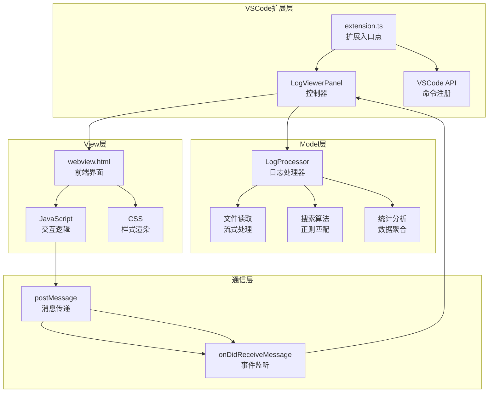
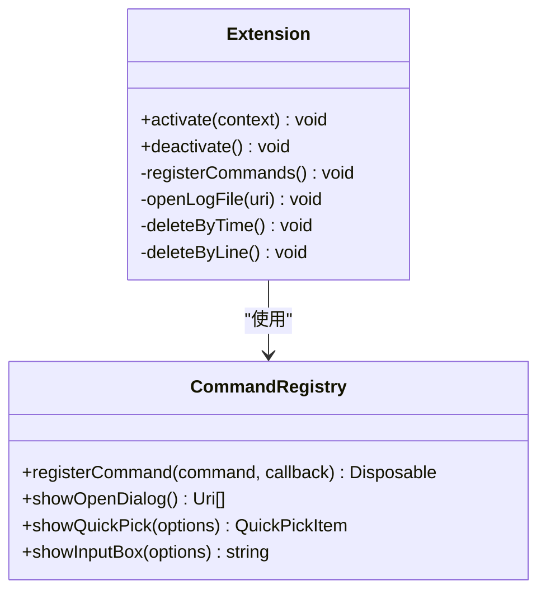
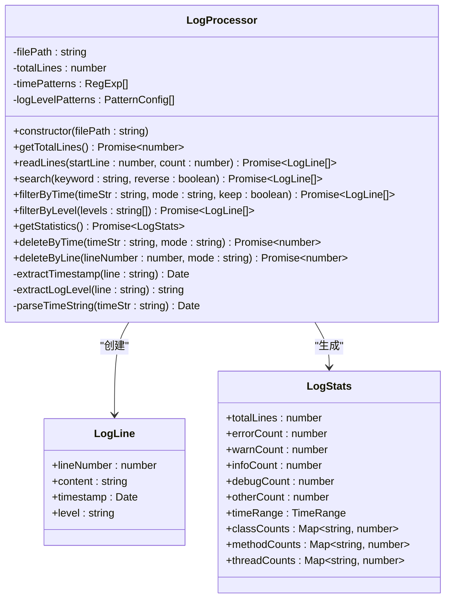
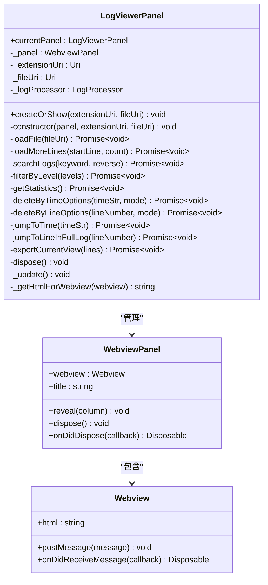
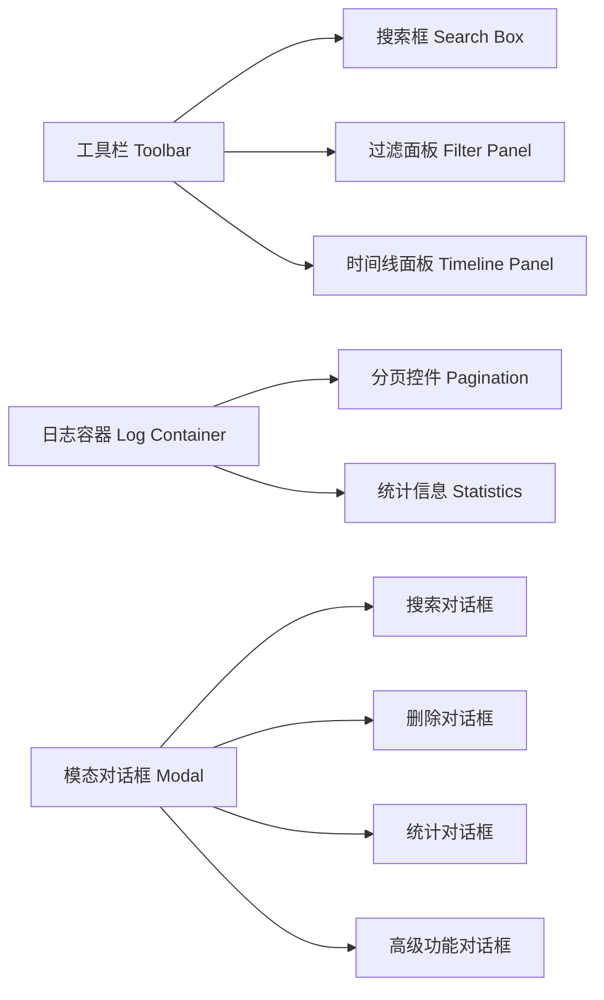
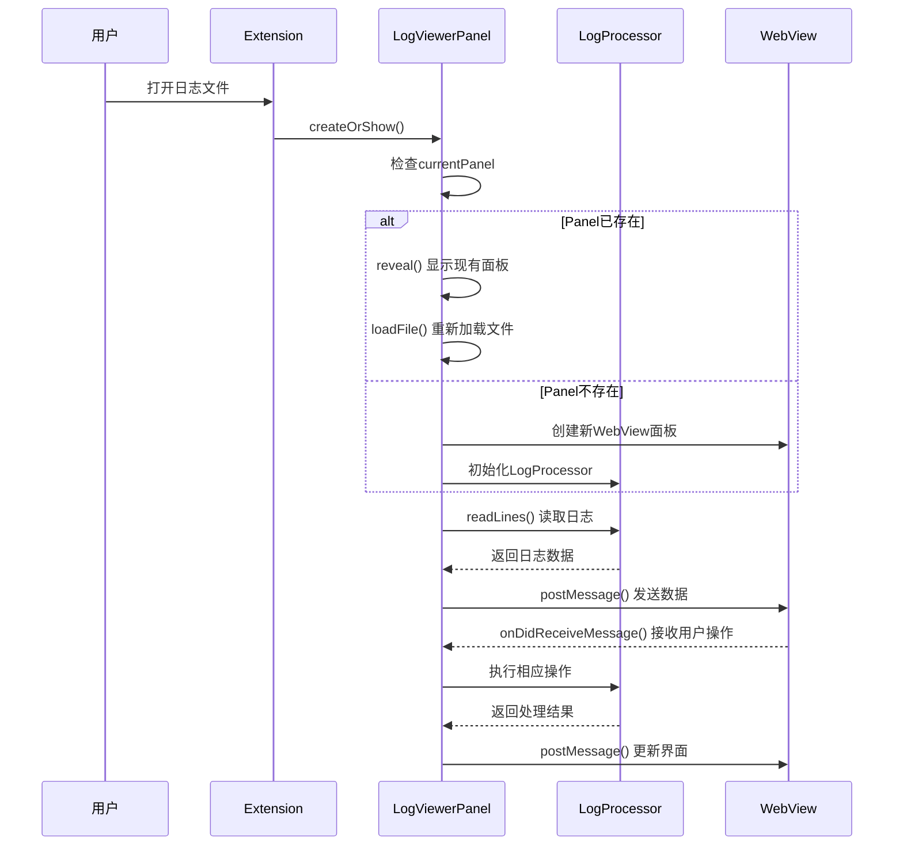
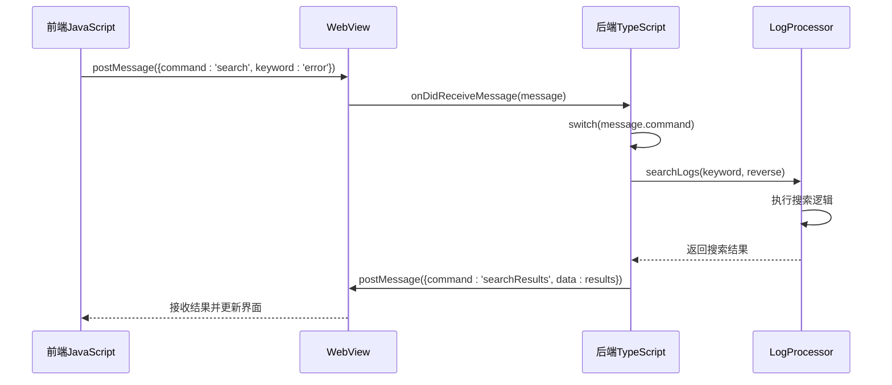
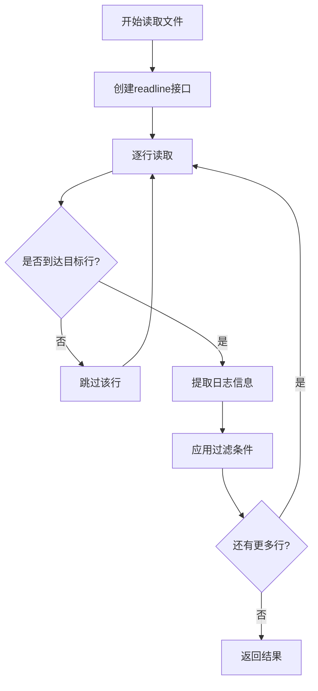
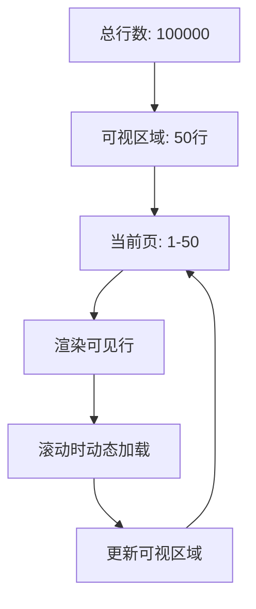

# 大日志文件查看器开发者指南

<cite>
**本文档引用的文件**
- [extension.ts](file://src/extension.ts)
- [logProcessor.ts](file://src/logProcessor.ts)
- [logViewerPanel.ts](file://src/logViewerPanel.ts)
- [webview.html](file://src/webview.html)
- [package.json](file://package.json)
- [tsconfig.json](file://tsconfig.json)
- [README.md](file://README.md)
</cite>

## 目录
1. [项目概述](#项目概述)
2. [架构设计](#架构设计)
3. [核心组件详解](#核心组件详解)
4. [MVC架构实现](#mvc架构实现)
5. [WebView通信机制](#webview通信机制)
6. [关键技术特性](#关键技术特性)
7. [开发环境配置](#开发环境配置)
8. [调试和测试](#调试和测试)
9. [扩展开发指南](#扩展开发指南)
10. [最佳实践](#最佳实践)

## 项目概述

大日志文件查看器是一个专业的VSCode扩展，专为处理大型日志文件而设计。该项目采用现代TypeScript开发，结合VSCode Extension API和WebView技术，提供了高性能的日志查看、搜索、过滤和分析功能。

### 核心特性
- **高性能加载**：支持GB级别日志文件的秒级打开
- **智能搜索**：支持关键词、正则表达式和高级组合搜索
- **实时过滤**：按日志级别、时间范围等条件实时过滤
- **可视化分析**：提供统计信息和时间线导航
- **安全操作**：提供书签、注释和安全删除功能

## 架构设计

项目采用经典的MVC（Model-View-Controller）架构模式，结合VSCode扩展的WebView技术，实现了前后端分离的设计。



**图表来源**
- [extension.ts](file://src/extension.ts#L1-L116)
- [logViewerPanel.ts](file://src/logViewerPanel.ts#L1-L510)
- [logProcessor.ts](file://src/logProcessor.ts#L1-L807)
- [webview.html](file://src/webview.html#L1-L4092)

## 核心组件详解

### 扩展入口点 (extension.ts)

扩展的入口点负责注册VSCode命令和初始化扩展生命周期。



**图表来源**
- [extension.ts](file://src/extension.ts#L4-L116)

**章节来源**
- [extension.ts](file://src/extension.ts#L1-L116)

### 日志处理器 (LogProcessor)

LogProcessor是项目的核心Model组件，负责所有日志文件的读取、处理和分析。



**图表来源**
- [logProcessor.ts](file://src/logProcessor.ts#L30-L807)

**章节来源**
- [logProcessor.ts](file://src/logProcessor.ts#L1-L807)

### WebView面板管理器 (LogViewerPanel)

LogViewerPanel作为Controller，管理WebView实例并协调前后端通信。



**图表来源**
- [logViewerPanel.ts](file://src/logViewerPanel.ts#L6-L510)

**章节来源**
- [logViewerPanel.ts](file://src/logViewerPanel.ts#L1-L510)

## MVC架构实现

### Model层 - LogProcessor

Model层负责数据处理和业务逻辑，采用流式文件处理技术，确保大文件的高效处理。

#### 关键特性：
- **流式读取**：使用Node.js的readline模块按行读取，避免内存溢出
- **异步处理**：所有文件操作都是异步的，不会阻塞主线程
- **智能缓存**：根据文件大小采用不同的加载策略
- **类型安全**：完整的TypeScript类型定义

#### 核心方法分类：

| 方法类别 | 主要方法 | 功能描述 |
|---------|---------|----------|
| 文件操作 | `readLines()` | 读取指定范围的行 |
| 搜索功能 | `search()` | 关键词搜索 |
| 搜索功能 | `regexSearch()` | 正则表达式搜索 |
| 过滤功能 | `filterByTime()` | 按时间范围过滤 |
| 过滤功能 | `filterByLevel()` | 按日志级别过滤 |
| 分析功能 | `getStatistics()` | 获取统计信息 |
| 删除功能 | `deleteByTime()` | 按时间删除日志 |
| 删除功能 | `deleteByLine()` | 按行数删除日志 |

**章节来源**
- [logProcessor.ts](file://src/logProcessor.ts#L60-L475)

### View层 - webview.html

View层提供完整的前端界面，包括搜索、过滤、统计等功能。

#### 界面组件结构：



**图表来源**
- [webview.html](file://src/webview.html#L660-L1000)

#### 核心交互功能：

| 功能模块 | HTML元素 | JavaScript处理 |
|---------|---------|---------------|
| 文件加载 | `#fileName`, `#fileSize` | `handleFileLoaded()` |
| 搜索功能 | `#searchInput`, `#regexMode` | `search()` |
| 过滤功能 | `#filterError`, `#filterWarn` | `applyFilter()` |
| 分页控制 | `#pagination` | `goToPage()`, `changePageSize()` |
| 统计显示 | `#statsModal` | `showStatsModal()` |
| 删除操作 | `#deleteModal` | `selectDeleteByTime()` |

**章节来源**
- [webview.html](file://src/webview.html#L660-L1600)

### Controller层 - LogViewerPanel

Controller层协调Model和View之间的交互，处理用户操作和业务逻辑。

#### 单例模式实现：



**图表来源**
- [logViewerPanel.ts](file://src/logViewerPanel.ts#L14-L39)
- [logViewerPanel.ts](file://src/logViewerPanel.ts#L53-L98)

**章节来源**
- [logViewerPanel.ts](file://src/logViewerPanel.ts#L1-L510)

## WebView通信机制

### 消息传递架构

项目采用双向消息传递机制，前端通过`postMessage`发送命令，后端通过`onDidReceiveMessage`接收并处理。



**图表来源**
- [logViewerPanel.ts](file://src/logViewerPanel.ts#L53-L98)
- [webview.html](file://src/webview.html#L1189-L1215)

### 消息类型定义

| 前端发送命令 | 后端处理方法 | 后端发送响应 |
|-------------|-------------|-------------|
| `loadMore` | `loadMoreLines()` | `moreLines` |
| `search` | `searchLogs()` | `searchResults` |
| `refresh` | `loadFile()` | `fileLoaded` |
| `filterByLevel` | `filterByLevel()` | `filterResults` |
| `getStatistics` | `getStatistics()` | `statisticsResults` |
| `regexSearch` | `regexSearch()` | `searchResults` |
| `exportLogs` | `exportCurrentView()` | 无响应 |
| `deleteByTime` | `deleteByTimeOptions()` | 无响应 |
| `deleteByLine` | `deleteByLineOptions()` | 无响应 |
| `jumpToTime` | `jumpToTime()` | `jumpToTimeResult` |
| `jumpToLineInFullLog` | `jumpToLineInFullLog()` | `jumpToLineInFullLogResult` |

**章节来源**
- [logViewerPanel.ts](file://src/logViewerPanel.ts#L56-L98)

### 前端消息处理

前端通过事件监听器处理来自后端的消息：

```javascript
window.addEventListener('message', event => {
    const message = event.data;
    
    switch (message.command) {
        case 'fileLoaded':
            handleFileLoaded(message.data);
            break;
        case 'moreLines':
            handleMoreLines(message.data);
            break;
        case 'searchResults':
            handleSearchResults(message.data);
            break;
        case 'filterResults':
            handleFilterResults(message.data);
            break;
        // ... 更多处理逻辑
    }
});
```

**章节来源**
- [webview.html](file://src/webview.html#L1189-L1215)

## 关键技术特性

### 流式文件处理

项目采用流式读取技术处理大文件，这是其高性能的核心保障。

#### 实现原理：



**图表来源**
- [logProcessor.ts](file://src/logProcessor.ts#L90-L130)

#### 性能优势：
- **内存效率**：只加载当前需要的数据
- **响应速度**：大文件秒级打开
- **可扩展性**：支持任意大小的文件

**章节来源**
- [logProcessor.ts](file://src/logProcessor.ts#L60-L130)

### 虚拟滚动技术

为了处理大量日志行，项目实现了虚拟滚动技术。

#### 实现机制：



**图表来源**
- [webview.html](file://src/webview.html#L1313-L1422)

#### 关键特性：
- **按需渲染**：只渲染可见区域的行
- **智能缓存**：缓存相邻页面的数据
- **平滑滚动**：流畅的滚动体验

**章节来源**
- [webview.html](file://src/webview.html#L1313-L1422)

### 智能时间戳识别

项目能够自动识别多种常见的时间戳格式。

#### 支持的时间格式：

| 格式类型 | 示例 | 正则表达式 |
|---------|------|-----------|
| 标准格式 | `2024-01-01 12:00:00` | `\d{4}-\d{2}-\d{2}\s+\d{2}:\d{2}:\d{2}` |
| 带毫秒 | `2024-01-01 12:00:00.123` | `\d{4}-\d{2}-\d{2}\s+\d{2}:\d{2}:\d{2}\.\d+` |
| 方括号格式 | `[2024-01-01 12:00:00]` | `\[\d{4}-\d{2}-\d{2}\s+\d{2}:\d{2}:\d{2}\]` |
| 斜杠格式 | `2024/01/01 12:00:00` | `\d{4}\/\d{2}\/\d{2}\s+\d{2}:\d{2}:\d{2}` |
| ISO格式 | `2024-01-01T12:00:00` | `\d{4}-\d{2}-\d{2}T\d{2}:\d{2}:\d{2}` |

**章节来源**
- [logProcessor.ts](file://src/logProcessor.ts#L35-L46)

## 开发环境配置

### 项目依赖管理

项目使用npm进行依赖管理，主要依赖包括：

#### 生产依赖：
- **vscode**：VSCode扩展API
- **typescript**：TypeScript编译器

#### 开发依赖：
- **@types/node**：Node.js类型定义
- **@types/vscode**：VSCode类型定义
- **@typescript-eslint/eslint-plugin**：ESLint插件
- **eslint**：代码质量检查工具
- **@vscode/vsce**：VSCode扩展打包工具

**章节来源**
- [package.json](file://package.json#L82-L93)

### TypeScript配置

项目使用严格的TypeScript配置确保代码质量：

```json
{
    "compilerOptions": {
        "module": "commonjs",
        "target": "ES2020",
        "outDir": "out",
        "lib": ["ES2020"],
        "sourceMap": true,
        "rootDir": "src",
        "strict": true,
        "esModuleInterop": true,
        "skipLibCheck": true,
        "forceConsistentCasingInFileNames": true,
        "moduleResolution": "node",
        "resolveJsonModule": true
    }
}
```

**章节来源**
- [tsconfig.json](file://tsconfig.json#L2-L16)

### 构建脚本

项目提供了完整的构建和开发脚本：

| 脚本命令 | 功能描述 |
|---------|----------|
| `npm run compile` | 编译TypeScript代码 |
| `npm run watch` | 监听文件变化并自动编译 |
| `npm run lint` | 运行ESLint代码检查 |
| `npm run dev` | 启动开发模式 |
| `npm run rebuild` | 清理并重新编译项目 |

**章节来源**
- [package.json](file://package.json#L69-L81)

## 调试和测试

### VSCode扩展开发主机

项目支持通过F5快捷键启动VSCode扩展开发主机进行调试。

#### 调试步骤：
1. **打开项目**：在VSCode中打开项目根目录
2. **启动调试**：按 `F5` 键启动扩展开发主机
3. **测试功能**：在新窗口中测试扩展功能
4. **代码热重载**：修改代码后会自动重新编译

#### 调试配置：
```json
{
    "name": "Extension",
    "type": "extensionHost",
    "request": "launch",
    "args": [
        "--extensionDevelopmentPath=${workspaceFolder}"
    ],
    "outFiles": [
        "${workspaceFolder}/out/**/*.js"
    ]
}
```

**章节来源**
- [README.md](file://README.md#L161-L167)

### 测试策略

#### 单元测试建议：
- **LogProcessor测试**：测试文件读取、搜索、过滤功能
- **LogViewerPanel测试**：测试WebView通信和UI交互
- **集成测试**：测试完整的用户操作流程

#### 性能测试：
- **大文件测试**：测试GB级别文件的处理能力
- **并发测试**：测试多文件同时打开的情况
- **内存泄漏测试**：确保长时间运行不会内存泄漏

## 扩展开发指南

### 添加新功能

#### 1. 添加新的搜索功能

```typescript
// 在LogProcessor中添加新方法
async searchByCustomCriteria(criteria: string): Promise<LogLine[]> {
    return new Promise((resolve, reject) => {
        // 实现搜索逻辑
    });
}

// 在LogViewerPanel中添加对应处理
case 'searchByCustomCriteria':
    await this.searchByCustomCriteria(message.criteria);
    break;

// 在前端添加调用
vscode.postMessage({
    command: 'searchByCustomCriteria',
    criteria: 'your-search-criteria'
});
```

#### 2. 添加新的过滤条件

```typescript
// 在LogProcessor中扩展filterByLevel方法
async filterByCustomCondition(condition: string): Promise<LogLine[]> {
    // 实现自定义过滤逻辑
}

// 在webview.html中添加UI控制
<div>
    <label>
        <input type="checkbox" id="filterCustom" onchange="applyCustomFilter()">
        自定义过滤
    </label>
</div>
```

### 性能优化建议

#### 1. 大文件处理优化
- 使用流式读取代替一次性加载
- 实现智能缓存机制
- 采用虚拟滚动技术

#### 2. 内存管理
- 及时释放不需要的资源
- 使用WeakMap避免内存泄漏
- 实现对象池模式

#### 3. 网络优化
- 实现请求去重
- 使用防抖和节流
- 优化DOM操作

### 错误处理

#### 1. 文件操作错误
```typescript
try {
    const lines = await this._logProcessor.readLines(startLine, count);
    // 处理成功
} catch (error) {
    vscode.window.showErrorMessage(`读取文件失败: ${error.message}`);
    // 回退到默认行为
}
```

#### 2. 网络错误处理
```javascript
function handleError(error) {
    console.error('网络请求失败:', error);
    showToast('操作失败，请检查网络连接', 'error');
}
```

## 最佳实践

### 代码组织

#### 1. 模块化设计
- 每个功能模块独立成类
- 使用接口定义清晰的契约
- 遵循单一职责原则

#### 2. 错误处理
- 使用try-catch处理异步操作
- 提供有意义的错误信息
- 实现优雅降级

#### 3. 性能考虑
- 避免在循环中进行DOM操作
- 使用requestAnimationFrame优化动画
- 实现防抖和节流机制

### 用户体验

#### 1. 加载状态
- 显示加载指示器
- 提供进度反馈
- 实现骨架屏效果

#### 2. 错误提示
- 使用VSCode的通知系统
- 提供具体的解决建议
- 实现错误恢复机制

#### 3. 响应式设计
- 支持不同屏幕尺寸
- 适配深色和浅色主题
- 提供键盘快捷键

### 安全考虑

#### 1. 文件访问
- 验证文件路径安全性
- 限制文件访问权限
- 实现文件大小检查

#### 2. 用户输入
- 对用户输入进行验证
- 防止XSS攻击
- 实现输入清理

#### 3. 数据保护
- 敏感信息加密存储
- 实现访问控制
- 提供数据备份功能

通过遵循这些最佳实践，开发者可以创建高质量、高性能且用户体验优秀的VSCode扩展。