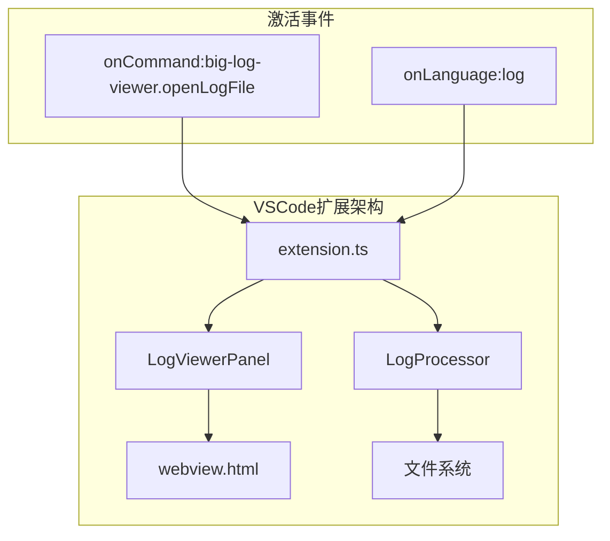
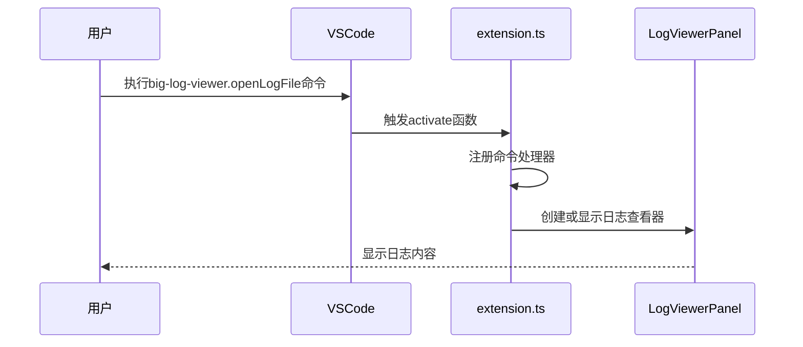
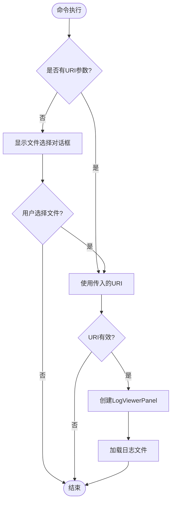
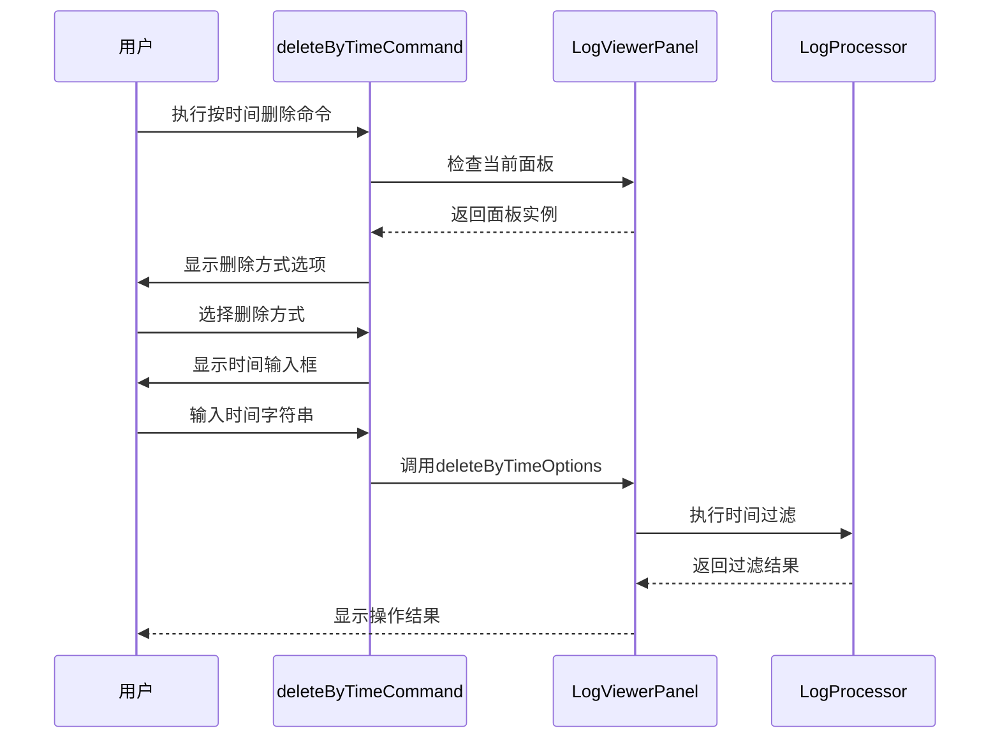
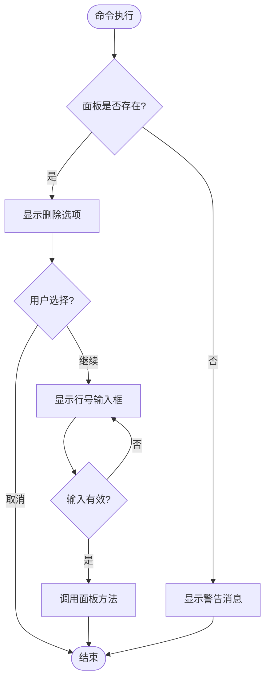
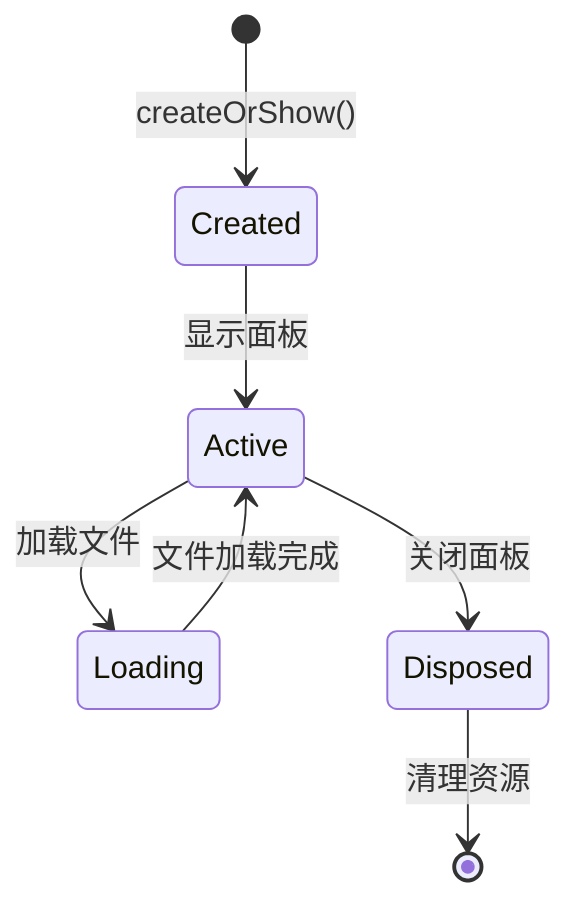

# extension.ts模块详解

<cite>
**本文档引用的文件**
- [extension.ts](file://src/extension.ts)
- [package.json](file://package.json)
- [logViewerPanel.ts](file://src/logViewerPanel.ts)
- [logProcessor.ts](file://src/logProcessor.ts)
- [webview.html](file://src/webview.html)
</cite>

## 目录
1. [概述](#概述)
2. [项目架构](#项目架构)
3. [激活机制分析](#激活机制分析)
4. [命令注册详解](#命令注册详解)
5. [用户交互流程](#用户交互流程)
6. [资源管理机制](#资源管理机制)
7. [最佳实践总结](#最佳实践总结)

## 概述

extension.ts模块是VSCode大日志文件查看器扩展的核心入口点，负责扩展的初始化、命令注册和生命周期管理。该模块实现了三个核心命令：打开日志文件、按时间删除日志和按行数删除日志，每个命令都经过精心设计的用户交互流程和错误处理机制。

## 项目架构



**图表来源**
- [extension.ts](file://src/extension.ts#L4-L116)
- [package.json](file://package.json#L29-L32)

**章节来源**
- [extension.ts](file://src/extension.ts#L1-L116)
- [package.json](file://package.json#L1-L94)

## 激活机制分析

### activationEvents配置

VSCode扩展的激活机制通过package.json中的activationEvents字段控制。本扩展配置了两个激活事件：

```json
"activationEvents": [
    "onCommand:big-log-viewer.openLogFile",
    "onLanguage:log"
]
```

这种配置策略的优势：
- **按需激活**：只有当用户执行相关命令或打开日志文件时才激活扩展
- **性能优化**：避免不必要的资源消耗
- **用户体验**：快速响应用户操作

### 命令激活流程



**图表来源**
- [extension.ts](file://src/extension.ts#L4-L32)
- [package.json](file://package.json#L29-L32)

**章节来源**
- [package.json](file://package.json#L29-L32)

## 命令注册详解

### openLogFile命令实现

openLogFile命令是最核心的命令，负责打开和显示日志文件：



**图表来源**
- [extension.ts](file://src/extension.ts#L8-L31)

#### 参数处理机制

命令注册时使用可选参数模式：
- 支持直接传入vscode.Uri参数
- 当未提供URI时自动调用showOpenDialog
- 实现灵活的文件选择机制

#### 错误处理策略

- **空URI检查**：验证传入的URI有效性
- **用户取消处理**：当用户取消文件选择时优雅退出
- **文件存在性验证**：确保目标文件可访问

### deleteByTime命令实现

按时间删除日志命令提供了精确的时间范围过滤功能：



**图表来源**
- [extension.ts](file://src/extension.ts#L35-L71)
- [logViewerPanel.ts](file://src/logViewerPanel.ts#L180-L228)

#### 用户交互设计

- **删除方式选择**：提供三种操作模式
  - 仅隐藏（不修改文件）
  - 导出到新文件
  - 修改原文件（危险）

- **时间格式验证**：实时验证用户输入的时间格式
- **确认机制**：重要操作前的二次确认

### deleteByLine命令实现

按行数删除日志命令提供了基于行号的精确控制：



**图表来源**
- [extension.ts](file://src/extension.ts#L74-L110)

#### 输入验证逻辑

- **行号范围检查**：确保行号为正整数
- **格式验证**：防止非法输入导致的运行时错误
- **边界条件处理**：考虑文件总行数限制

**章节来源**
- [extension.ts](file://src/extension.ts#L8-L116)

## 用户交互流程

### showQuickPick集成

两种删除命令都使用vscode.window.showQuickPick实现用户选择：

```typescript
// 示例：删除方式选择
const options = await vscode.window.showQuickPick([
    { label: '删除指定时间之前的日志', value: 'before' },
    { label: '删除指定时间之后的日志', value: 'after' }
], {
    placeHolder: '选择删除方式'
});
```

#### 交互设计原则

- **明确的选项标签**：清晰描述每个选项的作用
- **占位符提示**：提供操作指导
- **取消处理**：优雅处理用户取消操作

### showInputBox集成

时间输入框提供了灵活的时间格式支持：

```typescript
const timeInput = await vscode.window.showInputBox({
    prompt: '输入时间（支持格式：2024-01-01 12:00:00 或 2024-01-01）',
    placeHolder: 'YYYY-MM-DD HH:mm:ss',
    validateInput: (value) => {
        if (!value) {
            return '时间不能为空';
        }
        if (!/^\d{4}-\d{2}-\d{2}/.test(value)) {
            return '时间格式不正确';
        }
        return null;
    }
});
```

#### 验证机制

- **非空检查**：确保用户输入内容
- **格式验证**：正则表达式验证时间格式
- **即时反馈**：输入验证失败时提供具体错误信息

**章节来源**
- [extension.ts](file://src/extension.ts#L42-L71)
- [extension.ts](file://src/extension.ts#L75-L110)

## 资源管理机制

### context.subscriptions管理

扩展通过context.subscriptions数组管理所有命令订阅：

```typescript
context.subscriptions.push(openLogFileCommand, deleteByTimeCommand, deleteByLineCommand);
```

#### 管理优势

- **自动清理**：扩展卸载时自动释放资源
- **统一管理**：集中管理所有订阅对象
- **内存安全**：防止内存泄漏

### LogViewerPanel生命周期管理

LogViewerPanel类实现了完整的生命周期管理：



**图表来源**
- [logViewerPanel.ts](file://src/logViewerPanel.ts#L14-L38)
- [logViewerPanel.ts](file://src/logViewerPanel.ts#L497-L509)

#### 资源清理策略

- **Disposable对象管理**：使用_disposables数组存储所有可释放对象
- **事件监听器清理**：确保移除所有事件监听器
- **面板状态重置**：清理静态状态变量

**章节来源**
- [extension.ts](file://src/extension.ts#L112)
- [logViewerPanel.ts](file://src/logViewerPanel.ts#L497-L509)

## 最佳实践总结

### 命令注册最佳实践

1. **参数灵活性**：支持可选参数和默认行为
2. **错误处理**：完善的错误检查和用户反馈
3. **资源管理**：正确的订阅管理和资源清理

### 用户交互最佳实践

1. **渐进式披露**：分步骤引导用户完成复杂操作
2. **即时验证**：实时验证用户输入
3. **明确反馈**：提供清晰的操作结果反馈

### 架构设计最佳实践

1. **职责分离**：命令层、面板层、处理器层各司其职
2. **异步处理**：合理使用async/await处理I/O操作
3. **状态管理**：清晰的状态管理和生命周期控制

### 错误处理最佳实践

1. **防御性编程**：充分验证输入参数
2. **用户友好**：提供有意义的错误信息
3. **优雅降级**：在部分功能失败时保持整体可用性

这个extension.ts模块展现了VSCode扩展开发的优秀实践，通过精心设计的命令系统、用户交互流程和资源管理机制，为用户提供了一个功能强大且易于使用的日志文件查看工具。