# logProcessor.ts模块详解

<cite>
**本文档引用的文件**
- [logProcessor.ts](file://src/logProcessor.ts)
- [logViewerPanel.ts](file://src/logViewerPanel.ts)
- [extension.ts](file://src/extension.ts)
- [README.md](file://README.md)
</cite>

## 目录
1. [简介](#简介)
2. [项目结构概览](#项目结构概览)
3. [核心组件分析](#核心组件分析)
4. [架构设计](#架构设计)
5. [详细方法分析](#详细方法分析)
6. [流式处理机制](#流式处理机制)
7. [性能优化策略](#性能优化策略)
8. [错误处理与安全机制](#错误处理与安全机制)
9. [最佳实践总结](#最佳实践总结)

## 简介

logProcessor.ts模块是VSCode大日志文件查看器扩展的核心组件，专门设计用于处理大型日志文件（支持几十MB甚至GB级别的文件）。该模块基于Node.js的流式处理技术，实现了高性能的日志读取、搜索、过滤和分析功能。

### 主要特性

- **流式文件处理**：基于`fs.createReadStream`和`readline.createInterface`实现大文件的高效处理
- **多格式时间戳识别**：支持多种常见日志时间格式的自动识别和解析
- **智能日志级别提取**：准确识别ERROR、WARN、INFO、DEBUG等日志级别
- **安全的文件修改操作**：采用临时文件和原子性替换确保数据安全
- **内存优化**：通过流式读取和懒加载策略实现低内存占用

## 项目结构概览

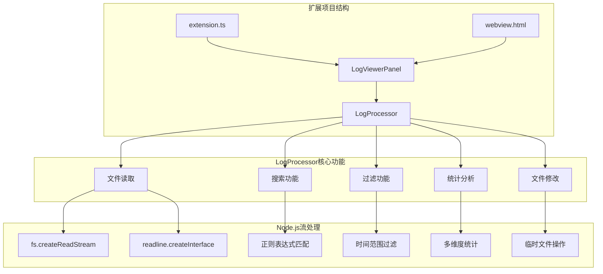

**图表来源**
- [extension.ts](file://src/extension.ts#L1-L116)
- [logViewerPanel.ts](file://src/logViewerPanel.ts#L1-L510)
- [logProcessor.ts](file://src/logProcessor.ts#L1-L807)

**章节来源**
- [README.md](file://README.md#L1-L286)

## 核心组件分析

### LogProcessor类设计

LogProcessor类是整个模块的核心，提供了完整的日志处理功能集合。该类的设计遵循单一职责原则，每个方法都专注于特定的日志处理任务。

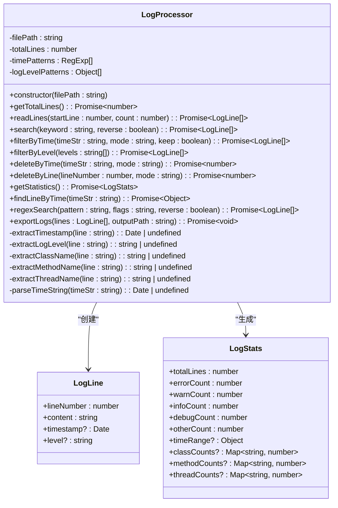

**图表来源**
- [logProcessor.ts](file://src/logProcessor.ts#L4-L28)
- [logProcessor.ts](file://src/logProcessor.ts#L30-L807)

### 接口定义

模块定义了两个核心接口来规范数据结构：

- **LogLine接口**：表示单行日志的基本信息
- **LogStats接口**：包含完整的日志统计信息

**章节来源**
- [logProcessor.ts](file://src/logProcessor.ts#L4-L28)

## 架构设计

### 整体架构图

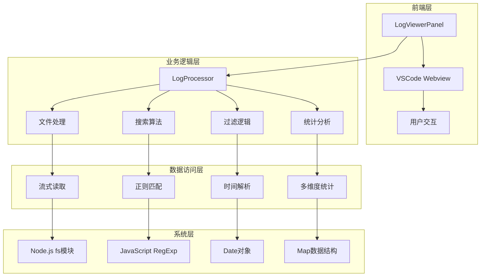

**图表来源**
- [logViewerPanel.ts](file://src/logViewerPanel.ts#L41-L46)
- [logProcessor.ts](file://src/logProcessor.ts#L30-L807)

### 设计模式应用

1. **工厂模式**：LogProcessor构造函数创建实例
2. **策略模式**：不同的搜索和过滤策略
3. **观察者模式**：事件驱动的流处理
4. **模板方法模式**：统一的异步处理流程

## 详细方法分析

### getTotalLines方法 - 文件总行数统计

getTotalLines方法实现了高效的文件行数统计功能，采用流式处理避免内存溢出。

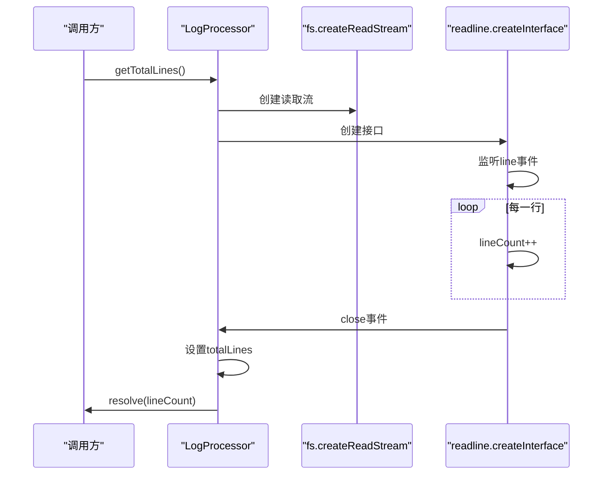

**图表来源**
- [logProcessor.ts](file://src/logProcessor.ts#L63-L84)

**实现特点**：
- 使用Promise包装异步操作
- 事件驱动的流处理
- 自动资源清理（流关闭时销毁）

**章节来源**
- [logProcessor.ts](file://src/logProcessor.ts#L63-L84)

### readLines方法 - 指定范围读取

readLines方法支持精确的行范围读取，同时提取日志的关键信息。

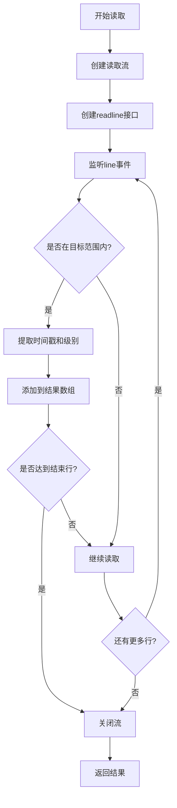

**图表来源**
- [logProcessor.ts](file://src/logProcessor.ts#L90-L129)

**关键技术点**：
- 精确的行号控制
- 边界条件处理
- 及时的流资源释放

**章节来源**
- [logProcessor.ts](file://src/logProcessor.ts#L90-L129)

### search方法 - 关键词搜索算法

搜索功能支持不区分大小写的关键词匹配和反向搜索。

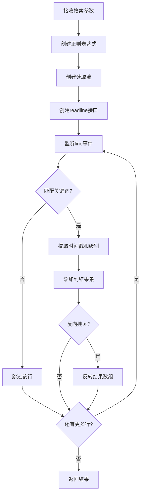

**图表来源**
- [logProcessor.ts](file://src/logProcessor.ts#L135-L172)

**搜索优化**：
- 使用'i'标志实现不区分大小写
- 及时停止不必要的读取
- 支持反向搜索功能

**章节来源**
- [logProcessor.ts](file://src/logProcessor.ts#L135-L172)

### filterByTime方法 - 时间范围过滤

时间过滤功能支持灵活的时间范围选择和多种比较模式。

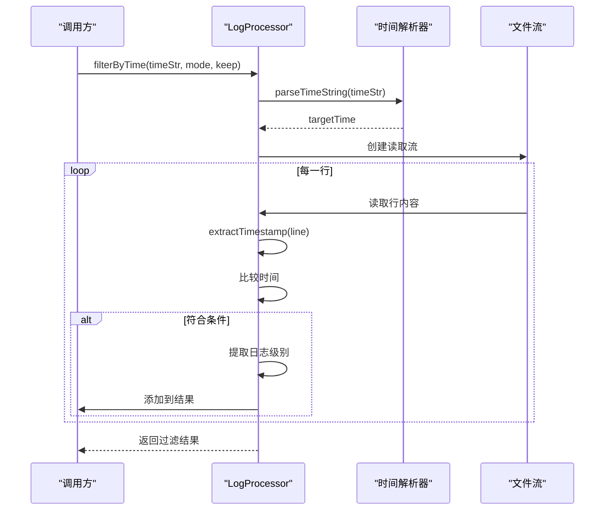

**图表来源**
- [logProcessor.ts](file://src/logProcessor.ts#L178-L230)

**时间处理逻辑**：
- 支持多种时间格式
- 灵活的比较模式（before/after）
- 默认行为处理（无法解析时间戳的情况）

**章节来源**
- [logProcessor.ts](file://src/logProcessor.ts#L178-L230)

### deleteByTime和deleteByLine方法 - 安全文件修改

这两个方法实现了安全的文件修改功能，采用临时文件和原子性替换策略。

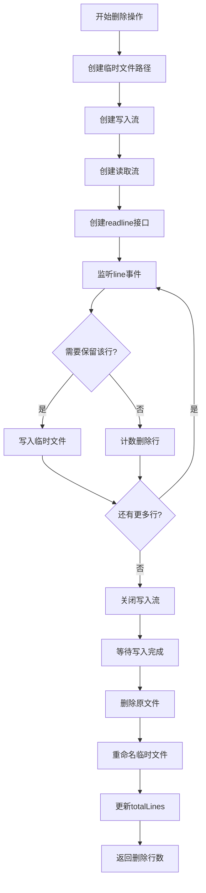

**图表来源**
- [logProcessor.ts](file://src/logProcessor.ts#L339-L474)

**安全机制**：
- 临时文件隔离
- 原子性替换操作
- 错误回滚机制
- 资源清理保证

**章节来源**
- [logProcessor.ts](file://src/logProcessor.ts#L339-L474)

### getStatistics方法 - 多维度统计分析

统计功能在单次文件遍历中完成多个维度的数据收集。

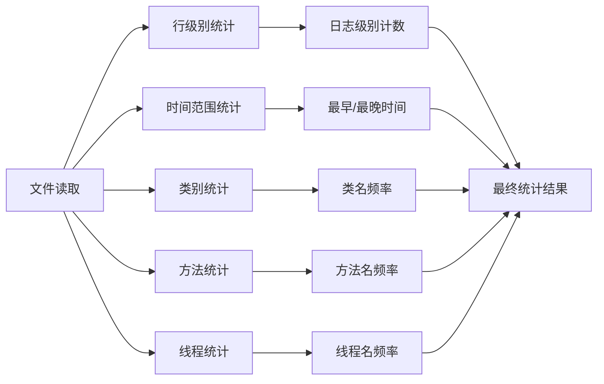

**图表来源**
- [logProcessor.ts](file://src/logProcessor.ts#L566-L644)

**统计维度**：
- 日志级别分布
- 时间范围分析
- 类名使用频率
- 方法名调用统计
- 线程使用情况

**章节来源**
- [logProcessor.ts](file://src/logProcessor.ts#L566-L644)

## 流式处理机制

### Node.js流处理架构

LogProcessor模块深度集成Node.js的流处理生态系统：

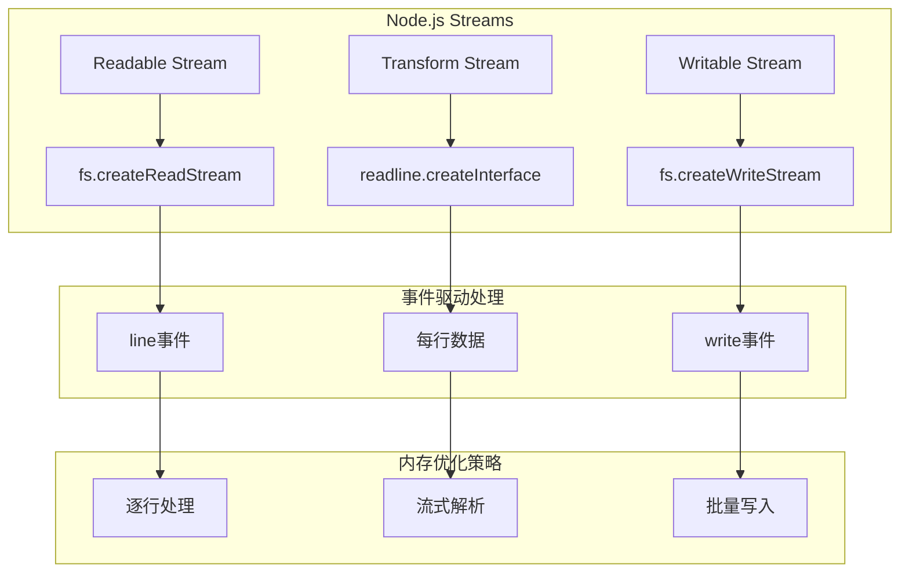

**图表来源**
- [logProcessor.ts](file://src/logProcessor.ts#L66-L129)
- [logProcessor.ts](file://src/logProcessor.ts#L347-L474)

### 流式处理优势

1. **内存效率**：避免将整个文件加载到内存
2. **响应性**：实时处理，无需等待完整文件加载
3. **可扩展性**：支持任意大小的文件处理
4. **资源管理**：自动的流生命周期管理

**章节来源**
- [logProcessor.ts](file://src/logProcessor.ts#L66-L129)
- [logProcessor.ts](file://src/logProcessor.ts#L347-L474)

## 性能优化策略

### 时间戳解析优化

模块实现了高效的时间戳识别算法：

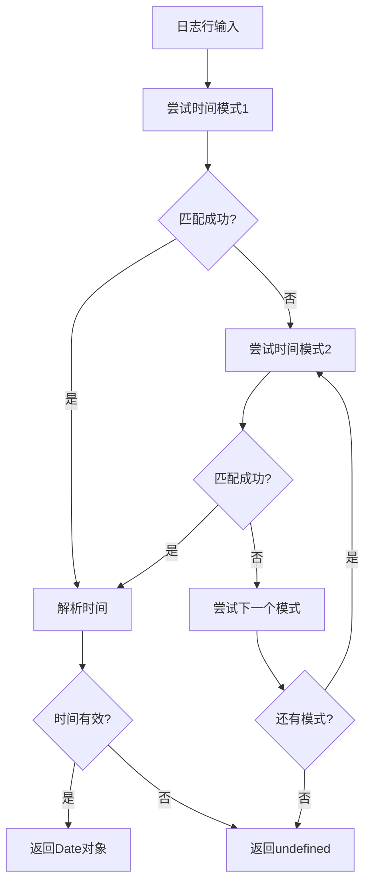

**图表来源**
- [logProcessor.ts](file://src/logProcessor.ts#L480-L492)

### 日志级别识别优化

采用优先级匹配策略提高识别效率：

1. **快速匹配**：优先使用简单的正则表达式
2. **优先级排序**：按严重程度排序匹配模式
3. **缓存机制**：避免重复的模式匹配

**章节来源**
- [logProcessor.ts](file://src/logProcessor.ts#L542-L561)

### 内存管理策略

1. **及时释放**：使用`stream.destroy()`及时释放资源
2. **流控制**：通过`rl.close()`控制流的生命周期
3. **垃圾回收**：避免创建不必要的对象引用

## 错误处理与安全机制

### 异常处理策略

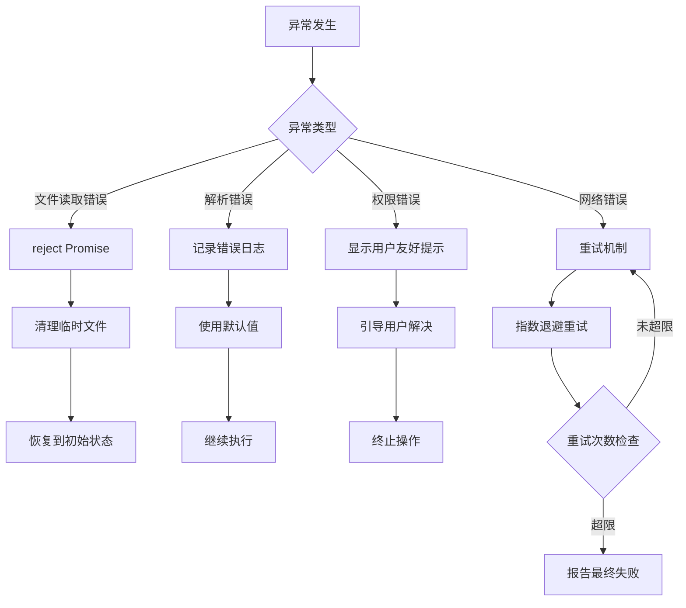

**图表来源**
- [logProcessor.ts](file://src/logProcessor.ts#L81-L83)
- [logProcessor.ts](file://src/logProcessor.ts#L403-L407)

### 数据安全保护

1. **备份机制**：删除操作前的安全确认
2. **原子操作**：使用临时文件确保操作完整性
3. **权限检查**：验证文件访问权限
4. **输入验证**：严格的时间格式验证

**章节来源**
- [logProcessor.ts](file://src/logProcessor.ts#L403-L407)
- [logProcessor.ts](file://src/logProcessor.ts#L470-L474)

## 最佳实践总结

### 流式处理最佳实践

1. **合理使用流**：对于大文件始终使用流式处理
2. **事件驱动编程**：充分利用Node.js的事件机制
3. **资源管理**：及时关闭流和清理资源
4. **错误传播**：通过Promise链正确传播错误

### 性能优化建议

1. **批量处理**：适当调整读取块大小
2. **缓存策略**：缓存频繁使用的解析结果
3. **并发控制**：避免过多的并发操作
4. **内存监控**：定期检查内存使用情况

### 安全编程原则

1. **输入验证**：严格验证所有外部输入
2. **权限最小化**：只请求必要的文件权限
3. **错误处理**：提供有意义的错误信息
4. **审计日志**：记录关键操作的审计信息

### 代码质量保证

1. **类型安全**：充分利用TypeScript的类型系统
2. **单元测试**：为关键功能编写测试用例
3. **文档完善**：提供清晰的API文档
4. **代码审查**：定期进行代码质量检查

**章节来源**
- [logProcessor.ts](file://src/logProcessor.ts#L1-L807)
- [logViewerPanel.ts](file://src/logViewerPanel.ts#L1-L510)