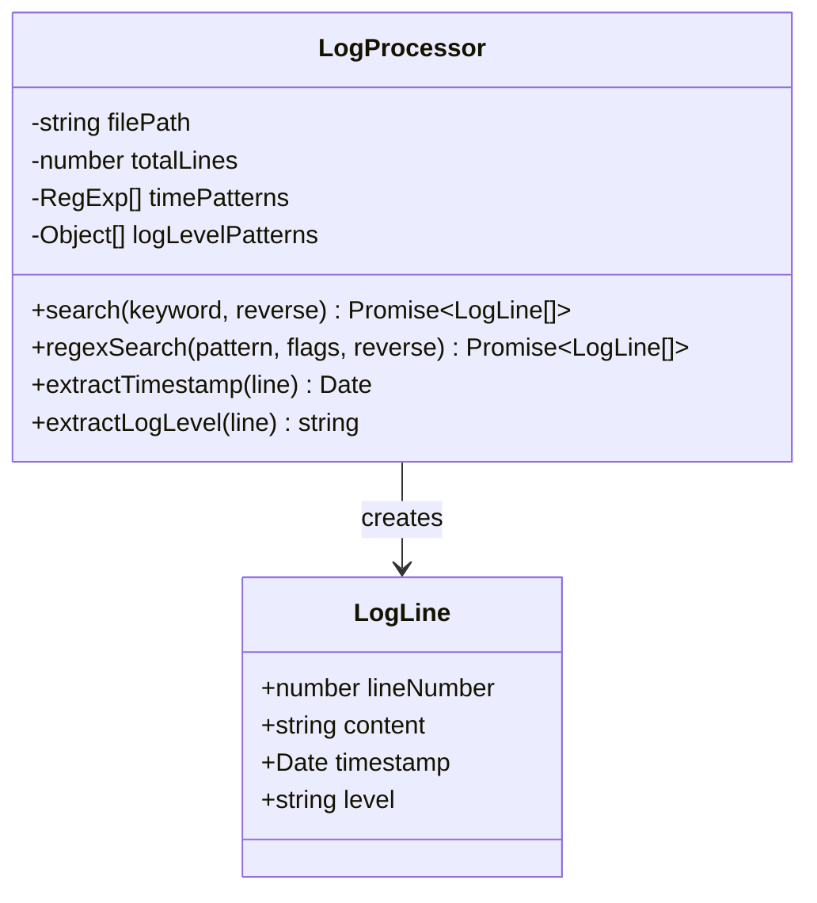
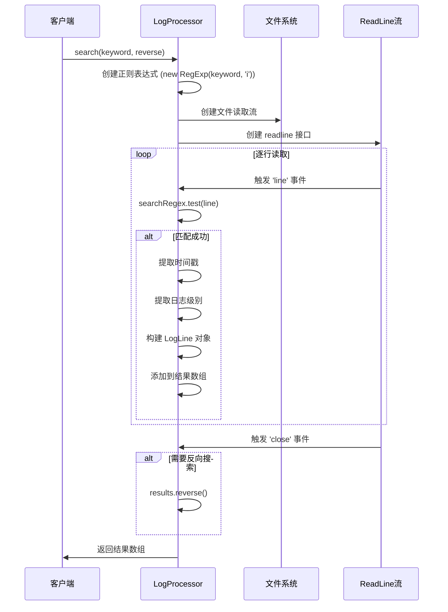
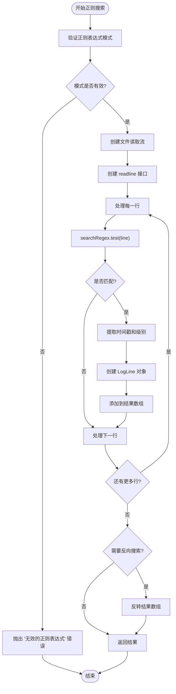
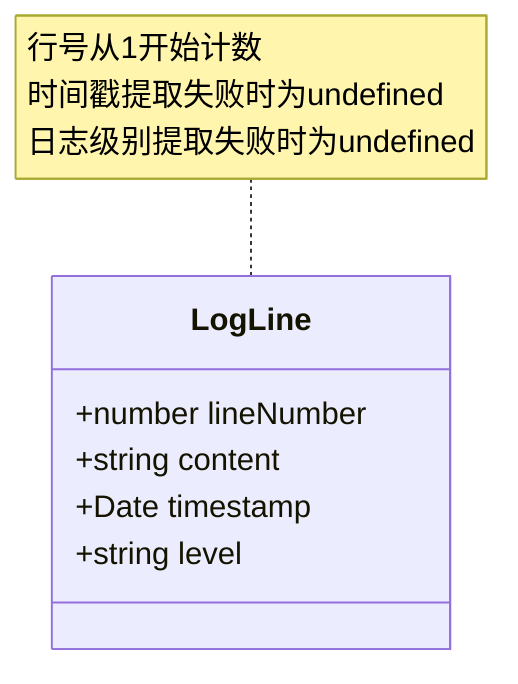
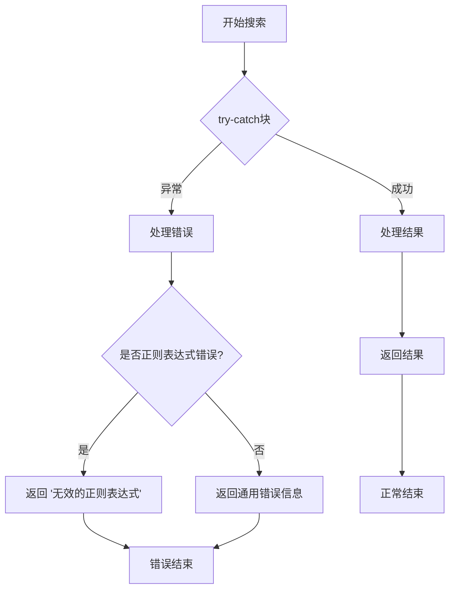
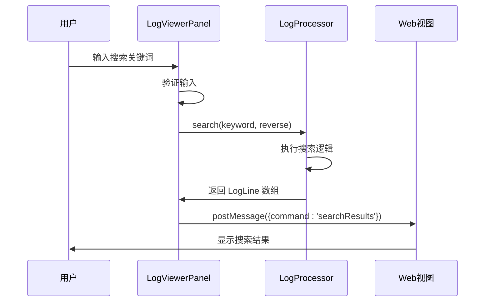

# 搜索功能实现

<cite>
**本文档引用的文件**
- [logProcessor.ts](file://src/logProcessor.ts)
- [logViewerPanel.ts](file://src/logViewerPanel.ts)
- [extension.ts](file://src/extension.ts)
- [webview.html](file://src/webview.html)
</cite>

## 目录
1. [概述](#概述)
2. [核心数据结构](#核心数据结构)
3. [基础关键词搜索](#基础关键词搜索)
4. [正则表达式搜索](#正则表达式搜索)
5. [搜索结果处理](#搜索结果处理)
6. [性能优化与注意事项](#性能优化与注意事项)
7. [使用示例](#使用示例)
8. [总结](#总结)

## 概述

logProcessor.ts 文件实现了两个核心搜索功能：基础关键词搜索（search 方法）和正则表达式搜索（regexSearch 方法）。这两个搜索功能都采用流式读取的方式处理大型日志文件，确保在处理超大文件时不会导致内存溢出。

### 主要特性

- **流式处理**：逐行读取文件，避免一次性加载整个文件到内存
- **异步操作**：使用 Promise 和回调函数处理异步 I/O 操作
- **反向搜索支持**：可选的反向搜索功能
- **错误处理**：完善的错误捕获和处理机制
- **结果增强**：自动提取时间戳和日志级别信息

## 核心数据结构

### LogLine 接口



**图表来源**
- [logProcessor.ts](file://src/logProcessor.ts#L4-L9)

**章节来源**
- [logProcessor.ts](file://src/logProcessor.ts#L4-L9)

## 基础关键词搜索

### search 方法实现

基础关键词搜索方法提供了简单而高效的文本匹配功能，支持不区分大小写的搜索。

#### 方法签名
```typescript
async search(keyword: string, reverse: boolean = false): Promise<LogLine[]>
```

#### 实现机制



**图表来源**
- [logProcessor.ts](file://src/logProcessor.ts#L135-L172)

#### 关键实现细节

1. **正则表达式构建**：使用 `new RegExp(keyword, 'i')` 创建不区分大小写的正则表达式
2. **流式处理**：通过 `fs.createReadStream()` 和 `readline.createInterface()` 实现流式读取
3. **逐行检测**：在 `'line'` 事件中对每一行执行匹配检查
4. **结果收集**：将匹配的行转换为 LogLine 对象并存储在结果数组中
5. **反向搜索**：如果 `reverse` 参数为 true，在返回前对结果数组进行反转

**章节来源**
- [logProcessor.ts](file://src/logProcessor.ts#L135-L172)

## 正则表达式搜索

### regexSearch 方法实现

正则表达式搜索提供了更强大的模式匹配功能，支持完整的 JavaScript 正则表达式语法。

#### 方法签名
```typescript
async regexSearch(pattern: string, flags: string = 'i', reverse: boolean = false): Promise<LogLine[]>
```

#### 实现机制



**图表来源**
- [logProcessor.ts](file://src/logProcessor.ts#L704-L748)

#### 关键实现细节

1. **模式验证**：使用 `try-catch` 块捕获无效正则表达式
2. **标志位支持**：允许自定义正则表达式标志（如 'i', 'g', 'm' 等）
3. **错误处理**：当正则表达式无效时返回明确的错误信息
4. **性能考虑**：与基础搜索相同，采用流式处理避免内存问题

**章节来源**
- [logProcessor.ts](file://src/logProcessor.ts#L704-L748)

## 搜索结果处理

### LogLine 对象构建

无论是哪种搜索方式，最终都会构建标准化的 LogLine 对象：



**图表来源**
- [logProcessor.ts](file://src/logProcessor.ts#L4-L9)

### 时间戳提取

系统支持多种时间戳格式的自动识别：

| 格式示例 | 正则表达式模式 | 说明 |
|---------|---------------|------|
| `2024-01-01 12:00:00` | `\d{4}-\d{2}-\d{2}\s+\d{2}:\d{2}:\d{2}` | 标准日期时间格式 |
| `2024/01/01 12:00:00` | `\d{4}\/\d{2}\/\d{2}\s+\d{2}:\d{2}:\d{2}` | 斜杠分隔格式 |
| `[2024-01-01 12:00:00]` | `\[(\d{4}-\d{2}-\d{2}\s+\d{2}:\d{2}:\d{2})\]` | 方括号包裹格式 |
| `01-01-2024 12:00:00` | `\d{2}-\d{2}-\d{4}\s+\d{2}:\d{2}:\d{2}` | 反向日期格式 |
| `2024-01-01T12:00:00` | `\d{4}-\d{2}-\d{2}T\d{2}:\d{2}:\d{2}` | ISO 8601 格式 |

### 日志级别提取

系统按优先级顺序匹配日志级别：

| 级别 | 匹配模式 | 说明 |
|-----|----------|------|
| ERROR | `/\[(ERROR\|FATAL\|SEVERE)\]`\|`\b(ERROR\|FATAL\|SEVERE)\s/i` | 错误级别 |
| WARN | `/\[(WARN\|WARNING)\]`\|`\b(WARN\|WARNING)\s/i` | 警告级别 |
| INFO | `/\[(INFO\|INFORMATION)\]`\|`\b(INFO\|INFORMATION)\s/i` | 信息级别 |
| DEBUG | `/\[(DEBUG\|TRACE\|VERBOSE)\]`\|`\b(DEBUG\|TRACE\|VERBOSE)\s/i` | 调试级别 |

**章节来源**
- [logProcessor.ts](file://src/logProcessor.ts#L35-L55)

## 性能优化与注意事项

### 流式处理的优势

1. **内存效率**：只在内存中保持当前处理的行，适合处理超大文件
2. **响应性**：可以实时显示搜索进度，提高用户体验
3. **可中断性**：可以在任何时候停止搜索操作

### 性能影响因素

#### 基础关键词搜索
- **正则表达式复杂度**：简单的字符串匹配比复杂的正则表达式更快
- **文件大小**：线性增长的时间复杂度 O(n)，其中 n 是文件行数
- **匹配频率**：频繁的匹配操作会影响性能

#### 正则表达式搜索
- **正则表达式复杂度**：复杂的正则表达式可能导致回溯问题
- **标志位影响**：全局标志 'g' 可能影响匹配行为
- **量词使用**：贪婪量词（如 `.*`）可能降低性能

### 性能优化建议

1. **简单模式优先**：对于简单的文本搜索，使用基础关键词搜索而非正则表达式
2. **合理使用标志**：根据需要选择合适的正则表达式标志
3. **避免过度匹配**：使用具体的模式而不是过于宽泛的正则表达式
4. **及时释放资源**：确保流和接口在完成后正确关闭

### 错误处理策略



**图表来源**
- [logProcessor.ts](file://src/logProcessor.ts#L710-L714)

**章节来源**
- [logProcessor.ts](file://src/logProcessor.ts#L710-L714)

## 使用示例

### 基础关键词搜索示例

```typescript
// 创建 LogProcessor 实例
const processor = new LogProcessor('/path/to/logfile.log');

// 基础关键词搜索（不区分大小写）
const results = await processor.search('error', false);
console.log(`找到 ${results.length} 条匹配记录`);

// 反向搜索（从后向前）
const reversedResults = await processor.search('error', true);
```

### 正则表达式搜索示例

```typescript
// 基本正则表达式搜索
const regexResults = await processor.regexSearch('error.*exception', 'i');

// 多个标志组合
const complexResults = await processor.regexSearch('\\d{4}-\\d{2}-\\d{2}', 'gm');

// 复杂模式搜索
const patternResults = await processor.regexSearch(
    '(ERROR|FATAL).*\\[(\\w+)\\]', 
    'gi'
);
```

### 在 VS Code 扩展中的使用



**图表来源**
- [logViewerPanel.ts](file://src/logViewerPanel.ts#L165-L177)

**章节来源**
- [logViewerPanel.ts](file://src/logViewerPanel.ts#L165-L177)

## 总结

logProcessor.ts 中的搜索功能提供了强大而灵活的日志分析能力：

### 核心优势

1. **高效处理**：流式处理确保能够处理任意大小的日志文件
2. **双重搜索**：同时支持简单关键词搜索和复杂正则表达式搜索
3. **智能解析**：自动提取时间戳和日志级别信息
4. **用户友好**：提供反向搜索和完善的错误处理

### 技术特点

- **异步架构**：基于 Promise 和事件驱动的异步处理
- **资源管理**：正确的流和接口生命周期管理
- **类型安全**：完整的 TypeScript 类型定义
- **扩展性**：易于添加新的搜索模式和功能

### 应用场景

- **故障排查**：快速定位特定错误或异常
- **性能分析**：查找特定时间段或类型的日志
- **审计追踪**：搜索特定用户或操作相关的日志
- **监控分析**：实时监控和报警触发条件

这个搜索功能的设计充分考虑了实际应用场景的需求，在保证功能完整性的同时，也兼顾了性能和用户体验。无论是简单的文本匹配还是复杂的模式搜索，都能提供快速、准确的结果。