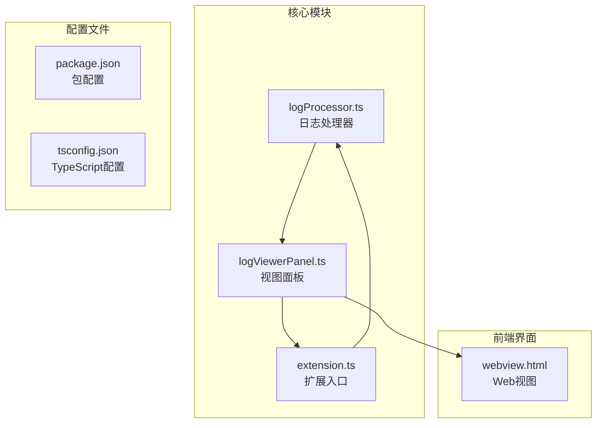
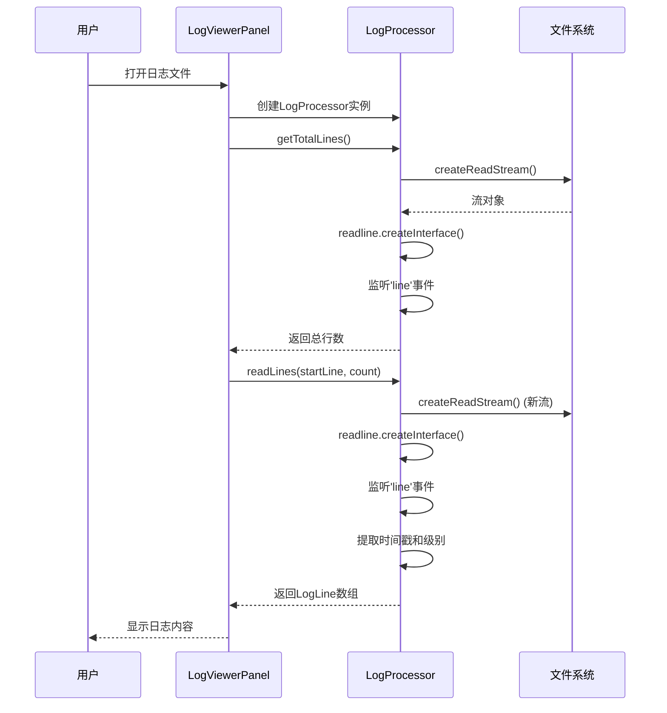
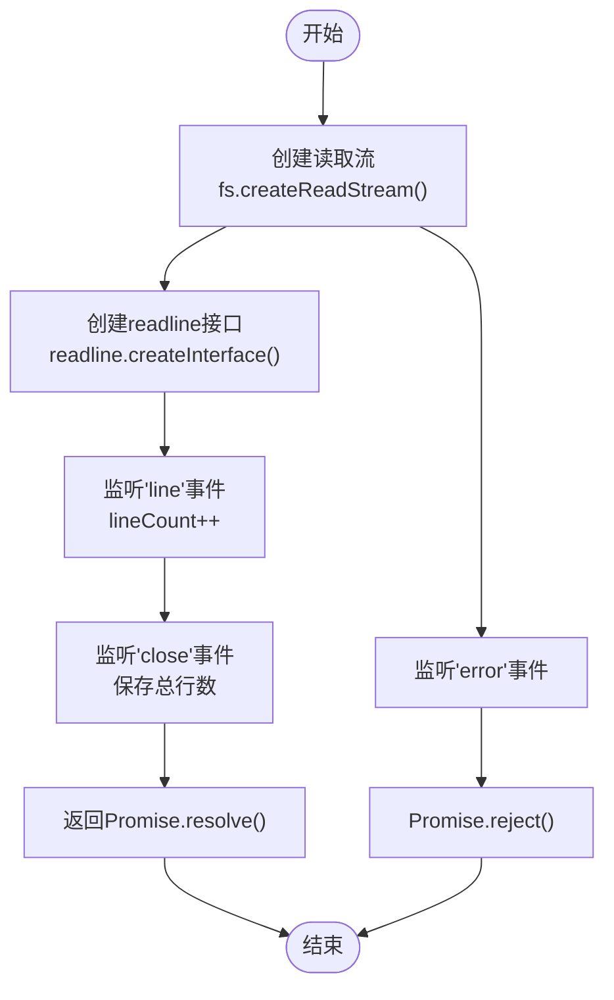
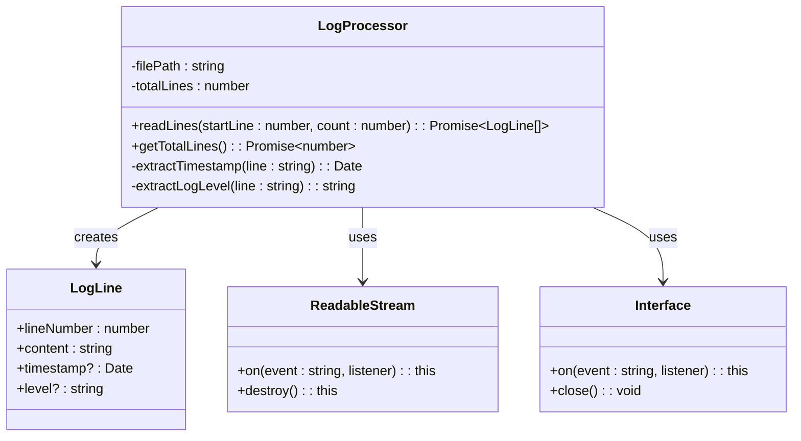
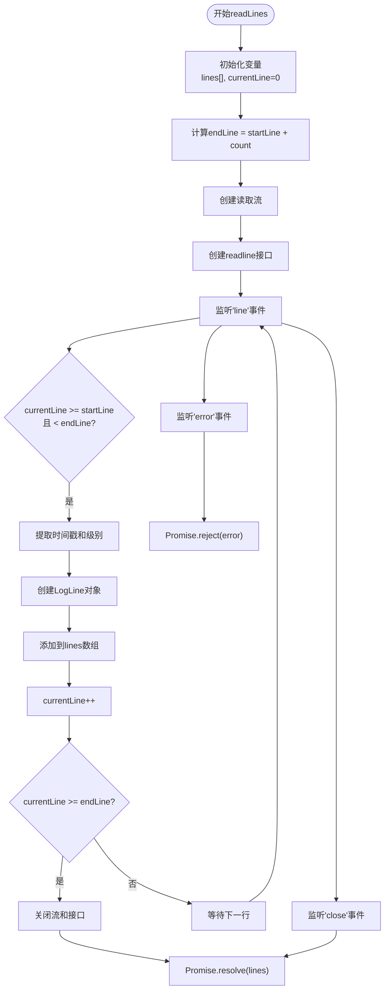
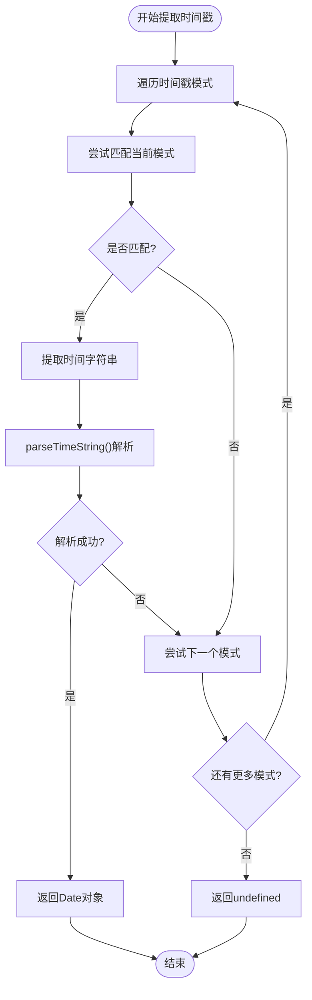
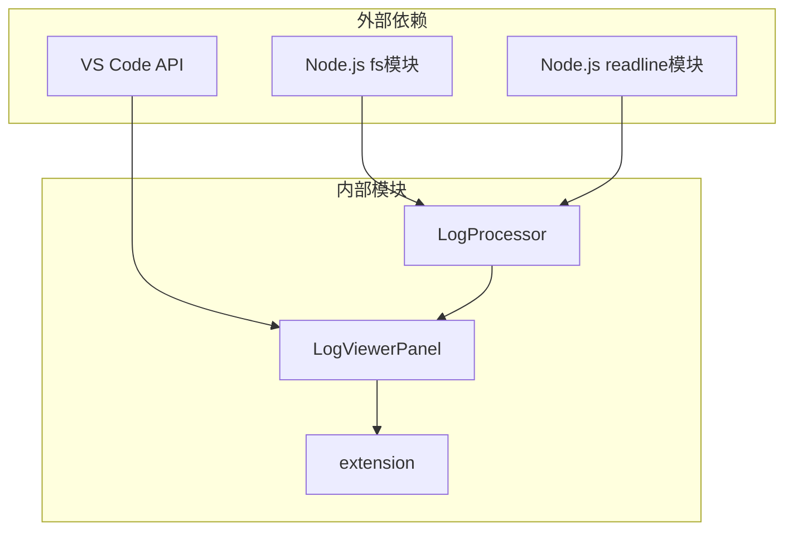
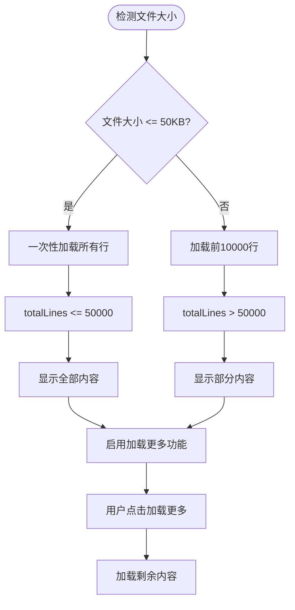

# 文件读取与行处理

<cite>
**本文档中引用的文件**
- [logProcessor.ts](file://src/logProcessor.ts)
- [logViewerPanel.ts](file://src/logViewerPanel.ts)
- [extension.ts](file://src/extension.ts)
- [webview.html](file://src/webview.html)
</cite>

## 目录
1. [简介](#简介)
2. [项目结构概览](#项目结构概览)
3. [核心组件分析](#核心组件分析)
4. [架构概览](#架构概览)
5. [详细组件分析](#详细组件分析)
6. [依赖关系分析](#依赖关系分析)
7. [性能考虑](#性能考虑)
8. [故障排除指南](#故障排除指南)
9. [结论](#结论)

## 简介

本文档深入分析了VS Code扩展"大日志文件查看器"中的文件读取与行处理机制，重点关注`logProcessor.ts`文件中实现的高效大文件处理功能。该系统采用Node.js的流式处理技术，通过`fs.createReadStream`和`readline.createInterface`实现了对超大日志文件的内存友好型读取，同时提供了丰富的日志分析功能。

## 项目结构概览

该项目采用模块化架构，主要包含以下核心文件：

**图表来源**
- [logProcessor.ts](file://src/logProcessor.ts#L1-L50)
- [logViewerPanel.ts](file://src/logViewerPanel.ts#L1-L50)
- [extension.ts](file://src/extension.ts#L1-L30)

**章节来源**
- [logProcessor.ts](file://src/logProcessor.ts#L1-L807)
- [logViewerPanel.ts](file://src/logViewerPanel.ts#L1-L200)

## 核心组件分析

### LogProcessor类设计

`LogProcessor`类是整个系统的核心，负责处理各种日志文件操作。该类的设计体现了以下关键特性：

- **流式处理**: 使用Node.js的流式API避免内存溢出
- **异步操作**: 所有文件操作都是异步的，不会阻塞主线程
- **错误处理**: 完善的错误捕获和处理机制
- **资源管理**: 自动的资源清理和流销毁

### 数据结构定义

系统定义了两个核心接口：

- **LogLine**: 单行日志的数据结构
- **LogStats**: 日志统计信息的数据结构

**章节来源**
- [logProcessor.ts](file://src/logProcessor.ts#L4-L28)

## 架构概览

系统的整体架构采用分层设计，从底层的文件读取到上层的用户交互：

**图表来源**
- [logViewerPanel.ts](file://src/logViewerPanel.ts#L107-L148)
- [logProcessor.ts](file://src/logProcessor.ts#L63-L129)

## 详细组件分析

### getTotalLines方法实现

`getTotalLines`方法是系统中最基础但最重要的功能之一，用于计算文件的总行数。

#### 实现原理

**图表来源**
- [logProcessor.ts](file://src/logProcessor.ts#L63-L84)

#### 关键特性

1. **内存效率**: 只维护一个计数器变量，不存储任何行内容
2. **事件驱动**: 使用事件监听机制处理每一行
3. **Promise封装**: 提供异步操作的Promise接口
4. **错误处理**: 完善的错误捕获机制

#### 代码实现要点

- **crlfDelay设置**: 使用`Infinity`确保正确处理不同平台的换行符
- **事件绑定**: 三个关键事件的处理逻辑
- **状态保持**: 将计算结果缓存在类属性中

**章节来源**
- [logProcessor.ts](file://src/logProcessor.ts#L63-L84)

### readLines方法实现

`readLines`方法是最复杂的文件读取功能，实现了高效的分段读取。

#### 实现架构

**图表来源**
- [logProcessor.ts](file://src/logProcessor.ts#L89-L129)

#### 核心算法流程

**图表来源**
- [logProcessor.ts](file://src/logProcessor.ts#L90-L129)

#### 性能优化特性

1. **早期终止**: 当读取到足够行数时立即关闭流
2. **内存控制**: 只缓存需要的行，避免内存泄漏
3. **资源清理**: 自动销毁不需要的流对象
4. **精确控制**: 支持任意起始位置和行数的读取

**章节来源**
- [logProcessor.ts](file://src/logProcessor.ts#L89-L129)

### 时间戳提取机制

系统实现了强大的时间戳提取功能，支持多种时间格式：

#### 时间戳匹配模式

| 格式类型 | 正则表达式 | 示例 |
|---------|-----------|------|
| 标准日期时间 | `\d{4}-\d{2}-\d{2}\s+\d{2}:\d{2}:\d{2}` | `2024-01-01 12:00:00` |
| 斜杠分隔 | `\d{4}\/\d{2}\/\d{2}\s+\d{2}:\d{2}:\d{2}` | `2024/01/01 12:00:00` |
| 方括号包裹 | `\[\\d{4}-\\d{2}-\\d{2}\\s+\\d{2}:\\d{2}:\\d{2}\]` | `[2024-01-01 12:00:00]` |
| 短日期格式 | `\d{2}-\d{2}-\d{4}\s+\d{2}:\d{2}:\d{2}` | `01-01-2024 12:00:00` |
| ISO 8601 | `\d{4}-\d{2}-\d{2}T\d{2}:\d{2}:\d{2}` | `2024-01-01T12:00:00` |

#### 提取算法

**图表来源**
- [logProcessor.ts](file://src/logProcessor.ts#L479-L491)

**章节来源**
- [logProcessor.ts](file://src/logProcessor.ts#L34-L46)
- [logProcessor.ts](file://src/logProcessor.ts#L479-L491)

### 日志级别提取机制

系统实现了智能的日志级别识别功能：

#### 级别匹配优先级

1. **快速匹配**: 针对常见格式的快速正则匹配
2. **模式匹配**: 使用预定义的正则表达式模式
3. **优先级排序**: 按严重程度从高到低排列

#### 级别映射表

| 提取到的级别 | 最终级别 | 描述 |
|-------------|---------|------|
| ERROR, FATAL, SEVERE | ERROR | 错误级别 |
| WARN, WARNING | WARN | 警告级别 |
| INFO, INFORMATION | INFO | 信息级别 |
| DEBUG, TRACE, VERBOSE | DEBUG | 调试级别 |

**章节来源**
- [logProcessor.ts](file://src/logProcessor.ts#L48-L54)
- [logProcessor.ts](file://src/logProcessor.ts#L541-L560)

## 依赖关系分析

系统的依赖关系体现了清晰的分层架构：

**图表来源**
- [logProcessor.ts](file://src/logProcessor.ts#L1-L3)
- [logViewerPanel.ts](file://src/logViewerPanel.ts#L1-L5)

### 模块间交互

1. **extension.ts**: 扩展入口点，注册命令和初始化
2. **logViewerPanel.ts**: VS Code Webview面板，处理用户交互
3. **logProcessor.ts**: 核心业务逻辑，处理文件读取和分析

**章节来源**
- [extension.ts](file://src/extension.ts#L1-L116)
- [logViewerPanel.ts](file://src/logViewerPanel.ts#L1-L200)

## 性能考虑

### 流式处理的优势

1. **内存效率**: 不需要将整个文件加载到内存
2. **响应性**: 异步处理不会阻塞UI线程
3. **可扩展性**: 支持任意大小的文件处理

### 性能优化建议

#### crlfDelay配置

- **推荐值**: `Infinity` - 确保正确处理不同平台的换行符
- **影响**: 影响流的缓冲行为和内存使用

#### 早期终止策略

- **readLines方法**: 在读取足够行数后立即关闭流
- **findLineByTime方法**: 找到目标行后立即停止读取
- **资源清理**: 使用`stream.destroy()`释放资源

#### 缓存机制

- **totalLines缓存**: 计算一次，多次使用
- **正则表达式编译**: 一次性编译，重复使用

### 大文件处理策略

基于文件大小的智能加载策略：

**图表来源**
- [logViewerPanel.ts](file://src/logViewerPanel.ts#L118-L128)

## 故障排除指南

### 常见问题及解决方案

#### 文件读取失败

**症状**: Promise被拒绝，出现错误
**原因**: 
- 文件不存在或权限不足
- 文件格式不正确
- 磁盘空间不足

**解决方案**:
- 检查文件路径和权限
- 验证文件格式兼容性
- 确保有足够的磁盘空间

#### 内存使用过高

**症状**: 应用程序响应缓慢，内存占用持续增长
**原因**:
- 流未正确关闭
- 大量行数据累积
- 正则表达式匹配效率低

**解决方案**:
- 确保流在适当时候关闭
- 限制单次读取的行数
- 优化正则表达式模式

#### 时间戳解析失败

**症状**: 时间戳字段为空或显示错误
**原因**:
- 日志格式不符合预期
- 时间格式不支持
- 字符编码问题

**解决方案**:
- 检查日志文件的实际格式
- 添加新的时间格式支持
- 验证文件编码

**章节来源**
- [logProcessor.ts](file://src/logProcessor.ts#L81-L83)
- [logProcessor.ts](file://src/logProcessor.ts#L116-L119)

## 结论

该系统通过精心设计的流式处理机制，成功实现了对超大日志文件的高效处理。主要优势包括：

1. **内存友好**: 采用流式处理避免内存溢出
2. **性能优异**: 异步操作和早期终止策略
3. **功能丰富**: 支持多种日志分析需求
4. **易于扩展**: 清晰的架构便于功能扩展

通过合理使用Node.js的流式API和精心设计的算法，该系统能够在保证性能的同时提供丰富的日志分析功能，为开发者提供了强大的日志处理工具。