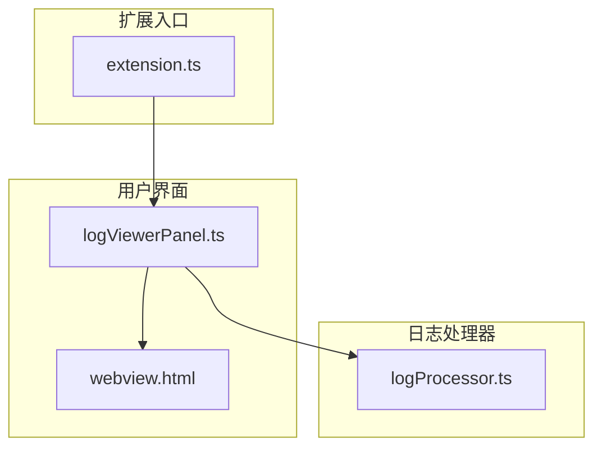
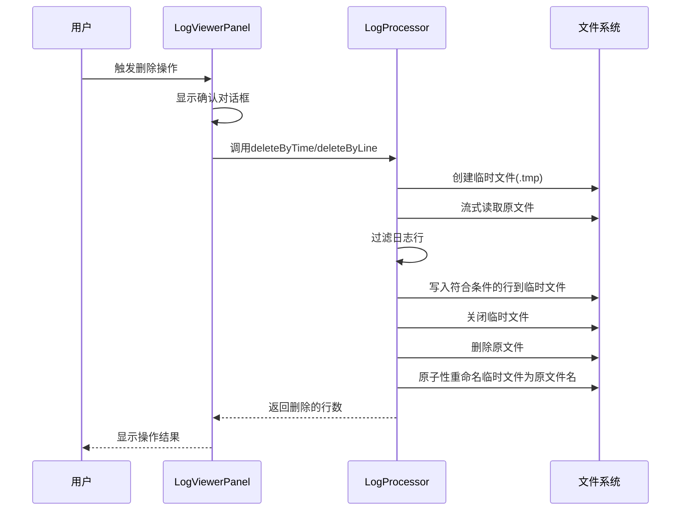
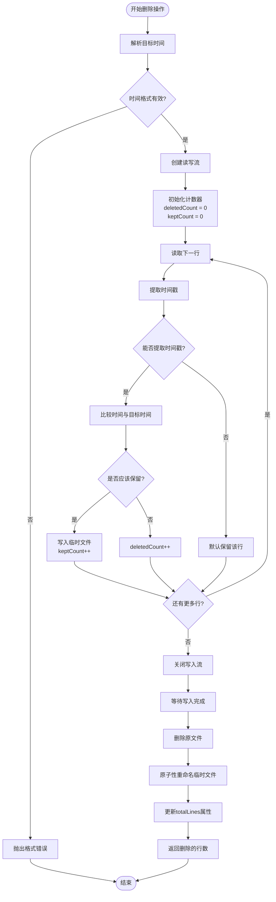
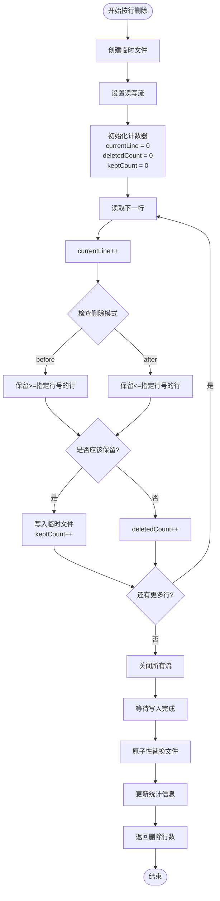
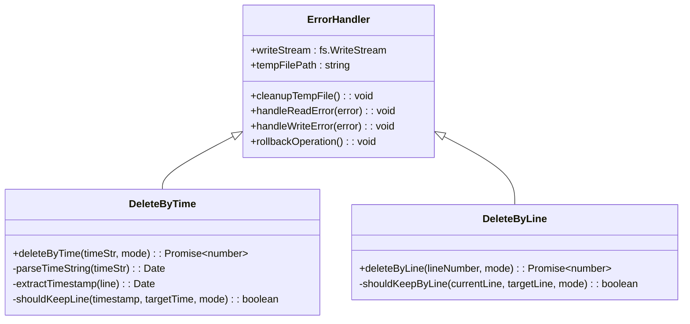
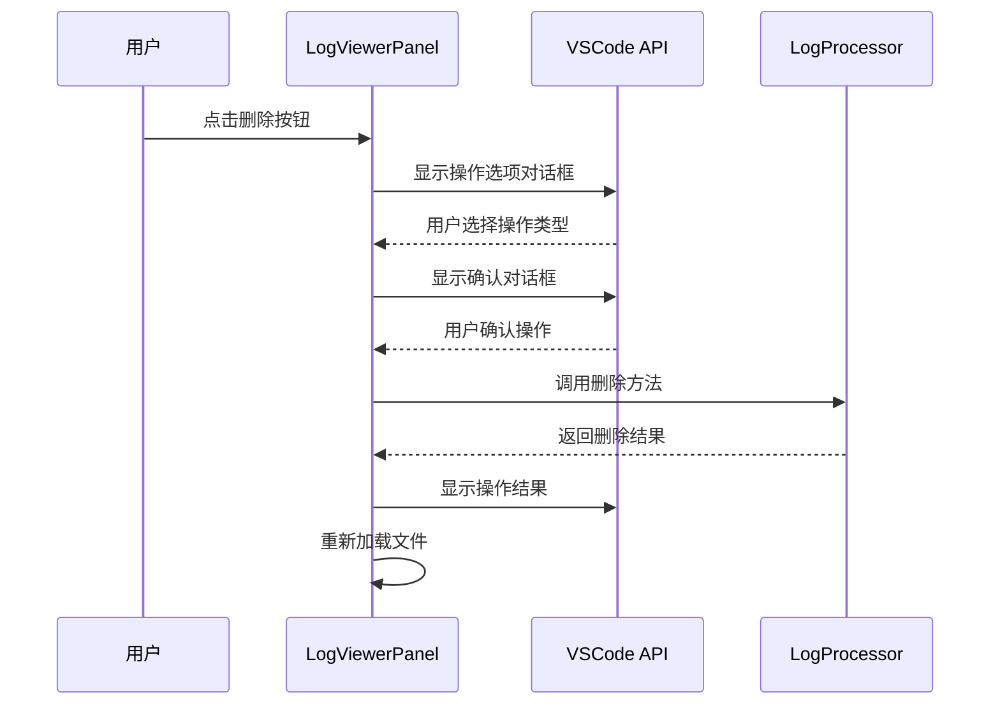
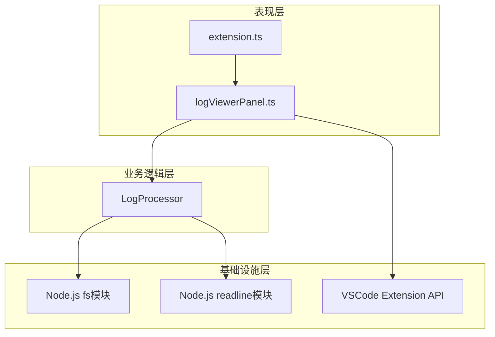

# 日志删除操作

<cite>
**本文档中引用的文件**
- [logProcessor.ts](file://src/logProcessor.ts)
- [extension.ts](file://src/extension.ts)
- [logViewerPanel.ts](file://src/logViewerPanel.ts)
- [package.json](file://package.json)
- [README.md](file://README.md)
</cite>

## 目录
1. [简介](#简介)
2. [项目结构概览](#项目结构概览)
3. [核心组件分析](#核心组件分析)
4. [架构概览](#架构概览)
5. [详细组件分析](#详细组件分析)
6. [依赖关系分析](#依赖关系分析)
7. [性能考虑](#性能考虑)
8. [故障排除指南](#故障排除指南)
9. [结论](#结论)

## 简介

大日志文件查看器是一个专业的VSCode扩展，专门用于处理大型日志文件（支持几十MB甚至GB级别的文件）。该项目的核心功能之一是安全的日志删除操作，通过`deleteByTime`和`deleteByLine`两个方法实现了对日志文件的永久性修改。这些方法采用了先进的文件修改策略，确保数据安全和操作的原子性。

## 项目结构概览

该项目采用模块化的架构设计，主要包含以下核心文件：

**图表来源**
- [extension.ts](file://src/extension.ts#L1-L116)
- [logViewerPanel.ts](file://src/logViewerPanel.ts#L1-L510)
- [logProcessor.ts](file://src/logProcessor.ts#L1-L807)

**章节来源**
- [package.json](file://package.json#L1-L94)
- [README.md](file://README.md#L1-L286)

## 核心组件分析

### LogProcessor类

LogProcessor类是整个日志处理系统的核心，负责所有日志相关的操作，包括读取、搜索、过滤和删除。该类提供了两个关键的删除方法：

- **deleteByTime**: 按时间删除日志
- **deleteByLine**: 按行数删除日志

这两个方法都采用了相同的文件修改策略，确保操作的安全性和原子性。

**章节来源**
- [logProcessor.ts](file://src/logProcessor.ts#L30-L807)

## 架构概览

日志删除操作的整体架构遵循流式处理和原子性操作的设计原则：

**图表来源**
- [logViewerPanel.ts](file://src/logViewerPanel.ts#L180-L318)
- [logProcessor.ts](file://src/logProcessor.ts#L339-L474)

## 详细组件分析

### deleteByTime方法分析

deleteByTime方法实现了基于时间的精确日志删除功能：

#### 核心实现流程

**图表来源**
- [logProcessor.ts](file://src/logProcessor.ts#L339-L408)

#### 安全策略详解

1. **临时文件策略**：
   - 创建临时文件路径：`${this.filePath}.tmp`
   - 使用流式写入，避免内存溢出
   - 只保留符合条件的日志行

2. **原子性操作**：
   - 先删除原文件，再重命名临时文件
   - 确保操作的不可逆性
   - 防止文件损坏导致的数据丢失

3. **错误处理机制**：
   - 读取错误时清理临时文件
   - 写入错误时终止操作
   - 网络异常时提供清晰的错误信息

**章节来源**
- [logProcessor.ts](file://src/logProcessor.ts#L339-L408)

### deleteByLine方法分析

deleteByLine方法实现了基于行号的日志删除功能：

#### 核心实现流程

**图表来源**
- [logProcessor.ts](file://src/logProcessor.ts#L414-L474)

#### 关键特性

1. **行号精确控制**：
   - 支持"before"和"after"两种模式
   - 精确控制保留哪些行

2. **资源管理**：
   - 自动关闭所有文件流
   - 及时释放系统资源

3. **状态同步**：
   - 更新totalLines属性
   - 保持内部状态一致性

**章节来源**
- [logProcessor.ts](file://src/logProcessor.ts#L414-L474)

### 错误处理机制

两个删除方法都实现了完善的错误处理机制：

**图表来源**
- [logProcessor.ts](file://src/logProcessor.ts#L339-L408)
- [logProcessor.ts](file://src/logProcessor.ts#L414-L474)

**章节来源**
- [logProcessor.ts](file://src/logProcessor.ts#L339-L408)
- [logProcessor.ts](file://src/logProcessor.ts#L414-L474)

### 用户界面集成

LogViewerPanel类负责与用户界面的交互，提供了安全的操作流程：

#### 删除操作确认流程

**图表来源**
- [logViewerPanel.ts](file://src/logViewerPanel.ts#L180-L318)

**章节来源**
- [logViewerPanel.ts](file://src/logViewerPanel.ts#L180-L318)

## 依赖关系分析

项目的依赖关系体现了清晰的分层架构：

**图表来源**
- [extension.ts](file://src/extension.ts#L1-L116)
- [logViewerPanel.ts](file://src/logViewerPanel.ts#L1-L510)
- [logProcessor.ts](file://src/logProcessor.ts#L1-L807)

**章节来源**
- [extension.ts](file://src/extension.ts#L1-L116)
- [logViewerPanel.ts](file://src/logViewerPanel.ts#L1-L510)
- [logProcessor.ts](file://src/logProcessor.ts#L1-L807)

## 性能考虑

### 流式处理优势

1. **内存效率**：
   - 使用readline模块逐行读取
   - 避免将整个文件加载到内存
   - 支持处理任意大小的日志文件

2. **并发处理**：
   - 异步I/O操作
   - 不阻塞主线程
   - 支持大文件的实时处理

3. **资源管理**：
   - 及时关闭文件句柄
   - 自动垃圾回收
   - 防止内存泄漏

### 时间复杂度分析

- **时间复杂度**：O(n)，其中n是文件的总行数
- **空间复杂度**：O(1)，只使用固定数量的变量
- **I/O复杂度**：O(n)，需要读取和写入每一行

## 故障排除指南

### 常见问题及解决方案

#### 1. 文件权限错误
**症状**：删除操作失败，提示权限不足
**解决方案**：
- 确保文件具有写权限
- 检查文件是否被其他程序占用
- 以管理员权限运行VSCode

#### 2. 磁盘空间不足
**症状**：临时文件创建失败
**解决方案**：
- 清理磁盘空间
- 检查临时文件夹权限
- 减少同时处理的文件数量

#### 3. 时间格式解析错误
**症状**：无法解析时间字符串
**解决方案**：
- 使用支持的时间格式：`YYYY-MM-DD HH:mm:ss`
- 检查时间字符串的格式正确性
- 验证时间值的有效性

#### 4. 文件锁定问题
**症状**：无法删除原文件
**解决方案**：
- 确保文件流已正确关闭
- 检查是否有其他进程持有文件句柄
- 重启VSCode解决锁定问题

**章节来源**
- [logProcessor.ts](file://src/logProcessor.ts#L339-L408)
- [logProcessor.ts](file://src/logProcessor.ts#L414-L474)

## 结论

大日志文件查看器的删除操作实现展现了优秀的软件工程实践：

### 主要优势

1. **安全性**：通过临时文件和原子性操作确保数据安全
2. **可靠性**：完善的错误处理和资源管理机制
3. **性能**：流式处理支持大文件的高效处理
4. **用户体验**：直观的操作界面和明确的确认流程

### 最佳实践

1. **文件操作**：始终使用临时文件进行修改操作
2. **错误处理**：及时清理临时资源，防止资源泄漏
3. **用户确认**：提供明确的操作确认和风险提示
4. **状态同步**：保持内部状态与文件状态的一致性

### 使用建议

1. **数据备份**：在执行删除操作前务必备份重要日志
2. **格式验证**：确保时间格式符合预期格式
3. **权限检查**：确认文件具有适当的读写权限
4. **监控进度**：对于大文件，耐心等待操作完成

这种设计不仅保证了操作的安全性和可靠性，还为用户提供了高效、便捷的日志管理体验，是大型日志文件处理领域的优秀实践案例。