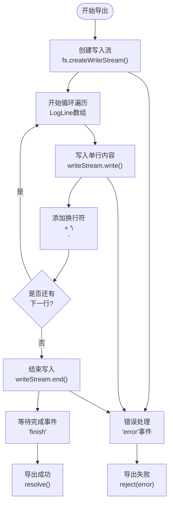
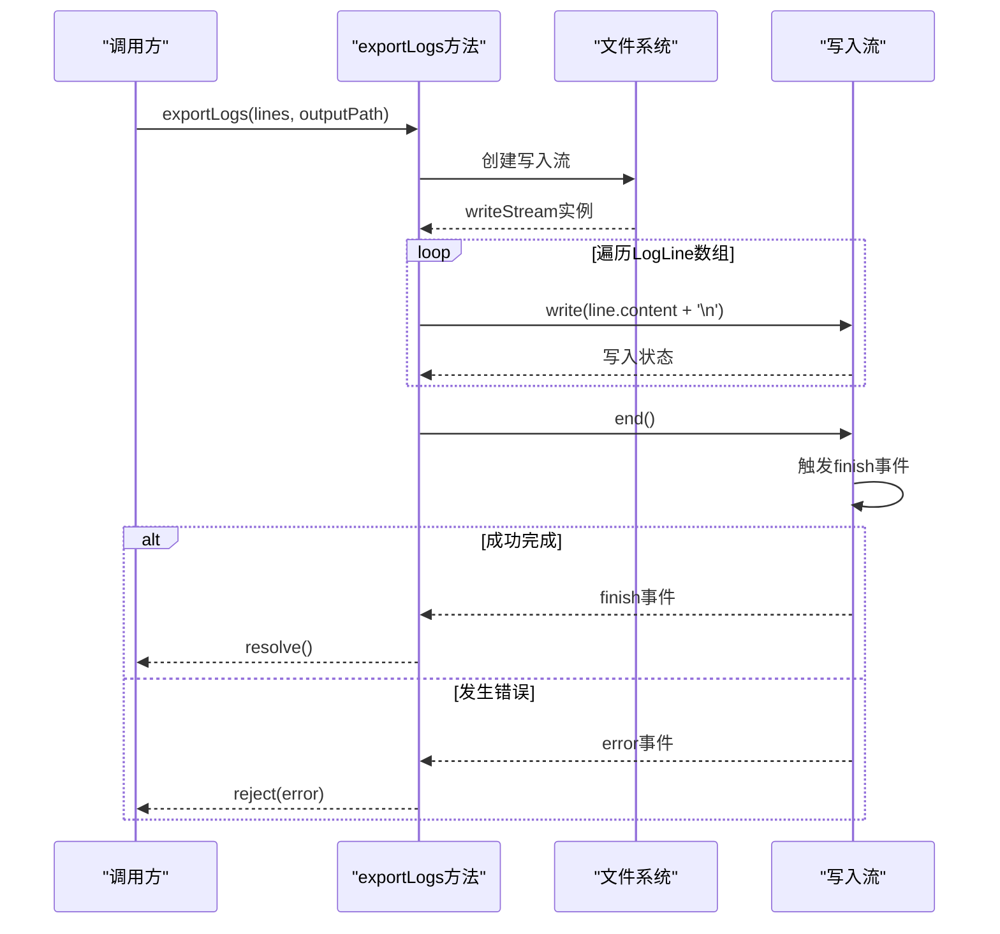
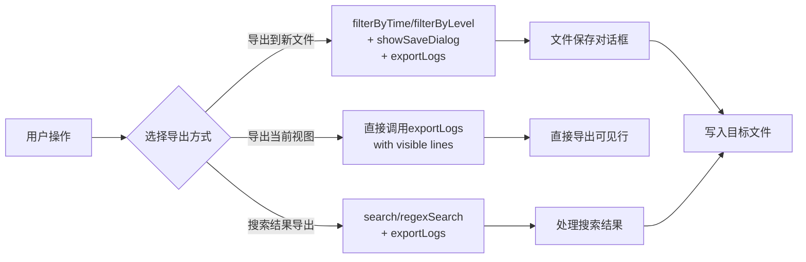
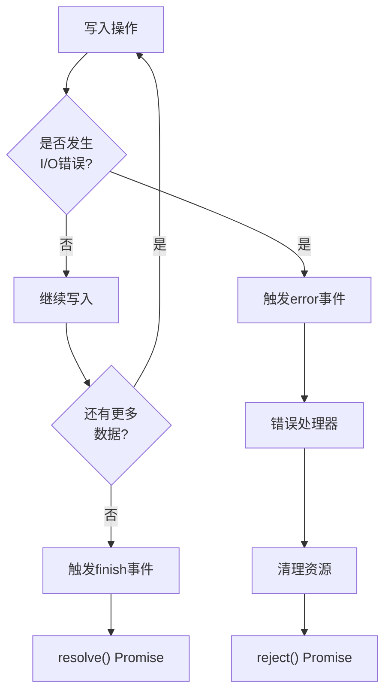

# 日志导出功能

<cite>
**本文档中引用的文件**
- [logProcessor.ts](file://src/logProcessor.ts)
- [logViewerPanel.ts](file://src/logViewerPanel.ts)
- [extension.ts](file://src/extension.ts)
- [package.json](file://package.json)
</cite>

## 目录
1. [简介](#简介)
2. [exportLogs方法概述](#exportlogs方法概述)
3. [核心实现细节](#核心实现细节)
4. [使用场景分析](#使用场景分析)
5. [性能特性](#性能特性)
6. [错误处理机制](#错误处理机制)
7. [最佳实践建议](#最佳实践建议)
8. [总结](#总结)

## 简介

`exportLogs`方法是大日志文件查看器扩展中的核心功能之一，专门负责将经过过滤或搜索得到的日志数据导出到指定的文件系统位置。该方法采用异步编程模式，利用Node.js的文件系统模块实现高效的文件写入操作，为用户提供便捷的日志持久化解决方案。

## exportLogs方法概述

### 方法签名与参数

```typescript
async exportLogs(lines: LogLine[], outputPath: string): Promise<void>
```

该方法接收两个主要参数：
- `lines`: LogLine数组，包含需要导出的日志行数据
- `outputPath`: 字符串类型的目标文件路径

### 数据结构定义

LogLine接口定义了日志行的基本结构：

```typescript
interface LogLine {
    lineNumber: number;
    content: string;
    timestamp?: Date;
    level?: string;
}
```

其中`content`属性包含了实际的日志文本内容，这是导出过程中需要写入文件的核心数据。

**节来源**
- [logProcessor.ts](file://src/logProcessor.ts#L4-L8)
- [logProcessor.ts](file://src/logProcessor.ts#L754-L770)

## 核心实现细节

### 流式写入架构

exportLogs方法采用了流式写入架构，通过以下步骤实现高效的文件导出：



**图表来源**
- [logProcessor.ts](file://src/logProcessor.ts#L754-L770)

### 关键实现步骤

1. **创建写入流**：使用`fs.createWriteStream()`创建文件写入流
2. **逐行写入**：通过for...of循环遍历LogLine数组，将每行的content属性写入文件
3. **换行符处理**：在每行内容后添加`\n`换行符，确保日志行的正确分隔
4. **流结束**：调用`writeStream.end()`方法结束写入过程
5. **事件监听**：
   - 监听`finish`事件确认写入完成
   - 监听`error`事件处理可能的I/O错误

### 代码执行流程



**图表来源**
- [logProcessor.ts](file://src/logProcessor.ts#L754-L770)

**节来源**
- [logProcessor.ts](file://src/logProcessor.ts#L754-L770)

## 使用场景分析

### 与filterByTime方法的集成

exportLogs方法经常与`filterByTime`方法配合使用，用于导出特定时间段的日志数据：

```typescript
// 示例：导出指定时间之后的日志
const filteredLogs = await logProcessor.filterByTime('2024-01-01 12:00:00', 'after', true);
await logProcessor.exportLogs(filteredLogs, '/path/to/exported.log');
```

### 与search方法的集成

结合搜索功能，可以导出包含特定关键词的日志：

```typescript
// 示例：导出包含错误信息的日志
const searchResults = await logProcessor.search('ERROR', false);
await logProcessor.exportLogs(searchResults, '/path/to/error_logs.log');
```

### LogViewerPanel中的实际应用

在LogViewerPanel类中，exportLogs方法被广泛应用于各种用户交互场景：



**图表来源**
- [logViewerPanel.ts](file://src/logViewerPanel.ts#L180-L221)
- [logViewerPanel.ts](file://src/logViewerPanel.ts#L466-L482)

**节来源**
- [logViewerPanel.ts](file://src/logViewerPanel.ts#L180-L221)
- [logViewerPanel.ts](file://src/logViewerPanel.ts#L466-L482)

## 性能特性

### 异步非阻塞设计

exportLogs方法采用Promise-based异步设计，具有以下性能优势：

1. **非阻塞I/O**：使用Node.js的异步文件操作，避免阻塞主线程
2. **内存效率**：逐行写入而非一次性加载所有数据到内存
3. **流式处理**：适合处理大型日志文件，不会因内存不足而崩溃

### 大文件处理能力

该方法特别适用于处理大型日志文件：

- **无内存限制**：只在内存中维护当前写入的行，而不是整个文件
- **渐进式写入**：随着数据的逐步写入，系统资源占用保持稳定
- **错误恢复**：单个文件写入失败不会影响其他行的处理

### 并发处理支持

虽然exportLogs本身是同步的，但其异步设计允许与其他操作并发执行：

```mermaid
gantt
title 导出操作时间线
dateFormat X
axisFormat %s
section 主线程
用户界面响应 :0, 1
其他操作 :1, 2
section 导出线程
创建流 :1, 2
写入第一行 :2, 3
写入第二行 :3, 4
写入第三行 :4, 5
完成写入 :5, 6
```



## 错误处理机制

### 多层次错误捕获

exportLogs方法实现了完善的错误处理机制：



**图表来源**
- [logProcessor.ts](file://src/logProcessor.ts#L767-L769)

### 错误类型与处理策略

1. **文件权限错误**：当目标路径不可写时抛出
2. **磁盘空间不足**：写入过程中检测到磁盘空间不足
3. **路径不存在**：目标目录不存在时的处理
4. **网络存储问题**：对于网络文件系统的特殊处理

### 错误恢复机制

```typescript
// 错误处理示例
try {
    await logProcessor.exportLogs(logLines, outputPath);
    vscode.window.showInformationMessage(`成功导出 ${logLines.length} 行日志`);
} catch (error) {
    vscode.window.showErrorMessage(`导出失败: ${error.message}`);
    // 可以在这里实现重试逻辑或降级方案
}
```

**节来源**
- [logProcessor.ts](file://src/logProcessor.ts#L767-L769)

## 最佳实践建议

### 输出路径验证

在调用exportLogs方法之前，应该验证输出路径的有效性：

```typescript
// 路径有效性检查
async function validateOutputPath(path: string): Promise<boolean> {
    try {
        const dir = path.substring(0, path.lastIndexOf('/'));
        await fs.promises.access(dir, fs.constants.W_OK);
        return true;
    } catch (error) {
        return false;
    }
}
```

### 磁盘空间预检查

在开始导出之前，预先检查可用磁盘空间：

```typescript
// 磁盘空间检查
async function checkDiskSpace(path: string, requiredBytes: number): Promise<boolean> {
    try {
        const stats = await fs.promises.statvfs(path);
        const availableBytes = stats.bavail * stats.bsize;
        return availableBytes >= requiredBytes;
    } catch (error) {
        return true; // 无法确定时假设足够
    }
}
```

### 大文件导出策略

对于超大文件，建议采用分批导出策略：

```typescript
// 分批导出示例
async function exportLargeLogFile(logLines: LogLine[], outputPath: string, batchSize: number = 10000) {
    for (let i = 0; i < logLines.length; i += batchSize) {
        const batch = logLines.slice(i, i + batchSize);
        await logProcessor.exportLogs(batch, outputPath);
        // 可以在这里添加进度报告
    }
}
```

### 文件命名规范

建议使用有意义的文件名：

```typescript
// 自动生成文件名
function generateExportFileName(basePath: string, operationType: string, timestamp: Date = new Date()): string {
    const dateStr = timestamp.toISOString().split('T')[0];
    const timeStr = timestamp.toTimeString().split(' ')[0].replace(/:/g, '-');
    return `${basePath}_${operationType}_${dateStr}_${timeStr}.log`;
}
```

### 性能监控

在生产环境中，建议添加性能监控：

```typescript
// 性能监控示例
async function monitoredExport(logLines: LogLine[], outputPath: string): Promise<void> {
    const startTime = performance.now();
    
    try {
        await logProcessor.exportLogs(logLines, outputPath);
        const endTime = performance.now();
        console.log(`导出完成，耗时: ${(endTime - startTime).toFixed(2)}ms`);
    } catch (error) {
        console.error(`导出失败，耗时: ${performance.now() - startTime}ms`);
        throw error;
    }
}
```

## 总结

exportLogs方法是大日志文件查看器扩展中的核心组件，展现了优秀的软件设计原则：

### 设计优势

1. **简洁性**：方法接口简单明了，易于理解和使用
2. **可靠性**：完善的错误处理和资源管理机制
3. **性能**：异步流式写入，适合处理大型文件
4. **灵活性**：可与多种日志处理功能无缝集成

### 技术特点

- 采用Promise-based异步编程模型
- 使用Node.js流式文件操作API
- 实现了完整的事件驱动错误处理
- 支持大文件的渐进式处理

### 应用价值

该方法为开发者提供了强大的日志导出能力，支持：
- 时间范围筛选后的日志导出
- 关键词搜索结果的持久化
- 当前视图内容的快速保存
- 大规模日志数据的高效处理

通过合理的使用和适当的优化，exportLogs方法能够满足各种复杂的日志处理需求，是现代日志分析工具不可或缺的功能组件。