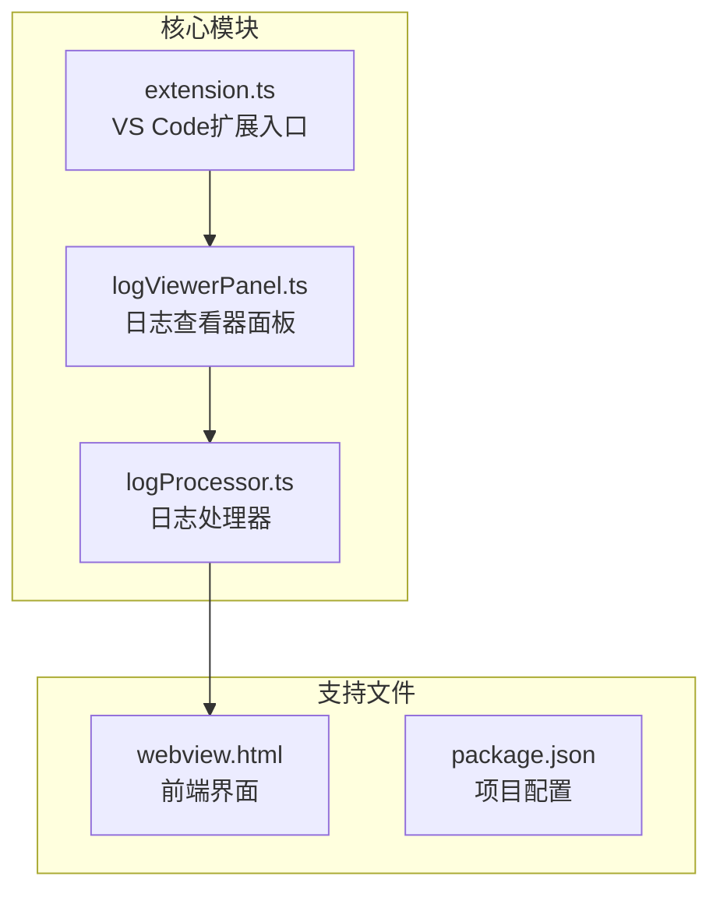
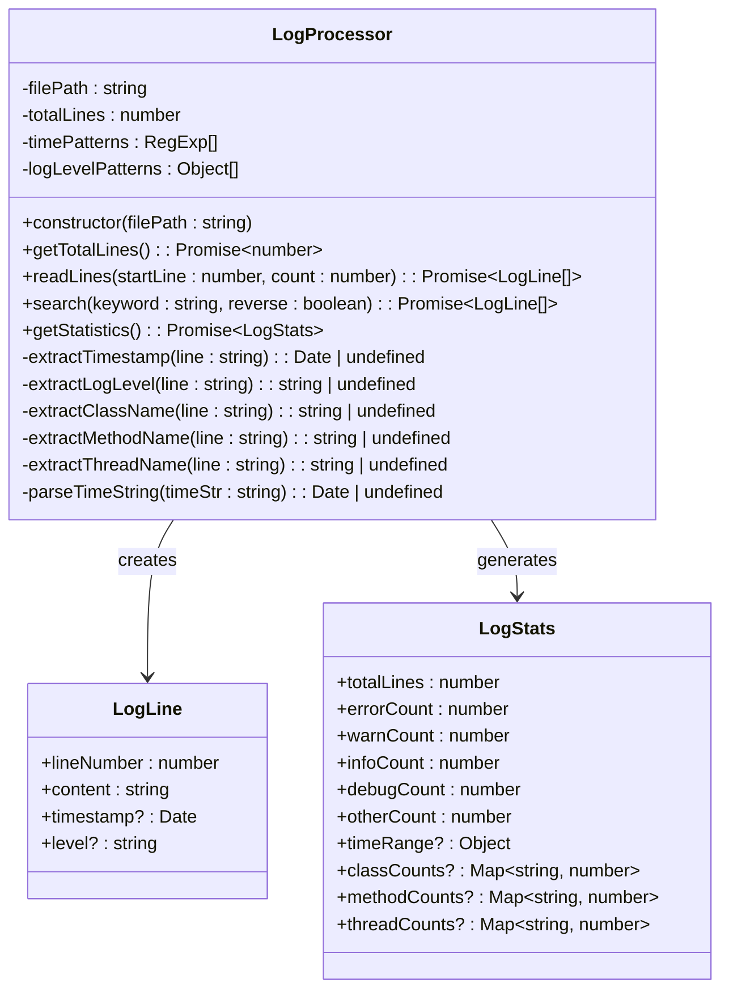
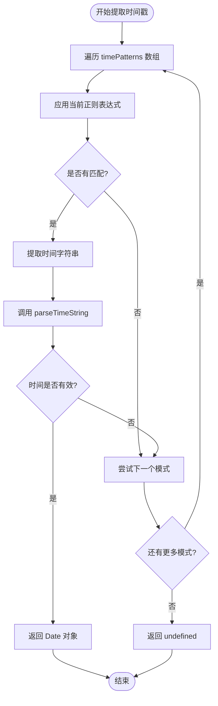
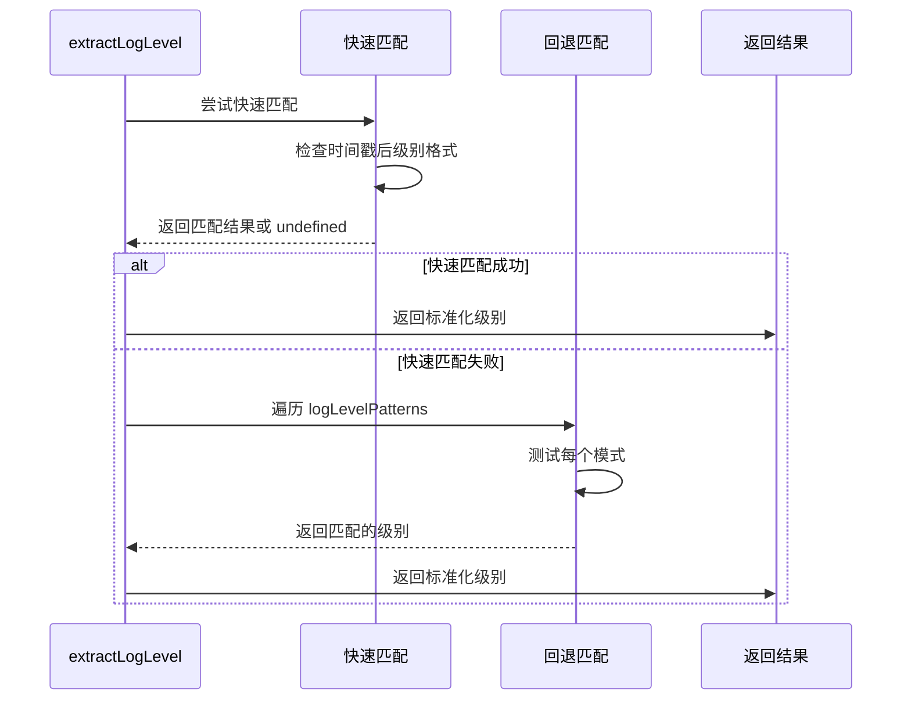
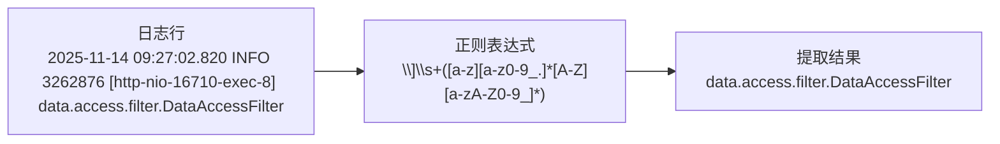
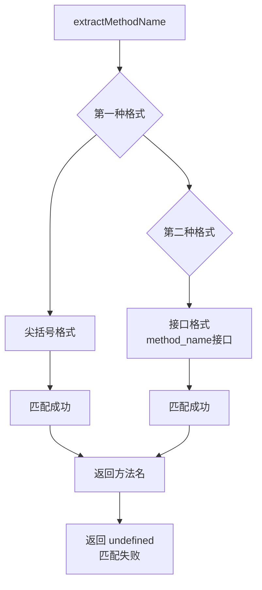
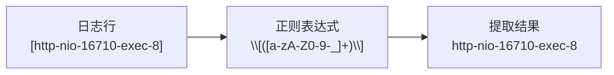
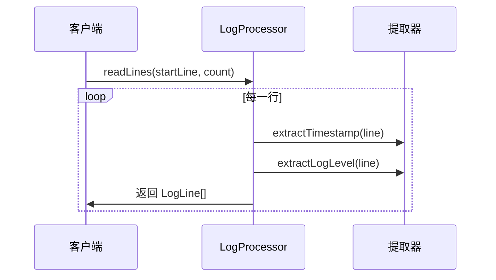
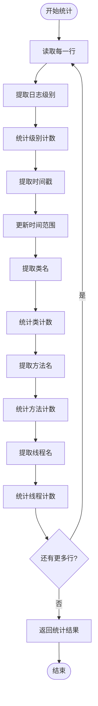
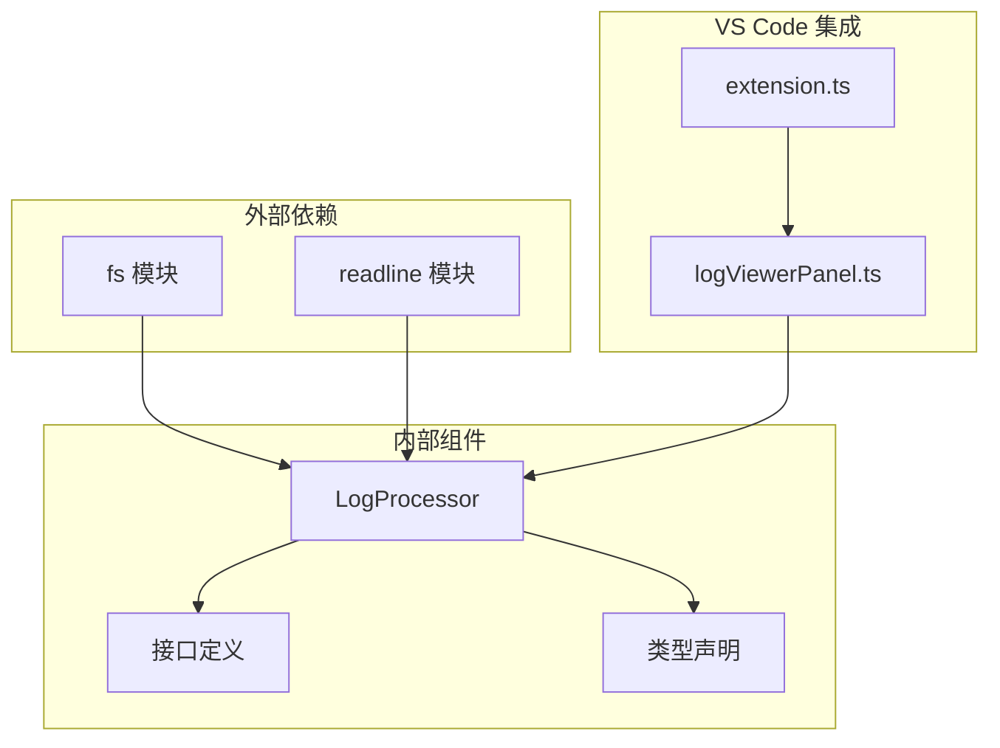

# 日志数据提取

<cite>
**本文档中引用的文件**
- [logProcessor.ts](file://src/logProcessor.ts)
- [extension.ts](file://src/extension.ts)
- [logViewerPanel.ts](file://src/logViewerPanel.ts)
</cite>

## 目录
1. [简介](#简介)
2. [项目结构](#项目结构)
3. [核心组件](#核心组件)
4. [架构概览](#架构概览)
5. [详细组件分析](#详细组件分析)
6. [依赖关系分析](#依赖关系分析)
7. [性能考虑](#性能考虑)
8. [故障排除指南](#故障排除指南)
9. [结论](#结论)

## 简介

本文档深入分析了大型日志文件查看器扩展中的 `logProcessor.ts` 文件，重点关注其用于解析日志行的私有提取方法。该系统专门设计用于高效处理大型日志文件，提供了强大的日志数据提取和分析功能。

LogProcessor 类是整个系统的核心，负责从各种格式的日志行中提取关键信息，包括时间戳、日志级别、类名、方法名和线程名。这些提取方法被广泛应用于系统的各个核心功能中，确保了日志数据的一致性和准确性。

## 项目结构

该项目采用模块化架构，主要文件组织如下：

**图表来源**
- [logProcessor.ts](file://src/logProcessor.ts#L1-L30)
- [logViewerPanel.ts](file://src/logViewerPanel.ts#L1-L10)

**章节来源**
- [logProcessor.ts](file://src/logProcessor.ts#L1-L807)
- [extension.ts](file://src/extension.ts#L1-L116)

## 核心组件

LogProcessor 类是系统的核心组件，包含以下关键特性：

### 主要接口定义

系统定义了两个核心接口来标准化日志数据结构：

- **LogLine**: 表示单行日志，包含行号、内容、可选的时间戳和日志级别
- **LogStats**: 包含日志统计信息，支持按类别、方法和线程进行分类统计

### 私有提取方法

系统实现了五个核心提取方法，每个都针对特定的日志元素进行了优化：

1. **extractTimestamp**: 时间戳提取
2. **extractLogLevel**: 日志级别提取  
3. **extractClassName**: Java类名提取
4. **extractMethodName**: 方法名提取
5. **extractThreadName**: 线程名提取

**章节来源**
- [logProcessor.ts](file://src/logProcessor.ts#L4-L28)
- [logProcessor.ts](file://src/logProcessor.ts#L30-L807)

## 架构概览

LogProcessor 采用了基于正则表达式的高效解析架构，支持多种日志格式：

**图表来源**
- [logProcessor.ts](file://src/logProcessor.ts#L4-L28)
- [logProcessor.ts](file://src/logProcessor.ts#L30-L807)

## 详细组件分析

### extractTimestamp 方法详解

extractTimestamp 是系统中最复杂的提取方法之一，专门设计用于识别多种时间戳格式。

#### 时间戳格式支持

系统支持以下时间戳格式：

| 格式类型 | 正则表达式 | 示例 |
|---------|-----------|------|
| 标准日期时间 | `\d{4}-\d{2}-\d{2}\s+\d{2}:\d{2}:\d{2}` | `2024-01-01 12:00:00` |
| 斜杠分隔符 | `\d{4}\/\d{2}\/\d{2}\s+\d{2}:\d{2}:\d{2}` | `2024/01/01 12:00:00` |
| 方括号包裹 | `\[\\d{4}-\\d{2}-\\d{2}\\s+\\d{2}:\\d{2}:\\d{2}\]` | `[2024-01-01 12:00:00]` |
| 反向日期 | `\d{2}-\d{2}-\d{4}\s+\d{2}:\d{2}:\d{2}` | `01-01-2024 12:00:00` |
| ISO 8601 | `\d{4}-\d{2}-\d{2}T\d{2}:\d{2}:\d{2}` | `2024-01-01T12:00:00` |

#### 解析流程

**图表来源**
- [logProcessor.ts](file://src/logProcessor.ts#L480-L492)

#### parseTimeString 实现

parseTimeString 方法负责将提取的时间字符串标准化并转换为 Date 对象：

- **标准化处理**: 替换斜杠为连字符，处理 T 分隔符
- **格式验证**: 支持多种日期格式，包括 DD-MM-YYYY 格式
- **错误处理**: 完善的错误检测机制

**章节来源**
- [logProcessor.ts](file://src/logProcessor.ts#L34-L46)
- [logProcessor.ts](file://src/logProcessor.ts#L480-L492)
- [logProcessor.ts](file://src/logProcessor.ts#L776-L804)

### extractLogLevel 方法详解

extractLogLevel 方法采用双重匹配策略，确保对各种日志格式的兼容性。

#### 双重匹配策略

**图表来源**
- [logProcessor.ts](file://src/logProcessor.ts#L542-L561)

#### 日志级别映射

系统支持以下日志级别及其别名：

| 标准级别 | 别名 | 正则模式 |
|---------|------|----------|
| ERROR | ERROR, FATAL, SEVERE | `/\[(ERROR\|FATAL\|SEVERE)\]`\|`\b(ERROR\|FATAL\|SEVERE)\s/i` |
| WARN | WARN, WARNING | `/\[(WARN\|WARNING)\]`\|`\b(WARN\|WARNING)\s/i` |
| INFO | INFO, INFORMATION | `/\[(INFO\|INFORMATION)\]`\|`\b(INFO\|INFORMATION)\s/i` |
| DEBUG | DEBUG, TRACE, VERBOSE | `/\[(DEBUG\|TRACE\|VERBOSE)\]`\|`\b(DEBUG\|TRACE\|VERBOSE)\s/i` |

**章节来源**
- [logProcessor.ts](file://src/logProcessor.ts#L48-L55)
- [logProcessor.ts](file://src/logProcessor.ts#L542-L561)

### extractClassName 方法详解

extractClassName 方法专门用于提取 Java 类名，采用精确的正则表达式匹配。

#### 匹配模式

**图表来源**
- [logProcessor.ts](file://src/logProcessor.ts#L498-L507)

#### 匹配规则

- **位置要求**: 类名必须出现在方括号后的空白字符之后
- **命名规范**: 必须遵循 Java 包名和类名的命名约定
- **完整性**: 返回完整的包名.类名格式

**章节来源**
- [logProcessor.ts](file://src/logProcessor.ts#L498-L507)

### extractMethodName 方法详解

extractMethodName 方法支持两种不同的方法名格式，体现了对不同日志风格的适应性。

#### 支持的格式

**图表来源**
- [logProcessor.ts](file://src/logProcessor.ts#L513-L525)

#### 匹配策略

1. **尖括号格式**: `<method_name>`，适用于 Spring 等框架的日志
2. **接口格式**: `method_name接口`，适用于某些国产框架

**章节来源**
- [logProcessor.ts](file://src/logProcessor.ts#L513-L525)

### extractThreadName 方法详解

extractThreadName 方法是最简单的提取方法，专注于从方括号中提取线程名称。

#### 匹配模式

**图表来源**
- [logProcessor.ts](file://src/logProcessor.ts#L531-L537)

#### 字符集限制

- **允许字符**: 字母、数字、连字符、下划线
- **灵活性**: 支持各种线程池命名约定

**章节来源**
- [logProcessor.ts](file://src/logProcessor.ts#L531-L537)

### 核心功能中的复用

这些提取方法在系统的核心功能中得到广泛应用：

#### readLines 功能

**图表来源**
- [logProcessor.ts](file://src/logProcessor.ts#L90-L120)

#### getStatistics 功能

统计功能展示了提取方法的综合应用：

**图表来源**
- [logProcessor.ts](file://src/logProcessor.ts#L566-L644)

**章节来源**
- [logProcessor.ts](file://src/logProcessor.ts#L90-L120)
- [logProcessor.ts](file://src/logProcessor.ts#L566-L644)

## 依赖关系分析

LogProcessor 类的依赖关系展现了清晰的模块化设计：

**图表来源**
- [logProcessor.ts](file://src/logProcessor.ts#L1-L3)
- [logViewerPanel.ts](file://src/logViewerPanel.ts#L1-L5)

**章节来源**
- [logProcessor.ts](file://src/logProcessor.ts#L1-L3)
- [logViewerPanel.ts](file://src/logViewerPanel.ts#L4-L5)

## 性能考虑

### 正则表达式优化

系统在正则表达式设计上采用了多项优化策略：

1. **预编译正则**: 所有正则表达式在类初始化时预编译
2. **优先级排序**: 时间戳和日志级别模式按匹配频率排序
3. **短路求值**: 快速匹配失败时立即回退到通用模式

### 内存管理

- **流式处理**: 使用 readline 模块实现流式读取，避免内存溢出
- **延迟加载**: 大文件采用分页加载策略
- **垃圾回收**: 及时释放不再需要的资源

### 并发处理

虽然当前实现是同步的，但系统架构支持异步操作，为未来的并发优化预留了空间。

## 故障排除指南

### 常见问题及解决方案

#### 时间戳提取失败

**症状**: 时间戳字段始终为 undefined
**原因**: 日志格式不在支持的时间戳模式中
**解决方案**: 
- 检查日志的实际格式
- 在 timePatterns 中添加新的正则表达式
- 使用 parseTimeString 进行手动调试

#### 日志级别识别错误

**症状**: 日志级别提取不准确
**原因**: 快速匹配策略未能识别特殊格式
**解决方案**:
- 检查 logLevelPatterns 的优先级
- 添加新的级别别名模式
- 调整正则表达式的匹配精度

#### 类名提取异常

**症状**: Java 类名提取失败
**原因**: 日志格式不符合预期的包名.类名格式
**解决方案**:
- 验证日志中类名的显示格式
- 调整正则表达式的匹配规则
- 检查类名是否包含特殊字符

**章节来源**
- [logProcessor.ts](file://src/logProcessor.ts#L480-L492)
- [logProcessor.ts](file://src/logProcessor.ts#L542-L561)

## 结论

LogProcessor 类展示了一个精心设计的日志处理系统，其核心提取方法具有以下优势：

### 设计亮点

1. **模块化架构**: 清晰分离关注点，便于维护和扩展
2. **多格式支持**: 全面覆盖主流日志格式
3. **性能优化**: 高效的正则表达式和流式处理
4. **错误处理**: 完善的边界情况处理

### 扩展建议

1. **格式增强**: 支持更多专业框架的日志格式
2. **性能提升**: 考虑引入缓存机制
3. **类型安全**: 使用 TypeScript 的高级类型特性
4. **测试覆盖**: 建立全面的单元测试套件

该系统为大型日志文件的处理提供了坚实的基础，其设计理念和实现方式值得在类似项目中借鉴和应用。