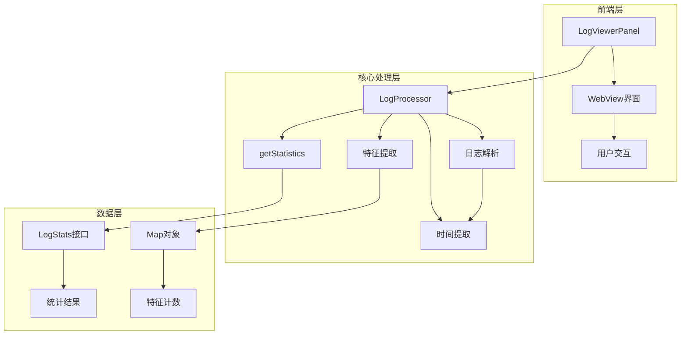
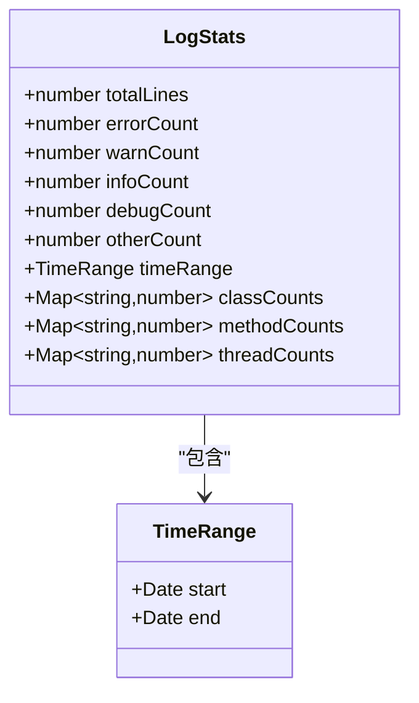
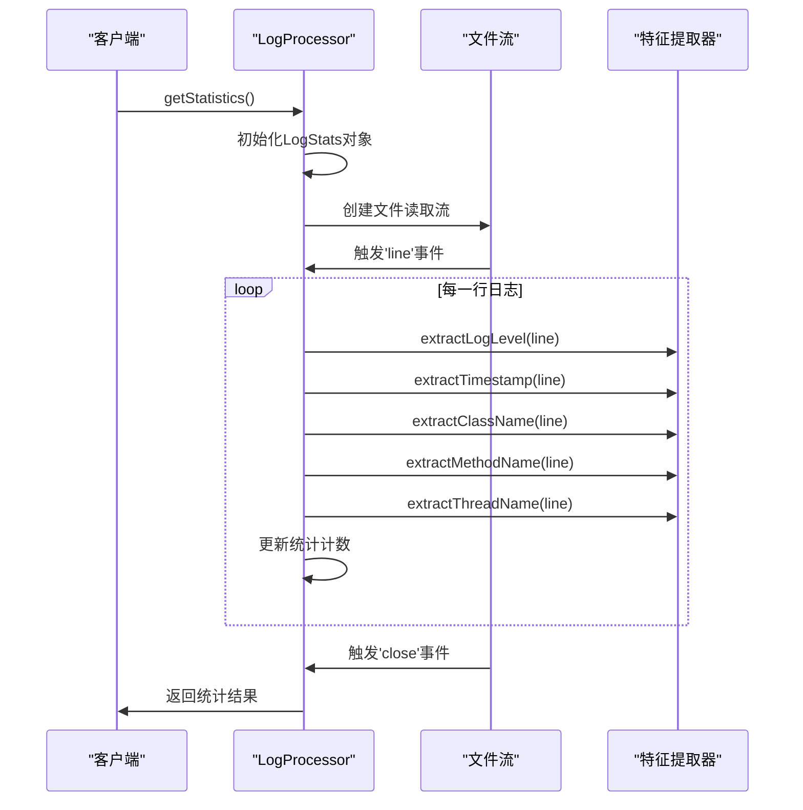
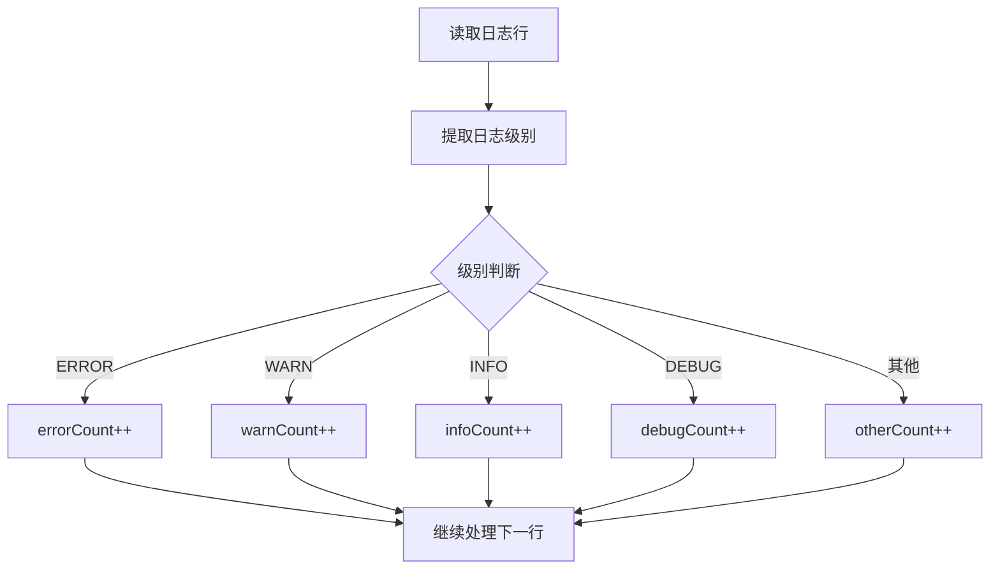
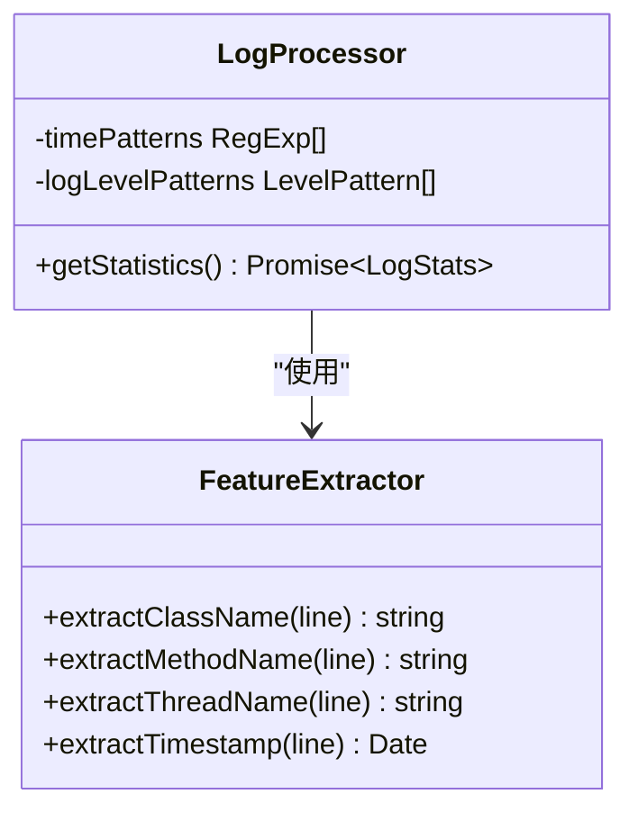
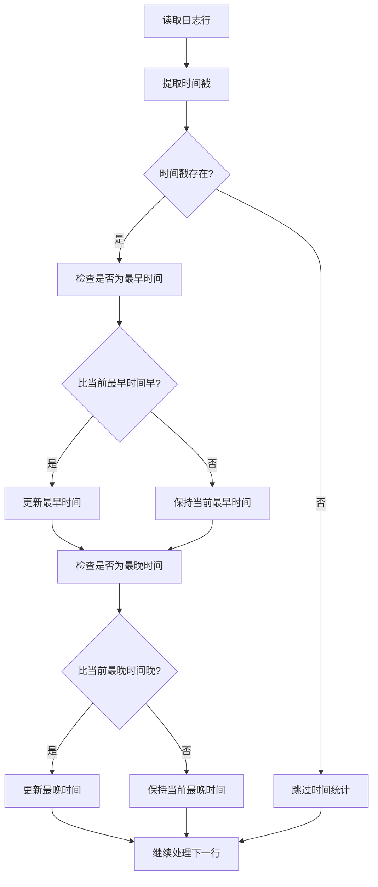
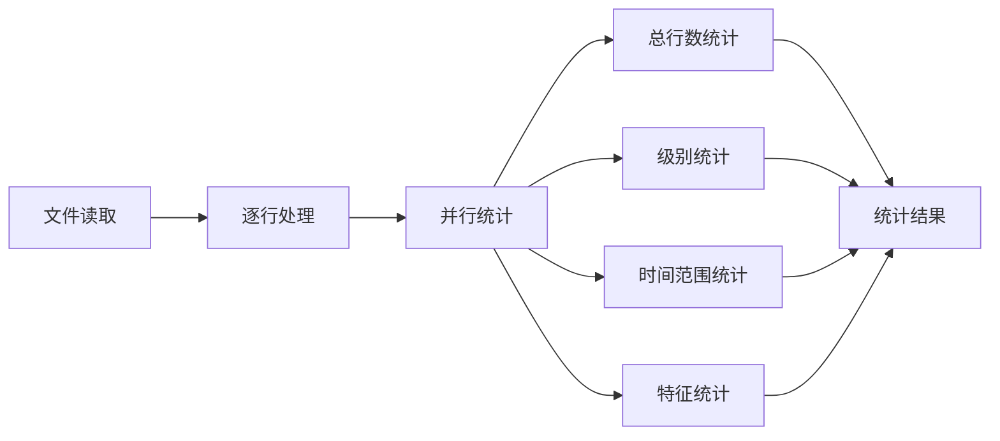
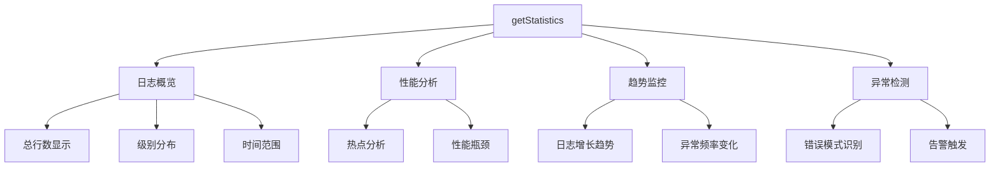

# 日志统计分析

<cite>
**本文档中引用的文件**
- [logProcessor.ts](file://src/logProcessor.ts)
- [logViewerPanel.ts](file://src/logViewerPanel.ts)
- [webview.html](file://src/webview.html)
- [extension.ts](file://src/extension.ts)
- [README.md](file://README.md)
</cite>

## 目录
1. [简介](#简介)
2. [项目结构概述](#项目结构概述)
3. [LogStats接口设计](#logstats接口设计)
4. [getStatistics方法实现详解](#getstatistics方法实现详解)
5. [核心统计功能分析](#核心统计功能分析)
6. [时间范围动态更新机制](#时间范围动态更新机制)
7. [多维度特征提取](#多维度特征提取)
8. [性能优化策略](#性能优化策略)
9. [应用场景与可视化](#应用场景与可视化)
10. [总结](#总结)

## 简介

大型日志文件查看器是一个专业的VSCode扩展，专门用于处理几十MB甚至GB级别的日志文件。该项目的核心功能之一是通过`getStatistics`方法实现高效的多维度日志统计分析，在单次文件遍历中完成总行数、日志级别分布、时间范围、以及各类特征（类名、方法名、线程名）的统计。

该方法采用了创新的流式处理架构，通过一次I/O操作同时收集多种统计信息，避免了多次读取文件的性能开销，为日志分析提供了强大而高效的统计能力。

## 项目结构概述

该项目采用模块化架构设计，主要包含以下核心组件：



**图表来源**
- [logViewerPanel.ts](file://src/logViewerPanel.ts#L41-L80)
- [logProcessor.ts](file://src/logProcessor.ts#L30-L80)

**章节来源**
- [README.md](file://README.md#L1-L50)
- [logViewerPanel.ts](file://src/logViewerPanel.ts#L1-L50)

## LogStats接口设计

`LogStats`接口是统计功能的核心数据结构，定义了完整的日志统计信息模型：



**图表来源**
- [logProcessor.ts](file://src/logProcessor.ts#L11-L28)

### 接口字段详解

| 字段名 | 类型 | 描述 | 默认值 |
|--------|------|------|--------|
| totalLines | number | 文件总行数 | 0 |
| errorCount | number | ERROR级别日志数量 | 0 |
| warnCount | number | WARN级别日志数量 | 0 |
| infoCount | number | INFO级别日志数量 | 0 |
| debugCount | number | DEBUG级别日志数量 | 0 |
| otherCount | number | 其他级别日志数量 | 0 |
| timeRange | TimeRange | 时间范围信息 | {} |
| classCounts | Map\<string,number\> | 类名统计映射表 | new Map() |
| methodCounts | Map\<string,number\> | 方法名统计映射表 | new Map() |
| threadCounts | Map\<string,number\> | 线程名统计映射表 | new Map() |

**章节来源**
- [logProcessor.ts](file://src/logProcessor.ts#L11-L28)

## getStatistics方法实现详解

`getStatistics`方法是整个统计系统的核心，实现了高效的单次文件遍历统计：



**图表来源**
- [logProcessor.ts](file://src/logProcessor.ts#L566-L645)

### 初始化阶段

方法开始时，首先创建并初始化`LogStats`对象：

```typescript
const stats: LogStats = {
    totalLines: 0,
    errorCount: 0,
    warnCount: 0,
    infoCount: 0,
    debugCount: 0,
    otherCount: 0,
    timeRange: {},
    classCounts: new Map<string, number>(),
    methodCounts: new Map<string, number>(),
    threadCounts: new Map<string, number>()
};
```

这种初始化策略确保了所有统计字段都有明确的初始状态，避免了未定义行为。

**章节来源**
- [logProcessor.ts](file://src/logProcessor.ts#L566-L579)

## 核心统计功能分析

### 日志级别统计

日志级别统计是最基础的功能，通过`extractLogLevel`方法识别每行日志的级别：



**图表来源**
- [logProcessor.ts](file://src/logProcessor.ts#L590-L602)

### 特征提取机制

系统实现了三个维度的特征提取：

1. **类名提取**：通过正则表达式匹配Java包名格式
2. **方法名提取**：支持`<方法名>`和`方法名接口`两种格式
3. **线程名提取**：识别方括号内的线程标识



**图表来源**
- [logProcessor.ts](file://src/logProcessor.ts#L480-L537)

**章节来源**
- [logProcessor.ts](file://src/logProcessor.ts#L590-L629)

## 时间范围动态更新机制

时间范围统计是`getStatistics`方法的核心特性之一，实现了智能的时间范围计算：



**图表来源**
- [logProcessor.ts](file://src/logProcessor.ts#L604-L613)

### 动态更新逻辑

时间范围的动态更新采用了简洁而高效的算法：

```typescript
if (!stats.timeRange!.start || timestamp < stats.timeRange!.start) {
    stats.timeRange!.start = timestamp;
}
if (!stats.timeRange!.end || timestamp > stats.timeRange!.end) {
    stats.timeRange!.end = timestamp;
}
```

这种逻辑确保了：
- **最小化比较次数**：只有在必要时才更新边界值
- **空值安全**：首次遇到时间戳时自动初始化边界
- **准确性保证**：始终维护正确的最早和最晚时间

**章节来源**
- [logProcessor.ts](file://src/logProcessor.ts#L604-L613)

## 多维度特征提取

### 类名统计机制

类名统计通过精确的正则表达式匹配实现：


**图表来源**
- [logProcessor.ts](file://src/logProcessor.ts#L508-L507)

### 方法名统计机制

方法名统计支持多种格式的识别：

| 格式类型 | 正则表达式 | 示例 |
|----------|------------|------|
| 标签格式 | `/<([a-zA-Z_][a-zA-Z0-9_]*)>/` | `<getUserById>` |
| 接口格式 | `([a-zA-Z_][a-zA-Z0-9_]*)接口` | `queryUserInterface` |

### 线程名统计机制

线程名统计通过方括号匹配实现：

```typescript
private extractThreadName(line: string): string | undefined {
    const match = line.match(/\[([a-zA-Z0-9-_]+)\]/);
    if (match) {
        return match[1];
    }
    return undefined;
}
```

**章节来源**
- [logProcessor.ts](file://src/logProcessor.ts#L531-L537)

## 性能优化策略

### 单次I/O优化

`getStatistics`方法的核心优势在于单次文件遍历：



**图表来源**
- [logProcessor.ts](file://src/logProcessor.ts#L581-L645)

### 内存效率优化

1. **流式处理**：使用Node.js的readline模块，避免一次性加载大文件
2. **Map数据结构**：使用Map而非Object，提高大规模数据处理性能
3. **延迟初始化**：只在需要时创建Map对象

### 并发处理优化

虽然统计过程是同步的，但通过以下策略提升整体性能：
- **异步I/O**：文件读取采用异步模式
- **事件驱动**：基于事件循环处理每一行
- **内存局部性**：统计操作集中在内存中进行

**章节来源**
- [logProcessor.ts](file://src/logProcessor.ts#L566-L645)

## 应用场景与可视化

### 统计结果应用

统计结果在多个场景中发挥重要作用：



### 前端可视化展示

前端通过`webview.html`实现丰富的统计可视化：

| 统计维度 | 展示形式 | 交互功能 |
|----------|----------|----------|
| 总行数 | 数字卡片 | 直接显示 |
| 日志级别 | 颜色编码柱状图 | 点击筛选 |
| 时间范围 | 时间轴显示 | 时间跳转 |
| 类名统计 | Top 10列表 | 点击筛选 |
| 方法名统计 | Top 10列表 | 点击筛选 |
| 线程名统计 | Top 10列表 | 点击筛选 |

### 实际应用场景

1. **日志文件评估**：快速了解文件规模和质量
2. **问题定位**：通过级别分布快速识别问题类型
3. **性能分析**：分析特定时间段的日志活动
4. **容量规划**：通过时间范围估算存储需求
5. **质量监控**：跟踪错误率和异常模式

**章节来源**
- [webview.html](file://src/webview.html#L2023-L2120)
- [logViewerPanel.ts](file://src/logViewerPanel.ts#L429-L448)

## 总结

`getStatistics`方法代表了现代日志处理技术的精髓，通过以下关键技术实现了高效的多维度统计：

### 核心技术创新

1. **单次遍历算法**：在一次文件读取中完成所有统计任务，显著提升性能
2. **流式处理架构**：支持处理任意大小的日志文件，内存友好
3. **多维度特征提取**：同时识别类名、方法名、线程名等多种特征
4. **智能时间范围计算**：动态更新时间边界，支持精确的时间分析

### 性能优势

- **I/O效率**：避免多次文件读取，减少磁盘访问
- **内存优化**：使用高效的数据结构，支持大规模数据处理
- **并发友好**：基于事件驱动的异步处理模式

### 应用价值

该方法为日志分析提供了强大的基础设施，支持：
- 快速的文件质量评估
- 深度的问题诊断分析
- 智能的趋势预测
- 有效的容量规划

通过这种创新的设计，大型日志文件查看器能够在保持高性能的同时，提供全面而深入的日志统计分析能力，为开发者和运维人员提供了强有力的工具支持。