# 过滤机制详解

<cite>
**本文档引用的文件**
- [logProcessor.ts](file://src/logProcessor.ts)
- [extension.ts](file://src/extension.ts)
- [logViewerPanel.ts](file://src/logViewerPanel.ts)
- [README.md](file://README.md)
</cite>

## 目录
1. [概述](#概述)
2. [项目架构](#项目架构)
3. [时间过滤机制](#时间过滤机制)
4. [日志级别过滤机制](#日志级别过滤机制)
5. [行号过滤机制](#行号过滤机制)
6. [核心数据结构](#核心数据结构)
7. [性能优化策略](#性能优化策略)
8. [边界条件处理](#边界条件处理)
9. [实际应用示例](#实际应用示例)
10. [总结](#总结)

## 概述

logProcessor.ts是VSCode大日志文件查看器的核心组件，提供了强大的日志过滤功能。该模块采用流式读取技术，能够高效处理GB级别的日志文件，同时提供三种主要的过滤机制：时间范围过滤、日志级别过滤和行号范围过滤。所有过滤操作均不修改原始文件，而是返回匹配的LogLine数组，确保数据安全性和可追溯性。

## 项目架构

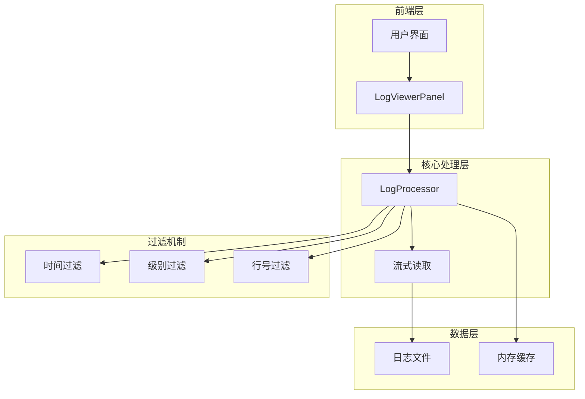

**图表来源**
- [logProcessor.ts](file://src/logProcessor.ts#L30-L807)
- [logViewerPanel.ts](file://src/logViewerPanel.ts#L408-L427)

**章节来源**
- [logProcessor.ts](file://src/logProcessor.ts#L1-L807)
- [logViewerPanel.ts](file://src/logViewerPanel.ts#L1-L510)

## 时间过滤机制

### filterByTime方法实现

时间过滤是logProcessor中最复杂的过滤机制之一，它能够根据指定的时间点和过滤模式（before/after）精确控制日志范围。

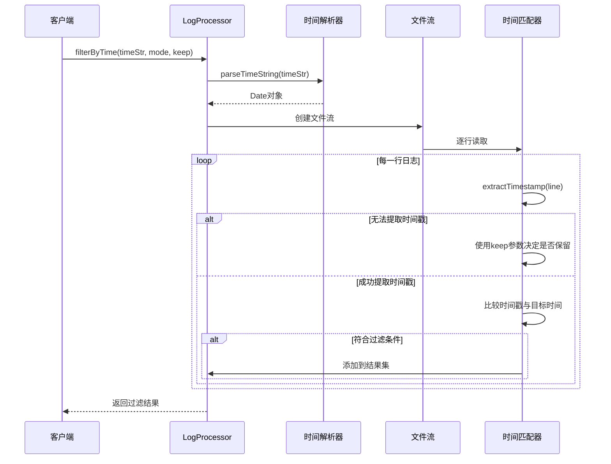

**图表来源**
- [logProcessor.ts](file://src/logProcessor.ts#L178-L230)
- [logProcessor.ts](file://src/logProcessor.ts#L776-L804)

### parseTimeString时间解析

时间解析器支持多种时间格式，包括ISO 8601、斜杠分隔、方括号包裹等多种格式。

| 支持的时间格式 | 示例 | 解析策略 |
|---------------|------|----------|
| YYYY-MM-DD HH:mm:ss | 2024-01-01 12:00:00 | 直接解析 |
| YYYY/MM/DD HH:mm:ss | 2024/01/01 12:00:00 | 替换斜杠为连字符 |
| [YYYY-MM-DD HH:mm:ss] | [2024-01-01 12:00:00] | 提取方括号内内容 |
| DD-MM-YYYY HH:mm:ss | 01-01-2024 12:00:00 | 重新格式化为YYYY-MM-DD |
| ISO 8601 | 2024-01-01T12:00:00 | 替换T为空格 |

### 时间过滤逻辑

时间过滤的核心逻辑基于以下规则：

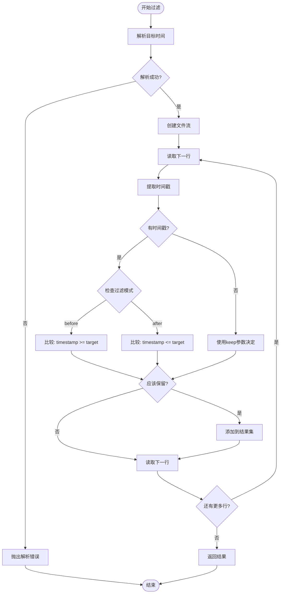

**图表来源**
- [logProcessor.ts](file://src/logProcessor.ts#L197-L209)

**章节来源**
- [logProcessor.ts](file://src/logProcessor.ts#L178-L230)
- [logProcessor.ts](file://src/logProcessor.ts#L776-L804)

## 日志级别过滤机制

### filterByLevel方法实现

日志级别过滤使用Set数据结构优化匹配效率，支持多级别同时过滤。

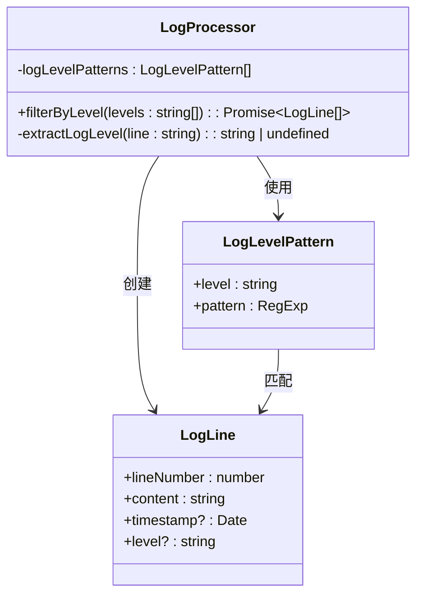

**图表来源**
- [logProcessor.ts](file://src/logProcessor.ts#L48-L54)
- [logProcessor.ts](file://src/logProcessor.ts#L649-L698)

### extractLogLevel多级匹配策略

日志级别提取采用双层匹配策略，优先使用快速匹配，失败时使用模式匹配作为后备。

| 匹配策略 | 适用场景 | 性能特点 | 支持的级别 |
|----------|----------|----------|------------|
| 快速匹配 | 标准格式日志 | O(1)时间复杂度 | ERROR, WARN, INFO, DEBUG |
| 模式匹配 | 特殊格式日志 | O(n)时间复杂度 | FATAL, SEVERE, WARNING, INFORMATION, TRACE, VERBOSE |

### 级别匹配优先级

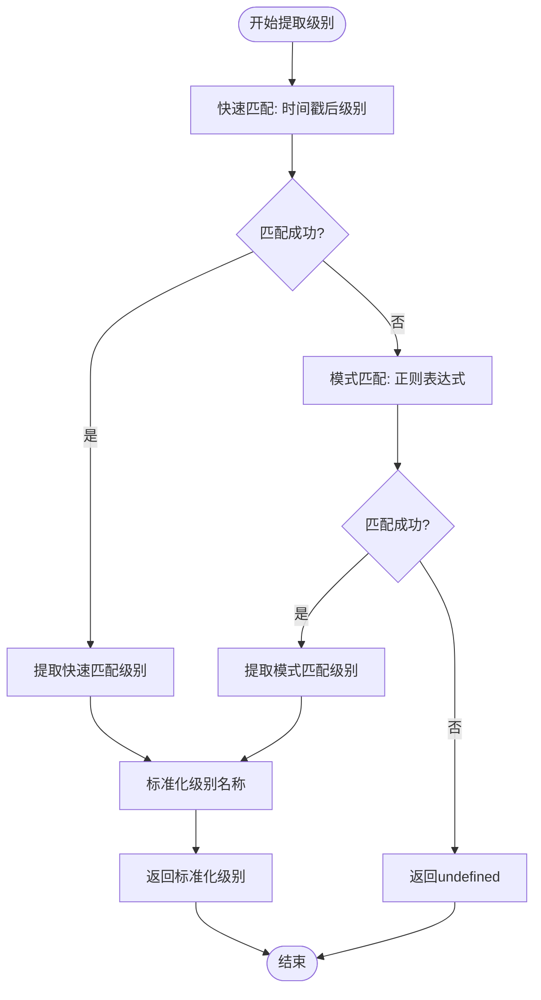

**图表来源**
- [logProcessor.ts](file://src/logProcessor.ts#L542-L561)

**章节来源**
- [logProcessor.ts](file://src/logProcessor.ts#L649-L698)
- [logProcessor.ts](file://src/logProcessor.ts#L542-L561)

## 行号过滤机制

### filterByLineNumber方法实现

行号过滤是最简单的过滤机制，直接基于行号进行前后范围控制。

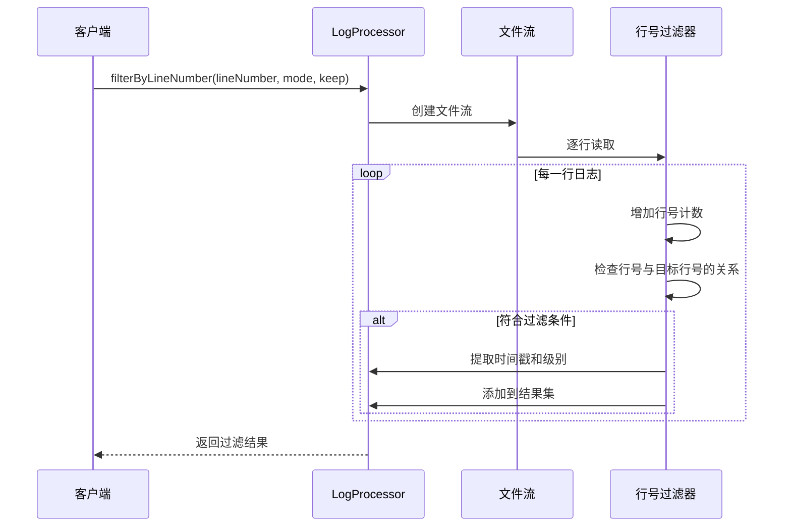

**图表来源**
- [logProcessor.ts](file://src/logProcessor.ts#L291-L333)

### 行号过滤逻辑

行号过滤支持两种模式，每种模式都有不同的保留策略：

| 模式 | keep=true | keep=false | 说明 |
|------|-----------|------------|------|
| before | 当前行 >= 目标行号 | 当前行 < 目标行号 | 保留指定行及之后的所有行 |
| after | 当前行 <= 目标行号 | 当前行 > 目标行号 | 保留指定行之前的所有行 |

**章节来源**
- [logProcessor.ts](file://src/logProcessor.ts#L291-L333)

## 核心数据结构

### LogLine接口定义

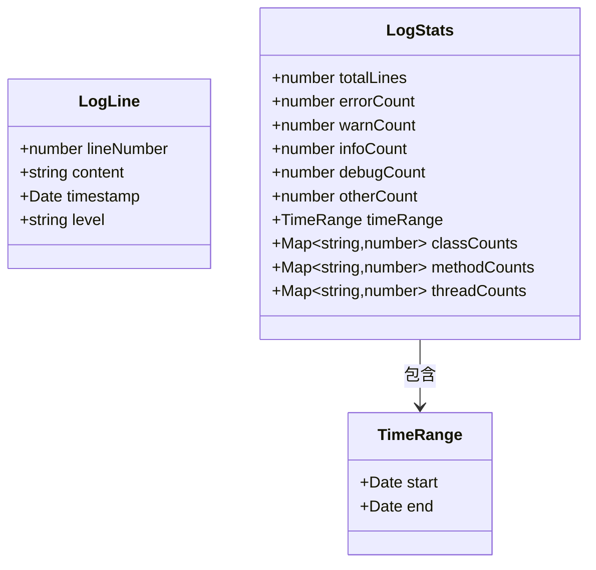

**图表来源**
- [logProcessor.ts](file://src/logProcessor.ts#L4-L28)

### 正则表达式模式

| 模式类型 | 正则表达式 | 匹配示例 | 用途 |
|----------|------------|----------|------|
| 时间戳格式1 | `\d{4}-\d{2}-\d{2}\s+\d{2}:\d{2}:\d{2}` | 2024-01-01 12:00:00 | 标准日期时间格式 |
| 时间戳格式2 | `\d{4}\/\d{2}\/\d{2}\s+\d{2}:\d{2}:\d{2}` | 2024/01/01 12:00:00 | 斜杠分隔格式 |
| 时间戳格式3 | `\[\d{4}-\d{2}-\d{2}\s+\d{2}:\d{2}:\d{2}\]` | [2024-01-01 12:00:00] | 方括号包裹格式 |
| 日志级别 | `\[ERROR\]` \| `\bERROR\s` | [ERROR], ERROR | 错误级别标识 |

**章节来源**
- [logProcessor.ts](file://src/logProcessor.ts#L35-L46)
- [logProcessor.ts](file://src/logProcessor.ts#L48-L54)

## 性能优化策略

### 流式读取优化

logProcessor采用流式读取技术，避免一次性加载整个文件到内存：

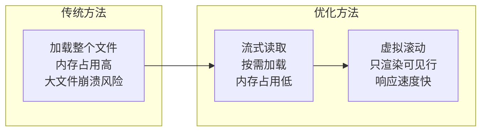

### Set数据结构优化

日志级别过滤使用Set数据结构提高匹配效率：

| 操作 | 数组实现 | Set实现 | 性能提升 |
|------|----------|---------|----------|
| 查找元素 | O(n) | O(1) | 显著提升 |
| 插入元素 | O(1) | O(1) | 相同 |
| 删除元素 | O(n) | O(1) | 相同 |

### 缓存策略

- **时间戳缓存**: 对于重复出现的时间戳模式，系统会缓存解析结果
- **级别缓存**: 对于常见级别的匹配结果进行缓存
- **正则表达式编译**: 正则表达式只编译一次，多次使用

**章节来源**
- [logProcessor.ts](file://src/logProcessor.ts#L654)
- [logProcessor.ts](file://src/logProcessor.ts#L102-L119)

## 边界条件处理

### 时间解析边界条件

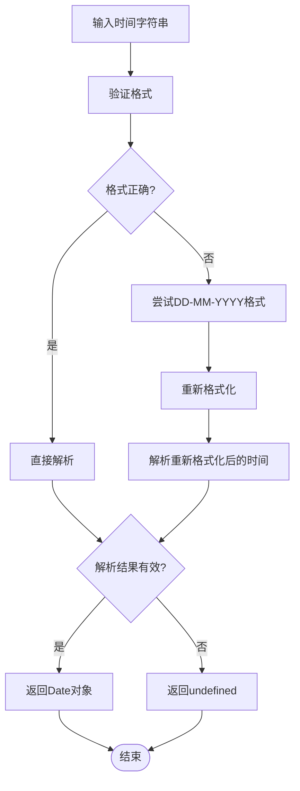

**图表来源**
- [logProcessor.ts](file://src/logProcessor.ts#L776-L804)

### 默认行为处理

| 场景 | 默认行为 | 处理策略 |
|------|----------|----------|
| 无法提取时间戳 | 保留当前行 | 根据keep参数决定 |
| 无效时间格式 | 抛出解析错误 | 提示用户修正输入 |
| 空级别列表 | 过滤所有日志 | 返回空数组 |
| 超出文件范围 | 截断到文件边界 | 自动调整范围 |

### 错误处理机制

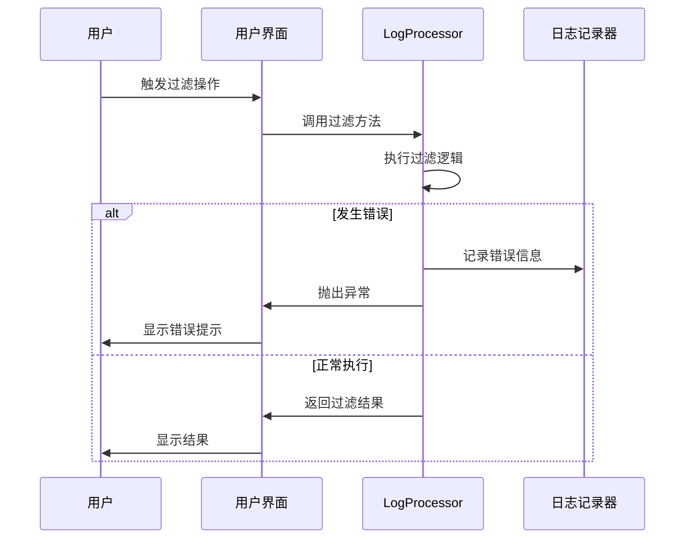

**图表来源**
- [logProcessor.ts](file://src/logProcessor.ts#L180-L182)
- [logViewerPanel.ts](file://src/logViewerPanel.ts#L425)

**章节来源**
- [logProcessor.ts](file://src/logProcessor.ts#L198-L201)
- [logProcessor.ts](file://src/logProcessor.ts#L180-L182)

## 实际应用示例

### 时间过滤应用场景

假设有一个包含2024年全年日志的文件，用户希望：
- 查看2024年3月15日之后的所有错误日志
- 排除2024年1月1日之前的日志

### 级别过滤应用场景

用户希望：
- 同时查看ERROR和WARN级别的日志
- 只查看INFO级别以上的日志
- 排除DEBUG级别的详细信息

### 行号过滤应用场景

用户希望：
- 查看第1000行之后的所有日志
- 排除前500行的初始化信息
- 保留特定业务流程的日志范围

### 组合过滤示例

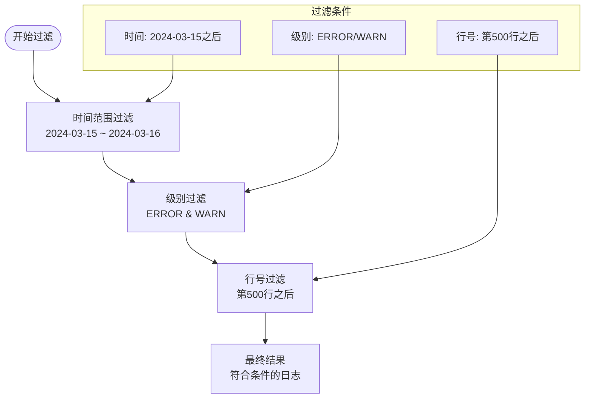

**章节来源**
- [logViewerPanel.ts](file://src/logViewerPanel.ts#L196-L257)

## 总结

logProcessor.ts的过滤机制体现了现代日志处理系统的最佳实践：

### 核心优势

1. **高性能**: 流式读取技术确保大文件处理的稳定性
2. **灵活性**: 支持多种过滤条件和组合使用
3. **安全性**: 所有操作都不修改原始文件
4. **易用性**: 直观的API设计和丰富的错误处理

### 技术亮点

- **多级匹配策略**: 结合快速匹配和模式匹配，平衡性能和准确性
- **Set数据结构优化**: 显著提升日志级别过滤的性能
- **边界条件处理**: 完善的错误处理和默认行为
- **内存友好**: 流式处理避免内存溢出

### 应用价值

该过滤机制不仅适用于当前的大日志文件查看器项目，其设计理念和实现技术也可以应用于其他需要处理大规模文本数据的场景，为开发者提供了一个优秀的参考实现。