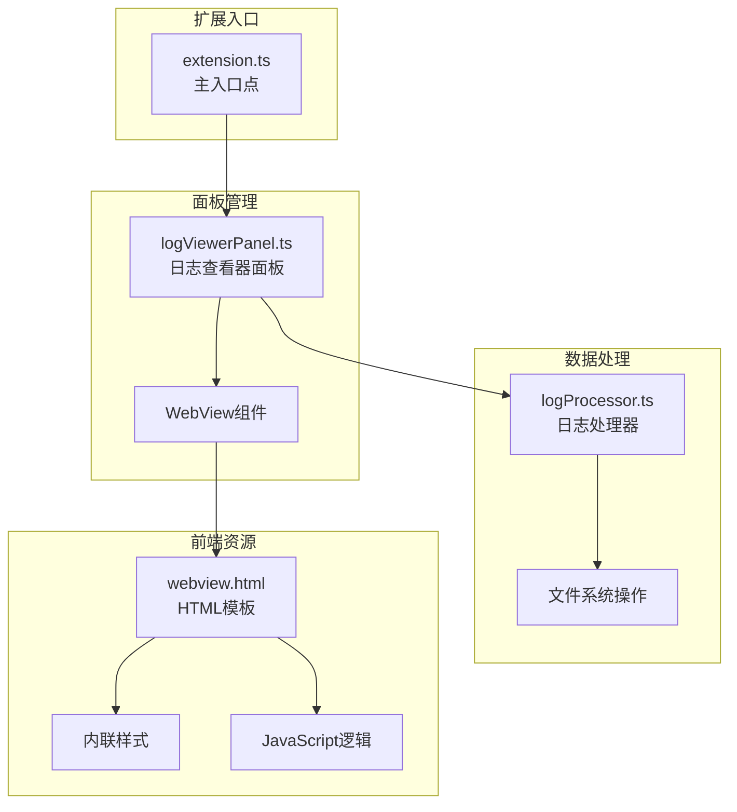
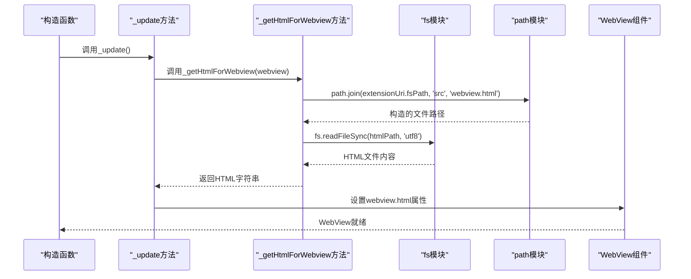
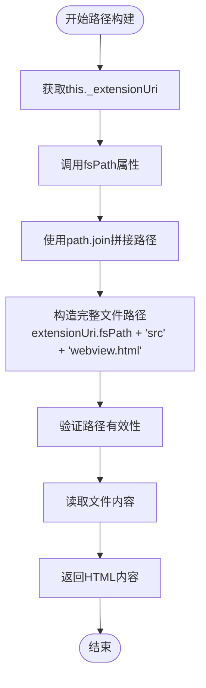
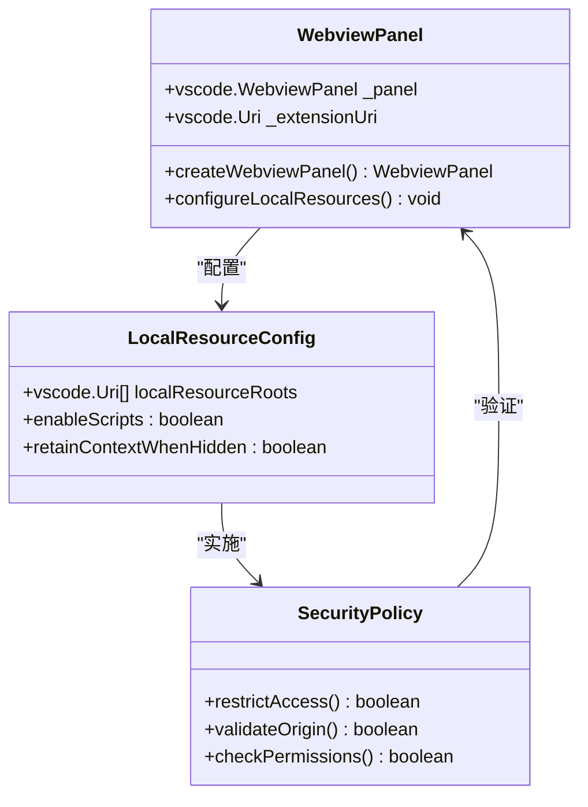
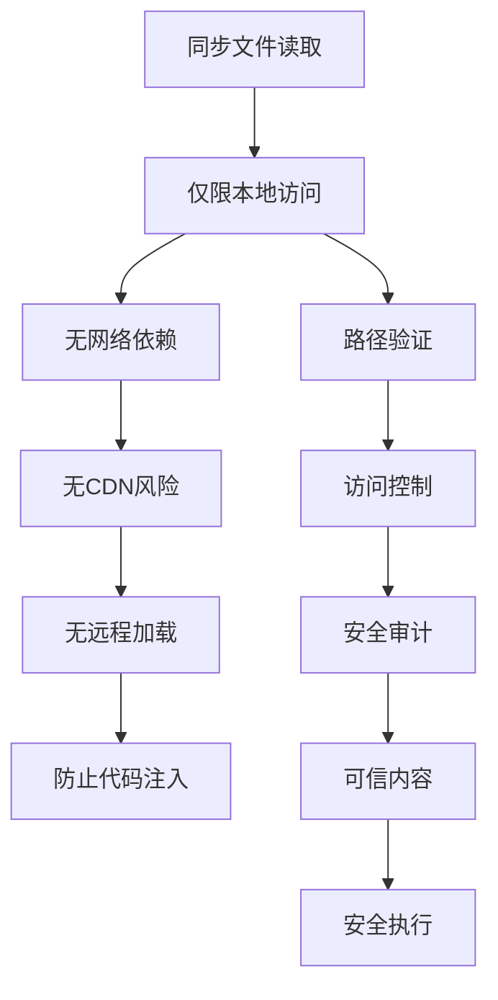
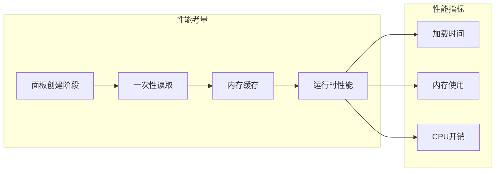
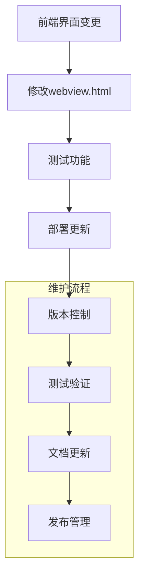

# HTML内容注入与资源管理

<cite>
**本文档引用的文件**
- [src/extension.ts](file://src/extension.ts)
- [src/logViewerPanel.ts](file://src/logViewerPanel.ts)
- [src/webview.html](file://src/webview.html)
- [src/logProcessor.ts](file://src/logProcessor.ts)
- [package.json](file://package.json)
</cite>

## 目录
1. [简介](#简介)
2. [项目架构概览](#项目架构概览)
3. [HTML内容注入机制](#html内容注入机制)
4. [资源管理策略](#资源管理策略)
5. [安全性分析](#安全性分析)
6. [性能优化考虑](#性能优化考虑)
7. [可维护性设计](#可维护性设计)
8. [总结](#总结)

## 简介

本文档详细分析了一个VS Code扩展中的HTML内容注入与资源管理系统。该系统实现了从本地扩展目录安全读取webview.html文件内容，并通过同步文件读取的方式将其注入到WebView组件中。整个机制体现了现代Web开发中对安全性、性能和可维护性的平衡考量。

## 项目架构概览

该项目采用模块化架构设计，主要包含以下核心组件：

**图表来源**
- [src/extension.ts](file://src/extension.ts#L1-L116)
- [src/logViewerPanel.ts](file://src/logViewerPanel.ts#L1-L510)
- [src/webview.html](file://src/webview.html#L1-L800)

**章节来源**
- [src/extension.ts](file://src/extension.ts#L1-L116)
- [src/logViewerPanel.ts](file://src/logViewerPanel.ts#L1-L510)

## HTML内容注入机制

### 核心注入流程

HTML内容注入的核心实现在`_getHtmlForWebview`方法中，该方法负责从扩展目录安全读取webview.html文件内容：

**图表来源**
- [src/logViewerPanel.ts](file://src/logViewerPanel.ts#L485-L495)

### 文件路径构建的安全性

路径构建采用了跨平台兼容的设计模式：

**图表来源**
- [src/logViewerPanel.ts](file://src/logViewerPanel.ts#L492-L494)

这种设计确保了：
- **跨平台兼容性**：通过`this._extensionUri.fsPath`获取平台特定的文件系统路径
- **路径安全性**：避免了相对路径攻击的可能性
- **明确的资源定位**：清晰地指定了HTML文件的来源位置

**章节来源**
- [src/logViewerPanel.ts](file://src/logViewerPanel.ts#L485-L495)

## 资源管理策略

### 本地资源根目录配置

WebView组件通过`localResourceRoots`配置实现了严格的资源访问控制：

**图表来源**
- [src/logViewerPanel.ts](file://src/logViewerPanel.ts#L27-L35)

### 资源路径处理机制

所有CSS和JavaScript资源都相对于`localResourceRoots`定义的根目录进行处理：

| 资源类型 | 处理方式 | 安全特性 | 维护便利性 |
|---------|---------|---------|-----------|
| HTML模板 | 直接注入 | 本地文件读取 | 单一文件管理 |
| CSS样式 | 内联嵌入 | 无外部依赖 | 集中式样式管理 |
| JavaScript | 内联脚本 | 无CDN依赖 | 功能集中实现 |
| 图标资源 | base64编码 | 无网络请求 | 资源打包优化 |

**章节来源**
- [src/logViewerPanel.ts](file://src/logViewerPanel.ts#L27-L35)
- [src/webview.html](file://src/webview.html#L1-L800)

## 安全性分析

### 本地文件读取的安全优势

同步文件读取操作具有多重安全优势：

**图表来源**
- [src/logViewerPanel.ts](file://src/logViewerPanel.ts#L492-L494)

### 安全防护措施

1. **本地资源限制**：通过`localResourceRoots`严格限制资源访问范围
2. **同步读取保护**：避免异步操作可能带来的安全漏洞
3. **路径规范化**：确保文件路径的正确性和安全性
4. **内容隔离**：WebView内容与扩展代码完全隔离

**章节来源**
- [src/logViewerPanel.ts](file://src/logViewerPanel.ts#L27-L35)

## 性能优化考虑

### 同步读取的合理性分析

同步文件读取在面板创建时执行，具有以下性能优势：

**图表来源**
- [src/logViewerPanel.ts](file://src/logViewerPanel.ts#L485-L495)

### 性能优化策略

1. **延迟加载**：HTML内容仅在面板首次创建时加载
2. **内存缓存**：读取的内容直接用于WebView设置，无需额外缓存
3. **同步优化**：面板创建过程中的同步读取不会影响用户体验
4. **资源压缩**：HTML文件经过合理组织，减少不必要的内容

**章节来源**
- [src/logViewerPanel.ts](file://src/logViewerPanel.ts#L485-L495)

## 可维护性设计

### 前端界面更新机制

该系统实现了高度可维护的前端界面更新模式：

**图表来源**
- [src/webview.html](file://src/webview.html#L1-L800)

### 维护优势

1. **分离关注点**：前端界面逻辑与业务逻辑完全分离
2. **单一职责**：HTML文件专门负责界面展示
3. **快速迭代**：界面更新无需重新编译TypeScript代码
4. **易于调试**：HTML内容可以直接在浏览器中调试

### 代码组织原则

| 组件类型 | 文件位置 | 更新频率 | 维护复杂度 |
|---------|---------|---------|-----------|
| 核心逻辑 | logViewerPanel.ts | 低 | 高 |
| 数据处理 | logProcessor.ts | 中 | 中 |
| 界面展示 | webview.html | 高 | 低 |
| 样式定义 | webview.html内联 | 高 | 低 |

**章节来源**
- [src/webview.html](file://src/webview.html#L1-L800)
- [src/logViewerPanel.ts](file://src/logViewerPanel.ts#L485-L495)

## 总结

该HTML内容注入与资源管理系统展现了现代Web开发中的最佳实践：

### 关键优势

1. **安全性**：通过本地文件读取和严格的资源访问控制，确保了系统的安全性
2. **性能**：合理的同步读取策略在保证安全的同时不影响运行时性能
3. **可维护性**：清晰的职责分离和单一文件管理模式大大降低了维护成本
4. **跨平台兼容性**：通过标准的Node.js API确保了在不同操作系统上的兼容性

### 设计亮点

- `_getHtmlForWebview`方法的简洁实现
- `path.join`结合`fsPath`的跨平台路径处理
- `localResourceRoots`的严格资源访问控制
- HTML内容直接注入而非远程加载的安全策略

这种设计模式为VS Code扩展开发提供了一个优秀的参考范例，展示了如何在保证安全性和性能的前提下实现灵活的前端界面管理。