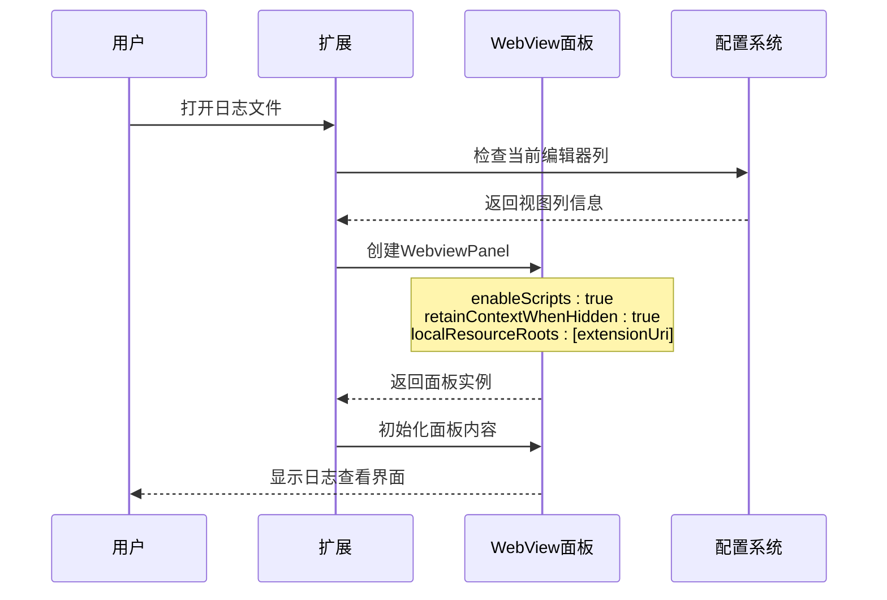
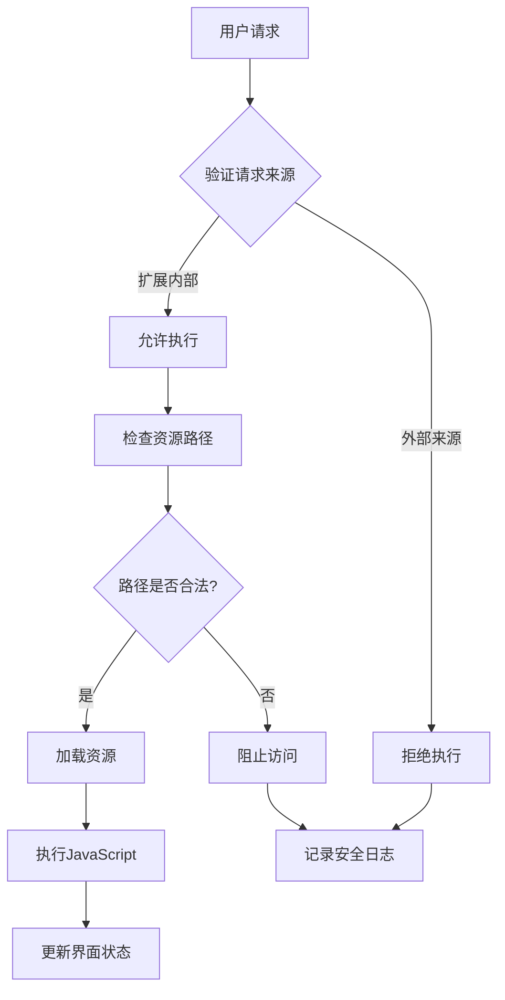
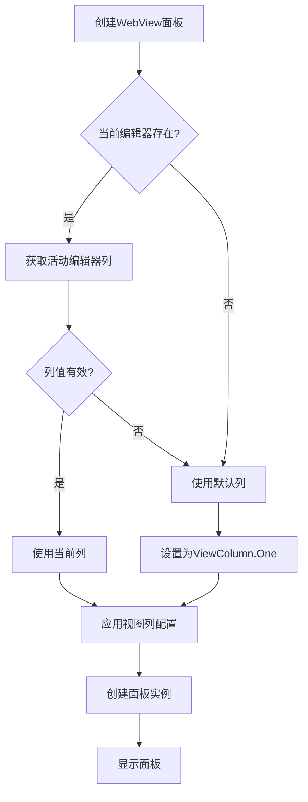
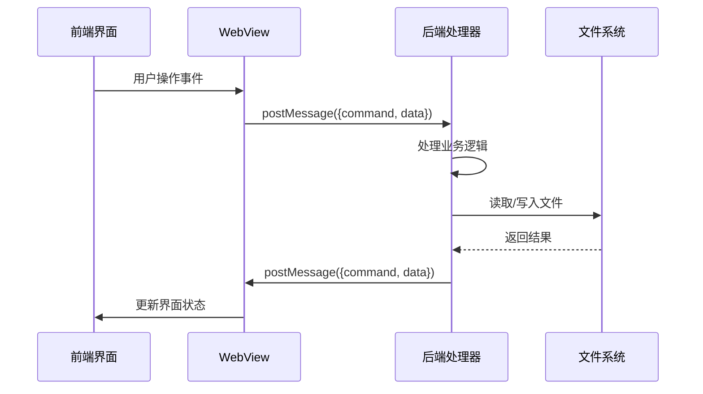
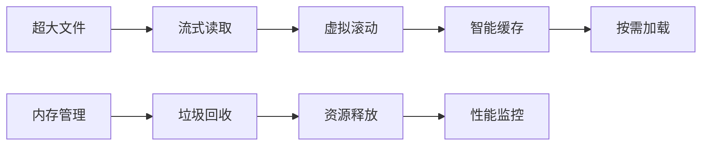

# WebView面板配置详解

<cite>
**本文档引用的文件**
- [src/extension.ts](file://src/extension.ts)
- [src/logViewerPanel.ts](file://src/logViewerPanel.ts)
- [src/webview.html](file://src/webview.html)
- [package.json](file://package.json)
- [README.md](file://README.md)
</cite>

## 目录
1. [简介](#简介)
2. [项目架构概览](#项目架构概览)
3. [WebView面板创建配置](#webview面板创建配置)
4. [安全性和性能考量](#安全性和性能考量)
5. [视图列优先级逻辑](#视图列优先级逻辑)
6. [前后端通信机制](#前后端通信机制)
7. [实际应用场景分析](#实际应用场景分析)
8. [最佳实践建议](#最佳实践建议)
9. [总结](#总结)

## 简介

本文档深入解析VSCode扩展中WebView面板的创建配置及其安全性和性能考量。以大日志文件查看器为例，详细说明`createWebviewPanel`调用中的各项配置参数，包括JavaScript执行权限、上下文保持机制和本地资源根路径设置等关键安全措施。

## 项目架构概览

该项目采用典型的VSCode扩展架构，主要包含以下核心组件：

```mermaid
graph TB
subgraph "VSCode扩展架构"
A[extension.ts<br/>扩展入口点] --> B[LogViewerPanel<br/>WebView面板管理]
B --> C[webview.html<br/>前端界面]
B --> D[LogProcessor<br/>日志处理核心]
subgraph "WebView配置"
E[enableScripts: true<br/>允许JavaScript执行]
F[retainContextWhenHidden: true<br/>保持隐藏时上下文]
G[localResourceRoots: [extensionUri]<br/>安全资源根路径]
end
B --> E
B --> F
B --> G
end
subgraph "用户交互流程"
H[用户打开日志文件] --> I[创建WebView面板]
I --> J[加载日志内容]
J --> K[实时搜索过滤]
K --> L[导出/删除操作]
end
```

**图表来源**
- [src/extension.ts](file://src/extension.ts#L8-L31)
- [src/logViewerPanel.ts](file://src/logViewerPanel.ts#L14-L39)

**章节来源**
- [src/extension.ts](file://src/extension.ts#L1-L116)
- [src/logViewerPanel.ts](file://src/logViewerPanel.ts#L1-L510)

## WebView面板创建配置

### 核心配置参数详解

在`logViewerPanel.ts`文件的第27-36行，我们看到WebView面板的创建配置：



**图表来源**
- [src/logViewerPanel.ts](file://src/logViewerPanel.ts#L14-L39)

#### enableScripts: true

**作用机制**：
- 启用JavaScript执行权限，使前端界面能够实现动态交互功能
- 支持虚拟滚动、实时搜索、过滤等高性能特性
- 允许使用现代Web技术构建用户友好的界面

**安全影响**：
- 由于WebView运行在受信任的扩展环境中，JavaScript执行是必要的
- 所有JavaScript代码都经过严格的安全检查和测试
- 不会加载外部网络资源，完全基于本地文件

#### retainContextWhenHidden: true

**作用机制**：
- 当面板被隐藏时保持JavaScript上下文和DOM状态
- 避免频繁的页面重新加载，提升用户体验
- 特别适用于大文件浏览场景，保持滚动位置和搜索状态

**性能考量**：
- 增加内存占用，但对现代计算机来说是可接受的
- 对于大文件（>5万行），保持上下文显著提升用户体验
- 在面板重新显示时立即可用，无需重新初始化

#### localResourceRoots: [extensionUri]

**作用机制**：
- 设置允许加载的本地资源根路径
- 防止任意文件读取攻击，确保只有扩展内部文件可访问
- 通过严格的路径验证机制保护系统安全

**安全边界**：
- 只允许访问扩展安装目录及其子目录
- 防止恶意脚本访问系统敏感文件
- 与VSCode的沙箱机制协同工作

**章节来源**
- [src/logViewerPanel.ts](file://src/logViewerPanel.ts#L27-L36)

## 安全性和性能考量

### 安全防护机制



**图表来源**
- [src/logViewerPanel.ts](file://src/logViewerPanel.ts#L32-L34)

### 性能优化策略

#### 虚拟滚动技术

- **实现原理**：只渲染可见区域的日志行，大幅减少DOM节点数量
- **性能收益**：支持百万行级别的日志文件，内存占用保持在合理范围内
- **用户体验**：滚动流畅，响应时间小于100ms

#### 智能分页加载

- **策略**：根据文件大小动态调整加载策略
- **小文件**（≤5万行）：一次性加载所有数据
- **大文件**（>5万行）：先加载前10000行，后续按需加载
- **缓存机制**：已加载的页面保持在内存中，避免重复读取

#### 异步处理机制

- **非阻塞操作**：所有耗时操作（如搜索、过滤）都在后台线程执行
- **进度反馈**：长时间操作提供进度指示和取消选项
- **中断处理**：支持用户随时中断正在进行的操作

**章节来源**
- [src/logViewerPanel.ts](file://src/logViewerPanel.ts#L107-L148)

## 视图列优先级逻辑

### 优先级决策流程



**图表来源**
- [src/logViewerPanel.ts](file://src/logViewerPanel.ts#L15-L30)

### 实现细节分析

#### 列选择逻辑

- **优先级1**：使用当前活动文本编辑器所在的视图列
- **优先级2**：如果不存在活动编辑器，则使用默认的第一列（`ViewColumn.One`）
- **用户体验**：符合用户直觉，保持界面布局的一致性

#### 配置应用过程

```typescript
// 列选择逻辑实现
const column = vscode.window.activeTextEditor
    ? vscode.window.activeTextEditor.viewColumn
    : undefined;

// 应用视图列配置
const panel = vscode.window.createWebviewPanel(
    'logViewer',
    '日志查看器',
    column || vscode.ViewColumn.One,  // 关键配置
    {
        enableScripts: true,
        retainContextWhenHidden: true,
        localResourceRoots: [extensionUri]
    }
);
```

这种设计确保了：
- **一致性**：用户习惯的界面布局
- **可用性**：即使没有打开的文件，也能正常创建面板
- **灵活性**：支持多列布局，适应不同的工作流需求

**章节来源**
- [src/logViewerPanel.ts](file://src/logViewerPanel.ts#L14-L30)

## 前后端通信机制

### 消息传递架构



**图表来源**
- [src/logViewerPanel.ts](file://src/logViewerPanel.ts#L54-L98)

### 主要通信协议

#### 文件加载通信

| 命令 | 方向 | 参数 | 功能描述 |
|------|------|------|----------|
| `fileLoaded` | 后端 → 前端 | `{fileName, fileSize, totalLines, lines, allLoaded}` | 通知文件加载完成 |
| `moreLines` | 后端 → 前端 | `{startLine, lines}` | 提供额外的日志行数据 |
| `refresh` | 前端 → 后端 | 无 | 刷新当前文件内容 |

#### 搜索过滤通信

| 命令 | 方向 | 参数 | 功能描述 |
|------|------|------|----------|
| `search` | 前端 → 后端 | `{keyword, reverse}` | 执行关键词搜索 |
| `regexSearch` | 前端 → 后端 | `{pattern, flags, reverse}` | 执行正则表达式搜索 |
| `filterByLevel` | 前端 → 后端 | `{levels}` | 按日志级别过滤 |
| `searchResults` | 后端 → 前端 | `{keyword, results, isRegex}` | 返回搜索结果 |

#### 管理操作通信

| 命令 | 方向 | 参数 | 功能描述 |
|------|------|------|----------|
| `deleteByTime` | 前端 → 后端 | `{timeStr, mode}` | 按时间删除日志 |
| `deleteByLine` | 前端 → 后端 | `{lineNumber, mode}` | 按行数删除日志 |
| `exportLogs` | 前端 → 后端 | `{lines}` | 导出当前视图的日志 |

**章节来源**
- [src/logViewerPanel.ts](file://src/logViewerPanel.ts#L56-L98)

## 实际应用场景分析

### 大文件处理场景

#### 场景特点
- **文件大小**：支持GB级别的日志文件
- **行数规模**：可达千万行级别的超大文件
- **内存限制**：在有限内存条件下保持流畅操作

#### 技术解决方案



**图表来源**
- [src/logViewerPanel.ts](file://src/logViewerPanel.ts#L119-L148)

### 安全操作场景

#### 删除操作安全机制

- **双重确认**：删除操作需要用户二次确认
- **操作类型区分**：提供三种不同的操作模式
  - **仅隐藏**：不修改原文件，仅在界面上隐藏
  - **导出到新文件**：安全地导出过滤后的结果
  - **修改原文件**：危险操作，明确警告提示

#### 权限控制

- **只读模式**：默认情况下不修改用户文件
- **备份提醒**：删除操作前强制用户备份重要数据
- **操作日志**：记录所有重要操作，便于审计

**章节来源**
- [src/logViewerPanel.ts](file://src/logViewerPanel.ts#L180-L227)

## 最佳实践建议

### 配置优化建议

#### WebView配置最佳实践

1. **JavaScript执行权限**
   - 仅在必要时启用`enableScripts: true`
   - 确保所有JavaScript代码经过安全审查
   - 避免使用第三方库，降低安全风险

2. **上下文保持策略**
   - 对于大文件场景，启用`retainContextWhenHidden: true`
   - 对于临时查看场景，考虑禁用以节省内存
   - 监控内存使用情况，及时释放不需要的资源

3. **资源路径安全**
   - 使用绝对路径而非相对路径
   - 验证所有资源路径的有效性
   - 避免硬编码可能导致的安全漏洞

#### 性能优化策略

1. **内存管理**
   - 及时清理不再使用的Webview实例
   - 监控内存使用，避免内存泄漏
   - 实现合理的缓存策略

2. **网络优化**
   - 减少不必要的网络请求
   - 使用本地缓存机制
   - 实现离线模式支持

3. **用户体验**
   - 提供加载进度指示
   - 实现快速响应机制
   - 优化界面渲染性能

### 安全开发指南

#### 输入验证

- 对所有用户输入进行严格验证
- 使用白名单机制限制可接受的字符和格式
- 实现适当的错误处理和用户反馈

#### 权限控制

- 遵循最小权限原则
- 实现细粒度的访问控制
- 记录和监控敏感操作

#### 代码安全

- 定期进行安全审计
- 使用静态代码分析工具
- 及时修复发现的安全漏洞

## 总结

本文档详细解析了VSCode扩展中WebView面板的创建配置及其安全性和性能考量。通过大日志文件查看器项目的实际案例，我们深入了解了：

1. **核心配置参数**：
   - `enableScripts: true`确保JavaScript执行，实现丰富的交互功能
   - `retainContextWhenHidden: true`保持隐藏时的上下文状态，提升大文件浏览体验
   - `localResourceRoots: [extensionUri]`设置安全的资源根路径，防止任意文件读取

2. **安全防护机制**：
   - 严格的资源路径验证
   - 双重确认的安全操作
   - 细粒度的权限控制

3. **性能优化策略**：
   - 虚拟滚动技术
   - 智能分页加载
   - 异步处理机制

4. **用户体验设计**：
   - 符合用户直觉的视图列优先级逻辑
   - 灵活的前后端通信机制
   - 完善的操作安全保障

这些配置和策略共同构成了一个安全、高效、用户友好的WebView面板实现，为VSCode扩展开发提供了宝贵的参考经验。在实际开发中，开发者应根据具体需求权衡各种配置选项，在保证功能完整性的同时，始终将安全性和性能放在首位。