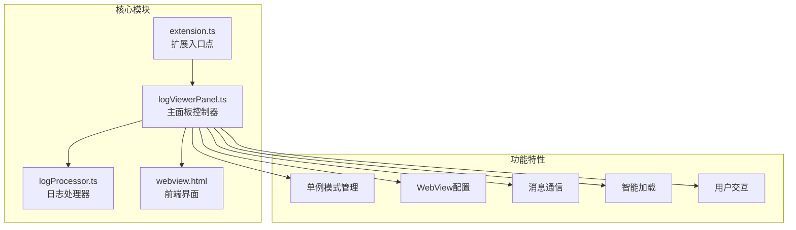
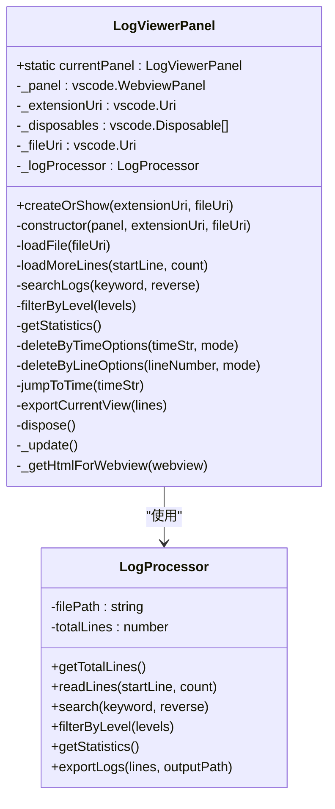
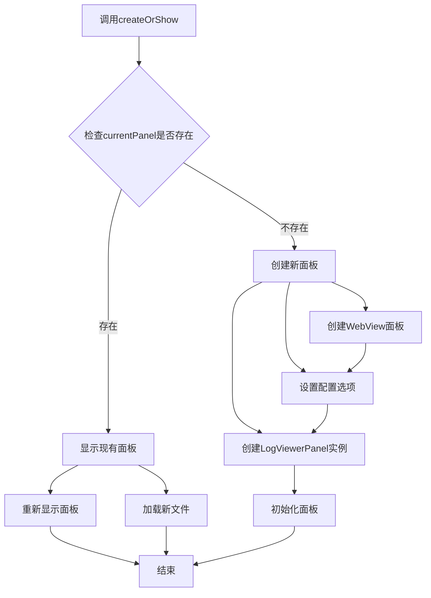
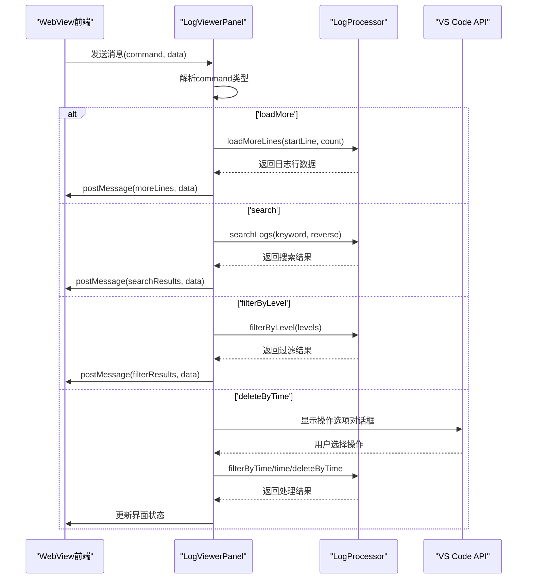
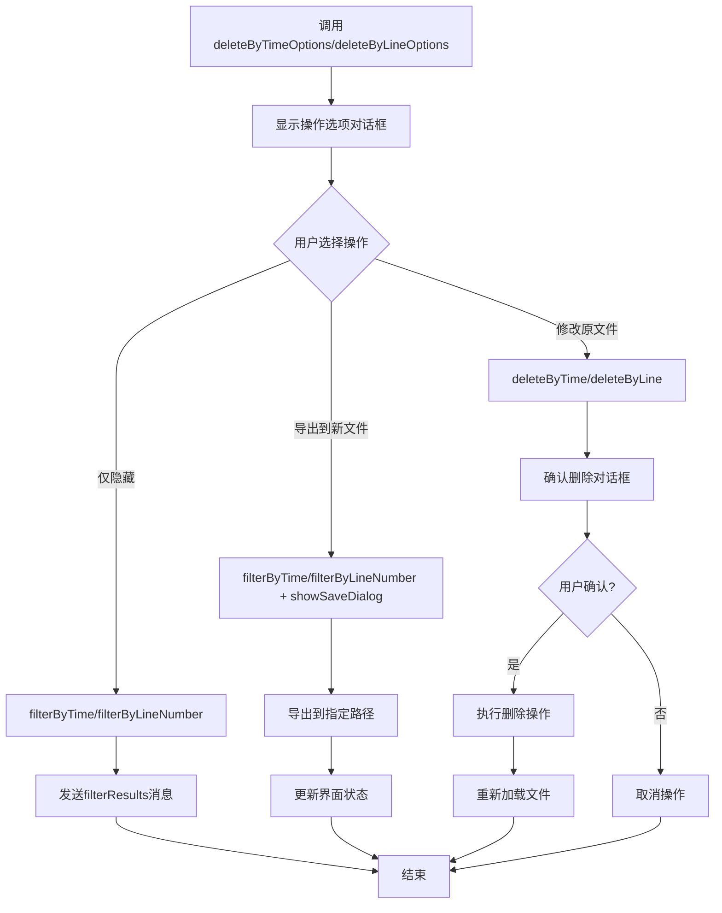
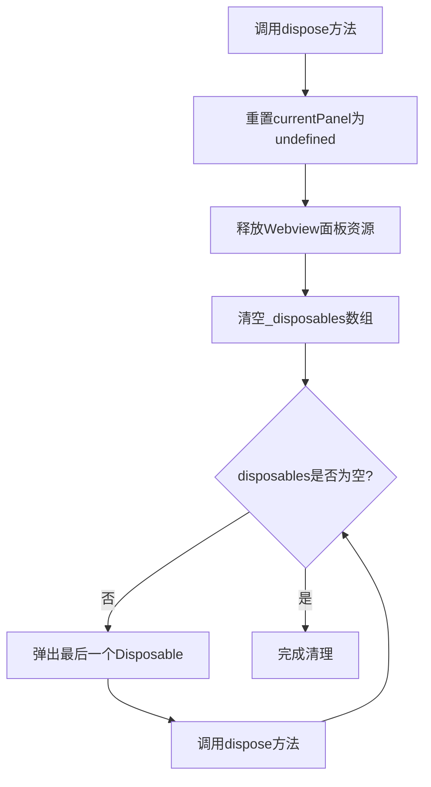

# logViewerPanel.ts模块详解

<cite>
**本文档引用的文件**
- [logViewerPanel.ts](file://src/logViewerPanel.ts)
- [logProcessor.ts](file://src/logProcessor.ts)
- [webview.html](file://src/webview.html)
- [extension.ts](file://src/extension.ts)
</cite>

## 目录
1. [简介](#简介)
2. [项目结构概览](#项目结构概览)
3. [LogViewerPanel类核心架构](#logviewerpanel类核心架构)
4. [单例模式实现](#单例模式实现)
5. [WebView面板配置](#webview面板配置)
6. [消息监听机制](#消息监听机制)
7. [智能加载策略](#智能加载策略)
8. [用户交互流程](#用户交互流程)
9. [资源管理与清理](#资源管理与清理)
10. [总结](#总结)

## 简介

logViewerPanel.ts模块是VS Code扩展的核心组件之一，负责提供大型日志文件的可视化查看和交互功能。该模块采用单例模式设计，通过WebView技术实现前端界面与后端逻辑的分离，提供了丰富的日志处理功能，包括搜索、过滤、统计、删除等操作。

## 项目结构概览

该项目采用模块化架构，主要包含以下核心文件：



**图表来源**
- [logViewerPanel.ts](file://src/logViewerPanel.ts#L1-L510)
- [logProcessor.ts](file://src/logProcessor.ts#L1-L807)
- [webview.html](file://src/webview.html#L1-L800)
- [extension.ts](file://src/extension.ts#L1-L116)

## LogViewerPanel类核心架构

LogViewerPanel类是整个日志查看器的核心控制器，采用了面向对象的设计模式：



**图表来源**
- [logViewerPanel.ts](file://src/logViewerPanel.ts#L6-L13)
- [logProcessor.ts](file://src/logProcessor.ts#L30-L40)

**章节来源**
- [logViewerPanel.ts](file://src/logViewerPanel.ts#L6-L13)
- [logProcessor.ts](file://src/logProcessor.ts#L30-L40)

## 单例模式实现

LogViewerPanel类实现了严格的单例模式，确保同一时间只能存在一个日志查看器面板：

### static currentPanel属性

```typescript
public static currentPanel: LogViewerPanel | undefined;
```

这个静态属性是单例模式的核心，用于跟踪当前活跃的面板实例。当面板被创建时，该属性会被赋值；当面板被销毁时，该属性会被重置为undefined。

### createOrShow方法实现

createOrShow方法是单例模式的主要入口点，实现了以下逻辑：



**图表来源**
- [logViewerPanel.ts](file://src/logViewerPanel.ts#L14-L39)

**章节来源**
- [logViewerPanel.ts](file://src/logViewerPanel.ts#L14-L39)

## WebView面板配置

LogViewerPanel在创建WebView面板时设置了三个关键配置选项：

### enableScripts: true

启用JavaScript执行能力，允许前端界面执行复杂的交互逻辑和动画效果。

### retainContextWhenHidden: true

保持隐藏状态下的上下文环境，这对于大型日志文件的快速响应至关重要：
- 避免重新加载HTML内容
- 保持DOM状态和用户界面状态
- 减少内存重新分配开销

### localResourceRoots: [extensionUri]

安全配置，限制WebView可以访问的本地资源范围：
- 只能访问扩展根目录及其子目录
- 防止跨域资源访问攻击
- 确保资源加载的安全性

**章节来源**
- [logViewerPanel.ts](file://src/logViewerPanel.ts#L27-L35)

## 消息监听机制

LogViewerPanel通过onDidReceiveMessage监听来自WebView的消息，实现了完整的命令处理系统：



**图表来源**
- [logViewerPanel.ts](file://src/logViewerPanel.ts#L54-L98)

### 支持的消息命令

| 命令 | 功能描述 | 参数 | 处理逻辑 |
|------|----------|------|----------|
| loadMore | 加载更多日志行 | startLine, count | 分页加载指定范围的日志 |
| search | 关键词搜索 | keyword, reverse | 按关键词搜索日志内容 |
| refresh | 刷新文件 | - | 重新加载当前文件 |
| filterByLevel | 按级别过滤 | levels | 过滤指定级别的日志 |
| getStatistics | 获取统计信息 | - | 计算并返回日志统计 |
| regexSearch | 正则搜索 | pattern, flags, reverse | 使用正则表达式搜索 |
| exportLogs | 导出日志 | lines | 将当前视图导出到文件 |
| deleteByTime | 按时间删除 | timeStr, mode | 删除指定时间范围的日志 |
| deleteByLine | 按行号删除 | lineNumber, mode | 删除指定行号范围的日志 |
| jumpToTime | 定位到时间 | timeStr | 跳转到指定时间的日志 |
| jumpToLineInFullLog | 跳转到完整日志 | lineNumber | 在完整日志中跳转到指定行 |
| showMessage | 显示消息 | type, message | 显示警告或信息消息 |

**章节来源**
- [logViewerPanel.ts](file://src/logViewerPanel.ts#L56-L98)

## 智能加载策略

LogViewerPanel实现了基于文件大小的智能加载策略，优化了大文件的处理性能：

### 文件大小阈值判断

```mermaid
flowchart TD
A[开始加载文件] --> B[获取文件统计信息]
B --> C[计算文件大小(MB)]
B --> D[获取总行数]
C --> E{总行数 ≤ 50000?}
E --> |是| F[一次性加载所有数据]
E --> |否| G[分页加载前10000行]
F --> H[显示完整加载消息]
G --> I[显示部分加载消息]
H --> J[发送fileLoaded消息]
I --> J
J --> K[结束]
```

**图表来源**
- [logViewerPanel.ts](file://src/logViewerPanel.ts#L107-L148)

### loadFile方法实现

loadFile方法负责文件的初始加载，包含了完整的错误处理和用户体验优化：

1. **文件统计信息获取**：获取文件大小和总行数
2. **智能加载决策**：根据行数决定加载策略
3. **进度提示**：向用户显示加载进度
4. **数据传输**：通过postMessage将数据传递给前端
5. **错误处理**：捕获并报告加载过程中的错误

**章节来源**
- [logViewerPanel.ts](file://src/logViewerPanel.ts#L107-L148)

## 用户交互流程

### deleteByTimeOptions和deleteByLineOptions方法

这两个方法实现了三种操作模式的用户交互流程：



**图表来源**
- [logViewerPanel.ts](file://src/logViewerPanel.ts#L180-L278)

### 三种操作模式详解

| 操作模式 | 描述 | 数据处理方式 | 安全级别 | 适用场景 |
|----------|------|--------------|----------|----------|
| 仅隐藏 | 不修改文件，仅在界面上隐藏 | filterByTime/filterByLineNumber | 最高 | 临时查看不同时间段的日志 |
| 导出到新文件 | 创建新的日志文件，保留原始文件 | filterByTime/filterByLineNumber + exportLogs | 高 | 需要保存特定时间段的日志 |
| 修改原文件 | 直接删除原始文件中的日志行 | deleteByTime/deleteByLine | 最低 | 确实需要永久删除日志 |

**章节来源**
- [logViewerPanel.ts](file://src/logViewerPanel.ts#L180-L278)

## 资源管理与清理

### dispose方法实现

LogViewerPanel提供了完整的资源清理机制：



**图表来源**
- [logViewerPanel.ts](file://src/logViewerPanel.ts#L497-L508)

### _getHtmlForWebview方法

该方法负责加载和注入webview.html内容：

1. **路径构建**：使用path.join构建正确的文件路径
2. **文件读取**：同步读取HTML文件内容
3. **内容注入**：将HTML内容设置为Webview的HTML

**章节来源**
- [logViewerPanel.ts](file://src/logViewerPanel.ts#L497-L508)
- [logViewerPanel.ts](file://src/logViewerPanel.ts#L491-L495)

## 总结

logViewerPanel.ts模块展现了现代VS Code扩展开发的最佳实践：

### 设计优势

1. **单例模式保证**：确保UI的一致性和资源的有效利用
2. **模块化架构**：清晰的职责分离，便于维护和扩展
3. **智能加载策略**：针对大文件的性能优化
4. **完善的错误处理**：提供良好的用户体验
5. **安全的资源管理**：防止资源泄漏和安全风险

### 技术亮点

- **WebView集成**：充分利用VS Code的Webview API
- **异步处理**：避免阻塞主线程，提升响应速度
- **消息驱动**：松耦合的前后端通信机制
- **用户友好**：直观的操作界面和明确的反馈

这个模块不仅实现了强大的日志查看功能，还为开发者提供了一个可扩展的基础架构，可以轻松添加新的功能和优化现有特性。