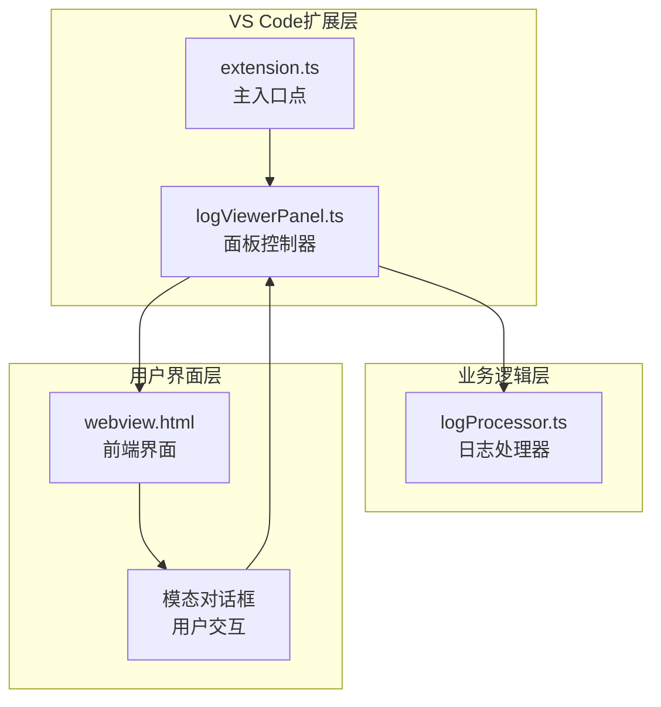
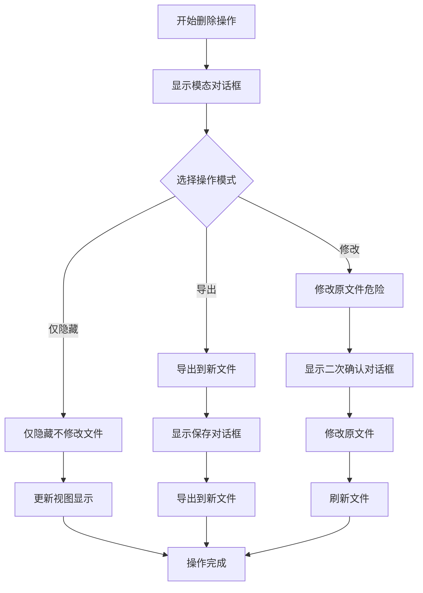
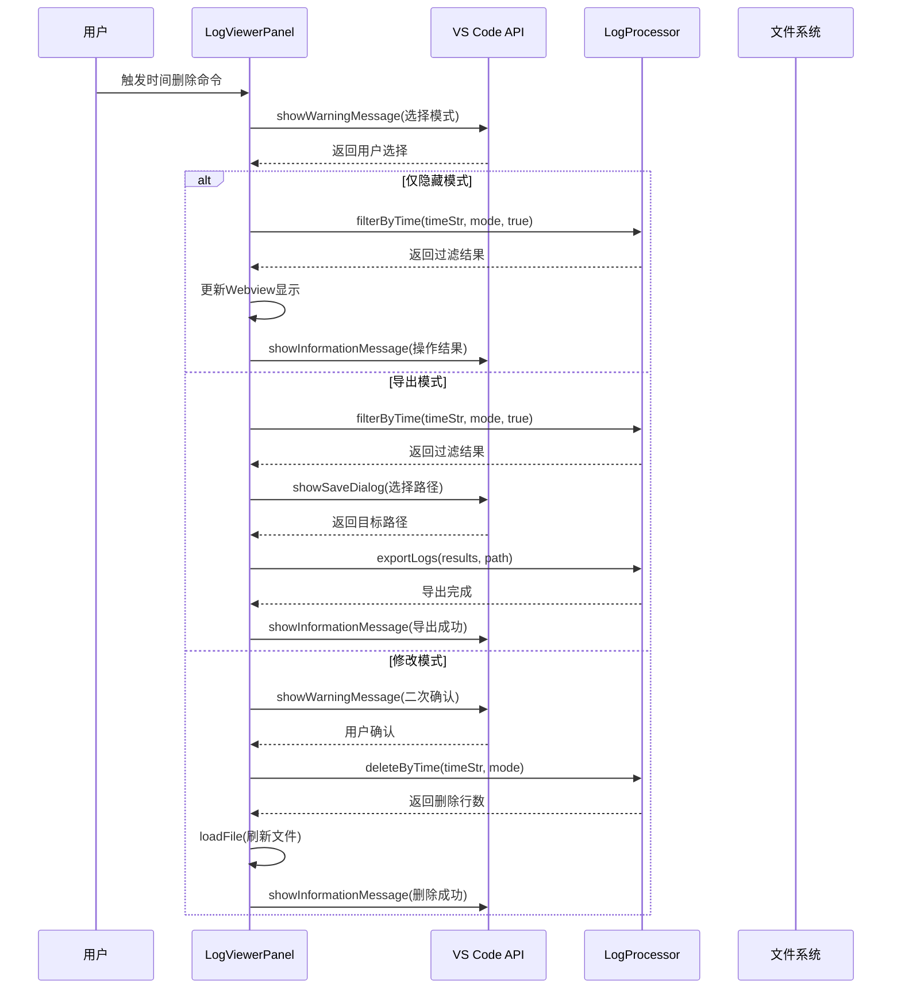
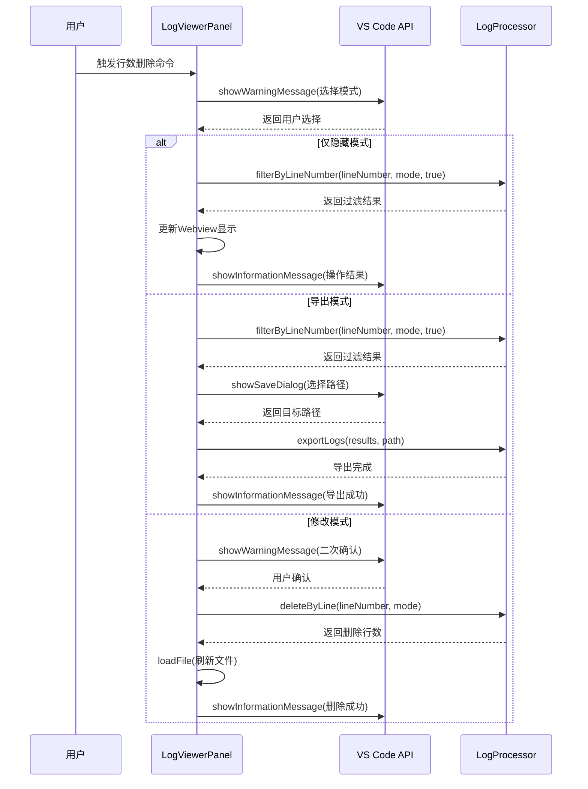
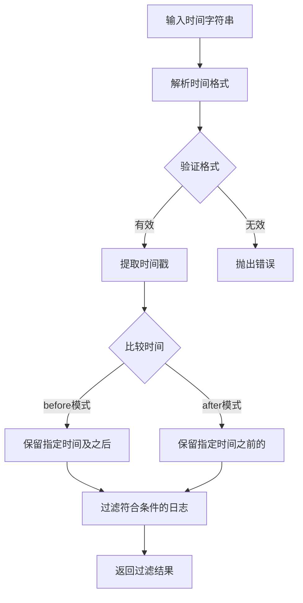
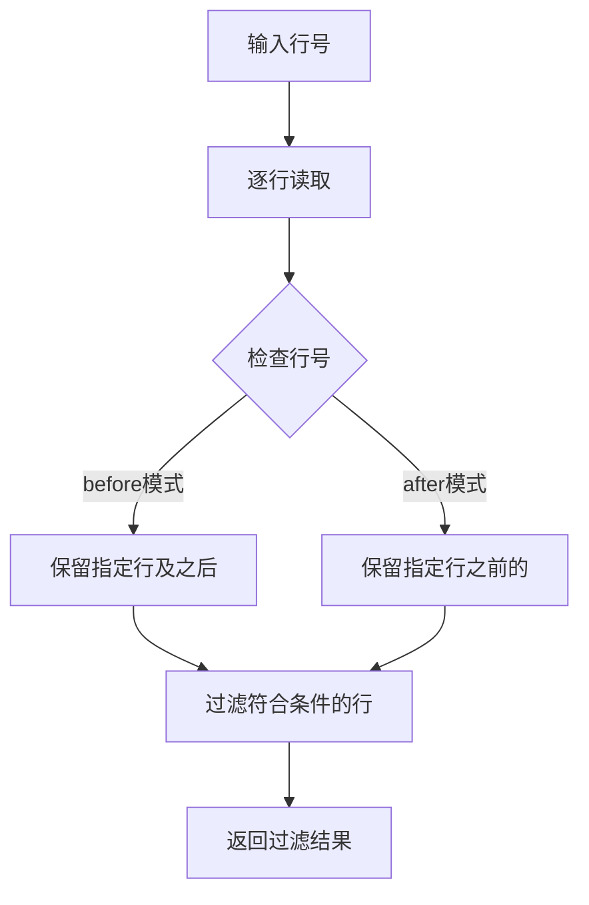
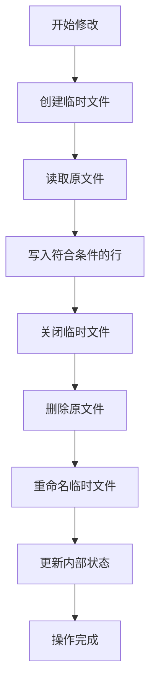
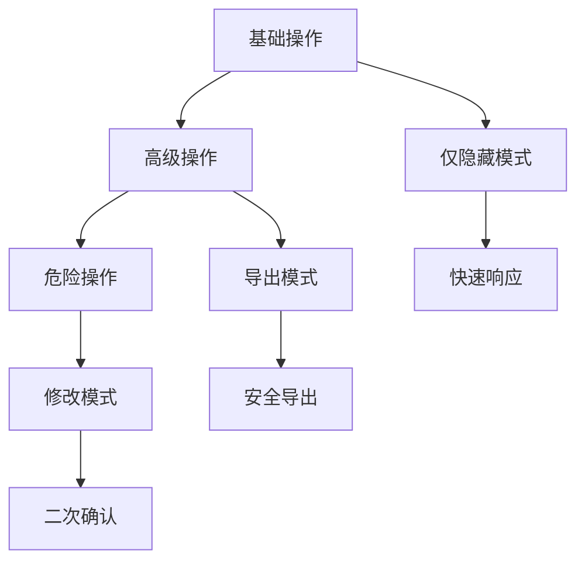

# 删除操作模式与用户交互

<cite>
**本文档引用的文件**
- [extension.ts](file://src/extension.ts)
- [logProcessor.ts](file://src/logProcessor.ts)
- [logViewerPanel.ts](file://src/logViewerPanel.ts)
- [webview.html](file://src/webview.html)
</cite>

## 目录
1. [简介](#简介)
2. [系统架构概览](#系统架构概览)
3. [删除操作模式详解](#删除操作模式详解)
4. [showWarningMessage模态对话框设计](#showwarningmessage模态对话框设计)
5. [用户交互流程分析](#用户交互流程分析)
6. [技术实现细节](#技术实现细节)
7. [安全机制与用户体验](#安全机制与用户体验)
8. [总结](#总结)

## 简介

本文档深入分析了一个大型日志文件查看器扩展程序中的删除操作模式系统。该系统提供了三种安全的操作模式，通过精心设计的用户交互界面确保数据安全性和操作透明度。系统采用分层设计理念，在功能强大性与数据安全性之间取得了完美平衡。

## 系统架构概览

该系统采用典型的VS Code扩展架构，包含以下核心组件：

**图表来源**
- [extension.ts](file://src/extension.ts#L1-L116)
- [logViewerPanel.ts](file://src/logViewerPanel.ts#L1-L510)
- [logProcessor.ts](file://src/logProcessor.ts#L1-L807)

**章节来源**
- [extension.ts](file://src/extension.ts#L1-L116)
- [logViewerPanel.ts](file://src/logViewerPanel.ts#L1-L510)

## 删除操作模式详解

系统提供三种删除操作模式，每种模式都有明确的安全边界和使用场景：

### 模式一：仅隐藏（不修改文件）

**特点：**
- 前端过滤显示，不影响原始文件
- 支持实时切换，无需重新加载
- 适合临时查看和分析

**技术实现：**
- 调用 `filterByTime` 或 `filterByLineNumber` 方法
- 保持原始数据完整性
- 实时更新视图显示

### 模式二：导出到新文件

**特点：**
- 过滤后保存到新文件
- 保留原始数据完整性
- 支持自定义输出路径

**技术实现：**
- 先调用过滤方法获取结果
- 弹出保存对话框选择目标路径
- 调用 `exportLogs` 方法保存结果

### 模式三：修改原文件（危险）

**特点：**
- 直接修改原始文件
- 不可逆操作
- 需要二次确认

**技术实现：**
- 弹出二次确认对话框
- 确认后调用删除方法
- 自动刷新文件内容

**章节来源**
- [logViewerPanel.ts](file://src/logViewerPanel.ts#L180-L227)
- [logViewerPanel.ts](file://src/logViewerPanel.ts#L230-L277)

## showWarningMessage模态对话框设计

系统使用VS Code的 `showWarningMessage` API创建模态对话框，提供清晰的用户引导和安全提示。

### 对话框文案设计原则

**图表来源**
- [logViewerPanel.ts](file://src/logViewerPanel.ts#L180-L227)
- [logViewerPanel.ts](file://src/logViewerPanel.ts#L230-L277)

### UI文案设计规范

**时间删除操作文案：**
- 主标题：`如何处理${mode === 'before' ? '之前' : '之后'}的日志？`
- 选项：
  - `'仅隐藏（不修改文件）'`
  - `'导出到新文件'`
  - `'修改原文件（危险）'`

**行数删除操作文案：**
- 主标题：`如何处理第${lineNumber}行${mode === 'before' ? '之前' : '之后'}的日志？`
- 选项同上

**二次确认文案：**
- 时间删除：`确定要删除${mode === 'before' ? '之前' : '之后'}的日志吗？此操作会修改原文件！`
- 行数删除：`确定要删除第${lineNumber}行${mode === 'before' ? '之前' : '之后'}的日志吗？此操作会修改原文件！`

**章节来源**
- [logViewerPanel.ts](file://src/logViewerPanel.ts#L180-L188)
- [logViewerPanel.ts](file://src/logViewerPanel.ts#L230-L238)
- [logViewerPanel.ts](file://src/logViewerPanel.ts#L280-L289)
- [logViewerPanel.ts](file://src/logViewerPanel.ts#L300-L309)

## 用户交互流程分析

### 时间删除操作流程

**图表来源**
- [logViewerPanel.ts](file://src/logViewerPanel.ts#L180-L227)
- [logProcessor.ts](file://src/logProcessor.ts#L175-L230)
- [logProcessor.ts](file://src/logProcessor.ts#L337-L408)

### 行数删除操作流程

**图表来源**
- [logViewerPanel.ts](file://src/logViewerPanel.ts#L230-L277)
- [logProcessor.ts](file://src/logProcessor.ts#L289-L336)
- [logProcessor.ts](file://src/logProcessor.ts#L412-L474)

**章节来源**
- [logViewerPanel.ts](file://src/logViewerPanel.ts#L180-L227)
- [logViewerPanel.ts](file://src/logViewerPanel.ts#L230-L277)

## 技术实现细节

### 核心算法实现

#### 时间过滤算法

系统实现了精确的时间过滤算法，支持多种时间格式：

**图表来源**
- [logProcessor.ts](file://src/logProcessor.ts#L175-L230)

#### 行数过滤算法

行数过滤算法相对简单，基于行号进行条件判断：

**图表来源**
- [logProcessor.ts](file://src/logProcessor.ts#L289-L336)

### 文件修改机制

修改原文件的操作采用安全的临时文件机制：

**图表来源**
- [logProcessor.ts](file://src/logProcessor.ts#L337-L408)
- [logProcessor.ts](file://src/logProcessor.ts#L412-L474)

### 错误处理机制

系统实现了完善的错误处理机制：

| 错误类型 | 处理方式 | 用户反馈 |
|---------|---------|---------|
| 时间格式错误 | 简单验证 | 显示格式提示 |
| 文件读取错误 | Promise.reject | 显示错误消息 |
| 文件写入错误 | 回滚操作 | 显示错误消息 |
| 用户取消操作 | 直接返回 | 无操作反馈 |

**章节来源**
- [logProcessor.ts](file://src/logProcessor.ts#L175-L230)
- [logProcessor.ts](file://src/logProcessor.ts#L289-L336)
- [logProcessor.ts](file://src/logProcessor.ts#L337-L408)
- [logProcessor.ts](file://src/logProcessor.ts#L412-L474)

## 安全机制与用户体验

### 多层安全防护

系统实现了多层安全防护机制：

1. **前端验证层**：在用户输入阶段进行基本格式验证
2. **模态确认层**：通过模态对话框进行二次确认
3. **操作隔离层**：不同操作模式间的数据隔离
4. **备份保护层**：导出功能确保原始数据不丢失

### 用户体验优化

#### 渐进式披露

#### 清晰的视觉反馈

- **颜色编码**：不同操作模式使用不同的颜色标识
- **图标提示**：每个模式都有对应的图标
- **文案说明**：详细的文案说明操作影响范围

#### 操作结果反馈

每次操作都提供明确的结果反馈：

| 操作类型 | 成功消息 | 失败消息 |
|---------|---------|---------|
| 仅隐藏 | `已隐藏 ${count} 行日志` | `隐藏操作失败` |
| 导出 | `成功导出 ${count} 行日志` | `导出操作失败` |
| 修改 | `成功删除 ${count} 行日志` | `删除操作失败` |

**章节来源**
- [logViewerPanel.ts](file://src/logViewerPanel.ts#L180-L227)
- [logViewerPanel.ts](file://src/logViewerPanel.ts#L230-L277)

## 总结

该日志文件查看器扩展程序的删除操作模式系统展现了优秀的软件设计原则：

### 设计优势

1. **安全性优先**：通过多层确认机制确保数据安全
2. **用户体验友好**：清晰的文案和直观的操作流程
3. **功能灵活**：满足不同场景下的需求
4. **技术实现优雅**：合理的架构设计和错误处理

### 最佳实践

1. **分层设计**：清晰的职责分离
2. **渐进式授权**：从简单到复杂的操作流程
3. **用户引导**：完善的提示和反馈机制
4. **错误处理**：全面的异常情况处理

这种设计不仅保证了系统的功能性，更重要的是在用户操作过程中提供了充分的安全保障和良好的用户体验，是现代软件开发中值得借鉴的设计模式。