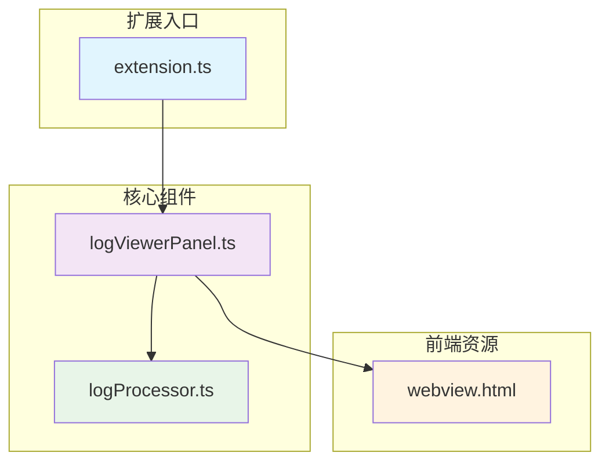
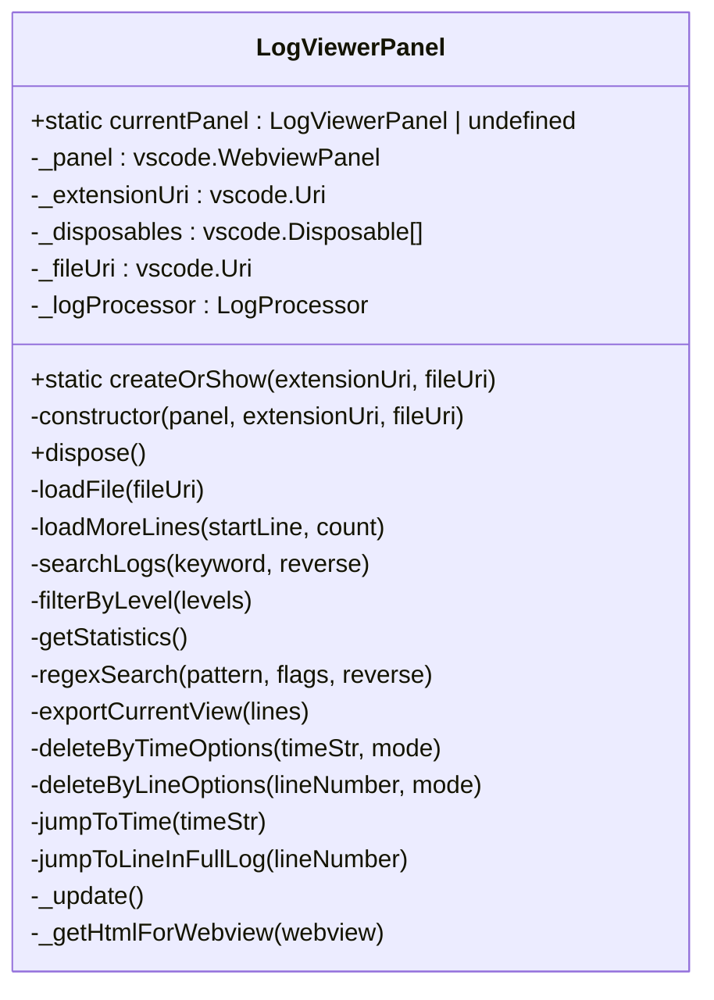
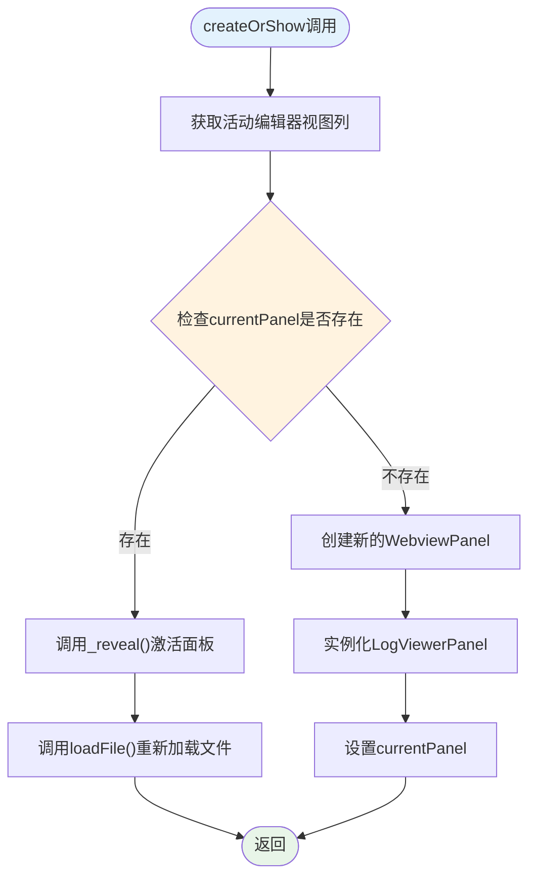
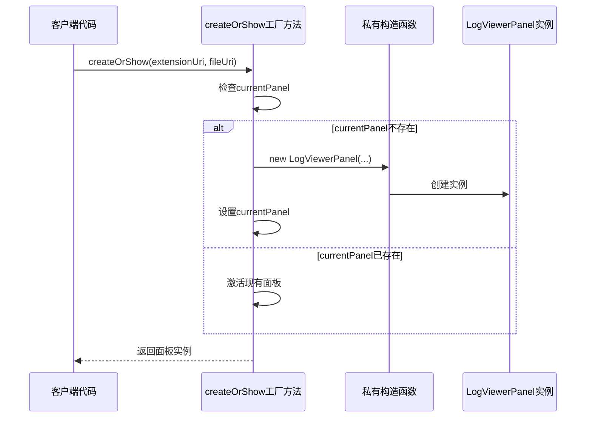
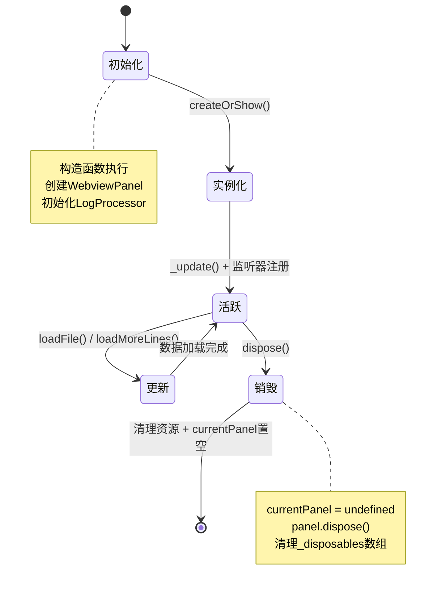
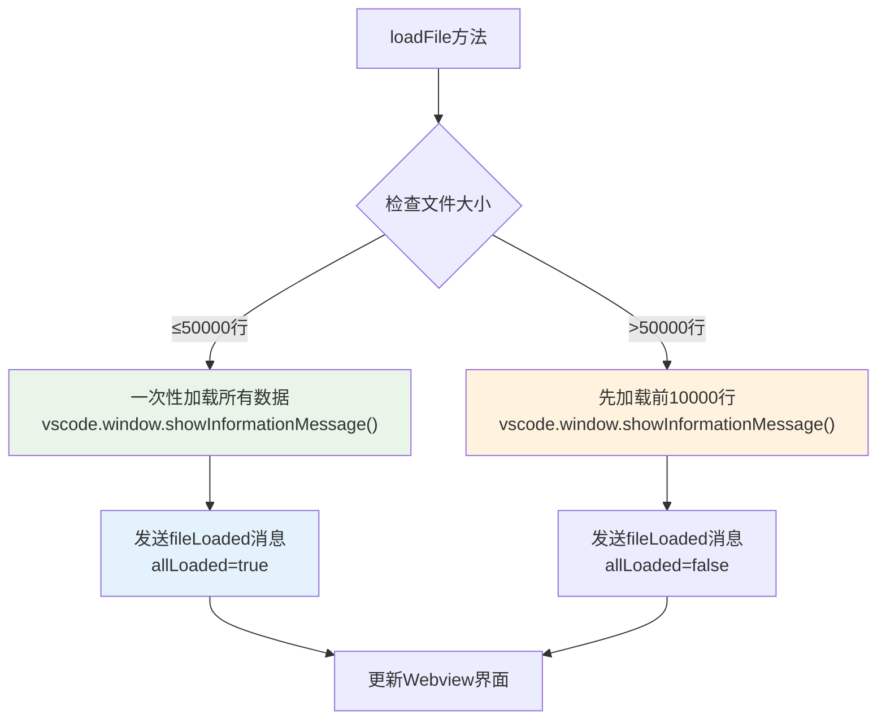

# 单例模式与面板管理

<cite>
**本文档引用的文件**
- [logViewerPanel.ts](file://src/logViewerPanel.ts)
- [extension.ts](file://src/extension.ts)
- [package.json](file://package.json)
</cite>

## 目录
1. [简介](#简介)
2. [项目结构概览](#项目结构概览)
3. [单例模式核心实现](#单例模式核心实现)
4. [createOrShow静态方法详解](#createorshow静态方法详解)
5. [构造函数私有化机制](#构造函数私有化机制)
6. [面板生命周期管理](#面板生命周期管理)
7. [性能优化策略](#性能优化策略)
8. [用户体验提升](#用户体验提升)
9. [总结](#总结)

## 简介

LogViewerPanel类是VSCode扩展中的核心组件，采用经典的单例模式设计来管理日志查看器面板。该设计确保在整个VSCode会话中只存在一个日志查看器实例，有效防止资源浪费和界面混乱，同时提供优秀的用户体验。

## 项目结构概览

该项目采用模块化架构，主要包含以下核心文件：

**图表来源**
- [extension.ts](file://src/extension.ts#L1-L116)
- [logViewerPanel.ts](file://src/logViewerPanel.ts#L1-L510)

**章节来源**
- [extension.ts](file://src/extension.ts#L1-L116)
- [logViewerPanel.ts](file://src/logViewerPanel.ts#L1-L510)

## 单例模式核心实现

LogViewerPanel类的核心单例模式实现基于静态属性和工厂方法的设计模式。

### static currentPanel属性

**图表来源**
- [logViewerPanel.ts](file://src/logViewerPanel.ts#L6-L12)

`currentPanel`静态属性是单例模式的核心，它维护着当前活跃的LogViewerPanel实例。该属性具有以下特点：

- **类型安全**：明确声明为`LogViewerPanel | undefined`，表示可能不存在实例
- **作用域限制**：作为静态属性，属于类本身而非实例
- **状态同步**：确保整个应用中只有一个活跃的面板实例

**章节来源**
- [logViewerPanel.ts](file://src/logViewerPanel.ts#L6-L12)

## createOrShow静态方法详解

`createOrShow`方法是LogViewerPanel类的工厂方法，实现了完整的单例控制逻辑。

### 方法执行流程

**图表来源**
- [logViewerPanel.ts](file://src/logViewerPanel.ts#L14-L39)

### 关键实现细节

1. **视图列检测**：优先使用当前活动编辑器的视图列，保持界面布局一致性
2. **实例复用**：当面板已存在时，直接激活现有实例并更新内容
3. **新实例创建**：当面板不存在时，通过VSCode API创建新的WebviewPanel
4. **状态管理**：确保`currentPanel`始终指向当前活跃实例

**章节来源**
- [logViewerPanel.ts](file://src/logViewerPanel.ts#L14-L39)

## 构造函数私有化机制

为了强制使用工厂方法创建实例，LogViewerPanel类采用了构造函数私有化的设计模式。

### 私有构造函数的作用

**图表来源**
- [logViewerPanel.ts](file://src/logViewerPanel.ts#L41-L105)

### 设计优势

1. **访问控制**：防止直接使用`new LogViewerPanel()`创建实例
2. **状态一致性**：确保所有实例都通过工厂方法创建，便于状态管理
3. **资源控制**：统一实例创建流程，便于添加初始化逻辑
4. **错误预防**：避免开发者绕过单例控制机制

**章节来源**
- [logViewerPanel.ts](file://src/logViewerPanel.ts#L41-L105)

## 面板生命周期管理

LogViewerPanel类实现了完整的生命周期管理，包括创建、使用和销毁阶段。

### 生命周期状态转换

**图表来源**
- [logViewerPanel.ts](file://src/logViewerPanel.ts#L41-L508)

### 资源清理机制

`dispose`方法负责清理所有资源，确保内存泄漏不会发生：

1. **状态重置**：将`currentPanel`设置为`undefined`
2. **面板释放**：调用`_panel.dispose()`释放VSCode面板资源
3. **监听器清理**：遍历并释放所有注册的Disposable对象
4. **内存回收**：确保JavaScript垃圾回收机制能够正常工作

**章节来源**
- [logViewerPanel.ts](file://src/logViewerPanel.ts#L497-L508)

## 性能优化策略

LogViewerPanel类针对大文件处理场景实施了多项性能优化策略。

### 文件加载策略

**图表来源**
- [logViewerPanel.ts](file://src/logViewerPanel.ts#L107-L147)

### 优化特性

1. **分层加载**：根据文件大小动态调整加载策略
2. **进度提示**：实时向用户反馈加载状态
3. **内存管理**：避免一次性加载超大文件导致内存溢出
4. **异步处理**：使用async/await确保UI响应性

**章节来源**
- [logViewerPanel.ts](file://src/logViewerPanel.ts#L107-L147)

## 用户体验提升

单例模式设计显著提升了用户体验，避免了重复打开相同日志文件导致的性能问题。

### 用户交互优化

| 场景 | 传统方式 | 单例模式优势 |
|------|----------|--------------|
| 打开同一文件 | 重复创建新面板 | 激活现有面板，保持状态 |
| 切换文件 | 新建面板覆盖旧面板 | 维持原有位置和状态 |
| 多文件操作 | 面板混乱难以管理 | 统一管理，减少干扰 |
| 性能表现 | 频繁创建销毁开销 | 减少资源消耗，提升响应速度 |

### 界面一致性保证

1. **位置保持**：使用相同的视图列位置，避免界面跳动
2. **状态保留**：激活现有面板时保留搜索、过滤等状态
3. **操作连续性**：支持在同一个面板中处理多个文件
4. **资源效率**：避免重复初始化和内存分配

**章节来源**
- [extension.ts](file://src/extension.ts#L8-L31)

## 总结

LogViewerPanel类的单例模式实现展现了优秀的软件设计原则：

### 核心设计原则

1. **单一职责**：每个类只负责面板管理这一特定功能
2. **开放封闭**：对扩展开放，对修改封闭，易于功能扩展
3. **依赖倒置**：依赖抽象接口而非具体实现
4. **接口隔离**：提供清晰的公共接口，隐藏内部实现细节

### 技术亮点

- **静态状态管理**：通过`currentPanel`静态属性实现全局状态控制
- **工厂模式**：使用`createOrShow`方法统一实例创建流程
- **私有构造函数**：强制使用工厂方法，确保单例约束
- **完整生命周期**：从创建到销毁的全过程资源管理
- **性能优化**：针对大文件场景的智能加载策略

这种设计不仅确保了系统的稳定性和性能，还为用户提供了流畅一致的操作体验，是VSCode扩展开发中单例模式应用的优秀范例。