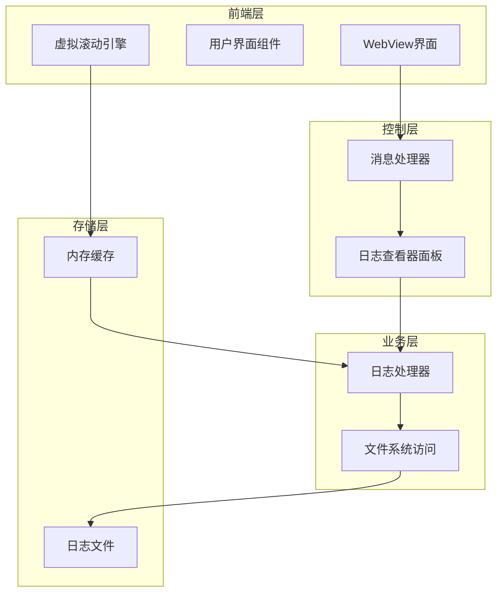
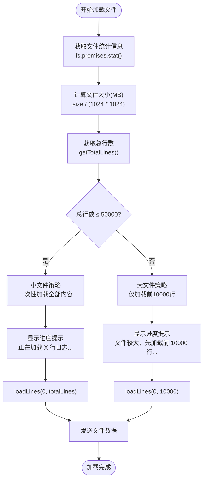
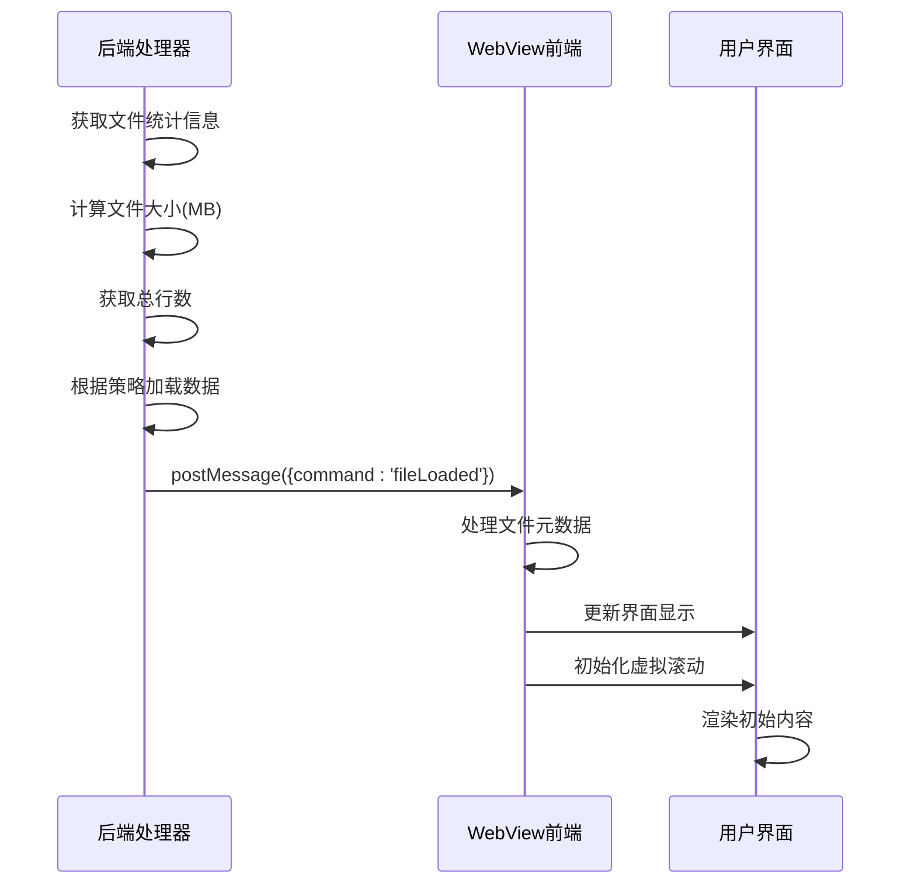
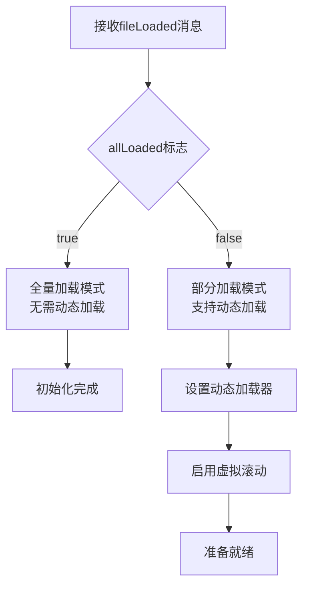
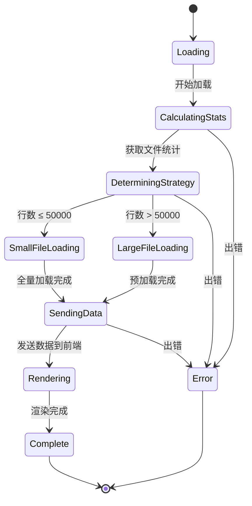
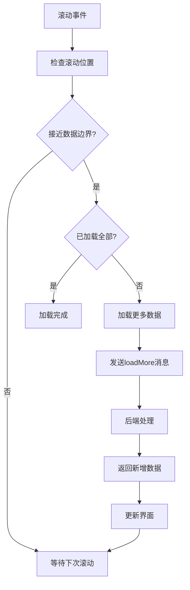
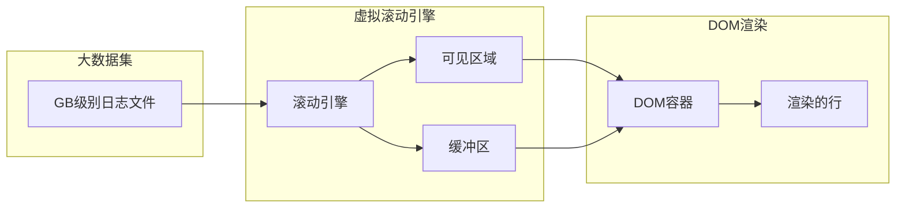
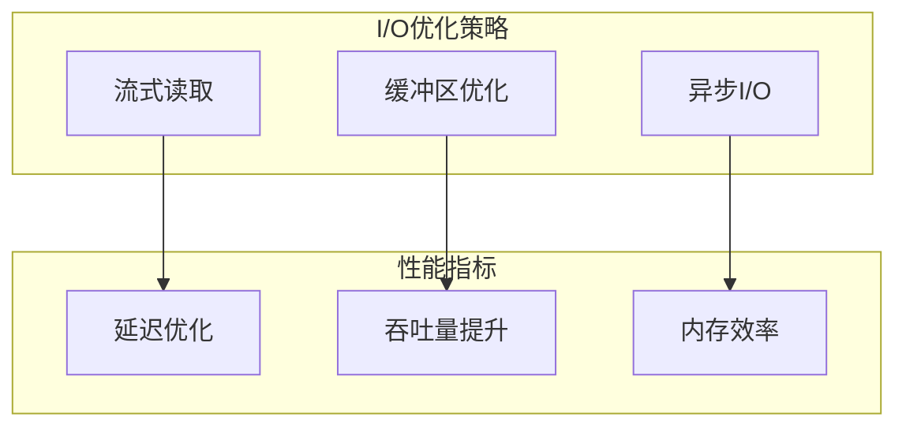
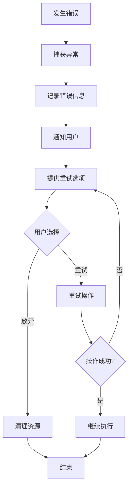

# 智能文件加载策略

<cite>
**本文档引用的文件**
- [logViewerPanel.ts](file://src/logViewerPanel.ts)
- [logProcessor.ts](file://src/logProcessor.ts)
- [webview.html](file://src/webview.html)
- [package.json](file://package.json)
- [README.md](file://README.md)
</cite>

## 目录
1. [概述](#概述)
2. [系统架构](#系统架构)
3. [智能加载策略详解](#智能加载策略详解)
4. [文件元数据传输机制](#文件元数据传输机制)
5. [用户体验优化策略](#用户体验优化策略)
6. [虚拟滚动与动态加载](#虚拟滚动与动态加载)
7. [性能考量与优化](#性能考量与优化)
8. [故障处理与错误恢复](#故障处理与错误恢复)
9. [总结](#总结)

## 概述

大型日志文件查看器采用了一套精密的智能加载策略，专门针对GB级别日志文件的高性能处理需求。该系统通过文件大小和行数的双重判断，实现了从小文件的全量加载到大文件的分段加载的无缝切换，确保了用户体验的流畅性和系统的响应速度。

## 系统架构

**图表来源**
- [logViewerPanel.ts](file://src/logViewerPanel.ts#L1-L510)
- [logProcessor.ts](file://src/logProcessor.ts#L1-L807)
- [webview.html](file://src/webview.html#L1-L800)

## 智能加载策略详解

### 文件大小与行数检测机制

系统通过两个关键指标来决定加载策略：文件大小和总行数。这种双重检测机制确保了加载策略的准确性。

**图表来源**
- [logViewerPanel.ts](file://src/logViewerPanel.ts#L107-L148)

### 基于50000行阈值的决策逻辑

系统采用50000行作为智能加载的临界点，这一阈值经过性能测试和用户体验评估确定：

| 文件规模 | 加载策略 | 预期响应时间 | 内存占用 | 用户体验 |
|---------|---------|------------|---------|---------|
| ≤ 50000行 | 全量加载 | 即时响应 | 较高 | 完整视图 |
| > 50000行 | 分段加载 | 秒级响应 | 低 | 快速启动 |

**节来源**
- [logViewerPanel.ts](file://src/logViewerPanel.ts#L118-L128)

### 小文件处理策略

对于小于50000行的小文件，系统采用全量加载策略：
- **一次性加载全部内容**：避免分页加载的复杂性
- **提供完整视图**：用户可以浏览整个日志文件
- **即时可用性**：无需等待额外的数据加载

### 大文件处理策略

对于超过50000行的大文件，系统采用分段加载策略：
- **预加载10000行**：确保秒级响应时间
- **后续按需加载**：通过虚拟滚动实现流畅的滚动体验
- **内存友好**：仅保持当前可见区域的数据在内存中

**节来源**
- [logViewerPanel.ts](file://src/logViewerPanel.ts#L121-L127)

## 文件元数据传输机制

### fileLoaded消息结构

系统通过`fileLoaded`消息将文件元数据和初始日志行发送至WebView，确保前端能够正确初始化界面。

**图表来源**
- [logViewerPanel.ts](file://src/logViewerPanel.ts#L132-L142)
- [webview.html](file://src/webview.html#L1314-L1334)

### 元数据字段说明

| 字段名 | 类型 | 描述 | 示例值 |
|-------|------|------|--------|
| fileName | string | 文件名称 | "application.log" |
| filePath | string | 文件完整路径 | "/var/logs/app.log" |
| fileSize | string | 文件大小(MB) | "12.34" |
| totalLines | number | 总行数 | 125432 |
| lines | LogLine[] | 初始加载的日志行 | [{lineNumber: 1, content: "..."}] |
| allLoaded | boolean | 是否已加载全部数据 | false |

**节来源**
- [logViewerPanel.ts](file://src/logViewerPanel.ts#L134-L140)

### allLoaded标志的作用

`allLoaded`标志是前端判断是否需要支持动态加载的关键信号：

**图表来源**
- [webview.html](file://src/webview.html#L1330-L1333)

## 用户体验优化策略

### 信息提示的分级策略

系统采用分级的信息提示策略，确保用户对加载过程有清晰的认知：

#### 加载前提示
- **预期等待时间**：让用户了解即将进行的操作
- **具体数值展示**：明确显示行数和文件大小
- **进度感营造**：通过具体的数字建立预期

#### 成功后反馈
- **详细加载结果**：显示实际加载的行数和文件信息
- **性能指标**：提供文件大小和行数统计
- **完成确认**：明确告知加载已完成

**节来源**
- [logViewerPanel.ts](file://src/logViewerPanel.ts#L122-L123)
- [logViewerPanel.ts](file://src/logViewerPanel.ts#L126-L127)
- [logViewerPanel.ts](file://src/logViewerPanel.ts#L144-L144)

### 加载状态管理

**图表来源**
- [logViewerPanel.ts](file://src/logViewerPanel.ts#L107-L148)

## 虚拟滚动与动态加载

### 动态加载触发机制

前端通过智能的动态加载机制，在用户滚动接近数据边界时自动加载更多内容：

**图表来源**
- [webview.html](file://src/webview.html#L3375-L3406)

### 智能加载参数

系统采用以下智能参数来优化加载体验：

| 参数 | 默认值 | 说明 | 优化目标 |
|------|--------|------|----------|
| 预加载行数 | 10000 | 大文件初始加载量 | 秒级响应 |
| 动态加载增量 | 10000 | 每次加载行数 | 平衡性能与体验 |
| 边界触发距离 | 500行 | 触发加载的缓冲区 | 提前加载避免卡顿 |
| 最大加载限制 | 50倍pageSize | 防止过度加载 | 控制内存使用 |

**节来源**
- [webview.html](file://src/webview.html#L3398-L3405)

### 虚拟滚动实现原理

虚拟滚动技术确保即使处理GB级别的日志文件，也能保持流畅的用户体验：

**图表来源**
- [webview.html](file://src/webview.html#L1314-L1347)

## 性能考量与优化

### 内存使用优化

系统采用多种策略来优化内存使用：

#### 流式读取
- **逐行读取**：避免将整个文件加载到内存
- **背压控制**：根据消费速度调整读取速度
- **垃圾回收友好**：及时释放不需要的对象

#### 智能缓存策略
- **LRU缓存**：最近使用的行优先保留在内存
- **分页缓存**：按页面组织数据，避免全量缓存
- **压缩存储**：对历史数据进行压缩存储

### I/O性能优化

**图表来源**
- [logProcessor.ts](file://src/logProcessor.ts#L60-L85)
- [logProcessor.ts](file://src/logProcessor.ts#L87-L130)

### 响应时间保证

系统通过以下机制确保响应时间：

| 场景 | 目标响应时间 | 实现方式 |
|------|------------|----------|
| 小文件加载 | 即时响应 | 全量加载，无延迟 |
| 大文件预加载 | 秒级响应 | 10000行预加载 |
| 滚动加载 | 100ms内 | 智能预加载 |
| 搜索操作 | 3秒内 | 流式搜索 |

**节来源**
- [README.md](file://README.md#L220-L226)

## 故障处理与错误恢复

### 错误处理机制

系统建立了完善的错误处理和恢复机制：

**图表来源**
- [logViewerPanel.ts](file://src/logViewerPanel.ts#L145-L147)

### 错误类型与处理策略

| 错误类型 | 处理策略 | 用户反馈 |
|---------|---------|---------|
| 文件不存在 | 显示错误消息 | "文件不存在，请检查路径" |
| 权限不足 | 请求管理员权限 | "权限不足，请以管理员身份运行" |
| 文件过大 | 提示用户选择 | "文件过大，建议选择特定时间段" |
| 读取错误 | 自动重试 | "读取失败，正在重试..." |

**节来源**
- [logViewerPanel.ts](file://src/logViewerPanel.ts#L145-L147)

### 数据完整性保障

系统采用多重机制确保数据完整性：

#### 校验机制
- **行数校验**：验证加载的行数是否符合预期
- **内容校验**：检查日志格式的正确性
- **完整性检查**：确保没有数据丢失

#### 回滚机制
- **状态保存**：保存加载过程中的中间状态
- **优雅降级**：在部分失败时提供可用的功能
- **数据恢复**：从错误状态中恢复到稳定状态

## 总结

大型日志文件查看器的智能加载策略体现了现代软件工程的最佳实践：

### 核心优势

1. **智能决策**：基于文件大小和行数的双重判断，确保加载策略的准确性
2. **用户体验**：分级的信息提示和即时的响应时间，提供优秀的用户体验
3. **性能优化**：虚拟滚动和动态加载技术，支持GB级别文件的流畅处理
4. **可靠性**：完善的错误处理和恢复机制，确保系统的稳定性

### 技术创新

- **混合加载策略**：结合全量加载和分段加载的优势
- **智能预加载**：基于用户行为预测的动态加载
- **内存友好设计**：最小化内存占用的同时最大化性能

### 应用价值

这套智能加载策略不仅适用于日志文件处理，其设计理念和实现技术可以推广到其他需要处理大规模数据的应用场景，为构建高性能的数据处理应用提供了宝贵的参考。