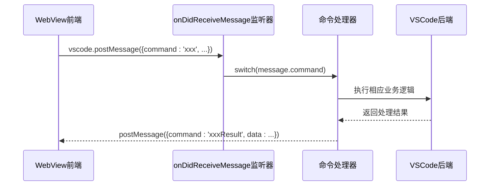
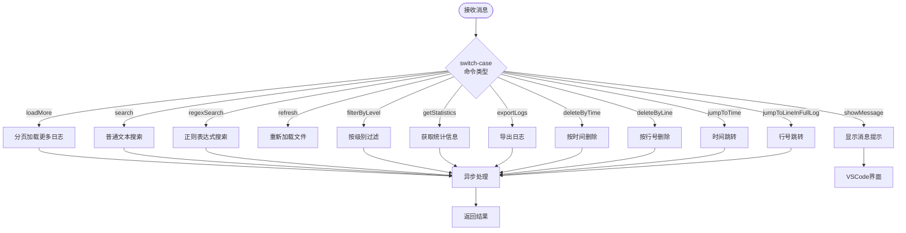
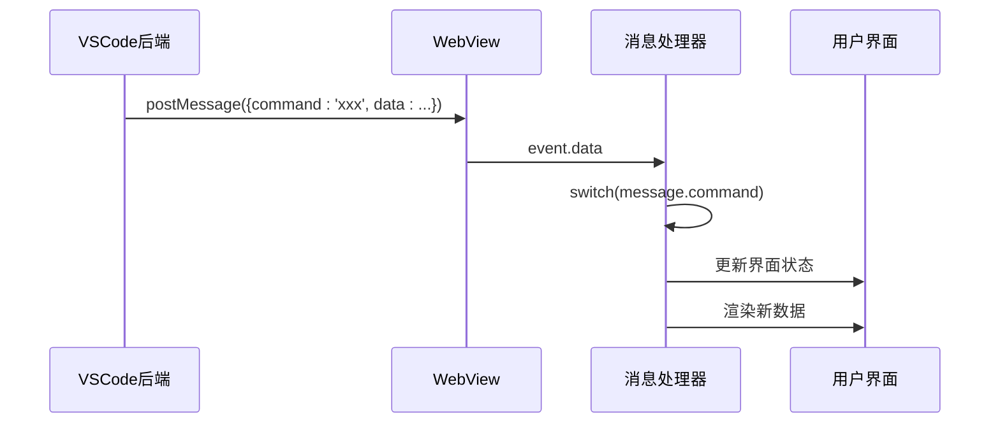
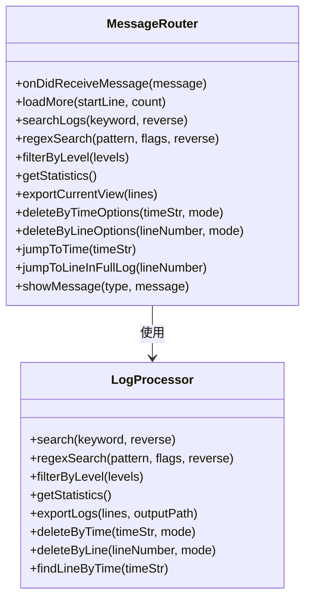
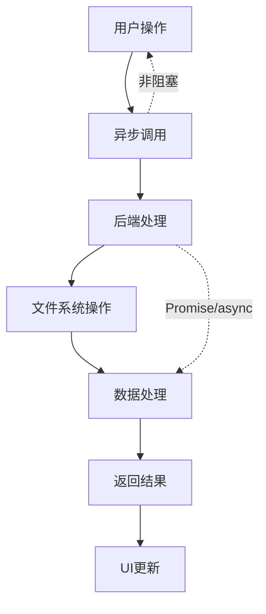
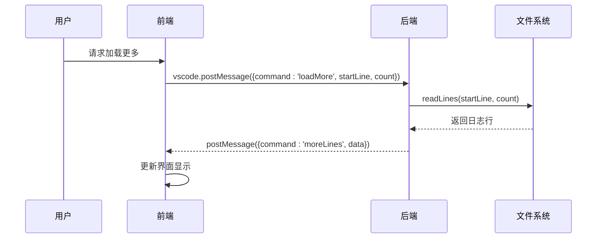
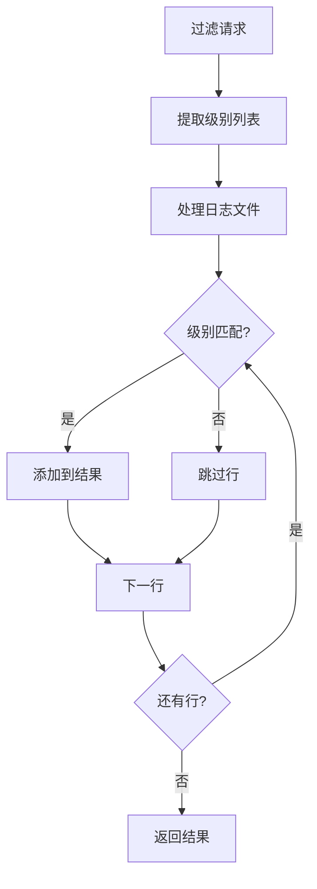
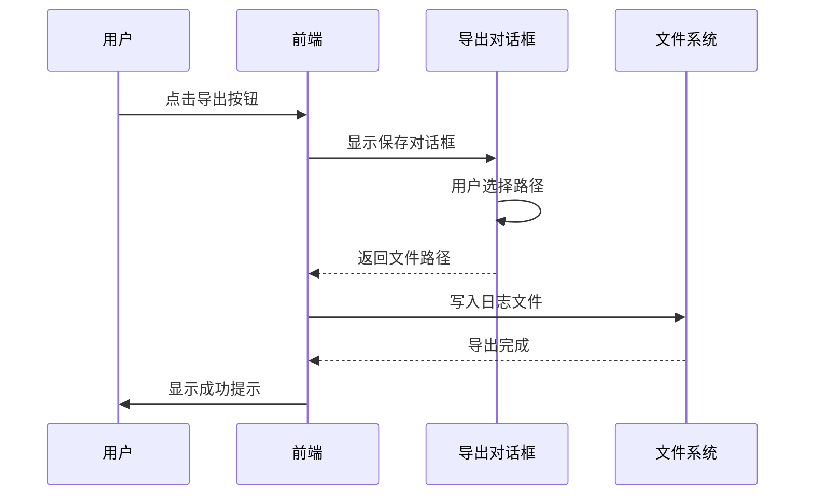
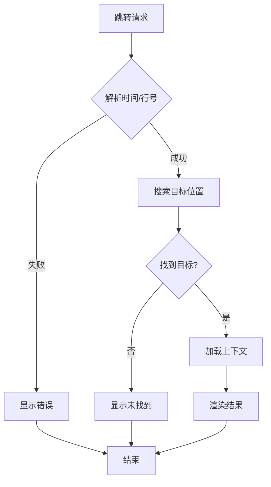
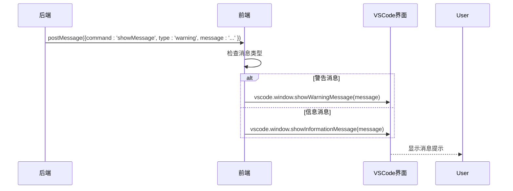

# 消息通信机制解析

<cite>
**本文档引用的文件**
- [src/extension.ts](file://src/extension.ts)
- [src/logViewerPanel.ts](file://src/logViewerPanel.ts)
- [src/logProcessor.ts](file://src/logProcessor.ts)
- [src/webview.html](file://src/webview.html)
- [package.json](file://package.json)
</cite>

## 目录
1. [简介](#简介)
2. [项目架构概览](#项目架构概览)
3. [核心消息通信机制](#核心消息通信机制)
4. [前端消息处理器详解](#前端消息处理器详解)
5. [后端消息路由分析](#后端消息路由分析)
6. [异步处理与性能优化](#异步处理与性能优化)
7. [消息命令详细解析](#消息命令详细解析)
8. [跨上下文反馈机制](#跨上下文反馈机制)
9. [最佳实践与总结](#最佳实践与总结)

## 简介

本文档深入分析了一个VSCode扩展的日志查看器组件中，WebView前端与VSCode后端之间的消息通信机制。该系统采用双向通信架构，通过`onDidReceiveMessage`事件监听器实现高效的前后端交互，支持分页加载、搜索过滤、统计分析等多种功能。

## 项目架构概览

该日志查看器采用典型的VSCode扩展架构，包含以下核心组件：

```mermaid
graph TB
subgraph "VSCode扩展环境"
Extension[extension.ts<br/>主入口点]
Panel[logViewerPanel.ts<br/>面板控制器]
Processor[logProcessor.ts<br/>日志处理器]
end
subgraph "WebView前端"
HTML[webview.html<br/>HTML模板]
JS[JavaScript<br/>前端逻辑]
end
Extension --> Panel
Panel --> Processor
Panel < --> HTML
HTML --> JS
JS --> Panel
```

**图表来源**
- [src/extension.ts](file://src/extension.ts#L1-L116)
- [src/logViewerPanel.ts](file://src/logViewerPanel.ts#L1-L510)
- [src/webview.html](file://src/webview.html#L1-L4301)

**章节来源**
- [src/extension.ts](file://src/extension.ts#L1-L116)
- [src/logViewerPanel.ts](file://src/logViewerPanel.ts#L1-L510)

## 核心消息通信机制

### WebView消息监听器

系统的核心通信机制基于VSCode提供的`onDidReceiveMessage`事件监听器，该监听器位于`logViewerPanel.ts`文件的第54-97行：



**图表来源**
- [src/logViewerPanel.ts](file://src/logViewerPanel.ts#L54-L97)

### 消息路由架构

switch-case结构提供了高效的命令路由机制，每个case分支对应特定的功能命令：



**图表来源**
- [src/logViewerPanel.ts](file://src/logViewerPanel.ts#L56-L96)

**章节来源**
- [src/logViewerPanel.ts](file://src/logViewerPanel.ts#L54-L97)

## 前端消息处理器详解

### 消息接收与处理流程

前端通过`window.addEventListener('message', ...)`监听来自VSCode后端的消息：



**图表来源**
- [src/webview.html](file://src/webview.html#L1237-L1262)

### 响应消息处理函数

前端实现了多个专门的消息处理函数，每个对应后端的一个命令：

| 命令类型 | 处理函数 | 功能描述 |
|---------|---------|----------|
| fileLoaded | handleFileLoaded() | 处理文件加载完成事件 |
| moreLines | handleMoreLines() | 处理分页加载更多事件 |
| searchResults | handleSearchResults() | 处理搜索结果返回 |
| filterResults | handleFilterResults() | 处理过滤结果返回 |
| statisticsResults | handleStatisticsResults() | 处理统计信息返回 |
| jumpToTimeResult | handleJumpToTimeResult() | 处理时间跳转结果 |
| jumpToLineInFullLogResult | handleJumpToLineInFullLogResult() | 处理完整日志跳转结果 |

**章节来源**
- [src/webview.html](file://src/webview.html#L1237-L1262)

## 后端消息路由分析

### 命令路由表

后端switch-case结构实现了精确的命令路由，每个case分支处理特定的业务逻辑：



**图表来源**
- [src/logViewerPanel.ts](file://src/logViewerPanel.ts#L56-L96)
- [src/logProcessor.ts](file://src/logProcessor.ts#L1-L807)

**章节来源**
- [src/logViewerPanel.ts](file://src/logViewerPanel.ts#L54-L97)

## 异步处理与性能优化

### 异步处理架构

系统广泛采用异步处理模式，避免阻塞UI线程：



**图表来源**
- [src/logViewerPanel.ts](file://src/logViewerPanel.ts#L150-L162)
- [src/logViewerPanel.ts](file://src/logViewerPanel.ts#L165-L177)

### 性能优化策略

1. **分页加载机制**：大数据文件采用分页加载，避免一次性加载过多数据
2. **智能缓存**：记录页面范围，避免重复计算
3. **异步计算**：折叠模式下的页面范围计算采用异步处理
4. **流式处理**：使用readline模块进行流式文件读取

**章节来源**
- [src/logViewerPanel.ts](file://src/logViewerPanel.ts#L150-L162)
- [src/logViewerPanel.ts](file://src/logViewerPanel.ts#L1534-L1588)

## 消息命令详细解析

### loadMore - 分页加载更多

负责处理分页加载更多日志行的功能：



**图表来源**
- [src/logViewerPanel.ts](file://src/logViewerPanel.ts#L150-L162)

### search & regexSearch - 搜索功能

支持普通文本搜索和正则表达式搜索：

| 特性 | 普通搜索 | 正则搜索 |
|------|---------|----------|
| 匹配方式 | 字面匹配 | 正则表达式匹配 |
| 性能 | 较快 | 较慢（取决于复杂度） |
| 功能 | 简单文本匹配 | 复杂模式匹配 |
| 使用场景 | 基本搜索 | 高级搜索需求 |

### filterByLevel - 日志级别过滤

实现按日志级别（ERROR、WARN、INFO、DEBUG）进行过滤：



**图表来源**
- [src/logViewerPanel.ts](file://src/logViewerPanel.ts#L409-L426)
- [src/logProcessor.ts](file://src/logProcessor.ts#L649-L698)

### getStatistics - 统计信息获取

提供全面的日志统计分析功能：

| 统计维度 | 数据类型 | 描述 |
|---------|---------|------|
| 总行数 | Number | 文件总行数 |
| 错误统计 | Number | ERROR级别日志数量 |
| 警告统计 | Number | WARN级别日志数量 |
| 信息统计 | Number | INFO级别日志数量 |
| 调试统计 | Number | DEBUG级别日志数量 |
| 时间范围 | Object | 日志时间范围 |
| 类名统计 | Map | 按类名统计分布 |
| 方法统计 | Map | 按方法名统计分布 |
| 线程统计 | Map | 按线程名统计分布 |

### exportLogs - 日志导出

支持将当前视图的日志导出到文件：



**图表来源**
- [src/logViewerPanel.ts](file://src/logViewerPanel.ts#L465-L482)

### deleteByTime & deleteByLine - 删除功能

提供灵活的删除选项：

| 删除方式 | 参数 | 影响范围 | 安全级别 |
|---------|------|----------|----------|
| 按时间删除 | timeStr, mode | 指定时间前/后 | 危险（修改原文件） |
| 按行号删除 | lineNumber, mode | 指定行前/后 | 危险（修改原文件） |
| 仅隐藏 | - | 当前视图 | 安全 |
| 导出到新文件 | - | 新文件 | 安全 |

### jumpToTime & jumpToLineInFullLog - 精准跳转

实现快速定位功能：



**图表来源**
- [src/logViewerPanel.ts](file://src/logViewerPanel.ts#L320-L360)
- [src/logViewerPanel.ts](file://src/logViewerPanel.ts#L363-L406)

**章节来源**
- [src/logViewerPanel.ts](file://src/logViewerPanel.ts#L56-L96)

## 跨上下文反馈机制

### showMessage命令实现

`showMessage`命令实现了跨上下文的反馈机制：



**图表来源**
- [src/logViewerPanel.ts](file://src/logViewerPanel.ts#L90-L96)

### 错误处理与用户反馈

系统实现了完善的错误处理机制：

| 错误类型 | 处理方式 | 用户体验 |
|---------|---------|----------|
| 文件加载失败 | 显示错误消息 | 提示具体错误原因 |
| 搜索无结果 | 显示友好提示 | 建议其他搜索方式 |
| 删除操作失败 | 显示错误信息 | 提醒备份重要数据 |
| 时间格式错误 | 实时验证 | 即时反馈格式要求 |

**章节来源**
- [src/logViewerPanel.ts](file://src/logViewerPanel.ts#L90-L96)

## 最佳实践与总结

### 设计原则

1. **单一职责**：每个消息命令只负责一个特定功能
2. **异步优先**：所有耗时操作都采用异步处理
3. **错误隔离**：前端后端各司其职，错误不影响整体稳定性
4. **用户体验**：提供即时反馈和进度指示

### 性能考虑

1. **内存管理**：合理控制数据加载量，避免内存溢出
2. **网络优化**：减少不必要的数据传输
3. **界面响应**：保持UI线程不被阻塞

### 扩展性设计

系统的switch-case结构便于添加新的消息命令，每个新功能都可以通过简单的case分支集成到现有架构中。

### 总结

该消息通信机制展现了现代VSCode扩展开发的最佳实践，通过精心设计的前后端分离架构，实现了高效、稳定、用户友好的日志查看功能。异步处理模式确保了良好的用户体验，而完善的错误处理机制保证了系统的可靠性。