# 核心模块详解

<cite>
**本文档引用的文件**
- [extension.ts](file://src/extension.ts)
- [logViewerPanel.ts](file://src/logViewerPanel.ts)
- [logProcessor.ts](file://src/logProcessor.ts)
- [package.json](file://package.json)
- [webview.html](file://src/webview.html)
</cite>

## 目录
1. [项目概述](#项目概述)
2. [系统架构](#系统架构)
3. [extension.ts 核心模块](#extensionts-核心模块)
4. [logViewerPanel.ts 核心模块](#logviewerpanelts-核心模块)
5. [logProcessor.ts 核心模块](#logprocessorts-核心模块)
6. [模块间调用关系](#模块间调用关系)
7. [数据流转分析](#数据流转分析)
8. [性能优化策略](#性能优化策略)
9. [总结](#总结)

## 项目概述

large_log_check 是一个专业的 VS Code 扩展，专门用于处理大型日志文件。该扩展提供了强大的日志查看、搜索、过滤和管理功能，能够高效处理数百兆甚至更大的日志文件。

### 主要特性
- **虚拟滚动**：支持超大数据集的流畅浏览
- **智能搜索**：支持关键词和正则表达式搜索
- **时间过滤**：按时间范围精确筛选日志
- **级别过滤**：按日志级别（ERROR、WARN、INFO、DEBUG）过滤
- **文件删除**：支持按时间和行号删除日志
- **统计分析**：提供详细的日志统计信息

## 系统架构

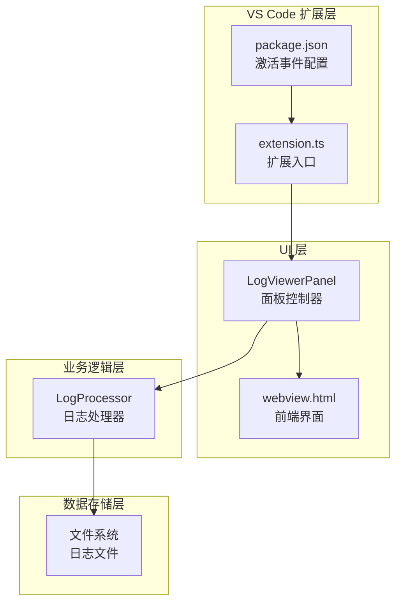

**图表来源**
- [extension.ts](file://src/extension.ts#L1-L116)
- [logViewerPanel.ts](file://src/logViewerPanel.ts#L1-L510)
- [logProcessor.ts](file://src/logProcessor.ts#L1-L807)

## extension.ts 核心模块

### 激活机制分析

extension.ts 作为 VS Code 扩展的入口点，负责初始化和管理整个扩展的功能。

#### activationEvents 配置

扩展通过两个激活事件触发：
- `onCommand:big-log-viewer.openLogFile`：当执行打开日志文件命令时激活
- `onLanguage:log`：当打开日志文件时激活

**章节来源**
- [package.json](file://package.json#L29-L31)

#### 命令注册机制

扩展通过 `vscode.commands.registerCommand` 注册三个核心命令：

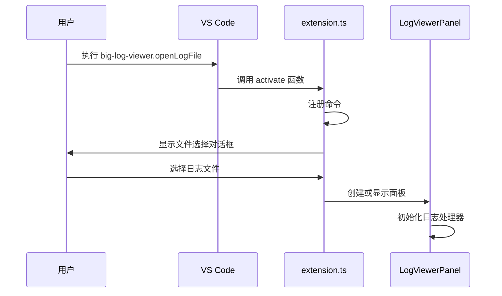

**图表来源**
- [extension.ts](file://src/extension.ts#L8-L31)

#### openLogFile 命令实现

该命令支持两种调用方式：
1. **直接调用**：显示文件选择对话框让用户选择日志文件
2. **URI 参数调用**：接收预定义的文件 URI

**章节来源**
- [extension.ts](file://src/extension.ts#L8-L31)

#### deleteByTime 命令实现

该命令提供时间维度的日志删除功能：

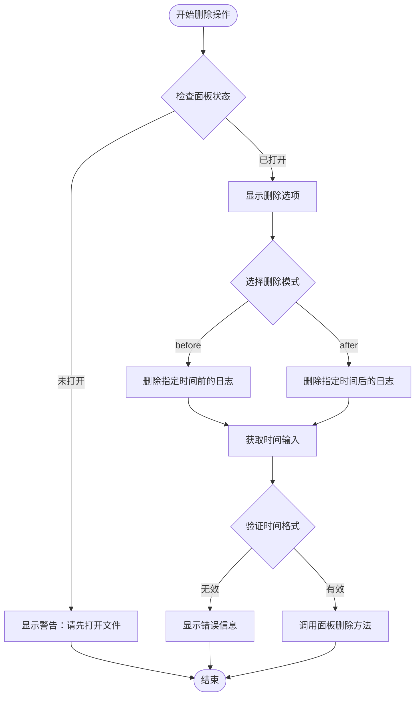

**图表来源**
- [extension.ts](file://src/extension.ts#L34-L71)

#### deleteByLine 命令实现

该命令提供行号维度的日志删除功能，与时间删除类似但基于行号进行操作。

**章节来源**
- [extension.ts](file://src/extension.ts#L73-L110)

## logViewerPanel.ts 核心模块

### 单例模式实现

LogViewerPanel 类采用单例模式设计，确保每个日志文件只对应一个查看器面板：

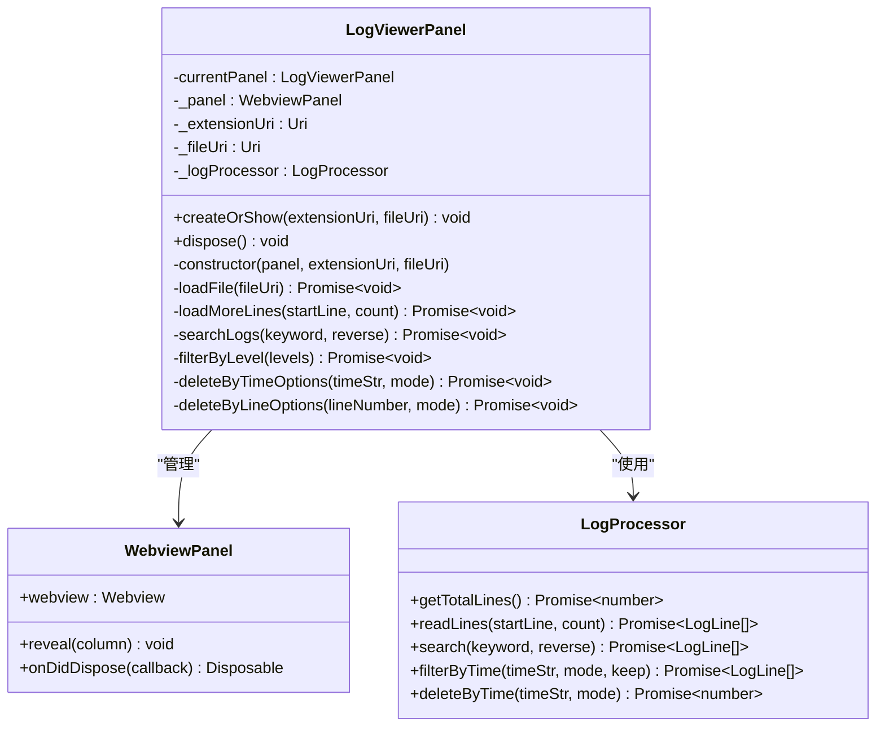

**图表来源**
- [logViewerPanel.ts](file://src/logViewerPanel.ts#L6-L40)
- [logViewerPanel.ts](file://src/logViewerPanel.ts#L41-L105)

**章节来源**
- [logViewerPanel.ts](file://src/logViewerPanel.ts#L6-L40)

### WebView 面板配置

面板创建时设置了关键配置参数：

| 配置项 | 值 | 作用 |
|--------|-----|------|
| enableScripts | true | 允许在 WebView 中执行 JavaScript |
| retainContextWhenHidden | true | 隐藏时保留上下文状态 |
| localResourceRoots | [extensionUri] | 允许访问扩展资源 |

**章节来源**
- [logViewerPanel.ts](file://src/logViewerPanel.ts#L28-L35)

### 消息监听机制

LogViewerPanel 实现了完整的消息通信机制，处理来自前端的各种命令：

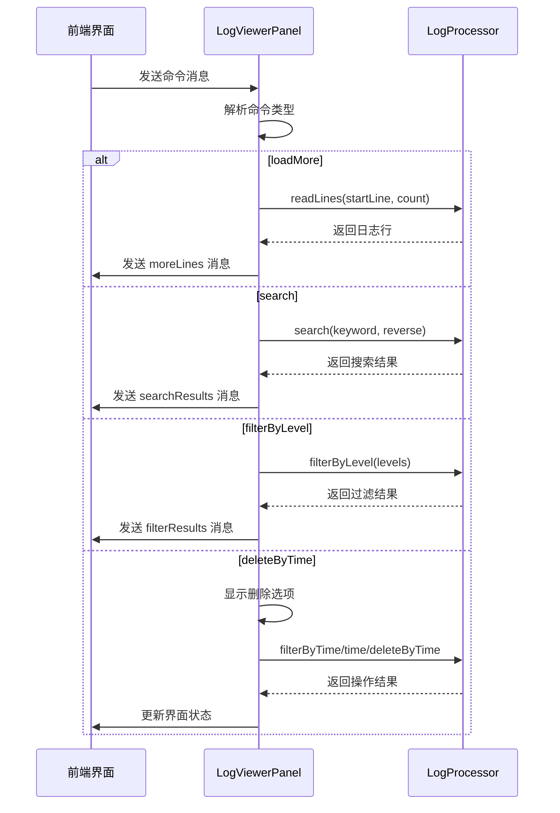

**图表来源**
- [logViewerPanel.ts](file://src/logViewerPanel.ts#L54-L98)

**章节来源**
- [logViewerPanel.ts](file://src/logViewerPanel.ts#L54-L98)

### 数据加载策略

LogViewerPanel 实现了智能的数据加载策略：

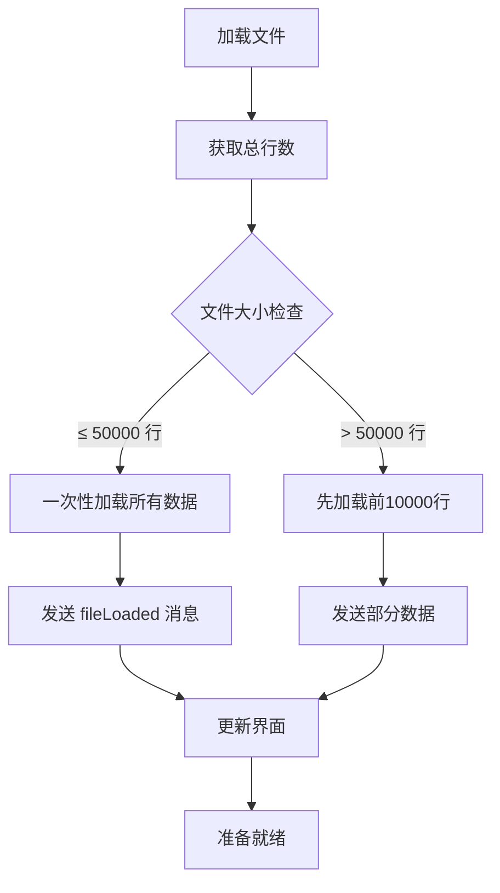

**图表来源**
- [logViewerPanel.ts](file://src/logViewerPanel.ts#L107-L148)

**章节来源**
- [logViewerPanel.ts](file://src/logViewerPanel.ts#L107-L148)

### 文件修改操作

LogViewerPanel 提供了三种文件修改策略：

1. **仅隐藏**：不修改原文件，只在界面上过滤显示
2. **导出到新文件**：将过滤结果保存到新的日志文件
3. **修改原文件**：直接删除原文件中的指定日志行

**章节来源**
- [logViewerPanel.ts](file://src/logViewerPanel.ts#L180-L278)

## logProcessor.ts 核心模块

### 流式文件处理机制

LogProcessor 采用流式处理方式，避免一次性加载大文件导致内存溢出：

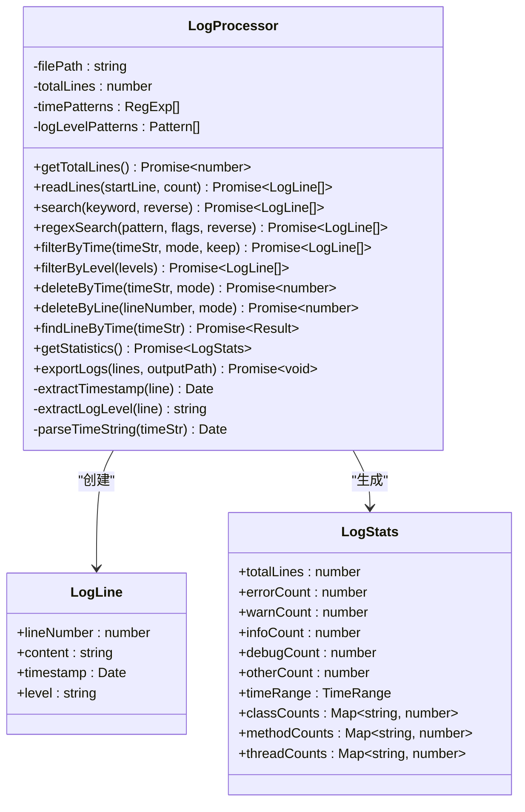

**图表来源**
- [logProcessor.ts](file://src/logProcessor.ts#L30-L807)

**章节来源**
- [logProcessor.ts](file://src/logProcessor.ts#L30-L807)

### 逐行读取实现

readLines 方法实现了高效的逐行读取：

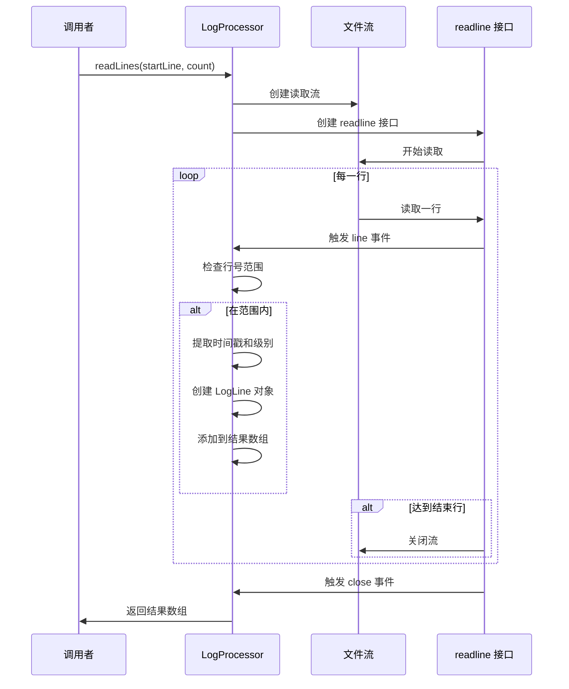

**图表来源**
- [logProcessor.ts](file://src/logProcessor.ts#L90-L130)

**章节来源**
- [logProcessor.ts](file://src/logProcessor.ts#L90-L130)

### 搜索算法实现

#### 关键词搜索

search 方法支持大小写不敏感的关键词搜索：

**章节来源**
- [logProcessor.ts](file://src/logProcessor.ts#L135-L173)

#### 正则表达式搜索

regexSearch 方法支持复杂的正则表达式搜索：

**章节来源**
- [logProcessor.ts](file://src/logProcessor.ts#L704-L749)

### 过滤逻辑

#### 时间过滤

filterByTime 方法支持两种过滤模式：

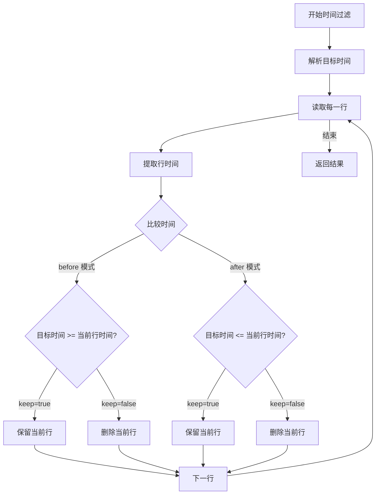

**图表来源**
- [logProcessor.ts](file://src/logProcessor.ts#L178-L230)

**章节来源**
- [logProcessor.ts](file://src/logProcessor.ts#L178-L230)

#### 级别过滤

filterByLevel 方法根据日志级别进行过滤：

**章节来源**
- [logProcessor.ts](file://src/logProcessor.ts#L650-L699)

### 文件修改策略

#### deleteByTime 实现

deleteByTime 方法采用临时文件策略：

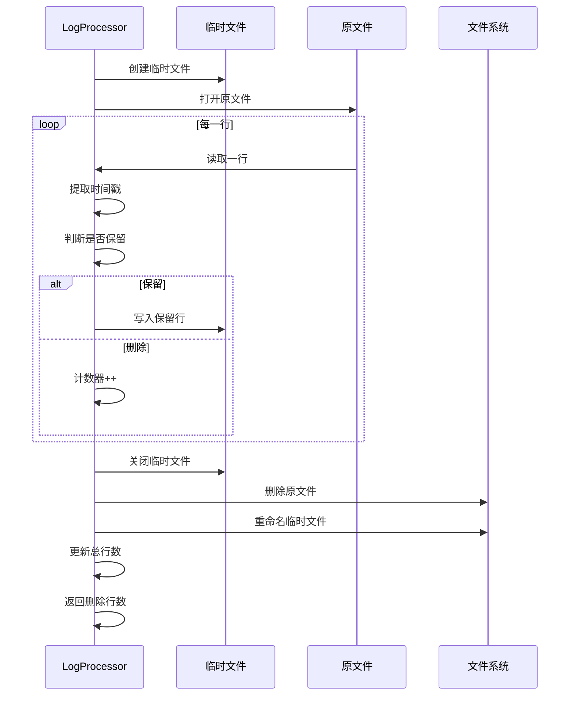

**图表来源**
- [logProcessor.ts](file://src/logProcessor.ts#L346-L408)

**章节来源**
- [logProcessor.ts](file://src/logProcessor.ts#L346-L408)

#### deleteByLine 实现

deleteByLine 方法同样采用临时文件策略，但基于行号判断：

**章节来源**
- [logProcessor.ts](file://src/logProcessor.ts#L414-L475)

### 统计分析功能

getStatistics 方法提供全面的日志统计信息：

| 统计项目 | 描述 | 实现方式 |
|----------|------|----------|
| 总行数 | 文件总行数 | 遍历文件计数 |
| 日志级别分布 | ERROR、WARN、INFO、DEBUG 数量 | 正则匹配提取 |
| 时间范围 | 最早和最晚时间戳 | 时间戳解析 |
| 类名统计 | 按类名分组统计 | 正则表达式匹配 |
| 方法名统计 | 按方法名分组统计 | 特殊格式匹配 |
| 线程名统计 | 按线程名分组统计 | 方括号内容提取 |

**章节来源**
- [logProcessor.ts](file://src/logProcessor.ts#L566-L645)

## 模块间调用关系

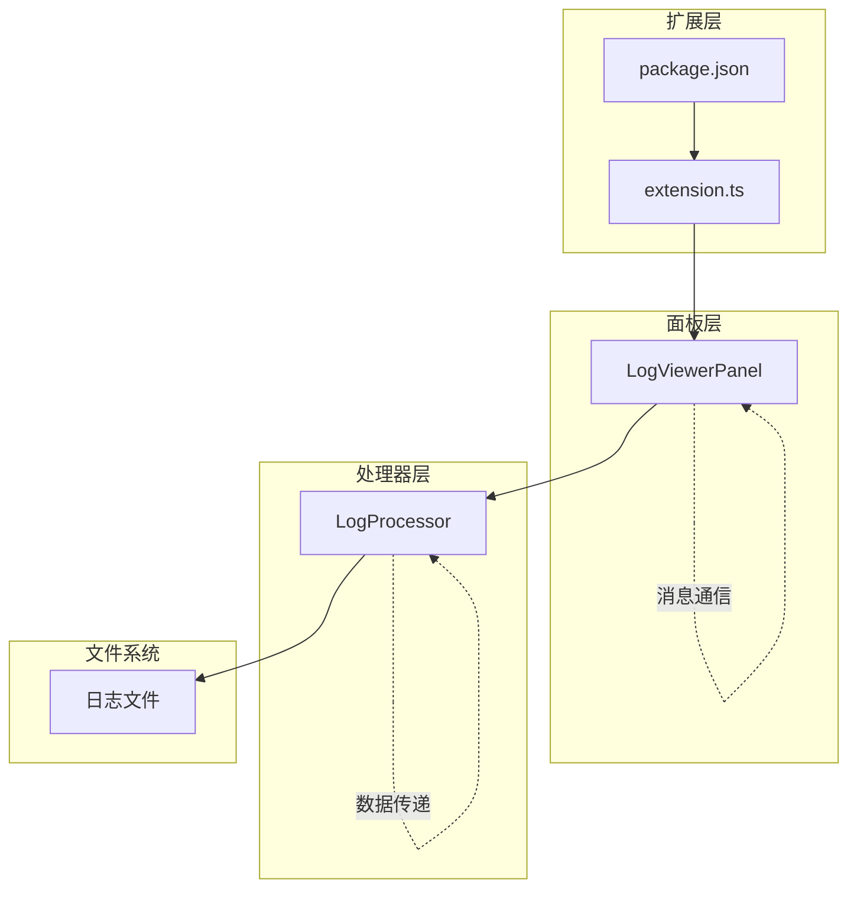

**图表来源**
- [extension.ts](file://src/extension.ts#L1-L116)
- [logViewerPanel.ts](file://src/logViewerPanel.ts#L1-L510)
- [logProcessor.ts](file://src/logProcessor.ts#L1-L807)

### 调用时序图

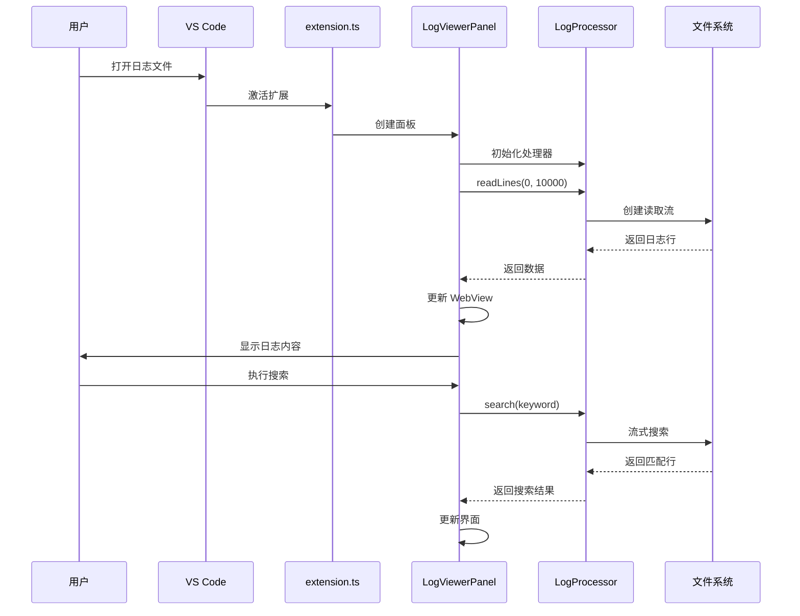

**图表来源**
- [extension.ts](file://src/extension.ts#L8-L31)
- [logViewerPanel.ts](file://src/logViewerPanel.ts#L107-L148)
- [logProcessor.ts](file://src/logProcessor.ts#L135-L173)

## 数据流转分析

### 输入数据流

1. **用户输入**：通过 VS Code 命令或前端界面输入
2. **文件输入**：日志文件路径和内容
3. **配置输入**：搜索关键词、过滤条件、时间范围等

### 处理流程

1. **解析阶段**：LogProcessor 解析日志格式，提取时间戳、级别等信息
2. **过滤阶段**：应用用户设置的过滤条件
3. **搜索阶段**：执行关键词或正则表达式搜索
4. **统计阶段**：生成统计报告

### 输出数据流

1. **界面更新**：通过 WebView 向前端发送数据
2. **文件输出**：导出过滤后的日志文件
3. **统计报告**：生成详细的统计信息

## 性能优化策略

### 内存管理

1. **流式处理**：避免一次性加载大文件到内存
2. **分页加载**：只加载当前需要显示的日志行
3. **及时释放**：使用 Disposable 模式管理资源

### I/O 优化

1. **异步操作**：所有文件操作都是异步的
2. **缓存机制**：对频繁访问的数据进行缓存
3. **批量处理**：合并多个小的 I/O 操作

### 界面响应性

1. **虚拟滚动**：只渲染可见区域的日志行
2. **防抖处理**：对频繁的搜索操作进行防抖
3. **进度提示**：长时间操作显示进度信息

## 总结

large_log_check 项目通过精心设计的三层架构，实现了高效的大日志文件处理能力：

### 核心优势

1. **模块化设计**：清晰的职责分离，便于维护和扩展
2. **性能优化**：流式处理和分页加载确保大文件处理效率
3. **用户体验**：直观的界面和丰富的功能满足专业需求
4. **安全性**：提供多种操作模式，保护原始日志文件

### 技术亮点

1. **单例模式**：LogViewerPanel 的单例实现避免了资源浪费
2. **消息通信**：完善的前后端通信机制
3. **正则表达式**：灵活的时间戳和日志级别识别
4. **临时文件策略**：安全可靠的文件修改机制

该扩展为开发者提供了专业级的日志处理工具，在保证功能完整性的同时，也展现了优秀的软件架构设计思想。