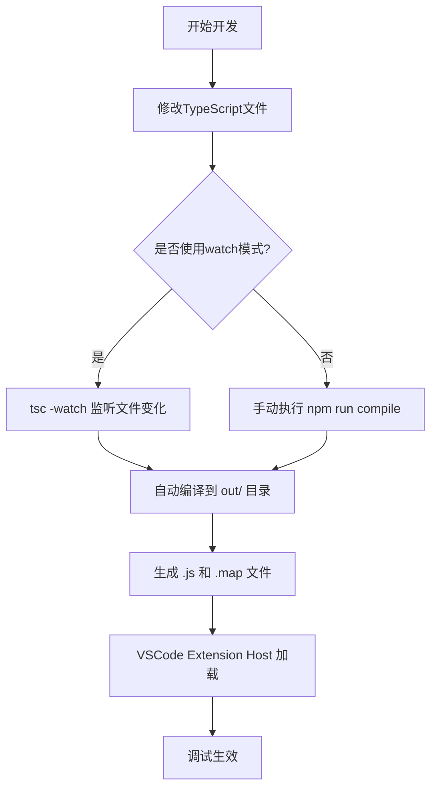
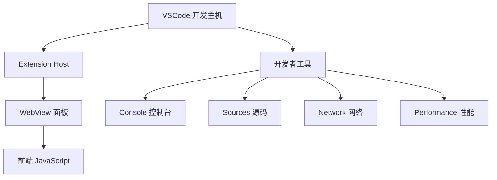
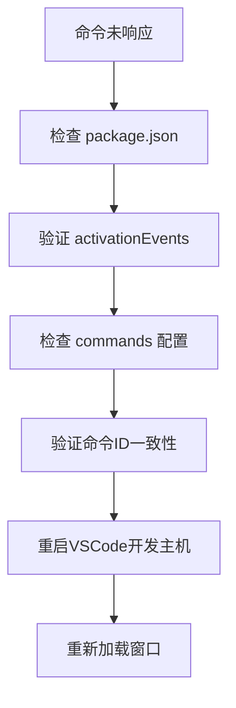
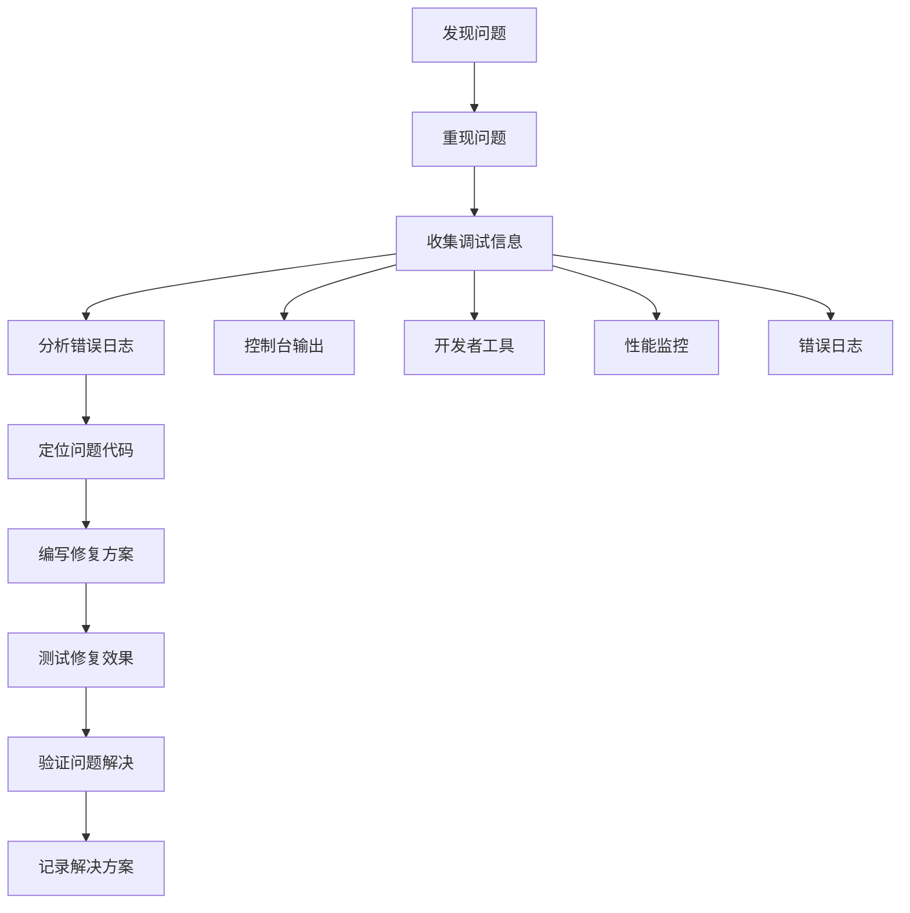

# 大日志文件查看器扩展调试指南

<cite>
**本文档引用的文件**
- [package.json](file://package.json)
- [tsconfig.json](file://tsconfig.json)
- [src/extension.ts](file://src/extension.ts)
- [src/logViewerPanel.ts](file://src/logViewerPanel.ts)
- [src/logProcessor.ts](file://src/logProcessor.ts)
- [src/webview.html](file://src/webview.html)
- [.eslintrc.json](file://.eslintrc.json)
- [.vscodeignore](file://.vscodeignore)
- [README.md](file://README.md)
</cite>

## 目录
1. [简介](#简介)
2. [开发环境配置](#开发环境配置)
3. [VSCode调试环境设置](#vscode调试环境设置)
4. [TypeScript编译配置详解](#typescript编译配置详解)
5. [项目构建脚本](#项目构建脚本)
6. [调试技巧与最佳实践](#调试技巧与最佳实践)
7. [常见调试问题解决方案](#常见调试问题解决方案)
8. [WebView前端调试](#webview前端调试)
9. [性能调试与优化](#性能调试与优化)
10. [故障排除指南](#故障排除指南)

## 简介

大日志文件查看器是一个专业的VSCode扩展，用于快速查看和处理大型日志文件（支持几十MB甚至GB级别的文件）。本指南将帮助开发者配置和调试这个复杂的扩展项目，涵盖从环境搭建到高级调试技巧的完整流程。

## 开发环境配置

### 系统要求

在开始调试之前，请确保您的开发环境满足以下要求：

- **Node.js**: 版本 >= 18.0.0
- **VSCode**: 版本 >= 1.75.0
- **TypeScript**: 版本 >= 5.0.0

### 项目依赖安装

```bash
# 安装项目依赖
npm install

# 验证安装
npm list --depth=0
```

**节来源**
- [package.json](file://package.json#L1-L94)
- [README.md](file://README.md#L137-L147)

## VSCode调试环境设置

### 创建launch.json配置

在VSCode中，您需要配置`launch.json`文件来设置扩展开发主机的调试环境。以下是完整的配置示例：

```json
{
    "version": "0.2.0",
    "configurations": [
        {
            "name": "Extension Development Host",
            "type": "extensionHost",
            "request": "launch",
            "args": [
                "--extensionDevelopmentPath=${workspaceFolder}"
            ],
            "outFiles": [
                "${workspaceFolder}/out/**/*.js"
            ],
            "preLaunchTask": "npm: watch",
            "postDebugTask": "npm: clean"
        },
        {
            "name": "Run Tests",
            "type": "extensionTest",
            "request": "launch",
            "args": [
                "${workspaceFolder}/test",
                "--extensionDevelopmentPath=${workspaceFolder}"
            ],
            "outFiles": [
                "${workspaceFolder}/out/**/*.js"
            ]
        }
    ]
}
```

### 关键配置项说明

| 配置项 | 说明 | 示例值 |
|--------|------|--------|
| `name` | 调试配置名称 | "Extension Development Host" |
| `type` | 调试类型 | "extensionHost" |
| `request` | 请求类型 | "launch" |
| `args` | 启动参数 | ["--extensionDevelopmentPath=${workspaceFolder}"] |
| `outFiles` | 输出文件路径模式 | ["${workspaceFolder}/out/**/*.js"] |
| `preLaunchTask` | 启动前任务 | "npm: watch" |
| `postDebugTask` | 调试后任务 | "npm: clean" |

### 启动调试流程

1. **打开项目**: 在VSCode中打开扩展项目根目录
2. **配置调试**: 按下 `F5` 或点击运行面板中的"启动调试"
3. **新窗口测试**: VSCode将启动一个新的开发主机窗口
4. **自动编译**: `npm run watch` 会自动监听并编译TypeScript文件
5. **热重载**: 修改代码后，需要手动重新加载开发主机窗口

**节来源**
- [README.md](file://README.md#L161-L167)

## TypeScript编译配置详解

### tsconfig.json核心配置

TypeScript编译配置是调试过程中的关键环节。以下是`tsconfig.json`中最重要的配置项：

```json
{
    "compilerOptions": {
        "module": "commonjs",
        "target": "ES2020",
        "outDir": "out",
        "lib": ["ES2020"],
        "sourceMap": true,
        "rootDir": "src",
        "strict": true,
        "esModuleInterop": true,
        "skipLibCheck": true,
        "forceConsistentCasingInFileNames": true,
        "moduleResolution": "node",
        "resolveJsonModule": true
    },
    "include": ["src/**/*"],
    "exclude": ["node_modules", ".vscode-test"]
}
```

### 关键配置项详解

| 配置项 | 作用 | 推荐值 | 重要性 |
|--------|------|--------|--------|
| `target` | 编译目标JavaScript版本 | "ES2020" | 高 |
| `outDir` | 输出目录 | "out" | 高 |
| `rootDir` | 源码根目录 | "src" | 高 |
| `sourceMap` | 生成调试映射文件 | true | 高 |
| `strict` | 启用严格类型检查 | true | 中 |
| `module` | 模块系统 | "commonjs" | 中 |
| `esModuleInterop` | ES模块互操作性 | true | 中 |

### target设置为ES2020的重要性

**为什么选择ES2020？**

1. **Node.js兼容性**: VSCode扩展运行在Node.js环境中，ES2020提供了现代JavaScript特性
2. **异步编程支持**: 支持async/await语法，简化异步操作
3. **数组方法**: 支持includes、flat等现代数组方法
4. **对象扩展**: 支持Object.fromEntries等现代对象方法

### sourceMap启用的作用

`sourceMap`配置启用后：
- 生成 `.js.map` 文件
- 在调试时映射到原始TypeScript源码
- 提供更好的调试体验
- 支持断点设置在原始代码位置

**节来源**
- [tsconfig.json](file://tsconfig.json#L1-L19)

## 项目构建脚本

### 编译脚本配置

项目提供了多种构建和开发脚本，支持不同的开发场景：

```json
{
    "scripts": {
        "vscode:prepublish": "npm run compile",
        "compile": "tsc -p ./",
        "watch": "tsc -watch -p ./",
        "pretest": "npm run compile",
        "lint": "eslint src --ext ts",
        "build": "npm run compile",
        "dev": "npm run watch",
        "clean": "rimraf out",
        "rebuild": "npm run clean; npm run compile",
        "package": "vsce package",
        "publish": "vsce publish"
    }
}
```

### 开发脚本详解

| 脚本命令 | 功能描述 | 使用场景 |
|----------|----------|----------|
| `npm run compile` | 一次性编译TypeScript文件 | 生产构建 |
| `npm run watch` | 持续监听并编译TypeScript文件 | 开发调试 |
| `npm run dev` | 开发模式快捷命令 | 快速启动 |
| `npm run rebuild` | 清理后重新编译 | 清理构建问题 |
| `npm run lint` | 运行ESLint代码检查 | 代码质量保证 |

### 自动编译流程



**图表来源**
- [package.json](file://package.json#L69-L81)

**节来源**
- [package.json](file://package.json#L69-L81)

## 调试技巧与最佳实践

### console.log调试技巧

在扩展开发中，合理使用`console.log`是调试的基础方法：

#### 1. 在extension.ts中添加调试信息

```typescript
// 在activate函数中添加初始化调试
export function activate(context: vscode.ExtensionContext) {
    console.log('大日志文件查看器已激活');
    
    // 命令注册调试
    console.log('注册命令:', ['big-log-viewer.openLogFile']);
    
    // 上下文订阅调试
    console.log('上下文订阅数量:', context.subscriptions.length);
}
```

#### 2. 在LogViewerPanel中添加状态跟踪

```typescript
// 文件加载状态调试
private async loadFile(fileUri: vscode.Uri) {
    console.log('开始加载文件:', fileUri.fsPath);
    
    try {
        const totalLines = await this._logProcessor.getTotalLines();
        console.log('文件总行数:', totalLines);
        
        const initialLines = await this._logProcessor.readLines(0, 10000);
        console.log('初始加载行数:', initialLines.length);
        
    } catch (error) {
        console.error('文件加载失败:', error);
    }
}
```

#### 3. 在LogProcessor中添加算法调试

```typescript
// 日志级别提取调试
private extractLogLevel(line: string): string | undefined {
    console.log('处理日志行:', line.substring(0, 100));
    
    const level = this.detectLogLevelFromLine(line);
    console.log('提取到的级别:', level);
    
    return level;
}
```

### 断点调试配置

#### 在extension.ts的activate函数中设置断点

1. 打开 `src/extension.ts` 文件
2. 在 `export function activate(context: vscode.ExtensionContext)` 函数的第一行设置断点
3. 启动调试 (`F5`)
4. 在开发主机中触发扩展激活事件

#### 在LogViewerPanel中设置业务逻辑断点

```typescript
// 在搜索功能中设置断点
private async searchLogs(keyword: string, reverse: boolean = false) {
    console.log('开始搜索:', keyword, '反转:', reverse);
    
    // 设置断点在这里
    try {
        const results = await this._logProcessor.search(keyword, reverse);
        console.log('搜索结果数量:', results.length);
        
        this._panel.webview.postMessage({
            command: 'searchResults',
            data: {
                keyword: keyword,
                results: results
            }
        });
    } catch (error) {
        console.error('搜索失败:', error);
    }
}
```

### 开发者工具检查

#### 打开开发者工具

1. 在VSCode开发主机中按下 `Ctrl+Shift+I` (Windows/Linux) 或 `Cmd+Option+I` (Mac)
2. 切换到 "Console" 标签页查看控制台输出
3. 切换到 "Sources" 标签页查看源码映射
4. 切换到 "Network" 标签页监控网络请求

#### 调试面板状态



**图表来源**
- [src/extension.ts](file://src/extension.ts#L4-L116)
- [src/logViewerPanel.ts](file://src/logViewerPanel.ts#L54-L98)

**节来源**
- [src/extension.ts](file://src/extension.ts#L4-L116)
- [src/logViewerPanel.ts](file://src/logViewerPanel.ts#L54-L98)

## 常见调试问题解决方案

### 编译错误调试

#### 1. TypeScript编译错误

**问题症状**:
- VSCode报告类型错误
- 编译过程中出现语法错误
- 构建脚本失败

**解决方案**:

```bash
# 清理编译缓存
npm run clean

# 重新安装依赖
rm -rf node_modules package-lock.json
npm install

# 检查TypeScript版本
npm list typescript

# 手动编译检查错误
npx tsc --noEmitOnError
```

#### 2. 模块导入错误

**常见错误类型**:
- `Cannot find module 'vscode'`
- `Could not find a declaration file`
- `Module '"vscode"' has no exported member`

**解决步骤**:
1. 确保安装了正确的VSCode类型定义
2. 检查 `tsconfig.json` 中的 `typeRoots` 配置
3. 验证 `node_modules/@types/vscode` 是否存在

### 命令未注册问题

#### 问题诊断流程



**检查要点**:

1. **activationEvents配置**:
```json
{
    "activationEvents": [
        "onCommand:big-log-viewer.openLogFile",
        "onLanguage:log"
    ]
}
```

2. **commands配置**:
```json
{
    "contributes": {
        "commands": [
            {
                "command": "big-log-viewer.openLogFile",
                "title": "打开大日志文件",
                "category": "日志查看器"
            }
        ]
    }
}
```

3. **命令ID一致性**: 确保前后端使用的命令ID完全一致

### WebView通信失败

#### 通信调试步骤

1. **检查WebView初始化**:
```typescript
// 在LogViewerPanel构造函数中添加调试
constructor(panel: vscode.WebviewPanel, extensionUri: vscode.Uri, fileUri: vscode.Uri) {
    console.log('WebView面板创建', {
        panel: !!panel,
        extensionUri: extensionUri.toString(),
        fileUri: fileUri.toString()
    });
    
    // 检查webview配置
    console.log('WebView配置:', {
        enableScripts: panel.webview.options.enableScripts,
        retainContext: panel.webview.options.retainContextWhenHidden
    });
}
```

2. **消息传递调试**:
```typescript
// 在消息接收处添加调试
this._panel.webview.onDidReceiveMessage(
    async message => {
        console.log('收到WebView消息:', message.command, message);
        
        switch (message.command) {
            case 'loadMore':
                console.log('处理loadMore请求');
                await this.loadMoreLines(message.startLine, message.count);
                break;
            // ... 其他case
        }
    },
    null,
    this._disposables
);
```

3. **前端JavaScript调试**:
```javascript
// 在webview.html中添加调试
window.addEventListener('message', event => {
    console.log('收到扩展消息:', event.data);
    
    // 发送消息到扩展
    vscode.postMessage({ 
        command: 'test', 
        data: 'hello from webview' 
    });
});
```

### 性能问题调试

#### 大文件加载性能

**调试指标**:
- 文件加载时间
- 内存使用量
- DOM渲染性能

**性能调试代码**:
```typescript
// 在loadFile方法中添加性能监控
private async loadFile(fileUri: vscode.Uri) {
    const startTime = performance.now();
    
    try {
        const totalLines = await this._logProcessor.getTotalLines();
        const loadStartTime = performance.now();
        
        console.log(`文件统计耗时: ${loadStartTime - startTime}ms`);
        
        const initialLines = await this._logProcessor.readLines(0, 10000);
        const endTime = performance.now();
        
        console.log(`实际加载耗时: ${endTime - loadStartTime}ms`);
        console.log(`总加载耗时: ${endTime - startTime}ms`);
        
    } catch (error) {
        console.error('性能监控失败:', error);
    }
}
```

**节来源**
- [src/logViewerPanel.ts](file://src/logViewerPanel.ts#L107-L148)
- [src/logProcessor.ts](file://src/logProcessor.ts#L60-L85)

## WebView前端调试

### HTML页面调试

#### 1. webview.html结构检查

```html
<!-- 在head标签中添加调试样式 -->
<style>
    /* 添加调试边框 */
    .debug-border {
        outline: 1px solid red !important;
    }
    
    /* 显示元素边界 */
    .debug-show-bounds {
        border: 1px dashed blue !important;
    }
</style>
```

#### 2. JavaScript调试技巧

```javascript
// 在webview.html底部添加调试代码
<script>
    // 页面加载完成调试
    window.addEventListener('load', () => {
        console.log('WebView页面加载完成');
        console.log('可用元素:', {
            container: document.querySelector('.log-container'),
            toolbar: document.querySelector('.toolbar'),
            searchBox: document.querySelector('.search-box')
        });
    });

    // 消息接收调试
    window.addEventListener('message', event => {
        console.log('WebView接收到消息:', event.data);
        
        // 根据消息类型执行相应操作
        switch (event.data.command) {
            case 'fileLoaded':
                console.log('文件加载完成，显示行数:', event.data.data.lines.length);
                break;
            case 'searchResults':
                console.log('搜索结果:', event.data.data.results.length);
                break;
        }
    });

    // 发送测试消息
    function sendTestMessage() {
        vscode.postMessage({ 
            command: 'test', 
            data: 'WebView测试消息' 
        });
    }
    
    // 调试工具函数
    function debugElement(id) {
        const el = document.getElementById(id);
        if (el) {
            console.log(`元素${id}的样式:`, window.getComputedStyle(el));
            console.log(`元素${id}的属性:`, {
                tagName: el.tagName,
                className: el.className,
                innerHTML: el.innerHTML.substring(0, 100)
            });
        } else {
            console.log(`元素${id}不存在`);
        }
    }
</script>
```

### CSS样式调试

#### 1. 主题适配调试

```css
/* 检查VSCode主题变量 */
body {
    /* 测试主题变量 */
    background-color: var(--vscode-editor-background, #1e1e1e);
    color: var(--vscode-editor-foreground, #d4d4d4);
}

/* 调试容器边界 */
.log-container {
    border: 1px solid var(--vscode-panel-border, #3f3f46);
    padding: 10px;
    background-color: var(--vscode-editor-background, #1e1e1e);
}
```

#### 2. 响应式布局调试

```javascript
// 监控窗口尺寸变化
window.addEventListener('resize', () => {
    console.log('窗口尺寸变化:', {
        width: window.innerWidth,
        height: window.innerHeight,
        orientation: window.matchMedia('(orientation: portrait)').matches ? 'portrait' : 'landscape'
    });
});

// 检查容器尺寸
function checkContainerSizes() {
    const container = document.querySelector('.log-container');
    if (container) {
        console.log('容器尺寸:', {
            clientWidth: container.clientWidth,
            clientHeight: container.clientHeight,
            offsetWidth: container.offsetWidth,
            offsetHeight: container.offsetHeight
        });
    }
}
```

### 前端性能监控

#### 1. 渲染性能监控

```javascript
// 虚拟滚动性能监控
let renderStartTime;

function startRenderTimer() {
    renderStartTime = performance.now();
}

function endRenderTimer(renderCount) {
    const endTime = performance.now();
    const totalTime = endTime - renderStartTime;
    
    console.log(`渲染${renderCount}行耗时: ${totalTime.toFixed(2)}ms`);
    console.log(`平均渲染时间: ${(totalTime / renderCount).toFixed(2)}ms per line`);
    
    // 性能阈值警告
    if (totalTime > 100) {
        console.warn('渲染时间过长，可能影响用户体验');
    }
}

// 在数据渲染完成后调用
function renderLogLines(lines) {
    startRenderTimer();
    
    // 渲染逻辑...
    
    endRenderTimer(lines.length);
}
```

#### 2. 内存使用监控

```javascript
// 内存使用监控
function monitorMemoryUsage() {
    if (performance.memory) {
        const memInfo = {
            used: (performance.memory.usedJSHeapSize / 1024 / 1024).toFixed(2),
            total: (performance.memory.totalJSHeapSize / 1024 / 1024).toFixed(2),
            limit: (performance.memory.jsHeapSizeLimit / 1024 / 1024).toFixed(2)
        };
        
        console.log('内存使用情况:', memInfo);
        
        // 内存使用过高警告
        if (memInfo.used > memInfo.limit * 0.8) {
            console.warn('内存使用超过80%，可能存在内存泄漏');
        }
    }
}

// 定期监控
setInterval(monitorMemoryUsage, 5000);
```

**节来源**
- [src/webview.html](file://src/webview.html#L1-L200)

## 性能调试与优化

### 大文件处理性能

#### 1. 文件加载性能分析

```typescript
// 在LogProcessor中添加性能分析
async readLines(startLine: number, count: number): Promise<LogLine[]> {
    const startTime = performance.now();
    
    return new Promise((resolve, reject) => {
        const lines: LogLine[] = [];
        let currentLine = 0;
        const endLine = startLine + count;
        
        const stream = fs.createReadStream(this.filePath);
        const rl = readline.createInterface({
            input: stream,
            crlfDelay: Infinity
        });
        
        rl.on('line', (line) => {
            if (currentLine >= startLine && currentLine < endLine) {
                const timestamp = this.extractTimestamp(line);
                const level = this.extractLogLevel(line);
                
                lines.push({
                    lineNumber: currentLine + 1,
                    content: line,
                    timestamp: timestamp,
                    level: level
                });
            }
            
            currentLine++;
            
            // 提前终止条件
            if (currentLine >= endLine) {
                rl.close();
                stream.destroy();
            }
        });
        
        rl.on('close', () => {
            const endTime = performance.now();
            console.log(`读取${count}行耗时: ${endTime - startTime}ms`);
            
            // 性能警告
            if (endTime - startTime > 1000) {
                console.warn('大文件读取超时，考虑优化策略');
            }
            
            resolve(lines);
        });
        
        rl.on('error', (error) => {
            reject(error);
        });
    });
}
```

#### 2. 虚拟滚动性能优化

```javascript
// 虚拟滚动性能优化
class VirtualScroll {
    constructor(container, itemHeight = 20, bufferFactor = 2) {
        this.container = container;
        this.itemHeight = itemHeight;
        this.bufferFactor = bufferFactor;
        this.visibleItems = [];
        this.scrollTop = 0;
        this.totalItems = 0;
        
        this.setupEventListeners();
    }
    
    setupEventListeners() {
        this.container.addEventListener('scroll', this.handleScroll.bind(this));
    }
    
    handleScroll() {
        const startTime = performance.now();
        
        this.scrollTop = this.container.scrollTop;
        const viewportHeight = this.container.clientHeight;
        const startIndex = Math.floor(this.scrollTop / this.itemHeight);
        const endIndex = Math.min(
            startIndex + Math.ceil(viewportHeight / this.itemHeight) * this.bufferFactor,
            this.totalItems - 1
        );
        
        // 更新可视区域
        this.updateVisibleItems(startIndex, endIndex);
        
        const endTime = performance.now();
        console.log(`滚动处理耗时: ${endTime - startTime}ms`);
        
        // 性能监控
        if (endTime - startTime > 16) { // 超过1帧时间
            console.warn('滚动处理时间过长，可能影响流畅度');
        }
    }
    
    updateVisibleItems(startIndex, endIndex) {
        const itemsToRender = endIndex - startIndex + 1;
        
        // 批量更新DOM
        this.renderItems(startIndex, endIndex);
        
        console.log(`渲染${itemsToRender}个项目`);
    }
}
```

### 内存泄漏检测

#### 1. 事件监听器泄漏检测

```typescript
// 在LogViewerPanel中添加内存泄漏检测
class LogViewerPanel {
    private disposables: vscode.Disposable[] = [];
    
    dispose() {
        console.log('开始清理面板资源');
        
        // 检查是否有未释放的订阅
        const leaks = this.disposables.filter(d => !d.isDisposed);
        if (leaks.length > 0) {
            console.warn(`发现${leaks.length}个未释放的订阅`);
        }
        
        // 清理所有资源
        this._panel.dispose();
        
        while (this.disposables.length) {
            const disposable = this.disposables.pop();
            if (disposable) {
                disposable.dispose();
            }
        }
        
        LogViewerPanel.currentPanel = undefined;
        console.log('面板资源清理完成');
    }
}
```

#### 2. WebView资源管理

```javascript
// WebView生命周期管理
class WebViewManager {
    constructor() {
        this.eventListeners = new Map();
        this.timers = [];
        this.observers = [];
    }
    
    addEventListener(element, eventType, handler) {
        element.addEventListener(eventType, handler);
        this.eventListeners.set(handler, { element, eventType });
    }
    
    removeEventListener(handler) {
        const listenerInfo = this.eventListeners.get(handler);
        if (listenerInfo) {
            listenerInfo.element.removeEventListener(listenerInfo.eventType, handler);
            this.eventListeners.delete(handler);
        }
    }
    
    setInterval(callback, interval) {
        const timerId = setInterval(callback, interval);
        this.timers.push(timerId);
        return timerId;
    }
    
    clearInterval(timerId) {
        clearInterval(timerId);
        this.timers = this.timers.filter(id => id !== timerId);
    }
    
    cleanup() {
        // 清理事件监听器
        this.eventListeners.forEach(({ element, eventType }, handler) => {
            element.removeEventListener(eventType, handler);
        });
        this.eventListeners.clear();
        
        // 清理定时器
        this.timers.forEach(clearInterval);
        this.timers = [];
        
        // 清理观察者
        this.observers.forEach(observer => observer.disconnect());
        this.observers = [];
        
        console.log('WebView资源清理完成');
    }
}
```

**节来源**
- [src/logProcessor.ts](file://src/logProcessor.ts#L90-L130)
- [src/logViewerPanel.ts](file://src/logViewerPanel.ts#L497-L508)

## 故障排除指南

### 常见问题诊断表

| 问题类型 | 症状描述 | 可能原因 | 解决方案 |
|----------|----------|----------|----------|
| 编译失败 | TypeScript编译报错 | 类型定义缺失、语法错误 | 检查tsconfig.json、更新依赖 |
| 扩展未激活 | 命令无法使用 | activationEvents配置错误 | 检查package.json的activationEvents |
| WebView空白 | 界面无法显示 | 资源路径错误、脚本错误 | 检查webview.html路径、浏览器控制台 |
| 性能缓慢 | 大文件加载慢 | 读取策略不当、内存不足 | 优化读取策略、增加内存限制 |
| 消息通信失败 | 前后端无法通信 | 命令ID不匹配、消息格式错误 | 检查消息格式、确认命令注册 |

### 调试工具链

#### 1. 环境诊断脚本

```bash
#!/bin/bash
# 诊断脚本：检查开发环境状态

echo "=== 大日志文件查看器开发环境诊断 ==="

# 检查Node.js版本
echo "Node.js版本:"
node --version

# 检查npm版本
echo "npm版本:"
npm --version

# 检查TypeScript版本
echo "TypeScript版本:"
npx tsc --version

# 检查项目依赖
echo "项目依赖状态:"
npm ls --depth=0

# 检查TypeScript编译配置
echo "TypeScript配置检查:"
npx tsc --noEmit

# 检查VSCode扩展API
echo "VSCode API可用性检查:"
node -e "
try {
    require('vscode');
    console.log('✓ VSCode模块可用');
} catch(e) {
    console.log('✗ VSCode模块不可用:', e.message);
}
"

echo "=== 诊断完成 ==="
```

#### 2. 性能基准测试

```typescript
// 性能基准测试工具
class PerformanceBenchmark {
    static async testLargeFileLoading(filePath: string) {
        const processor = new LogProcessor(filePath);
        
        console.log('开始大文件加载性能测试...');
        
        // 测试总行数获取
        const totalLinesStart = performance.now();
        const totalLines = await processor.getTotalLines();
        const totalLinesEnd = performance.now();
        
        console.log(`获取总行数: ${totalLines}行, 耗时: ${totalLinesEnd - totalLinesStart}ms`);
        
        // 测试分批加载
        const batchSizes = [1000, 5000, 10000, 50000];
        
        for (const batchSize of batchSizes) {
            const start = performance.now();
            const lines = await processor.readLines(0, batchSize);
            const end = performance.now();
            
            console.log(`加载${batchSize}行: ${end - start}ms, 平均: ${(end - start) / batchSize * 1000}μs/行`);
        }
        
        console.log('性能测试完成');
    }
    
    static async testSearchPerformance(processor: LogProcessor, keywords: string[]) {
        console.log('开始搜索性能测试...');
        
        for (const keyword of keywords) {
            const start = performance.now();
            const results = await processor.search(keyword);
            const end = performance.now();
            
            console.log(`搜索"${keyword}": ${results.length}个结果, 耗时: ${end - start}ms`);
        }
        
        console.log('搜索性能测试完成');
    }
}
```

### 错误日志收集

#### 1. 结构化错误日志

```typescript
// 错误日志收集器
class ErrorLogger {
    private static errors: Array<{
        timestamp: number;
        type: string;
        message: string;
        stack: string;
        context: any;
    }> = [];
    
    static captureError(error: Error, context?: any) {
        this.errors.push({
            timestamp: Date.now(),
            type: error.name,
            message: error.message,
            stack: error.stack,
            context: context || {}
        });
        
        console.error('错误捕获:', {
            type: error.name,
            message: error.message,
            context: context
        });
    }
    
    static getErrorReport() {
        return {
            totalCount: this.errors.length,
            lastErrors: this.errors.slice(-10),
            errorTypes: this.groupErrorsByType(),
            timestamps: this.errors.map(e => e.timestamp)
        };
    }
    
    private static groupErrorsByType() {
        const groups = {};
        this.errors.forEach(error => {
            groups[error.type] = (groups[error.type] || 0) + 1;
        });
        return groups;
    }
    
    static clear() {
        this.errors = [];
    }
}
```

#### 2. 调试信息导出

```typescript
// 调试信息导出工具
class DebugInfoExporter {
    static async exportDebugInfo() {
        const debugInfo = {
            timestamp: new Date().toISOString(),
            environment: {
                nodeVersion: process.version,
                platform: process.platform,
                arch: process.arch
            },
            extension: {
                version: vscode.extensions.getExtension('wake.big-log-viewer')?.packageJSON.version,
                isActive: vscode.extensions.getExtension('wake.big-log-viewer')?.isActive
            },
            workspace: {
                folders: vscode.workspace.workspaceFolders?.map(f => f.uri.fsPath),
                files: await this.getWorkspaceFiles()
            },
            logs: ErrorLogger.getErrorReport()
        };
        
        // 导出到文件
        const fs = require('fs');
        const path = require('path');
        
        const exportPath = path.join(vscode.workspace.rootPath, 'debug-export.json');
        fs.writeFileSync(exportPath, JSON.stringify(debugInfo, null, 2));
        
        console.log(`调试信息已导出到: ${exportPath}`);
        return exportPath;
    }
    
    private static async getWorkspaceFiles() {
        // 获取工作区文件列表
        return [];
    }
}
```

### 最佳实践建议

#### 1. 调试工作流程



#### 2. 调试检查清单

- [ ] **环境检查**: 确认Node.js、TypeScript版本符合要求
- [ ] **依赖检查**: 验证所有依赖已正确安装
- [ ] **配置检查**: 确认tsconfig.json、package.json配置正确
- [ ] **编译检查**: 验证TypeScript编译无错误
- [ ] **启动检查**: 确认VSCode开发主机正常启动
- [ ] **功能检查**: 验证核心功能正常工作
- [ ] **性能检查**: 监控大文件处理性能
- [ ] **内存检查**: 确认无内存泄漏问题

**节来源**
- [README.md](file://README.md#L135-L286)

## 结论

本调试指南涵盖了大日志文件查看器扩展开发的各个方面，从基础的开发环境配置到高级的性能优化技巧。通过遵循这些调试方法和最佳实践，开发者可以：

1. **快速定位问题**: 使用适当的调试工具和技术
2. **提高开发效率**: 通过自动化构建和热重载
3. **保证代码质量**: 通过严格的类型检查和代码规范
4. **优化用户体验**: 通过性能监控和内存管理
5. **维护长期稳定性**: 通过完善的错误处理和日志记录

记住，调试是一个迭代的过程，需要耐心和系统性的方法。随着项目的不断发展，持续改进调试流程和工具将有助于保持开发效率和代码质量。