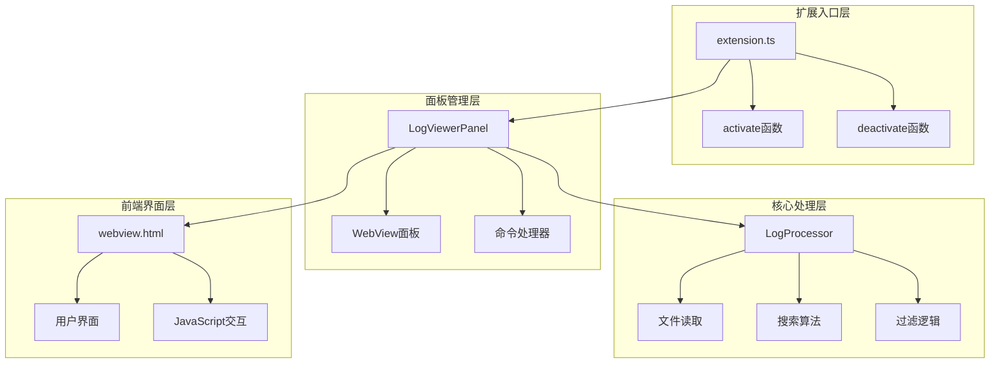
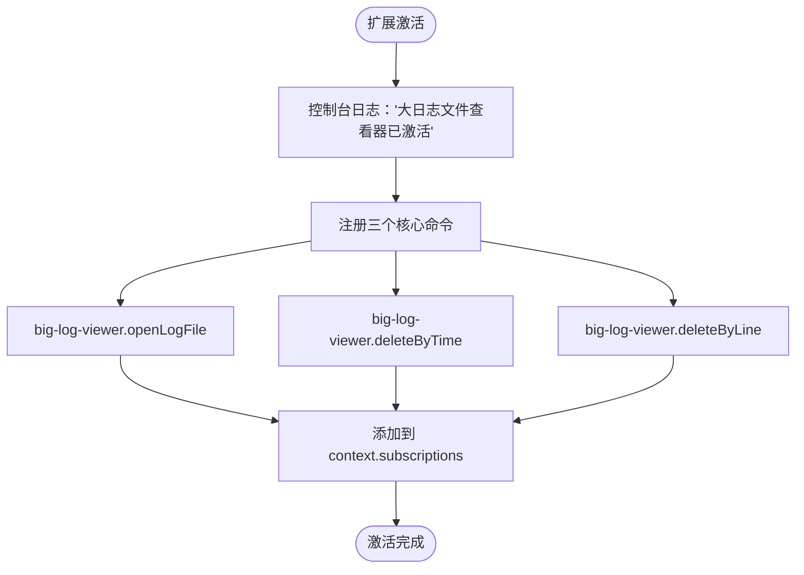
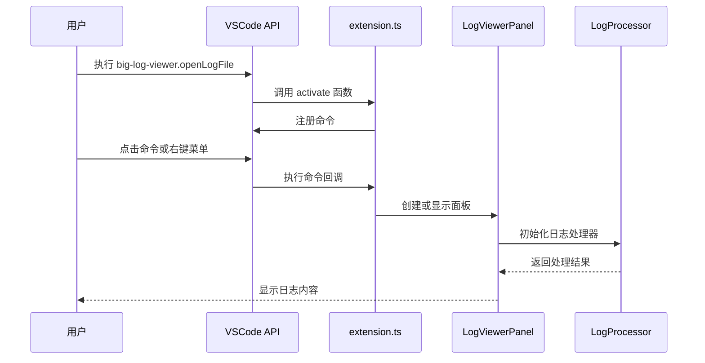
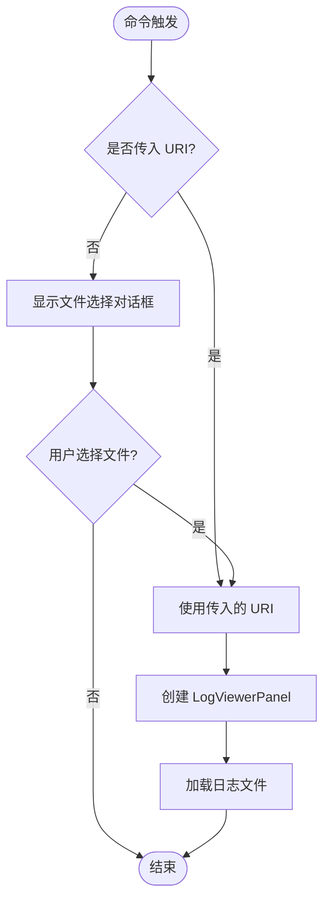
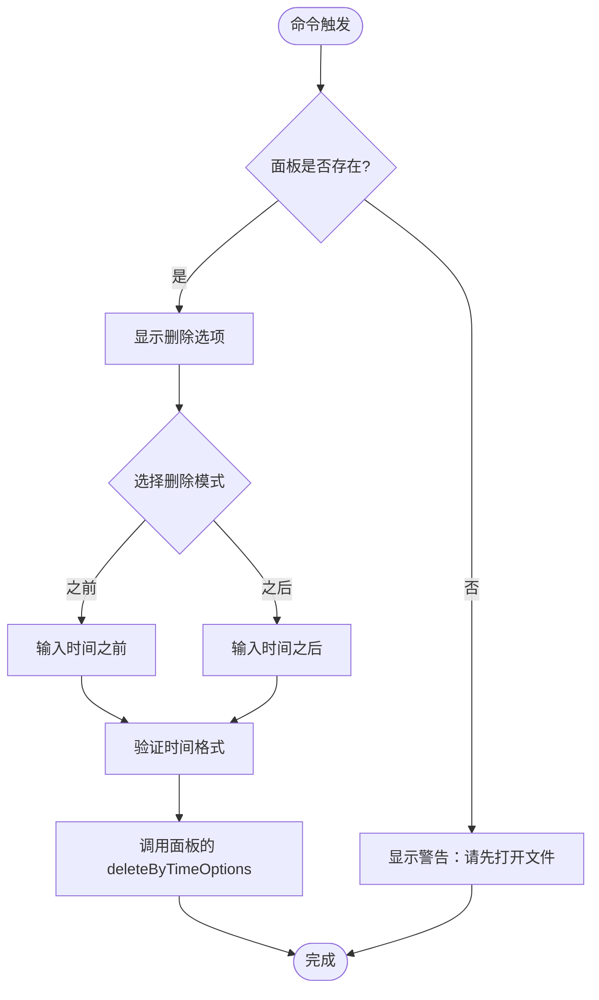
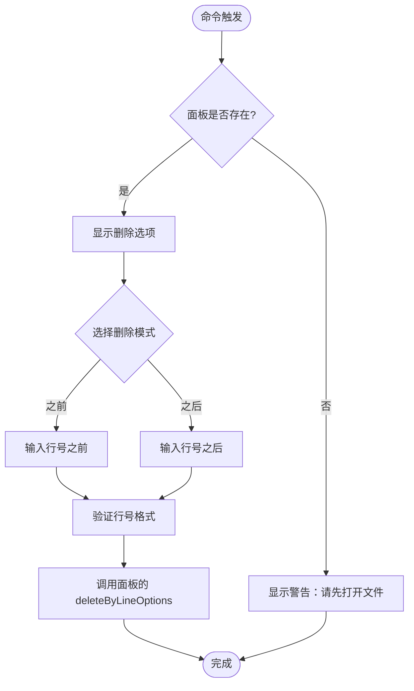
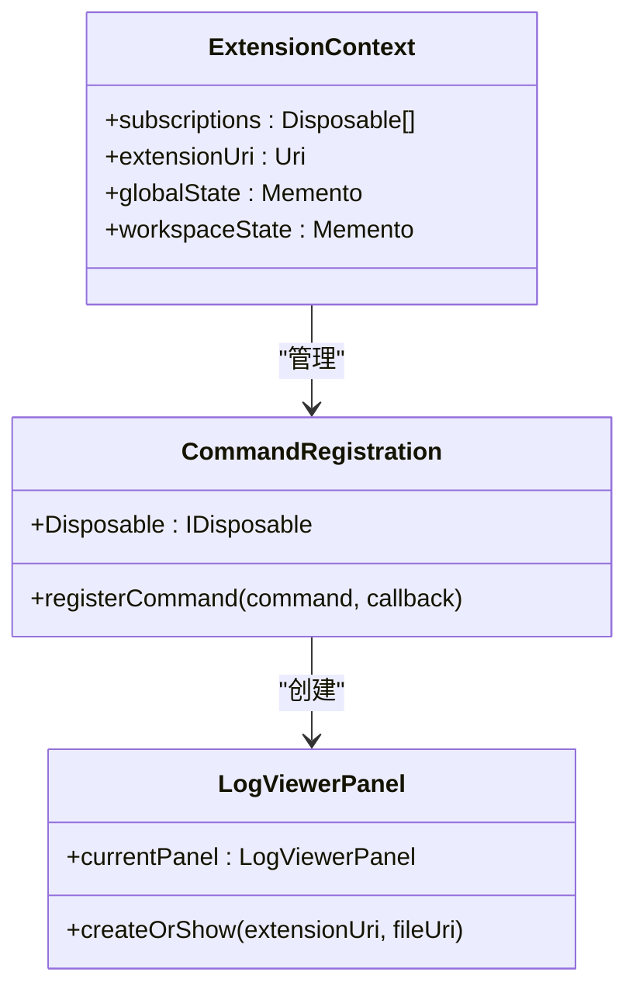
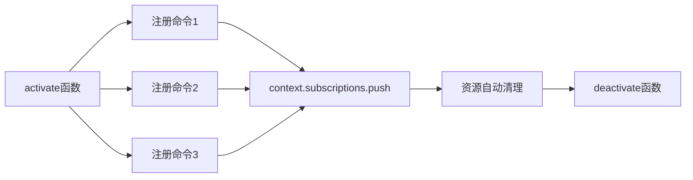
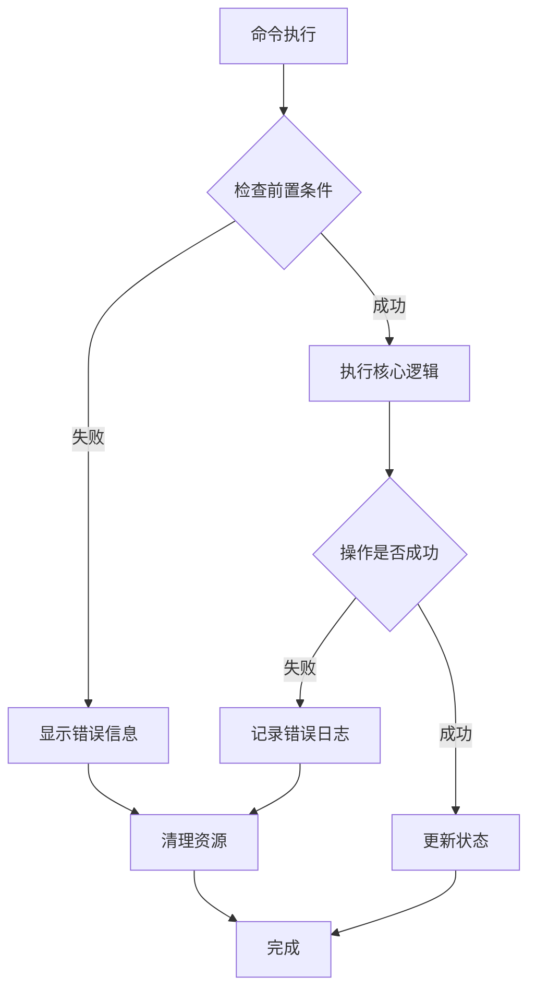

# extension.ts - 扩展入口

<cite>
**本文档中引用的文件**
- [extension.ts](file://src/extension.ts)
- [package.json](file://package.json)
- [logViewerPanel.ts](file://src/logViewerPanel.ts)
- [logProcessor.ts](file://src/logProcessor.ts)
- [webview.html](file://src/webview.html)
- [README.md](file://README.md)
</cite>

## 目录
1. [简介](#简介)
2. [项目结构概览](#项目结构概览)
3. [核心组件分析](#核心组件分析)
4. [架构概览](#架构概览)
5. [详细组件分析](#详细组件分析)
6. [命令注册机制](#命令注册机制)
7. [资源生命周期管理](#资源生命周期管理)
8. [最佳实践与性能优化](#最佳实践与性能优化)
9. [故障排除指南](#故障排除指南)
10. [总结](#总结)

## 简介

`extension.ts` 是大日志文件查看器 VSCode 扩展的核心入口文件，负责扩展的激活、命令注册和资源管理。该文件实现了三个主要命令：打开日志文件、按时间删除日志和按行数删除日志，通过 VSCode API 与用户界面进行交互。

该扩展专为处理大型日志文件而设计，支持 GB 级别的文件秒开，提供虚拟滚动、智能搜索、时间过滤、级别过滤等强大功能。

## 项目结构概览

**图表来源**
- [extension.ts](file://src/extension.ts#L1-L116)
- [logViewerPanel.ts](file://src/logViewerPanel.ts#L1-L510)
- [logProcessor.ts](file://src/logProcessor.ts#L1-L807)

**章节来源**
- [extension.ts](file://src/extension.ts#L1-L116)
- [package.json](file://package.json#L1-L94)

## 核心组件分析

### 扩展激活机制

扩展通过 `activate` 函数实现激活，该函数接收 `vscode.ExtensionContext` 参数，这是 VSCode 扩展开发的标准模式。

**图表来源**
- [extension.ts](file://src/extension.ts#L4-L112)

### 命令注册表

| 命令标识符 | 功能描述 | 触发方式 | 参数类型 |
|-----------|----------|----------|----------|
| `big-log-viewer.openLogFile` | 打开日志文件 | 用户点击、右键菜单、命令面板 | `vscode.Uri`（可选） |
| `big-log-viewer.deleteByTime` | 按时间删除日志 | 用户点击删除按钮 | 无参数 |
| `big-log-viewer.deleteByLine` | 按行数删除日志 | 用户点击删除按钮 | 无参数 |

**章节来源**
- [extension.ts](file://src/extension.ts#L7-L112)
- [package.json](file://package.json#L35-L50)

## 架构概览

**图表来源**
- [extension.ts](file://src/extension.ts#L8-L31)
- [logViewerPanel.ts](file://src/logViewerPanel.ts#L14-L38)

## 详细组件分析

### openLogFile 命令实现

该命令是最核心的功能，负责打开和显示日志文件。

**图表来源**
- [extension.ts](file://src/extension.ts#L8-L31)

#### 文件选择机制

命令支持两种调用方式：
1. **直接调用**：通过右键菜单或命令面板触发，会显示文件选择对话框
2. **URI 参数**：通过文件资源管理器右键菜单直接传入文件 URI

#### 错误处理策略

- 验证文件 URI 是否有效
- 处理文件读取异常
- 提供用户友好的错误提示

**章节来源**
- [extension.ts](file://src/extension.ts#L8-L31)

### deleteByTime 命令实现

该命令允许用户按时间范围删除日志内容。

**图表来源**
- [extension.ts](file://src/extension.ts#L34-L71)

#### 时间验证机制

- 支持多种时间格式：`YYYY-MM-DD HH:mm:ss`、`YYYY-MM-DD`
- 使用正则表达式验证格式
- 提供实时验证反馈

**章节来源**
- [extension.ts](file://src/extension.ts#L34-L71)

### deleteByLine 命令实现

该命令允许用户按行号范围删除日志内容。

**图表来源**
- [extension.ts](file://src/extension.ts#L73-L110)

#### 行号验证机制

- 确保行号为正整数
- 验证行号范围有效性
- 提供清晰的错误提示

**章节来源**
- [extension.ts](file://src/extension.ts#L73-L110)

## 命令注册机制

### VSCode API 集成

扩展通过 `vscode.commands.registerCommand` 方法注册命令，每个命令都返回一个 `Disposable` 对象，用于资源清理。

**图表来源**
- [extension.ts](file://src/extension.ts#L8-L112)
- [logViewerPanel.ts](file://src/logViewerPanel.ts#L14-L38)

### 参数传递机制

命令回调函数接收参数并通过 `context.subscriptions` 管理生命周期：

- **openLogFile**：支持 URI 参数或文件选择对话框
- **deleteByTime/deleteByLine**：通过 LogViewerPanel 实例访问当前面板状态

**章节来源**
- [extension.ts](file://src/extension.ts#L8-L112)

## 资源生命周期管理

### context.subscriptions 管理

扩展使用 `context.subscriptions` 数组管理所有注册的命令和事件监听器：

**图表来源**
- [extension.ts](file://src/extension.ts#L112)

### 资源清理策略

- **命令注册**：自动清理注册的命令
- **事件监听器**：移除所有事件监听器
- **定时器**：清理所有定时任务
- **文件句柄**：关闭所有打开的文件

**章节来源**
- [extension.ts](file://src/extension.ts#L112)

### deactivate 函数用途

虽然当前实现为空，但 `deactivate` 函数为未来的扩展功能预留了空间：

- 清理临时文件
- 关闭数据库连接
- 停止后台进程
- 保存用户状态

**章节来源**
- [extension.ts](file://src/extension.ts#L115-L116)

## 最佳实践与性能优化

### 命令注册最佳实践

1. **使用 async/await**：命令回调函数支持异步操作
2. **错误处理**：提供详细的错误信息和用户提示
3. **资源管理**：及时清理不需要的资源
4. **用户体验**：提供加载指示和进度反馈

### 性能优化建议

1. **延迟加载**：仅在需要时创建面板实例
2. **内存管理**：及时释放大文件的内存占用
3. **异步处理**：使用异步操作避免阻塞主线程
4. **缓存策略**：缓存常用的计算结果

### 错误处理策略

**图表来源**
- [extension.ts](file://src/extension.ts#L8-L112)

## 故障排除指南

### 常见问题及解决方案

| 问题类型 | 症状描述 | 可能原因 | 解决方案 |
|---------|----------|----------|----------|
| 命令不响应 | 点击命令无反应 | 面板未正确创建 | 检查文件权限和路径 |
| 文件加载失败 | 显示"加载失败"错误 | 文件过大或格式错误 | 尝试较小文件或检查格式 |
| 删除操作异常 | 删除后文件未变化 | 权限不足或文件锁定 | 检查文件权限和关闭相关程序 |
| 时间格式错误 | 时间输入验证失败 | 使用了不支持的格式 | 使用 YYYY-MM-DD HH:mm:ss 格式 |

### 调试技巧

1. **控制台日志**：使用 `console.log` 输出调试信息
2. **错误捕获**：使用 try-catch 包装异步操作
3. **状态检查**：验证命令执行前的状态
4. **用户反馈**：提供清晰的操作结果反馈

**章节来源**
- [extension.ts](file://src/extension.ts#L8-L112)

## 总结

`extension.ts` 作为大日志文件查看器扩展的入口点，实现了以下核心功能：

1. **优雅的命令注册**：通过 VSCode API 注册三个核心命令
2. **灵活的文件处理**：支持多种方式打开和处理日志文件
3. **完善的资源管理**：使用 `context.subscriptions` 管理生命周期
4. **健壮的错误处理**：提供用户友好的错误提示和恢复机制
5. **良好的扩展性**：为未来功能扩展预留了设计空间

该文件的设计体现了 VSCode 扩展开发的最佳实践，通过模块化的架构和清晰的职责分离，为用户提供了一个强大而易用的大日志文件处理工具。