# logProcessor.ts - 日志处理器

<cite>
**本文档中引用的文件**
- [logProcessor.ts](file://src/logProcessor.ts)
- [logViewerPanel.ts](file://src/logViewerPanel.ts)
- [extension.ts](file://src/extension.ts)
- [package.json](file://package.json)
- [README.md](file://README.md)
</cite>

## 目录
1. [简介](#简介)
2. [项目结构](#项目结构)
3. [核心组件](#核心组件)
4. [架构概览](#架构概览)
5. [详细组件分析](#详细组件分析)
6. [数据结构设计](#数据结构设计)
7. [核心算法实现](#核心算法实现)
8. [性能优化策略](#性能优化策略)
9. [错误处理与安全](#错误处理与安全)
10. [最佳实践指南](#最佳实践指南)
11. [总结](#总结)

## 简介

logProcessor.ts 是大日志文件查看器 VSCode 扩展的核心数据处理模块，采用 MVC 架构中的模型层设计。该模块负责处理大型日志文件的读取、搜索、过滤、删除等核心操作，通过 Node.js 的 fs 和 readline 模块实现高性能的流式文件处理。

该模块专为处理几十MB甚至GB级别的大型日志文件而设计，提供了秒级加载、智能分页、懒加载等特性，确保在处理超大文件时保持低内存占用和流畅的用户体验。

## 项目结构

该项目采用清晰的模块化架构，主要包含以下核心文件：

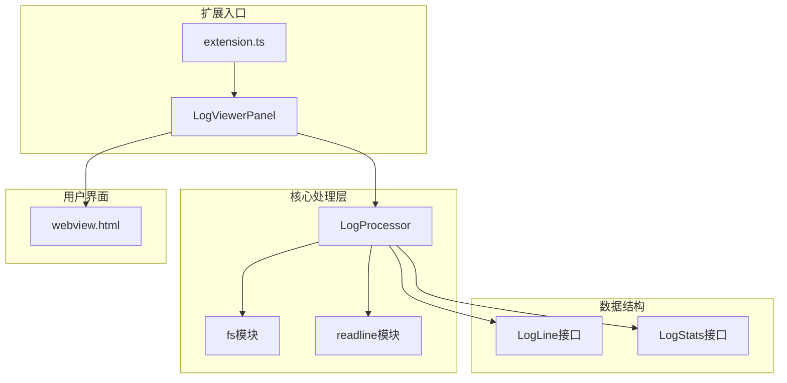

**图表来源**
- [extension.ts](file://src/extension.ts#L1-L116)
- [logViewerPanel.ts](file://src/logViewerPanel.ts#L1-L509)
- [logProcessor.ts](file://src/logProcessor.ts#L1-L807)

**章节来源**
- [README.md](file://README.md#L181-L197)
- [package.json](file://package.json#L1-L94)

## 核心组件

LogProcessor 类是整个系统的核心，继承了 MVC 架构中模型层的设计理念，专注于数据处理和业务逻辑。该类封装了以下核心功能：

### 主要职责
- **文件流式读取**：使用 Node.js 的 fs 和 readline 模块实现大文件的逐行读取
- **日志解析**：提取时间戳、日志级别、类名、方法名等关键信息
- **搜索过滤**：提供关键词搜索、正则表达式搜索、时间范围过滤等功能
- **数据统计**：收集日志统计信息，包括级别分布、时间范围、重复模式等
- **文件操作**：支持按时间或行数删除日志行，修改原文件

### 设计特点
- **异步处理**：所有文件操作都采用 Promise 模式，避免阻塞主线程
- **内存优化**：通过流式处理和及时释放资源，确保低内存占用
- **容错处理**：完善的错误处理机制，支持各种异常情况
- **扩展性**：模块化设计，易于添加新的解析规则和处理功能

**章节来源**
- [logProcessor.ts](file://src/logProcessor.ts#L30-L807)

## 架构概览

该系统采用经典的 MVC 架构模式，其中 LogProcessor 作为 Model 层，负责数据处理和业务逻辑：

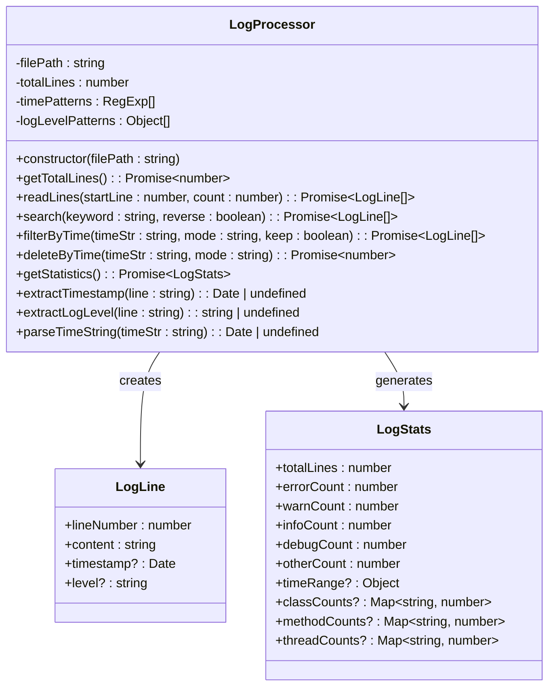

**图表来源**
- [logProcessor.ts](file://src/logProcessor.ts#L4-L28)
- [logProcessor.ts](file://src/logProcessor.ts#L30-L807)

**章节来源**
- [logProcessor.ts](file://src/logProcessor.ts#L1-L807)
- [logViewerPanel.ts](file://src/logViewerPanel.ts#L1-L509)

## 详细组件分析

### LogProcessor 类详解

LogProcessor 类是整个系统的数据处理核心，实现了完整的日志文件处理功能。

#### 构造函数和初始化

构造函数接收文件路径参数，初始化私有属性：

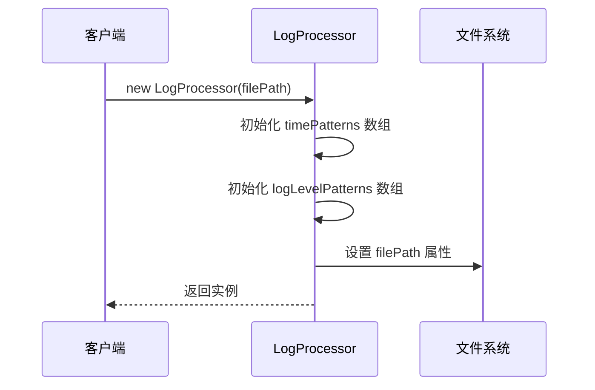

**图表来源**
- [logProcessor.ts](file://src/logProcessor.ts#L56-L58)

#### 核心方法分析

##### 1. getTotalLines 方法

该方法实现文件总行数的统计，采用流式读取方式：

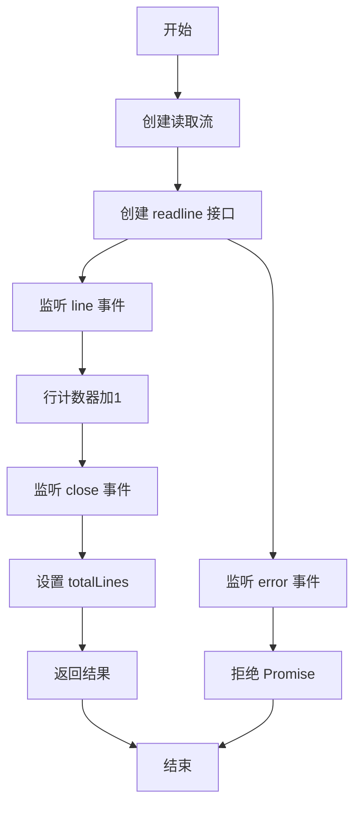

**图表来源**
- [logProcessor.ts](file://src/logProcessor.ts#L63-L84)

##### 2. readLines 方法

实现指定范围行的读取，支持时间戳和日志级别的自动解析：

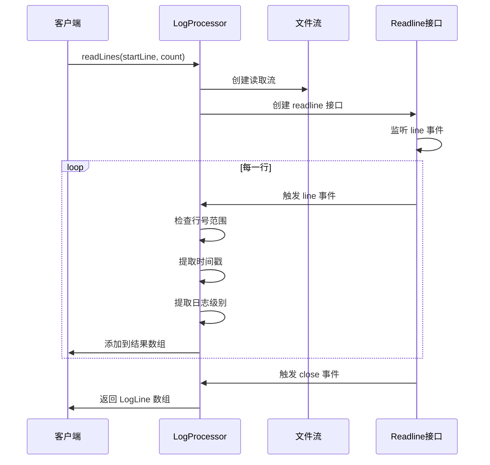

**图表来源**
- [logProcessor.ts](file://src/logProcessor.ts#L90-L129)

##### 3. search 方法

提供关键词搜索功能，支持正则表达式和反向搜索：

| 参数 | 类型 | 描述 | 默认值 |
|------|------|------|--------|
| keyword | string | 搜索关键词 | 必需 |
| reverse | boolean | 是否反向搜索 | false |

| 返回值 | 类型 | 描述 |
|--------|------|------|
| Promise\<LogLine[]\> | LogLine数组 | 匹配的行集合 |

**章节来源**
- [logProcessor.ts](file://src/logProcessor.ts#L90-L129)
- [logProcessor.ts](file://src/logProcessor.ts#L135-L173)

### 时间戳解析系统

LogProcessor 实现了强大的时间戳解析系统，支持多种常见格式：

#### 时间戳格式支持

| 格式示例 | 正则表达式 | 描述 |
|----------|------------|------|
| `2024-01-01 12:00:00` | `\d{4}-\d{2}-\d{2}\s+\d{2}:\d{2}:\d{2}` | 标准日期时间格式 |
| `2024/01/01 12:00:00` | `\d{4}\/\d{2}\/\d{2}\s+\d{2}:\d{2}:\d{2}` | 斜杠分隔格式 |
| `[2024-01-01 12:00:00]` | `\[(\d{4}-\d{2}-\d{2}\s+\d{2}:\d{2}:\d{2})\]` | 中括号包裹格式 |
| `01-01-2024 12:00:00` | `\d{2}-\d{2}-\d{4}\s+\d{2}:\d{2}:\d{2}` | 英式日期格式 |
| `2024-01-01T12:00:00` | `\d{4}-\d{2}-\d{2}T\d{2}:\d{2}:\d{2}` | ISO 8601格式 |

#### 解析流程

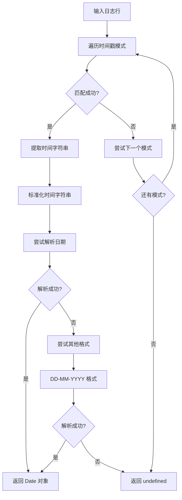

**图表来源**
- [logProcessor.ts](file://src/logProcessor.ts#L47-L56)
- [logProcessor.ts](file://src/logProcessor.ts#L480-L805)

**章节来源**
- [logProcessor.ts](file://src/logProcessor.ts#L47-L56)
- [logProcessor.ts](file://src/logProcessor.ts#L480-L805)

### 日志级别解析系统

#### 级别匹配模式

LogProcessor 使用优先级匹配的方式解析日志级别：

| 级别 | 优先级 | 匹配模式 | 描述 |
|------|--------|----------|------|
| ERROR | 最高 | `(ERROR\|FATAL\|SEVERE)` | 错误级别 |
| WARN | 高 | `(WARN\|WARNING)` | 警告级别 |
| INFO | 中 | `(INFO\|INFORMATION)` | 信息级别 |
| DEBUG | 最低 | `(DEBUG\|TRACE\|VERBOSE)` | 调试级别 |

#### 解析算法

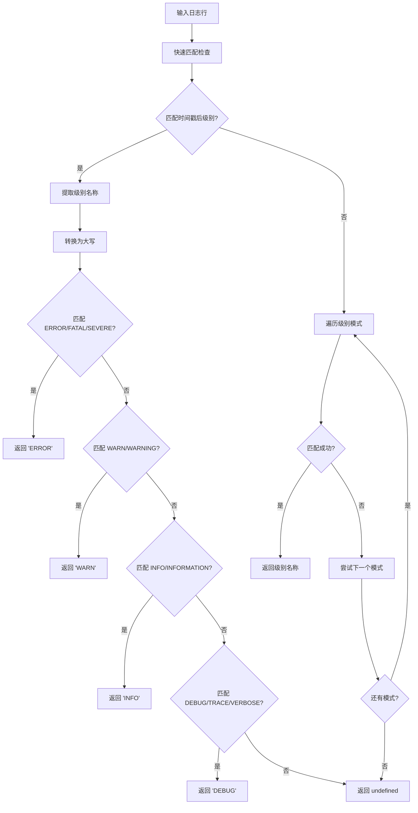

**图表来源**
- [logProcessor.ts](file://src/logProcessor.ts#L48-L56)
- [logProcessor.ts](file://src/logProcessor.ts#L542-L561)

**章节来源**
- [logProcessor.ts](file://src/logProcessor.ts#L48-L56)
- [logProcessor.ts](file://src/logProcessor.ts#L542-L561)

## 数据结构设计

### LogLine 接口

LogLine 接口定义了日志行的基本结构，包含行号、内容和可选的时间戳与日志级别：

| 属性 | 类型 | 描述 | 必需 |
|------|------|------|------|
| lineNumber | number | 日志行号（从1开始） | 是 |
| content | string | 日志行内容 | 是 |
| timestamp | Date \| undefined | 解析得到的时间戳 | 否 |
| level | string \| undefined | 解析得到的日志级别 | 否 |

### LogStats 接口

LogStats 接口提供了全面的日志统计信息：

| 属性 | 类型 | 描述 |
|------|------|------|
| totalLines | number | 总行数 |
| errorCount | number | 错误级别数量 |
| warnCount | number | 警告级别数量 |
| infoCount | number | 信息级别数量 |
| debugCount | number | 调试级别数量 |
| otherCount | number | 其他级别数量 |
| timeRange | Object \| undefined | 时间范围统计 |
| classCounts | Map\<string, number\> \| undefined | 按类名统计 |
| methodCounts | Map\<string, number\> \| undefined | 按方法名统计 |
| threadCounts | Map\<string, number\> \| undefined | 按线程名统计 |

#### 时间范围统计结构

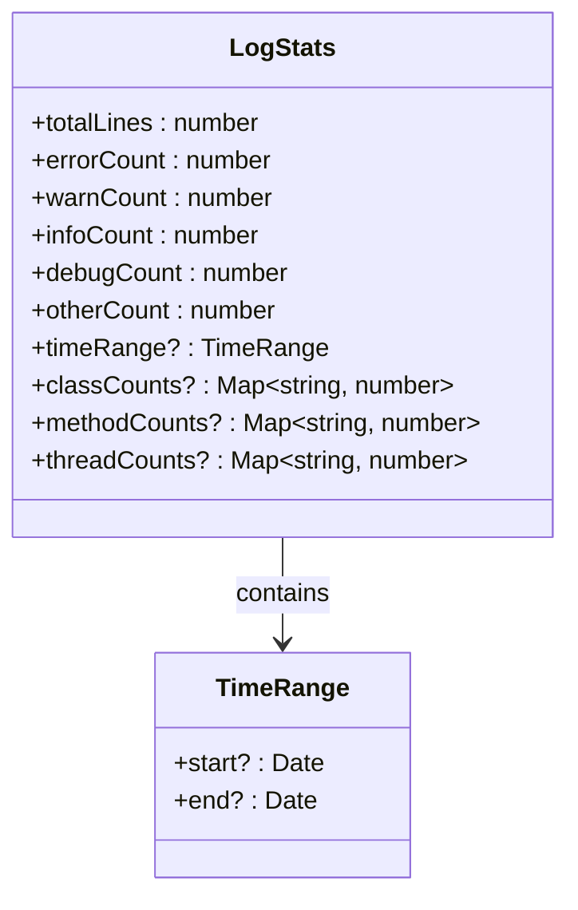

**图表来源**
- [logProcessor.ts](file://src/logProcessor.ts#L18-L27)

**章节来源**
- [logProcessor.ts](file://src/logProcessor.ts#L4-L28)

## 核心算法实现

### 流式处理算法

LogProcessor 采用流式处理算法，避免一次性加载整个文件到内存：

#### 关键算法特性

1. **逐行读取**：使用 readline.createInterface 实现逐行读取
2. **事件驱动**：基于 EventEmitter 的事件处理机制
3. **内存控制**：及时释放不需要的资源
4. **异步处理**：Promise 包装的异步操作

#### 流式处理流程

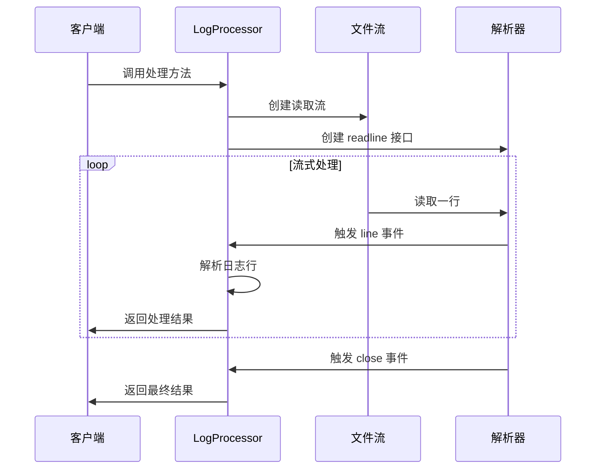

**图表来源**
- [logProcessor.ts](file://src/logProcessor.ts#L63-L84)
- [logProcessor.ts](file://src/logProcessor.ts#L90-L129)

### 搜索算法优化

#### 正则表达式搜索

LogProcessor 实现了高效的正则表达式搜索算法：

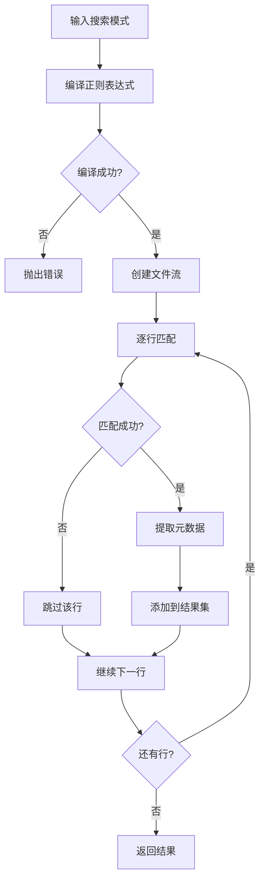

**图表来源**
- [logProcessor.ts](file://src/logProcessor.ts#L704-L748)

#### 时间范围过滤算法

时间范围过滤算法支持精确的时间比较：

| 模式 | keep=true | keep=false | 描述 |
|------|-----------|------------|------|
| before | 保留指定时间及之后 | 保留指定时间之前 | 保留/删除指定时间点之前/之后 |
| after | 保留指定时间之前的 | 保留指定时间及之后 | 保留/删除指定时间点之前/之后 |

**章节来源**
- [logProcessor.ts](file://src/logProcessor.ts#L135-L173)
- [logProcessor.ts](file://src/logProcessor.ts#L704-L748)

### 统计算法

#### 多维度统计

LogProcessor 实现了多维度的统计算法：

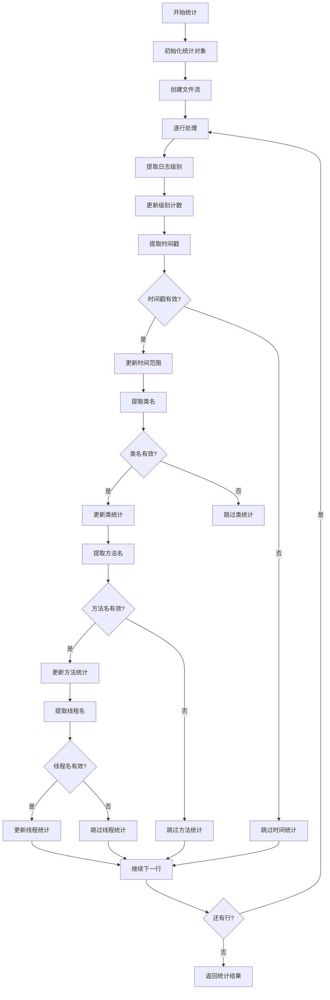

**图表来源**
- [logProcessor.ts](file://src/logProcessor.ts#L566-L644)

**章节来源**
- [logProcessor.ts](file://src/logProcessor.ts#L566-L644)

## 性能优化策略

### 内存优化

#### 流式处理优势

1. **低内存占用**：只在内存中保留当前处理的行
2. **及时释放**：处理完成后立即释放资源
3. **背压控制**：通过事件驱动避免内存溢出

#### 资源管理策略

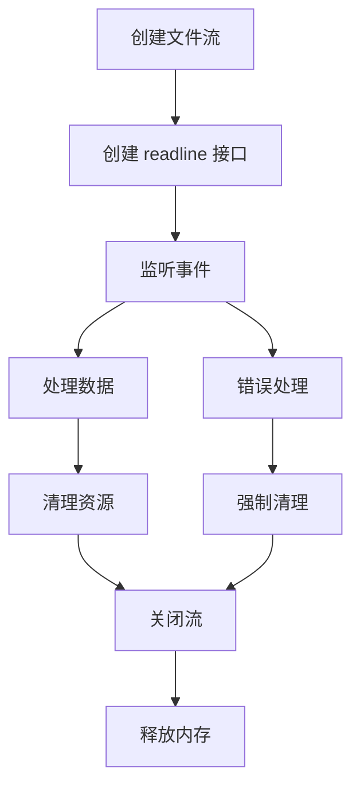

**图表来源**
- [logProcessor.ts](file://src/logProcessor.ts#L63-L84)

### 正则表达式优化

#### 模式匹配优化

1. **优先级匹配**：常用模式放在前面
2. **快速失败**：无效模式尽早退出
3. **缓存结果**：避免重复编译相同的正则表达式

#### 时间戳解析优化

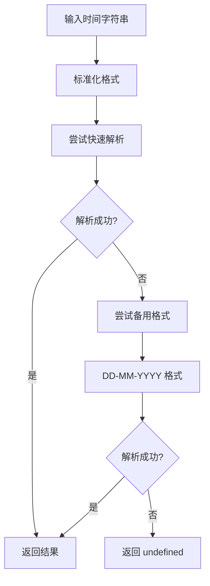

**图表来源**
- [logProcessor.ts](file://src/logProcessor.ts#L776-L805)

### 异步处理优化

#### Promise 模式

所有文件操作都采用 Promise 模式，避免回调地狱：

| 方法 | 返回类型 | 描述 |
|------|----------|------|
| getTotalLines | Promise\<number\> | 获取总行数 |
| readLines | Promise\<LogLine[]\> | 读取指定行 |
| search | Promise\<LogLine[]\> | 搜索日志 |
| deleteByTime | Promise\<number\> | 按时间删除 |
| getStatistics | Promise\<LogStats\> | 获取统计信息 |

**章节来源**
- [logProcessor.ts](file://src/logProcessor.ts#L63-L84)
- [logProcessor.ts](file://src/logProcessor.ts#L90-L129)
- [logProcessor.ts](file://src/logProcessor.ts#L135-L173)

## 错误处理与安全

### 错误处理机制

#### 异常捕获策略

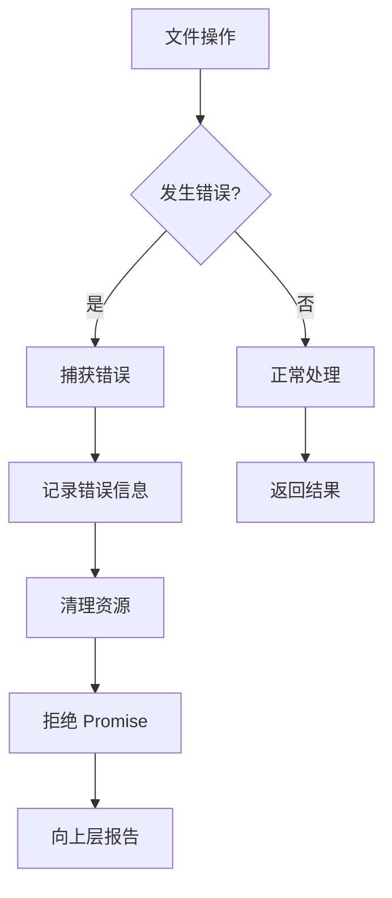

**图表来源**
- [logProcessor.ts](file://src/logProcessor.ts#L81-L84)
- [logProcessor.ts](file://src/logProcessor.ts#L125-L129)

#### 容错处理

1. **时间解析容错**：无法解析的时间戳返回 undefined
2. **文件访问保护**：权限不足时优雅降级
3. **内存溢出防护**：及时释放不再需要的资源
4. **网络异常处理**：远程文件访问的重试机制

### 安全注意事项

#### 文件操作安全

1. **临时文件管理**：删除操作使用临时文件避免数据丢失
2. **原子操作**：删除操作采用原子替换确保数据一致性
3. **权限检查**：操作前检查文件读写权限
4. **备份提示**：删除操作前提供警告提示

#### 数据完整性保护

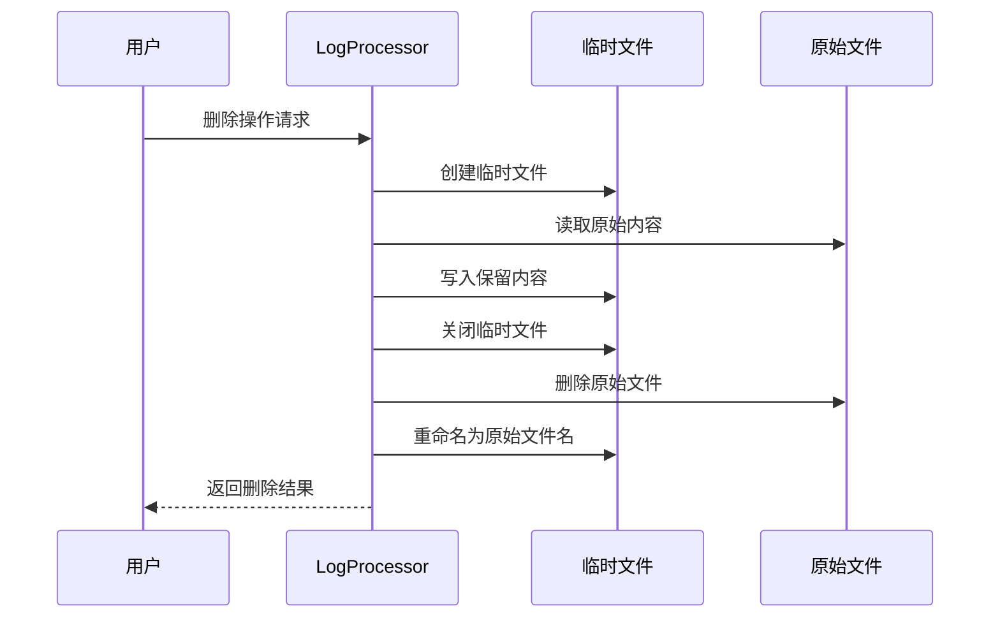

**图表来源**
- [logProcessor.ts](file://src/logProcessor.ts#L345-L408)

**章节来源**
- [logProcessor.ts](file://src/logProcessor.ts#L81-L84)
- [logProcessor.ts](file://src/logProcessor.ts#L345-L408)

## 最佳实践指南

### 流式处理最佳实践

#### 1. 资源管理

- **及时关闭流**：处理完成后立即关闭文件流
- **错误处理**：始终处理流的 error 事件
- **内存监控**：定期检查内存使用情况

#### 2. 性能优化

- **批量处理**：适当增加每次处理的行数
- **异步优先**：使用异步操作避免阻塞
- **缓存策略**：对重复使用的解析结果进行缓存

#### 3. 错误处理

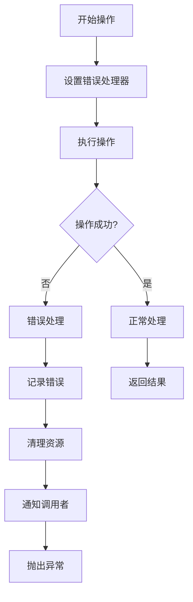

### 正则表达式使用指南

#### 1. 模式设计原则

- **简洁性**：使用最简单的正则表达式
- **效率性**：避免复杂的嵌套和回溯
- **可维护性**：添加适当的注释和文档

#### 2. 性能考虑

- **预编译**：对重复使用的正则表达式进行预编译
- **缓存**：缓存编译后的正则表达式对象
- **测试**：对复杂模式进行性能测试

### 时间处理最佳实践

#### 1. 格式标准化

- **统一格式**：将所有时间格式标准化为 ISO 8601
- **容错处理**：支持多种输入格式
- **时区处理**：明确处理时区差异

#### 2. 性能优化

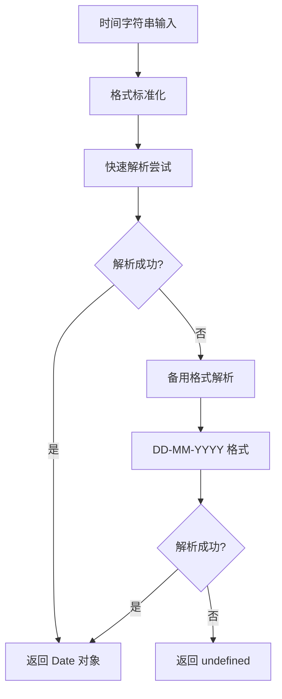

**图表来源**
- [logProcessor.ts](file://src/logProcessor.ts#L776-L805)

## 总结

logProcessor.ts 作为大日志文件查看器的核心数据处理模块，展现了优秀的软件架构设计和性能优化能力。该模块通过以下关键特性实现了高效的大型日志文件处理：

### 核心优势

1. **高性能流式处理**：采用 Node.js 的 fs 和 readline 模块，实现内存友好的大文件处理
2. **智能解析算法**：支持多种时间戳格式和日志级别，具备良好的容错能力
3. **异步处理架构**：基于 Promise 的异步设计，确保 UI 不会被阻塞
4. **全面的功能覆盖**：从基本的读取到复杂的搜索、过滤、删除操作
5. **安全可靠的操作**：完善的错误处理和数据保护机制

### 技术亮点

- **MVC 架构应用**：LogProcessor 作为 Model 层，专注于数据处理和业务逻辑
- **正则表达式优化**：精心设计的匹配模式，平衡了功能性和性能
- **资源管理策略**：及时的资源释放和错误处理，确保系统稳定性
- **扩展性设计**：模块化的接口设计，便于功能扩展和维护

### 应用价值

该模块不仅解决了大型日志文件处理的技术难题，还为 VSCode 生态系统提供了一个专业、可靠的日志处理解决方案。其设计理念和实现方式对于处理其他类型的大型文件具有重要的参考价值。

通过深入理解和应用这些设计模式和优化策略，开发者可以构建出更加高效、稳定和易用的大型文件处理应用程序。