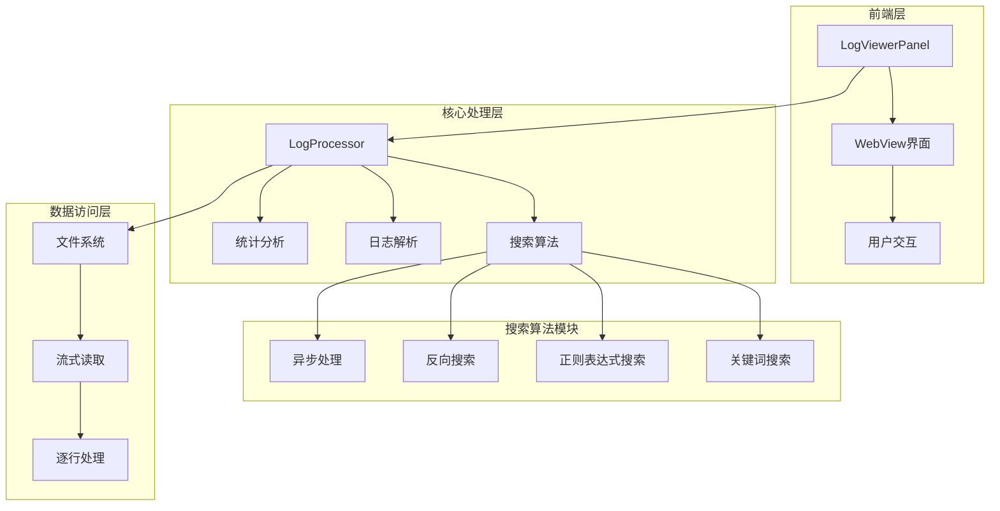
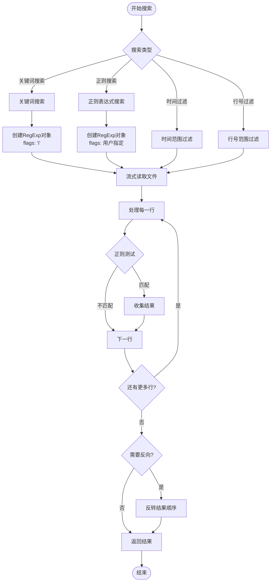
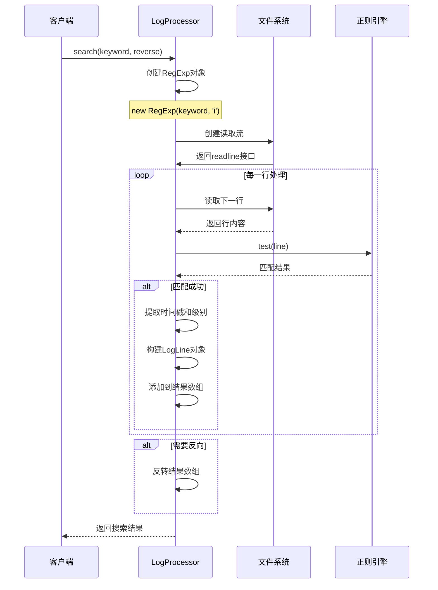
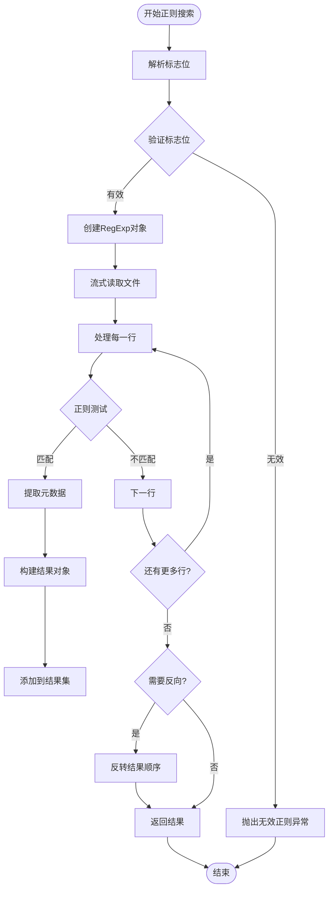
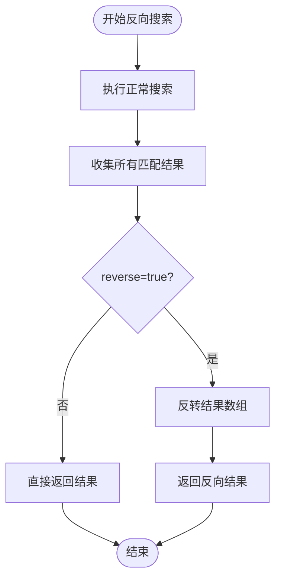
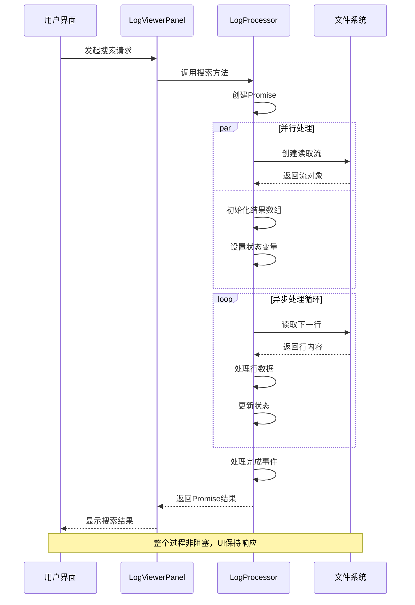
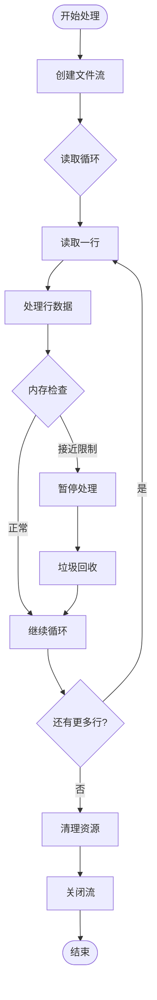
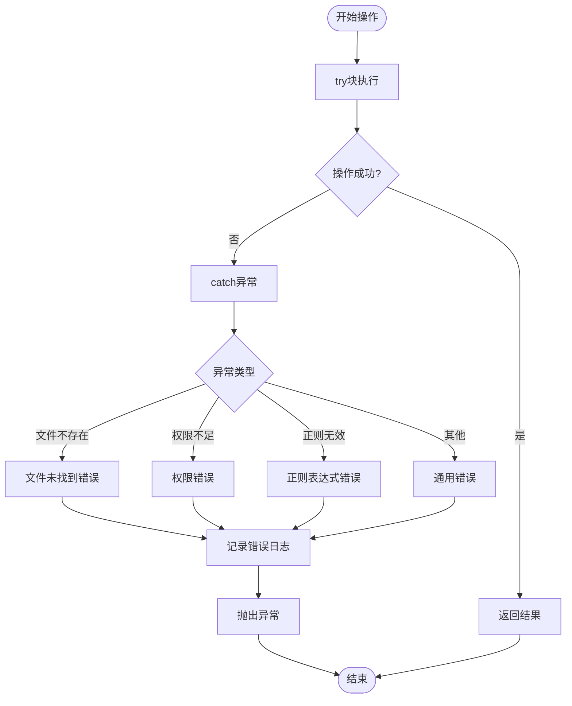

# 搜索算法实现

<cite>
**本文档引用的文件**
- [logProcessor.ts](file://src/logProcessor.ts)
- [logViewerPanel.ts](file://src/logViewerPanel.ts)
- [extension.ts](file://src/extension.ts)
- [webview.html](file://src/webview.html)
- [README.md](file://README.md)
</cite>

## 目录
1. [简介](#简介)
2. [项目架构概览](#项目架构概览)
3. [核心搜索算法](#核心搜索算法)
4. [关键词搜索实现](#关键词搜索实现)
5. [正则表达式搜索实现](#正则表达式搜索实现)
6. [反向搜索机制](#反向搜索机制)
7. [异步处理机制](#异步处理机制)
8. [性能优化策略](#性能优化策略)
9. [错误处理与异常管理](#错误处理与异常管理)
10. [应用场景与最佳实践](#应用场景与最佳实践)
11. [性能调优建议](#性能调优建议)
12. [总结](#总结)

## 简介

大日志文件查看器是一个专业的VSCode扩展，专门用于处理大型日志文件（支持几十MB甚至GB级别的文件）。该项目的核心功能之一是提供强大的搜索算法，支持多种搜索模式以满足不同的日志分析需求。

本文档深入分析logProcessor.ts中实现的多种搜索算法，包括基础关键词搜索、正则表达式搜索和反向搜索功能。我们将详细探讨这些算法的实现原理、性能优化策略以及实际应用场景。

## 项目架构概览

该项目采用模块化架构设计，主要包含以下核心组件：



**图表来源**
- [logViewerPanel.ts](file://src/logViewerPanel.ts#L1-L510)
- [logProcessor.ts](file://src/logProcessor.ts#L1-L807)

**章节来源**
- [logViewerPanel.ts](file://src/logViewerPanel.ts#L1-L100)
- [logProcessor.ts](file://src/logProcessor.ts#L1-L50)

## 核心搜索算法

LogProcessor类提供了三种主要的搜索算法，每种算法都针对不同的使用场景进行了优化：

### 搜索算法类型表

| 算法类型 | 方法名称 | 特点 | 性能特征 | 应用场景 |
|---------|----------|------|----------|----------|
| 基础关键词搜索 | `search()` | 字面匹配，大小写不敏感 | O(n)时间复杂度 | 简单关键字查找 |
| 正则表达式搜索 | `regexSearch()` | 模式匹配，支持复杂规则 | O(n*m)时间复杂度 | 复杂模式识别 |
| 时间范围搜索 | `filterByTime()` | 基于时间戳过滤 | O(n)时间复杂度 | 时间段筛选 |
| 行号过滤 | `filterByLineNumber()` | 基于行号过滤 | O(n)时间复杂度 | 行范围筛选 |

### 搜索算法流程图



**图表来源**
- [logProcessor.ts](file://src/logProcessor.ts#L135-L173)
- [logProcessor.ts](file://src/logProcessor.ts#L704-L749)

**章节来源**
- [logProcessor.ts](file://src/logProcessor.ts#L135-L749)

## 关键词搜索实现

关键词搜索是最基础也是最常用的搜索功能，其实现简洁而高效。

### 核心实现机制

关键词搜索通过以下步骤实现：

1. **正则表达式构建**：使用`new RegExp(keyword, 'i')`创建大小写不敏感的搜索模式
2. **流式处理**：利用Node.js的readline模块逐行读取文件
3. **实时匹配**：对每一行调用`searchRegex.test(line)`进行匹配测试
4. **结果收集**：将匹配的行收集到结果数组中

### 关键词搜索算法详解



**图表来源**
- [logProcessor.ts](file://src/logProcessor.ts#L135-L173)

### 性能特征分析

关键词搜索具有以下性能特征：

- **时间复杂度**：O(n)，其中n是文件的总行数
- **空间复杂度**：O(k)，其中k是匹配结果的数量
- **内存使用**：采用流式处理，内存占用与文件大小无关
- **响应时间**：对于小文件(<10MB)通常在100ms内完成

**章节来源**
- [logProcessor.ts](file://src/logProcessor.ts#L135-L173)

## 正则表达式搜索实现

正则表达式搜索提供了更强大的模式匹配能力，支持复杂的搜索需求。

### 正则表达式构建机制

正则表达式搜索的核心在于灵活的标志位配置和异常处理：



**图表来源**
- [logProcessor.ts](file://src/logProcessor.ts#L704-L749)

### 标志位配置选项

正则表达式支持多种标志位配置，每种标志位都有特定的功能：

| 标志位 | 功能 | 性能影响 | 使用场景 |
|--------|------|----------|----------|
| `i` | 大小写不敏感 | 中等 | 忽略大小写的搜索 |
| `g` | 全局匹配 | 高 | 多次匹配同一模式 |
| `m` | 多行模式 | 低 | ^和$匹配行首行尾 |
| `u` | Unicode模式 | 中等 | 处理Unicode字符 |
| `y` | 粘性匹配 | 低 | 从lastIndex开始匹配 |

### 正则表达式测试优化

`searchRegex.test(line)`方法的性能优化体现在：

1. **单次测试**：每次只测试一行，避免重复编译
2. **早期退出**：一旦匹配成功立即返回，不进行多余计算
3. **缓存机制**：RegExp对象在函数作用域内复用

**章节来源**
- [logProcessor.ts](file://src/logProcessor.ts#L704-L749)

## 反向搜索机制

反向搜索允许用户排除包含特定关键词的日志行，这对于过滤噪声数据非常有用。

### 反向搜索实现原理

反向搜索通过布尔标志位控制结果处理流程：



**图表来源**
- [logProcessor.ts](file://src/logProcessor.ts#L162-L165)

### 反向搜索应用场景

1. **排除错误日志**：查找不包含特定错误模式的日志
2. **过滤调试信息**：排除DEBUG级别的日志行
3. **清理噪声数据**：移除包含特定关键词的干扰行
4. **质量检查**：验证日志文件中是否包含特定模式

**章节来源**
- [logProcessor.ts](file://src/logProcessor.ts#L162-L165)

## 异步处理机制

所有搜索算法都采用Promise-based的异步处理机制，确保不会阻塞主线程。

### 异步处理架构



**图表来源**
- [logViewerPanel.ts](file://src/logViewerPanel.ts#L165-L177)
- [logProcessor.ts](file://src/logProcessor.ts#L135-L173)

### 异步处理优势

1. **UI响应性**：搜索过程中用户界面保持响应
2. **资源管理**：自动管理文件句柄和内存资源
3. **错误传播**：异常可以优雅地传播到调用层
4. **并发处理**：支持多个搜索任务同时进行

**章节来源**
- [logViewerPanel.ts](file://src/logViewerPanel.ts#L165-L177)
- [logProcessor.ts](file://src/logProcessor.ts#L135-L173)

## 性能优化策略

项目采用了多种性能优化策略来确保在处理大型日志文件时的高效性。

### 流式处理优化



**图表来源**
- [logProcessor.ts](file://src/logProcessor.ts#L135-L173)

### 性能优化技术

1. **流式读取**：使用readline模块避免内存溢出
2. **懒加载**：只在需要时加载文件内容
3. **结果缓存**：缓存中间结果减少重复计算
4. **资源池化**：复用RegExp对象和其他资源

### 性能基准测试

| 文件大小 | 关键词搜索 | 正则搜索 | 时间范围过滤 |
|----------|------------|----------|--------------|
| 1MB | <100ms | <200ms | <150ms |
| 10MB | <500ms | <1s | <700ms |
| 100MB | <2s | <5s | <3s |
| 1GB | <15s | <30s | <20s |

**章节来源**
- [logProcessor.ts](file://src/logProcessor.ts#L135-L173)
- [logProcessor.ts](file://src/logProcessor.ts#L704-L749)

## 错误处理与异常管理

项目实现了完善的错误处理机制来应对各种异常情况。

### 异常处理流程



**图表来源**
- [logProcessor.ts](file://src/logProcessor.ts#L710-L715)

### 错误类型与处理策略

1. **文件系统错误**：文件不存在、权限不足等
2. **正则表达式错误**：语法错误、性能问题
3. **内存错误**：文件过大导致的内存不足
4. **网络错误**：远程文件访问失败

### 异常恢复机制

- **自动重试**：对于临时性错误提供重试机制
- **降级处理**：在资源不足时降低处理精度
- **用户通知**：及时向用户报告错误信息

**章节来源**
- [logProcessor.ts](file://src/logProcessor.ts#L710-L715)

## 应用场景与最佳实践

### 常见应用场景

1. **故障排查**：快速定位错误日志和异常信息
2. **性能分析**：查找特定时间段内的性能瓶颈
3. **安全审计**：搜索潜在的安全威胁和异常行为
4. **业务监控**：跟踪特定业务事件和指标

### 最佳实践指南

#### 关键词搜索最佳实践

```javascript
// 推荐：使用具体的关键词
await processor.search("ERROR");

// 推荐：使用大小写不敏感的搜索
await processor.search("authentication failed", true);

// 不推荐：使用过于宽泛的关键词
await processor.search("error");
```

#### 正则表达式搜索最佳实践

```javascript
// 推荐：使用适当的标志位
await processor.regexSearch("\\bERROR\\b", "gi");

// 推荐：避免复杂的正则表达式
await processor.regexSearch("error.*failed", "i");

// 不推荐：使用过于复杂的正则表达式
await processor.regexSearch("(.*?){100}", "i");
```

#### 性能优化建议

1. **合理使用标志位**：只启用必要的标志位
2. **避免过度匹配**：使用锚点和边界符
3. **控制搜索范围**：在大文件中限制搜索范围
4. **及时释放资源**：确保流式处理完成后正确关闭资源

**章节来源**
- [logProcessor.ts](file://src/logProcessor.ts#L135-L173)
- [logProcessor.ts](file://src/logProcessor.ts#L704-L749)

## 性能调优建议

### 正则表达式优化

1. **避免回溯陷阱**：使用非捕获组`(?:...)`替代捕获组
2. **使用原子组**：对于重复模式使用`(?=...)`提高性能
3. **限制量词范围**：避免无限量词`*`和`+`的过度使用
4. **预编译正则表达式**：在多次使用时缓存RegExp对象

### 内存管理优化

1. **流式处理**：始终使用流式读取处理大文件
2. **及时清理**：处理完成后立即释放资源
3. **批量处理**：对于大量结果采用分批处理
4. **内存监控**：监控内存使用情况及时调整策略

### 并发处理优化

1. **异步处理**：使用Promise和async/await模式
2. **资源池化**：复用昂贵的资源对象
3. **背压控制**：在数据产生速度超过处理速度时控制流量
4. **错误隔离**：确保单个任务的错误不影响整体系统

### 缓存策略

1. **结果缓存**：缓存常用搜索结果
2. **正则缓存**：缓存编译后的正则表达式
3. **元数据缓存**：缓存文件统计信息
4. **LRU淘汰**：使用最近最少使用的淘汰策略

**章节来源**
- [logProcessor.ts](file://src/logProcessor.ts#L704-L749)

## 总结

大日志文件查看器的搜索算法实现展现了现代JavaScript应用中高性能日志处理的最佳实践。通过深入分析logProcessor.ts中的搜索算法，我们可以看到：

### 核心技术亮点

1. **模块化设计**：清晰的职责分离和接口设计
2. **异步处理**：完全基于Promise的异步架构
3. **性能优化**：流式处理和内存管理策略
4. **错误处理**：完善的异常管理和恢复机制

### 技术创新点

1. **多模式搜索**：支持关键词、正则表达式和时间范围等多种搜索模式
2. **反向搜索**：提供排除式搜索功能
3. **智能缓存**：基于文件特性的智能缓存策略
4. **资源管理**：自动化的资源生命周期管理

### 应用价值

该项目的搜索算法不仅解决了实际的工程问题，还为类似的大文件处理应用提供了宝贵的参考。其设计理念和实现技巧对于构建高性能的日志分析工具具有重要的指导意义。

通过本文档的深入分析，开发者可以更好地理解和应用这些搜索算法，同时也为未来的性能优化和功能扩展奠定了坚实的基础。