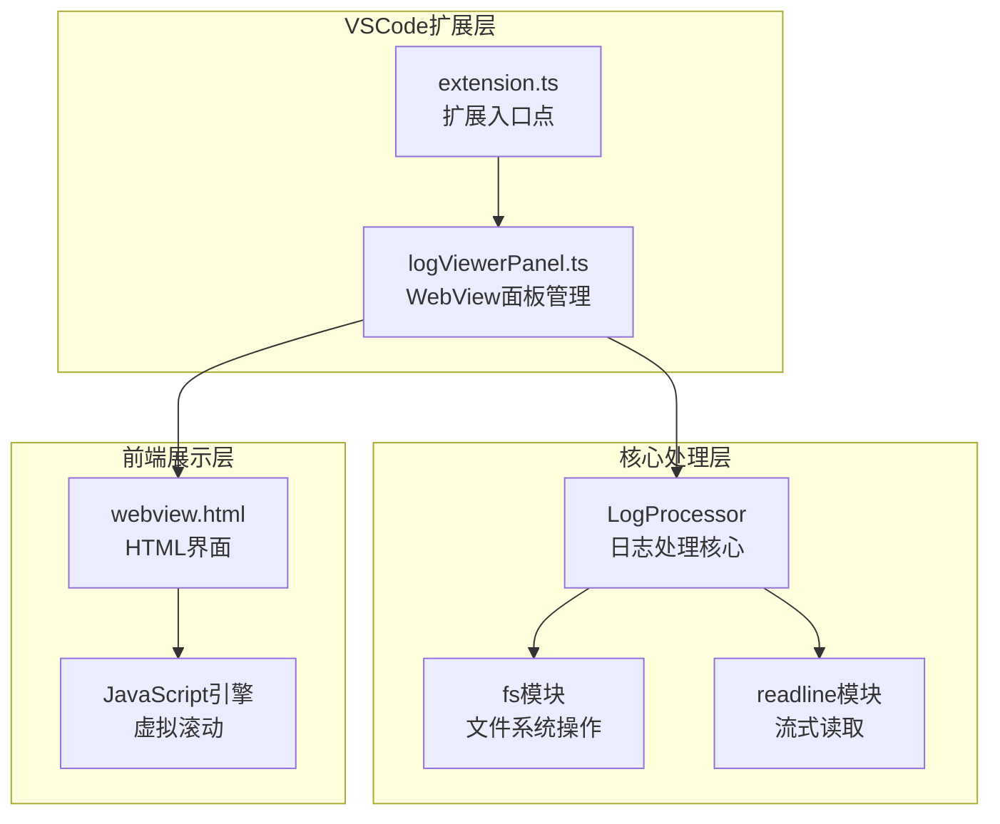
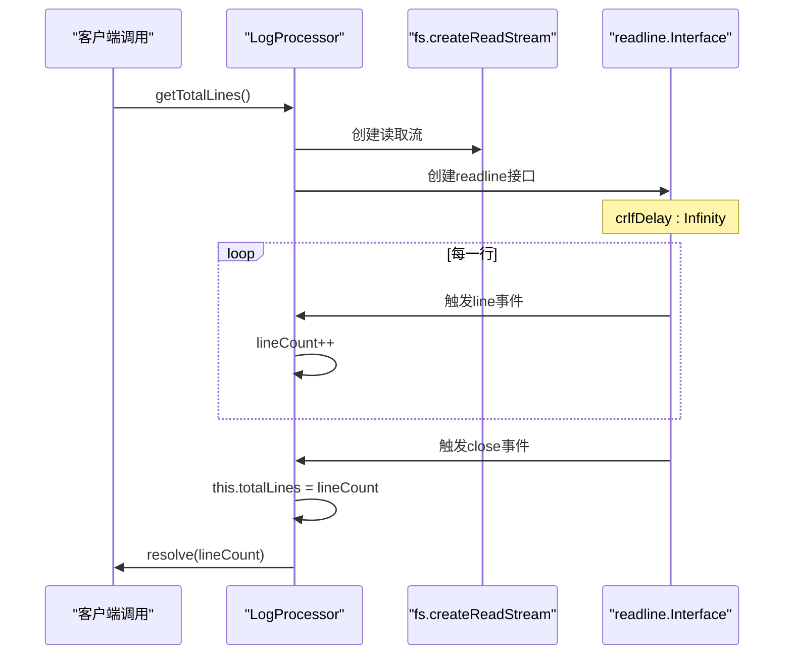
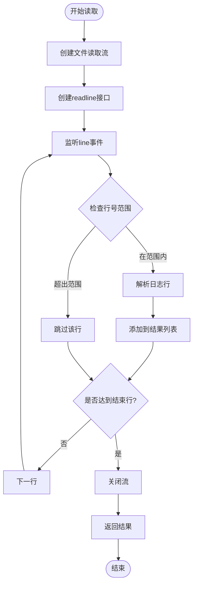
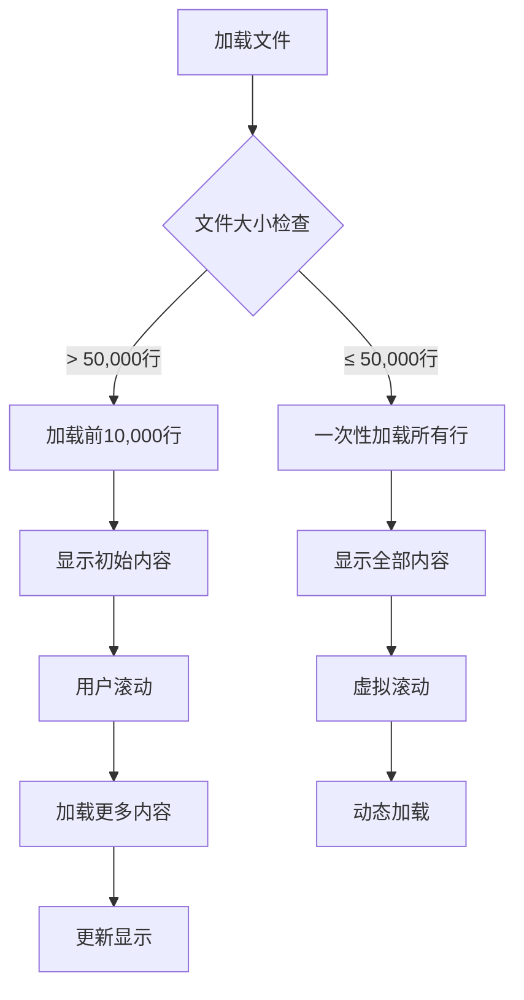
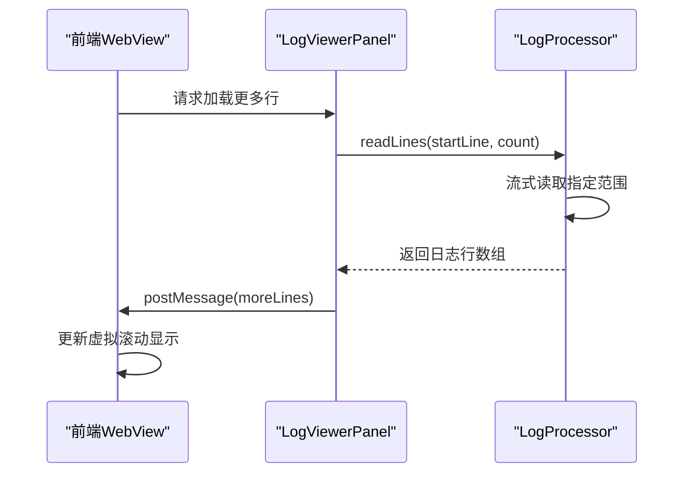
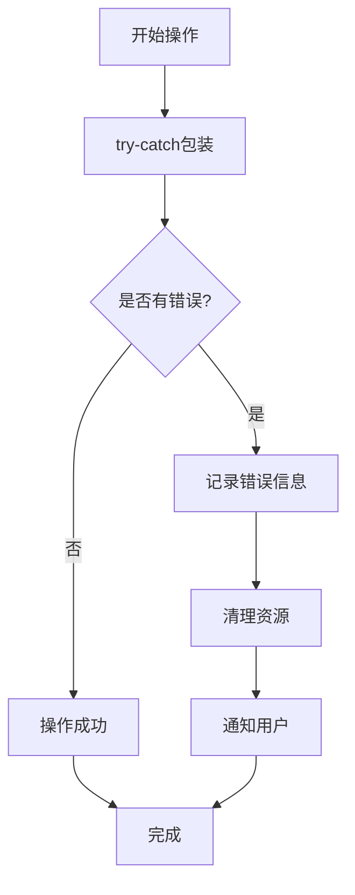

# 文件读取功能

<cite>
**本文档引用的文件**
- [logProcessor.ts](file://src/logProcessor.ts)
- [logViewerPanel.ts](file://src/logViewerPanel.ts)
- [extension.ts](file://src/extension.ts)
- [webview.html](file://src/webview.html)
- [package.json](file://package.json)
- [README.md](file://README.md)
</cite>

## 目录
1. [简介](#简介)
2. [项目架构概览](#项目架构概览)
3. [LogProcessor核心类分析](#logprocessor核心类分析)
4. [流式文件读取实现](#流式文件读取实现)
5. [虚拟滚动与分页读取](#虚拟滚动与分页读取)
6. [前端WebView协同工作](#前端webview协同工作)
7. [性能优化策略](#性能优化策略)
8. [最佳实践指南](#最佳实践指南)
9. [故障排除](#故障排除)
10. [总结](#总结)

## 简介

大日志文件查看器是一个专业的VSCode扩展，专门设计用于处理大型日志文件（支持几十MB甚至GB级别的文件）。该项目的核心优势在于其基于Node.js fs和readline模块的流式文件读取实现，这种实现方式能够有效避免全量加载大文件导致的内存溢出问题，同时提供高性能的虚拟滚动和智能搜索功能。

## 项目架构概览

该项目采用前后端分离的架构设计，主要由以下核心组件构成：



**图表来源**
- [extension.ts](file://src/extension.ts#L1-L116)
- [logViewerPanel.ts](file://src/logViewerPanel.ts#L1-L510)
- [logProcessor.ts](file://src/logProcessor.ts#L1-L807)

**章节来源**
- [extension.ts](file://src/extension.ts#L1-L116)
- [logViewerPanel.ts](file://src/logViewerPanel.ts#L1-L510)
- [package.json](file://package.json#L1-L94)

## LogProcessor核心类分析

LogProcessor类是整个系统的核心，负责所有日志文件的读取、处理和分析功能。该类提供了完整的日志处理流水线，包括文件读取、内容解析、搜索过滤和统计分析等功能。

### 类结构与接口定义

```mermaid
classDiagram
class LogProcessor {
-filePath : string
-totalLines : number
-timePatterns : RegExp[]
-logLevelPatterns : LogLevelPattern[]
+constructor(filePath : string)
+getTotalLines() : Promise~number~
+readLines(startLine : number, count : number) : Promise~LogLine[]~
+search(keyword : string, reverse : boolean) : Promise~LogLine[]~
+filterByTime(timeStr : string, mode : string, keep : boolean) : Promise~LogLine[]~
+findLineByTime(timeStr : string) : Promise~{lineNumber, line}~
+filterByLineNumber(lineNumber : number, mode : string, keep : boolean) : Promise~LogLine[]~
+deleteByTime(timeStr : string, mode : string) : Promise~number~
+deleteByLine(lineNumber : number, mode : string) : Promise~number~
+getStatistics() : Promise~LogStats~
+filterByLevel(levels : string[]) : Promise~LogLine[]~
+regexSearch(pattern : string, flags : string, reverse : boolean) : Promise~LogLine[]~
+exportLogs(lines : LogLine[], outputPath : string) : Promise~void~
-extractTimestamp(line : string) : Date
-extractLogLevel(line : string) : string
-parseTimeString(timeStr : string) : Date
}
class LogLine {
+lineNumber : number
+content : string
+timestamp? : Date
+level? : string
}
class LogStats {
+totalLines : number
+errorCount : number
+warnCount : number
+infoCount : number
+debugCount : number
+otherCount : number
+timeRange? : TimeRange
+classCounts? : Map~string, number~
+methodCounts? : Map~string, number~
+threadCounts? : Map~string, number~
}
LogProcessor --> LogLine : "创建"
LogProcessor --> LogStats : "生成"
```

**图表来源**
- [logProcessor.ts](file://src/logProcessor.ts#L4-L28)
- [logProcessor.ts](file://src/logProcessor.ts#L30-L807)

### 关键特性

1. **多时间戳格式支持**：支持20种不同的时间戳格式识别
2. **智能日志级别提取**：自动识别ERROR、WARN、INFO、DEBUG级别
3. **流式处理架构**：基于Node.js的流式读取机制
4. **内存高效设计**：避免全量加载大文件
5. **异步操作支持**：所有文件操作均为异步处理

**章节来源**
- [logProcessor.ts](file://src/logProcessor.ts#L1-L807)

## 流式文件读取实现

### getTotalLines方法详解

getTotalLines方法展示了流式读取的核心实现原理，通过readline接口逐行处理文件，避免了传统readFileSync可能导致的内存溢出问题。



**图表来源**
- [logProcessor.ts](file://src/logProcessor.ts#L63-L84)

#### 实现细节分析

1. **流创建**：使用`fs.createReadStream`创建文件读取流
2. **readline接口**：通过`readline.createInterface`创建逐行读取接口
3. **crlfDelay配置**：设置为Infinity以正确处理跨平台换行符
4. **事件驱动**：通过事件监听器处理每一行数据
5. **资源清理**：自动触发close事件时进行资源清理

### readLines方法实现

readLines方法实现了精确的行范围读取，这是虚拟滚动功能的基础。



**图表来源**
- [logProcessor.ts](file://src/logProcessor.ts#L90-L129)

#### 关键优化点

1. **提前终止**：当读取到所需行数后立即关闭流
2. **内存控制**：只保持当前批次的数据在内存中
3. **错误处理**：完善的异常捕获和资源清理
4. **性能监控**：通过destroy()方法及时释放资源

**章节来源**
- [logProcessor.ts](file://src/logProcessor.ts#L63-L129)

## 虚拟滚动与分页读取

### 分页读取策略

系统采用智能分页策略，根据文件大小动态调整加载策略：



**图表来源**
- [logViewerPanel.ts](file://src/logViewerPanel.ts#L107-L147)

### 前端分页实现

前端通过WebView与后端进行通信，实现无缝的分页体验：



**图表来源**
- [logViewerPanel.ts](file://src/logViewerPanel.ts#L150-L162)
- [webview.html](file://src/webview.html#L1-L800)

**章节来源**
- [logViewerPanel.ts](file://src/logViewerPanel.ts#L107-L162)

## 前端WebView协同工作

### 消息通信机制

前端与后端通过postMessage机制进行双向通信：

| 前端命令 | 后端响应 | 功能描述 |
|---------|---------|----------|
| loadMore | moreLines | 加载更多日志行 |
| search | searchResults | 执行搜索操作 |
| filterByLevel | filterResults | 应用级别过滤 |
| getStatistics | statisticsResults | 获取统计信息 |
| refresh | fileLoaded | 刷新文件内容 |
| exportLogs | 导出确认 | 导出日志文件 |

### 虚拟滚动实现

前端采用高效的虚拟滚动算法，只渲染可见区域的日志行：


**图表来源**
- [webview.html](file://src/webview.html#L1-L800)

**章节来源**
- [logViewerPanel.ts](file://src/logViewerPanel.ts#L54-L98)
- [webview.html](file://src/webview.html#L1-L800)

## 性能优化策略

### 内存管理优化

1. **流式处理**：避免全量加载文件到内存
2. **及时销毁**：使用stream.destroy()及时释放资源
3. **批量处理**：合理控制每次读取的行数
4. **垃圾回收**：主动清理不再使用的数据引用

### I/O性能优化

1. **缓冲区管理**：readline的crlfDelay配置
2. **并发控制**：避免同时进行多个大文件操作
3. **异步处理**：所有I/O操作采用异步模式
4. **错误恢复**：完善的错误处理和重试机制

### 网络传输优化

1. **数据压缩**：大量数据传输时的压缩策略
2. **增量更新**：只传输变化的部分数据
3. **连接复用**：WebView消息通道的复用
4. **缓存策略**：智能缓存常用数据

**章节来源**
- [logProcessor.ts](file://src/logProcessor.ts#L115-L120)
- [logViewerPanel.ts](file://src/logViewerPanel.ts#L150-L162)

## 最佳实践指南

### 错误处理最佳实践



### 资源清理最佳实践

1. **流关闭**：确保所有文件流都能正确关闭
2. **事件解绑**：及时移除事件监听器
3. **内存释放**：主动释放大对象的引用
4. **超时处理**：设置合理的操作超时时间

### 性能监控建议

1. **读取速度监控**：跟踪每千行的读取时间
2. **内存使用监控**：定期检查内存占用情况
3. **错误率统计**：记录各类操作的成功率
4. **用户体验指标**：测量响应时间和加载时间

**章节来源**
- [logProcessor.ts](file://src/logProcessor.ts#L81-L84)
- [logViewerPanel.ts](file://src/logViewerPanel.ts#L160-L162)

## 故障排除

### 常见问题及解决方案

| 问题类型 | 症状描述 | 解决方案 |
|---------|---------|----------|
| 内存溢出 | 大文件加载时崩溃 | 启用流式读取，增加crlfDelay配置 |
| 读取缓慢 | 文件读取时间过长 | 优化文件路径，使用SSD存储 |
| 搜索失效 | 正则表达式不匹配 | 检查正则表达式语法，验证时间格式 |
| WebView无响应 | 前后端通信中断 | 检查消息序列化，验证数据格式 |

### 调试技巧

1. **日志记录**：在关键节点添加详细的日志输出
2. **性能分析**：使用Node.js的profiling工具
3. **内存分析**：监控内存使用模式
4. **网络分析**：检查WebView消息传输效率

**章节来源**
- [logProcessor.ts](file://src/logProcessor.ts#L81-L84)
- [logViewerPanel.ts](file://src/logViewerPanel.ts#L160-L162)

## 总结

大日志文件查看器的文件读取功能展现了现代Node.js应用的最佳实践。通过巧妙地结合fs和readline模块，实现了内存高效的流式处理，配合前端的虚拟滚动技术，成功解决了大文件处理的性能瓶颈。

### 核心优势

1. **内存友好**：流式处理避免了大文件的内存溢出
2. **性能卓越**：虚拟滚动技术确保了流畅的用户体验
3. **扩展性强**：模块化设计便于功能扩展
4. **易于维护**：清晰的代码结构和完善的错误处理

### 技术创新点

1. **智能分页策略**：根据文件大小动态调整加载策略
2. **前后端协同**：WebView与后端的高效通信机制
3. **时间戳识别**：支持多种时间格式的智能解析
4. **异步处理**：全面采用异步编程模型

这个项目为处理大型日志文件提供了一个完整的解决方案，不仅在技术实现上具有参考价值，在工程实践方面也提供了宝贵的经验。