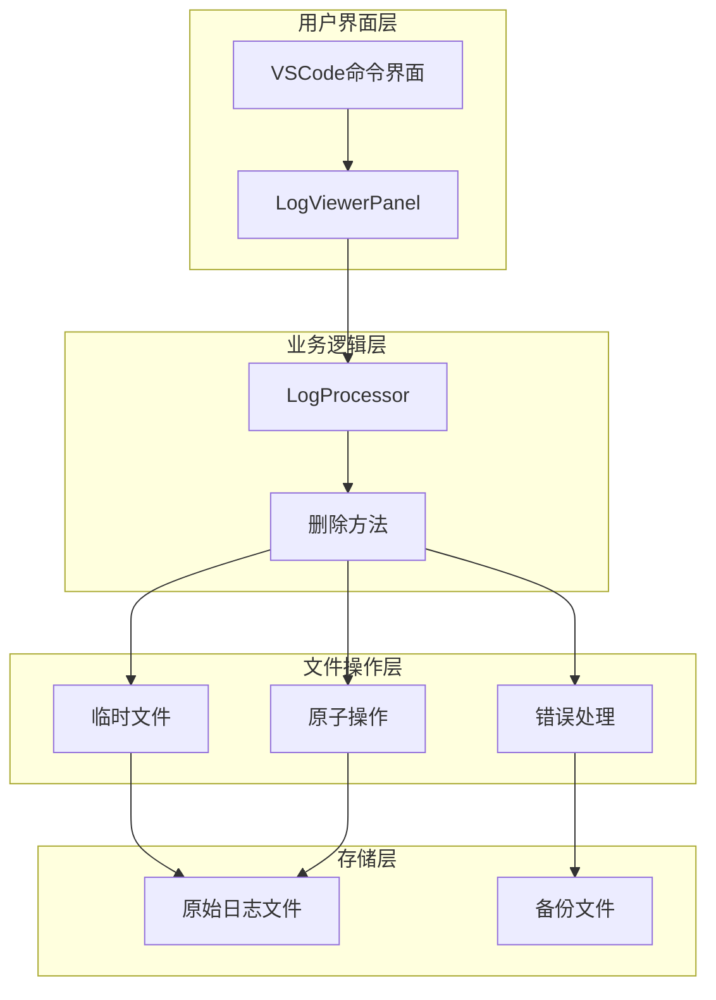
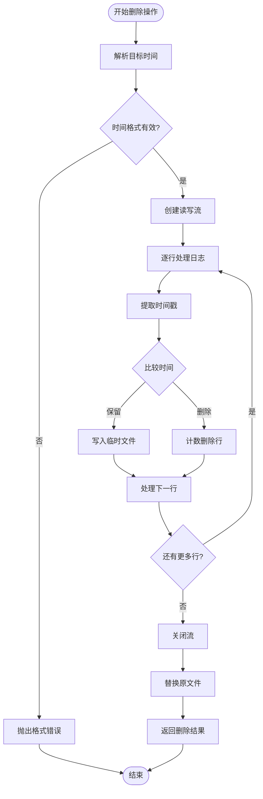
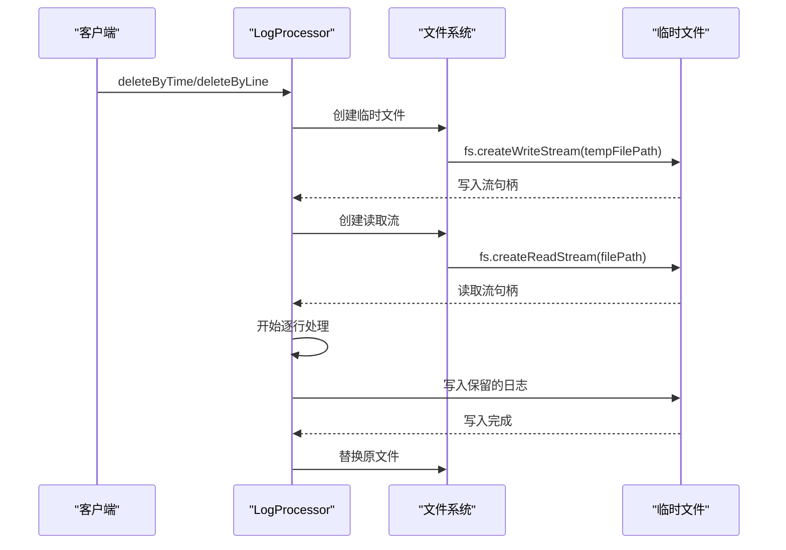
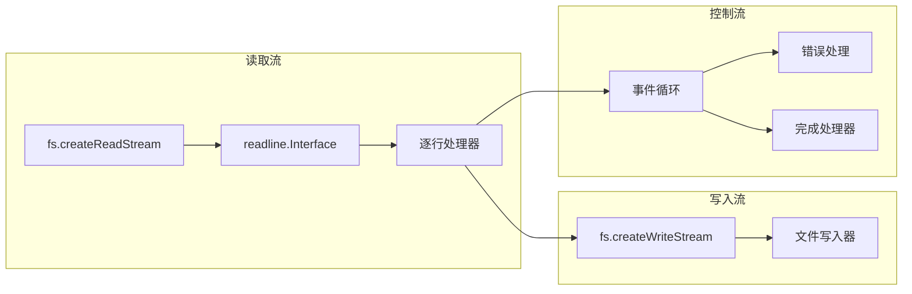
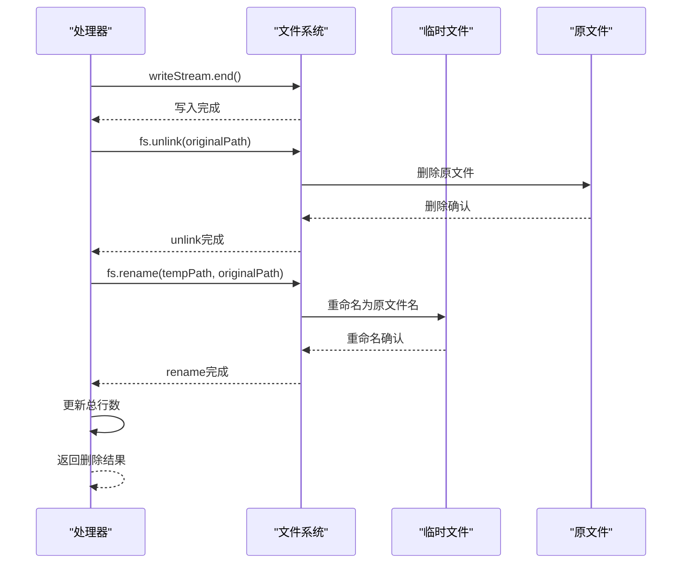
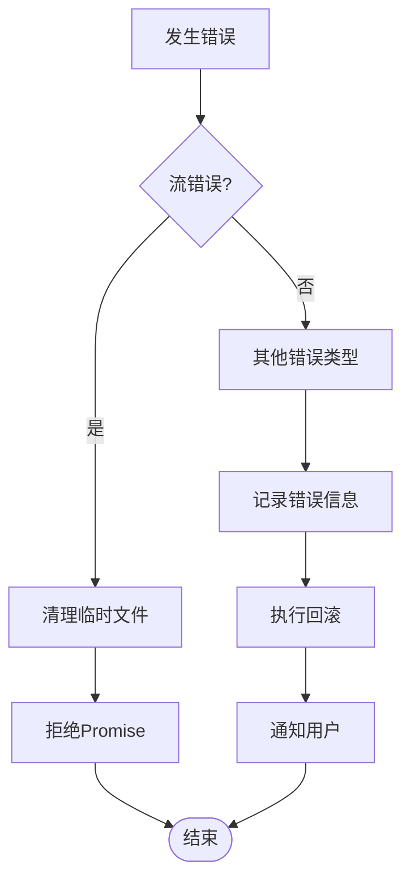
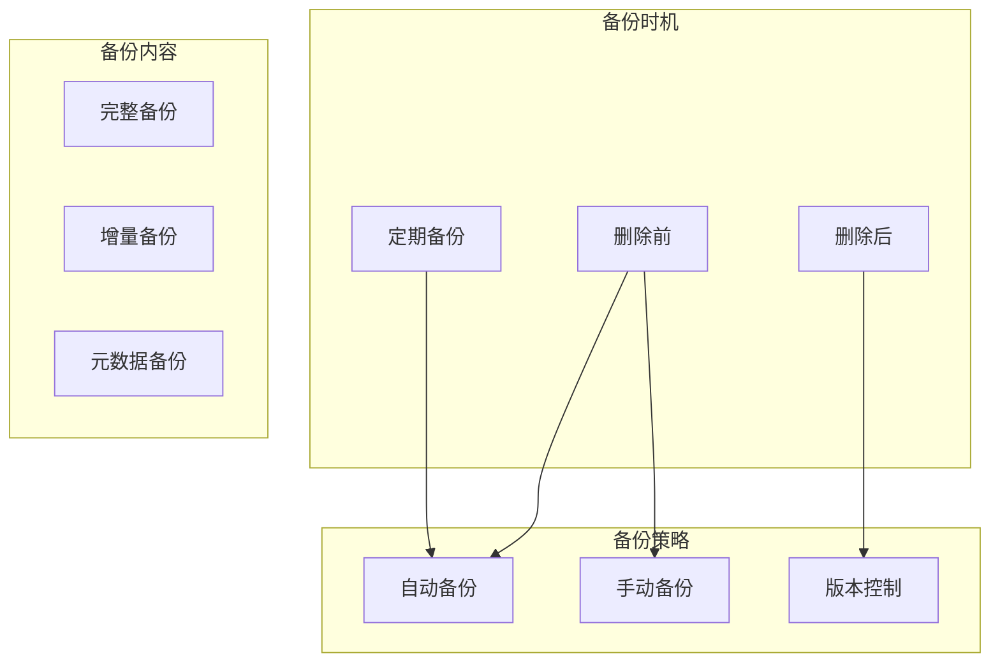
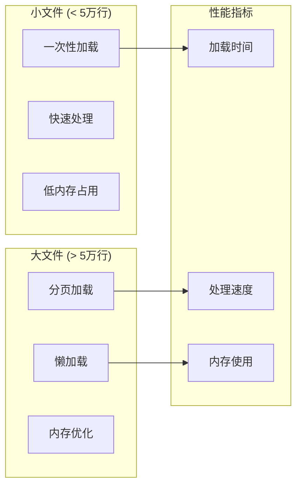

# 日志删除操作

<cite>
**本文档中引用的文件**
- [logProcessor.ts](file://src/logProcessor.ts)
- [logViewerPanel.ts](file://src/logViewerPanel.ts)
- [extension.ts](file://src/extension.ts)
- [README.md](file://README.md)
- [webview.html](file://src/webview.html)
</cite>

## 目录
1. [简介](#简介)
2. [系统架构概览](#系统架构概览)
3. [核心删除方法](#核心删除方法)
4. [临时文件机制](#临时文件机制)
5. [双流操作协同工作原理](#双流操作协同工作原理)
6. [文件替换原子性保证](#文件替换原子性保证)
7. [错误处理机制](#错误处理机制)
8. [安全注意事项](#安全注意事项)
9. [应用场景与最佳实践](#应用场景与最佳实践)
10. [性能考虑](#性能考虑)
11. [总结](#总结)

## 简介

本系统提供了强大的日志删除功能，支持按时间和行号两种维度删除日志内容。通过精心设计的临时文件机制和原子性操作，确保数据安全性和操作可靠性。系统采用双流操作模式，结合严格的错误处理和回滚策略，为用户提供安全可靠的日志管理体验。

## 系统架构概览

系统采用分层架构设计，主要包含以下组件：



**图表来源**
- [extension.ts](file://src/extension.ts#L1-L116)
- [logViewerPanel.ts](file://src/logViewerPanel.ts#L1-L510)
- [logProcessor.ts](file://src/logProcessor.ts#L30-L475)

## 核心删除方法

系统提供两个核心删除方法，分别支持按时间和行号删除日志：

### deleteByTime 方法

按时间删除日志的核心实现，支持两种删除模式：

- **before模式**：删除指定时间之前的所有日志
- **after模式**：删除指定时间之后的所有日志



**图表来源**
- [logProcessor.ts](file://src/logProcessor.ts#L339-L408)

### deleteByLine 方法

按行号删除日志的实现，同样支持两种模式：

- **before模式**：删除指定行之前的所有日志
- **after模式**：删除指定行之后的所有日志

**节来源**
- [logProcessor.ts](file://src/logProcessor.ts#L414-L474)

## 临时文件机制

系统采用临时文件机制确保数据安全，这是删除操作的核心安全保障：

### 临时文件命名策略

```typescript
// 临时文件路径生成规则
const tempFilePath = `${this.filePath}.tmp`;
```

### 临时文件创建流程



**图表来源**
- [logProcessor.ts](file://src/logProcessor.ts#L346-L347)
- [logProcessor.ts](file://src/logProcessor.ts#L348-L349)

**节来源**
- [logProcessor.ts](file://src/logProcessor.ts#L346-L408)
- [logProcessor.ts](file://src/logProcessor.ts#L416-L474)

## 双流操作协同工作原理

系统采用双流操作模式，读取流和写入流协同工作：

### 流操作架构



**图表来源**
- [logProcessor.ts](file://src/logProcessor.ts#L348-L352)
- [logProcessor.ts](file://src/logProcessor.ts#L347-L347)

### 事件驱动处理机制

系统采用事件驱动模式处理每一行日志：

1. **line事件**：处理每一行日志内容
2. **close事件**：处理完成后触发
3. **error事件**：捕获处理过程中的错误

**节来源**
- [logProcessor.ts](file://src/logProcessor.ts#L357-L379)
- [logProcessor.ts](file://src/logProcessor.ts#L428-L445)

## 文件替换原子性保证

系统通过unlink和rename操作确保文件替换的原子性：

### 原子性操作序列



**图表来源**
- [logProcessor.ts](file://src/logProcessor.ts#L385-L398)
- [logProcessor.ts](file://src/logProcessor.ts#L451-L464)

### 原子性保证机制

1. **写入完成确认**：确保临时文件完全写入后再进行替换
2. **原文件删除**：在确认临时文件可用后删除原文件
3. **重命名操作**：将临时文件重命名为原文件名

**节来源**
- [logProcessor.ts](file://src/logProcessor.ts#L385-L398)
- [logProcessor.ts](file://src/logProcessor.ts#L451-L464)

## 错误处理机制

系统实现了完善的错误处理和回滚策略：

### 错误处理层次



**图表来源**
- [logProcessor.ts](file://src/logProcessor.ts#L403-L407)
- [logProcessor.ts](file://src/logProcessor.ts#L469-L473)

### 回滚策略

1. **临时文件清理**：发生错误时立即删除临时文件
2. **Promise拒绝**：向调用方传播错误信息
3. **状态恢复**：保持系统状态的一致性

**节来源**
- [logProcessor.ts](file://src/logProcessor.ts#L403-L407)
- [logProcessor.ts](file://src/logProcessor.ts#L469-L473)

## 安全注意事项

### 数据保护措施

1. **多重确认机制**
   - 用户必须明确确认删除操作
   - 显示删除影响范围
   - 提供多种操作选项

2. **操作模式选择**
   - **仅隐藏**：不修改原文件，仅在界面上隐藏
   - **导出到新文件**：将结果保存到新文件
   - **修改原文件**：直接修改原文件（危险）

### 备份建议



### 大文件处理注意事项

1. **内存使用控制**：使用流式处理避免内存溢出
2. **进度反馈**：提供处理进度信息
3. **中断处理**：支持操作中断和恢复

**节来源**
- [logViewerPanel.ts](file://src/logViewerPanel.ts#L180-L228)
- [logViewerPanel.ts](file://src/logViewerPanel.ts#L230-L278)

## 应用场景与最佳实践

### 按时间删除的应用场景

| 场景 | 使用模式 | 示例 |
|------|----------|------|
| 清理历史日志 | before模式 | 删除2024年1月1日之前的所有日志 |
| 保留最新日志 | after模式 | 保留2024年1月1日之后的日志 |
| 时间范围筛选 | 组合使用 | 删除特定时间段之外的日志 |

### 按行号删除的应用场景

| 场景 | 使用模式 | 示例 |
|------|----------|------|
| 清除开头日志 | before模式 | 删除前1000行日志 |
| 清除结尾日志 | after模式 | 删除最后500行日志 |
| 截取中间部分 | 组合使用 | 保留中间10000行日志 |

### 最佳实践建议

1. **操作前确认**
   - 始终先使用"仅隐藏"模式预览效果
   - 确认删除范围无误后再执行实际删除

2. **备份策略**
   - 对重要日志文件进行备份
   - 使用版本控制系统管理日志文件

3. **性能优化**
   - 对于大文件，考虑分批处理
   - 监控磁盘空间使用情况

**节来源**
- [logViewerPanel.ts](file://src/logViewerPanel.ts#L180-L228)
- [logViewerPanel.ts](file://src/logViewerPanel.ts#L230-L278)

## 性能考虑

### 大文件处理性能



### 磁盘空间监控

1. **临时文件空间需求**
   - 临时文件大小等于保留日志的大小
   - 需要额外的磁盘空间进行文件替换

2. **性能影响因素**
   - 文件大小对处理时间的影响
   - 磁盘I/O性能的影响
   - CPU使用率的影响

### 优化建议

1. **批量处理**：对于大量删除操作，考虑批量处理
2. **并发控制**：避免同时进行多个删除操作
3. **资源监控**：监控系统资源使用情况

**节来源**
- [logViewerPanel.ts](file://src/logViewerPanel.ts#L107-L147)

## 总结

本系统通过精心设计的临时文件机制和原子性操作，提供了安全可靠的日志删除功能。主要特点包括：

1. **安全性**：通过临时文件机制和原子性操作确保数据安全
2. **可靠性**：完善的错误处理和回滚策略
3. **灵活性**：支持多种删除模式和操作选项
4. **性能**：针对大文件优化的流式处理机制

系统的设计充分考虑了生产环境的需求，提供了多种操作模式以适应不同的使用场景，同时通过多重确认机制和备份建议确保操作的安全性。这种设计既保证了功能的强大性，又维护了系统的稳定性和可靠性。