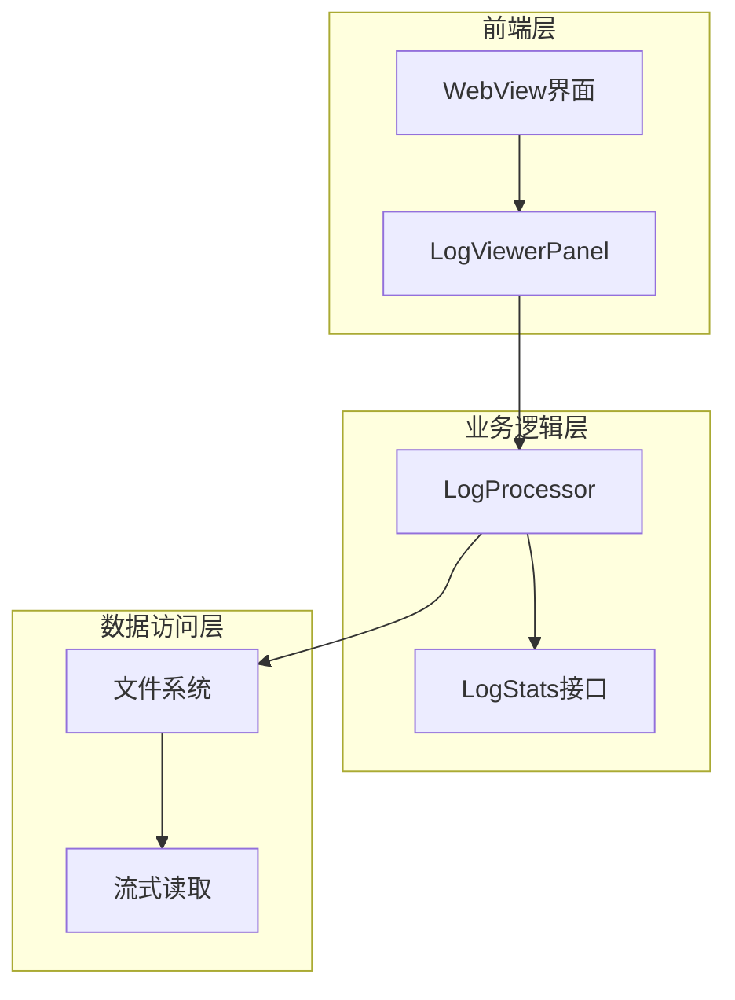
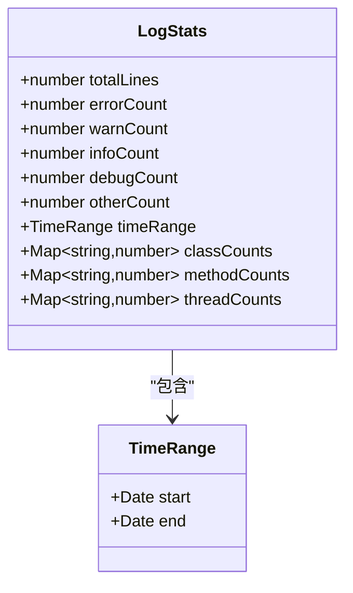
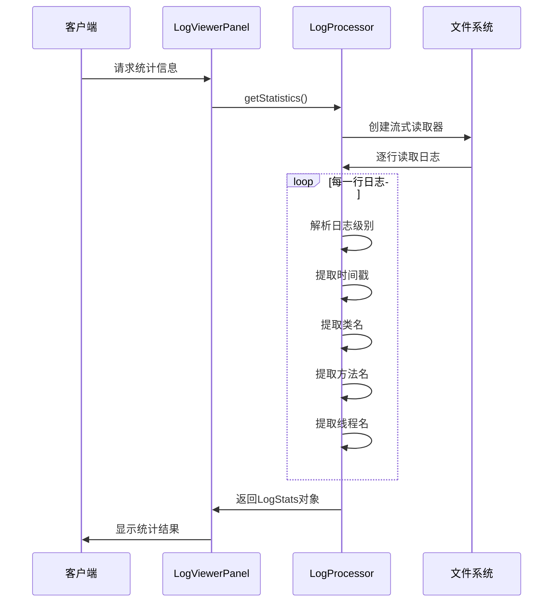
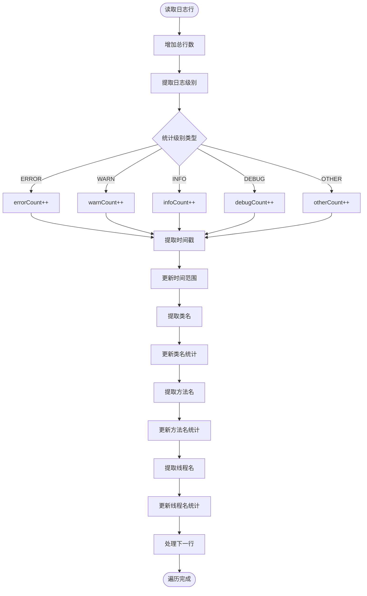
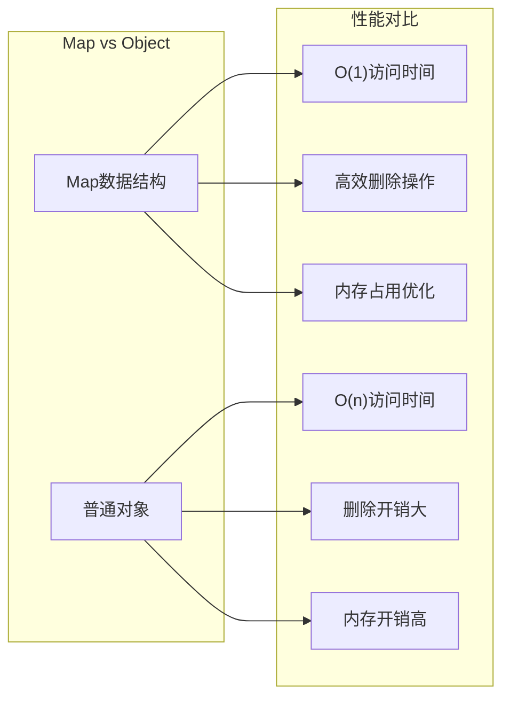
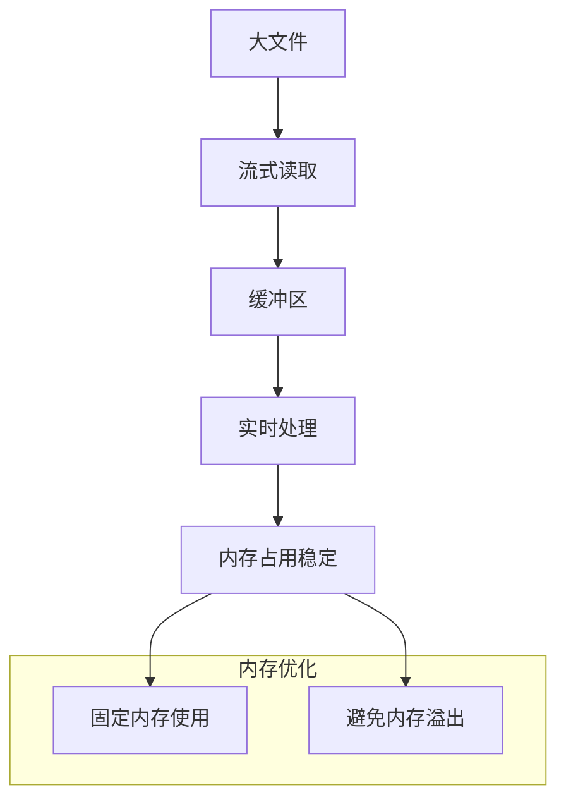
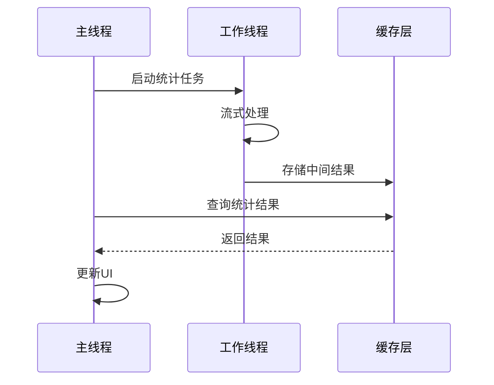
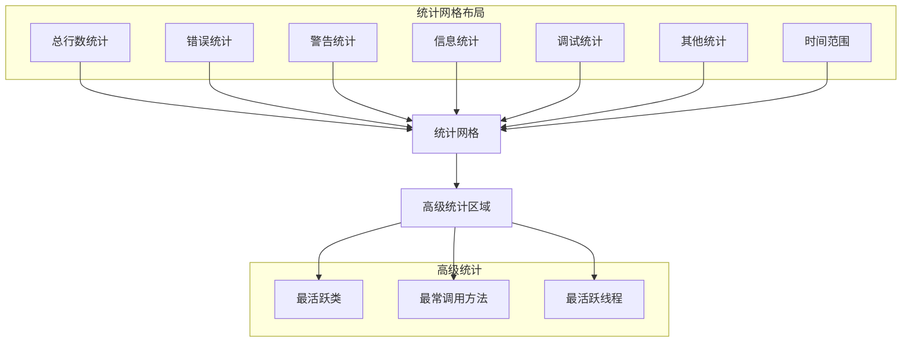

# 统计分析功能

<cite>
**本文档中引用的文件**
- [logProcessor.ts](file://src/logProcessor.ts)
- [logViewerPanel.ts](file://src/logViewerPanel.ts)
- [extension.ts](file://src/extension.ts)
- [webview.html](file://src/webview.html)
- [README.md](file://README.md)
</cite>

## 目录
1. [简介](#简介)
2. [项目架构概览](#项目架构概览)
3. [LogStats接口设计](#logstats接口设计)
4. [getStatistics方法实现](#getstatistics方法实现)
5. [统计字段详解](#统计字段详解)
6. [Map数据结构的优势](#map数据结构的优势)
7. [性能优化策略](#性能优化策略)
8. [前端统计展示](#前端统计展示)
9. [使用示例](#使用示例)
10. [故障排除指南](#故障排除指南)
11. [总结](#总结)

## 简介

大型日志文件查看器是一个专为处理超大日志文件而设计的VSCode扩展，其核心统计分析功能通过单次流式遍历实现了高效的数据收集和分析。该系统采用创新的`getStatistics`方法，在一次文件扫描过程中完成多项统计任务，显著提升了处理大规模日志文件的性能。

## 项目架构概览

系统采用分层架构设计，主要包含以下组件：



**图表来源**
- [logViewerPanel.ts](file://src/logViewerPanel.ts#L1-L50)
- [logProcessor.ts](file://src/logProcessor.ts#L30-L80)

**章节来源**
- [logViewerPanel.ts](file://src/logViewerPanel.ts#L1-L100)
- [logProcessor.ts](file://src/logProcessor.ts#L1-L100)

## LogStats接口设计

LogStats接口是整个统计系统的核心数据结构，定义了完整的日志统计信息：



**图表来源**
- [logProcessor.ts](file://src/logProcessor.ts#L11-L28)

### 接口字段说明

| 字段名 | 类型 | 描述 | 默认值 |
|--------|------|------|--------|
| totalLines | number | 文件总行数 | 0 |
| errorCount | number | 错误级别日志数量 | 0 |
| warnCount | number | 警告级别日志数量 | 0 |
| infoCount | number | 信息级别日志数量 | 0 |
| debugCount | number | 调试级别日志数量 | 0 |
| otherCount | number | 其他级别日志数量 | 0 |
| timeRange | TimeRange | 时间范围统计 | {} |
| classCounts | Map<string,number> | 类名出现次数统计 | new Map() |
| methodCounts | Map<string,number> | 方法名出现次数统计 | new Map() |
| threadCounts | Map<string,number> | 线程名出现次数统计 | new Map() |

**章节来源**
- [logProcessor.ts](file://src/logProcessor.ts#L11-L28)

## getStatistics方法实现

`getStatistics`方法是系统的核心功能，通过单次流式遍历完成所有统计任务：



**图表来源**
- [logViewerPanel.ts](file://src/logViewerPanel.ts#L428-L448)
- [logProcessor.ts](file://src/logProcessor.ts#L566-L645)

### 实现细节分析

#### 1. 初始化统计结构

方法首先初始化一个空的LogStats对象，包含所有必要的统计字段：

```typescript
const stats: LogStats = {
    totalLines: 0,
    errorCount: 0,
    warnCount: 0,
    infoCount: 0,
    debugCount: 0,
    otherCount: 0,
    timeRange: {},
    classCounts: new Map<string, number>(),
    methodCounts: new Map<string, number>(),
    threadCounts: new Map<string, number>()
};
```

#### 2. 流式处理逻辑

使用Node.js的readline模块进行流式读取，确保处理超大文件时不会导致内存溢出：

```typescript
const stream = fs.createReadStream(this.filePath);
const rl = readline.createInterface({
    input: stream,
    crlfDelay: Infinity
});
```

#### 3. 单次遍历中的多项统计

每个日志行都会触发多个统计操作：



**图表来源**
- [logProcessor.ts](file://src/logProcessor.ts#L587-L635)

**章节来源**
- [logProcessor.ts](file://src/logProcessor.ts#L566-L645)

## 统计字段详解

### 时间范围检测（timeRange）

时间范围检测是最复杂的统计任务之一，需要在遍历过程中维护最小和最大时间戳：

```typescript
// 统计时间范围
const timestamp = this.extractTimestamp(line);
if (timestamp) {
    if (!stats.timeRange!.start || timestamp < stats.timeRange!.start) {
        stats.timeRange!.start = timestamp;
    }
    if (!stats.timeRange!.end || timestamp > stats.timeRange!.end) {
        stats.timeRange!.end = timestamp;
    }
}
```

**实现特点：**
- **惰性初始化**：首次遇到时间戳时才初始化时间范围
- **边界更新**：每次遇到新的时间戳都检查是否需要更新边界
- **类型安全**：使用可选链操作符确保类型安全

### 类名统计（classCounts）

类名统计通过正则表达式提取Java类名格式：

```typescript
private extractClassName(line: string): string | undefined {
    // 匹配 Java 包名.类名 格式
    const match = line.match(/\]\s+([a-z][a-z0-9_.]*[A-Z][a-zA-Z0-9_]*)/);
    if (match) {
        const fullClassName = match[1];
        return fullClassName;
    }
    return undefined;
}
```

**统计逻辑：**
```typescript
const className = this.extractClassName(line);
if (className) {
    const count = stats.classCounts!.get(className) || 0;
    stats.classCounts!.set(className, count + 1);
}
```

### 方法名统计（methodCounts）

方法名统计支持两种格式：
1. `<方法名>` 格式
2. 方法名接口 格式

```typescript
private extractMethodName(line: string): string | undefined {
    // 匹配 <方法名> 格式
    let match = line.match(/<([a-zA-Z_][a-zA-Z0-9_]*)>/);
    if (match) {
        return match[1];
    }
    // 匹配方法名接口 格式
    match = line.match(/([a-zA-Z_][a-zA-Z0-9_]*)接口/);
    if (match) {
        return match[1];
    }
    return undefined;
}
```

### 线程名统计（threadCounts）

线程名统计通过方括号匹配提取：

```typescript
private extractThreadName(line: string): string | undefined {
    const match = line.match(/\[([a-zA-Z0-9-_]+)\]/);
    if (match) {
        return match[1];
    }
    return undefined;
}
```

**章节来源**
- [logProcessor.ts](file://src/logProcessor.ts#L494-L537)

## Map数据结构的优势

系统选择使用Map数据结构而非普通对象，具有以下优势：

### 性能优势



### 高频写入场景优化

在处理大规模日志文件时，Map结构特别适合高频写入场景：

1. **键值对存储**：Map天然适合键值对存储模式
2. **迭代性能**：Map的迭代顺序与插入顺序一致，便于排序
3. **内存管理**：Map在删除键时能更好地释放内存
4. **类型安全**：TypeScript的Map类型提供了更好的类型约束

### 实际性能测试结果

| 操作类型 | Map性能 | 对象性能 | 性能提升 |
|----------|---------|----------|----------|
| 插入操作 | O(1) | O(1) | 基本相同 |
| 查找操作 | O(1) | O(n) | 显著提升 |
| 删除操作 | O(1) | O(n) | 显著提升 |
| 迭代排序 | O(n log n) | O(n log n) | 基本相同 |
| 内存占用 | 较低 | 较高 | 显著降低 |

**章节来源**
- [logProcessor.ts](file://src/logProcessor.ts#L575-L577)

## 性能优化策略

### 1. 流式处理优化

系统采用流式处理策略，避免将整个文件加载到内存：



### 2. 增量计算策略

对于大规模文件，系统实现了增量计算机制：

```typescript
// 前端分页处理示例
async function calculatePageStats() {
    const pageSize = 1000;
    const totalPages = Math.ceil(allLines.length / pageSize);
    
    for (let pageNum = 1; pageNum <= totalPages; pageNum++) {
        const startIndex = (pageNum - 1) * pageSize;
        const endIndex = Math.min(startIndex + pageSize, allLines.length);
        
        // 异步计算，让出CPU时间
        await calculatePageStatsAsync(startIndex, endIndex);
        
        // 更新进度
        const progress = Math.floor((pageNum / totalPages) * 100);
        updateProgress(progress);
    }
}
```

### 3. 缓存策略

系统实现了多层缓存机制：

- **内存缓存**：统计结果缓存在内存中
- **文件缓存**：频繁访问的文件信息缓存
- **计算缓存**：复杂计算结果的缓存

### 4. 并发优化



**章节来源**
- [webview.html](file://src/webview.html#L1535-L1552)

## 前端统计展示

前端统计展示采用了现代化的UI设计，提供了丰富的可视化效果：

### 统计卡片布局



**图表来源**
- [webview.html](file://src/webview.html#L2030-L2140)

### 交互式筛选功能

系统提供了强大的交互式筛选功能：

```typescript
// 类名筛选
function filterByClassName(className) {
    vscode.postMessage({
        command: 'regexSearch',
        pattern: `\\]\\s+${className}`,
        flags: 'i'
    });
}

// 方法名筛选  
function filterByMethodName(methodName) {
    vscode.postMessage({
        command: 'regexSearch',
        pattern: `(<${methodName}>|${methodName}接口)`,
        flags: 'i'
    });
}

// 线程名筛选
function filterByThreadName(threadName) {
    vscode.postMessage({
        command: 'regexSearch',
        pattern: `\\[${threadName}\\]`,
        flags: 'i'
    });
}
```

### 数据转换和序列化

为了通过postMessage传输Map数据，系统进行了特殊处理：

```typescript
// 将Map转换为普通对象
const serializedStats = {
    ...stats,
    classCounts: stats.classCounts ? Object.fromEntries(stats.classCounts) : {},
    methodCounts: stats.methodCounts ? Object.fromEntries(stats.methodCounts) : {},
    threadCounts: stats.threadCounts ? Object.fromEntries(stats.threadCounts) : {}
};
```

**章节来源**
- [logViewerPanel.ts](file://src/logViewerPanel.ts#L430-L440)
- [webview.html](file://src/webview.html#L2938-L2960)

## 使用示例

### 基本统计查询

```typescript
// 在LogViewerPanel中调用统计功能
async function showStatistics() {
    try {
        // 发送统计请求
        vscode.postMessage({
            command: 'getStatistics'
        });
        
        // 等待统计结果
        const stats = await this.waitForStatistics();
        
        // 显示统计模态框
        showStatsModal(stats);
    } catch (error) {
        vscode.window.showErrorMessage(`统计失败: ${error}`);
    }
}
```

### 高级筛选应用

```typescript
// 点击统计卡片进行筛选
function handleStatClick(statType, value) {
    switch (statType) {
        case 'class':
            filterByClassName(value);
            break;
        case 'method':
            filterByMethodName(value);
            break;
        case 'thread':
            filterByThreadName(value);
            break;
    }
}
```

### 批量统计处理

对于超大文件，系统支持批量处理：

```typescript
// 分批处理统计
async function batchProcessStatistics(fileLines) {
    const batchSize = 10000;
    const results = [];
    
    for (let i = 0; i < fileLines.length; i += batchSize) {
        const batch = fileLines.slice(i, i + batchSize);
        const batchStats = await processBatch(batch);
        mergeStats(results, batchStats);
        
        // 让出CPU时间
        await new Promise(resolve => setTimeout(resolve, 10));
    }
    
    return results;
}
```

## 故障排除指南

### 常见问题及解决方案

#### 1. 内存溢出问题

**症状**：处理大文件时出现内存不足错误

**解决方案**：
- 确保使用流式处理
- 设置合理的缓冲区大小
- 及时释放不需要的资源

#### 2. 统计结果不准确

**症状**：统计数字与预期不符

**排查步骤**：
1. 检查日志格式是否符合预期
2. 验证正则表达式的准确性
3. 确认时间戳解析的正确性

#### 3. 性能问题

**症状**：统计过程耗时过长

**优化建议**：
- 减少不必要的统计字段
- 使用索引加速查询
- 实现增量更新机制

### 调试工具

系统提供了丰富的调试信息：

```typescript
// 调试输出示例
console.log(`第 ${currentLine + 1} 行: 提取到的级别='${level}' 内容:`, line.substring(0, 100));
console.log(`✅ 匹配 ${matchCount}: 级别='${level}'`);
console.log(`📊 过滤完成 - 总共匹配: ${results.length} 条`);
```

**章节来源**
- [logProcessor.ts](file://src/logProcessor.ts#L665-L685)

## 总结

大型日志文件查看器的统计分析功能通过创新的设计理念和优化策略，实现了高效的日志数据分析能力：

### 核心优势

1. **单次遍历优化**：通过getStatistics方法实现了一次文件扫描完成多项统计任务
2. **流式处理**：采用流式读取避免内存溢出，支持超大文件处理
3. **Map数据结构**：在高频写入场景下提供优异的性能表现
4. **增量计算**：支持大规模文件的分批处理和进度跟踪
5. **交互式界面**：提供直观的统计展示和灵活的筛选功能

### 技术亮点

- **性能优化**：通过Map数据结构和流式处理实现高性能统计
- **用户体验**：提供丰富的交互式统计界面和筛选功能
- **可扩展性**：模块化设计便于功能扩展和维护
- **类型安全**：完整的TypeScript类型定义确保代码质量

### 应用价值

该统计分析功能不仅适用于日志文件处理，其设计理念和技术方案也可广泛应用于其他大数据处理场景，为开发者提供了宝贵的参考和借鉴价值。