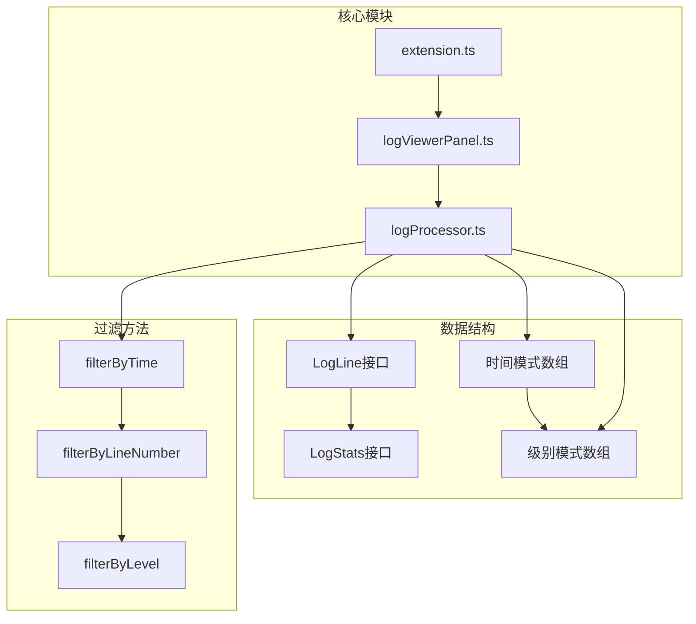
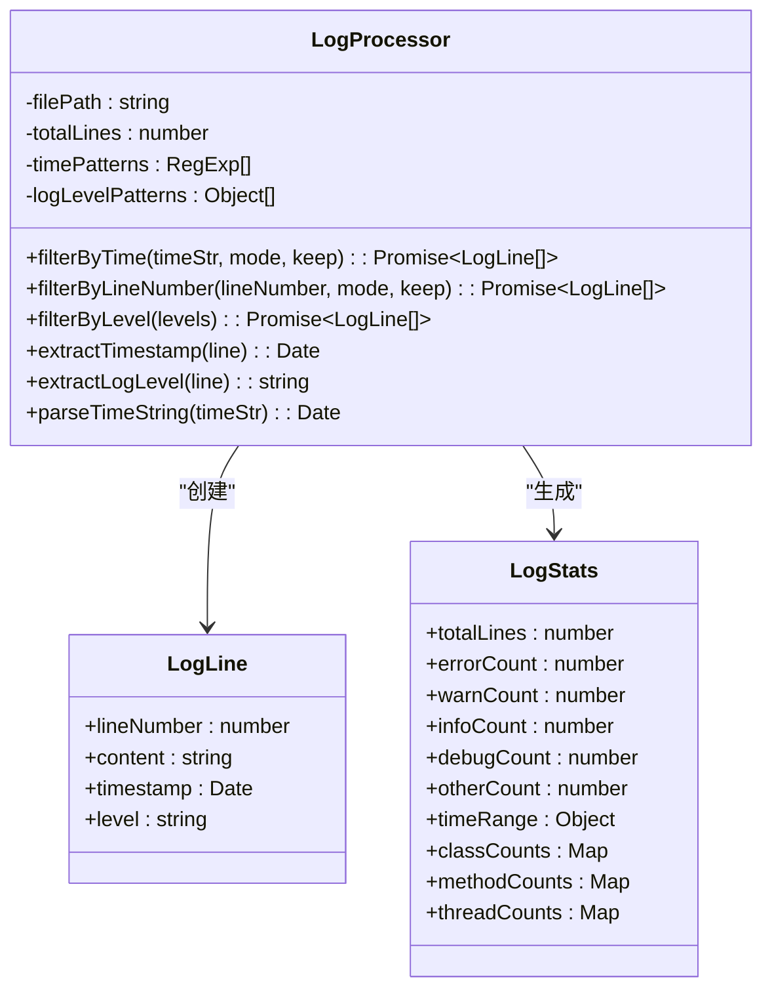
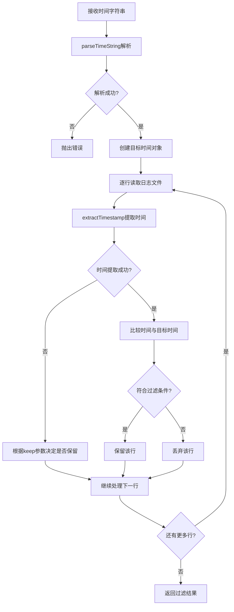
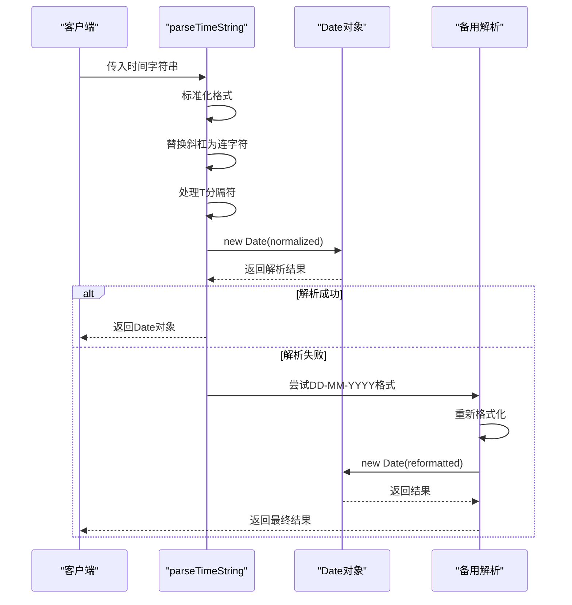
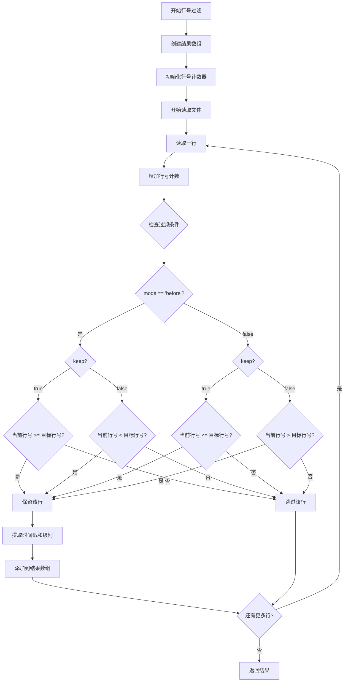
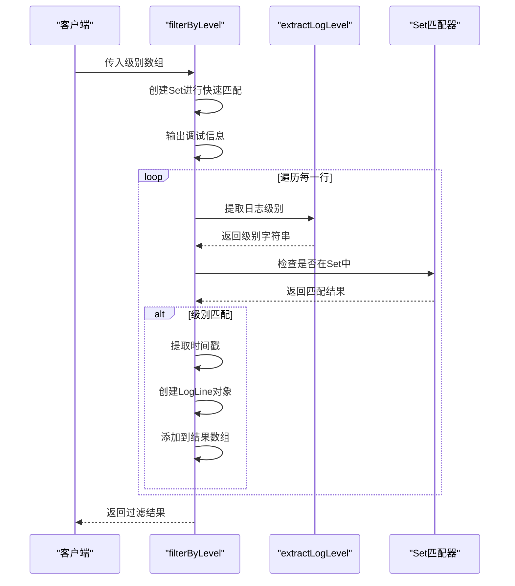
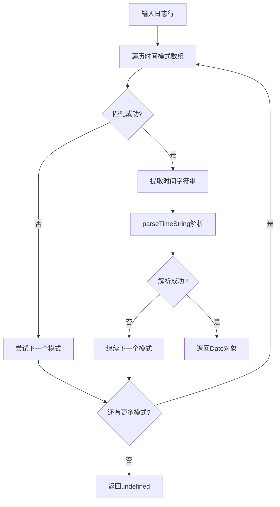
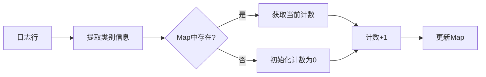

# 过滤逻辑处理

<cite>
**本文档引用的文件**
- [logProcessor.ts](file://src/logProcessor.ts)
- [extension.ts](file://src/extension.ts)
- [logViewerPanel.ts](file://src/logViewerPanel.ts)
- [README.md](file://README.md)
</cite>

## 目录
1. [简介](#简介)
2. [项目结构概览](#项目结构概览)
3. [核心过滤机制](#核心过滤机制)
4. [时间过滤详解](#时间过滤详解)
5. [行号过滤详解](#行号过滤详解)
6. [日志级别过滤详解](#日志级别过滤详解)
7. [关键信息提取机制](#关键信息提取机制)
8. [性能优化策略](#性能优化策略)
9. [使用示例与最佳实践](#使用示例与最佳实践)
10. [总结](#总结)

## 简介

logProcessor.ts是VSCode大日志文件查看器扩展的核心组件，实现了强大的多维度日志过滤机制。该系统支持按时间、行号和日志级别进行精确过滤，同时具备智能的时间戳解析和日志级别识别能力。通过流式读取和异步处理，系统能够高效处理GB级别的日志文件，为开发者提供快速、准确的日志分析工具。

## 项目结构概览

该项目采用模块化架构设计，主要包含以下核心文件：



**图表来源**
- [logProcessor.ts](file://src/logProcessor.ts#L4-L28)
- [logViewerPanel.ts](file://src/logViewerPanel.ts#L1-L50)

**章节来源**
- [logProcessor.ts](file://src/logProcessor.ts#L1-L807)
- [extension.ts](file://src/extension.ts#L1-L116)

## 核心过滤机制

LogProcessor类提供了三个主要的过滤方法，每个方法都针对不同的过滤维度：

### 过滤方法架构



**图表来源**
- [logProcessor.ts](file://src/logProcessor.ts#L4-L28)
- [logProcessor.ts](file://src/logProcessor.ts#L30-L807)

**章节来源**
- [logProcessor.ts](file://src/logProcessor.ts#L30-L807)

## 时间过滤详解

### filterByTime方法实现原理

时间过滤是系统最复杂的过滤功能之一，支持多种时间格式和灵活的过滤模式。

#### 方法签名与参数

| 参数 | 类型 | 描述 | 取值范围 |
|------|------|------|----------|
| timeStr | string | 目标时间字符串 | 支持多种时间格式 |
| mode | string | 过滤模式 | 'before' 或 'after' |
| keep | boolean | 保留策略 | true/false |

#### 时间解析流程



**图表来源**
- [logProcessor.ts](file://src/logProcessor.ts#L178-L230)
- [logProcessor.ts](file://src/logProcessor.ts#L776-L804)

#### 时间格式支持

系统支持多种常见的时间格式：

| 格式类型 | 正则表达式 | 示例 |
|----------|------------|------|
| 标准日期时间 | `\d{4}-\d{2}-\d{2}\s+\d{2}:\d{2}:\d{2}` | `2024-01-01 12:00:00` |
| 斜杠分隔 | `\d{4}\/\d{2}\/\d{2}\s+\d{2}:\d{2}:\d{2}` | `2024/01/01 12:00:00` |
| 方括号包裹 | `\[(\d{4}-\d{2}-\d{2}\s+\d{2}:\d{2}:\d{2})\]` | `[2024-01-01 12:00:00]` |
| 英式日期 | `\d{2}-\d{2}-\d{4}\s+\d{2}:\d{2}:\d{2}` | `01-01-2024 12:00:00` |
| ISO 8601 | `\d{4}-\d{2}-\d{2}T\d{2}:\d{2}:\d{2}` | `2024-01-01T12:00:00` |

#### 容错机制

parseTimeString方法实现了robust的时间解析容错机制：



**图表来源**
- [logProcessor.ts](file://src/logProcessor.ts#L776-L804)

**章节来源**
- [logProcessor.ts](file://src/logProcessor.ts#L178-L230)
- [logProcessor.ts](file://src/logProcessor.ts#L776-L804)

## 行号过滤详解

### filterByLineNumber方法实现

行号过滤提供了基于文件行号的精确控制能力，支持向前和向后的过滤模式。

#### 过滤逻辑对比

| 过滤模式 | keep=true | keep=false |
|----------|-----------|------------|
| before | 保留指定行及之后的所有行 | 保留指定行之前的所有行 | 
| after | 保留指定行之前的所有行 | 保留指定行及之后的所有行 |

#### 实现流程



**图表来源**
- [logProcessor.ts](file://src/logProcessor.ts#L291-L333)

**章节来源**
- [logProcessor.ts](file://src/logProcessor.ts#L291-L333)

## 日志级别过滤详解

### filterByLevel方法实现原理

日志级别过滤是最智能的过滤功能，支持多种级别组合和优先级匹配。

#### 级别优先级策略

系统按照以下优先级顺序匹配日志级别：

| 优先级 | 级别名称 | 匹配模式 | 示例 |
|--------|----------|----------|------|
| 1 | ERROR | ERROR, FATAL, SEVERE | `[ERROR]`, `ERROR` |
| 2 | WARN | WARN, WARNING | `[WARN]`, `WARNING` |
| 3 | INFO | INFO, INFORMATION | `[INFO]`, `INFORMATION` |
| 4 | DEBUG | DEBUG, TRACE, VERBOSE | `[DEBUG]`, `DEBUG` |

#### 过滤算法流程



**图表来源**
- [logProcessor.ts](file://src/logProcessor.ts#L649-L698)
- [logProcessor.ts](file://src/logProcessor.ts#L542-L561)

#### 快速匹配优化

系统实现了双重匹配策略：

1. **快速路径匹配**：优先使用正则表达式直接匹配时间戳后的级别
2. **后备模式匹配**：使用预定义的级别模式数组进行精确匹配

**章节来源**
- [logProcessor.ts](file://src/logProcessor.ts#L649-L698)
- [logProcessor.ts](file://src/logProcessor.ts#L542-L561)

## 关键信息提取机制

### 时间戳提取机制

extractTimestamp方法实现了智能的时间戳提取，支持多种格式的容错解析。

#### 提取流程



**图表来源**
- [logProcessor.ts](file://src/logProcessor.ts#L480-L492)

### 日志级别提取机制

extractLogLevel方法采用了智能的双重匹配策略：

#### 匹配优先级

1. **快速匹配**：检查时间戳后紧跟的级别关键字
2. **模式匹配**：使用预定义的正则表达式模式进行精确匹配

#### 类名、方法名和线程名提取

系统还提供了专门的方法来提取日志中的结构化信息：

| 方法 | 功能 | 正则表达式模式 |
|------|------|----------------|
| extractClassName | 提取Java类名 | `/]\s+([a-z][a-z0-9_.]*[A-Z][a-zA-Z0-9_]*)/` |
| extractMethodName | 提取方法名 | `/<([a-zA-Z_][a-zA-Z0-9_]*)>/` 或 `/([a-zA-Z_][a-zA-Z0-9_]*)接口/` |
| extractThreadName | 提取线程名 | `/\[([a-zA-Z0-9-_]+)\]/` |

**章节来源**
- [logProcessor.ts](file://src/logProcessor.ts#L480-L537)
- [logProcessor.ts](file://src/logProcessor.ts#L542-L561)

## 性能优化策略

### Map数据结构应用

在统计功能中，系统大量使用Map数据结构来提高性能：



**图表来源**
- [logProcessor.ts](file://src/logProcessor.ts#L576-L585)

### Set匹配优化

在filterByLevel方法中，使用Set数据结构进行快速级别匹配：

| 操作 | Array | Set | 性能提升 |
|------|-------|-----|----------|
| 查找元素 | O(n) | O(1) | 显著提升 |
| 插入元素 | O(1) | O(1) | 相同 |
| 删除元素 | O(n) | O(1) | 相同 |

### 避免重复解析

系统实现了智能的解析缓存机制：

1. **延迟解析**：只有在需要时才解析时间戳和级别
2. **结果复用**：在同一个过滤操作中复用已解析的结果
3. **流式处理**：逐行处理，避免一次性加载整个文件

### 内存管理策略

1. **流式读取**：使用readline模块按行读取，避免内存溢出
2. **及时释放**：处理完成后立即关闭文件流
3. **异步处理**：使用Promise避免阻塞主线程

**章节来源**
- [logProcessor.ts](file://src/logProcessor.ts#L576-L634)
- [logProcessor.ts](file://src/logProcessor.ts#L654-L655)

## 使用示例与最佳实践

### 时间过滤示例

```typescript
// 保留2024年1月1日之后的日志
const processor = new LogProcessor('app.log');
const results = await processor.filterByTime('2024-01-01 00:00:00', 'after', true);

// 删除2024年1月1日之前的所有日志
await processor.deleteByTime('2024-01-01 00:00:00', 'before');
```

### 行号过滤示例

```typescript
// 保留第1000行之后的所有日志
const results = await processor.filterByLineNumber(1000, 'after', true);

// 删除第1000行之前的所有日志
await processor.deleteByLine(1000, 'before');
```

### 级别过滤示例

```typescript
// 只保留ERROR和WARN级别的日志
const results = await processor.filterByLevel(['ERROR', 'WARN']);

// 统计各类别的日志数量
const stats = await processor.getStatistics();
console.log(`ERROR: ${stats.errorCount}`);
console.log(`WARN: ${stats.warnCount}`);
console.log(`INFO: ${stats.infoCount}`);
console.log(`DEBUG: ${stats.debugCount}`);
```

### 最佳实践建议

1. **时间过滤**：
   - 使用标准时间格式（YYYY-MM-DD HH:mm:ss）
   - 对于大文件，考虑使用时间范围缩小搜索范围
   - 在删除操作前做好数据备份

2. **行号过滤**：
   - 确保行号在有效范围内
   - 对于超大文件，谨慎使用行号过滤
   - 结合时间过滤可以获得更好的效果

3. **级别过滤**：
   - 使用Set进行级别匹配提高性能
   - 对于复杂的级别组合，考虑使用正则表达式搜索
   - 在统计功能中充分利用Map数据结构

4. **性能优化**：
   - 对于大文件，优先使用流式处理
   - 避免在循环中重复创建RegExp对象
   - 合理使用缓存机制

**章节来源**
- [logViewerPanel.ts](file://src/logViewerPanel.ts#L196-L257)
- [logProcessor.ts](file://src/logProcessor.ts#L649-L698)

## 总结

logProcessor.ts实现了一个功能强大、性能优异的日志过滤系统。通过多维度的过滤机制（时间、行号、级别），系统能够满足各种复杂的日志分析需求。其智能的信息提取机制、robust的容错处理和高效的性能优化策略，使得该系统能够在处理GB级别日志文件时保持出色的响应性能。

系统的主要优势包括：

1. **多维度过滤**：支持时间、行号和日志级别的精确控制
2. **智能解析**：自动识别多种时间格式和日志级别
3. **高性能**：使用流式处理和缓存机制优化性能
4. **容错性强**：完善的错误处理和格式转换机制
5. **易于扩展**：模块化设计便于功能扩展

这套过滤逻辑处理系统为开发者提供了一个强大而易用的日志分析工具，大大提高了日志处理的效率和准确性。