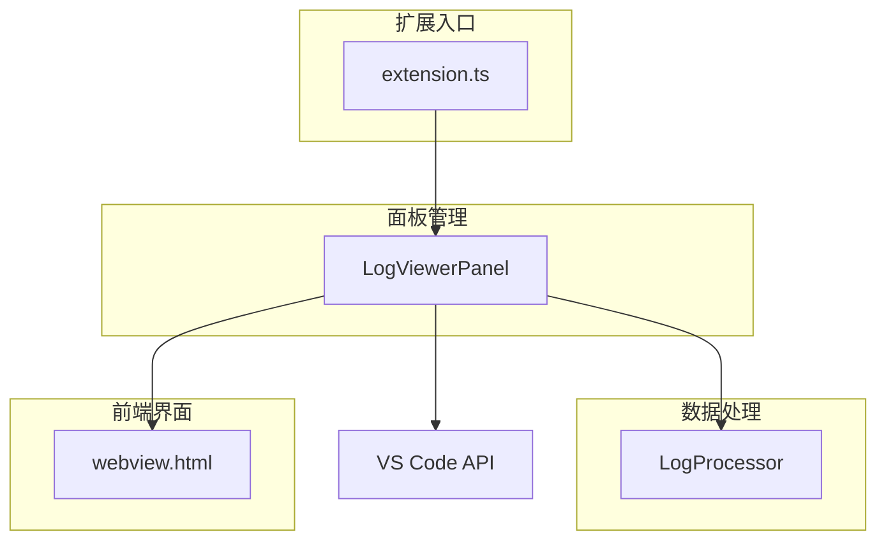
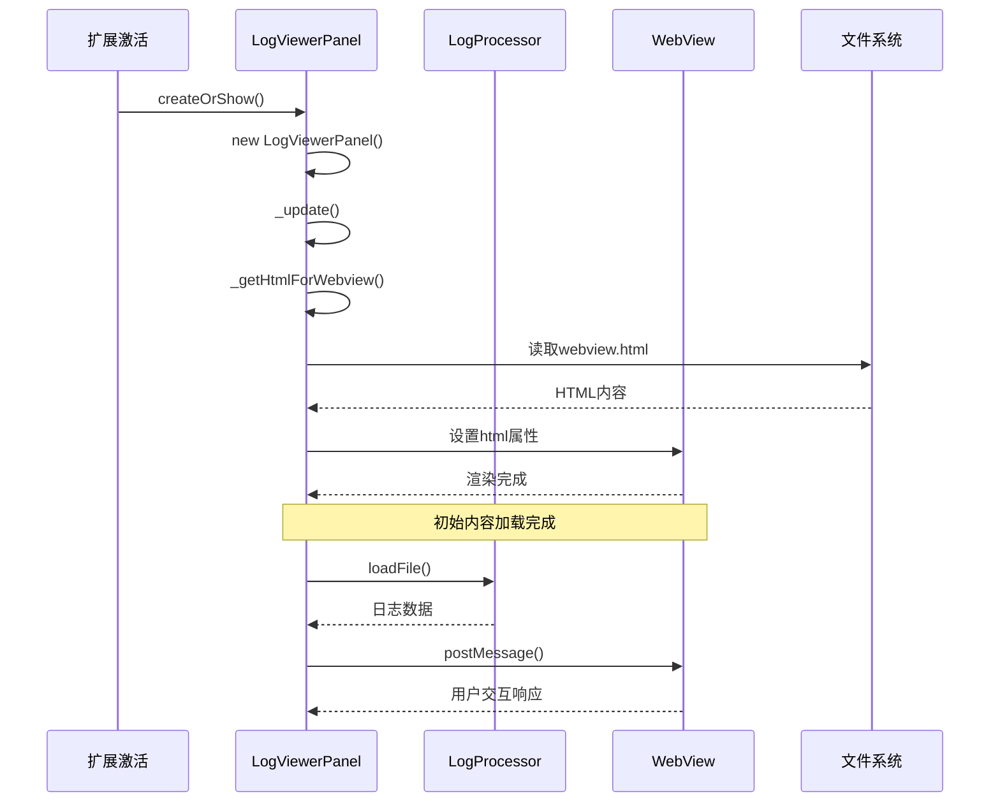
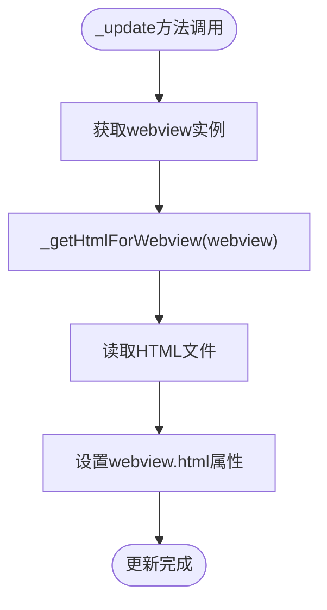
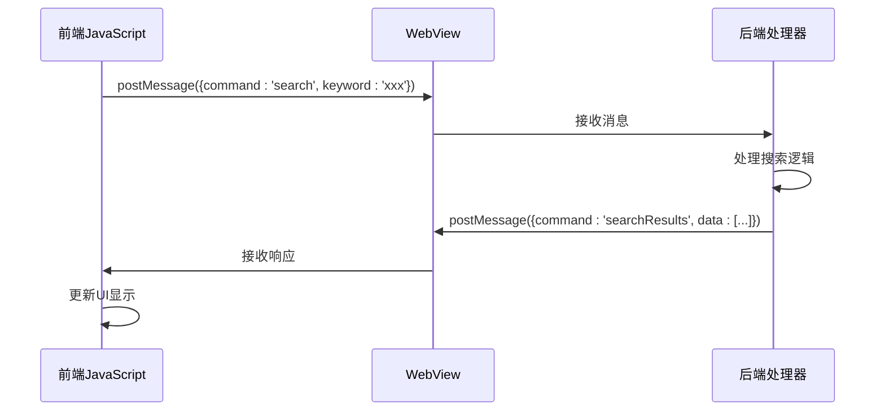
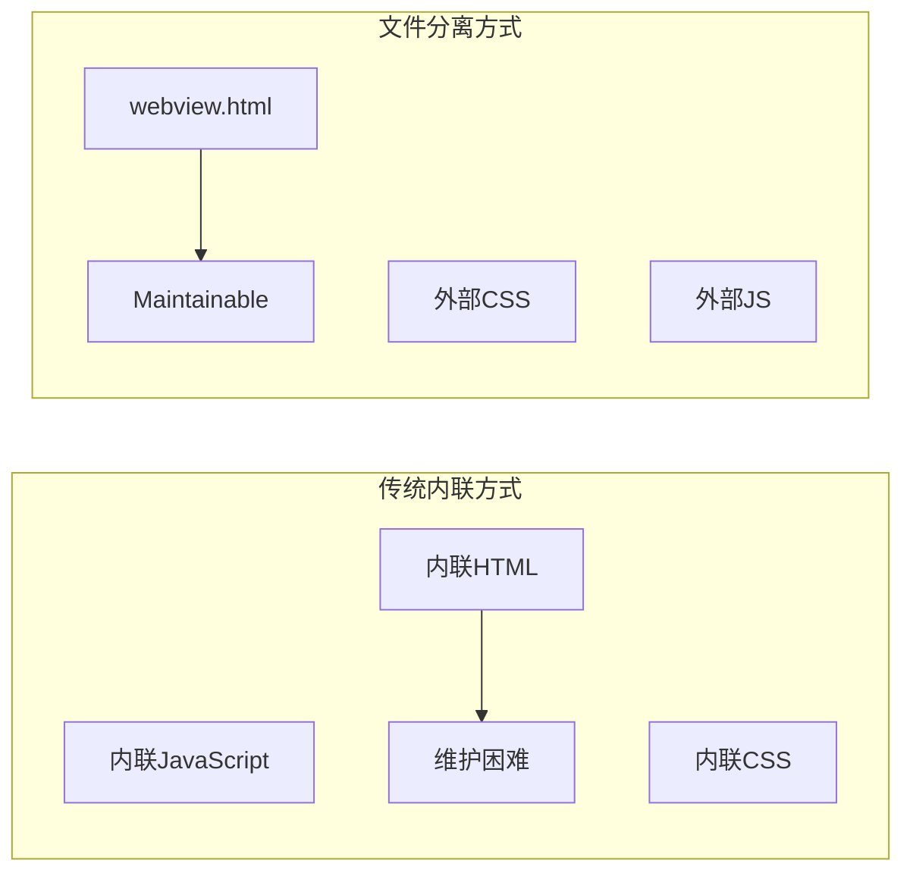
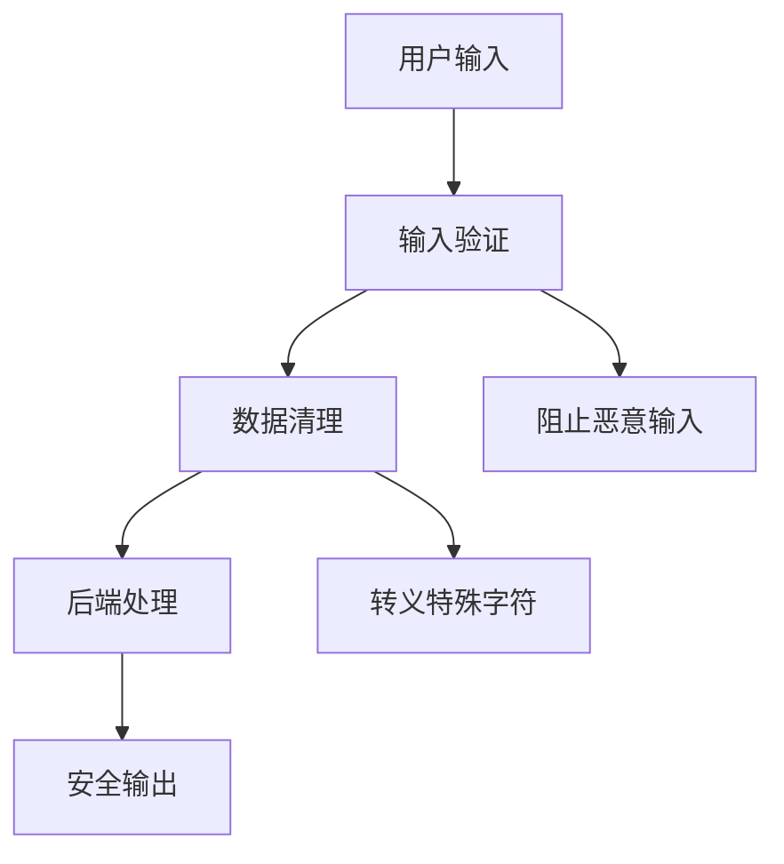

# UI内容更新与HTML注入

<cite>
**本文档引用的文件**
- [src/logViewerPanel.ts](file://src/logViewerPanel.ts)
- [src/webview.html](file://src/webview.html)
- [src/extension.ts](file://src/extension.ts)
- [src/logProcessor.ts](file://src/logProcessor.ts)
- [package.json](file://package.json)
</cite>

## 目录
1. [简介](#简介)
2. [项目架构概览](#项目架构概览)
3. [_private、_update和_getHtmlForWebview方法协作机制](#_private_update和_gethtmlforwebview方法协作机制)
4. [_getHtmlForWebview方法详细分析](#_gethtmlforwebview方法详细分析)
5. [localResourceRoots配置的安全访问机制](#localresourceroots配置的安全访问机制)
6. [enableScripts配置与JavaScript执行](#enablescripts配置与javascript执行)
7. [retainContextWhenHidden配置的状态保持](#retaincontextwhenhidden配置的状态保持)
8. [静态HTML文件加载的优势](#静态html文件加载的优势)
9. [安全风险与防范措施](#安全风险与防范措施)
10. [总结](#总结)

## 简介

本文档深入分析了一个VS Code扩展中的WebView内容初始化与更新机制，重点关注`_private`、`_update`和`_getHtmlForWebview`三个核心方法的协作关系。该系统实现了大日志文件的可视化查看功能，支持虚拟滚动、智能搜索、时间过滤等高级特性。

## 项目架构概览

该项目采用模块化架构设计，主要包含以下核心组件：



**图表来源**
- [src/extension.ts](file://src/extension.ts#L1-L116)
- [src/logViewerPanel.ts](file://src/logViewerPanel.ts#L1-L510)

**章节来源**
- [src/extension.ts](file://src/extension.ts#L1-L116)
- [src/logViewerPanel.ts](file://src/logViewerPanel.ts#L1-L510)

## _private、_update和_getHtmlForWebview方法协作机制

### 方法调用流程

这三个方法形成了一个完整的WebView内容初始化和更新循环：



**图表来源**
- [src/logViewerPanel.ts](file://src/logViewerPanel.ts#L14-L48)
- [src/logViewerPanel.ts](file://src/logViewerPanel.ts#L486-L495)

### _update方法的作用

_update方法是整个WebView内容更新的核心入口点：



**图表来源**
- [src/logViewerPanel.ts](file://src/logViewerPanel.ts#L486-L489)

**章节来源**
- [src/logViewerPanel.ts](file://src/logViewerPanel.ts#L486-L495)

## _getHtmlForWebview方法详细分析

_getHtmlForWebview方法负责从文件系统读取预构建的HTML模板并直接返回，实现静态HTML的加载机制。

### 实现细节

该方法的核心实现逻辑如下：

1. **路径构建**：使用`path.join`方法构建HTML文件的绝对路径
2. **同步读取**：使用`fs.readFileSync`同步读取文件内容
3. **字符编码**：明确指定`utf8`编码确保文本正确解码
4. **直接返回**：将读取的HTML字符串直接返回给调用者

### 优势特点

- **性能优化**：同步读取避免了异步回调，提高初始化速度
- **简单可靠**：直接返回文件内容，无需额外处理
- **缓存友好**：每次都需要重新读取，确保内容最新

**章节来源**
- [src/logViewerPanel.ts](file://src/logViewerPanel.ts#L491-L494)

## localResourceRoots配置的安全访问机制

### 配置作用

`localResourceRoots`配置在创建WebView时指定允许访问的本地资源根目录：

```typescript
{
    localResourceRoots: [extensionUri]
}
```

### 安全机制

1. **白名单控制**：只允许访问指定的根目录及其子目录
2. **路径限制**：防止跨目录访问攻击
3. **资源隔离**：确保WebView只能访问扩展提供的资源

### 实际应用

在本项目中，`localResourceRoots`被设置为`extensionUri`，这意味着：
- WebView可以访问扩展根目录下的所有资源
- 但不能访问系统其他位置的文件
- 确保了资源访问的安全性和可控性

**章节来源**
- [src/logViewerPanel.ts](file://src/logViewerPanel.ts#L34)

## enableScripts配置与JavaScript执行

### 配置效果

`enableScripts: true`配置允许WebView中的JavaScript代码执行：

```typescript
{
    enableScripts: true
}
```

### 功能支持

该配置启用了以下前端功能：

1. **动态交互**：支持按钮点击、搜索框输入等用户交互
2. **实时更新**：通过postMessage与后端通信
3. **复杂逻辑**：支持高级的DOM操作和动画效果
4. **状态管理**：维护搜索结果、过滤状态等

### 技术实现

前端JavaScript通过以下方式与后端通信：



**图表来源**
- [src/logViewerPanel.ts](file://src/logViewerPanel.ts#L54-L98)

**章节来源**
- [src/logViewerPanel.ts](file://src/logViewerPanel.ts#L32)

## retainContextWhenHidden配置的状态保持

### 配置作用

`retainContextWhenHidden: true`配置确保WebView在隐藏时保持其执行上下文：

```typescript
{
    retainContextWhenHidden: true
}
```

### 状态保持功能

该配置提供了以下重要特性：

1. **滚动位置保持**：用户切换标签页后仍能回到之前的滚动位置
2. **搜索结果保留**：搜索历史和结果状态不会丢失
3. **表单状态维护**：搜索框内容、过滤选项等保持不变
4. **加载进度保存**：部分加载的数据状态得以保留

### 性能考虑

虽然该配置提高了用户体验，但也带来了一些性能开销：
- 占用更多的内存资源
- 在隐藏状态下仍保持JavaScript执行环境
- 需要定期清理不再需要的状态

**章节来源**
- [src/logViewerPanel.ts](file://src/logViewerPanel.ts#L33)

## 静态HTML文件加载的优势

### 开发优势

直接读取HTML文件而非内联字符串具有以下优势：

1. **前端独立开发**：前端开发者可以独立于后端进行界面开发
2. **版本控制友好**：HTML文件可以单独进行版本管理和审查
3. **调试便利**：可以直接在浏览器中测试HTML/CSS/JavaScript
4. **维护成本低**：前端代码变更不需要修改TypeScript源码

### 技术优势



### 实际应用

在本项目中，这种设计使得：
- 前端团队可以专注于UI/UX优化
- 后端团队可以专注于数据处理逻辑
- 整体项目结构更加清晰和可维护

**章节来源**
- [src/logViewerPanel.ts](file://src/logViewerPanel.ts#L491-L494)

## 安全风险与防范措施

### XSS攻击风险

由于启用了`enableScripts: true`，系统面临以下XSS风险：

1. **恶意脚本注入**：用户可能尝试注入恶意JavaScript代码
2. **数据泄露**：敏感日志信息可能被恶意脚本窃取
3. **系统破坏**：恶意代码可能破坏系统稳定性

### 防范措施

项目采用了多层次的安全防护：

#### 1. 输入验证



#### 2. 内容安全策略

- **CSP头设置**：限制脚本执行范围
- **白名单机制**：只允许信任的资源加载
- **沙箱环境**：限制WebView的系统访问权限

#### 3. 数据隔离

- **本地资源限制**：通过`localResourceRoots`限制文件访问
- **API调用控制**：严格控制postMessage通信
- **权限最小化**：只授予必要的系统权限

#### 4. 运行时保护

- **异常捕获**：捕获并处理JavaScript运行时错误
- **超时控制**：防止长时间运行的恶意脚本
- **内存监控**：监控WebView内存使用情况

### 最佳实践建议

1. **定期安全审计**：定期检查前端代码安全性
2. **输入过滤**：对所有用户输入进行严格过滤
3. **权限审查**：定期审查WebView权限配置
4. **监控告警**：建立安全事件监控和告警机制

**章节来源**
- [src/logViewerPanel.ts](file://src/logViewerPanel.ts#L32-L34)

## 总结

本文档详细分析了VS Code扩展中WebView内容初始化与更新的完整机制。通过`_private`、`_update`和`_getHtmlForWebview`三个核心方法的协作，系统实现了高效、安全的HTML内容加载和更新。

### 关键技术要点

1. **模块化设计**：清晰的职责分离和模块化架构
2. **安全优先**：多层次的安全防护措施
3. **性能优化**：合理的资源加载和状态保持策略
4. **用户体验**：丰富的交互功能和良好的响应性能

### 设计优势

- **可维护性**：清晰的代码结构和职责分工
- **可扩展性**：模块化设计便于功能扩展
- **安全性**：完善的防护措施保障系统安全
- **性能**：优化的资源加载和状态管理

该系统为大日志文件的可视化处理提供了一个优秀的解决方案，展示了现代VS Code扩展开发的最佳实践。