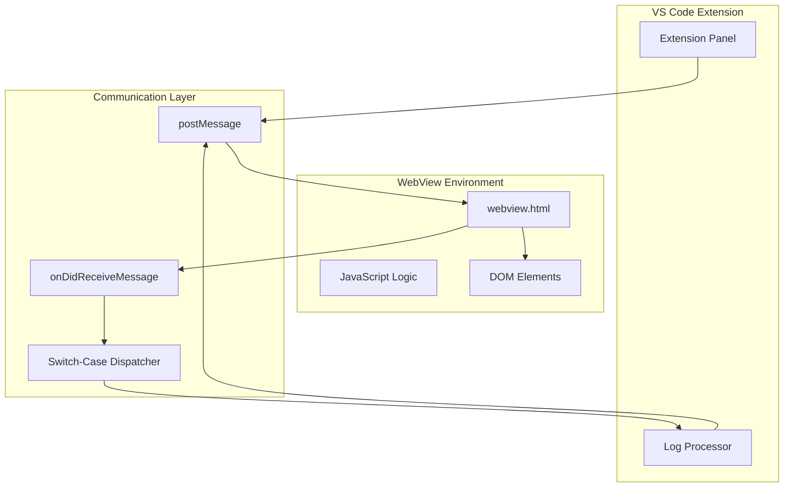
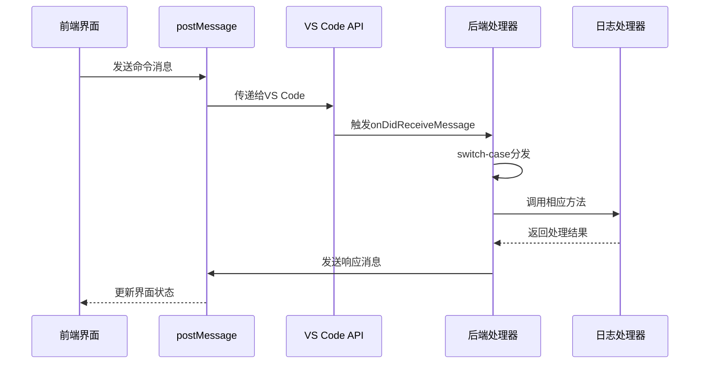
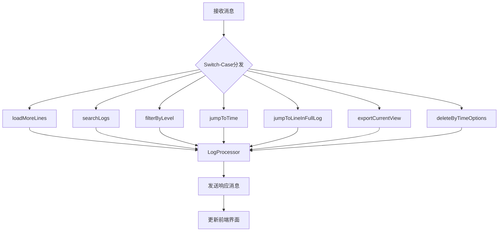
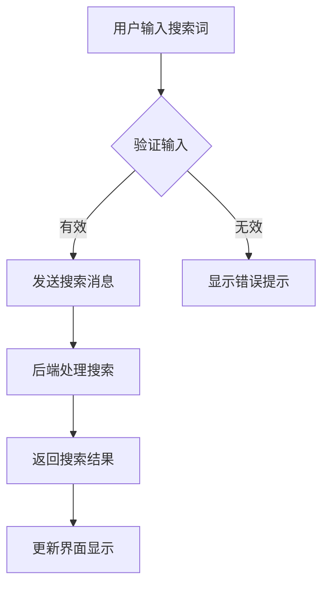

# WebView消息通信机制

<cite>
**本文档引用的文件**
- [logViewerPanel.ts](file://src/logViewerPanel.ts)
- [webview.html](file://src/webview.html)
- [extension.ts](file://src/extension.ts)
- [package.json](file://package.json)
</cite>

## 目录
1. [简介](#简介)
2. [系统架构概览](#系统架构概览)
3. [消息通信基础](#消息通信基础)
4. [前端消息发送机制](#前端消息发送机制)
5. [后端消息接收与处理](#后端消息接收与处理)
6. [消息数据结构设计](#消息数据结构设计)
7. [核心功能实现](#核心功能实现)
8. [安全性和性能考虑](#安全性和性能考虑)
9. [调试和故障排除](#调试和故障排除)
10. [最佳实践建议](#最佳实践建议)

## 简介

LogViewerPanel采用基于`postMessage`和`onDidReceiveMessage`的双向通信机制，实现了VS Code扩展中前端WebView与后端TypeScript代码之间的高效数据交换。这种通信机制支持实时搜索、过滤、跳转等核心功能，同时确保了跨域安全性。

## 系统架构概览



**图表来源**
- [logViewerPanel.ts](file://src/logViewerPanel.ts#L54-L101)
- [webview.html](file://src/webview.html#L1189-L1214)

## 消息通信基础

### 通信原理

WebView与扩展后端之间的通信基于VS Code提供的`WebviewPanel` API，通过以下两个核心方法实现：

1. **前端发送消息**：`vscode.postMessage({ command: '...', data: {...} })`
2. **后端接收消息**：`webview.onDidReceiveMessage(callback)`

### 通信流程



**节来源**
- [logViewerPanel.ts](file://src/logViewerPanel.ts#L54-L101)
- [webview.html](file://src/webview.html#L1189-L1214)

## 前端消息发送机制

### 消息发送函数

前端通过多种交互触发不同类型的消息发送：

#### 搜索功能
```javascript
// 关键词搜索
vscode.postMessage({
    command: 'search',
    keyword: keyword,
    reverse: isReverse
});

// 正则表达式搜索
vscode.postMessage({
    command: 'regexSearch',
    pattern: pattern,
    flags: 'gi',
    reverse: isReverse
});
```

#### 过滤功能
```javascript
// 级别过滤
vscode.postMessage({
    command: 'filterByLevel',
    levels: ['ERROR', 'WARN', 'INFO']
});
```

#### 导航功能
```javascript
// 跳转到时间点
vscode.postMessage({
    command: 'jumpToTime',
    timeStr: timeString
});

// 跳转到行号
vscode.postMessage({
    command: 'jumpToLineInFullLog',
    lineNumber: lineNumber
});
```

#### 数据导出
```javascript
// 导出当前视图
vscode.postMessage({
    command: 'exportLogs',
    lines: allLines
});
```

### 消息发送时机

前端消息发送通常发生在以下场景：
- 用户点击搜索按钮
- 更改过滤条件
- 执行导航操作
- 触发数据导出

**节来源**
- [webview.html](file://src/webview.html#L1903-L2008)
- [webview.html](file://src/webview.html#L2011-L2015)

## 后端消息接收与处理

### 消息接收器

后端通过`onDidReceiveMessage`监听前端消息：

```typescript
this._panel.webview.onDidReceiveMessage(
    async message => {
        switch (message.command) {
            case 'loadMore':
                await this.loadMoreLines(message.startLine, message.count);
                break;
            case 'search':
                await this.searchLogs(message.keyword, message.reverse);
                break;
            case 'filterByLevel':
                await this.filterByLevel(message.levels);
                break;
            // ... 其他case分支
        }
    },
    null,
    this._disposables
);
```

### 消息处理器架构



**图表来源**
- [logViewerPanel.ts](file://src/logViewerPanel.ts#L56-L98)

### 错误处理机制

每个消息处理器都包含完整的错误处理：

```typescript
private async searchLogs(keyword: string, reverse: boolean = false) {
    try {
        const results = await this._logProcessor.search(keyword, reverse);
        this._panel.webview.postMessage({
            command: 'searchResults',
            data: {
                keyword: keyword,
                results: results
            }
        });
    } catch (error) {
        vscode.window.showErrorMessage(`搜索失败: ${error}`);
    }
}
```

**节来源**
- [logViewerPanel.ts](file://src/logViewerPanel.ts#L165-L178)

## 消息数据结构设计

### 基础消息格式

所有消息都遵循统一的数据结构：

```typescript
{
    command: string;    // 命令标识符
    data: any;         // 数据负载
}
```

### 命令分类体系

| 命令类别 | 命令名称 | 参数 | 功能描述 |
|---------|----------|------|----------|
| 数据加载 | `loadMore` | `startLine`, `count` | 加载更多日志行 |
| 搜索功能 | `search` | `keyword`, `reverse` | 关键词搜索 |
| 搜索功能 | `regexSearch` | `pattern`, `flags`, `reverse` | 正则表达式搜索 |
| 过滤功能 | `filterByLevel` | `levels` | 按日志级别过滤 |
| 导航功能 | `jumpToTime` | `timeStr` | 跳转到指定时间 |
| 导航功能 | `jumpToLineInFullLog` | `lineNumber` | 跳转到完整日志的指定行 |
| 导出功能 | `exportLogs` | `lines` | 导出当前视图日志 |
| 删除功能 | `deleteByTime` | `timeStr`, `mode` | 按时间删除日志 |
| 删除功能 | `deleteByLine` | `lineNumber`, `mode` | 按行号删除日志 |
| 统计功能 | `getStatistics` | 无 | 获取日志统计信息 |
| 状态通知 | `refresh` | 无 | 刷新当前视图 |
| 消息通知 | `showMessage` | `type`, `message` | 显示消息提示 |

### 响应消息格式

后端处理完成后，通过`postMessage`返回响应：

```typescript
// 搜索结果响应
{
    command: 'searchResults',
    data: {
        keyword: 'error',
        results: [
            { lineNumber: 123, content: '[ERROR] Something went wrong', level: 'ERROR' },
            // ... 其他匹配结果
        ]
    }
}

// 文件加载响应
{
    command: 'fileLoaded',
    data: {
        fileName: 'application.log',
        filePath: '/path/to/application.log',
        fileSize: '12.5',
        totalLines: 100000,
        lines: ['line1', 'line2', ...],
        allLoaded: false
    }
}
```

**节来源**
- [logViewerPanel.ts](file://src/logViewerPanel.ts#L132-L142)
- [logViewerPanel.ts](file://src/logViewerPanel.ts#L168-L174)

## 核心功能实现

### 搜索功能

#### 前端搜索流程


#### 后端搜索处理
```typescript
private async searchLogs(keyword: string, reverse: boolean = false) {
    try {
        const results = await this._logProcessor.search(keyword, reverse);
        this._panel.webview.postMessage({
            command: 'searchResults',
            data: {
                keyword: keyword,
                results: results
            }
        });
    } catch (error) {
        vscode.window.showErrorMessage(`搜索失败: ${error}`);
    }
}
```

### 过滤功能

#### 级别过滤实现
```typescript
private async filterByLevel(levels: string[]) {
    try {
        const results = await this._logProcessor.filterByLevel(levels);
        this._panel.webview.postMessage({
            command: 'filterResults',
            data: {
                levels: levels,
                results: results
            }
        });
    } catch (error) {
        vscode.window.showErrorMessage(`过滤失败: ${error}`);
    }
}
```

### 跳转功能

#### 时间跳转
```typescript
private async jumpToTime(timeStr: string) {
    try {
        const result = await this._logProcessor.findLineByTime(timeStr);
        
        if (result) {
            const startLine = Math.max(0, result.lineNumber - 500);
            const lines = await this._logProcessor.readLines(startLine, 1000);
            
            this._panel.webview.postMessage({
                command: 'jumpToTimeResult',
                data: {
                    success: true,
                    targetLineNumber: result.lineNumber,
                    lines: lines,
                    startLine: startLine
                }
            });
        } else {
            this._panel.webview.postMessage({
                command: 'jumpToTimeResult',
                data: {
                    success: false,
                    message: `未找到大于或等于 ${timeStr} 的日志`
                }
            });
        }
    } catch (error) {
        vscode.window.showErrorMessage(`定位失败: ${error}`);
        this._panel.webview.postMessage({
            command: 'jumpToTimeResult',
            data: {
                success: false,
                message: `定位失败: ${error}`
            }
        });
    }
}
```

**节来源**
- [logViewerPanel.ts](file://src/logViewerPanel.ts#L165-L178)
- [logViewerPanel.ts](file://src/logViewerPanel.ts#L409-L426)
- [logViewerPanel.ts](file://src/logViewerPanel.ts#L320-L359)

## 安全性和性能考虑

### 跨域安全性

VS Code WebView提供了内置的安全保护：

1. **同源策略**：WebView运行在受控环境中，防止恶意脚本注入
2. **API限制**：只能访问VS Code提供的有限API
3. **消息验证**：通过`command`字段严格验证消息来源和类型

### 性能优化

#### 分页加载
```typescript
private async loadMoreLines(startLine: number, count: number) {
    try {
        const lines = await this._logProcessor.readLines(startLine, count);
        this._panel.webview.postMessage({
            command: 'moreLines',
            data: {
                startLine: startLine,
                lines: lines
            }
        });
    } catch (error) {
        vscode.window.showErrorMessage(`加载日志行失败: ${error}`);
    }
}
```

#### 异步处理
所有耗时操作都使用`async/await`模式，避免阻塞主线程。

#### 内存管理
```typescript
public dispose() {
    LogViewerPanel.currentPanel = undefined;
    this._panel.dispose();
    
    while (this._disposables.length) {
        const x = this._disposables.pop();
        if (x) {
            x.dispose();
        }
    }
}
```

**节来源**
- [logViewerPanel.ts](file://src/logViewerPanel.ts#L150-L163)
- [logViewerPanel.ts](file://src/logViewerPanel.ts#L497-L508)

## 调试和故障排除

### 消息流跟踪

使用控制台日志跟踪消息通信：

```typescript
// 前端消息发送时
console.log('📤 发送消息:', message);

// 后端接收消息时
console.log('📥 接收消息:', message.command, message.data);

// 后端处理完成时
console.log('📤 发送响应:', response);
```

### 常见问题诊断

#### 消息未到达后端
1. 检查`vscode.postMessage()`调用是否正确
2. 确认WebView已正确初始化
3. 验证消息格式是否符合预期

#### 后端处理异常
1. 检查`switch-case`分支是否包含对应命令
2. 验证参数传递是否正确
3. 查看VS Code输出面板中的错误信息

#### 前端响应缺失
1. 检查`window.addEventListener('message', ...)`是否注册
2. 验证响应消息的`command`字段是否匹配
3. 确认DOM更新逻辑是否正确执行

### 调试技巧

```javascript
// 在webview.html中添加调试信息
window.addEventListener('message', event => {
    const message = event.data;
    console.log('[DEBUG] 收到消息:', message.command, message.data);
    
    switch (message.command) {
        case 'fileLoaded':
            console.log('[DEBUG] 文件加载完成，总行数:', message.data.totalLines);
            break;
        case 'searchResults':
            console.log('[DEBUG] 搜索完成，找到结果:', message.data.results.length);
            break;
    }
});
```

**节来源**
- [webview.html](file://src/webview.html#L1189-L1214)

## 最佳实践建议

### 消息设计原则

1. **单一职责**：每个`command`只负责一个特定功能
2. **参数最小化**：只传递必要的参数，避免冗余数据
3. **一致性命名**：使用清晰、一致的命令和参数命名
4. **错误处理**：为所有消息处理添加适当的错误处理

### 性能优化建议

1. **批量操作**：对于大量数据处理，考虑批量传输而非逐条处理
2. **缓存机制**：对频繁访问的数据实施缓存策略
3. **懒加载**：实现按需加载，避免一次性加载过多数据
4. **防抖处理**：对高频触发的操作（如搜索）实施防抖机制

### 代码组织建议

```typescript
// 建议的消息处理器组织方式
private async handleMessage(message: any) {
    try {
        switch (message.command) {
            case 'search':
                return await this.handleSearch(message);
            case 'filter':
                return await this.handleFilter(message);
            case 'jump':
                return await this.handleJump(message);
            default:
                throw new Error(`未知命令: ${message.command}`);
        }
    } catch (error) {
        console.error('消息处理失败:', error);
        return this.createErrorResponse(error);
    }
}

private createErrorResponse(error: any): any {
    return {
        command: 'error',
        data: {
            message: error.message,
            stack: error.stack
        }
    };
}
```

### 测试策略

1. **单元测试**：为每个消息处理器编写单元测试
2. **集成测试**：测试完整的消息通信流程
3. **边界测试**：测试极端情况下的消息处理
4. **性能测试**：验证大数据量下的消息处理性能

通过遵循这些最佳实践，可以构建稳定、高效的WebView消息通信机制，为用户提供流畅的交互体验。