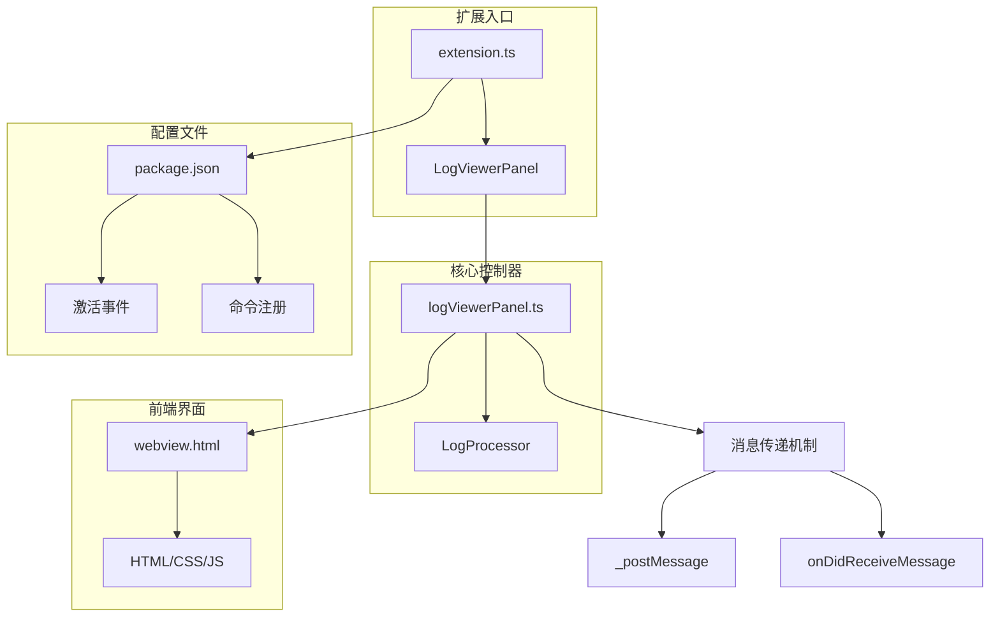
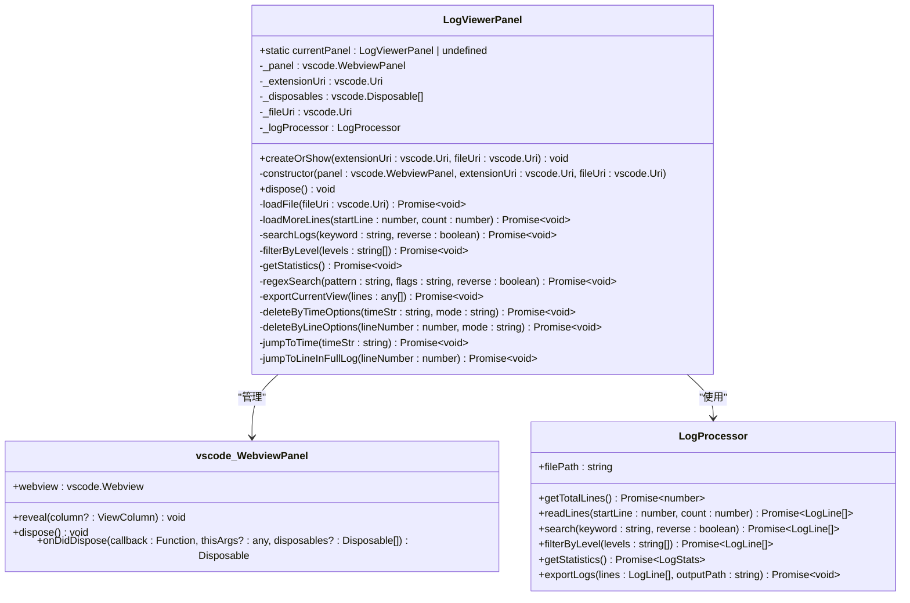
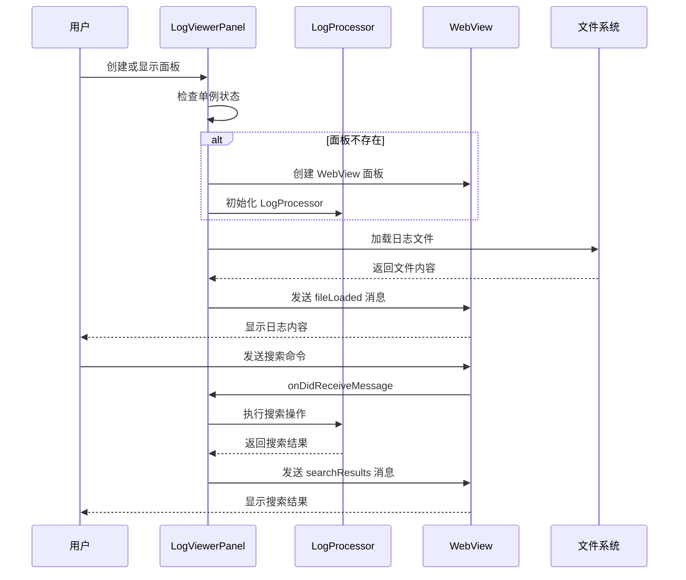
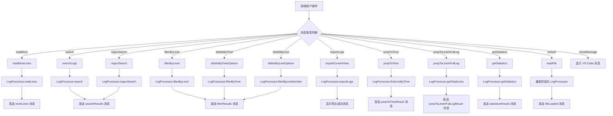
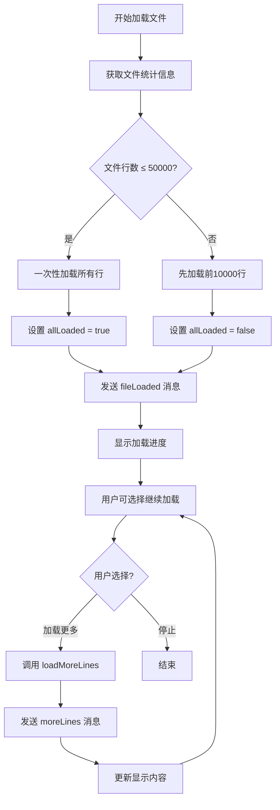
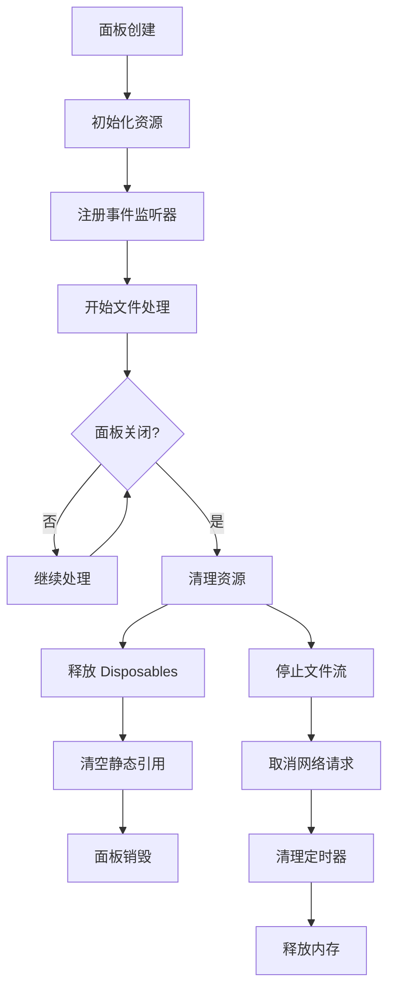
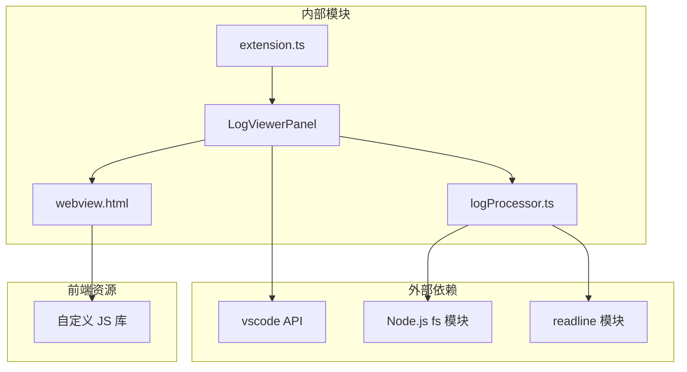
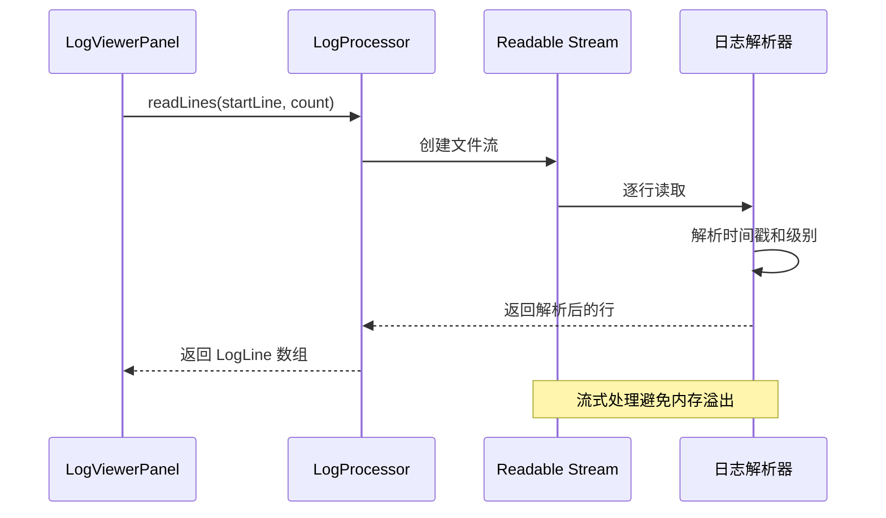
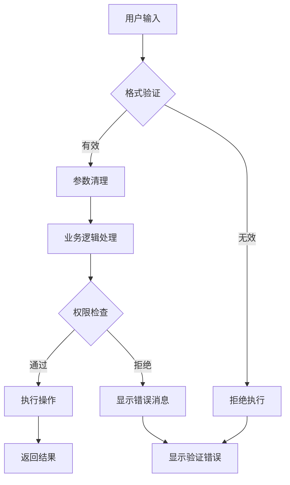
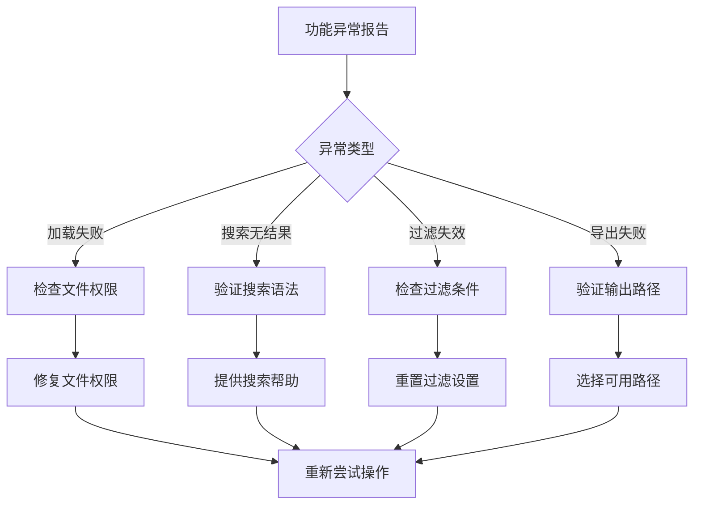

# logViewerPanel.ts - 日志查看器面板

<cite>
**本文档引用的文件**
- [logViewerPanel.ts](file://src/logViewerPanel.ts)
- [webview.html](file://src/webview.html)
- [logProcessor.ts](file://src/logProcessor.ts)
- [extension.ts](file://src/extension.ts)
- [package.json](file://package.json)
</cite>

## 目录
1. [简介](#简介)
2. [项目结构概览](#项目结构概览)
3. [核心组件分析](#核心组件分析)
4. [架构概览](#架构概览)
5. [详细组件分析](#详细组件分析)
6. [依赖关系分析](#依赖关系分析)
7. [性能优化策略](#性能优化策略)
8. [安全考虑](#安全考虑)
9. [故障排除指南](#故障排除指南)
10. [总结](#总结)

## 简介

logViewerPanel.ts 是 VS Code 扩展中的核心控制器组件，实现了 MVC 架构模式中的控制器部分。该类负责管理 WebView 面板的生命周期、处理用户交互、协调前端与后端的数据交换，并通过单例模式确保同一时间只有一个日志查看器实例运行。

该组件采用现代 TypeScript 编程范式，集成了 VS Code 的 Webview API，提供了强大的日志文件处理能力，包括虚拟滚动、智能搜索、时间过滤、级别过滤、折叠重复日志等功能。

## 项目结构概览

该项目采用模块化的架构设计，主要文件组织如下：



**图表来源**
- [extension.ts](file://src/extension.ts#L1-L116)
- [logViewerPanel.ts](file://src/logViewerPanel.ts#L1-L510)
- [package.json](file://package.json#L1-L94)

**章节来源**
- [extension.ts](file://src/extension.ts#L1-L116)
- [logViewerPanel.ts](file://src/logViewerPanel.ts#L1-L510)
- [package.json](file://package.json#L1-L94)

## 核心组件分析

### 单例模式实现

LogViewerPanel 类通过静态属性 `currentPanel` 实现单例模式，确保系统中始终只有一个活跃的日志查看器实例：



**图表来源**
- [logViewerPanel.ts](file://src/logViewerPanel.ts#L6-L13)
- [logProcessor.ts](file://src/logProcessor.ts#L30-L807)

### WebView 配置选项

构造函数中 WebView 的配置选项体现了性能优化和用户体验的平衡：

| 配置项 | 值 | 含义 | 性能影响 |
|--------|-----|------|----------|
| `enableScripts` | `true` | 启用 JavaScript 支持 | 允许前端交互功能，但需注意 XSS 安全 |
| `retainContextWhenHidden` | `true` | 隐藏时保留上下文 | 减少重新加载开销，提高切换体验 |
| `localResourceRoots` | `[extensionUri]` | 允许访问的本地资源根目录 | 控制资源访问范围，增强安全性 |

**章节来源**
- [logViewerPanel.ts](file://src/logViewerPanel.ts#L26-L36)

## 架构概览

### MVC 架构模式

logViewerPanel.ts 在 MVC 架构中扮演控制器的角色，协调模型（LogProcessor）和视图（WebView）之间的交互：



**图表来源**
- [logViewerPanel.ts](file://src/logViewerPanel.ts#L14-L39)
- [logViewerPanel.ts](file://src/logViewerPanel.ts#L54-L98)

## 详细组件分析

### 消息处理机制

LogViewerPanel 实现了完整的双向通信机制，通过 `_postMessage` 和 `onDidReceiveMessage` 处理前端与后端的消息：



**图表来源**
- [logViewerPanel.ts](file://src/logViewerPanel.ts#L56-L98)

### 文件加载策略

针对不同大小的日志文件，LogViewerPanel 实现了智能的加载策略：



**图表来源**
- [logViewerPanel.ts](file://src/logViewerPanel.ts#L107-L148)

### 性能优化实现

#### 虚拟滚动机制

对于大型日志文件，系统实现了虚拟滚动技术，只渲染可见区域的内容：

| 优化策略 | 实现方式 | 性能收益 |
|----------|----------|----------|
| 惰性加载 | 按需加载日志行 | 减少初始加载时间 |
| 分页显示 | 每次加载固定行数 | 控制内存使用 |
| 流式处理 | 使用 readline 流读取 | 避免内存溢出 |
| 缓存机制 | retainContextWhenHidden | 提高切换速度 |

#### 内存管理



**图表来源**
- [logViewerPanel.ts](file://src/logViewerPanel.ts#L497-L508)

**章节来源**
- [logViewerPanel.ts](file://src/logViewerPanel.ts#L54-L98)
- [logViewerPanel.ts](file://src/logViewerPanel.ts#L107-L148)

## 依赖关系分析

### 组件间依赖关系



**图表来源**
- [extension.ts](file://src/extension.ts#L1-L3)
- [logViewerPanel.ts](file://src/logViewerPanel.ts#L1-L5)
- [logProcessor.ts](file://src/logProcessor.ts#L1-L3)

### 循环依赖防范

系统通过以下策略避免循环依赖：

1. **明确的职责分离**：LogViewerPanel 负责控制逻辑，LogProcessor 负责数据处理
2. **单向数据流**：消息从前端流向后端，结果从后端流向前端
3. **接口抽象**：通过接口定义组件间的契约

**章节来源**
- [extension.ts](file://src/extension.ts#L1-L116)
- [logViewerPanel.ts](file://src/logViewerPanel.ts#L1-L510)
- [logProcessor.ts](file://src/logProcessor.ts#L1-L807)

## 性能优化策略

### 文件处理优化

#### 异步流式读取

LogProcessor 使用异步流式读取技术处理大型文件：



**图表来源**
- [logProcessor.ts](file://src/logProcessor.ts#L87-L131)

#### 智能缓存策略

| 缓存类型 | 存储内容 | 生命周期 | 清理时机 |
|----------|----------|----------|----------|
| 静态缓存 | 文件元信息 | 面板生命周期 | 面板销毁时 |
| 动态缓存 | 搜索结果 | 用户会话 | 用户清除时 |
| 内存缓存 | 当前显示行 | 页面可见时 | 页面隐藏时 |

### 前端性能优化

#### 虚拟滚动实现

前端采用虚拟滚动技术，只渲染可视区域的内容：


#### 事件防抖处理

关键操作采用防抖机制减少不必要的计算：

- 搜索输入：延迟 300ms 执行搜索
- 滚动事件：节流处理以提高流畅度
- 文件变更：批量处理而非实时响应

**章节来源**
- [logProcessor.ts](file://src/logProcessor.ts#L87-L131)
- [webview.html](file://src/webview.html#L1-L800)

## 安全考虑

### 跨域安全

#### WebView 安全策略

VS Code WebView 提供了多层安全保护：

| 安全特性 | 实现方式 | 防护目标 |
|----------|----------|----------|
| 同源策略 | localResourceRoots 限制 | 防止恶意脚本注入 |
| CSP 头部 | 内置内容安全策略 | 限制外部资源加载 |
| 脚本隔离 | enableScripts 可控 | 防止 XSS 攻击 |
| URI 验证 | 路径规范化检查 | 防止路径遍历攻击 |

#### 输入验证机制



**图表来源**
- [logViewerPanel.ts](file://src/logViewerPanel.ts#L180-L228)
- [logViewerPanel.ts](file://src/logViewerPanel.ts#L230-L278)

### 数据安全

#### 敏感信息处理

1. **文件路径验证**：严格验证文件路径的安全性
2. **内容脱敏**：对敏感日志内容进行脱敏处理
3. **临时文件管理**：及时清理临时文件避免信息泄露

#### 权限控制

- **只读操作**：默认情况下只允许读取日志文件
- **修改确认**：删除操作需要用户二次确认
- **备份机制**：重要操作前自动创建备份

**章节来源**
- [logViewerPanel.ts](file://src/logViewerPanel.ts#L180-L278)
- [logProcessor.ts](file://src/logProcessor.ts#L336-L409)

## 故障排除指南

### 常见问题诊断

#### 性能问题

| 问题症状 | 可能原因 | 解决方案 |
|----------|----------|----------|
| 面板加载缓慢 | 文件过大 | 启用虚拟滚动，分批加载 |
| 内存占用过高 | 缓存过多 | 调整缓存策略，定期清理 |
| 搜索响应慢 | 正则表达式复杂 | 优化正则模式，添加超时限制 |
| 滚动卡顿 | DOM 元素过多 | 实现虚拟滚动 |

#### 功能异常



### 调试技巧

#### 日志记录

系统内置了详细的日志记录机制：

```typescript
// 关键操作的日志记录示例
console.log('📤 前端发送过滤请求 - 级别:', levels);
console.log('📥 后端返回结果数量:', results.length);
if (results.length > 0) {
    console.log('👀 第一条结果 - 级别:', results[0].level, '内容:', results[0].content.substring(0, 100));
}
```

#### 错误处理

每个异步操作都包含了完善的错误处理：

```typescript
try {
    // 主要业务逻辑
} catch (error) {
    vscode.window.showErrorMessage(`操作失败: ${error}`);
    // 记录详细错误信息
    console.error('❌ 操作失败:', error);
}
```

**章节来源**
- [logViewerPanel.ts](file://src/logViewerPanel.ts#L409-L427)
- [logViewerPanel.ts](file://src/logViewerPanel.ts#L165-L178)

## 总结

logViewerPanel.ts 作为 VS Code 扩展中的核心控制器，展现了现代软件架构的最佳实践：

### 设计亮点

1. **单例模式**：通过静态属性确保资源的有效利用
2. **MVC 架构**：清晰的职责分离和数据流控制
3. **异步处理**：充分利用现代 JavaScript 的异步特性
4. **性能优化**：虚拟滚动、流式处理等技术的应用
5. **安全保障**：多层次的安全防护机制

### 技术创新

- **智能文件加载**：根据文件大小动态调整加载策略
- **双向通信**：通过 postMessage 实现高效的前后端通信
- **事件驱动**：基于事件的松耦合架构设计
- **资源管理**：完善的生命周期管理和资源清理机制

### 应用价值

该组件不仅解决了大日志文件处理的技术难题，还为 VS Code 生态系统提供了一个可扩展的日志分析解决方案。其设计理念和实现技术可以广泛应用于类似的大型文件处理场景，具有重要的参考价值和推广意义。

通过深入理解 logViewerPanel.ts 的设计思想和实现细节，开发者可以更好地掌握 VS Code 扩展开发的核心技术，为构建高质量的编辑器插件奠定坚实基础。