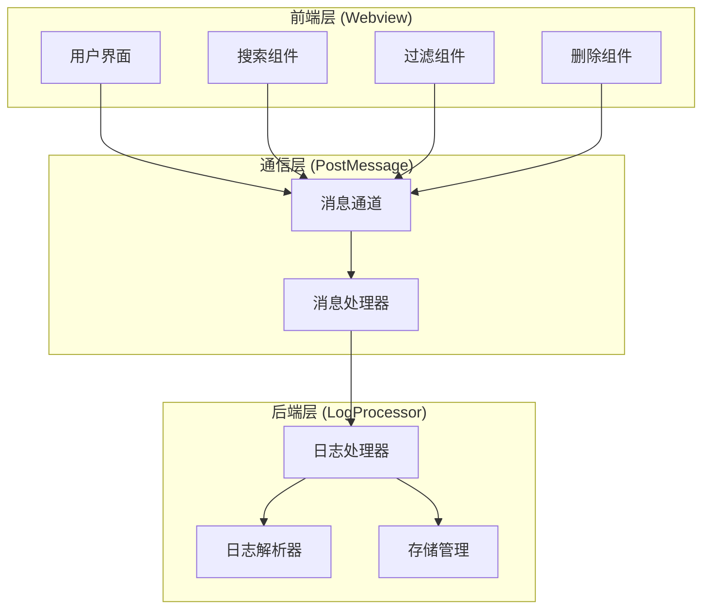
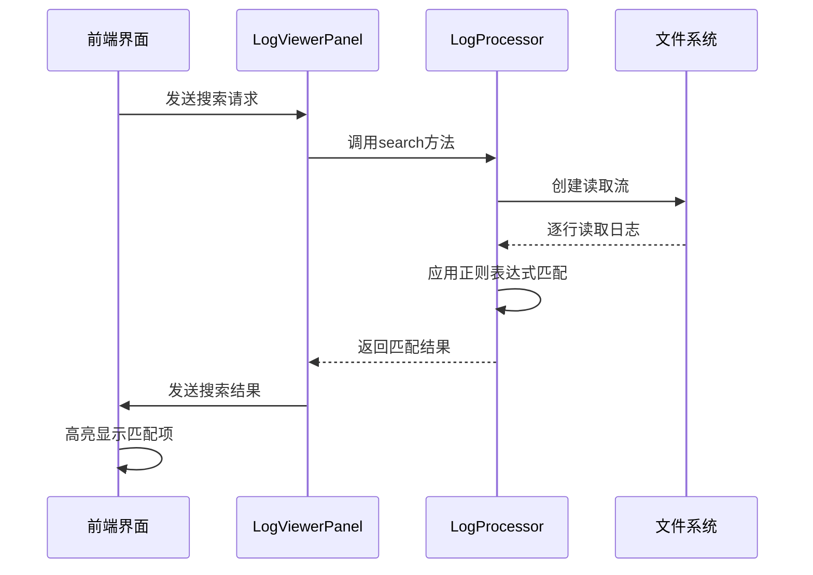
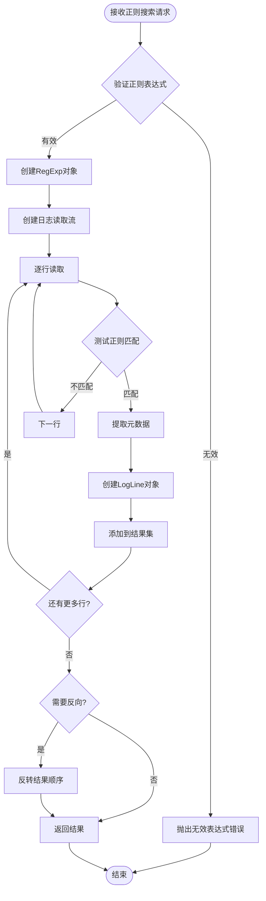
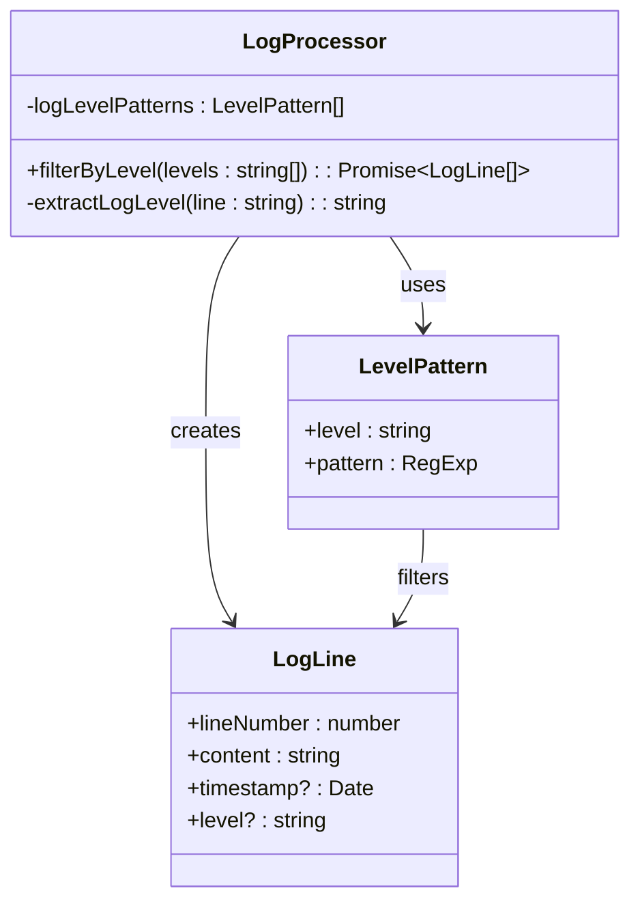
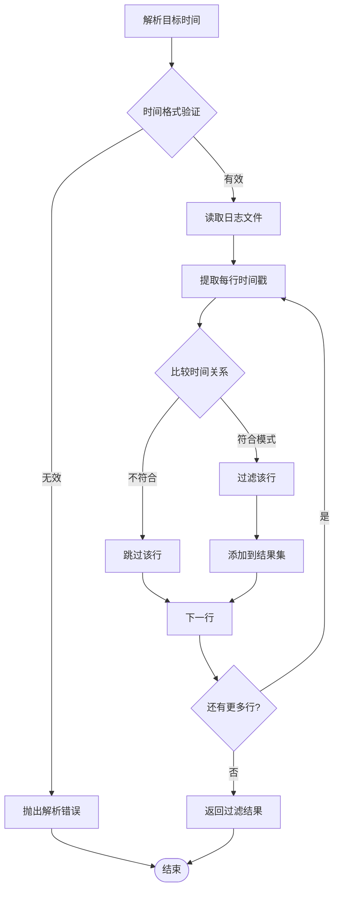
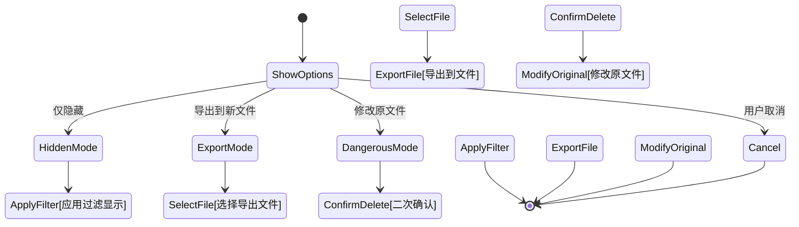
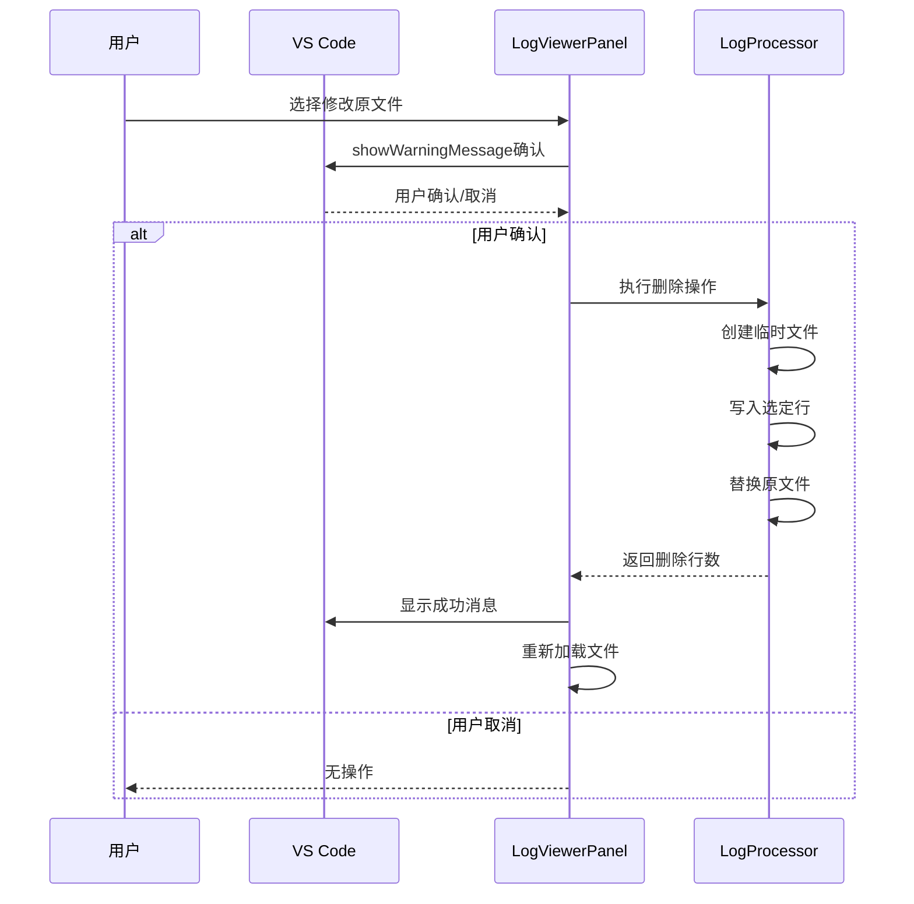
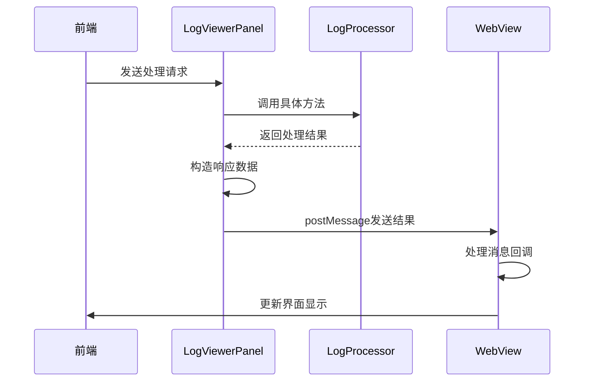
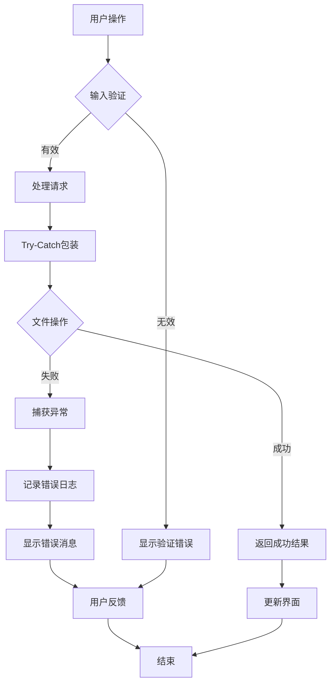
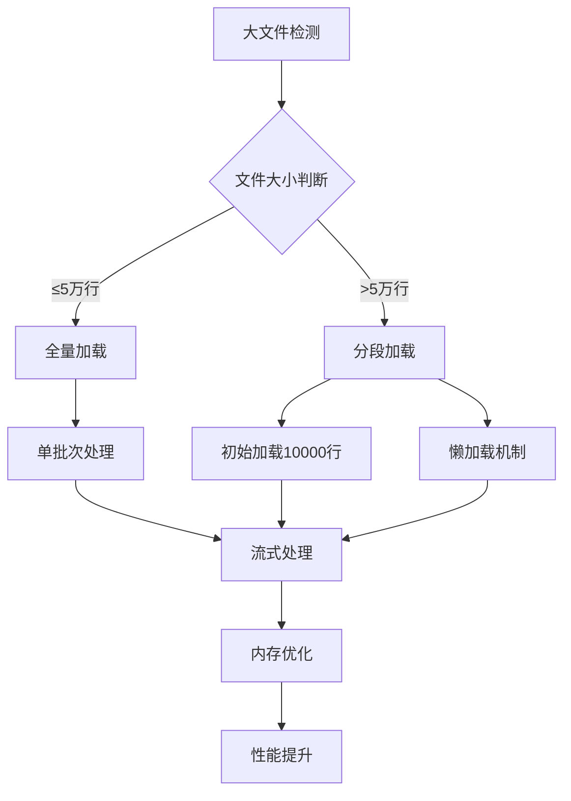

# 搜索与过滤功能实现

<cite>
**本文档引用的文件**
- [logViewerPanel.ts](file://src/logViewerPanel.ts)
- [logProcessor.ts](file://src/logProcessor.ts)
- [extension.ts](file://src/extension.ts)
- [webview.html](file://src/webview.html)
</cite>

## 目录
1. [项目概述](#项目概述)
2. [核心架构](#核心架构)
3. [搜索功能实现](#搜索功能实现)
4. [过滤功能实现](#过滤功能实现)
5. [删除功能实现](#删除功能实现)
6. [前后端通信机制](#前后端通信机制)
7. [错误处理与安全机制](#错误处理与安全机制)
8. [性能优化策略](#性能优化策略)
9. [总结](#总结)

## 项目概述

LogViewerPanel是一个基于VS Code扩展的日志分析工具，提供了强大的多维度日志处理功能。该系统采用前后端分离架构，前端负责用户界面和交互，后端负责日志处理和数据分析。

### 主要功能特性

- **关键词搜索**：支持普通文本和正则表达式搜索
- **多级别过滤**：按日志级别（ERROR、WARN、INFO、DEBUG）进行过滤
- **时间范围过滤**：按时间戳进行精确过滤
- **行号过滤**：按行号进行上下文过滤
- **危险操作保护**：多重确认机制防止误操作
- **高性能处理**：针对大文件的优化加载策略

## 核心架构

系统采用三层架构设计，确保功能模块的清晰分离和高效协作。



**图表来源**
- [logViewerPanel.ts](file://src/logViewerPanel.ts#L54-L97)
- [webview.html](file://src/webview.html#L1201-L1226)

**章节来源**
- [logViewerPanel.ts](file://src/logViewerPanel.ts#L5-L508)
- [logProcessor.ts](file://src/logProcessor.ts#L29-L805)

## 搜索功能实现

### 关键词搜索 (searchLogs)

关键词搜索是系统最基础的功能之一，支持大小写不敏感的文本匹配。



**图表来源**
- [logViewerPanel.ts](file://src/logViewerPanel.ts#L164-L177)
- [logProcessor.ts](file://src/logProcessor.ts#L132-L173)

#### 实现细节

1. **正则表达式构建**：使用`new RegExp(keyword, 'i')`创建大小写不敏感的搜索模式
2. **流式处理**：利用Node.js的readline模块实现流式读取，避免内存溢出
3. **结果缓存**：将匹配结果封装为LogLine对象，包含行号、内容、时间戳和级别信息
4. **反向搜索**：支持从后向前搜索，通过`results.reverse()`实现

### 正则搜索 (regexSearch)

正则搜索提供了更强大的模式匹配能力，支持复杂的搜索需求。



**图表来源**
- [logViewerPanel.ts](file://src/logViewerPanel.ts#L449-L463)
- [logProcessor.ts](file://src/logProcessor.ts#L701-L748)

**章节来源**
- [logViewerPanel.ts](file://src/logViewerPanel.ts#L164-L177)
- [logViewerPanel.ts](file://src/logViewerPanel.ts#L449-L463)
- [logProcessor.ts](file://src/logProcessor.ts#L132-L173)
- [logProcessor.ts](file://src/logProcessor.ts#L701-L748)

## 过滤功能实现

### 日志级别过滤 (filterByLevel)

日志级别过滤是最常用的过滤方式，支持多级别同时选择。



**图表来源**
- [logProcessor.ts](file://src/logProcessor.ts#L48-L55)
- [logProcessor.ts](file://src/logProcessor.ts#L649-L698)

#### 过滤逻辑详解

1. **级别识别**：通过预定义的正则表达式模式识别日志级别
2. **集合匹配**：将用户选择的级别转换为Set，提高查找效率
3. **流式处理**：同样采用流式读取，避免大文件内存问题
4. **结果聚合**：将匹配的行封装为LogLine对象返回

### 时间范围过滤

时间范围过滤支持按时间戳进行精确筛选，适用于长时间跨度的日志分析。

#### 核心算法



**图表来源**
- [logProcessor.ts](file://src/logProcessor.ts#L178-L230)

**章节来源**
- [logViewerPanel.ts](file://src/logViewerPanel.ts#L408-L426)
- [logProcessor.ts](file://src/logProcessor.ts#L649-L698)
- [logProcessor.ts](file://src/logProcessor.ts#L178-L230)

## 删除功能实现

删除功能是系统中最危险的操作，采用了多重保护机制。

### showWarningMessage选择操作模式

删除操作首先通过`showWarningMessage`让用户选择处理方式：



**图表来源**
- [logViewerPanel.ts](file://src/logViewerPanel.ts#L180-L227)
- [logViewerPanel.ts](file://src/logViewerPanel.ts#L229-L277)

### 三种处理模式对比

| 模式 | 安全性 | 操作影响 | 适用场景 |
|------|--------|----------|----------|
| 仅隐藏 | 最高 | 不修改文件，不影响备份 | 日常浏览、临时过滤 |
| 导出到新文件 | 高 | 创建副本，保留原始数据 | 需要保留历史记录 |
| 修改原文件 | 低 | 直接修改源文件，不可恢复 | 确认无误后的最终清理 |

### 危险操作的二次确认机制



**图表来源**
- [logViewerPanel.ts](file://src/logViewerPanel.ts#L279-L297)
- [logViewerPanel.ts](file://src/logViewerPanel.ts#L299-L317)

**章节来源**
- [logViewerPanel.ts](file://src/logViewerPanel.ts#L180-L227)
- [logViewerPanel.ts](file://src/logViewerPanel.ts#L229-L277)
- [logViewerPanel.ts](file://src/logViewerPanel.ts#L279-L317)

## 前后端通信机制

### PostMessage通信架构

系统采用VS Code提供的PostMessage机制实现前后端通信：

```mermaid
graph LR
subgraph "前端 (Webview HTML)"
JS[JavaScript逻辑]
DOM[DOM操作]
Events[事件监听]
end
subgraph "通信桥接"
PostMessage[postMessage API]
MessageHandler[消息处理器]
end
subgraph "后端 (LogViewerPanel)"
Panel[LogViewerPanel类]
Processor[LogProcessor实例]
FileSystem[文件系统]
end
JS --> PostMessage
PostMessage --> MessageHandler
MessageHandler --> Panel
Panel --> Processor
Processor --> FileSystem
FileSystem --> > Processor
Processor --> > Panel
Panel --> > MessageHandler
MessageHandler --> > PostMessage
PostMessage --> > DOM
DOM --> > Events
```

**图表来源**
- [logViewerPanel.ts](file://src/logViewerPanel.ts#L54-L97)
- [webview.html](file://src/webview.html#L1201-L1226)

### 消息类型定义

| 命令类型 | 参数 | 功能描述 |
|----------|------|----------|
| search | keyword, reverse | 执行关键词搜索 |
| regexSearch | pattern, flags, reverse | 执行正则表达式搜索 |
| filterByLevel | levels | 按日志级别过滤 |
| deleteByTime | timeStr, mode | 按时间删除日志 |
| deleteByLine | lineNumber, mode | 按行号删除日志 |
| jumpToTime | timeStr | 定位到指定时间 |
| exportLogs | lines | 导出当前视图 |

### 结果传输机制



**图表来源**
- [logViewerPanel.ts](file://src/logViewerPanel.ts#L164-L177)
- [logViewerPanel.ts](file://src/logViewerPanel.ts#L408-L426)

**章节来源**
- [logViewerPanel.ts](file://src/logViewerPanel.ts#L54-L97)
- [webview.html](file://src/webview.html#L1201-L1226)

## 错误处理与安全机制

### 多层次错误处理

系统在多个层面实现了完善的错误处理机制：



### 安全机制设计

1. **输入验证**：对用户输入的时间格式、行号等参数进行严格验证
2. **权限控制**：删除操作需要双重确认，防止误操作
3. **备份保护**：导出模式保留原始数据，避免数据丢失
4. **资源保护**：大文件采用流式处理，避免内存溢出

### 错误恢复策略

| 错误类型 | 恢复策略 | 用户体验 |
|----------|----------|----------|
| 文件读取失败 | 显示错误消息，提供刷新选项 | 友好提示，引导用户操作 |
| 正则表达式错误 | 显示语法错误，禁用搜索 | 实时反馈，帮助修正 |
| 时间格式错误 | 提供格式示例，重新输入 | 温馨提示，简化操作 |
| 磁盘空间不足 | 显示空间警告，建议清理 | 提前预警，避免失败 |

**章节来源**
- [logViewerPanel.ts](file://src/logViewerPanel.ts#L164-L177)
- [logViewerPanel.ts](file://src/logViewerPanel.ts#L449-L463)
- [logViewerPanel.ts](file://src/logViewerPanel.ts#L180-L227)

## 性能优化策略

### 大文件处理优化

针对大文件日志，系统采用了多种优化策略：



**图表来源**
- [logViewerPanel.ts](file://src/logViewerPanel.ts#L107-L146)

### 流式处理技术

1. **Readline流**：使用Node.js的readline模块实现逐行读取
2. **背压控制**：通过流的背压机制控制内存使用
3. **及时释放**：处理完成后立即关闭流，释放资源

### 搜索性能优化

| 优化技术 | 应用场景 | 性能提升 |
|----------|----------|----------|
| 正则表达式缓存 | 重复搜索 | 减少编译开销 |
| 流式处理 | 大文件搜索 | 避免内存溢出 |
| 结果分页 | 大量匹配结果 | 提升响应速度 |
| 智能索引 | 折叠模式 | 加速重复检测 |

**章节来源**
- [logViewerPanel.ts](file://src/logViewerPanel.ts#L107-L146)
- [logProcessor.ts](file://src/logProcessor.ts#L132-L173)
- [logProcessor.ts](file://src/logProcessor.ts#L701-L748)

## 总结

LogViewerPanel的日志处理系统通过精心设计的架构和多重优化策略，实现了高效、安全、易用的日志分析功能。其核心优势包括：

### 技术亮点

1. **前后端分离架构**：清晰的职责划分，便于维护和扩展
2. **流式处理技术**：支持超大文件的高效处理
3. **多重安全机制**：从输入验证到操作确认的全方位保护
4. **灵活的过滤体系**：支持多种维度的条件筛选

### 功能完整性

- **搜索功能**：支持关键词和正则表达式搜索，满足不同场景需求
- **过滤功能**：提供多级别、时间范围、行号等多种过滤方式
- **删除功能**：采用三重确认机制，确保操作安全
- **导出功能**：支持将结果导出为独立文件，保留分析结果

### 用户体验

- **实时反馈**：搜索和过滤操作即时响应
- **可视化展示**：高亮显示匹配结果，便于识别
- **智能提示**：提供格式示例和操作指导
- **错误友好**：友好的错误提示和恢复建议

该系统为开发者提供了强大而安全的日志分析工具，在保证功能完整性的同时，充分考虑了性能和安全性，是现代日志处理工具的优秀实践。