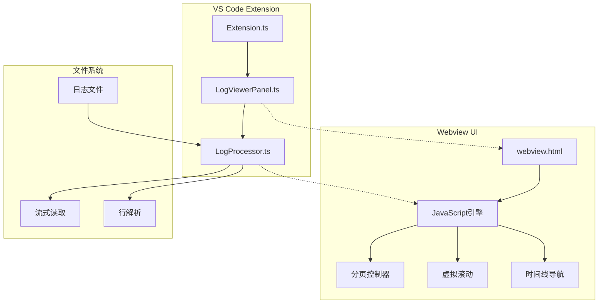
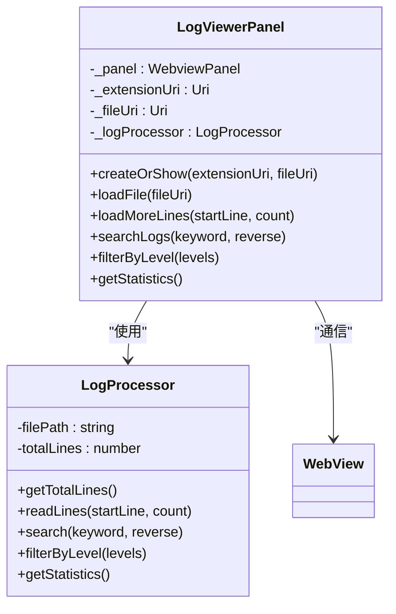
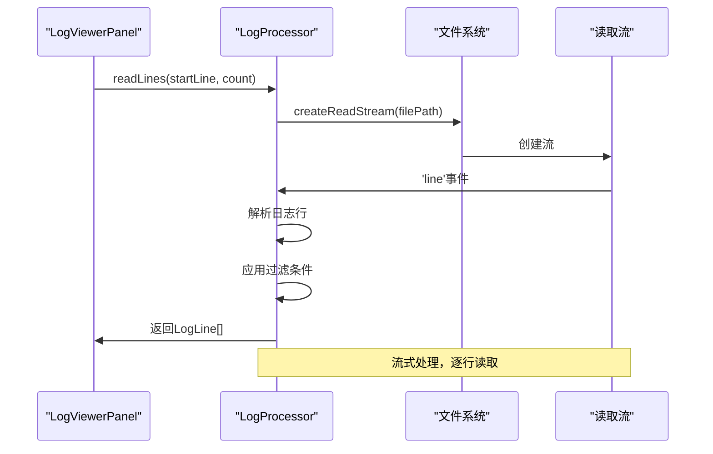
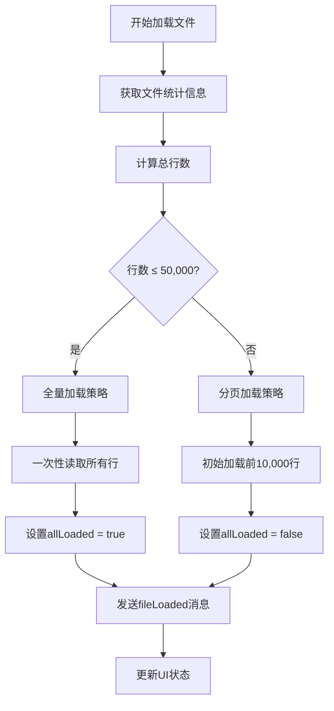
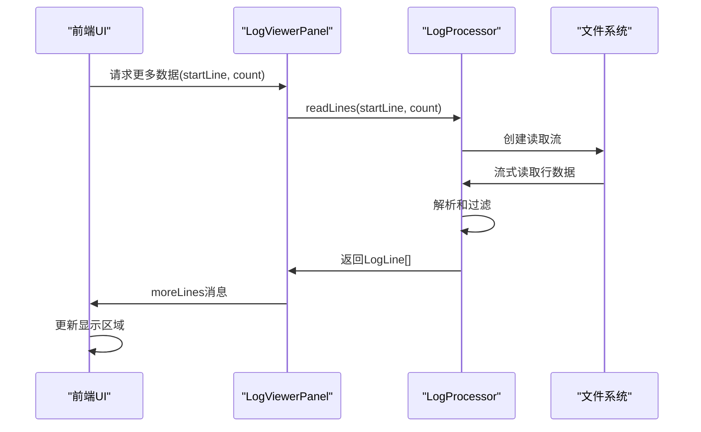
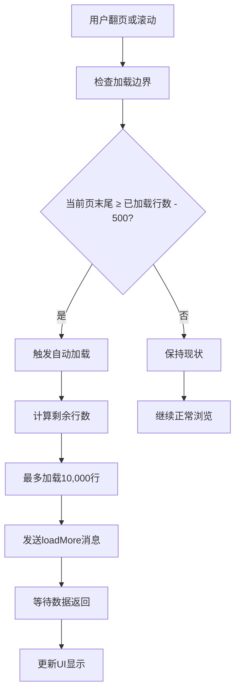
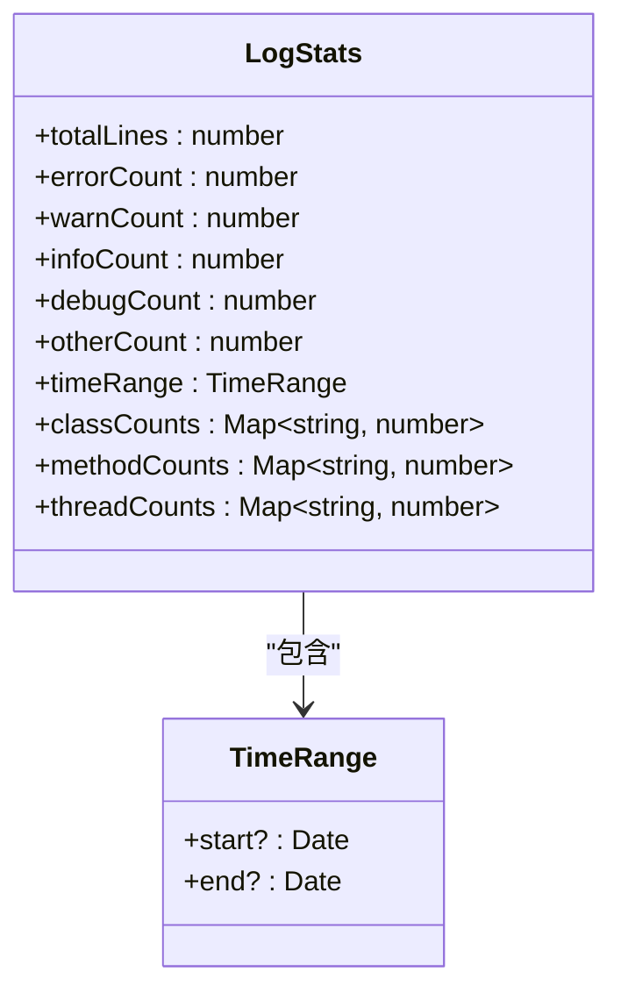
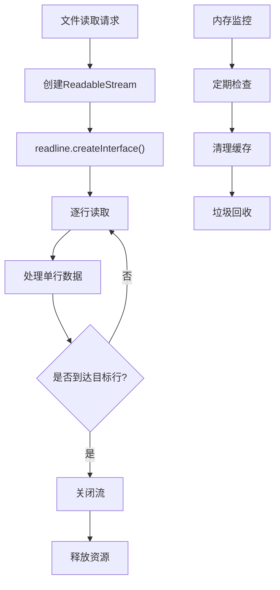
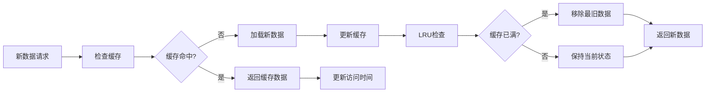
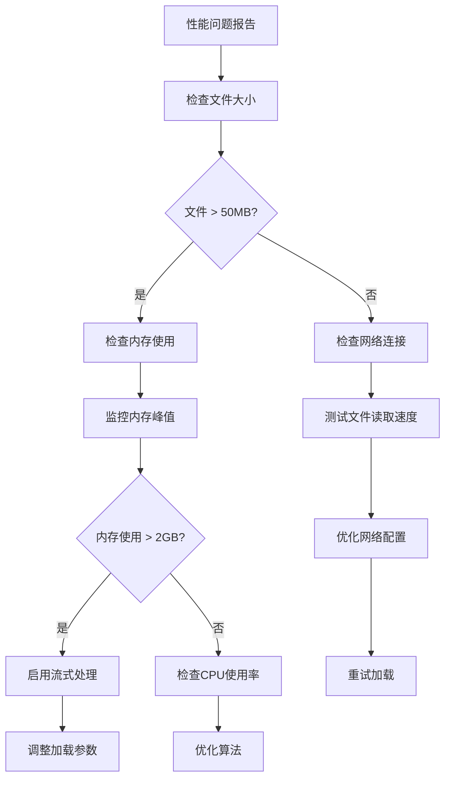

# 文件加载与性能优化

<cite>
**本文档引用的文件**
- [logViewerPanel.ts](file://src/logViewerPanel.ts)
- [logProcessor.ts](file://src/logProcessor.ts)
- [webview.html](file://src/webview.html)
- [extension.ts](file://src/extension.ts)
</cite>

## 目录
1. [引言](#引言)
2. [项目架构概览](#项目架构概览)
3. [核心组件分析](#核心组件分析)
4. [文件加载策略](#文件加载策略)
5. [虚拟滚动与增量加载](#虚拟滚动与增量加载)
6. [文件统计信息处理](#文件统计信息处理)
7. [内存管理策略](#内存管理策略)
8. [性能优化技术](#性能优化技术)
9. [故障排除指南](#故障排除指南)
10. [总结](#总结)

## 引言

大型日志文件查看器是一个专为处理超大日志文件而设计的VS Code扩展。该项目采用创新的分层加载策略，通过智能的文件大小检测和动态加载机制，在保证用户体验的同时最大化系统性能。本文档将深入分析其文件加载与性能优化的核心机制。

## 项目架构概览

该项目采用客户端-服务器架构，主要由以下核心模块组成：

**图表来源**
- [extension.ts](file://src/extension.ts#L1-L116)
- [logViewerPanel.ts](file://src/logViewerPanel.ts#L1-L510)
- [logProcessor.ts](file://src/logProcessor.ts#L1-L807)
- [webview.html](file://src/webview.html#L1-L4301)

## 核心组件分析

### LogViewerPanel - 主控制器

LogViewerPanel是整个系统的主控制器，负责协调文件加载、消息传递和UI更新：

**图表来源**
- [logViewerPanel.ts](file://src/logViewerPanel.ts#L6-L510)
- [logProcessor.ts](file://src/logProcessor.ts#L30-L807)

**章节来源**
- [logViewerPanel.ts](file://src/logViewerPanel.ts#L1-L510)
- [logProcessor.ts](file://src/logProcessor.ts#L1-L807)

### LogProcessor - 文件处理器

LogProcessor专门负责文件的读取、解析和处理，采用流式处理避免内存溢出：

**图表来源**
- [logProcessor.ts](file://src/logProcessor.ts#L90-L130)

**章节来源**
- [logProcessor.ts](file://src/logProcessor.ts#L90-L130)

## 文件加载策略

### 5万行阈值决策机制

系统采用智能的文件大小检测机制，根据文件行数动态选择加载策略：

**图表来源**
- [logViewerPanel.ts](file://src/logViewerPanel.ts#L118-L142)

### loadFile方法实现细节

loadFile方法是文件加载的核心入口，实现了智能的加载策略选择：

| 文件大小 | 行数范围 | 加载策略 | 初始加载行数 | allLoaded标志 |
|---------|---------|---------|-------------|-------------|
| 小文件 | ≤ 50,000行 | 全量加载 | 全部行数 | true |
| 大文件 | > 50,000行 | 分页加载 | 10,000行 | false |

**章节来源**
- [logViewerPanel.ts](file://src/logViewerPanel.ts#L107-L148)

## 虚拟滚动与增量加载

### loadMoreLines方法的增量加载机制

虚拟滚动系统通过loadMoreLines方法实现按需加载，支持大数据集的流畅浏览：

**图表来源**
- [logViewerPanel.ts](file://src/logViewerPanel.ts#L150-L163)
- [logProcessor.ts](file://src/logProcessor.ts#L90-L130)

### 自动加载触发机制

系统实现了智能的自动加载机制，当用户接近已加载数据末尾时自动触发：

**图表来源**
- [webview.html](file://src/webview.html#L3321-L3327)

**章节来源**
- [webview.html](file://src/webview.html#L3330-L3342)

## 文件统计信息处理

### 统计信息收集机制

系统提供了全面的文件统计信息收集功能，支持实时的文件分析：

**图表来源**
- [logProcessor.ts](file://src/logProcessor.ts#L11-L28)

### UI统计信息展示

统计信息通过专门的模态框展示，采用网格布局提供直观的数据视图：

| 统计类别 | 数据类型 | 展示方式 | 更新频率 |
|---------|---------|---------|---------|
| 基础统计 | 数字计数 | 大字体数值 | 实时 |
| 时间范围 | Date对象 | 格式化字符串 | 实时 |
| 分类统计 | Map结构 | 颜色编码图表 | 实时 |
| 元素统计 | Map结构 | 排序列表 | 实时 |

**章节来源**
- [logProcessor.ts](file://src/logProcessor.ts#L646-L698)
- [webview.html](file://src/webview.html#L366-L3700)

## 内存管理策略

### 流式读取的内存优化

系统采用流式读取技术，避免将整个文件加载到内存中：

**图表来源**
- [logProcessor.ts](file://src/logProcessor.ts#L96-L119)

### 缓存策略与LRU管理

前端实现了智能的缓存管理系统，支持LRU（最近最少使用）算法：

**图表来源**
- [webview.html](file://src/webview.html#L1265-L1266)

**章节来源**
- [logProcessor.ts](file://src/logProcessor.ts#L90-L130)
- [webview.html](file://src/webview.html#L1255-L1277)

## 性能优化技术

### 分页加载的性能平衡

系统通过分页机制在性能和用户体验之间取得平衡：

| 参数 | 小文件 | 大文件 | 优化目标 |
|------|-------|-------|---------|
| 页面大小 | 全部 | 100-1000行 | 减少DOM节点 |
| 加载粒度 | 全部 | 10,000行 | 控制内存使用 |
| 预加载距离 | 无 | 500行 | 提升响应速度 |
| 缓存策略 | 全量 | LRU | 平衡内存与性能 |

### 时间复杂度分析

| 操作 | 时间复杂度 | 空间复杂度 | 优化策略 |
|------|-----------|-----------|---------|
| 文件加载 | O(n) | O(1) | 流式读取 |
| 行搜索 | O(n) | O(k) | k为匹配行数 |
| 级别过滤 | O(n) | O(k) | 单次扫描 |
| 时间过滤 | O(n) | O(k) | 流式处理 |

**章节来源**
- [webview.html](file://src/webview.html#L1270-L1277)
- [logViewerPanel.ts](file://src/logViewerPanel.ts#L118-L142)

## 故障排除指南

### 常见性能问题诊断

当遇到性能问题时，可以通过以下步骤进行诊断：

### 内存溢出预防措施

系统实现了多层次的内存保护机制：

1. **流式读取限制**：每次读取不超过10,000行
2. **缓存大小控制**：前端缓存最多100,000行
3. **自动清理机制**：定期清理未使用的数据
4. **异常处理**：捕获内存不足异常并优雅降级

**章节来源**
- [logProcessor.ts](file://src/logProcessor.ts#L90-L130)
- [webview.html](file://src/webview.html#L3333-L3342)

## 总结

大型日志文件查看器通过精心设计的分层架构和智能的性能优化策略，成功解决了超大文件处理的技术挑战。其核心优势包括：

1. **智能加载策略**：基于文件大小的自适应加载机制
2. **流式处理**：避免内存溢出的大文件处理能力
3. **虚拟滚动**：支持无限数据集的流畅浏览体验
4. **实时统计**：全面的文件分析和可视化功能
5. **内存优化**：多层次的内存管理和保护机制

这些技术的综合应用使得该扩展能够在处理超大日志文件时保持良好的性能表现，为开发者提供了强大的日志分析工具。通过持续的性能监控和优化，系统能够适应不断增长的数据规模需求。